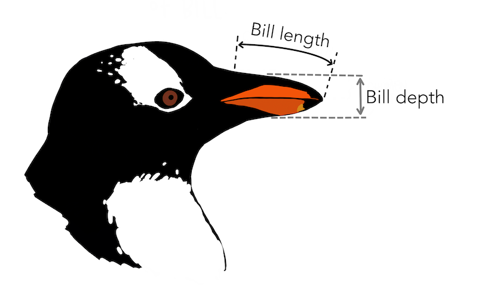

# (PART) Introduction to data {.unnumbered}

# Hello data {#data-hello}

::: {.chapterintro data-latex=""}
Scientists seek to answer questions using rigorous methods and careful observations.
These observations -- collected from the likes of field notes, surveys, and experiments -- form the backbone of a statistical investigation and are called **data**.
Statistics is the study of how best to collect, analyze, and draw conclusions from data.
In this first chapter, we focus on both the properties of data and on the collection of data.
:::


## Case study: Using stents to prevent strokes {#case-study-stents-strokes}

In this section we introduce a classic challenge in statistics: evaluating the efficacy of a medical treatment.
Terms in this section, and indeed much of this chapter, will all be revisited later in the text.
The plan for now is simply to get a sense of the role statistics can play in practice.

An experiment is designed to study the effectiveness of stents in treating patients at risk of stroke [@chimowitz2011stenting].
Stents are small mesh tubes that are placed inside narrow or weak arteries to assist in patient recovery after cardiac events and reduce the risk of an additional heart attack or death.

Many doctors have hoped that there would be similar benefits for patients at risk of stroke.
We start by writing the principal question the researchers hope to answer:

> Does the use of stents reduce the risk of stroke?

The researchers who asked this question conducted an experiment with 451 at-risk patients.
Each volunteer patient was randomly assigned to one of two groups:

-   **Treatment group**. Patients in the treatment group received a stent and medical management. The medical management included medications, management of risk factors, and help in lifestyle modification.
-   **Control group**. Patients in the control group received the same medical management as the treatment group, but they did not receive stents.

Researchers randomly assigned 224 patients to the treatment group and 227 to the control group.
In this study, the control group provides a reference point against which we can measure the medical impact of stents in the treatment group.

Researchers studied the effect of stents at two time points: 30 days after enrollment and 365 days after enrollment.
The results of 5 patients are summarized in Table \@ref(tab:stentStudyResultsDF).
Patient outcomes are recorded as `stroke` or `no event`, representing whether or not the patient had a stroke during that time period.

::: {.data data-latex=""}
The data from this study can be found in the [openintro](http://openintrostat.github.io/openintro) package: [`stent30`](http://openintrostat.github.io/openintro/reference/stent30.html) and [`stent365`](http://openintrostat.github.io/openintro/reference/stent365.html).
:::

\begin{table}

\caption{(\#tab:stentStudyResultsDF)Results for five patients from the stent study.}
\centering
\begin{tabular}[t]{rlll}
\toprule
patient & group & 30 days & 365 days\\
\midrule
\cellcolor{gray!6}{1} & \cellcolor{gray!6}{treatment} & \cellcolor{gray!6}{no event} & \cellcolor{gray!6}{no event}\\
2 & treatment & stroke & stroke\\
\cellcolor{gray!6}{3} & \cellcolor{gray!6}{treatment} & \cellcolor{gray!6}{no event} & \cellcolor{gray!6}{no event}\\
4 & treatment & no event & no event\\
\cellcolor{gray!6}{5} & \cellcolor{gray!6}{control} & \cellcolor{gray!6}{no event} & \cellcolor{gray!6}{no event}\\
\bottomrule
\end{tabular}
\end{table}

It would be difficult to answer a question on the impact of stents on the occurance of strokes for **all** of the study patients using these *individual* observations.
This question is better addressed by performing a statistical data analysis of *all* of the observations.
Table \@ref(tab:stentStudyResultsDFsummary) summarizes the raw data in a more helpful way.
In this table, we can quickly see what happened over the entire study.
For instance, to identify the number of patients in the treatment group who had a stroke within 30 days after the treatment, we look in the leftmost column (30 days), at the intersection of treatment and stroke: 33.
To identify the number of control patients who did not have a stroke after 365 days after receiving treatment, we look at the rightmost column (365 days), at the intersection of control and no event: 199.

\begin{table}

\caption{(\#tab:stentStudyResultsDFsummary)Descriptive statistics for the stent study.}
\centering
\begin{tabular}[t]{lrrrr}
\toprule
\multicolumn{1}{c}{ } & \multicolumn{2}{c}{30 days} & \multicolumn{2}{c}{365 days} \\
\cmidrule(l{3pt}r{3pt}){2-3} \cmidrule(l{3pt}r{3pt}){4-5}
 & stroke & no event & stroke & no event\\
\midrule
\cellcolor{gray!6}{treatment} & \cellcolor{gray!6}{33} & \cellcolor{gray!6}{191} & \cellcolor{gray!6}{45} & \cellcolor{gray!6}{179}\\
control & 13 & 214 & 28 & 199\\
\cellcolor{gray!6}{Total} & \cellcolor{gray!6}{46} & \cellcolor{gray!6}{405} & \cellcolor{gray!6}{73} & \cellcolor{gray!6}{378}\\
\bottomrule
\end{tabular}
\end{table}

::: {.guidedpractice data-latex=""}
Of the 224 patients in the treatment group, 45 had a stroke by the end of the first year.
Using these two numbers, compute the proportion of patients in the treatment group who had a stroke by the end of their first year.
(Note: answers to all Guided Practice exercises are provided in footnotes!)[^data-hello-1]
:::

[^data-hello-1]: The proportion of the 224 patients who had a stroke within 365 days: $45/224 = 0.20.$

We can compute summary statistics from the table to give us a better idea of how the impact of the stent treatment differed between the two groups.
A **summary statistic** is a single number summarizing data from a sample.
For instance, the primary results of the study after 1 year could be described by two summary statistics: the proportion of people who had a stroke in the treatment and control groups.


-   Proportion who had a stroke in the treatment (stent) group: $45/224 = 0.20 = 20\%.$
-   Proportion who had a stroke in the control group: $28/227 = 0.12 = 12\%.$

These two summary statistics are useful in looking for differences in the groups, and we are in for a surprise: an additional 8% of patients in the treatment group had a stroke!
This is important for two reasons.
First, it is contrary to what doctors expected, which was that stents would *reduce* the rate of strokes.
Second, it leads to a statistical question: do the data show a "real" difference between the groups?

This second question is subtle.
Suppose you flip a coin 100 times.
While the chance a coin lands heads in any given coin flip is 50%, we probably won't observe exactly 50 heads.
This type of variation is part of almost any type of data generating process.
It is possible that the 8% difference in the stent study is due to this natural variation.
However, the larger the difference we observe (for a particular sample size), the less believable it is that the difference is due to chance.
So what we are really asking is the following: if in fact stents have no effect, how likely is it that would observe such a large difference?

While we don't yet have statistical tools to fully address this question on our own, we can comprehend the conclusions of the published analysis: there was compelling evidence of harm by stents in this study of stroke patients.

**Be careful:** Do not generalize the results of this study to all patients and all stents.
This study looked at patients with very specific characteristics who volunteered to be a part of this study and who may not be representative of all stroke patients.
In addition, there are many types of stents and this study only considered the self-expanding Wingspan stent (Boston Scientific).
However, this study does leave us with an important lesson: we should keep our eyes open for surprises.

## Data basics {#data-basics}

Effective presentation and description of data is a first step in most analyses.
This section introduces one structure for organizing data as well as some terminology that will be used throughout this book.

### Observations, variables, and data matrices

Table \@ref(tab:loan50-df) displays six rows of a data set for 50 randomly sampled loans offered through Lending Club, which is a peer-to-peer lending company.
This dataset will be referred to as `loan50`.

::: {.data data-latex=""}
The data can be found in the [openintro](http://openintrostat.github.io/openintro) package: [`loan50`](http://openintrostat.github.io/openintro/reference/loans_full_schema.html).
:::

Each row in the table represents a single loan.
The formal name for a row is a **case** or \index{unit of observation}**observational unit**.
The columns represent characteristics of each loan, where each column is referred to as a **variable**.
For example, the first row represents a loan of \$22,000 with an interest rate of 10.90%, where the borrower is based in New Jersey (NJ) and has an income of \$59,000.


::: {.guidedpractice data-latex=""}
What is the grade of the first loan in Table \@ref(tab:loan50-df)?
And what is the home ownership status of the borrower for that first loan?
Reminder: for these Guided Practice questions, you can check your answer in the footnote.[^data-hello-2]
:::

[^data-hello-2]: The loan's grade is B, and the borrower rents their residence.

In practice, it is especially important to ask clarifying questions to ensure important aspects of the data are understood.
For instance, it is always important to be sure we know what each variable means and its units of measurement.
Descriptions of the variables in the `loan50` dataset are given in Table \@ref(tab:loan-50-variables).

\begin{table}

\caption{(\#tab:loan50-df)Six rows from the `loan50` data set}
\centering
\begin{tabular}[t]{lrrrllrl}
\toprule
  & loan\_amount & interest\_rate & term & grade & state & total\_income & homeownership\\
\midrule
\cellcolor{gray!6}{1} & \cellcolor{gray!6}{22000} & \cellcolor{gray!6}{10.90} & \cellcolor{gray!6}{60} & \cellcolor{gray!6}{B} & \cellcolor{gray!6}{NJ} & \cellcolor{gray!6}{59000} & \cellcolor{gray!6}{rent}\\
2 & 6000 & 9.92 & 36 & B & CA & 60000 & rent\\
\cellcolor{gray!6}{3} & \cellcolor{gray!6}{25000} & \cellcolor{gray!6}{26.30} & \cellcolor{gray!6}{36} & \cellcolor{gray!6}{E} & \cellcolor{gray!6}{SC} & \cellcolor{gray!6}{75000} & \cellcolor{gray!6}{mortgage}\\
4 & 6000 & 9.92 & 36 & B & CA & 75000 & rent\\
\cellcolor{gray!6}{5} & \cellcolor{gray!6}{25000} & \cellcolor{gray!6}{9.43} & \cellcolor{gray!6}{60} & \cellcolor{gray!6}{B} & \cellcolor{gray!6}{OH} & \cellcolor{gray!6}{254000} & \cellcolor{gray!6}{mortgage}\\
\addlinespace
6 & 6400 & 9.92 & 36 & B & IN & 67000 & mortgage\\
\bottomrule
\end{tabular}
\end{table}

\begin{table}

\caption{(\#tab:loan-50-variables)Variables and their descriptions for the `loan50` data set.}
\centering
\begin{tabular}[t]{l>{\raggedright\arraybackslash}p{30em}}
\toprule
variable & description\\
\midrule
\cellcolor{gray!6}{\ttfamily{loan\_amount}} & \cellcolor{gray!6}{Amount of the loan received, in US dollars.}\\
\ttfamily{interest\_rate} & Interest rate on the loan, in an annual percentage.\\
\cellcolor{gray!6}{\ttfamily{term}} & \cellcolor{gray!6}{The length of the loan, which is always set as a whole number of months.}\\
\ttfamily{grade} & Loan grade, which takes a values A through G and represents the quality of the loan and its likelihood of being repaid.\\
\cellcolor{gray!6}{\ttfamily{state}} & \cellcolor{gray!6}{US state where the borrower resides.}\\
\addlinespace
\ttfamily{total\_income} & Borrower's total income, including any second income, in US dollars.\\
\cellcolor{gray!6}{\ttfamily{homeownership}} & \cellcolor{gray!6}{Indicates whether the person owns, owns but has a mortgage, or rents.}\\
\bottomrule
\end{tabular}
\end{table}

The data in Table \@ref(tab:loan50-df) represent a **data frame**, which is a convenient and common way to organize data, especially if collecting data in a spreadsheet.
A data frame where each row is a unique case (observational unit), each column is to a variable, and each cell is a single value is commonly referred to as **tidy data** @wickham2014.


When recording data, use a tidy data frame unless you have a very good reason to use a different structure.
This structure allows new cases to be added as rows or new variables as new columns and facilitates visualization, summarization, and other statistical analyses.

::: {.guidedpractice data-latex=""}
The grades for assignments, quizzes, and exams in a course are often recorded in a gradebook that takes the form of a data frame.
How might you organize a course's grade data using a data frame?
Describe the observational units and variables.[^data-hello-3]
:::

[^data-hello-3]: There are multiple strategies that can be followed.
    One common strategy is to have each student represented by a row, and then add a column for each assignment, quiz, or exam.
    Under this setup, it is easy to review a single line to understand the grade history of a student.
    There should also be columns to include student information, such as one column to list student names.

::: {.guidedpractice data-latex=""}
We consider data for 3,142 counties in the United States, which includes the name of each county, the state where it resides, its population in 2017, the population change from 2010 to 2017, poverty rate, and nine additional characteristics.
How might these data be organized in a data frame?[^data-hello-4]
:::

[^data-hello-4]: Each county may be viewed as a case, and there are eleven pieces of information recorded for each case.
    A table with 3,142 rows and 14 columns could hold these data, where each row represents a county and each column represents a particular piece of information.

The data described in the Guided Practice above represents the **county** data set, which is shown as a data frame in Table \@ref(tab:county-df).
The variables as well as the variables in the dataset that did not fit in Table \@ref(tab:county-df) are described in Table \@ref(tab:county-variables).

\begin{table}

\caption{(\#tab:county-df)Six observations and six variables from the `county` data set.}
\centering
\begin{tabular}[t]{llrrrl}
\toprule
name & state & pop2017 & pop\_change & unemployment\_rate & median\_edu\\
\midrule
\cellcolor{gray!6}{Autauga County} & \cellcolor{gray!6}{Alabama} & \cellcolor{gray!6}{55504} & \cellcolor{gray!6}{1.48} & \cellcolor{gray!6}{3.86} & \cellcolor{gray!6}{some\_college}\\
Baldwin County & Alabama & 212628 & 9.19 & 3.99 & some\_college\\
\cellcolor{gray!6}{Barbour County} & \cellcolor{gray!6}{Alabama} & \cellcolor{gray!6}{25270} & \cellcolor{gray!6}{-6.22} & \cellcolor{gray!6}{5.90} & \cellcolor{gray!6}{hs\_diploma}\\
Bibb County & Alabama & 22668 & 0.73 & 4.39 & hs\_diploma\\
\cellcolor{gray!6}{Blount County} & \cellcolor{gray!6}{Alabama} & \cellcolor{gray!6}{58013} & \cellcolor{gray!6}{0.68} & \cellcolor{gray!6}{4.02} & \cellcolor{gray!6}{hs\_diploma}\\
\addlinespace
Bullock County & Alabama & 10309 & -2.28 & 4.93 & hs\_diploma\\
\bottomrule
\end{tabular}
\end{table}

\begin{table}

\caption{(\#tab:county-variables)Variables and their descriptions for the `county` data set.}
\centering
\begin{tabular}[t]{l>{\raggedright\arraybackslash}p{30em}}
\toprule
variable & description\\
\midrule
\cellcolor{gray!6}{\ttfamily{name}} & \cellcolor{gray!6}{Name of county.}\\
\ttfamily{state} & Name of state.\\
\cellcolor{gray!6}{\ttfamily{pop2000}} & \cellcolor{gray!6}{Population in 2000.}\\
\ttfamily{pop2010} & Population in 2010.\\
\cellcolor{gray!6}{\ttfamily{pop2017}} & \cellcolor{gray!6}{Population in 2017.}\\
\addlinespace
\ttfamily{pop\_change} & Population change from 2010 to 2017 (in percent).\\
\cellcolor{gray!6}{\ttfamily{poverty}} & \cellcolor{gray!6}{Percent of population in poverty in 2017.}\\
\ttfamily{homeownership} & Homeownership rate, 2006-2010.\\
\cellcolor{gray!6}{\ttfamily{multi\_unit}} & \cellcolor{gray!6}{Multi-unit rate: percent of housing units that are in multi-unit structures, 2006-2010.}\\
\ttfamily{unemployment\_rate} & Unemployment rate in 2017.\\
\addlinespace
\cellcolor{gray!6}{\ttfamily{metro}} & \cellcolor{gray!6}{Whether the county contains a metropolitan area, taking one of the values `yes` or `no`.}\\
\ttfamily{median\_edu} & Median education level (2013-2017), taking one of the values `below\_hs`, `hs\_diploma`, `some\_college`, or `bachelors`.\\
\cellcolor{gray!6}{\ttfamily{per\_capita\_income}} & \cellcolor{gray!6}{Per capita (per person) income (2013-2017).}\\
\ttfamily{median\_hh\_income} & Median household income.\\
\cellcolor{gray!6}{\ttfamily{smoking\_ban}} & \cellcolor{gray!6}{Describes whether the type of county-level smoking ban in place in 2010, taking one of the values `none`, `partial`, or `comprehensive`.}\\
\bottomrule
\end{tabular}
\end{table}

::: {.data data-latex=""}
These data can be found in the [usdata](http://openintrostat.github.io/usdata) package: [`county`](http://openintrostat.github.io/usdata/reference/county.html).
:::

### Types of variables {#variable-types}

Examine the `unemployment_rate`, `pop2017`, `state`, and `median_edu` variables in the `county` data set.
Each of these variables is inherently different from the other three, yet some share certain characteristics.

First consider `unemployment_rate`, which is said to be a **numerical** variable since it can take a wide range of numerical values, and it is sensible to add, subtract, or take averages with those values.
On the other hand, we would not classify a variable reporting telephone area codes as numerical since the average, sum, and difference of area codes doesn't have any clear meaning.
Instead, we would consider area codes as a categorical variable.


The `pop2017` variable is also numerical, although it seems to be a little different than `unemployment_rate`.
This variable of the population count can only take whole non-negative numbers (0, 1, 2, ...).
For this reason, the population variable is said to be **discrete** since it can only take numerical values with jumps.
On the other hand, the unemployment rate variable is said to be **continuous**.


The variable `state` can take up to 51 values after accounting for Washington, DC: AL, AK, ..., and WY.
Because the responses themselves are categories, `state` is called a **categorical** variable, and the possible values (states) are called the variable's **levels** (e.g., DC, AL, AK, etc.) .


Finally, consider the `median_edu` variable, which describes the median education level of county residents and takes values `below_hs`, `hs_diploma`, `some_college`, or `bachelors` in each county.
This variable seems to be a hybrid: it is a categorical variable but the levels have a natural ordering.
A variable with these properties is called an **ordinal** variable, while a regular categorical variable without this type of special ordering is called a **nominal** variable.
To simplify analyses, any categorical variable in this book will be treated as a nominal (unordered) categorical variable.


\begin{figure}

{\centering \includegraphics[width=0.9\linewidth]{01-data-hello_files/figure-latex/variables-1} 

}

\caption{Breakdown of variables into their respective types.}(\#fig:variables)
\end{figure}

::: {.workedexample data-latex=""}
Data were collected about students in a statistics course.
Three variables were recorded for each student: number of siblings, student height, and whether the student had previously taken a statistics course.
Classify each of the variables as continuous numerical, discrete numerical, or categorical.

------------------------------------------------------------------------

The number of siblings and student height represent numerical variables.
Because the number of siblings is a count, it is discrete.
Height varies continuously, so it is a continuous numerical variable.
The last variable classifies students into two categories -- those who have and those who have not taken a statistics course -- which makes this variable categorical.
:::

\index{data!stroke}

::: {.guidedpractice data-latex=""}
An experiment is evaluating the effectiveness of a new drug in treating migraines.
A `group` variable is used to indicate the experiment group for each patient: treatment or control.
The `num_migraines` variable represents the number of migraines the patient experienced during a 3-month period.
Classify each variable as either numerical or categorical?[^data-hello-5]
:::

[^data-hello-5]: The `group` variable can take just one of two group names, making it categorical.
    The `num_migraines` variable describes a count of the number of migraines, which is an outcome where basic arithmetic is sensible, which means this is numerical outcome; more specifically, since it represents a count, `num_migraines` is a discrete numerical variable.

### Relationships between variables {#variable-relations}

Many analyses are motivated by a researcher looking for a relationship between two or more variables.
A social scientist may like to answer some of the following questions:

> Does a higher than average increase in county population tend to correspond to counties with higher or lower median household incomes?

> If homeownership is lower than the national average in one county, will the percent of housing units that are in multi-unit structures in that county tend to be above or below the national average?

> How much can the median education level explain the median household income for counties in the US?

To answer these questions, data must be collected, such as the `county` data set shown in Table \@ref(tab:county-df).
Examining \index{summary statistic}**summary statistics** can provide numerical insights about the specifics of each of these questions.
Alternatively, graphs can be used to visually explore the data, potentially providing more insight than a summary statistic.

\index{scatterplot}**Scatterplots** are one type of graph used to study the relationship between two numerical variables.
Figure \@ref(fig:county-multi-unit-homeownership) displays the relationship between the variables `homeownership` and `multi_unit`, which is the percent of housing units that are in multi-unit structures (e.g., apartments, condos).
Each point on the plot represents a single county.
For instance, the highlighted dot corresponds to County 413 in the `county` data set: Chattahoochee County, Georgia, which has 39.4% of housing units that are in multi-unit structures and a homeownership rate of 31.3%.
The scatterplot suggests a relationship between the two variables: counties with a higher rate of housing units that are in multi-unit structures tend to have lower homeownership rates.
We might brainstorm as to why this relationship exists and investigate each idea to determine which are the most reasonable explanations.

\begin{figure}

{\centering \includegraphics[width=0.9\linewidth]{01-data-hello_files/figure-latex/county-multi-unit-homeownership-1} 

}

\caption{A scatterplot of homeownership versus the percent of housing units that are in multi-unit structures for US counties. The highlighted dot represents Chattahoochee County, Georgia, which has a multi-unit rate of 39.4\% and a homeownership rate of 31.3\%.}(\#fig:county-multi-unit-homeownership)
\end{figure}

The multi-unit and homeownership rates are said to be associated because the plot shows a discernible pattern.
When two variables show some connection with one another, they are called **associated** variables.


::: {.guidedpractice data-latex=""}
Examine the variables in the `loan50` data set, which are described in Table \@ref(tab:loan-50-variables).
Create two questions about possible relationships between variables in `loan50` that are of interest to you.[^data-hello-6]
:::

[^data-hello-6]: Two example questions: (1) What is the relationship between loan amount and total income?
    (2) If someone's income is above the average, will their interest rate tend to be above or below the average?

::: {.workedexample data-latex=""}
This example examines the relationship between the percent change in population from 2010 to 2017 and median household income for counties, which is visualized as a scatterplot in Figure \@ref(fig:county-pop-change-med-hh-income).
Are these variables associated?

------------------------------------------------------------------------

The larger the median household income for a county, the higher the population growth observed for the county.
While it isn't true that every county with a higher median household income has a higher population growth, the trend in the plot is evident.
Since there is some relationship between the variables, they are associated.
:::

\begin{figure}

{\centering \includegraphics[width=0.9\linewidth]{01-data-hello_files/figure-latex/county-pop-change-med-hh-income-1} 

}

\caption{A scatterplot showing population chance against median household income. Owsley County of Kentucky, is highlighted, which lost 3.63\% of its population from 2010 to 2017 and had median household income of \$22,736.}(\#fig:county-pop-change-med-hh-income)
\end{figure}

Because there is a downward trend in Figure \@ref(fig:county-multi-unit-homeownership) -- counties with more housing units that are in multi-unit structures are associated with lower homeownership -- these variables are said to be **negatively associated**.
A **positive association** is shown in the relationship between the `median_hh_income` and `pop_change` variables in Figure \@ref(fig:county-pop-change-med-hh-income), where counties with higher median household income tend to have higher rates of population growth.


If two variables are not associated, then they are said to be **independent**.
That is, two variables are independent if there is no evident relationship between the two.


::: {.important data-latex=""}
**Associated or independent, not both.**

A pair of variables are either related in some way (associated) or not (independent).
No pair of variables is both associated and independent.
:::

### Explanatory and response variables

When we ask questions about the relationship between two variables, we sometimes also want to determine if the change in one variable causes a change in the other.
Consider the following rephrasing of an earlier question about the `county` data set:

> If there is an increase in the median household income in a county, does this drive an increase in its population?

In this question, we are asking whether one variable affects another.
If this is our underlying belief, then *median household income* is the **explanatory variable** and the *population change* is the **response variable** in the hypothesized relationship.[^data-hello-7]

[^data-hello-7]: In some disciplines, it's customary to refer to the explanatory variable as the **independent variable** and the response variable as the **dependent variable**.
    However, this becomes confusing since a *pair* of variables might be independent or dependent, so we avoid this language.


::: {.important data-latex=""}
**Explanatory and response variables.**

When we suspect one variable might causally affect another, we label the first variable the explanatory variable and the second the response variable.
We also use the terms **explanatory** and **response** to describe variables where the **response** might be predicted using the **explanatory** even if there is no causal relationship.

<center>

explanatory variable $\rightarrow$ *might affect* $\rightarrow$ response variable

</center>

<br> For many pairs of variables, there is no hypothesized relationship, and these labels would not be applied to either variable in such cases.
:::

Bear in mind that the act of labeling the variables in this way does nothing to guarantee that a causal relationship exists.
A formal evaluation to check whether one variable causes a change in another requires an experiment.

### Observational studies and experiments

There are two primary types of data collection: experiments and observational studies.

When researchers want to evaluate the effect of particular traits, treatments, or conditions, they conduct an **experiment**.
For instance, we may suspect drinking a high-calorie energy drink will improve performance in a race.
To check if there really is a causal relationship between the explanatory variable (whether the runner drank an energy drink or not) and the response variable (the race time), researchers identify a sample of individuals and split them into groups.
The individuals in each group are *assigned* a treatment.
When individuals are randomly assigned to a group, the experiment is called a **randomized experiment**.
Random assignment organizes the participants in a study into groups that are roughly equal on all aspects, thus allowing us to control for any confounding variables that might affect the outcome (e.g. fitness level, racing experience, etc.).
For example, each runner in the experiment could be randomly assigned, perhaps by flipping a coin, into one of two groups: the first group receives a **placebo** (fake treatment, in this case a no-calorie drink) and the second group receives the high-calorie energy drink.
See the case study in Section \@ref(case-study-stents-strokes) for another example of an experiment, though that study did not employ a placebo.


Researchers perform an **observational study** when they collect data in a way that does not directly interfere with how the data arise.
For instance, researchers may collect information via surveys, review medical or company records, or follow a **cohort** of many similar individuals to form hypotheses about why certain diseases might develop.
In each of these situations, researchers merely observe the data that arise.
In general, observational studies can provide evidence of a naturally occurring association between variables, but they cannot by themselves show a causal connection as they don't offer a mechanism for controlling for confounding variables.


::: {.important data-latex=""}
**Association** $\neq$ **Causation.**

In general, association does not imply causation.
An advantage of a randomized experiment is that it is easier to establish causal relationships with such a study.
The main reason for this is that observational studies do not control for confounding variables, and hence establishing causal relationships with observational studies requires advanced statistical methods (that are beyond the scope of this book).
We will revisit this idea when we discuss experiments later in the book.
:::

## Chapter review {#chp1-review}

### Summary

This chapter introduced you to the world of data.
Data can be organized in many ways but tidy data, where each row represents an observation and each column represents a variable, lends itself most easily to statistical analysis.
Many of the ideas from this chapter will be seen as we move on to doing full data analyses.
In the next chapter you're going to learn about how we can design studies to collect the data we need to make conclusions at the desired scope of inference.

### Terms

We introduced the following terms in the chapter.
If you're not sure what some of these terms mean, we recommend you go back in the text and review their definitions.
We are purposefully presenting them in alphabetical order, instead of in order of appearance, so they will be a little more challenging to locate.
However you should be able to easily spot them as **bolded text**.


\begin{tabu} to \linewidth {>{\raggedright}X>{\raggedright}X>{\raggedright}X}
\toprule
\cellcolor{gray!6}{associated} & \cellcolor{gray!6}{experiment} & \cellcolor{gray!6}{ordinal}\\
case & explanatory variable & placebo\\
\cellcolor{gray!6}{categorical} & \cellcolor{gray!6}{independent} & \cellcolor{gray!6}{positive association}\\
cohort & level & randomized experiment\\
\cellcolor{gray!6}{continuous} & \cellcolor{gray!6}{negative association} & \cellcolor{gray!6}{response variable}\\
\addlinespace
data & nominal & summary statistic\\
\cellcolor{gray!6}{data frame} & \cellcolor{gray!6}{numerical} & \cellcolor{gray!6}{tidy data}\\
dependent & observational study & variable\\
\cellcolor{gray!6}{discrete} & \cellcolor{gray!6}{observational unit} & \cellcolor{gray!6}{}\\
\bottomrule
\end{tabu}

## Exercises {#chp1-exercises}

::: {.exercises}

1.  **Marvel Cinematic Universe films.**
The data frame below contains information on Marvel Cinematic Universe films through the Infinity saga (a movie storyline spanning from Ironman in 2008 to Endgame in 2019). 
Box office totals are given in millions of US Dollars.
How many observations and how many variables does this data frame have?^[The data used in this exercise can be found in the **openintro** R package: [`mcu_films`](http://openintrostat.github.io/openintro/reference/mcu_films.html).]

    \begin{table}
    \centering
    \begin{tabular}[t]{c|l|c|c|c|c|c|c}
    \hline
    \multicolumn{2}{c|}{ } & \multicolumn{2}{c|}{Length} & \multicolumn{2}{c|}{ } & \multicolumn{2}{c}{Gross} \\
    \cline{3-4} \cline{7-8}
      & Title & Hrs & Mins & Release Date & Opening Wknd US & US & World\\
    \hline
    \cellcolor{gray!6}{1} & \cellcolor{gray!6}{Iron Man} & \cellcolor{gray!6}{2} & \cellcolor{gray!6}{6} & \cellcolor{gray!6}{5/2/2008} & \cellcolor{gray!6}{98.62} & \cellcolor{gray!6}{319.03} & \cellcolor{gray!6}{585.8}\\
    \hline
    2 & The Incredible Hulk & 1 & 52 & 6/12/2008 & 55.41 & 134.81 & 264.77\\
    \hline
    \cellcolor{gray!6}{3} & \cellcolor{gray!6}{Iron Man 2} & \cellcolor{gray!6}{2} & \cellcolor{gray!6}{4} & \cellcolor{gray!6}{5/7/2010} & \cellcolor{gray!6}{128.12} & \cellcolor{gray!6}{312.43} & \cellcolor{gray!6}{623.93}\\
    \hline
    4 & Thor & 1 & 55 & 5/6/2011 & 65.72 & 181.03 & 449.33\\
    \hline
    \cellcolor{gray!6}{5} & \cellcolor{gray!6}{Captain America: The First Avenger} & \cellcolor{gray!6}{2} & \cellcolor{gray!6}{4} & \cellcolor{gray!6}{7/22/2011} & \cellcolor{gray!6}{65.06} & \cellcolor{gray!6}{176.65} & \cellcolor{gray!6}{370.57}\\
    \hline
    ... & ... & ... & ... & ... & ... & ... & ...\\
    \hline
    \cellcolor{gray!6}{23} & \cellcolor{gray!6}{Spiderman: Far from Home} & \cellcolor{gray!6}{2} & \cellcolor{gray!6}{9} & \cellcolor{gray!6}{7/2/2019} & \cellcolor{gray!6}{92.58} & \cellcolor{gray!6}{390.53} & \cellcolor{gray!6}{1131.93}\\
    \hline
    \end{tabular}
    \end{table}

1. **Cherry Blossom Run.**
The data frame below contains information on runners in the 2017 Cherry Blossom Run, which is an annual road race that takes place in Washington, DC.
Most runners participate in a 10-mile run while a smaller fraction take part in a 5k run or walk.
How many observations and how many variables does this data frame have?^[The data used in this exercise can be found in the **openintro** R package: [`run17`](http://openintrostat.github.io/openintro/reference/run17.html).]

    \begin{table}
    \centering
    \begin{tabular}[t]{l|l|l|l|c|l|c|c|c|l}
    \hline
      & Bib & Name & Sex & Age & City / Country & Net & Clock & Pace & Event\\
    \hline
    \cellcolor{gray!6}{1} & \cellcolor{gray!6}{6} & \cellcolor{gray!6}{Hiwot G.} & \cellcolor{gray!6}{F} & \cellcolor{gray!6}{21} & \cellcolor{gray!6}{Ethiopia} & \cellcolor{gray!6}{3217} & \cellcolor{gray!6}{3217} & \cellcolor{gray!6}{321} & \cellcolor{gray!6}{10 Mile}\\
    \hline
    2 & 22 & Buze D. & F & 22 & Ethiopia & 3232 & 3232 & 323 & 10 Mile\\
    \hline
    \cellcolor{gray!6}{3} & \cellcolor{gray!6}{16} & \cellcolor{gray!6}{Gladys K.} & \cellcolor{gray!6}{F} & \cellcolor{gray!6}{31} & \cellcolor{gray!6}{Kenya} & \cellcolor{gray!6}{3276} & \cellcolor{gray!6}{3276} & \cellcolor{gray!6}{327} & \cellcolor{gray!6}{10 Mile}\\
    \hline
    4 & 4 & Mamitu D. & F & 33 & Ethiopia & 3285 & 3285 & 328 & 10 Mile\\
    \hline
    \cellcolor{gray!6}{5} & \cellcolor{gray!6}{20} & \cellcolor{gray!6}{Karolina N.} & \cellcolor{gray!6}{F} & \cellcolor{gray!6}{35} & \cellcolor{gray!6}{Poland} & \cellcolor{gray!6}{3288} & \cellcolor{gray!6}{3288} & \cellcolor{gray!6}{328} & \cellcolor{gray!6}{10 Mile}\\
    \hline
    ... & ... & ... & ... & ... & ... & ... & ... & ... & ...\\
    \hline
    \cellcolor{gray!6}{19961} & \cellcolor{gray!6}{25153} & \cellcolor{gray!6}{Andres E.} & \cellcolor{gray!6}{M} & \cellcolor{gray!6}{33} & \cellcolor{gray!6}{Woodbridge, VA} & \cellcolor{gray!6}{5287} & \cellcolor{gray!6}{5334} & \cellcolor{gray!6}{1700} & \cellcolor{gray!6}{5K}\\
    \hline
    \end{tabular}
    \end{table}
    
    ```
    #>      Time      
    #>    6    2    2
    ```

1.  **Air pollution and birth outcomes, study components.** 
Researchers collected data to examine the relationship between air pollutants and preterm births in Southern California.
During the study air pollution levels were measured by air quality monitoring stations.
Specifically, levels of carbon monoxide were recorded in parts per million, nitrogen dioxide and ozone in parts per hundred million, and coarse particulate matter (PM$_{10}$) in $\mu g/m^3$.
Length of gestation data were collected on 143,196 births between the years 1989 and 1993, and air pollution exposure during gestation was calculated for each birth.
The analysis suggested that increased ambient PM$_{10}$ and, to a lesser degree, CO concentrations may be associated with the occurrence of preterm births. [@Ritz+Yu+Chapa+Fruin:2000]

    a.  Identify the main research question of the study.

    b.  Who are the subjects in this study, and how many are included?

    c.  What are the variables in the study? Identify each variable as numerical or categorical. If numerical, state whether the variable is discrete or continuous. If categorical, state whether the variable is ordinal.

1.  **Cheaters, study components.** 
Researchers studying the relationship between honesty, age and self-control conducted an experiment on 160 children between the ages of 5 and 15. Participants reported their age, sex, and whether they were an only child or not. The researchers asked each child to toss a fair coin in private and to record the outcome (white or black) on a paper sheet, and said they would only reward children who report white. [@Bucciol:2011]

    a.  Identify the main research question of the study.

    b.  Who are the subjects in this study, and how many are included?

    c.  The study's findings can be summarized as follows: *"Half the students were explicitly told not to cheat and the others were not given any explicit instructions. In the no instruction group probability of cheating was found to be uniform across groups based on child's characteristics. In the group that was explicitly told to not cheat, girls were less likely to cheat, and while rate of cheating didn't vary by age for boys, it decreased with age for girls."* How many variables were recorded for each subject in the study in order to conclude these findings? State the variables and their types.

1. **Gamification and statistics, study components.** 
Gamification is the application of game-design elements and game principles in non-game contexts. 
In educational settings, gamification is often implemented as educational activities to solve problems by using characteristics of game elements.
Researchers investigating the effects of gamification on learning statistics conducted a study where they split college students in a statistics class into four groups: (1) no reading exercises and no gamification, (2) reading exercises but no gamification, (3) gamification but no reading exercises, and (4) gamification and reading exercises.
Students in all groups also attended lectures. 
Students in the class were from two majors: Electrical and Computer Engineering (n = 279) and Business Administration (n = 86). 
After their assigned learning experience, each student took a final evaluation comprised of 30 multiple choice question and their score was measured as the number of questions they answered correctly.
The researchers considered student' gender, level of studies (first through fourth year) and academic major. 
Other variables considered were expertise in the English language and use of personal computers and games, both of which were measured on a scale of 1 (beginner) to 5 (proficient). 
The study found that gamification had a positive effect on student learning compared to traditional teaching methods involving lectures and reading exercises.
They also found that the effect was larger for females and Engineering students.[@Legaki:2020]

    a.  Identify the main research question of the study.

    b.  Who were the subjects in this study, and how many were included?

    c.  What are the variables in the study? Identify each variable as numerical or categorical. If numerical, state whether the variable is discrete or continuous. If categorical, state whether the variable is ordinal.

1.  **Stealers, study components.** 
In a study of the relationship between socio-economic class and unethical behavior, 129 University of California undergraduates at Berkeley were asked to identify themselves as having low or high social-class by comparing themselves to others with the most (least) money, most (least) education, and most (least) respected jobs.
They were also presented with a jar of individually wrapped candies and informed that the candies were for children in a nearby laboratory, but that they could take some if they wanted.
After completing some unrelated tasks, participants reported the number of candies they had taken. [@Piff:2012]

    a.  Identify the main research question of the study.

    b.  Who were the subjects in this study, and how many were included?

    c.  The study found that students who were identified as upper-class took more candy than others. How many variables were recorded for each subject in the study in order to conclude these findings? State the variables and their types.

1.  **Migraine and acupuncture.** A migraine is a particularly painful type of headache, which patients sometimes wish to treat with acupuncture. 
To determine whether acupuncture relieves migraine pain, researchers conducted a randomized controlled study where 89 individuals who identified as female diagnosed with migraine headaches were randomly assigned to one of two groups: treatment or control. 
43 patients in the treatment group received acupuncture that is specifically designed to treat migraines. 46 patients in the control group received placebo acupuncture (needle insertion at non-acupoint locations). 
24 hours after patients received acupuncture, they were asked if they were pain free. Results are summarized in the contingency table below. 
Also provided is a figure from the original paper displaying the appropriate area (M) versus the inappropriate area (S) used in the treatment of migraine attacks.^[The data used in this exercise can be found in the **openintro** R package: [`migraine`](http://openintrostat.github.io/openintro/reference/migraine.html).]

    \begin{table}
    \centering
    \begin{tabular}[t]{l|r|r}
    \hline
    Group & No & Yes\\
    \hline
    \cellcolor{gray!6}{Control} & \cellcolor{gray!6}{44} & \cellcolor{gray!6}{2}\\
    \hline
    Treatment & 33 & 10\\
    \hline
    \end{tabular}
    \end{table}

    a.  What percent of patients in the treatment group were pain free 24 hours after receiving acupuncture?

    b.  What percent were pain free in the control group?

    c.  In which group did a higher percent of patients become pain free 24 hours after receiving acupuncture?

    d.  Your findings so far might suggest that acupuncture is an effective treatment for migraines for all people who suffer from migraines.
        However this is not the only possible conclusion that can be drawn based on your findings so far.
        What is one other possible explanation for the observed difference between the percentages of patients that are pain free 24 hours after receiving acupuncture in the two groups?
        
    e.  What are the explanatory and response variables in this study?

1.  **Sinusitis and antibiotics.** 
Researchers studying the effect of antibiotic treatment for acute sinusitis compared to symptomatic treatments randomly assigned 166 adults diagnosed with acute sinusitis to one of two groups: treatment or control. 
Study participants received either a 10-day course of amoxicillin (an antibiotic) or a placebo similar in appearance and taste. 
The placebo consisted of symptomatic treatments such as acetaminophen, nasal decongestants, etc. 
At the end of the 10-day period, patients were asked if they experienced improvement in symptoms. 
The distribution of responses is summarized below.^[The data used in this exercise can be found in the **openintro** R package: [`sinusitis`](http://openintrostat.github.io/openintro/reference/sinusitis.html).]

    \begin{table}
    \centering
    \begin{tabular}[t]{l|r|r}
    \hline
    Group & No & Yes\\
    \hline
    \cellcolor{gray!6}{Control} & \cellcolor{gray!6}{16} & \cellcolor{gray!6}{65}\\
    \hline
    Treatment & 19 & 66\\
    \hline
    \end{tabular}
    \end{table}

    a.  What percent of patients in the treatment group experienced improvement in symptoms?

    b.  What percent experienced improvement in symptoms in the control group?

    c.  In which group did a higher percentage of patients experience improvement in symptoms?

    d.  Your findings so far might suggest a real difference in the effectiveness of antibiotic and placebo treatments for improving symptoms of sinusitis. However this is not the only possible conclusion that can be drawn based on your findings so far. What is one other possible explanation for the observed difference between the percentages patients who experienced improvement in symptoms?
    
    e.  What are the explanatory and response variables in this study?

1.  **Daycare fines, study components.** 
Researchers tested the deterrence hypothesis which predicts that the introduction of a penalty will reduce the occurrence of the behavior subject to the fine, with the condition that the fine leaves everything else unchanged by instituting a fine for late pickup at daycare centers. 
For this study, they worked with 10 volunteer daycare centers that did not originally impose a fine to parents for picking up their kids late. 
They randomly selected 6 of these daycare centers and instituted a monetary fine (of a considerable amount) for picking up children late and then removed it. 
In the remaining 4 daycare centers no fine was introduced. 
The study period was divided into four: before the fine (weeks 1–4), the first 4 weeks with the fine (weeks 5-8), the last 8 weeks with fine (weeks 9–16), and the after fine period (weeks 17-20).
Throughout the study, the number of kids who were picked up late was recorded each week for each daycare. 
The study found that the number of late-coming parents increased significantly when the fine was introduced, and no reduction occurred after the fine was removed.^[The data used in this exercise can be found in the **openintro** R package: [`daycare_fines`](http://openintrostat.github.io/openintro/reference/daycare_fines.html).] [@Gneezy:2000]

    \begin{table}
    \centering
    \begin{tabular}[t]{c|c|l|c|l}
    \hline
    center & week & group & late\_pickups & study\_period\\
    \hline
    \cellcolor{gray!6}{1} & \cellcolor{gray!6}{1} & \cellcolor{gray!6}{test} & \cellcolor{gray!6}{8} & \cellcolor{gray!6}{before fine}\\
    \hline
    1 & 2 & test & 8 & before fine\\
    \hline
    \cellcolor{gray!6}{1} & \cellcolor{gray!6}{3} & \cellcolor{gray!6}{test} & \cellcolor{gray!6}{7} & \cellcolor{gray!6}{before fine}\\
    \hline
    1 & 4 & test & 6 & before fine\\
    \hline
    \cellcolor{gray!6}{1} & \cellcolor{gray!6}{5} & \cellcolor{gray!6}{test} & \cellcolor{gray!6}{8} & \cellcolor{gray!6}{first 4 weeks with fine}\\
    \hline
    ... & ... & ... & ... & ...\\
    \hline
    \cellcolor{gray!6}{10} & \cellcolor{gray!6}{20} & \cellcolor{gray!6}{control} & \cellcolor{gray!6}{13} & \cellcolor{gray!6}{after fine}\\
    \hline
    \end{tabular}
    \end{table}

    a.  Is this an observational study or an experiment? Explain your reasoning.

    b.  What are the cases in this study and how many are included?

    c.  What is the response variable in the study and what type of variable is it?

    d.  What are the explanatory variables in the study and what types of variables are they?

1. **Efficacy of COVID-19 vaccine on adolescents, study components.** 
Results of a Phase 3 trial announced in March 2021 show that the Pfizer-BioNTech COVID-19 vaccine demonstrated 100% efficacy and robust antibody responses on 12 to 15 years old adolescents with or without prior evidence of SARS-CoV-2 infection. In this trial 2,260 adolescents were randomly assigned to two groups: one group got the vaccine (n = 1,131) and the other got a placebo (n = 1,129). While 18 cases of COVID-19 were observed in the placebo group, none were observed in the vaccine group.^[The data used in this exercise can be found in the **openintro** R package: [`biontech_adolescents`](http://openintrostat.github.io/openintro/reference/biontech_adolescents.html).] [@Pfizer:2021]

    a.  Is this an observational study or an experiment? Explain your reasoning.

    b.  What are the cases in this study and how many are included?

    c.  What is the response variable in the study and what type of variable is it?

    d.  What are the explanatory variables in the study and what types of variables are they?

1.  **Palmer penguins.** Data were collected on 344 penguins living on three islands (Torgersen, Biscoe, and Dream) in the Palmer Archipelago, Antarctica. 
In addition to which island each penguin lives on, the data contains information on the species of the penguin (*Adelie*, *Chinstrap*, or *Gentoo*), its bill length, bill depth, and flipper length (measured in millimeters), its body mass (measured in grams), and the sex of the penguin (female or male).^[The data used in this exercise can be found in the **palmerpenguins** R package: [`penguins`](https://allisonhorst.github.io/palmerpenguins/reference/penguins.html).] Bill length and depth are measured as shown in the image.^[Artwork by [Allison Horst](https://twitter.com/allison_horst).]

    a.  How many cases were included in the data?
    b.  How many numerical variables are included in the data? Indicate what they are, and if they are continuous or discrete.
    c.  How many categorical variables are included in the data, and what are they? List the corresponding levels (categories) for each.

1. **Smoking habits of UK residents.** 
A survey was conducted to study the smoking habits of 1,691 UK residents. Below is a data frame displaying a portion of the data collected in this survey. 
A blank cell indicates that ^[The data used in this exercise can be found in the **openintro** R package: [`smoking`](http://openintrostat.github.io/openintro/reference/smoking.html).] 

    \begin{table}
    \centering
    \begin{tabular}[t]{l|l|l|l|c|l|c|c}
    \hline
    \multicolumn{6}{c|}{ } & \multicolumn{2}{c}{amount} \\
    \cline{7-8}
      & sex & age & marital\_status & gross\_income & smoke & weekend & weekday\\
    \hline
    \cellcolor{gray!6}{1} & \cellcolor{gray!6}{Female} & \cellcolor{gray!6}{61} & \cellcolor{gray!6}{Married} & \cellcolor{gray!6}{2,600 to 5,200} & \cellcolor{gray!6}{No} & \cellcolor{gray!6}{} & \cellcolor{gray!6}{}\\
    \hline
    2 & Female & 61 & Divorced & 10,400 to 15,600 & Yes & 5 & 4\\
    \hline
    \cellcolor{gray!6}{3} & \cellcolor{gray!6}{Female} & \cellcolor{gray!6}{69} & \cellcolor{gray!6}{Widowed} & \cellcolor{gray!6}{5,200 to 10,400} & \cellcolor{gray!6}{No} & \cellcolor{gray!6}{} & \cellcolor{gray!6}{}\\
    \hline
    4 & Female & 50 & Married & 5,200 to 10,400 & No &  & \\
    \hline
    \cellcolor{gray!6}{5} & \cellcolor{gray!6}{Male} & \cellcolor{gray!6}{31} & \cellcolor{gray!6}{Single} & \cellcolor{gray!6}{10,400 to 15,600} & \cellcolor{gray!6}{Yes} & \cellcolor{gray!6}{10} & \cellcolor{gray!6}{20}\\
    \hline
    ... & ... & ... & ... & ... & ... &  & \\
    \hline
    \cellcolor{gray!6}{1691} & \cellcolor{gray!6}{Male} & \cellcolor{gray!6}{49} & \cellcolor{gray!6}{Divorced} & \cellcolor{gray!6}{Above 36,400} & \cellcolor{gray!6}{Yes} & \cellcolor{gray!6}{15} & \cellcolor{gray!6}{10}\\
    \hline
    \end{tabular}
    \end{table}

    a.  What does each row of the data frame represent?

    b.  How many participants were included in the survey?

    c.  Indicate whether each variable in the study is numerical or categorical. If numerical, identify as continuous or discrete. If categorical, indicate if the variable is ordinal.

1.  **US Airports.** 
The visualization below shows the geographical distribution of airports in the contiguous United States and Washington, DC. 
This visualization was constructed based on a dataset where each observation is an airport.^[The data used in this exercise can be found in the **airports** R package: [`usairports`](http://openintrostat.github.io/airports/reference/usairports.html).]

    
    \begin{center}\includegraphics[width=1\linewidth]{01-data-hello_files/figure-latex/unnamed-chunk-22-1} \end{center}

    a.  List the variables you believe were necessary to create this visualization.

    b.  Indicate whether each variable in the study is numerical or categorical. If numerical, identify as continuous or discrete. If categorical, indicate if the variable is ordinal.

1. **UN Votes.** 
The visualization below shows voting patterns the United States, Canada, and Mexico in the United Nations General Assembly on a variety of issues. 
Specifically, for a given year between 1946 and 2019, it displays the percentage of roll calls in which the country voted yes for each issue. 
This visualization was constructed based on a dataset where each observation is a country/year pair.^[The data used in this exercise can be found in the [**unvotes**](https://cran.r-project.org/web/packages/unvotes/index.html) package.]

    
    \begin{center}\includegraphics[width=1\linewidth]{01-data-hello_files/figure-latex/unnamed-chunk-23-1} \end{center}

    a.  List the variables used in creating this visualization.

    b.  Indicate whether each variable in the study is numerical or categorical. If numerical, identify as continuous or discrete. If categorical, indicate if the variable is ordinal.

1.  **UK baby names.** 
The visualization below shows the number of baby girls born in the United Kingdom (comprised of England & Wales, Northern Ireland, and Scotland) who were given the name "Fiona" over the years.^[The data used in this exercise can be found in the **ukbabynames** R package: [`ukbabynames`](https://mine-cetinkaya-rundel.github.io/ukbabynames/reference/ukbabynames.html).]

    
    \begin{center}\includegraphics[width=1\linewidth]{01-data-hello_files/figure-latex/unnamed-chunk-24-1} \end{center}

    a.  List the variables you believe were necessary to create this visualization.

    b.  Indicate whether each variable in the study is numerical or categorical. If numerical, identify as continuous or discrete. If categorical, indicate if the variable is ordinal.

1. **Shows on Netflix.** 
The visualization below shows the distribution of ratings of TV shows on Netflix (a streaming entertainment service) based on the decade they were released in and the country they were produced in. In the dataset, each observation is a TV show.^[The data used in this exercise can be found in the **tidytuesdayR** R package: [`netflix_titles`](https://github.com/rfordatascience/tidytuesday/blob/master/data/2021/2021-04-20/readme.md).]

    
    \begin{center}\includegraphics[width=1\linewidth]{01-data-hello_files/figure-latex/unnamed-chunk-25-1} \end{center}

    a.  List the variables you believe were necessary to create this visualization.

    b.  Indicate whether each variable in the study is numerical or categorical. If numerical, identify as continuous or discrete. If categorical, indicate if the variable is ordinal.

1. **Stanford Open Policing.** 
The Stanford Open Policing project gathers, analyzes, and releases records from traffic stops by law enforcement agencies across the United States. Their goal is to help researchers, journalists, and policy makers investigate and improve interactions between police and the public. The following is an excerpt from a summary table created based off of the data collected as part of this project. [@pierson2017large]

    \begin{table}
    \centering
    \begin{tabular}[t]{l|l|l|c|c|c}
    \hline
    \multicolumn{2}{c|}{ } & \multicolumn{2}{c|}{Driver} & \multicolumn{2}{c}{Car} \\
    \cline{3-4} \cline{5-6}
    County & State & Race / Ethnicity & Arrest rate & Stops / year & Search rate\\
    \hline
    \cellcolor{gray!6}{Apache County} & \cellcolor{gray!6}{AZ} & \cellcolor{gray!6}{Black} & \cellcolor{gray!6}{0.016} & \cellcolor{gray!6}{266} & \cellcolor{gray!6}{0.077}\\
    \hline
    Apache County & AZ & Hispanic & 0.018 & 1008 & 0.053\\
    \hline
    \cellcolor{gray!6}{Apache County} & \cellcolor{gray!6}{AZ} & \cellcolor{gray!6}{White} & \cellcolor{gray!6}{0.006} & \cellcolor{gray!6}{6322} & \cellcolor{gray!6}{0.017}\\
    \hline
    Cochise County & AZ & Black & 0.015 & 1169 & 0.047\\
    \hline
    \cellcolor{gray!6}{Cochise County} & \cellcolor{gray!6}{AZ} & \cellcolor{gray!6}{Hispanic} & \cellcolor{gray!6}{0.01} & \cellcolor{gray!6}{9453} & \cellcolor{gray!6}{0.037}\\
    \hline
    Cochise County & AZ & White & 0.008 & 10826 & 0.024\\
    \hline
    \cellcolor{gray!6}{...} & \cellcolor{gray!6}{...} & \cellcolor{gray!6}{...} & \cellcolor{gray!6}{...} & \cellcolor{gray!6}{...} & \cellcolor{gray!6}{...}\\
    \hline
    Wood County & WI & Black & 0.098 & 16 & 0.244\\
    \hline
    \cellcolor{gray!6}{Wood County} & \cellcolor{gray!6}{WI} & \cellcolor{gray!6}{Hispanic} & \cellcolor{gray!6}{0.029} & \cellcolor{gray!6}{27} & \cellcolor{gray!6}{0.036}\\
    \hline
    Wood County & WI & White & 0.029 & 1157 & 0.033\\
    \hline
    \end{tabular}
    \end{table}

    a.  What variables were collected on each individual traffic stop in order to create to the summary table above?

    b.  State whether each variable is numerical or categorical. If numerical, state whether it is continuous or discrete. If categorical, state whether it is ordinal or not.

    c.  Suppose we wanted to evaluate whether vehicle search rates are different for drivers of different races. In this analysis, which variable would be the response variable and which variable would be the explanatory variable?

1. **Space launches.** 
The following summary table shows the number of space launches in the US by the type of launching agency and the outcome of the launch (success or failure).^[The data used in this exercise comes from the [JSR Launch Vehicle Database, 2019 Feb 10 Edition](https://www.openintro.org/go?id=textbook-space-launches-data&referrer=ims0_html).]

    \begin{table}
    \centering
    \begin{tabular}[t]{l|r|r|r|r}
    \hline
    \multicolumn{1}{c|}{ } & \multicolumn{2}{c|}{1957 - 1999} & \multicolumn{2}{c}{2000-2018} \\
    \cline{2-3} \cline{4-5}
     & Failure & Success & Failure & Success\\
    \hline
    \cellcolor{gray!6}{Privste} & \cellcolor{gray!6}{13} & \cellcolor{gray!6}{295} & \cellcolor{gray!6}{10} & \cellcolor{gray!6}{562}\\
    \hline
    State & 281 & 3751 & 33 & 711\\
    \hline
    \cellcolor{gray!6}{Startup} & \cellcolor{gray!6}{0} & \cellcolor{gray!6}{0} & \cellcolor{gray!6}{5} & \cellcolor{gray!6}{65}\\
    \hline
    \end{tabular}
    \end{table}

    a.  What variables were collected on each launch in order to create to the summary table above?

    b.  State whether each variable is numerical or categorical. If numerical, state whether it is continuous or discrete. If categorical, state whether it is ordinal or not.

    c.  Suppose we wanted to study how the success rate of launches vary between launching agencies and over time. In this analysis, which variable would be the response variable and which variable would be the explanatory variable?

1.  **Pet names.** 
The city of Seattle, WA has an open data portal that includes pets registered in the city. For each registered pet, we have information on the pet's name and species. 
The following visualization plots the proportion of dogs with a given name versus the proportion of cats with the same name. The 20 most common cat and dog names are displayed. 
The diagonal line on the plot is the $x = y$ line; if a name appeared on this line, the name's popularity would be exactly the same for dogs and cats.^[The data used in this exercise can be found in the **openintro** R package: [`seattlepets`](http://openintrostat.github.io/openintro/reference/seattlepets.html).]

    
    \begin{center}\includegraphics[width=0.9\linewidth]{01-data-hello_files/figure-latex/unnamed-chunk-28-1} \end{center}

    a.  Are these data collected as part of an experiment or an observational study?

    b.  What is the most common dog name? What is the most common cat name?

    c.  What names are more common for cats than dogs?

    d.  Is the relationship between the two variables positive or negative? What does this mean in context of the data?

1. **Stressed out in an elevator.** 
In a study evaluating the relationship between stress and muscle cramps, half the subjects are randomly assigned to be exposed to increased stress by being placed into an elevator that falls rapidly and stops abruptly and the other half are left at no or baseline stress.

    a.  What type of study is this?

    b.  Can this study be used to conclude a causal relationship between increased stress and muscle cramps?
:::
