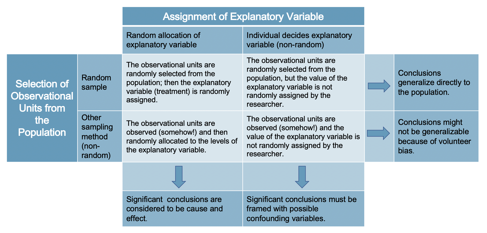

# Getting started with data {#getting-started-with-data}

::: {.chapterintro}
Scientists seek to answer questions using rigorous methods and careful observations.
These observations -- collected from the likes of field notes, surveys, and experiments -- form the backbone of a statistical investigation and are called **data**.
Statistics is the study of how best to collect, analyze, and draw conclusions from data, and in this first chapter, we focus on both the properties of data and on the collection of data.
:::

```{r include=FALSE}
terms_chp_1 <- c("data")
```

## Case study: stents and strokes {#case-study-stents-strokes}

In this section we introduce a classic challenge in statistics: evaluating the efficacy of a medical treatment.
Terms in this section, and indeed much of this chapter, will all be revisited later in the text.
The plan for now is simply to get a sense of the role statistics can play in practice.

### Using stents to prevent strokes

\index{data!stroke|(}

An experiment is designed to study the effectiveness of stents in treating patients at risk of stroke [@chimowitz2011stenting].
Stents are small mesh tubes that are placed inside narrow or weak arteries to assist in patient recovery after cardiac events and reduce the risk of an additional heart attack or death.

Many doctors have hoped that there would be similar benefits for patients at risk of stroke.
We start by writing the principal question the researchers hope to answer:

> Does the use of stents reduce the risk of stroke?

The researchers who asked this question conducted an experiment with 451 at-risk patients.
Each volunteer patient was randomly assigned to one of two groups:

-   **Treatment group**. Patients in the treatment group received a stent and medical management. The medical management included medications, management of risk factors, and help in lifestyle modification.
-   **Control group**. Patients in the control group received the same medical management as the treatment group, but they did not receive stents.

Researchers randomly assigned 224 patients to the treatment group and 227 to the control group.
In this study, the control group provides a reference point against which we can measure the medical impact of stents in the treatment group.

Researchers studied the effect of stents at two time points: 30 days after enrollment and 365 days after enrollment.
The results of 5 patients are summarized in Table \@ref(tab:stentStudyResultsDF).
Patient outcomes are recorded as `stroke` or `no event`, representing whether or not the patient had a stroke during that time period.

::: {.data}
The data from this study can be found in the [openintro](http://openintrostat.github.io/openintro) package: [`stent30`](http://openintrostat.github.io/openintro/reference/stent30.html) and [`stent365`](http://openintrostat.github.io/openintro/reference/stent365.html).
:::

```{r stentStudyResultsDF}
stent30_renamed <- stent30 %>% rename(`30 days` = outcome)
stent365_renamed <- stent365 %>% rename(`365 days` = outcome)
stent <- stent30_renamed %>%
  select(-group) %>%
  bind_cols(stent365_renamed) %>% 
  relocate(group) %>%
  mutate(
    group        = fct_rev(group),
    `30 days`    = fct_rev(`30 days`),
    `365 days`   = fct_rev(`365 days`),
  )
stent %>%
  sample_n(5) %>% 
  arrange(group) %>%
  mutate(patient = 1:n()) %>%
  relocate(patient) %>%
  kable(caption = "Results for five patients from the stent study.") %>%
  kable_styling(bootstrap_options = c("striped", "condensed"), 
                latex_options = "striped")
```

Considering data from each patient individually would be a long, cumbersome path towards answering the original research question.
Instead, performing a statistical data analysis allows us to consider all of the data at once.
Table \@ref(tab:stentStudyResultsDFsummary) summarizes the raw data in a more helpful way.
In this table, we can quickly see what happened over the entire study.
For instance, to identify the number of patients in the treatment group who had a stroke within 30 days after the treatment, we look in the leftmost column (30 days), at the intersection of treatment and stroke: 33.
To identify the number of control patients who did not have a stroke after 365 days after receiving treatment, we look at the rightmost column (365 days), at the intersection of control and no event: 199.

```{r stentStudyResultsDFsummary}
stent %>%
  pivot_longer(cols = c(`30 days`, `365 days`), 
               names_to = "stage", 
               values_to = "outcome") %>%
  count(group, stage, outcome) %>%
  pivot_wider(names_from = c(stage, outcome), values_from = n) %>%
  adorn_totals(where = "row") %>%
  kable(caption = "Descriptive statistics for the stent study.",
        col.names = c("", "stroke", "no event", "stroke", "no event")) %>%
  add_header_above(c(" " = 1, "30 days" = 2, "365 days" = 2), extra_css = "border-bottom: 2px solid") %>%
  row_spec(1, extra_css = "border-top: 2px solid") %>%
  row_spec(3, extra_css = "border-top: 2px solid") %>%
  kable_styling(bootstrap_options = c("striped", "condensed"), 
                latex_options = "striped")
```

::: {.guidedpractice}
Of the 224 patients in the treatment group, 45 had a stroke by the end of the first year.
Using these two numbers, compute the proportion of patients in the treatment group who had a stroke by the end of their first year.
(Note: answers to all Guided Practice exercises are provided in footnotes!)[^getting-started-with-data-1]
:::

[^getting-started-with-data-1]: The proportion of the 224 patients who had a stroke within 365 days: $45/224 = 0.20.$

We can compute summary statistics from the table to give us a better idea of how the impact of the stent treatment differed between the two groups.
A **summary statistic** is a single number summarizing (usually a large amount of) data.
For instance, the primary results of the study after 1 year could be described by two summary statistics: the proportion of people who had a stroke in the treatment and control groups.

```{r include=FALSE}
terms_chp_1 <- c(terms_chp_1, "summary statistic")
```

-   Proportion who had a stroke in the treatment (stent) group: $45/224 = 0.20 = 20\%.$
-   Proportion who had a stroke in the control group: $28/227 = 0.12 = 12\%.$

These two summary statistics are useful in looking for differences in the groups, and we are in for a surprise: an additional 8% of patients in the treatment group had a stroke!
This is important for two reasons.
First, it is contrary to what doctors expected, which was that stents would *reduce* the rate of strokes.
Second, it leads to a statistical question: do the data show a "real" difference between the groups?

This second question is subtle.
Suppose you flip a coin 100 times.
While the chance a coin lands heads in any given coin flip is 50%, we probably won't observe exactly 50 heads.
This type of fluctuation is part of almost any type of data generating process.
It is possible that the 8% difference in the stent study is due to this natural variation.
However, the larger the difference we observe (for a particular sample size), the less believable it is that the difference is due to chance.
So what we are really asking is the following: is the difference so large that we should reject the notion that it was due to chance?

While we don't yet have statistical tools to fully address this question on our own, we can comprehend the conclusions of the published analysis: there was compelling evidence of harm by stents in this study of stroke patients.

**Be careful:** Do not generalize the results of this study to all patients and all stents.
This study looked at patients with very specific characteristics who volunteered to be a part of this study and who may not be representative of all stroke patients.
In addition, there are many types of stents and this study only considered the self-expanding Wingspan stent (Boston Scientific).
However, this study does leave us with an important lesson: we should keep our eyes open for surprises.

\index{data!stroke|)}

### Exercises {#case-study-stents-strokes-exercises}

::: {.sectionexercise}
```{r intro, child="01/exercises/01-01-case-study.Rmd"}
```
:::

------------------------------------------------------------------------

## Data basics {#data-basics}

Effective presentation and description of data is a first step in most analyses.
This section introduces one structure for organizing data as well as some terminology that will be used throughout this book.

### Observations, variables, and data matrices

\index{data!loan50|(}

Table \@ref(tab:loan50-df) displays six rows of a data set for 50 randomly sampled loans offered through Lending Club, which is a peer-to-peer lending company.
These observations will be referred to as the `loan50` data set.

::: {.data}
The data can be found in the [openintro](http://openintrostat.github.io/openintro) package: [`loan50`](http://openintrostat.github.io/openintro/reference/loan50.html).
:::

Each row in the table represents a single loan.
The formal name for a row is a **case** or \index{unit of observation}**observational unit**.
The columns represent characteristics of each loan, where each column is referred to as a **variable**.
For example, the first row represents a loan of \$22,000 with an interest rate of 10.90%, where the borrower is based in New Jersey (NJ) and has an income of \$59,000.

```{r include=FALSE}
terms_chp_1 <- c(terms_chp_1, "case", "observational unit", "variable")
```

::: {.guidedpractice}
What is the grade of the first loan in Table \@ref(tab:loan50-df)?
And what is the home ownership status of the borrower for that first loan?
Reminder: for these Guided Practice questions, you can check your answer in the footnote.[^getting-started-with-data-2]
:::

[^getting-started-with-data-2]: The loan's grade is B, and the borrower rents their residence.

In practice, it is especially important to ask clarifying questions to ensure important aspects of the data are understood.
For instance, it is always important to be sure we know what each variable means and its units of measurement.
Descriptions of the variables in the `loan50` dataset are given in Table \@ref(tab:loan-50-variables).

```{r loan50-df}
loan50 %>% 
  select(loan_amount, interest_rate, term, grade, state, total_income, homeownership) %>%
  slice_head(n = 6) %>%
  kable(caption = "Six rows from the `loan50` data set",
        row.names = TRUE) %>%
  kable_styling(bootstrap_options = c("striped", "condensed"), 
                latex_options = "striped")
```

```{r loan-50-variables}
loan50_var_def <- tribble(
  ~variable,       ~description,
  "loan_amount",   "Amount of the loan received, in US dollars.",
  "interest_rate", "Interest rate on the loan, in an annual percentage.",
  "term",          "The length of the loan, which is always set as a whole number of months.",
  "grade",         "Loan grade, which takes a values A through G and represents the quality of the loan and its likelihood of being repaid.",
  "state",         "US state where the borrower resides.",
  "total_income",  "Borrower's total income, including any second income, in US dollars.",
  "homeownership", "Indicates whether the person owns, owns but has a mortgage, or rents."
)

loan50_var_def %>%
  mutate(variable = cell_spec(variable, monospace = TRUE)) %>%
  kable(escape = FALSE, caption = "Variables and their descriptions for the `loan50` data set.") %>%
  kable_styling(bootstrap_options = c("striped", "condensed"), 
                latex_options = "striped")
```

\index{data!loan50|)}

The data in Table \@ref(tab:loan50-df) represent a **data frame**, which is a convenient and common way to organize data, especially if collecting data in a spreadsheet.
Each row of a data frame corresponds to a unique case (observational unit), and each column corresponds to a variable.

```{r include=FALSE}
terms_chp_1 <- c(terms_chp_1, "data frame")
```

When recording data, use a data matrix unless you have a very good reason to use a different structure.
This structure allows new cases to be added as rows or new variables as new columns.

::: {.guidedpractice}
The grades for assignments, quizzes, and exams in a course are often recorded in a gradebook that takes the form of a data frame.
How might you organize a course's grade data using a data frame?
Describe the observational units and variables.[^getting-started-with-data-3]
:::

[^getting-started-with-data-3]: There are multiple strategies that can be followed.
    One common strategy is to have each student represented by a row, and then add a column for each assignment, quiz, or exam.
    Under this setup, it is easy to review a single line to understand the grade history of a student.
    There should also be columns to include student information, such as one column to list student names.

\index{data!county|(}

::: {.guidedpractice}
We consider data for 3,142 counties in the United States, which includes the name of each county, the state where it resides, its population in 2017, the population change from 2010 to 2017, poverty rate, and nine additional characteristics.
How might these data be organized in a data frame?[^getting-started-with-data-4]
:::

[^getting-started-with-data-4]: Each county may be viewed as a case, and there are eleven pieces of information recorded for each case.
    A table with 3,142 rows and 14 columns could hold these data, where each row represents a county and each column represents a particular piece of information.

The data described in the Guided Practice above represents the **county** data set, which is shown as a data frame in Table \@ref(tab:county-df).
The variables as well as the variables in the dataset that did not fit in Table \@ref(tab:county-df) are described in Table \@ref(tab:county-variables).

```{r county-df}
county %>%
  select(name, state, pop2017, pop_change, unemployment_rate, median_edu) %>%
  slice_head(n = 6) %>% 
  kable(caption = "Six observations and six variables from the `county` data set.") %>%
  kable_styling(bootstrap_options = c("striped", "condensed"), 
                latex_options = "striped")
```

```{r county-variables}
county_var_def <- tribble(
  ~variable,           ~description,
  "name",              "Name of county.",
  "state",             "Name of state.",
  "pop2000",           "Population in 2000.",
  "pop2010",           "Population in 2010.",
  "pop2017",           "Population in 2017.",
  "pop_change",        "Population change from 2010 to 2017 (in percent).",
  "poverty",           "Percent of population in poverty in 2017.",
  "homeownership",     "Homeownership rate, 2006-2010.",
  "multi_unit",        "Percent of housing units in multi-unit structures, 2006-2010.",
  "unemployment_rate", "Unemployment rate in 2017.",
  "metro",             "Whether the county contains a metropolitan area, taking one of the values `yes` or `no`.",
  "median_edu",        "Median education level (2013-2017), taking one of the values `below_hs`, `hs_diploma`, `some_college`, or `bachelors`.", 
  "per_capita_income", "Per capita (per person) income (2013-2017).",
  "median_hh_income",  "Median household income.",
  "smoking_ban",       "Describes whether the type of county-level smoking ban in place in 2010, taking one of the values `none`, `partial`, or `comprehensive`."
)

county_var_def %>%
  mutate(variable = cell_spec(variable, monospace = TRUE)) %>%
  kable(escape = FALSE, caption = "Variables and their descriptions for the `county` data set.") %>%
  kable_styling(bootstrap_options = c("striped", "condensed"), 
                latex_options = "striped")
```

::: {.data}
These data can be found in the [usdata](http://openintrostat.github.io/usdata) package: [`county`](http://openintrostat.github.io/usdata/reference/county.html).
:::

### Types of variables {#variable-types}

Examine the `unemployment_rate`, `pop2017`, `state`, and `median_edu` variables in the `county` data set.
Each of these variables is inherently different from the other three, yet some share certain characteristics.

First consider `unemployment_rate`, which is said to be a **numerical** variable since it can take a wide range of numerical values, and it is sensible to add, subtract, or take averages with those values.
On the other hand, we would not classify a variable reporting telephone area codes as numerical since the average, sum, and difference of area codes doesn't have any clear meaning.

```{r include=FALSE}
terms_chp_1 <- c(terms_chp_1, "numerical")
```

The `pop2017` variable is also numerical, although it seems to be a little different than `unemployment_rate`.
This variable of the population count can only take whole non-negative numbers (0, 1, 2, ...).
For this reason, the population variable is said to be **discrete** since it can only take numerical values with jumps.
On the other hand, the unemployment rate variable is said to be **continuous**.

```{r include=FALSE}
terms_chp_1 <- c(terms_chp_1, "discrete", "continuous")
```

The variable `state` can take up to 51 values after accounting for Washington, DC: AL, AK, ..., and WY.
Because the responses themselves are categories, `state` is called a **categorical** variable, and the possible values are called the variable's **levels** .

```{r include=FALSE}
terms_chp_1 <- c(terms_chp_1, "categorical", "level")
```

Finally, consider the `median_edu` variable, which describes the median education level of county residents and takes values `below_hs`, `hs_diploma`, `some_college`, or `bachelors` in each county.
This variable seems to be a hybrid: it is a categorical variable but the levels have a natural ordering.
A variable with these properties is called an **ordinal** variable, while a regular categorical variable without this type of special ordering is called a **nominal** variable.
To simplify analyses, any ordinal variable in this book will be treated as a nominal (unordered) categorical variable.

```{r include=FALSE}
terms_chp_1 <- c(terms_chp_1, "ordinal", "nominal")
```

```{r variables, out.width="60%", fig.cap="Breakdown of variables into their respective types."}
include_graphics("01/figures/variables/variables.png")
```

::: {.workedexample}
Data were collected about students in a statistics course.
Three variables were recorded for each student: number of siblings, student height, and whether the student had previously taken a statistics course.
Classify each of the variables as continuous numerical, discrete numerical, or categorical.

------------------------------------------------------------------------

The number of siblings and student height represent numerical variables.
Because the number of siblings is a count, it is discrete.
Height varies continuously, so it is a continuous numerical variable.
The last variable classifies students into two categories -- those who have and those who have not taken a statistics course -- which makes this variable categorical.
:::

\index{data!stroke}

::: {.guidedpractice}
An experiment is evaluating the effectiveness of a new drug in treating migraines.
A `group` variable is used to indicate the experiment group for each patient: treatment or control.
The `num_migraines` variable represents the number of migraines the patient experienced during a 3-month period.
Classify each variable as either numerical or categorical?[^getting-started-with-data-5]
:::

[^getting-started-with-data-5]: The `group` variable can take just one of two group names, making it categorical.
    The `num_migraines` variable describes a count of the number of migraines, which is an outcome where basic arithmetic is sensible, which means this is numerical outcome; more specifically, since it represents a count, `num_migraines` is a discrete numerical variable.

### Relationships between variables {#variable-relations}

Many analyses are motivated by a researcher looking for a relationship between two or more variables.
A social scientist may like to answer some of the following questions:

> Does a higher than average increase in county population tend to correspond to counties with higher or lower median household incomes?

> If homeownership is lower than the national average in one county, will the percent of multi-unit structures in that county tend to be above or below the national average?

> How useful a predictor is median education level for the median household income for US counties?

To answer these questions, data must be collected, such as the `county` data set shown in Table \@ref(tab:county-df).
Examining \index{summary statistic}**summary statistics** could provide insights for each of the three questions about counties.
Additionally, graphs can be used to visually explore the data.

\index{scatterplot}**Scatterplots** are one type of graph used to study the relationship between two numerical variables.
Figure \@ref(fig:county-multi-unit-homeownership) displays the relationship between the variables `homeownership` and `multi_unit`, which is the percent of units in multi-unit structures (e.g., apartments, condos).
Each point on the plot represents a single county.
For instance, the highlighted dot corresponds to County 413 in the `county` data set: Chattahoochee County, Georgia, which has 39.4% of units in multi-unit structures and a homeownership rate of 31.3%.
The scatterplot suggests a relationship between the two variables: counties with a higher rate of multi-units tend to have lower homeownership rates.
We might brainstorm as to why this relationship exists and investigate each idea to determine which are the most reasonable explanations.

```{r county-multi-unit-homeownership, fig.cap = "A scatterplot of homeownership versus the percent of units that are in multi-unit structures for US counties. The highlighted dot represents Chattahoochee County, Georgia, which has a multi-unit rate of 39.4% and a homeownership rate of 31.3%.", warning=FALSE}
ggplot(county, aes(x = multi_unit, y = homeownership)) +
  geom_point(alpha = 0.3, color = COL["blue", "full"], 
             fill = COL["black", "full"], shape = 21) +
  labs(
    x = "Percent of Units in Multi-Unit Structures",
    y = "Homeownership Rate"
  ) +
  geom_point(data = county %>% filter(name == "Chattahoochee County"), 
             size = 3, color = COL["red", "full"], shape = 1) +
  geom_text(data = county %>% filter(name == "Chattahoochee County"),
            label = "Chattahoochee County", fontface = "italic",
            nudge_x = 15, nudge_y = -3, color = COL["red", "full"]) +
  guides(color = FALSE) +
  geom_segment(data = county %>% filter(name == "Chattahoochee County"),
               aes(x = 0, y = homeownership, xend = multi_unit, yend = homeownership, 
                   color = COL["red", "full"]), linetype = "dashed") +
  geom_segment(data = county %>% filter(name == "Chattahoochee County"),
               aes(x = multi_unit, y = 0, xend = multi_unit, yend = homeownership, 
                   color = COL["red", "full"]), linetype = "dashed") +
  scale_x_continuous(labels = percent_format(scale = 1)) +
  scale_y_continuous(labels = percent_format(scale = 1))
```

The multi-unit and homeownership rates are said to be associated because the plot shows a discernible pattern.
When two variables show some connection with one another, they are called **associated** variables.

```{r include=FALSE}
terms_chp_1 <- c(terms_chp_1, "associated", "dependent")
```

::: {.guidedpractice}
Examine the variables in the `loan50` data set, which are described in Table \@ref(tab:loan-50-variables).
Create two questions about possible relationships between variables in `loan50` that are of interest to you.[^getting-started-with-data-6]
:::

[^getting-started-with-data-6]: Two example questions: (1) What is the relationship between loan amount and total income?
    (2) If someone's income is above the average, will their interest rate tend to be above or below the average?

::: {.workedexample}
This example examines the relationship between the percent change in population from 2010 to 2017 and median household income for counties, which is visualized as a scatterplot in Figure \@ref(fig:county-pop-change-med-hh-income).
Are these variables associated?

------------------------------------------------------------------------

The larger the median household income for a county, the higher the population growth observed for the county.
While it isn't true that every county with a higher median household income has a higher population growth, the trend in the plot is evident.
Since there is some relationship between the variables, they are associated.
:::

```{r county-pop-change-med-hh-income, fig.cap = "A scatterplot showing `pop_change` against `median_hh_income`. Owsley County of Kentucky, is highlighted, which lost 3.63% of its population from 2010 to 2017 and had median household income of $22,736.", warning=FALSE}
ggplot(county, aes(x = median_hh_income, y = pop_change)) +
  geom_point(alpha = 0.3, color = COL["blue", "full"], 
             fill = COL["black", "full"], shape = 21) +
  labs(
    x = "Median Household Income",
    y = "Population Change over 7 Years"
  ) +
  geom_point(data = county %>% filter(name == "Owsley County"), 
             size = 3, color = COL["red", "full"], shape = 1) +
  guides(color = FALSE) +
  geom_segment(data = county %>% filter(name == "Owsley County"),
               aes(x = 0, y = pop_change, 
                   xend = median_hh_income, yend = pop_change, 
                   color = COL["red", "full"]), linetype = "dashed") +
  geom_segment(data = county %>% filter(name == "Owsley County"),
               aes(x = median_hh_income, y = -40, 
                   xend = median_hh_income, yend = pop_change, 
                   color = COL["red", "full"]), linetype = "dashed") +
  scale_x_continuous(labels = dollar_format(scale = 0.001, suffix = "K")) +
  scale_y_continuous(labels = percent_format(scale = 1), limits = c(-40, 40))
```

Because there is a downward trend in Figure \@ref(fig:county-multi-unit-homeownership) -- counties with more units in multi-unit structures are associated with lower homeownership -- these variables are said to be **negatively associated**.
A **positive association** is shown in the relationship between the `median_hh_income` and `pop_change` variables in Figure \@ref(fig:county-pop-change-med-hh-income), where counties with higher median household income tend to have higher rates of population growth.

```{r include=FALSE}
terms_chp_1 <- c(terms_chp_1, "positive association", "negative association")
```

If two variables are not associated, then they are said to be **independent**.
That is, two variables are independent if there is no evident relationship between the two.

```{r include=FALSE}
terms_chp_1 <- c(terms_chp_1, "independent")
```

::: {.important}
**Associated or independent, not both.** A pair of variables are either related in some way (associated) or not (independent).
No pair of variables is both associated and independent.
:::

### Explanatory and response variables

When we ask questions about the relationship between two variables, we sometimes also want to determine if the change in one variable causes a change in the other.
Consider the following rephrasing of an earlier question about the `county` data set:

> If there is an increase in the median household income in a county, does this drive an increase in its population?

In this question, we are asking whether one variable affects another.
If this is our underlying belief, then *median household income* is the **explanatory variable** and the *population change* is the **response variable** in the hypothesized relationship.[^getting-started-with-data-7]

[^getting-started-with-data-7]: Sometimes the explanatory variable is called the **independent** variable and the response variable is called the **dependent** variable.
    However, this becomes confusing since a *pair* of variables might be independent or dependent, so we avoid this language.

```{r include=FALSE}
terms_chp_1 <- c(terms_chp_1, "explanatory variable", "response variable", "dependent")
```

\index{data!county|)}

::: {.important}
**Explanatory and response variables.** When we suspect one variable might causally affect another, we label the first variable the explanatory variable and the second the response variable.
We also use the terms **explanatory** and **response** to describe variables where the **response** might be predicted using the **explanatory** even if there is no causal relationship.

<center>

explanatory variable $\rightarrow$ *might affect* $\rightarrow$ response variable

</center>

<br> For many pairs of variables, there is no hypothesized relationship, and these labels would not be applied to either variable in such cases.
:::

Bear in mind that the act of labeling the variables in this way does nothing to guarantee that a causal relationship exists.
A formal evaluation to check whether one variable causes a change in another requires an experiment.

### Introducing observational studies and experiments

There are two primary types of data collection: observational studies and experiments.

Researchers perform an **observational study** when they collect data in a way that does not directly interfere with how the data arise.
For instance, researchers may collect information via surveys, review medical or company records, or follow a **cohort** of many similar individuals to form hypotheses about why certain diseases might develop.
In each of these situations, researchers merely observe the data that arise.
In general, observational studies can provide evidence of a naturally occurring association between variables, but they cannot by themselves show a causal connection.

```{r include=FALSE}
terms_chp_1 <- c(terms_chp_1, "observational study", "cohort")
```

When researchers want to investigate the possibility of a causal connection, they conduct an **experiment**.
Usually there will be both an explanatory and a response variable.
For instance, we may suspect administering a drug will reduce mortality in heart attack patients over the following year.
To check if there really is a causal connection between the explanatory variable and the response, researchers will collect a sample of individuals and split them into groups.
The individuals in each group are *assigned* a treatment.
When individuals are randomly assigned to a group, the experiment is called a **randomized experiment**.
For example, each heart attack patient in the drug trial could be randomly assigned, perhaps by flipping a coin, into one of two groups: the first group receives a **placebo** (fake treatment) and the second group receives the drug.
See the case study in Section \@ref(case-study-stents-strokes) for another example of an experiment, though that study did not employ a placebo.

```{r include=FALSE}
terms_chp_1 <- c(terms_chp_1, "experiment", "randomized experiment", "placebo")
```

::: {.important}
**Association** $\neq$ Causation.
In general, association does not imply causation, and causation can be inferred from a randomized experiment.
The main reason for this is that observational studies do not control for confounding variables.
We will revisit this idea when we discuss experiments later in the book.
:::

### Exercises {#data-basics-exercises}

::: {.sectionexercise}
```{r intro, child="01/exercises/01-02-data-basics.Rmd"}
```
:::

## Sampling principles and strategies {#sampling-principles-strategies}

\index{sample|(} \index{population|(}

The first step in conducting research is to identify topics or questions that are to be investigated.
A clearly laid out research question is helpful in identifying what subjects or cases should be studied and what variables are important.
It is also important to consider *how* data are collected so that they are reliable and help achieve the research goals.

### Populations and samples

Consider the following three research questions:

1.  What is the average mercury content in swordfish in the Atlantic Ocean?
2.  Over the last 5 years, what is the average time to complete a degree for Duke undergrads?
3.  Does a new drug reduce the number of deaths in patients with severe heart disease?

Each research question refers to a target **population**.
In the first question, the target population is all swordfish in the Atlantic ocean, and each fish represents a case.
Often times, it is too expensive to collect data for every case in a population.
Instead, a sample is taken.
A **sample** represents a subset of the cases and is often a small fraction of the population.
For instance, 60 swordfish (or some other number) in the population might be selected, and this sample data may be used to provide an estimate of the population average and answer the research question.

```{r include=FALSE}
terms_chp_1 <- c(terms_chp_1, "population", "sample")
```

::: {.guidedpractice}
For the second and third questions above, identify the target population and what represents an individual case.[^getting-started-with-data-8]
:::

[^getting-started-with-data-8]: The question *"Over the last 5 years, what is the average time to complete a degree for Duke undergrads?"* is only relevant to students who complete their degree; the average cannot be computed using a student who never finished her degree.
    Thus, only Duke undergrads who graduated in the last five years represent cases in the population under consideration.
    Each such student is an individual case.
    For the question *"Does a new drug reduce the number of deaths in patients with severe heart disease?"*, a person with severe heart disease represents a case.
    The population includes all people with severe heart disease.

### Parameters and statistics

In the majority of statistical analysis procedures, the research question at hand boils down to understanding a numerical summary.
The number (or set of numbers) may be a quantity you are already familiar with (like the average) or it may be something you learn through this text (like the slope and intercept from a least squares model, provided in Section \@ref(least-squares-regression)).

In theory, the numerical summary, however, can be calculated on either the sample of observation or the entire population.
Measuring every single unit in the population is usually prohibitive (so the parameter is very rarely calculated), but one can conceptualize calculating the average income of all adults in Argentina, for example, if one were all knowing.

We use specific terms in order to differentiate when a number is being calculated on a sample of data (**statistic**) and when it is being calculated or considered for calculation on the entire population (**parameter**).
The terms statistic and parameter are useful for communicating claims and models and will be used extensively in later chapters which delve into making inference on populations.

```{r include=FALSE}
terms_chp_1 <- c(terms_chp_1, "parameter", "statistic")
```

### Anecdotal evidence

\index{bias|(}

Consider the following possible responses to the three research questions:

1.  A man on the news got mercury poisoning from eating swordfish, so the average mercury concentration in swordfish must be dangerously high.
2.  I met two students who took more than 7 years to graduate from Duke, so it must take longer to graduate at Duke than at many other colleges.
3.  My friend's dad had a heart attack and died after they gave him a new heart disease drug, so the drug must not work.

Each conclusion is based on data.
However, there are two problems.
First, the data only represent one or two cases.
Second, and more importantly, it is unclear whether these cases are actually representative of the population.
Data collected in this haphazard fashion are called **anecdotal evidence**.

```{r include=FALSE}
terms_chp_1 <- c(terms_chp_1, "anecdotal evidence")
```

::: {.important}
**Anecdotal evidence.** Be careful of data collected in a haphazard fashion.
Such evidence may be true and verifiable, but it may only represent extraordinary cases and therefore not be a good representation of the population.
:::

```{r mn-winter, out.width="50%", fig.cap='In February 2010, some media pundits cited one large snow storm as evidence against global warming. As comedian Jon Stewart pointed out, "It is one storm, in one region, of one country."'}
include_graphics("01/figures/mn-winter/mn-winter.jpg")
```

Anecdotal evidence typically is composed of unusual cases that we recall based on their striking characteristics.
For instance, we are more likely to remember the two people we met who took 7 years to graduate than the six others who graduated in four years.
Instead of looking at the most unusual cases, we should examine a sample of many cases that better represent the population.

### Sampling from a population

\index{sample!random sample|(} \index{sample!bias|(}

We might try to estimate the time to graduation for Duke undergraduates in the last 5 years by collecting a sample of students.
All graduates in the last 5 years represent the *population*\index{population}, and graduates who are selected for review are collectively called the *sample*\index{sample}.
In general, we always seek to *randomly* select a sample from a population.
The most basic type of random selection is equivalent to how raffles are conducted.
For example, in selecting graduates, we could write each graduate's name on a raffle ticket and draw 100 tickets.
The selected names would represent a random sample of 100 graduates.
We pick samples randomly to reduce the chance we introduce biases.

```{r pop-to-sample, fig.cap="In this graphic, five graduates are randomly selected from the population to be included in the sample."}
par_og <- par(no.readonly = TRUE) # save original par
par(mar = rep(0, 4))
plot(c(0, 2),
     c(0, 1.1),
     type = 'n',
     axes = FALSE, 
     xlab = "",
     ylab = "")
temp <- seq(0, 2 * pi, 2 * pi / 100)
x <- 0.5 + 0.5 * cos(temp)
y <- 0.5 + 0.5 * sin(temp)
lines(x, y)

s <- matrix(runif(700), ncol = 2)
S <- matrix(NA, 350, 2)
j <- 0
for (i in 1:nrow(s)) {
  if(sum((s[i, ] - 0.5)^2) < 0.23){
    j <- j + 1
    S[j, ] <- s[i, ]
  }
}
points(S, col = COL[1, 3], pch = 20)
text(0.5, 1, 'all graduates', pos = 3, cex = 1.3)

set.seed(50)
N <- sample(j, 25)
lines((x - 0.5) / 2 + 1.5, (y - 0.5) / 2 +  0.5, pch = 20)

SS <- (S[N, ] - 0.5) / 2 + 0.5
these <- c(2, 5, 11, 10, 12)
points(SS[these, 1] + 1,
       SS[these, 2],
       col = COL[4, 2],
       pch = 20,
       cex = 1.5)
text(1.5, 0.75, 'sample', pos = 3, cex = 1.3)

for (i in these) {
  arrows(S[N[i], 1], S[N[i], 2],
         SS[i, 1] + 1 - 0.03, SS[i, 2],
         length = 0.08, col = COL[5], lwd = 1.5)
}
par(par_og) # restore original par
```

::: {.workedexample}
Suppose we ask a student who happens to be majoring in nutrition to select several graduates for the study.
What kind of students do you think they might collect?
Do you think their sample would be representative of all graduates?

------------------------------------------------------------------------

Perhaps they would pick a disproportionate number of graduates from health-related fields.
Or perhaps their selection would be a good representation of the population.
When selecting samples by hand, we run the risk of picking a **biased** sample, even if our bias is unintended.
:::

```{r include=FALSE}
terms_chp_1 <- c(terms_chp_1, "sample bias")
```

```{r pop-to-sub-sample-graduates, fig.cap="Asked to pick a sample of graduates, a nutrition major might inadvertently pick a disproportionate number of graduates from health-related majors."}
par_og <- par(no.readonly = TRUE) # save original par
par(mar = rep(0, 4))
plot(c(0, 2),
     c(0, 1.1),
     type = 'n',
     axes = FALSE,
     xlab = "",
     ylab = "")
temp <- seq(0, 2 * pi, 2 * pi / 100)
x <- 0.5 + 0.5 * cos(temp)
y <- 0.5 + 0.5 * sin(temp)
lines(x, y)

s <- matrix(runif(700), ncol = 2)
S <- matrix(NA, 350, 2)
j <- 0
sub <- rep(FALSE, 1000)
for (i in 1:nrow(s)) {
  if(sum((s[i,] - 0.5)^2) < 0.23){
    j <- j+1
    S[j,] <- s[i,]
  }
  if(sum((s[i, ] - c(0.05, 0.18) - 0.5)^2) < 0.07){
    sub[j] <- TRUE
  }
}
points(S, col = COL[1, 4 - 2 * sub], pch = 20)
text(0.5, 1, 'all graduates', pos = 3, cex = 1.3)
lines((x - 0.5) * 2 * sqrt(0.07) + 0.55,
      (y - 0.5) * 2 * sqrt(0.07) + 0.68)

set.seed(7)
N <- sample((1:j)[sub], 25)
lines((x - 0.5) / 2 + 1.5,
      (y - 0.5) / 2 + 0.5,
      pch = 20)

SS <- (S[N, ] - 0.5) / 2 + 0.5
these <- c(2, 5, 7, 12, 15)
points(SS[these, 1] + 1,
       SS[these, 2],
       col = COL[4, 2],
       pch = 20,
       cex = 1.5)
text(1.5, 0.75, 'sample', pos = 3, cex = 1.3)

for (i in these)  {
  arrows(S[N[i], 1], S[N[i], 2],
         SS[i, 1] + 1 - 0.03, SS[i, 2],
         length = 0.08,
         col = COL[5],
         lwd = 1.5)
}
rect(0.143, 0.2, 0.952, 0.301,
     border = "#00000000",
     col = "#FFFFFF88")
rect(0.236, 0.301, 0.858, 0.403,
     border = "#00000000",
     col = "#FFFFFF88")
text(0.55, 0.5 + 0.18 - sqrt(0.07),
     'graduates from\nhealth-related fields',
     pos = 1, cex = 1.3)
par(par_og) # restore original par
```

If someone was permitted to pick and choose exactly which graduates were included in the sample, it is entirely possible that the sample could be skewed to that person's interests, which may be entirely unintentional.
This introduces **bias** into a sample.
Sampling randomly helps resolve this problem.
The most basic random sample is called a **simple random sample**, and is equivalent to using a raffle to select cases.
This means that each case in the population has an equal chance of being included and there is no implied connection between the cases in the sample.

```{r include=FALSE}
terms_chp_1 <- c(terms_chp_1, "bias", "simple random sample")
```

The act of taking a simple random sample helps minimize bias.
However, bias can crop up in other ways.
Even when people are picked at random, e.g., for surveys, caution must be exercised if the **non-response rate**\index{non-response rate} is high.
For instance, if only 30% of the people randomly sampled for a survey actually respond, then it is unclear whether the results are **representative** of the entire population.
This **non-response bias**\index{non-response bias} can skew results.

```{r include=FALSE}
terms_chp_1 <- c(terms_chp_1, "non-response rate", "representative", "non-response bias")
```

```{r survey-sample, fig.cap="Due to the possibility of non-response, surveys studies may only reach a certain group within the population. It is difficult, and often times impossible, to completely fix this problem."}
par_og <- par(no.readonly = TRUE) # save original par
par(mar = rep(0, 4))
plot(c(0, 2),
     c(0, 1.1),
     type='n',
     axes=FALSE,
     xlab="",
     ylab="")
temp <- seq(0, 2 * pi, 2 * pi / 100)
x <- 0.5 + 0.5 * cos(temp)
y <- 0.5 + 0.5 * sin(temp)
lines(x, y)

s <- matrix(runif(700), ncol = 2)
S <- matrix(NA, 350, 2)
j <- 0
sub <- rep(FALSE, 1000)
for (i in 1:nrow(s)) {
  if (sum((s[i,] - 0.5)^2) < 0.23) {
    j <- j + 1
    S[j, ] <- s[i, ]
  }
  if (sum((s[i, ] - c(-0.15, 0.05) - 0.5)^2) < 0.115) {
    sub[j] <- TRUE
  }
}
points(S, col = COL[1, 4 - 2 * sub], pch = 20)
text(0.5, 1, 'population of interest', pos = 3, cex = 1.3)
lines((x - 0.5) * 2 * sqrt(0.115) + 0.35,
      (y - 0.5) * 2 * sqrt(0.115) + 0.55)

set.seed(7)
N <- sample((1:j)[sub], 25)
lines((x - 0.5) / 2 + 1.5,
      (y - 0.5) / 2 + 0.5,
      pch=20)

SS <- (S[N, ] - 0.5) / 2 + 0.5
these <- c(2, 5, 6, 7, 15)
points(SS[these, 1] + 1,
       SS[these, 2],
       col = COL[4, 2],
       pch = 20,
       cex = 1.5)
text(1.5, 0.75, 'sample', pos=3, cex = 1.3)

for(i in these){
	arrows(S[N[i], 1],
	       S[N[i], 2],
	       SS[i, 1] + 1 - 0.03,
	       SS[i, 2],
	       length=0.08,
	       col=COL[5],
	       lwd=1.5)
}
rect(0.145, 0.195, 0.775, 0.11,
     border="#00000000",
     col="#FFFFFF88")
rect(0.31, 0.018, 0.605, 0.11,
     border="#00000000",
     col="#FFFFFF88")
text(0.46, 0.5 + 0.06 - sqrt(0.115),
     'population actually\nsampled',
     pos=1,
     cex=1)
par(par_og) # restore original par
```

Another common downfall is a **convenience sample** \index{convenience sample}, where individuals who are easily accessible are more likely to be included in the sample.
For instance, if a political survey is done by stopping people walking in the Bronx, this will not represent all of New York City.
It is often difficult to discern what sub-population a convenience sample represents.

```{r include=FALSE}
terms_chp_1 <- c(terms_chp_1, "convenience sample")
```

::: {.guidedpractice}
We can easily access ratings for products, sellers, and companies through websites.
These ratings are based only on those people who go out of their way to provide a rating.
If 50% of online reviews for a product are negative, do you think this means that 50% of buyers are dissatisfied with the product?
Why or why not?[^getting-started-with-data-9]
:::

[^getting-started-with-data-9]: Answers will vary.
    From our own anecdotal experiences, we believe people tend to rant more about products that fell below expectations than rave about those that perform as expected.
    For this reason, we suspect there is a negative bias in product ratings on sites like Amazon.
    However, since our experiences may not be representative, we also keep an open mind.

\index{sample!bias|)} \index{sample!random sample|)} \index{bias|)} \index{population|)} \index{sample|)}

### Observational studies

Data where no treatment has been explicitly applied (or explicitly withheld) is called **observational data**.
For instance, the loan data and county data described in Section \@ref(data-basics) are both examples of observational data.

```{r include=FALSE}
terms_chp_1 <- c(terms_chp_1, "observational data")
```

Making causal conclusions based on experiments is often reasonable.
However, making the same causal conclusions based on observational data can be treacherous and is not recommended.
Thus, observational studies are generally only sufficient to show associations or form hypotheses that can be later checked with experiments.

::: {.guidedpractice}
Suppose an observational study tracked sunscreen use and skin cancer, and it was found that the more sunscreen someone used, the more likely the person was to have skin cancer.
Does this mean sunscreen *causes* skin cancer?[^getting-started-with-data-10]
:::

[^getting-started-with-data-10]: No.
    See the paragraph following the question!

Some previous research tells us that using sunscreen actually reduces skin cancer risk, so maybe there is another variable that can explain this hypothetical association between sunscreen usage and skin cancer.
One important piece of information that is absent is sun exposure.
If someone is out in the sun all day, they are more likely to use sunscreen *and* more likely to get skin cancer.
Exposure to the sun is unaccounted for in the simple observational investigation.

```{r sun-causes-cancer}
par_og <- par(no.readonly = TRUE) # save original par
par(mar = rep(0, 4))
plot(c(-0.05, 1.2),
     c(0.39, 1),
     type = 'n',
     axes = FALSE)
text(0.59, 0.89, 'sun exposure', cex = 1.3)
rect(0.4, 0.8, 0.78, 1)
text(0.3, 0.49, 'use sunscreen', cex = 1.3)
rect(0.1, 0.4, 0.48, 0.6)
arrows(0.49, 0.78, 0.38, 0.62,
       length = 0.08, lwd = 1.5)
text(0.87, 0.5, 'skin cancer', cex = 1.3)
rect(0.71,0.4, 1.01, 0.6)
arrows(0.67, 0.78, 0.8, 0.62,
       length = 0.08, lwd = 1.5)

arrows(0.5, 0.5, 0.69, 0.5,
       length = 0.08, col = COL[6,2])
text(0.595, 0.565, "?",
     cex = 1.5, col = COL[4])
par(par_og) # restore original par
```

```{=html}
<!--
Some studies:
http://www.sciencedirect.com/science/article/pii/S0140673698121682
http://archderm.ama-assn.org/cgi/content/abstract/122/5/537
Study with a similar scenario to that described here:
http://onlinelibrary.wiley.com/doi/10.1002/ijc.22745/full
-->
```
Sun exposure is what is called a **confounding variable**[^getting-started-with-data-11], which is a variable that is associated with both the explanatory and response variables.
While one method to justify making causal conclusions from observational studies is to exhaust the search for confounding variables, there is no guarantee that all confounding variables can be examined or measured.

[^getting-started-with-data-11]: Also called a **lurking variable**, **confounding factor**, or a **confounder**.

```{r include=FALSE}
terms_chp_1 <- c(terms_chp_1, "confounding variable")
```

::: {.guidedpractice}
Figure \@ref(fig:county-multi-unit-homeownership) shows a negative association between the homeownership rate and the percentage of multi-unit structures in a county.
However, it is unreasonable to conclude that there is a causal relationship between the two variables.
Suggest a variable that might explain the negative relationship.[^getting-started-with-data-12]
:::

[^getting-started-with-data-12]: Answers will vary.
    Population density may be important.
    If a county is very dense, then this may require a larger fraction of residents to live in multi-unit structures.
    Additionally, the high density may contribute to increases in property value, making homeownership unfeasible for many residents.

Observational studies come in two forms: prospective and retrospective studies.
A **prospective study** identifies individuals and collects information as events unfold.
For instance, medical researchers may identify and follow a group of patients over many years to assess the possible influences of behavior on cancer risk.
One example of such a study is The Nurses' Health Study.
Started in 1976 and expanded in 1989, the Nurses' Health Study has collected data on over 275,000 nurses and is still enrolling participants.
This prospective study recruits registered nurses and then collects data from them using questionnaires.
**Retrospective studies** collect data after events have taken place, e.g., researchers may review past events in medical records.
Some data sets may contain both prospectively- and retrospectively-collected variables, such as medical studies which gather information on participants' lives before they enter the study and subsequently collect data on participants throughout the study.

```{r include=FALSE}
terms_chp_1 <- c(terms_chp_1, "prospective study", "retrospective study")
```

### Four sampling methods {#samp-methods}

Almost all statistical methods are based on the notion of implied randomness.
If observational data are not collected in a random framework from a population, these statistical methods -- the estimates and errors associated with the estimates -- are not reliable.
Here we consider four random sampling techniques: simple, stratified, cluster, and multistage sampling.
Figures \@ref(fig:simple-stratified) and \@ref(fig:cluster-multistage) provide graphical representations of these techniques.

\index{sample!simple random sampling} \index{sample!stratified sampling}

```{r simple-stratified, fig.cap="Examples of simple random and stratified sampling. In the top panel, simple random sampling was used to randomly select the 18 cases (denoted in red). In the bottom panel, stratified sampling was used: cases were first grouped into strata, then simple random sampling was employed to randomly select 3 cases within each stratum.", warning=FALSE, fig.width=10}

source("helpers/helper-sampling.R")   # source helper
par_og <- par(no.readonly = TRUE)     # save original par
par(mar = rep(0.5,4), mfrow = c(2,1)) # no margin, 2 figures 
build_srs(n = 18, N = 108)            # build figure
build_stratified(N = 108)             # build figure
par(par_og)                           # restore original par
```

**Simple random sampling** is probably the most intuitive form of random sampling.
Consider the salaries of Major League Baseball (MLB) players, where each player is a member of one of the league's 30 teams.
To take a simple random sample of 120 baseball players and their salaries, we could write the names of that season's several hundreds of players onto slips of paper, drop the slips into a bucket, shake the bucket around until we are sure the names are all mixed up, then draw out slips until we have the sample of 120 players.
In general, a sample is referred to as "simple random" if each case in the population has an equal chance of being included in the final sample *and* knowing that a case is included in a sample does not provide useful information about which other cases are included.

\index{sample!strata|textbf}

**Stratified sampling** is a divide-and-conquer sampling strategy.
The population is divided into groups called **strata**.
The strata are chosen so that similar cases are grouped together, then a second sampling method, usually simple random sampling, is employed within each stratum.
In the baseball salary example, each of the 30 teams could represent a strata, since some teams have a lot more money (up to 4 times as much!).
Then we might randomly sample 4 players from each team for our sample of 120 players.

```{r include=FALSE}
terms_chp_1 <- c(terms_chp_1, "simple random sampling", "stratified sampling", "strata")
```

**Stratified sampling** is especially useful when the cases in each stratum are very similar with respect to the outcome of interest.
The downside is that analyzing data from a stratified sample is a more complex task than analyzing data from a simple random sample.
The analysis methods introduced in this book would need to be extended to analyze data collected using stratified sampling.

```{r include=FALSE}
terms_chp_1 <- c(terms_chp_1, "stratified sampling")
```

::: {.workedexample}
Why would it be good for cases within each stratum to be very similar?

------------------------------------------------------------------------

We might get a more stable estimate for the subpopulation in a stratum if the cases are very similar, leading to more precise estimates within each group.
When we combine these estimates into a single estimate for the full population, that population estimate will tend to be more precise since each individual group estimate is itself more precise.
:::

In a **cluster sample**, we break up the population into many groups, called **clusters**.
Then we sample a fixed number of clusters and include all observations from each of those clusters in the sample.
A **multistage sample** is like a cluster sample, but rather than keeping all observations in each cluster, we would collect a random sample within each selected cluster.

```{r include=FALSE}
terms_chp_1 <- c(terms_chp_1, "cluster sampling", "cluster", "multistage sample")
```

\index{sample!cluster sampling}

```{r cluster-multistage, fig.cap="Examples of cluster and multistage sampling. In the top panel, cluster sampling was used: data were binned into nine clusters, three of these clusters were sampled, and all observations within these three cluster were included in the sample. In the bottom panel, multistage sampling was used, which differs from cluster sampling only in that we randomly select a subset of each cluster to be included in the sample rather than measuring every case in each sampled cluster.", warning=FALSE, fig.width=10}

source("helpers/helper-sampling.R")   # source helper
par_og <- par(no.readonly = TRUE)     # save original par
par(mar = rep(0.5,4), mfrow = c(2,1)) # no margin, 2 figures 
build_cluster()                       # build figure
build_multistage()                    # build figure
par(par_og)                           # restore original par
```

Sometimes cluster or multistage sampling can be more economical than the alternative sampling techniques.
Also, unlike stratified sampling, these approaches are most helpful when there is a lot of case-to-case variability within a cluster but the clusters themselves don't look very different from one another.
For example, if neighborhoods represented clusters, then cluster or multistage sampling work best when the neighborhoods are very diverse.
A downside of these methods is that more advanced techniques are typically required to analyze the data, though the methods in this book can be extended to handle such data.

::: {.workedexample}
Suppose we are interested in estimating the malaria rate in a densely tropical portion of rural Indonesia.
We learn that there are 30 villages in that part of the Indonesian jungle, each more or less similar to the next, but the distances between the villages is substantial.
Our goal is to test 150 individuals for malaria.
What sampling method should be employed?

------------------------------------------------------------------------

A simple random sample would likely draw individuals from all 30 villages, which could make data collection extremely expensive.
Stratified sampling would be a challenge since it is unclear how we would build strata of similar individuals.
However, cluster sampling or multistage sampling seem like very good ideas.
If we decided to use multistage sampling, we might randomly select half of the villages, then randomly select 10 people from each.
This would probably reduce our data collection costs substantially in comparison to a simple random sample, and the cluster sample would still give us reliable information, even if we would need to analyze the data with slightly more advanced methods than we discuss in this book.
:::

### Exercises {#sampling-principles-strategies-exercises}

::: {.sectionexercise}
```{r intro, child="01/exercises/01-03-sampling.Rmd"}
```
:::

## Experiments

Studies where the researchers assign treatments to cases are called **experiments**.
When this assignment includes randomization, e.g., using a coin flip to decide which treatment a patient receives, it is called a **randomized experiment**.
Randomized experiments are fundamentally important when trying to show a causal connection between two variables.

```{r include=FALSE}
terms_chp_1 <- c(terms_chp_1, "experiment", "randomized experiment")
```

### Principles of experimental design

1.  **Controlling.** Researchers assign treatments to cases, and they do their best to **control** any other differences in the groups[^getting-started-with-data-13].\
    For example, when patients take a drug in pill form, some patients take the pill with only a sip of water while others may have it with an entire glass of water. To control for the effect of water consumption, a doctor may instruct every patient to drink a 12 ounce glass of water with the pill.

[^getting-started-with-data-13]: This is a different concept than a *control group*, which we discuss in the second principle and in Section \@ref(reducing-bias-human-experiments).

```{r include=FALSE}
terms_chp_1 <- c(terms_chp_1, "control")
```

1.  **Randomization.** Researchers randomize patients into treatment groups to account for variables that cannot be controlled.
    For example, some patients may be more susceptible to a disease than others due to their dietary habits.
    Randomizing patients into the treatment or control group helps even out such differences, and it also prevents accidental bias from entering the study.

2.  **Replication.** The more cases researchers observe, the more accurately they can estimate the effect of the explanatory variable on the response.
    In a single study, we **replicate** by collecting a sufficiently large sample.
    Alternatively, a group of scientists may replicate an entire study to verify an earlier finding.

```{r include=FALSE}
terms_chp_1 <- c(terms_chp_1, "replicate")
```

1.  **Blocking.** Researchers sometimes know or suspect that variables, other than the treatment, influence the response. Under these circumstances, they may first group individuals based on this variable into **blocks** and then randomize cases within each block to the treatment groups. This strategy is often referred to as **blocking**. For instance, if we are looking at the effect of a drug on heart attacks, we might first split patients in the study into low-risk and high-risk blocks, then randomly assign half the patients from each block to the control group and the other half to the treatment group, as shown in Figure \@ref(fig:blocking). This strategy ensures each treatment group has an equal number of low-risk and high-risk patients.

```{r include=FALSE}
terms_chp_1 <- c(terms_chp_1, "blocking")
```

```{r blocking, fig.cap="Blocking using a variable depicting patient risk. Patients are first divided into low-risk and high-risk blocks, then each block is evenly separated into the treatment groups using randomization. This strategy ensures an equal representation of patients in each treatment group from both the low-risk and high-risk categories.", warning=FALSE, fig.width=15, fig.asp=0.8}
source("helpers/helper-blocking.R") # source helper
par_og <- par(no.readonly = TRUE)   # save original par
par(mar = rep(0,4))                 # no margins
build_blocking()                    # build figure
par(par_og)                         # restore original par
```

It is important to incorporate the first three experimental design principles into any study, and this book describes applicable methods for analyzing data from such experiments.
Blocking is a slightly more advanced technique, and statistical methods in this book may be extended to analyze data collected using blocking.

### Reducing bias in human experiments {#reducing-bias-human-experiments}

Randomized experiments have long been considered to be the gold standard for data collection, but they do not ensure an unbiased perspective into the cause and effect relationship in all cases.
Human studies are perfect examples where bias can unintentionally arise.
Here we reconsider a study where a new drug was used to treat heart attack patients.
In particular, researchers wanted to know if the drug reduced deaths in patients.

These researchers designed a randomized experiment because they wanted to draw causal conclusions about the drug's effect.
Study volunteers[^getting-started-with-data-14] were randomly placed into two study groups.
One group, the **treatment group**, received the drug.
The other group, called the **control group**, did not receive any drug treatment.

[^getting-started-with-data-14]: Human subjects are often called **patients**, **volunteers**, or **study participants**.

```{r include=FALSE}
terms_chp_1 <- c(terms_chp_1, "treatment group", "control group")
```

Put yourself in the place of a person in the study.
If you are in the treatment group, you are given a fancy new drug that you anticipate will help you.
On the other hand, a person in the other group doesn't receive the drug and sits idly, hoping her participation doesn't increase her risk of death.
These perspectives suggest there are actually two effects in this study: the one of interest is the effectiveness of the drug, and the second is an emotional effect to (not) taking the drug, which is difficult to quantify.

Researchers aren't usually interested in the emotional effect, which might bias the study.
To circumvent this problem, researchers do not want patients to know which group they are in.
When researchers keep the patients uninformed about their treatment, the study is said to be **blind**.
But there is one problem: if a patient doesn't receive a treatment, they will know they're in the control group.
The solution to this problem is to give fake treatments to patients in the control group.
A fake treatment is called a **placebo**, and an effective placebo is the key to making a study truly blind.
A classic example of a placebo is a sugar pill that is made to look like the actual treatment pill.
Often times, a placebo results in a slight but real improvement in patients.
This effect has been dubbed the **placebo effect**.

```{r include=FALSE}
terms_chp_1 <- c(terms_chp_1, "blind", "placebo", "placebo effect")
```

The patients are not the only ones who should be blinded: doctors and researchers can accidentally bias a study.
When a doctor knows a patient has been given the real treatment, they might inadvertently give that patient more attention or care than a patient that they know is on the placebo.
To guard against this bias, which again has been found to have a measurable effect in some instances, most modern studies employ a **double-blind** setup where doctors or researchers who interact with patients are, just like the patients, unaware of who is or is not receiving the treatment.[^getting-started-with-data-15]

[^getting-started-with-data-15]: There are always some researchers involved in the study who do know which patients are receiving which treatment.
    However, they do not interact with the study's patients and do not tell the blinded health care professionals who is receiving which treatment.

```{r include=FALSE}
terms_chp_1 <- c(terms_chp_1, "double-blind")
```

::: {.guidedpractice}
Look back to the study in Section \@ref(case-study-stents-strokes) where researchers were testing whether stents were effective at reducing strokes in at-risk patients.
Is this an experiment?
Was the study blinded?
Was it double-blinded?[^getting-started-with-data-16]
:::

[^getting-started-with-data-16]: The researchers assigned the patients into their treatment groups, so this study was an experiment.
    However, the patients could distinguish what treatment they received because a stent is a surgical procedure There is no equivalent surgical placebo, so this study was not blind.
    The study could not be double-blind since it was not blind.

::: {.guidedpractice}
For the study in Section \@ref(case-study-stents-strokes), could the researchers have employed a placebo?
If so, what would that placebo have looked like?[^getting-started-with-data-17]
:::

[^getting-started-with-data-17]: Ultimately, can we make patients think they got treated from a surgery?
    In fact, we can, and some experiments use a **sham surgery**.
    In a sham surgery, the patient does undergo surgery, but the patient does not receive the full treatment, though they will still get a placebo effect.

You may have many questions about the ethics of sham surgeries to create a placebo.
These questions may have even arisen in your mind when in the general experiment context, where a possibly helpful treatment was withheld from individuals in the control group; the main difference is that a sham surgery tends to create additional risk, while withholding a treatment only maintains a person's risk.

There are always multiple viewpoints of experiments and placebos, and rarely is it obvious which is ethically "correct".
For instance, is it ethical to use a sham surgery when it creates a risk to the patient?
However, if we don't use sham surgeries, we may promote the use of a costly treatment that has no real effect; if this happens, money and other resources will be diverted away from other treatments that are known to be helpful.
Ultimately, this is a difficult situation where we cannot perfectly protect both the patients who have volunteered for the study and the patients who may benefit (or not) from the treatment in the future.

### Exercises {#experiments-exercises}

::: {.sectionexercise}
```{r intro, child="01/exercises/01-04-experiments.Rmd"}
```
:::

## Chapter review {#chp1-review}

Many of the ideas from this chapter will be seen as we move on to doing full data analyses.
A strong analyst will have a good sense of the types of data they are working with and how to visualize the data in order to gain a complete understanding of the variables.
Equally important however, is an understanding of the data source.
We have discussed randomized experiments and taking good, random, representative samples from a population.
When we discuss inferential methods (starting in Chapter \@ref(intro-stat-inference)), the conclusions that can be drawn will be dependent on how the data were collected.
Figure \@ref(fig:randsampValloc2) summarizes the differences between random allocation and random samples.
Regularly revisiting Figure \@ref(fig:randsampValloc2) will be important when making conclusions from a given data analysis.

```{r randsampValloc2, out.width="100%", fig.cap = "As we will see, analysis conclusions should be made carefully according to how the data were collected.  Note that very few datasets come from the top left box because usually ethics require that randomly allocated treatments can only be given to volunteers. Both representative (ideally random) sampling and experiments (random allocation) are important for how statistical conclusions can be made on populations."}

```

### Terms

We introduced the following terms in the chapter.
If you're not sure what some of these terms mean, we recommend you go back in the text and review their definitions.
We are purposefully presenting them in alphabetical order, instead of in order of appearance, so they will be a little more challenging to locate.
However you should be able to easily spot them as **bolded text**.

```{r}
make_terms_table(terms_chp_1)
```

### Chapter exercises {#chp1-review-exercises}

::: {.sectionexercise}
```{r intro, child="01/exercises/01-05-chapter-review.Rmd"}
```
:::

### Interactive R tutorials

Navigate the concepts you've learned in this chapter in R using the following self-paced tutorials.
All you need is your browser to get started!

::: {.alltutorials}
[Tutorial 1: Getting Started with Data](https://openintrostat.github.io/ims-tutorials/01-getting-started-with-data/)
:::

::: {.singletutorial}
[Tutorial 1 - Lesson 1: Language of data](https://openintro.shinyapps.io/ims-01-getting-started-with-data-01/)
:::

::: {.singletutorial}
[Tutorial 1 - Lesson 2: Types of studies](https://openintro.shinyapps.io/ims-01-getting-started-with-data-02/)
:::

::: {.singletutorial}
[Tutorial 1 - Lesson 3: Sampling strategies and Experimental design](https://openintro.shinyapps.io/ims-01-getting-started-with-data-03/)
:::

::: {.singletutorial}
[Tutorial 1 - Lesson 4: Case study](https://openintro.shinyapps.io/ims-01-getting-started-with-data-04/)
:::

You can also access the full list of tutorials supporting this book [here](https://openintrostat.github.io/ims-tutorials/).

### R labs

Further apply the concepts you've learned in this chapter in R with computational labs that walk you through a data analysis case study.

::: {.singlelab}
[Intro to R - Birth rates](http://openintrostat.github.io/oilabs-tidy/01_intro_to_r/intro_to_r.html)
:::

::: {.alllabs}
[Full list of labs supporting OpenIntro::Introduction to Modern Statistics](http://openintrostat.github.io/oilabs-tidy/)
:::
