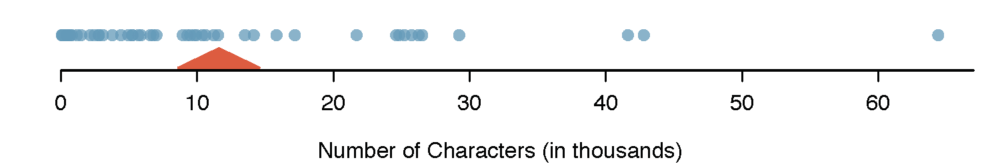
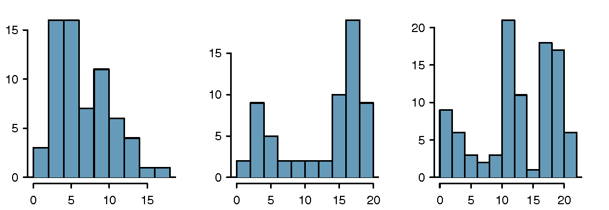
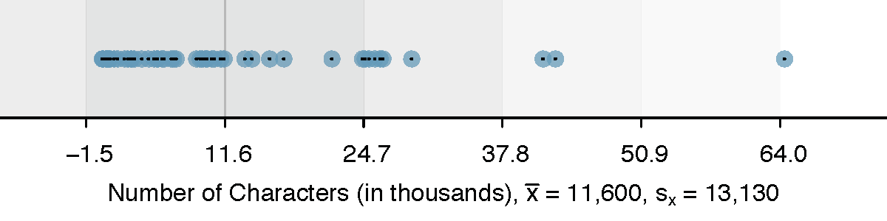
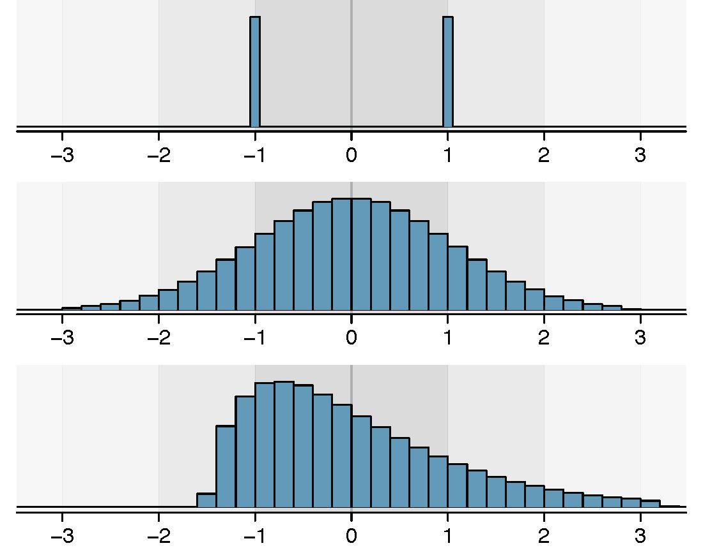

# Exploratory Data Analysis {#eda}


## Numerical Data {#numericalData}

[MCR-TODO: MCR wrote these bullet points, are they addressed?]

- Mention univariate - center, skew, shape, spread
- Mention conditional probabilities as well


This section introduces techniques for exploring and summarizing numerical variables, and the \data{email50} and \data{county} data sets from Section \@ref(dataBasics) provide rich opportunities for examples. 
Recall that outcomes of numerical variables are numbers on which it is reasonable to perform basic arithmetic operations. 
For example, the `pop2010` variable, which represents the populations of counties in 2010, is numerical since we can sensibly discuss the difference or ratio of the populations in two counties. 
On the other hand, area codes and zip codes are not numerical.

### Scatterplots for paired data {#scatterPlots}

\index{data!email50|(}

A \index{scatterplot}scatterplot provides a case-by-case view of data for two numerical variables. 
In Figure \@ref(fig:countyfedspendVsPoverty), a scatterplot was used to examine how federal spending and poverty were related in the \data{county} data set. 
Another scatterplot is shown in Figure \@ref(fig:email50LinesCharacters), comparing the number of line breaks (`line_breaks`) and number of characters (`num_char`) in emails for the \data{email50} data set. 
In any scatterplot, each point represents a single case. 
Since there are 50 cases in \data{email50}, there are 50 points in Figure \@ref(fig:email50LinesCharacters).

<!--
\textPE{\setlength{\captionwidth}{0.885\textwidth}} -->

```{r email50LinesCharacters, out.width="75%", fig.cap='A scatterplot of `line_breaks` versus `num_char` for the `email50` data.'}
include_graphics("01/figures/email50LinesCharacters/email50LinesCharacters.png")
```

<!--
\textPE{\setlength{\captionwidth}{\mycaptionwidth}} -->

To put the number of characters in perspective, this paragraph has 363 characters. 
Looking at Figure \@ref(fig:email50LinesCharacters), it seems that some emails are incredibly long! 
Upon further investigation, we would actually find that most of the long emails use the HTML format, which means most of the characters in those emails are used to format the email rather than provide text.

```{exercise echo=TRUE}
What do scatterplots reveal about the data, and how might they be useful?^[Answers may vary. Scatterplots are helpful in quickly spotting associations between variables, whether those associations represent simple or more complex relationships.]
```

\index{data!cars|(}

```{example echo=TRUE}
Consider a new data set of 54 cars with two variables: vehicle price and weight.^[Subset of data from http://www.amstat.org/publications/jse/v1n1/datasets.lock.html] 
A scatterplot of vehicle price versus weight is shown in Figure \@ref(fig:carsPriceVsWeight). 
What can be said about the relationship between these variables?
    
---
  
The relationship is evidently nonlinear, as highlighted by the dashed line. This is different from previous scatterplots we've seen, such as Figure \@ref(fig:countyfedspendVsPoverty) and Figure \@ref(fig:email50LinesCharacters), which show relationships that are very linear.
```


```{r carsPriceVsWeight, out.width="65%", fig.cap='A scatterplot of `price` versus `weight` for 54 cars.'}
include_graphics("01/figures/carsPriceVsWeight/carsPriceVsWeight.png")
```

\index{data!cars|)}

```{exercise echo=TRUE}
Describe two variables that would have a horseshoe shaped association in a scatterplot.^[Consider the case where your vertical axis represents something "good" and your horizontal axis represents something that is only good in moderation. Health and water consumption fit this description since water becomes toxic when consumed in excessive quantities.]
```

### Dot plots and the mean {#dotPlot}

Sometimes two variables is one too many: only one variable may be of interest. In these cases, a dot plot provides the most basic of displays. A \index{dot plot}dot plot is a one-variable scatterplot; an example using the number of characters from 50 emails is shown in Figure \@ref(fig:emailCharactersDotPlot). A stacked version of this dot plot is shown in Figure \@ref(fig:emailCharactersDotPlotStacked).


```{r emailCharactersDotPlot, out.width="100%", fig.cap='A dot plot of `num_char` for the `email50` data set.'}

```

```{r emailCharactersDotPlotStacked, out.width="67%", fig.cap='A stacked dot plot of `num_char` for the `email50` data set.'}
include_graphics("01/figures/emailCharactersDotPlot/emailCharactersDotPlotStacked.png")
```

The \index{mean}mean, sometimes called the \indexthis{average}{mean!average}average, is a common way to measure the center of a \index{distribution}distribution of data. 
To find the mean number of characters in the 50 emails, we add up all the character counts and divide by the number of emails. 
For computational convenience, the number of characters is listed in the thousands and rounded to the first decimal.
\begin{equation}
\bar{x} = \frac{21.7 + 7.0 + \cdots + 15.8}{50} = 11.6
(\#eq:sampleMeanEquation)
\end{equation}
<!--
The sample mean is often labeled $\bar{x}$\marginpar[\raggedright$\bar{x}$\\\footnotesize sample\\ mean]{\raggedright$\bar{x}$\\\footnotesize sample\\ mean}, and the letter $x$ is being used as a generic placeholder for the variable of interest, `num_char`. The sample mean is shown as a triangle in Figures \@ref(fig:emailCharactersDotPlot) and \@ref(fig:emailCharactersDotPlotStacked).
-->

The sample mean is often labeled $\bar{x}$, and the letter $x$ is being used as a generic placeholder for the variable of interest, `num_char`. The sample mean is shown as a triangle in Figures \@ref(fig:emailCharactersDotPlot) and \@ref(fig:emailCharactersDotPlotStacked).


\begin{termBox}{\tBoxTitle{Mean}%
The sample mean of a numerical variable is the sum of all of the observations divided by the number of observations:
\begin{eqnarray}
\bar{x} = \frac{x_1+x_2+\cdots+x_n}{n}
\label{meanEquation}
\end{eqnarray}
where $x_1, x_2, \dots, x_n$ represent the $n$ observed values.}
\end{termBox}\marginpar[\raggedright\vspace{-8mm}

<!--
$n$\\\footnotesize sample size]{\raggedright\vspace{-8mm}

$n$\\\footnotesize sample size}\vspace{-2mm}
-->


```{exercise echo=TRUE}
Examine Equations \@ref(eq:sampleMeanEquation) and \@ref(eq:meanEquation) above. 
What does $x_1$ correspond to? And $x_2$? 
  Can you infer a general meaning to what $x_i$ might represent?^[$x_1$ corresponds to the number of characters in the first email in the sample (21.7, in thousands), $x_2$ to the number of characters in the second email (7.0, in thousands), and $x_i$ corresponds to the number of characters in the $i^{th}$ email in the data set.]
```

```{exercise echo=TRUE}
What was $n$ in this sample of emails?^[The sample size was $n=50$.]
```

The \data{email50} data set is a sample from a larger population of emails that were received in January and March. 
We could compute a mean for this population in the same way as the sample mean. However, there is a difference in notation: the population mean has a special label:
<!--$\mu$\marginpar[\raggedright$\mu$\\\footnotesize population\\ mean]{\raggedright$\mu$\\\footnotesize population\\ mean}. \index{Greek!mu@mu ($\mu$)} --> 
The symbol $\mu$ is the Greek letter *mu* and represents the average of all observations in the population. 
Sometimes a subscript, such as $_x$, is used to represent which variable the population mean refers to, e.g. $\mu_x$.

```{example echo=TRUE}
The average number of characters across all emails can be estimated using the sample data. 
Based on the sample of 50 emails, what would be a reasonable estimate of $\mu_x$, the mean number of characters in all emails in the \data{email} data set? (Recall that \data{email50} is a sample from \data{email}.)

---

The sample mean, 11,600, may provide a reasonable estimate of $\mu_x$. 
While this number will not be perfect, it provides a \index{point estimate}point estimate of the population mean. 
In Chapter \@ref(FoundationForInference) and beyond, we will develop tools to characterize the accuracy of point estimates, and we will find that point estimates based on larger samples tend to be more accurate than those based on smaller samples.
```

```{example wtdMeanOfIncome, echo=TRUE}
We might like to compute the average income per person in the US. 
To do so, we might first think to take the mean of the per capita incomes from the 3,143 counties in the \data{county} data set. 
What would be a better approach?
  
---
  
The \data{county} data set is special in that each county actually represents many individual people. 
If we were to simply average across the `income` variable, we would be treating counties with 5,000 and 5,000,000 residents equally in the calculations. 
Instead, we should compute the total income for each county, add up all the counties' totals, and then divide by the number of people in all the counties. 
If we completed these steps with the \data{county} data, we would find that the per capita income for the US is $27,348.43. 
Had we computed the *simple* mean of per capita income across counties, the result would have been just $22,504.70!
```

Example \@ref(exm:wtdMeanOfIncome) used what is called a \index{weighted mean}\index{mean!weighted mean}weighted mean, which will not be a key topic in this textbook. 
However, we have provided an online supplement on weighted means for interested readers: http://www.openintro.org/stat/down/supp/wtdmean.pdf


### Histograms and shape {#histogramsAndShape}

Dot plots show the exact value of each observation. 
This is useful for small data sets, but they can become hard to read with larger samples. 
Rather than showing the value of each observation, think of the value as belonging to a *bin*. 
For example, in the \data{email50} data set, we create a table of counts for the number of cases with character counts between 0 and 5,000, then the number of cases between 5,000 and 10,000, and so on. 
Observations that fall on the boundary of a bin (e.g. 5,000) are allocated to the lower bin. 
This tabulation is shown in Table \@ref(tab:binnedNumCharTable). 
These binned counts are plotted as bars in Figure \@ref(fig:email50NumCharHist) into what is called a \index{histogram}histogram, which resembles the stacked dot plot shown in Figure \@ref(fig:emailCharactersDotPlotStacked).

Table: (\#tab:binnedNumCharTable) The counts for the binned `num_char` data.

| Characters (in thousands) | 0-5 | 5-10 | 10-15 | 15-20 | 20-25 | 25-30 | $\cdots$ | 55-60 | 60-65 |
|:----------------|:--------------------------:|:---------------------------:|:----------------------------:|:----------------------------:|:----------------------------:|:----------------------------:|:-------------------------------:|:----------------------------:|:----------------------------:|
| **Count**          |             19             |              12             |               6              |               2              |               3              |               5              |             $\cdots$            |               0              |               1              |


<!-- R code below looks terrible -->
```{r binnedNumCharTable, eval=FALSE}
H <- hist(email50$num_char, breaks=12, plot=FALSE)
counts <- rbind(H$counts)
colnames(counts) <- paste(H$breaks[1:13], 'to', H$breaks[2:14])
names(counts) <- c("Characters (in thousands)", "Count")
kable(counts, caption = "The counts for the binned `num_char` data.")
```

```{r email50NumCharHist, fig.cap='A histogram of `num_char`. This distribution is very strongly skewed to the right.'}
histPlot(email50$num_char, breaks=12, xlab='Number of Characters (in thousands)', ylab="Frequency", ylim=c(0, 23), col=COL[1], border=COL[5])
```


Histograms provide a view of the \index{data density}data density. 
Higher bars represent where the data are relatively more dense. 
For instance, there are many more emails between 0 and 10,000 characters than emails between 10,000 and 20,000 characters in the data set. 
The bars make it easy to see how the density of the data changes relative to the number of characters.

Histograms are especially convenient for describing the shape of the data distribution<!--\label{shapeFirstDiscussed}-->. 
Figure \@ref(fig:email50NumCharHist) shows that most emails have a relatively small number of characters, while fewer emails have a very large number of characters. 
When data trail off to the right in this way and have a longer right \hiddenterm{tail}\index{skew!tail}tail, the shape is said to be \indexsub{right skewed}{skew!right skewed}right skewed.^[Other ways to describe data that are skewed to the right: \indexni{skewed to the right}skewed to the right, \indexni{skewed to the high end}skewed to the high end, or \indexni{skewed to the positive end}skewed to the positive end.]

Data sets with the reverse characteristic -- a long, thin tail to the left -- are said to be \indexsub{left skewed}{skew!left skewed}left skewed. We also say that such a distribution has a long left tail. Data sets that show roughly equal trailing off in both directions are called \index{symmetric}symmetric.\index{skew!symmetric}

\begin{termBox}{\tBoxTitle{Long tails to identify skew}%
When data trail off in one direction, the distribution has a \index{long tail}. \index{skew!long tail|textbf} If a distribution has a long left tail, it is left skewed. If a distribution has a long right tail, it is right skewed.}
\end{termBox}

```{exercise echo=TRUE}
Take a look at the dot plots in Figures \@ref(fig:emailCharactersDotPlot) and \@ref(fig:emailCharactersDotPlotStacked). Can you see the skew in the data? Is it easier to see the skew in this histogram or the dot plots?^[The skew is visible in all three plots, though the flat dot plot is the least useful. The stacked dot plot and histogram are helpful visualizations for identifying skew.]
```

```{exercise echo=TRUE}
Besides the mean (since it was labeled), what can you see in the dot plots that you cannot see in the histogram?^[Character counts for individual emails.]
```

In addition to looking at whether a distribution is skewed or symmetric, histograms can be used to identify modes. A \index{mode}mode is represented by a prominent peak in the distribution.^[Another definition of mode, which is not typically used in statistics, is the value with the most occurrences. It is common to have *no* observations with the same value in a data set, which makes this other definition useless for many real data sets.] There is only one prominent peak in the histogram of `num_char`.

Figure \@ref(fig:singleBiMultiModalPlots) shows histograms that have one, two, or three prominent peaks. Such distributions are called \indexsub{unimodal}{modality!unimodal}unimodal, \indexsub{bimodal}{modality!bimodal}bimodal, and \indexsub{multimodal}{modality!multimodal}multimodal, respectively. Any distribution with more than 2 prominent peaks is called multimodal. Notice that there was one prominent peak in the unimodal distribution with a second less prominent peak that was not counted since it only differs from its neighboring bins by a few observations.


```{r singleBiMultiModalPlots, out.width="100%", fig.cap='Counting only prominent peaks, the distributions are (left to right) unimodal, bimodal, and multimodal.'}

```

```{exercise echo=TRUE}
Figure \@ref(fig:email50NumCharHist) reveals only one prominent mode in the number of characters. Is the distribution unimodal, bimodal, or multimodal?^[Unimodal. Remember that *uni* stands for 1 (think *uni*cycles). Similarly, *bi* stands for 2 (think *bi*cycles). (We're hoping a *multicycle* will be invented to complete this analogy.)]
```

```{exercise echo=TRUE}
Height measurements of young students and adult teachers at a K-3 elementary school were taken. How many modes would you anticipate in this height data set?^[There might be two height groups visible in the data set: one of the students and one of the adults. That is, the data are probably bimodal.]
```

\begin{tipBox}{\tipBoxTitle{Looking for modes}
Looking for modes isn't about finding a clear and correct answer about the number of modes in a distribution, which is why *prominent* is not rigorously defined in this book. The important part of this examination is to better understand your data and how it might be structured.}
\end{tipBox}


### Variance and standard deviation {#variability}

The mean is used to describe the center of a data set, but the \indexthis{variability}{variability}variablity in the data is also important. Here, we introduce two measures of variability: the variance and the standard deviation. Both of these are very useful in data analysis, even though the formulas are a bit tedious to calculate by hand. The standard deviation is the easier of the two to conceptually understand, and it roughly describes how far away the typical observation is from the mean.

We call the distance of an observation from its mean its \index{deviation}deviation. Below are the deviations for the $1^{st}_{}$, $2^{nd}_{}$, $3^{rd}$, and $50^{th}_{}$ observations in the `num_char` variable. For computational convenience, the number of characters is listed in the thousands and rounded to the first decimal.
\begin{align*}
x_1^{}-\bar{x} &= 21.7 - 11.6 = 10.1 \hspace{5mm}\text{ } \\
x_2^{}-\bar{x} &= 7.0 - 11.6 = -4.6 \\
x_3^{}-\bar{x} &= 0.6 - 11.6 = -11.0 \\
			&\ \vdots \\
x_{50}^{}-\bar{x} &= 15.8 - 11.6 = 4.2
\end{align*}
<!--
% library(openintro); d <- email50$num_char; round(mean(d),1); d[c(1,2,3,50)]; d[c(1,2,3,50)] - round(mean(d),1); (d[c(1,2,3,50)] - round(mean(d)))^2; sum((d - round(mean(d)))^2)/49; sqrt(sum((d - round(mean(d)))^2)/49); var(d); sd(d)-->

If we square these deviations and then take an average, the result is about equal to the sample \index{variance}\label{varianceIsDefined}variance, denoted by $s_{}^2$.<!--\marginpar[\raggedright$s^2_{}$\\\footnotesize sample variance]{\raggedright$s^2_{}$\\\footnotesize sample variance}:-->

\begin{align*}
s_{}^2 &= \frac{10.1_{}^2 + (-4.6)_{}^2 + (-11.0)_{}^2 + \cdots + 4.2_{}^2}{50-1} \\
	&= \frac{102.01 + 21.16 + 121.00 + \cdots + 17.64}{49} \\
	&= 172.44
\end{align*}
We divide by $n-1$, rather than dividing by $n$, when computing the variance; you need not worry about this mathematical nuance for the material in this textbook. 
Notice that squaring the deviations does two things. 
First, it makes large values much larger, seen by comparing $10.1^2$, $(-4.6)^2$, $(-11.0)^2$, and $4.2^2$. 
Second, it gets rid of any negative signs.

The \index{standard deviation}standard deviation is the square root of the variance:
$$s=\sqrt{172.44} = 13.13$$
<!--\marginpar[\raggedright\vspace{-10mm}

$s$\\\footnotesize sample standard deviation]{\raggedright\vspace{-10mm}

$s$\\\footnotesize sample standard deviation
}\index{s@$s$}-->
The standard deviation of the number of characters in an email is about 13.13 thousand. 
A subscript of $_x$ may be added to the variance and standard deviation, i.e. $s_x^2$ and $s_x^{}$, as a reminder that these are the variance and standard deviation of the observations represented by $x_1^{}$, $x_2^{}$, ..., $x_n^{}$.
The $_{x}$ subscript is usually omitted when it is clear which data the variance or standard deviation is referencing.

\begin{termBox}{\tBoxTitle{Variance and standard deviation}
The variance is roughly the average squared distance from the mean. The standard deviation is the square root of the variance and describes how close the data are to the mean.}
\end{termBox}

Formulas and methods used to compute the variance and standard deviation for a population are similar to those used for a sample.^[The only difference is that the population variance has a division by $n$ instead of $n-1$.] 
However, like the mean, the population values have special symbols: $\sigma_{}^2$<!--\marginpar[\raggedright$\sigma_{}^2$\\\footnotesize population variance\\ \hspace{2mm}]{\raggedright$\sigma_{}^2$\\\footnotesize population variance\\ \hspace{2mm}}--> for the variance and $\sigma$<!--\marginpar[\raggedright$\sigma$\\\footnotesize population standard deviation\\ \hspace{2mm}]{\raggedright$\sigma$\\\footnotesize population standard deviation\\ \hspace{2mm}}--> for the standard deviation. The symbol $\sigma$ \index{Greek!sigma@sigma ($\sigma$)} is the Greek letter *sigma*.


```{r sdAsRuleForEmailNumChar, out.width="100%", fig.cap='In the `num_char` data, 41 of the 50 emails (82%) are within 1 standard deviation of the mean, and 47 of the 50 emails (94%) are within 2 standard deviations. Usually about 70% of the data are within 1 standard deviation of the mean and 95% are within 2 standard deviations, though this rule of thumb is less accurate for skewed data, as shown in this example.'}

```

\begin{tipBox}{\tipBoxTitle{standard deviation describes variability}
Focus on the conceptual meaning of the standard deviation as a descriptor of variability rather than the formulas. Usually 70% of the data will be within one standard deviation of the mean and about 95% will be within two standard deviations. However, as seen in Figures \ref{sdAsRuleForEmailNumChar} and \ref{severalDiffDistWithSdOf1}, these percentages are not strict rules.}
\end{tipBox}


```{r severalDiffDistWithSdOf1, out.width="63%", fig.cap='Three very different population distributions with the same mean $\\mu=0$ and standard deviation $\\sigma=1$.'}

```

<!--On page \pageref{shapeFirstDiscussed}-->
```{exercise echo=TRUE}
Previously, the concept of shape of a distribution was introduced. 
A good description of the shape of a distribution should include modality and whether the distribution is symmetric or skewed to one side. 
Using Figure \@ref(fig:severalDiffDistWithSdOf1) as an example, explain why such a description is important.^[Figure \@ref(fig:severalDiffDistWithSdOf1) shows three distributions that look quite different, but all have the same mean, variance, and standard deviation. Using modality, we can distinguish between the first plot (bimodal) and the last two (unimodal). Using skewness, we can distinguish between the last plot (right skewed) and the first two. While a picture, like a histogram, tells a more complete story, we can use modality and shape (symmetry/skew) to characterize basic information about a distribution.]
```

```{example echo=TRUE}
Describe the distribution of the `num_char` variable using the histogram in Figure \@ref(fig:email50NumCharHist). 
The description should incorporate the center, variability, and shape of the distribution, and it should also be placed in context: the number of characters in emails. 
Also note any especially unusual cases.

---

The distribution of email character counts is unimodal and very strongly skewed to the high end. 
Many of the counts fall near the mean at 11,600, and most fall within one standard deviation (13,130) of the mean. 
There is one exceptionally long email with about 65,000 characters.
```

In practice, the variance and standard deviation are sometimes used as a means to an end, where the "end" is being able to accurately estimate the uncertainty associated with a sample statistic. 
For example, in Chapter \@ref(FoundationForInference) we will use the variance and standard deviation to assess how close the sample mean is to the population mean.

### Box plots, quartiles, and the median

A \index{box plot}box plot summarizes a data set using five statistics while also plotting unusual observations. 
Figure \@ref(fig:boxPlotLayoutNumVar) provides a vertical dot plot alongside a box plot of the `num_char` variable from the \data{email50} data set.


```{r boxPlotLayoutNumVar, out.width="87%", fig.cap='A vertical dot plot next to a labeled box plot for the number of characters in 50 emails. The median (6,890), splits the data into the bottom 50% and the top 50%, marked in the dot plot by horizontal dashes and open circles, respectively.'}
include_graphics("01/figures/boxPlotLayoutNumVar/boxPlotLayoutNumVar.png")
```

The first step in building a box plot is drawing a dark line denoting the \index{median}median, which splits the data in half. Figure \@ref(fig:boxPlotLayoutNumVar) shows 50% of the data falling below the median (dashes) and other 50% falling above the median (open circles). 
There are 50 character counts in the data set (an even number) so the data are perfectly split into two groups of 25. 
We take the median in this case to be the average of the two observations closest to the $50^{th}$ percentile: $(\text{6,768} + \text{7,012}) / 2 = \text{6,890}$. 
When there are an odd number of observations, there will be exactly one observation that splits the data into two halves, and in this case that observation is the median (no average needed).

\begin{termBox}{\tBoxTitle{Median: the number in the middle}
If the data are ordered from smallest to largest, the \index{median} is the observation right in the middle. If there are an even number of observations, there will be two values in the middle, and the median is taken as their average.}
\end{termBox}

The second step in building a box plot is drawing a rectangle to represent the middle 50% of the data. 
The total length of the box, shown vertically in Figure \@ref(fig:boxPlotLayoutNumVar), is called the \index{interquartile range}interquartile range (\hiddenterm{IQR}IQR, for short). 
It, like the standard deviation, is a measure of \indexthis{variability}{variability}variability in data. 
The more variable the data, the larger the standard deviation and IQR. The two boundaries of the box are called the \index{first quartile}first quartile \index{quartile!first quartile} (the $25^{th}$ \hiddenterm{percentile}percentile, i.e. 25% of the data fall below this value) and the \index{third quartile}third quartile \index{quartile!third quartile} (the $75^{th}$ percentile), and these are often labeled $Q_1$ \index{Q$_1$} and $Q_3$\index{Q$_3$}, respectively.

\begin{termBox}{\tBoxTitle{Interquartile range (IQR)}
The IQR\index{interquartile range} is the length of the box in a box plot. 
It is computed as
\begin{eqnarray*}
IQR = Q_3 - Q_1
\end{eqnarray*}
where $Q_1$ and $Q_3$ are the $25^{th}$ and $75^{th}$ percentiles.}
\end{termBox}

```{exercise echo=TRUE}
What percent of the data fall between $Q_1$ and the median? 
What percent is between the median and $Q_3$?^[Since $Q_1$ and $Q_3$ capture the middle 50% of the data and the median splits the data in the middle, 25% of the data fall between $Q_1$ and the median, and another 25% falls between the median and $Q_3$.]
```

Extending out from the box, the \index{whiskers}whiskers attempt to capture the data outside of the box, however, their reach is never allowed to be more than $1.5\times IQR$.^[While the choice of exactly 1.5 is arbitrary, it is the most commonly used value for box plots.] They capture everything within this reach. In Figure \@ref(fig:boxPlotLayoutNumVar), the upper whisker does not extend to the last three points, which are beyond $Q_3 + 1.5\times IQR$, and so it extends only to the last point below this limit. The lower whisker stops at the lowest value, 33, since there is no additional data to reach; the lower whisker's limit is not shown in the figure because the plot does not extend down to $Q_1 - 1.5\times IQR$. In a sense, the box is like the body of the box plot and the whiskers are like its arms trying to reach the rest of the data.

Any observation that lies beyond the whiskers is labeled with a dot. The purpose of labeling these points -- instead of just extending the whiskers to the minimum and maximum observed values -- is to help identify any observations that appear to be unusually distant from the rest of the data. Unusually distant observations are called \indexsub{outliers}{outlier}outliers. In this case, it would be reasonable to classify the emails with character counts of 41,623, 42,793, and 64,401 as outliers since they are numerically distant from most of the data.

\begin{termBox}{\tBoxTitle{Outliers are extreme}
An \index{outlier} is an observation that is extreme relative to the rest of the data.}
\end{termBox}


\begin{tipBox}{\tipBoxTitle{Why it is important to look for outliers}
Examination of data for possible outliers serves many useful purposes, including\vspace{-2mm}
\begin{enumerate}
\setlength{\itemsep}{0mm}
\item Identifying \indexthis{strong skew}{skew!strong skew} in the distribution.
\item Identifying data collection or entry errors. For instance, we re-examined the email purported to have 64,401 characters to ensure this value was accurate.
\item Providing insight into interesting properties of the data.\vspace{0.5mm}
\end{enumerate}}
\end{tipBox}

```{exercise echo=TRUE}
The observation 64,401, an outlier, was found to be an accurate observation. 
What would such an observation suggest about the nature of character counts in emails?^[That occasionally there may be very long emails.]
```


```{exercise echo=TRUE}
Using Figure \@ref(fig:boxPlotLayoutNumVar), estimate the following values for `num_char` in the \data{email50} data set: (a) $Q_1$, (b) $Q_3$, and (c) IQR.^[These visual estimates will vary a little from one person to the next: $Q_1\approx$ 3,000, $Q_3\approx$ 15,000, $\text{IQR}=Q_3 - Q_1 \approx $ 12,000. (The true values: $Q_1=$ 2,536, $Q_3=$ 15,411, $\text{IQR} = $ 12,875.)]
```


### Comparing numerical data across groups {#comparingAcrossGroups}

\index{data!county|(}

Some of the more interesting investigations can be considered by examining numerical data across groups. The methods required here aren't really new. 
All that is required is to make a numerical plot for each group. Here two convenient methods are introduced: side-by-side box plots and hollow histograms.

We will take a look again at the \data{county} data set and compare the median household income for counties that gained population from 2000 to 2010 versus counties that had no gain. 
While we might like to make a causal connection here, remember that these are observational data and so such an interpretation would be unjustified.

There were 2,041 counties where the population increased from 2000 to 2010, and there were 1,099 counties with no gain (all but one were a loss). 
A random sample of 100 counties from the first group and 50 from the second group are shown in Table \@ref(tab:countyIncomeSplitByPopGainTable) to give a better sense of some of the raw data.


Table: (\#tab:countyIncomeSplitByPopGainTable) In this table, median household income (in $1000s) from a random sample of 100 counties that gained population over 2000-2010 are shown on the left. Median incomes from a random sample of 50 counties that had no population gain are shown on the right.

| population gain |      |      |      |      |      |               | no gain |      |      |
|:-------------------:|:----:|:----:|:----:|:----:|:----:|:-------------:|:-----------:|:----:|:----:|
|         41.2        | 33.1 | 30.4 | 37.3 | 79.1 | 34.5 |  |     40.3    | 33.5 | 34.8 |
|         22.9        | 39.9 | 31.4 | 45.1 | 50.6 | 59.4 |               |     29.5    | 31.8 | 41.3 |
|         47.9        | 36.4 | 42.2 | 43.2 | 31.8 | 36.9 |               |      28     | 39.1 | 42.8 |
|         50.1        | 27.3 | 37.5 | 53.5 | 26.1 | 57.2 |               |     38.1    | 39.5 | 22.3 |
|         57.4        | 42.6 | 40.6 | 48.8 | 28.1 | 29.4 |               |     43.3    | 37.5 | 47.1 |
|         43.8        |  26  | 33.8 | 35.7 | 38.5 | 42.3 |               |     43.7    | 36.7 |  36  |
|         41.3        | 40.5 | 68.3 |  31  | 46.7 | 30.5 |               |     35.8    | 38.7 | 39.8 |
|         68.3        | 48.3 | 38.7 |  62  | 37.6 | 32.2 |               |      46     | 42.3 | 48.2 |
|         42.6        | 53.6 | 50.7 | 35.1 | 30.6 | 56.8 |               |     38.6    | 31.9 | 31.1 |
|         66.4        | 41.4 | 34.3 | 38.9 | 37.3 | 41.7 |               |     37.6    | 29.3 | 30.1 |
|         51.9        | 83.3 | 46.3 | 48.4 | 40.8 | 42.6 |               |     57.5    | 32.6 | 31.1 |
|         44.5        |  34  | 48.7 | 45.2 | 34.7 | 32.2 |               |     46.2    | 26.5 | 40.1 |
|         39.4        | 38.6 |  40  | 57.3 | 45.2 | 33.1 |               |     38.4    | 46.7 | 25.9 |
|         43.8        | 71.7 | 45.1 | 32.2 | 63.3 | 54.7 |               |     36.4    | 41.5 | 45.7 |
|         71.3        | 36.3 | 36.4 |  41  |  37  | 66.7 |               |     39.7    |  37  | 37.7 |
|         50.2        | 45.8 | 45.7 | 60.2 | 53.1 |      |               |     21.4    | 29.3 | 50.1 |
|         35.8        | 40.4 | 51.5 | 66.4 | 36.1 |      |               |     43.6    | 39.8 |      |


The \index{side-by-side box plot} \index{box plot!side-by-side box plot}side-by-side box plot is a traditional tool for comparing across groups. 
An example is shown in the left panel of Figure \@ref(fig:countyIncomeSplitByPopGain), where there are two box plots, one for each group, placed into one plotting window and drawn on the same scale.


```{r countyIncomeSplitByPopGain, fig.cap = 'Side-by-side box plot (left panel) and hollow histograms (right panel) for `med_income`, where the counties are split by whether there was a population gain or loss from 2000 to 2010. The income data were collected between 2006 and 2010.', out.width='100%'}
include_graphics(c("01/figures/countyIncomeSplitByPopGain/countyIncomeSplitByPopGain.png"))
```

Another useful plotting method uses \indexsub{hollow histograms}{hollow histogram}hollow histograms to compare numerical data across groups. 
These are just the outlines of histograms of each group put on the same plot, as shown in the right panel of Figure \@ref(fig:countyIncomeSplitByPopGain).

```{exercise comparingPriceByTypeExercise, echo=TRUE}
Use the plots in Figure \@ref(fig:countyIncomeSplitByPopGain) to compare the incomes for counties across the two groups. 
What do you notice about the approximate center of each group? 
What do you notice about the variability between groups? 
Is the shape relatively consistent between groups? 
How many *prominent* modes are there for each group?^[Answers may vary a little. The counties with population gains tend to have higher income (median of about $45,000) versus counties without a gain (median of about $40,000). The variability is also slightly larger for the population gain group. This is evident in the IQR, which is about 50% bigger in the *gain* group. Both distributions show slight to moderate right skew\index{skew!example: slight to moderate} and are unimodal. There is a secondary small bump at about $60,000 for the *no gain* group, visible in the hollow histogram plot, that seems out of place. (Looking into the data set, we would find that 8 of these 15 counties are in Alaska and Texas.) The box plots indicate there are many observations far above the median in each group, though we should anticipate that many observations will fall beyond the whiskers when using such a large data set.]
```

```{exercise echo=TRUE}
What components of each plot in Figure \@ref(fig:countyIncomeSplitByPopGain) do you find most useful?^[Answers will vary. The side-by-side box plots are especially useful for comparing centers and spreads, while the hollow histograms are more useful for seeing distribution shape, skew, and groups of anomalies.]
```

\index{data!county|)}


### Robust statistics

How are the \indexthis{sample statistics}{sample statistic}sample statistics of the `num_char` variable set affected by the observation, 64,401? 
What would have happened if this email wasn't observed? 
What would happen to these \indexthis{summary statistics}{summary statistic}summary statistics if the observation at 64,401 had been even larger, say 150,000? 
These scenarios are plotted alongside the original data in Figure \@ref(fig:email50NumCharDotPlotRobustEx), and sample statistics are computed under each scenario in Table \@ref(tab:robustOrNotTable).


```{r email50NumCharDotPlotRobustEx, out.width="100%", fig.cap='Dot plots of the original character count data and two modified data sets.'}
include_graphics("01/figures/email50NumCharDotPlotRobustEx/email50NumCharDotPlotRobustEx.png")
```

Table: (\#tab:robustOrNotTable) A comparison of how the median, IQR, mean ($\bar{x}$), and standard deviation ($s$) change when extreme observations are present.

|                          | \bf robust |        | \bf not robust |        |
|--------------------------|:----------:|:------:|:--------------:|:------:|
| scenario                 |   median   |   IQR  |    $\bar{x}$   |   $s$  |
| original `num_char` data |    6,890   | 12,875 |     11,600     | 13,130 |
| drop 66,924 observation  |    6,768   | 11,702 |     10,521     | 10,798 |
| move 66,924 to 150,000   |    6,890   | 12,875 |     13,310     | 22,434 |


```{exercise numCharWhichIsMoreRobust, echo=TRUE}
(a) Which is more affected by extreme observations, the mean or median? 
Table \@ref(tab:robustOrNotTable) may be helpful. 
(b) Is the standard deviation or IQR more affected by extreme observations?^[(a) Mean is affected more. (b) Standard deviation is affected more. Complete explanations are provided in the material following Guided Practice \@ref(exr:numCharWhichIsMoreRobust).]
```

The median and IQR are called \index{robust estimates}robust estimates because extreme observations have little effect on their values. 
The mean and standard deviation are much more affected by changes in extreme observations.

```{example echo=TRUE}
The median and IQR do not change much under the three scenarios in Table \@ref(tab:robustOrNotTable). 
Why might this be the case?
  
---
  
The median and IQR are only sensitive to numbers near $Q_1$, the median, and $Q_3$. 
Since values in these regions are relatively stable -- there aren't large jumps between observations -- the median and IQR estimates are also quite stable.
```

```{exercise echo=TRUE}
The distribution of vehicle prices tends to be right skewed, with a few luxury and sports cars lingering out into the right tail. 
If you were searching for a new car and cared about price, should you be more interested in the mean or median price of vehicles sold, assuming you are in the market for a regular car?^[Buyers of a "regular car" should be concerned about the median price. High-end car sales can drastically inflate the mean price while the median will be more robust to the influence of those sales.]
```

### Transforming data (special topic) {#transformingDataSubsection}

When data are very strongly skewed, we sometimes transform them so they are easier to model. 
Consider the histogram of salaries for Major League Baseball players' salaries from 2010, which is shown in Figure \@ref(fig:histMLBSalaries)(a).


```{r histMLBSalaries, fig.cap = '(a) Histogram of MLB player salaries for 2010, in millions of dollars. (b) Histogram of the log-transformed MLB player salaries for 2010.', fig.subcap=c('(a)', '(b)'), out.width='47%', fig.ncol = 2, fig.show='hold'}
include_graphics(c("01/figures/histMLBSalaries/histMLBSalariesReg.png", "01/figures/histMLBSalaries/histMLBSalariesLog.png"))
```


```{example echo=TRUE}
The histogram of MLB player salaries is useful in that we can see the data are extremely skewed\index{skew!example: extreme} and centered (as gauged by the median) at about $1 million. 
What isn't useful about this plot?

---

Most of the data are collected into one bin in the histogram and the data are so strongly skewed that many details in the data are obscured.
```

There are some standard transformations that are often applied when much of the data cluster near zero (relative to the larger values in the data set) and all observations are positive. 
A \index{transformation}transformation is a rescaling of the data using a function. 
For instance, a plot of the natural logarithm^[Statisticians often write the natural logarithm as $\log$. 
You might be more familiar with it being written as $\ln$.] of player salaries results in a new histogram in Figure \@ref(fig:histMLBSalaries)(b). 
Transformed data are sometimes easier to work with when applying statistical models because the transformed data are much less skewed and outliers are usually less extreme.

Transformations can also be applied to one or both variables in a scatterplot. A scatterplot of the `line_breaks` and `num_char` variables is shown in Figure \@ref(fig:email50LinesCharactersModMain)(a), which was earlier shown in Figure \@ref(fig:email50LinesCharacters). 
We can see a positive association between the variables and that many observations are clustered near zero. 
In Chapter \@ref(linRegrForTwoVar), we might want to use a straight line to model the data. 
However, we'll find that the data in their current state cannot be modeled very well. 
Figure \@ref(fig:email50LinesCharactersModMain)(b) shows a scatterplot where both the `line_breaks` and `num_char` variables have been transformed using a log (base $e$) transformation. 
While there is a positive association in each plot, the transformed data show a steadier trend, which is easier to model than the untransformed data.


```{r email50LinesCharactersModMain, fig.cap = '(a) Scatterplot of `line_breaks` against `num_char` for 50 emails. (b) A scatterplot of the same data but where each variable has been log-transformed.', fig.subcap=c('(a)', '(b)'), out.width='47%', fig.ncol = 2, fig.show='hold'}
include_graphics(c("01/figures/email50LinesCharactersMod/email50LinesCharactersMod.png", "01/figures/email50LinesCharactersMod/email50LinesCharactersModLog.png"))
```

Transformations other than the logarithm can be useful, too. 
For instance, the square root ($\sqrt{\text{original observation}}$) and inverse ($\frac{1}{\text{original observation}}$) are used by statisticians. 
Common goals in transforming data are to see the data structure differently, reduce skew, assist in modeling, or straighten a nonlinear relationship in a scatterplot.

\index{data!email50|)}

### Mapping data (special topic)

\index{data!county|(}
\index{intensity map|(}

The \data{county} data set offers many numerical variables that we could plot using dot plots, scatterplots, or box plots, but these miss the true nature of the data. 
Rather, when we encounter geographic data, we should map it using an \index{intensity map}intensity map, where colors are used to show higher and lower values of a variable. 
Figures \@ref(fig:countyIntensityMaps1) and \@ref(fig:countyIntensityMaps2) shows intensity maps for federal spending per capita (`fed_spend`), poverty rate in percent (`poverty`), homeownership rate in percent (`homeownership`), and median household income (`med_income`). 
The color key indicates which colors correspond to which values. 
Note that the intensity maps are not generally very helpful for getting precise values in any given county, but they are very helpful for seeing geographic trends and generating interesting research questions.


```{r countyIntensityMaps1, fig.cap = '(a) Map of federal spending (dollars per capita). (b) Intensity map of poverty rate (percent).', fig.subcap=c('(a)', '(b)'), out.width='47%', fig.ncol = 2, fig.show='hold'}
include_graphics(c("01/figures/countyIntensityMaps/countyFedSpendMap.png", "01/figures/countyIntensityMaps/countyPovertyMap.png"))
```

```{r countyIntensityMaps2, fig.cap = '(a) Intensity map of homeownership rate (percent). (b) Intensity map of median household income ($1000s).', fig.subcap=c('(a)', '(b)'), out.width='47%', fig.ncol = 2, fig.show='hold'}
include_graphics(c("01/figures/countyIntensityMaps/countyHomeownershipMap.png", "01/figures/countyIntensityMaps/countyMedIncomeMap.png"))
```

```{example echo=TRUE}
What interesting features are evident in the `fed_spend` and `poverty` intensity maps?

---
  
The federal spending intensity map shows substantial spending in the Dakotas and along the central-to-western part of the Canadian border, which may be related to the oil boom in this region. 
There are several other patches of federal spending, such as a vertical strip in eastern Utah and Arizona and the area where Colorado, Nebraska, and Kansas meet. 
There are also seemingly random counties with very high federal spending relative to their neighbors. 
If we did not cap the federal spending range at $18 per capita, we would actually find that some counties have extremely high federal spending while there is almost no federal spending in the neighboring counties. 
These high-spending counties might contain military bases, companies with large government contracts, or other government facilities with many employees.

Poverty rates are evidently higher in a few locations. 
Notably, the deep south shows higher poverty rates, as does the southwest border of Texas. 
The vertical strip of eastern Utah and Arizona, noted above for its higher federal spending, also appears to have higher rates of poverty (though generally little correspondence is seen between the two variables).  
High poverty rates are evident in the Mississippi flood plains a little north of New Orleans and also in a large section of Kentucky and West Virginia.
```

```{exercise echo=TRUE}
What interesting features are evident in the `med_income` intensity map?^[Note: answers will vary. There is a very strong correspondence between high earning and metropolitan areas. You might look for large cities you are familiar with and try to spot them on the map as dark spots.]
```

\index{intensity map|)}
\index{data!county|)}

## Categorical Data  {#categoricalData}

[MCR-TODO: MCR wrote these bullet points, are they addressed?]

- Conditional probability from contingency tables
- Bayes Theorem (law of total probability?)
	
\index{data!email|(}

Like numerical data, categorical data can also be organized and analyzed. 
This section introduces tables and other basic tools for categorical data that are used throughout this book. 
The \data{email50} data set represents a sample from a larger email data set called \data{email}. 
This larger data set contains information on 3,921 emails. 
In this section we will examine whether the presence of numbers, small or large, in an email provides any useful value in classifying email as spam or not spam.
<!--
% library(openintro); data(email); dim(email)
-->

### Contingency tables and bar plots

Table \@ref(tab:emailSpamNumberTableTotals) summarizes two variables: `spam` and `number`. 
Recall that `number` is a categorical variable that describes whether an email contains no numbers, only small numbers (values under 1 million), or at least one big number (a value of 1 million or more). 
A table that summarizes data for two categorical variables in this way is called a \index{contingency table}contingency table. 
Each value in the table represents the number of times a particular combination of variable outcomes occurred. 
For example, the value 149 corresponds to the number of emails in the data set that are spam *and* had no number listed in the email. 
Row and column totals are also included. 
The \index{row totals}row totals \index{contingency table!row totals} provide the total counts across each row (e.g. $149 + 168 + 50 = 367$), and \index{column totals}column totals \index{contingency table!column totals} are total counts down each column.

A table for a single variable is called a \index{frequency table}frequency table. 
Table \@ref(tab:emailNumberTable) is a frequency table for the `number` variable. 
If we replaced the counts with percentages or proportions, the table would be called a \index{relative frequency table}relative frequency table.

Table: (\#tab:emailSpamNumberTableTotals) A contingency table for `spam` and `number`.

|                               |          | `number` |      |     |      |
|-------------------------------|----------|:------------:|:----:|:---:|-----:|
|                               |    | `none` | `small`  |   `big`  | `Total`  |
|                               | `spam`     |      149     |  168 |  50 |  367 |
| `spam` | `not spam` |      400     | 2659 | 495 | 3554 |
|                               | `Total`    |      549     | 2827 | 545 | 3921 |


```{r}
library(openintro)
data(email)
table(email[,c("spam", "number")])[2:1,] %>% 
  addmargins() %>% kable(caption="A contingency table for `spam` and `number`.")
#xtable(tab); rowSums(tab); colSums(tab); sum(tab)
```


```{r emailNumberTable}
library(openintro)
data(email)
table(email[,c("number")]) %>% 
  addmargins() %>% t() %>% kable(caption="A frequency table for the `number` variable.")
```

A bar plot is a common way to display a single categorical variable. 
The left panel of Figure \@ref(fig:emailNumberBarPlot) shows a \index{bar plot}bar plot for the `number` variable. In the right panel, the counts are converted into proportions (e.g. $549/3921=0.140$ for `none`).


```{r emailNumberBarPlot, fig.cap = 'Two bar plots of `number`. The left panel shows the counts, and the right panel shows the proportions in each group.', out.width='100%'}
include_graphics(c("01/figures/emailNumberBarPlot/emailNumberBarPlot.png"))
```

### Row and column proportions

Table \@ref(tab:rowPropSpamNumber) shows the row proportions for Table \@ref(tab:emailSpamNumberTableTotals). 
The \indexsub{row proportions}{contingency table!row proportions}row proportions are computed as the counts divided by their row totals. 
The value 149 at the intersection of `spam` and `none` is replaced by $149/367=0.406$, i.e. 149 divided by its row total, 367. 
So what does 0.406 represent? 
It corresponds to the proportion of spam emails in the sample that do not have any numbers.

Table: (\#tab:rowPropSpamNumber) A contingency table with row proportions for the `spam` and `number` variables.

|          |               none |               small |                big | Total |
|----------|-------------------:|--------------------:|-------------------:|------:|
| spam     |  $149/367 = 0.406$ |   $168/367 = 0.458$ |   $50/367 = 0.136$ | 1.000 |
| not spam | $400/3554 = 0.113$ | $2657/3554 = 0.748$ | $495/3554 = 0.139$ | 1.000 |
| Total    | $549/3921 = 0.140$ | $2827/3921 = 0.721$ | $545/3921 = 0.139$ | 1.000 |

<!--
% library(openintro); data(email); g <- table(email$spam, email$number)[2:1,]; g / rep(rowSums(g), 3); rowSums(g)
-->

A contingency table of the column proportions is computed in a similar way, where each \indexsub{column proportion}{contingency table!column proportion}column proportion is computed as the count divided by the corresponding column total. 
Table \@ref(tab:colPropSpamNumber) shows such a table, and here the value 0.271 indicates that 27.1% of emails with no numbers were spam. 
This rate of spam is much higher than emails with only small numbers (5.9%) or big numbers (9.2%). 
Because these spam rates vary between the three levels of `number` (`none`, `small`, `big`), this provides evidence that the `spam` and `number` variables are associated.

Table: (\#tab:colPropSpamNumber) A contingency table with column proportions for the `spam` and `number` variables.

|          |              none |               small |               big |               Total |
|----------|------------------:|--------------------:|------------------:|--------------------:|
| spam     | $149/549 = 0.271$ |  $168/2827 = 0.059$ |  $50/545 = 0.092$ |  $367/3921 = 0.094$ |
| not spam | $400/549 = 0.729$ | $2659/2827 = 0.941$ | $495/545 = 0.908$ | $3684/3921 = 0.906$ |
| Total    |             1.000 |               1.000 |             1.000 |               1.000 |

<!--
% library(openintro); data(email); g <- table(email$spam, email$number)[2:1,]; g / rep(colSums(g), rep(2, 3)); g; colSums(g)

\textPE{\pagebreak}
-->

We could also have checked for an association between `spam` and `number` in Table \@ref(tab:rowPropSpamNumber) using row proportions. 
When comparing these row proportions, we would look down columns to see if the fraction of emails with no numbers, small numbers, and big numbers varied from `spam` to `not spam`.

```{exercise echo=TRUE}
What does 0.458 represent in Table \@ref(tab:rowPropSpamNumber)? 
What does 0.059 represent in Table \@ref(tab:colPropSpamNumber)?^[0.458 represents the proportion of spam emails that had a small number. 0.058 represents the fraction of emails with small numbers that are spam.]
```

```{exercise echo=TRUE}
What does 0.139 at the intersection of `not spam` and `big` represent in Table \@ref(tab:rowPropSpamNumber)? 
  What does 0.908 represent in the Table \@ref(tab:colPropSpamNumber)?^[0.139 represents the fraction of non-spam email that had a big number. 0.908 represents the fraction of emails with big numbers that are non-spam emails.]
```

<!--
\GLMSection{This is a topic we will return to in Chapter \ref{multipleRegressionAndANOVA}.}
-->
```{example weighingRowColumnProportions,echo=TRUE}
Data scientists use statistics to filter spam from incoming email messages. 
By noting specific characteristics of an email, a data scientist may be able to classify some emails as spam or not spam with high accuracy. 
One of those characteristics is whether the email contains no numbers, small numbers, or big numbers. 
Another characteristic is whether or not an email has any HTML content. 
A contingency table for the `spam` and `format` variables from the \data{email} data set are shown in Table \@ref(tab:emailSpamHTMLTableTotals). 
Recall that an HTML email is an email with the capacity for special formatting, e.g. bold text. 
In Table \@ref(tab:emailSpamHTMLTableTotals), which would be more helpful to someone hoping to classify email as spam or regular email: row or column proportions?

--- 

Such a person would be interested in how the proportion of spam changes within each email format. This corresponds to column proportions: the proportion of spam in plain text emails and the proportion of spam in HTML emails.

If we generate the column proportions, we can see that a higher fraction of plain text emails are spam ($209/1195 = 17.5\%$) than compared to HTML emails ($158/2726 = 5.8\%$). 
This information on its own is insufficient to classify an email as spam or not spam, as over 80% of plain text emails are not spam. 
Yet, when we carefully combine this information with many other characteristics, such as `number` and other variables, we stand a reasonable chance of being able to classify some email as spam or not spam.
```

Table: (\#tab:emailSpamHTMLTableTotals) A contingency table for `spam` and `format`.

|          | text | HTML | Total |
|----------|:----:|:----:|------:|
| spam     |  209 |  158 |   367 |
| not spam |  986 | 2568 |  3554 |
| Total    | 1195 | 2726 |  3921 |

<!--
%library(openintro); library(xtable); data(email); tab <- table(email[,c("spam", "format")])[2:1,]; tab; colSums(tab); rowSums(tab)
-->

Example \@ref(exm:weighingRowColumnProportions) points out that row and column proportions are not equivalent. Before settling on one form for a table, it is important to consider each to ensure that the most useful table is constructed.

```{exercise echo=TRUE}
Look back to Tables \@ref(tab:rowPropSpamNumber) and \@ref(tab:colPropSpamNumber). 
Which would be more useful to someone hoping to identify spam emails using the `number` variable?^[The column proportions in Table \@ref(tab:colPropSpamNumber) will probably be most useful, which makes it easier to see that emails with small numbers are spam about 5.9% of the time (relatively rare). We would also see that about 27.1% of emails with no numbers are spam, and 9.2% of emails with big numbers are spam.]
```


### Segmented bar and mosaic plots {#segmentedBarPlotsAndIndependence}

Contingency tables using row or column proportions are especially useful for examining how two categorical variables are related. 
Segmented bar and mosaic plots provide a way to visualize the information in these tables.

A \indexsub{segmented bar plot}{bar plot!segmented bar plot}segmented bar plot is a graphical display of contingency table information. 
For example, a segmented bar plot representing Table \@ref(tab:colPropSpamNumber) is shown in Figure \@ref(fig:emailSpamNumberSegBarPlot)(a), where we have first created a bar plot using the `number` variable and then separated each group by the levels of `spam`. 
The column proportions of Table \@ref(tab:colPropSpamNumber) have been translated into a standardized segmented bar plot in Figure \@ref(fig:emailSpamNumberSegBarPlot)(b), which is a helpful visualization of the fraction of spam emails in each level of `number`.


```{r emailSpamNumberSegBarPlot, fig.cap = '(a) Segmented bar plot for numbers found in emails, where the counts have been further broken down by `spam`. (b) Standardized version of Figure (a).', fig.subcap=c('(a)', '(b)'), out.width='47%', fig.ncol = 2, fig.show='hold'}
include_graphics(c("01/figures/emailSpamNumberSegBar/emailSpamNumberSegBar.png", "01/figures/emailSpamNumberSegBar/emailSpamNumberSegBarSta.png"))
```


```{example echo=TRUE}
Examine both of the segmented bar plots. 
Which is more useful?

---
  
Figure \@ref(fig:emailSpamNumberSegBarPlot)(a) contains more information, but Figure \@ref(fig:emailSpamNumberSegBarPlot)(b) presents the information more clearly. 
This second plot makes it clear that emails with no number have a relatively high rate of spam email -- about 27%! 
On the other hand, less than 10% of email with small or big numbers are spam.
```

Since the proportion of spam changes across the groups in Figure \@ref(fig:emailSpamNumberSegBarPlot)(a), we can conclude the variables are dependent, which is something we were also able to discern using table proportions. 
Because both the `none` and `big` groups have relatively few observations compared to the `small` group, the association is more difficult to see in Figure \@ref(fig:emailSpamNumberSegBarPlot)(b).

In some other cases, a segmented bar plot that is not standardized will be more useful in communicating important information. 
Before settling on a particular segmented bar plot, create standardized and non-standardized forms and decide which is more effective at communicating features of the data.


```{r emailSpamNumberMosaicPlot, fig.cap = '(a) The one-variable mosaic plot for `number` and (b) the two-variable mosaic plot for both `number` and `spam`.', fig.subcap=c('(a)', '(b)'), out.width='47%', fig.ncol = 2, fig.show='hold'}
include_graphics(c("01/figures/emailSpamNumberMosaicPlot/emailNumberMosaic.png", "01/figures/emailSpamNumberMosaicPlot/emailSpamNumberMosaic.png"))
```

A \index{mosaic plot}mosaic plot is a graphical display of contingency table information that is similar to a bar plot for one variable or a segmented bar plot when using two variables. 
Figure \@ref(fig:emailSpamNumberMosaicPlot)(a) shows a mosaic plot for the `number` variable. 
Each column represents a level of `number`, and the column widths correspond to the proportion of emails of each number type. 
For instance, there are fewer emails with no numbers than emails with only small numbers, so the no number email column is slimmer. 
In general, mosaic plots use box *areas* to represent the number of observations.


```{r emailSpamNumberMosaicRev, fig.cap = 'Mosaic plot where emails are grouped by the `number` variable after they have been divided into `spam` and `not spam`.', out.width='100%'}
include_graphics("01/figures/emailSpamNumberMosaicPlot/emailSpamNumberMosaicRev.png")
```

This one-variable mosaic plot is further divided into pieces in Figure \@ref(fig:emailSpamNumberMosaicPlot)(b) using the `spam` variable. 
Each column is split proportionally according to the fraction of emails that were spam in each number category. 
For example, the second column, representing emails with only small numbers, was divided into emails that were spam (lower) and not spam (upper). 
As another example, the bottom of the third column represents spam emails that had big numbers, and the upper part of the third column represents regular emails that had big numbers. 
We can again use this plot to see that the `spam` and `number` variables are associated since some columns are divided in different vertical locations than others, which was the same technique used for checking an association in the standardized version of the segmented bar plot.

In a similar way, a mosaic plot representing row proportions of Table \@ref(tab:emailSpamNumberTableTotals) could be constructed, as shown in Figure \@ref(fig:emailSpamNumberMosaicRev). 
However, because it is more insightful for this application to consider the fraction of spam in each category of the `number` variable, we prefer Figure \@ref(fig:emailSpamNumberMosaicPlot)(b).

### The only pie chart you will see in this book

While pie charts are well known, they are not typically as useful as other charts in a data analysis. 
A \index{pie chart}pie chart is shown in Figure \@ref(fig:emailNumberPieChart) alongside a bar plot. 
It is generally more difficult to compare group sizes in a pie chart than in a bar plot, especially when categories have nearly identical counts or proportions. 
In the case of the `none` and `big` categories, the difference is so slight you may be unable to distinguish any difference in group sizes for either plot!


```{r emailNumberPieChart, fig.cap = 'A pie chart and bar plot of `number` for the `email` data set.', out.width='100%'}
include_graphics(c("01/figures/emailNumberPieChart/emailNumberPieChart.png"))
```

\index{data!email|)}


