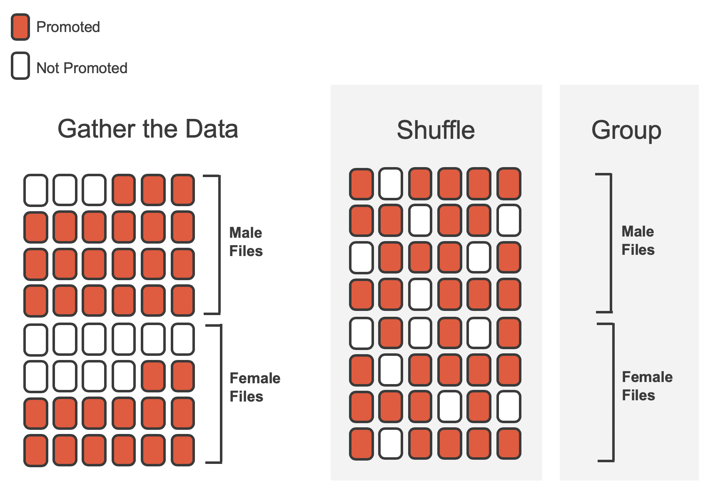
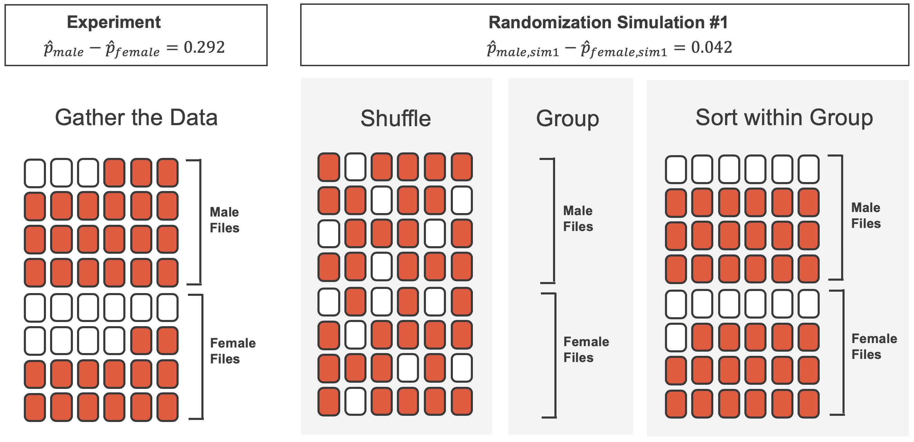
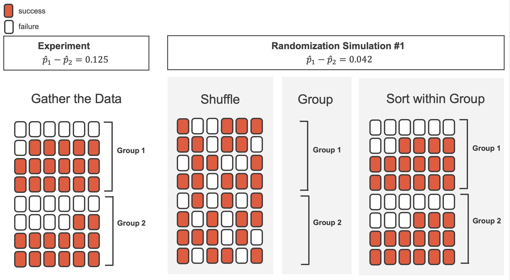
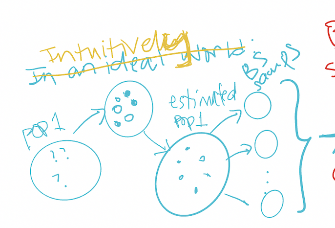
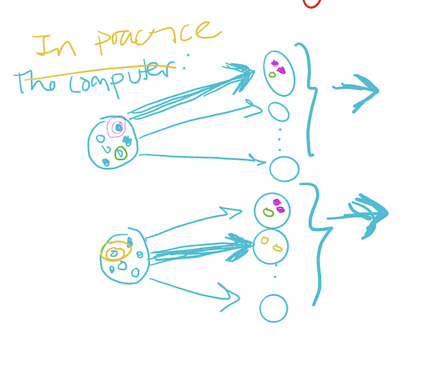
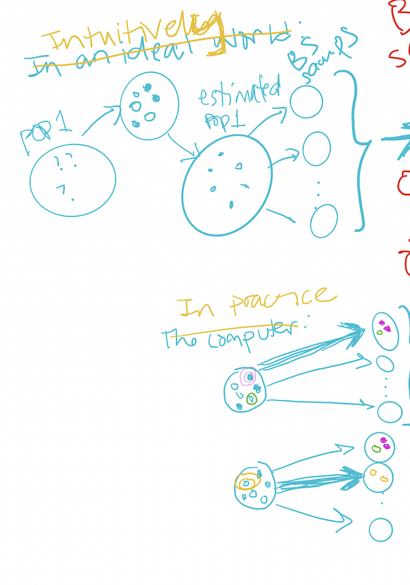
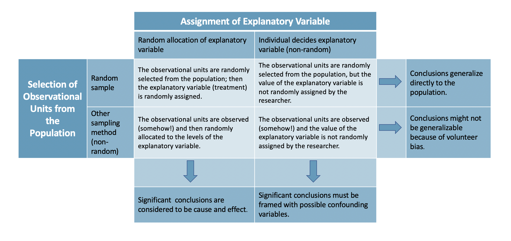

# Foundations of inference {#inference-foundations}

```{block2, type="uptohere", echo=TRUE}
The content in this chapter is currently just placeholder. We will remove this banner once the chapter content has been updated and ready for review.
```

```{block2, chp2-intro, type="chapterintro", echo=TRUE}
Statistical inference is primarily concerned with understanding and quantifying the uncertainty of parameter estimates. 
While the equations and details change depending on the setting, the foundations for inference are the same throughout all of statistics. 

We start with two case studies designed to motivate the process of making decisions about research claims. We formalize the process through the introducuction of the **hypothesis testing framework**\index{hypothesis test}, which allows us to formally evaluate claims about the population.

Finally we expand on the familiar idea of using a sample proportion to estimate a population proportion.
That is, we create what is called a **confidence interval**\index{confidence interval}, which is a range of plausible values where we may find the true population value.
```

```{r summary3methodsChp5}
method_summary_table <- tribble(
 ~variable,    ~col1, ~col2, ~col3,
"What does it do?",  "Shuffles the explanatory variable to mimic the natural variability  found in a randomized experiment.", "Resamples (with replacement) from the observed data to mimic the sampling variability found by collecting data.",  "Uses theory (primarily the Central Limit Theorem) to describe the hypothetical variability resulting from either repeated randomized experiments or random samples.",

"What is the random process described?", "randomized experiment", "random sampling",  "either / both",

"Is there flexibility?", "Yes, can be used to describe random sampling in an observational model", "Yes, can be used to describe random allocation in an experiment", "Yes",

"What is it best for?", "Hypothesis Testing (can be used for Confidence Intervals, but not covered in this text).", "Confidence Intervals (HT for one proportion covered in Chapter 6).", "Quick analyses through, for example, calculating a Z score.",

"What physical object represents the simulation process?", "shuffling cards", "pulling balls from a bag", "NA",

"What are the technical conditions?", "independence", "independence, big n", "independence, big n"
)
```

```{r include=FALSE}
terms_chp_5 <- c("hypothesis test", "confidence interval")
```

Throughout the book so far, you have worked with data in a variety of contexts.
You have learned how to summarize and visualize the data as well as how to model multiple variables at the same time.
Sometimes the dataset at hand represents the entire research question.
But more often than not, the data have been collected to answer a research question about a larger group of which the data are a (hopefully) representative subset.

You may agree that there is almost always variability in data (one dataset will not be identical to a second dataset even if they are both collected from the same population using the same methods).
However, quantifying the variability in the data is neither obvious nor easy to do (**how** different is one dataset from another?). 


```{block2, type="example", echo=TRUE}
Suppose your professor splits the students in class into two groups: students on the left and students on the right. If $\hat{p}_{_L}$ and $\hat{p}_{_R}$ represent the proportion of students who own an Apple product on the left and right, respectively, would you be surprised if $\hat{p}_{_L}$ did not *exactly* equal $\hat{p}_{_R}$?

---

While the proportions would probably be close to each other, it would be unusual for them to be exactly the same. We would probably observe a small difference due to *chance*.
```


```{block2, type="guidedpractice", echo=TRUE}
If we don't think the side of the room a person sits on in class is related to whether the person owns an Apple product, what assumption are we making about the relationship between these two variables?
(Reminder: for these Guided Practice questions, you can check your answer in the footnote.)^[We would be assuming that these two variables are **independent**\index{independent}.]
```

```{r include=FALSE}
terms_chp_5 <- c(terms_chp_5, "independent")
```

Studying randomness of this form is a key focus of statistics. 
Throughout this chapter, and those that follow, we provide three different approaches for quantifying the variability inherent in data: randomization, bootstrapping, and mathematical models.
Using the methods provided in this chapter, we will be able to draw conclusions beyond the dataset at hand to research questions about larger populations.

## Randomization test {#inf-rand}


The first type of variability we will explore comes from experiments where the explanatory variable (or treatment) is randomly assigned to the observational units.
As you learned in Chapter \@ref(intro-to-data), a **randomized experiment** is done to assess whether or not one variable (the **explanatory** variable) causes changes in a second variable (the **response** variable). 
Every dataset has some variability in it, so to decide whether the variability in the data is due to (1) the causal mechanism (the randomized explanatory variable in the experiment) or instead (2) natural variability inherent to the data, we set up a sham randomized experiment as a comparison. 
That is, we assume that each observational unit would have gotten the exact same response value regardless of the treatment level. 
By reassigning the treatments many many times, we can compare the actual experiment to the sham experiment. If the actual experiment has more extreme results than any of the sham experiments, we are led to believe that it is the explanatory variable which is causing the result and not inherent data variability. 
Using a few different case studies, let's look more carefully at this idea of a **randomization test**\index{randomization}.


```{r include=FALSE}
terms_chp_5 <- c(terms_chp_5, "randomization")
```


### Gender discrimination case study {#caseStudyGenderDiscrimination}


\index{data!discrimination|(}

We consider a study investigating gender discrimination in the 1970s, which is set in the context of personnel decisions within a bank.^[Rosen B and Jerdee T. 1974. "Influence of sex role stereotypes on personnel decisions." Journal of Applied Psychology 59(1):9-14.] The research question we hope to answer is, "Are females discriminated against in promotion decisions made by male managers?"

#### Observed data {-}

The participants in this study were 48 male bank supervisors attending a management institute at the University of North Carolina in 1972. 
They were asked to assume the role of the personnel director of a bank and were given a personnel file to judge whether the person should be promoted to a branch manager position. 
The files given to the participants were identical, except that half of them indicated the candidate was male and the other half indicated the candidate was female. 
These files were randomly assigned to the subjects.

```{block2, type="guidedpractice", echo=TRUE}
Is this an observational study or an experiment? How does the type of study impact what can be inferred from the results?^[The study is an experiment, as subjects were randomly assigned a "male" file or a "female" file (remember, all the files were actually identical in content). Since this is an experiment, the results can be used to evaluate a causal relationship between gender of a candidate and the promotion decision.]
```

For each supervisor we recorded the gender associated with the assigned file and the promotion decision. 
Using the results of the study summarized in Table \@ref(tab:discriminationResults), we would like to evaluate if females are unfairly discriminated against in promotion decisions. 
In this study, a smaller proportion of females are promoted than males (0.583 versus 0.875), but it is unclear whether the difference provides *convincing evidence* that females are unfairly discriminated against.


```{r discriminationResults}
temptbl <- tribble(
 ~variable,    ~col1, ~col2, ~col3, ~col4, 
 "", "male", "21", "3", "24",
 "`gender`", "female", "14", "10","24",
 "", "Total", "35", "13", "48"
)

temptbl %>%
 kable(caption = "Summary results for the gender discrimination study.",
    col.names = c("", "", "promoted", "not promoted", "Total")) %>%
 add_header_above(c(" ", " ", "`decision`" = 2, " ")) %>%
  kable_styling()  
```

The data are visualized in Figure \@ref(fig:genderrand1).  Note that the promoted decision is colored in red (promoted) and white(not promoted).  Additionally, the observations are broken up into the male and female groups.


```{r genderrand1, out.width="50%", fig.cap="The gender descriminiation study can be thought of as 48 red and black cards."}

```

```{block2, type="example", echo=TRUE}
Statisticians are sometimes called upon to evaluate the strength of evidence. 
When looking at the rates of promotion for males and females in this study, why might we be tempted to immediately conclude that females are being discriminated against?
 
---
 
The large difference in promotion rates (58.3% for females versus 87.5% for males) suggest there might be discrimination against women in promotion decisions. 
However, we cannot yet be sure if the observed difference represents discrimination or is just from random chance. 
Generally there is a little bit of fluctuation in sample data, and we wouldn't expect the sample proportions to be *exactly* equal, even if the truth was that the promotion decisions were independent of gender.
```

The previous example is a reminder that the observed outcomes in the sample may not perfectly reflect the true relationships between variables in the underlying population.
Table \@ref(tab:discriminationResults) shows there were 7 fewer promotions in the female group than in the male group, a difference in promotion rates of 29.2% $\left( \frac{21}{24} - \frac{14}{24} = 0.292 \right)$. 
This observed difference is what we call a **point estimate**\index{point estimate} of the true effect. 
The point estimate of the difference is large, but the sample size for the study is small, making it unclear if this observed difference represents discrimination or whether it is simply due to chance. 
We label these two competing claims, $H_0$ and $H_A$:

```{r include=FALSE}
terms_chp_5 <- c(terms_chp_5, "point estimate")
```

* $H_0$: **Null hypothesis**\index{null hypothesis}. The variables `gender` and `decision` are independent. They have no relationship, and the observed difference between the proportion of males and females who were promoted, 29.2%, was due to chance.

* $H_A$: **Alternative hypothesis**\index{alternative hypothesis}. The variables `gender` and `decision` are *not* independent. The difference in promotion rates of 29.2% was not due to chance, and equally qualified females are less likely to be promoted than males.

```{r include=FALSE}
terms_chp_5 <- c(terms_chp_5, "null hypothesis", "alternative hypothesis")
```

```{block2, type="onebox", echo=TRUE}
**Hypothesis testing**

These hypotheses are part of what is called a **hypothesis test**\index{hypothesis test}. 
A hypothesis test is a statistical technique used to evaluate competing claims using data. 
Often times, the null hypothesis takes a stance of *no difference* or *no effect*. 

If the null hypothesis and the data notably disagree, then we will reject the null hypothesis in favor of the alternative hypothesis. 

Don't worry if you aren't a master of hypothesis testing at the end of this section. 
We'll discuss these ideas and details many times in this chapter and those that follow.
```

```{r include=FALSE}
terms_chp_5 <- c(terms_chp_5, "hypothesis test")
```

What would it mean if the null hypothesis, which says the variables `gender` and `decision` are unrelated, is true? 
It would mean each banker would decide whether to promote the candidate without regard to the gender indicated on the file. 
That is, the difference in the promotion percentages would be due to the way the files were randomly divided to the bankers, and the randomization just happened to give rise to a relatively large difference of 29.2%.

Consider the alternative hypothesis: bankers were influenced by which gender was listed on the personnel file. 
If this was true, and especially if this influence was substantial, we would expect to see some difference in the promotion rates of male and female candidates. 
If this gender bias was against females, we would expect a smaller fraction of promotion recommendations for female personnel files relative to the male files.

We will choose between these two competing claims by assessing if the data conflict so much with $H_0$ that the null hypothesis cannot be deemed reasonable. 
If this is the case, and the data support $H_A$, then we will reject the notion of independence and conclude that these data provide strong evidence of discrimination.

#### Variability of the statistic {-}

Table \@ref(tab:discriminationResults) shows that 35 bank supervisors recommended promotion and 13 did not. 
Now, suppose the bankers' decisions were independent of gender. 
Then, if we conducted the experiment again with a different random assignment of gender to the files, differences in promotion rates would be based only on random fluctuation. 
We can actually perform this **randomization**, which simulates what would have happened if the bankers' decisions had been independent of gender but we had distributed the file genders differently.^[The test procedure we employ in this section is sometimes referred to as a **permutation test**\index{permutation test}.]

```{r include=FALSE}
terms_chp_5 <- c(terms_chp_5, "permutation test")
```

In this **simulation**\index{simulation}, we thoroughly shuffle 48 personnel files, 35 labeled `promoted` and 13 labeled `not promoted`, and we deal these files into two stacks. 
Note that by keeping 35 promoted and 13 not promoted, we are assuming that 35 of the bank managers would have promoted the individual whose content is contained in the file (**independent** of gender).
We will deal 24 files into the first stack, which will represent the 24 "female" files.
The second stack will also have 24 files, and it will represent the 24 "male" files.
Figure \@ref(fig:genderrand3) highlights both the shuffle and the reallocation to the sham gender groups.


```{r genderrand3, out.width="80%", fig.cap="The gender descriminiation data is shuffled and reallocated to the gender groups."}

```


Then, as we did with the original data, we tabulate the results and determine the fraction of `male` and `female` who were promoted.

```{r include=FALSE}
terms_chp_5 <- c(terms_chp_5, "simulation")
```

Since the randomization of files in this simulation is independent of the promotion decisions, any difference in the two promotion rates is entirely due to chance. 
Table \@ref(tab:discriminationRand1) show the results of one such simulation.


```{r discriminationRand1}
temptbl <- tribble(
 ~variable,    ~col1, ~col2, ~col3, ~col4, 
 "", "male", "18", "6", "24",
 "`gender`", "female", "17", "7","24",
 "", "Total", "35", "13", "48"
)

temptbl %>%
 kable(caption = "Simulation results, where the difference in promotion rates between `male` and `female` is purely due to chance.",
    col.names = c("", "", "promoted", "not promoted", "Total")) %>%
 kable_styling() %>%
 add_header_above(c(" ", " ", "`decision`" = 2, " "))
```


```{block2, type="guidedpractice", echo=TRUE}
What is the difference in promotion rates between the two simulated groups in Table \@ref(tab:discriminationRand1) ? 
How does this compare to the observed difference 29.2% from the actual study?^[$18/24 - 17/24=0.042$ or about 4.2% in favor of the men. 
This difference due to chance is much smaller than the difference observed in the actual groups.]
```


Figure \@ref(fig:genderrand4) shows that the difference in promotion rates is much larger in the original data than it is in the simulated groups (0.292 >>>  0.042).
The quantity of interest throughout this case study has been the difference in promotion rates.
We call the summary value the **statistic** of interest (or often the **test statistic**).
When we encounter different data structures, the statistic is likely to change (e.g., we might calculate an average instead of a proportion), but we will always want to understand how the statistic varies from sample to sample.

```{r include=FALSE}
terms_chp_5 <- c(terms_chp_5, "statistic")
```

```{r genderrand4, out.width="100%", fig.cap="We summarize the randomized data to produce one estiamte of the difference in proportions given no gender discrimination."}

```


#### Observed statistic vs. null statistics {-}

We computed one possible difference under the null hypothesis in Guided Practice, which represents one difference due to chance. 
While in this first simulation, we physically dealt out files, it is much more efficient to perform this simulation using a computer. 
Repeating the simulation on a computer, we get another difference due to chance: -0.042. 
And another: 0.208. 
And so on until we repeat the simulation enough times that we have a good idea of what represents the *distribution of differences from chance alone*. 
Figure \@ref(fig:discRandDotPlot) shows a plot of the differences found from 100 simulations, where each dot represents a simulated difference between the proportions of male and female files recommended for promotion.


```{r discRandDotPlot, fig.cap="A stacked dot plot of differences from 100 simulations produced under the null hypothesis, $H_0$, where `gender_simulated` and `decision` are independent. Two of the 100 simulations had a difference of at least 29.2%, the difference observed in the study, and are shown as solid red dots.", warning=FALSE, fig.width=10}

gender <- c(rep('male', 24), rep('female', 24))
outcome <- c(rep(c('promoted', 'not promoted'), c(21, 3)), rep(c('promoted', 'not promoted'), c(14, 10)))

set.seed(40)
nsim = 100
n   = length(gender)
group = gender
var1 = outcome
success = "promoted"
sim  = matrix(NA, nrow = n, ncol = nsim)
n1  = n2 = 24

statistic <- function(var1, group){	
	t1 <- var1 == success & group == levels(as.factor(group))[1]
	t2 <- var1 == success & group == levels(as.factor(group))[2]
	sum(t1)/n1 - sum(t2)/n2 
}

for(i in 1:nsim){
	sim[,i] = sample(group, n, replace = FALSE)
}

sim_dist = apply(sim, 2, statistic, var1 = outcome)
diffs  = sim_dist
pval   = sum(diffs >= 0.29) / nsim
values <- table(sim_dist)


X <- c()
Y <- c()
for(i in 1:length(diffs)){
	x  <- diffs[i]
	rec <- sum(sim_dist == x)
	X  <- append(X, rep(x, rec))
	Y  <- append(Y, 1:rec)
}


plot(X, Y, xlim=range(diffs)+c(-1,1)*sd(diffs)/4, xlab = "Difference in promotion rates", axes = FALSE, ylim=c(0,max(Y)), col=COL[1], cex=0.8, pch=1, lwd=1.5)
axis(1, at = seq(-0.4,0.4,0.1), labels = c(-0.4,"",-0.2,"",0,"",0.2,"",0.4))
abline(h=0)
theta <- seq(0, 2*pi, length.out = 500)
x   <- 0.335 + 0.08 * cos(theta)
y   <- 1 + 1 * sin(theta)
points(X[X > 0.25], Y[X > 0.25], lwd=3, col = COL[4], cex=0.4)
```

Note that the distribution of these simulated differences in proportions is centered around 0. 
Because we simulated differences in a way that made no distinction between men and women, this makes sense: we should expect differences from chance alone to fall around zero with some random fluctuation for each simulation.

```{block2, type="example", echo=TRUE}
How often would you observe a difference of at least 29.2% (0.292) according to Figure \@ref(fig:discRandDotPlot)? 
Often, sometimes, rarely, or never?
 
---
 
It appears that a difference of at least 29.2% due to chance alone would only happen about 2% of the time according to Figure \@ref(fig:discRandDotPlot). 
Such a low probability indicates that observing such a large difference from chance is rare.
```

The difference of 29.2% is a rare event if there really is no impact from listing gender in the candidates' files, which provides us with two possible interpretations of the study results:


* $H_0$: **Null hypothesis**. Gender has no effect on promotion decision, and we observed a difference that is so large that it would only happen rarely.

* $H_A$: **Alternative hypothesis**. Gender has an effect on promotion decision, and what we observed was actually due to equally qualified women being discriminated against in promotion decisions, which explains the large difference of 29.2%.

When we conduct formal studies, we reject a null position (the idea that the data are a result of chance only) if the data strongly conflict with that null position.^[This reasoning does not generally extend to anecdotal observations. 
Each of us observes incredibly rare events every day, events we could not possibly hope to predict. 
However, in the non-rigorous setting of anecdotal evidence, almost anything may appear to be a rare event, so the idea of looking for rare events in day-to-day activities is treacherous. 
For example, we might look at the lottery: there was only a 1 in 176 million chance that the Mega Millions numbers for the largest jackpot in history (March 30, 2012) would be (2, 4, 23, 38, 46) with a Mega ball of (23), but nonetheless those numbers came up! 
However, no matter what numbers had turned up, they would have had the same incredibly rare odds. 
That is, *any set of numbers we could have observed would ultimately be incredibly rare*. 
This type of situation is typical of our daily lives: each possible event in itself seems incredibly rare, but if we consider every alternative, those outcomes are also incredibly rare. 
We should be cautious not to misinterpret such anecdotal evidence.]
In our analysis, we determined that there was only a $\approx$ 2% probability of obtaining a sample where $\geq$ 29.2% more males than females get promoted by chance alone, so we conclude that the data provide strong evidence of gender discrimination against women by the supervisors. 
In this case, we reject the null hypothesis in favor of the alternative.

\index{data!discrimination|)}

Statistical inference is the practice of making decisions and conclusions from data in the context of uncertainty. 
Errors do occur, just like rare events, and the data set at hand might lead us to the wrong conclusion. 
While a given data set may not always lead us to a correct conclusion, statistical inference gives us tools to control and evaluate how often these errors occur. 
Before getting into the nuances of hypothesis testing, let's work through another case study.


### Opportunity cost case study {#caseStudyOpportunityCost}

How rational and consistent is the behavior of the typical American college student? 
In this section, we'll explore whether college student consumers always consider the following: money not spent now can be spent later.

In particular, we are interested in whether reminding students about this well-known fact about money causes them to be a little thriftier. 
A skeptic might think that such a reminder would have no impact. 
We can summarize the two different perspectives using the null and alternative hypothesis framework.

* $H_0$: **Null hypothesis**. Reminding students that they can save money for later purchases will not have any impact on students' spending decisions.

* $H_A$: **Alternative hypothesis**. Reminding students that they can save money for later purchases will reduce the chance they will continue with a purchase.

In this section, we'll explore an experiment conducted by researchers that investigates this very question for students at a university in the southwestern United States.^[Frederick S, Novemsky N, Wang J, Dhar R, Nowlis S. 2009. Opportunity Cost Neglect. Journal of Consumer Research 36: 553-561.]

#### Observed data {-}

<!--Shane Frederick of Yale School of Management and his collaborators conducted an experiment exploring the rational behavior of consumers. 

% Suppose when a person is about to spend money, we simply reminded them that they could spend the money on something else. Would it have any impact on the likelihood that they would continue with the purchase?
%What would you do in this situation? Please circle one of the options below.

-->

One-hundred and fifty students were recruited for the study, and each was given the following statement:

> Imagine that you have been saving some extra money on the side to make some purchases, and on your most recent visit to the video store you come across a special sale on a new video. This video is one with your favorite actor or actress, and your favorite type of movie (such as a comedy, drama, thriller, etc.). This particular video that you are considering is one you have been thinking about buying for a long time. It is available for a special sale price of $14.99.

> What would you do in this situation? Please circle one of the options below.

Half of the 150 students were randomized into a control group and were given the following two options:

> (A) Buy this entertaining video.

> (B) Not buy this entertaining video.


The remaining 75 students were placed in the treatment group, and they saw a slightly modified option (B):

> (A) Buy this entertaining video.

> (B) Not buy this entertaining video. Keep the $14.99 for other purchases.

Would the extra statement reminding students of an obvious fact impact the purchasing decision? 
Table \@ref(tab:OpportunityCostTable) summarizes the study results.


```{r OpportunityCostTable}
temptbl <- tribble(
 ~variable,    ~col1, ~col2, ~col3, 
 "control group", "56", "19", "75",
 "treatment group", "41", "34","75",
 "Total", "97", "53", "150"
)

temptbl %>%
 kable(caption = "Summary of student choices in the opportunity cost study.",
    col.names = c("", "buy DVD", "not buy DVD", "Total")) %>%
 kable_styling() %>%
 add_header_above(c(" ", "`decision`" = 2, " "))
```

<!--
%150 participants were asked whether they would buy a DVD under a particular circumstance. Participants in the control group were given two options, and participants in the treatment group were given the same options, except in the *not buy* option they were reminded that not spending the money meant the money could be used for a later purchase. This table summarizes the results from the study.}
-->

It might be a little easier to review the results using row proportions, specifically considering the proportion of participants in each group who said they would buy or not buy the DVD. 
These summaries are given in Table \@ref(tab:OpportunityCostTableRowProp).


```{r OpportunityCostTableRowProp}
temptbl <- tribble(
 ~variable,    ~col1, ~col2, ~col3, 
 "control group", "0.747", "0.253", "1.00",
 "treatment group", "0.547", "0.453","1.00",
 "Total", "0.647", "0.353", "1.00"
)

temptbl %>%
 kable(caption = "The data above are now summarized using row proportions. Row proportions are particularly useful here since we can view the proportion of *buy* and *not buy* decisions in each group.",
    col.names = c("", "buy DVD", "not buy DVD", "Total")) %>%
 kable_styling() %>%
 add_header_above(c( " ", "`decision`" = 2, " "))
```

<!--
"The data from Table \@ref(tab:OpportunityCostTable) summarized using row proportions. Row proportions are particularly useful here since we can view the proportion of *buy* and *not buy* decisions in each group."
-->


We will define a **success**\index{success} in this study as a student who chooses not to buy the DVD.^[Success is often defined in a study as the outcome of interest, and a "success" may or may not actually be a positive outcome. For example, researchers working on a study on HIV prevalence might define a "success" in the statistical sense as a patient who is HIV+. A more complete discussion of the term **success** will be given in Chapter \@ref(inference-cat).] 
Then, the value of interest is the change in DVD purchase rates that results by reminding students that not spending money now means they can spend the money later.


```{r include=FALSE}
terms_chp_5 <- c(terms_chp_5, "success")
```

<!--
%A first look at the data suggests that reminding students that not spending money means they can spend the money later has an impact. 
-->

We can construct a point estimate for this difference as
\begin{align*}
\hat{p}_{trmt} - \hat{p}_{ctrl}
 = \frac{34}{75} - \frac{19}{75}
 = 0.453 - 0.253
 = 0.200
\end{align*}
The proportion of students who chose not to buy the DVD was 20% higher in the treatment group than the control group.
However, is this result **statistically significant**\index{statistically significant}? In other words, is a 20% difference between the two groups so prominent that it is unlikely to have occurred from chance alone?

```{r include=FALSE}
terms_chp_5 <- c(terms_chp_5, "statistically significant")
```

#### Variability of the statistic {-}

The primary goal in this data analysis is to understand what sort of differences we might see if the null hypothesis were true, i.e., the treatment had no effect on students. 
For this, we'll use the same procedure we applied in Section \@ref(caseStudyGenderDiscrimination): randomization.

Let's think about the data in the context of the hypotheses. 
If the null hypothesis ($H_0$) was true and the treatment had no impact on student decisions, then the observed difference between the two groups of 20% could be attributed entirely to chance. 
If, on the other hand, the alternative hypothesis ($H_A$) is true, then the difference indicates that reminding students about saving for later purchases actually impacts their buying decisions.

#### Observed statistic vs. null statistics {-}

Just like with the gender discrimination study, we can perform a statistical analysis. 
Using the same randomization technique from the last section, let's see what happens when we simulate the experiment under the scenario where there is no effect from the treatment.

While we would in reality do this simulation on a computer, it might be useful to think about how we would go about carrying out the simulation without a computer. 
We start with 150 index cards and label each card to indicate the distribution of our response variable: `decision`. 
That is, 53 cards will be labeled "not buy DVD" to represent the 53 students who opted not to buy, and 97 will be labeled "buy DVD" for the other 97 students. 
Then we shuffle these cards thoroughly and divide them into two stacks of size 75, representing the simulated treatment and control groups. 
Any observed difference between the proportions of "not buy DVD" cards (what we earlier defined as *success*) can be attributed entirely to chance.

```{block2, type="example", echo=TRUE}
If we are randomly assigning the cards into the simulated treatment and control groups, how many "not buy DVD" cards would we expect to end up with in each simulated group? 
What would be the expected difference between the proportions of "not buy DVD" cards in each group?

---

Since the simulated groups are of equal size, we would expect $53 / 2 = 26.5$, i.e., 26 or 27, "not buy DVD" cards in each simulated group, yielding a simulated point estimate of 0% . However, due to random fluctuations, we might actually observe a number a little above or below 26 and 27.
```

<!--
%We'll take the students and randomize them into two new groups, simulated-control and simulated-treatment groups, and then we'll look at the difference in the two groups. 
-->

The results of a single randomization from chance alone is shown in Table \@ref(tab:OpportunityCostTableSimulated). 
From this table, we can compute a difference that occurred from chance alone:
\begin{align*}
\hat{p}_{trmt, simulated} - \hat{p}_{ctrl, simulated}
 = \frac{24}{75} - \frac{29}{75}
 = 0.32 - 0.387
 = - 0.067
\end{align*}
<!--
%This difference of -6.7% is entirely due to chance.
-->


```{r OpportunityCostTableSimulated}
temptbl <- tribble(
 ~variable,    ~col1, ~col2, ~col3, 
 "control group", "46", "29", "75",
 "treatment group", "51", "24","75",
 "Total", "97", "53", "150"
)

temptbl %>%
 kable(caption = "Summary of student choices against their simulated groups. The group assignment had no connection to the student decisions, so any difference between the two groups is due to chance.",
    col.names = c( "", "buy DVD", "not buy DVD", "Total")) %>%
 kable_styling() %>%
 add_header_above(c( " ", "`decision`" = 2, " "))
```


Just one simulation will not be enough to get a sense of what sorts of differences would happen from chance alone. 
We'll simulate another set of simulated groups and compute the new difference: 0.013. 
And again: 0.067. 
And again: -0.173. 
We'll do this 1,000 times. The results are summarized in a dot plot in Figure \@ref(fig:OpportunityCostDiffsDotPlot), where each point represents a simulation. 
Since there are so many points, it is more convenient to summarize the results in a histogram such as the one in Figure \@ref(fig:OpportunityCostDiffs), where the height of each histogram bar represents the fraction of observations in that group.


```{r OpportunityCostDiffsDotPlot, fig.cap="A stacked dot plot of 1,000 chance differences produced under the null hypothesis, $H_0$. Six of the 1,000 simulations had a difference of at least 20% , which was the difference observed in the study.", warning=FALSE, fig.width=10}

set.seed(41)
DotPlotRegularized <- function(x,
                         width = 5,
                               col = "#569BBD",
                               cex = 1, ...) {
  x    <- sort(x)
  xu   <- unique(x)
  xlim <- range(x)
  X    <- table(x)
  height <- max(X) / width
  plot(0, 0, xlim = xlim, ylim = c(0, height),
       type = "n", axes = FALSE, ...)
  axis(1)
  
  spread <- min(diff(xu)) / width / 2
  for (i in seq_along(X)) {
    val     <- xu[i]
    num     <- X[i]
    num.rep <- round(num / width) + 1
    pos     <- rep(1:width, num.rep)
    rel.pos <- (pos[1:num] - width / 2) * spread
    ver.pos <- rep(1:num.rep, rep(width, num.rep))
    ver.pos <- ver.pos[1:num]
    points(val + rel.pos, ver.pos, pch = ".",
           col = col, cex = cex)
  }
  abline(h = 0)
}

group   <- c(rep('control', 75), rep('treatment', 75))
outcome <- c(rep(c('buy DVD', 'do not buy DVD'), c(56, 19)),
             rep(c('buy DVD', 'do not buy DVD'), c(41, 34)))

nsim  = 1000
n     = length(group)
group = group
var1  = outcome
success = "do not buy DVD"
sim   = matrix(NA, nrow = n, ncol = nsim)
n1    = n2 = 75

Statistic <- function(var1, group){	
  t1 <- var1 == success & group == levels(as.factor(group))[1]
  t2 <- var1 == success & group == levels(as.factor(group))[2]
  sum(t1)/n1 - sum(t2)/n2 
}

for(i in 1:nsim){
  sim[,i] = sample(group, n, replace = FALSE)
}

sim_dist = apply(sim, 2, Statistic, var1 = outcome)
diffs    = sim_dist
pval     = sum(diffs >= 0.2) / nsim
values  <- table(sim_dist)

xlab <- paste0("Simulated difference in proportions ",
               "of students who do not buy the DVD")

DotPlotRegularized(diffs, xlab = xlab, ylab = "", cex = 2)
text(0.2, 5, "observed\ndifference", pos = 3)
lines(rep(0.2, 2), c(0, 5), lty = 2, col = COL[6])
```


```{r OpportunityCostDiffs, fig.cap="A histogram of 1,000 chance differences produced under the null hypothesis, $H_0$. Histograms like this one are a more convenient representation of data or results when there are a large number of observations.", warning=FALSE, fig.width=10}

X <- c()
Y <- c()
udiffs <- sort(unique(diffs))
for(i in 1:length(udiffs)){
 x  <- udiffs[i]
 rec <- sum(sim_dist == x)
 X  <- append(X, rep(x, rec))
 Y  <- append(Y, 1:rec)
}

bin.width <- diff(udiffs)[1]
breaks <- c(udiffs - bin.width / 4, udiffs + bin.width / 4)

histPlot(diffs, breaks = breaks, axes = FALSE, col = rgb(1,1,1),
     xlab = "", ylab = "Proportion of simulated scenarios        ")
diffs.tmp <- diffs[diffs > 0.19]
histPlot(diffs.tmp, breaks = breaks, col = COL[1], add = TRUE)
axis(1)
axis(2, at = seq(0, 100, 50), labels = format(seq(0, 50, 25) / nsim))
lines(c(0.2, 0.2), c(0, 30), lty = 3, lwd = 3)
text(0.2, 30, "observed\ndifference", pos = 3)
par(las = 0)
mtext(xlab, 1, 2.5)

```


If there was no treatment effect, then we'd only observe a difference of at least +20% about 0.6% of the time, or about 1-in-150 times. 
That is really rare! 
Instead, we will conclude the data provide strong evidence there is a treatment effect: reminding students before a purchase that they could instead spend the money later on something else lowers the chance that they will continue with the purchase. 
Notice that we are able to make a causal statement for this study since the study is an experiment.


### Hypothesis testing {#HypothesisTesting}


In the last two sections, we utilized a **hypothesis test**\index{hypothesis test}, which is a formal technique for evaluating two competing possibilities. 
In each scenario, we described a **null hypothesis**\index{null hypothesis}, which represented either a skeptical perspective or a perspective of no difference. 
We also laid out an **alternative hypothesis**\index{alternative hypothesis}, which represented a new perspective such as the possibility that there has been a change or that there is a treatment effect in an experiment.  The alternative hypothesis is usually the reason the scientists set out to do the research in the first place.


```{r include=FALSE}
terms_chp_5 <- c(terms_chp_5, "hypothesis test", "null hypothesis", "alternative hypothesis")
```


```{block2, type="onebox", echo=TRUE}
**Null and alternative hypotheses.**

The **null hypothesis ($H_0$)** often represents either a skeptical perspective or a claim to be tested. The **alternative hypothesis ($H_A$)** represents an alternative claim under consideration and is often represented by a range of possible values for the value of interest. 
```

The hypothesis testing framework is a very general tool, and we often use it without a second thought. 
If a person makes a somewhat unbelievable claim, we are initially skeptical. 
However, if there is sufficient evidence that supports the claim, we set aside our skepticism. 
The hallmarks of hypothesis testing are also found in the US court system. 

#### The US court system {-}


```{block2, type="example", echo=TRUE}
A US court considers two possible claims about a defendant: they are either innocent or guilty. If we set these claims up in a hypothesis framework, which would be the null hypothesis and which the alternative?

---
 
The jury considers whether the evidence is so convincing (strong) that there is no reasonable doubt regarding the person's guilt. 
That is, the skeptical perspective (null hypothesis) is that the person is innocent until evidence is presented that convinces the jury that the person is guilty (alternative hypothesis).
```


Jurors examine the evidence to see whether it convincingly shows a defendant is guilty. 
Notice that if a jury finds a defendant *not guilty*, this does not necessarily mean the jury is confident in the person's innocence. 
They are simply not convinced of the alternative that the person is guilty.

This is also the case with hypothesis testing: *even if we fail to reject the null hypothesis, we typically do not accept the null hypothesis as truth*. 
Failing to find strong evidence for the alternative hypothesis is not equivalent to providing evidence that the null hypothesis is true.


#### p-value and statistical significance {-}

In Section \@ref(caseStudyGenderDiscrimination) we encountered a study from the 1970's that explored whether there was strong evidence that women were less likely to be promoted than men. 
The research question -- are females discriminated against in promotion decisions? -- was framed in the context of hypotheses:


* $H_0$: Gender has no effect on promotion decisions.

* $H_A$: Women are discriminated against in promotion decisions.


The null hypothesis ($H_0$) was a perspective of no difference. 
The data on gender discrimination provided a point estimate of a 29.2% difference in recommended promotion rates between men and women. 
We determined that such a difference from chance alone would be rare: it would only happen about 2 in 100 times. 
When results like these are inconsistent with $H_0$, we reject $H_0$ in favor of $H_A$. 
Here, we concluded there was discrimination against women.

The 2-in-100 chance is what we call a **p-value**, which is a probability quantifying the strength of the evidence against the null hypothesis and in favor of the alternative. 

<!--%Formally the p-value is a conditional probability, which is basically\footnote{Want to learn more probability? Check out Appendix \ref{probability}.}
-->

```{block2, type="onebox", echo=TRUE}
**p-value.**

The **p-value**\index{hypothesis testing!p-value|textbf} is the probability of observing data at least as favorable to the alternative hypothesis as our current dataset, if the null hypothesis were true. 
We typically use a summary statistic of the data, such as a difference in proportions, to help compute the p-value and evaluate the hypotheses. 
This summary value that is used to compute the p-value is often called the **test statistic**\index{test statistic}.
```

```{r include=FALSE}
terms_chp_5 <- c(terms_chp_5, "p-value", "test statistic")
```


```{block2, type="example", echo=TRUE}
In the gender discrimination study, the difference in discrimination rates was our test statistic. What was the test statistic in the opportunity cost study covered in Section \@ref(caseStudyOpportunityCost)?
 
---
 
The test statistic in the opportunity cost study was the difference in the proportion of students who decided against the DVD purchase in the treatment and control groups. 
In each of these examples, the **point estimate** of the difference in proportions was used as the test statistic.
```

When the p-value is small, i.e., less than a previously set threshold, we say the results are **statistically significant**. 
This means the data provide such strong evidence against $H_0$ that we reject the null hypothesis in favor of the alternative hypothesis. 
The threshold, called the **significance level**\index{hypothesis testing!significance level}\index{significance level} and often represented by $\alpha$ (the Greek letter *alpha*), is typically set to $\alpha = 0.05$, but can vary depending on the field or the application. 
Using a significance level of $\alpha = 0.05$ in the discrimination study, we can say that the data provided statistically significant evidence against the null hypothesis.

```{block2, type="onebox", echo=TRUE}
**Statistical significance.**

We say that the data provide **statistically significant**\index{hypothesis testing!statistically significant|textbf} evidence against the null hypothesis if the p-value is less than some reference value, often $\alpha=0.05$.
```

<!--
%\begin{termBox}{\tBoxTitle{Significance Level}
%If the null hypothesis is true, the significance level $\alpha$ defines the probability that we will make a Type 1 Error.}
%\end{termBox}
-->


```{block2, type="example", echo=TRUE}
In the opportunity cost study in Section \@ref(caseStudyOpportunityCost), we analyzed an experiment where study participants had a 20% drop in likelihood of continuing with a DVD purchase if they were reminded that the money, if not spent on the DVD, could be used for other purchases in the future. 
We determined that such a large difference would only occur about 1-in-150 times if the reminder actually had no influence on student decision-making. 
What is the p-value in this study? Was the result statistically significant?
 
---
 
The p-value was 0.006 (about 1/150). Since the p-value is less than 0.05, the data provide statistically significant evidence that US college students were actually influenced by the reminder.
```


```{block2, type="onebox", echo=TRUE}
**What's so special about 0.05?**

We often use a threshold of 0.05 to determine whether a result is statistically significant. 
But why 0.05? 
Maybe we should use a bigger number, or maybe a smaller number. 
If you're a little puzzled, that probably means you're reading with a critical eye -- good job! 
We've made a video to help clarify *why 0.05*:
<center>
[https://www.openintro.org/book/stat/why05/](https://www.openintro.org/book/stat/why05/)
</center>
<br>
Sometimes it's also a good idea to deviate from the standard. 
We'll discuss when to choose a threshold different than 0.05 in Section \@ref(two-prop-errors).
```


### Randomization test summary

```{r fullrand, out.width="100%", fig.cap="An example of one simulation of the full randomization procedure.  We repeat the steps hundreds or thousands of times."}

```

\index{randomization test}

```{r include=FALSE}
terms_chp_5 <- c(terms_chp_5, "randomization test")
```


> **Frame the research question in terms of hypotheses.** Hypothesis tests are appropriate for research questions that can be summarized in two competing hypotheses. The null hypothesis ($H_0$) usually represents a skeptical perspective or a perspective of no difference. The alternative hypothesis ($H_A$) usually represents a new view or a difference. 

> **Collect data with an observational study or experiment.** If a research question can be formed into two hypotheses, we can collect data to run a hypothesis test. If the research question focuses on associations between variables but does not concern causation, we would run an observational study. If the research question seeks a causal connection between two or more variables, then an experiment should be used. 

> **Model the randomness as if the null hypothesis was true.** In the examples above, the variability has been modeled as if the treatment (e.g., gender, opportunity, blood thinner) allocation was independent of the outcome of the study. The computer generated the null distribution from many different randomizations in order to quantify the null variability.

> **Analyze the data.** Choose an analysis technique appropriate for the data and identify the p-value. So far, we've only seen one analysis technique: randomization. Throughout the rest of this textbook, we'll encounter several new methods suitable for many other contexts. 

> **Form a conclusion.** Using the p-value from the analysis, determine whether the data provide statistically significant evidence against the null hypothesis. Also, be sure to write the conclusion in plain language so casual readers can understand the results.


```{r chp5-1-summary}
method_summary_table %>%
  filter(variable != "What are the technical conditions?") %>%
  select(variable, col1) %>%
 kable(caption = "Summary of Randomization Tests as an inferential statistical method.", col.names = c("", "Randomization Test")) %>%
 kable_styling()
```

## Bootstrap confidence interval {#boot-ci}


Randomization is a statistical technique suitable for evaluating whether a difference in sample proportions is due to chance. 
Randomization tests are best suited for modeling experiments where the treatment (explanatory variable) has been randomly assigned to the observational units. 
In this section, we explore the situation where we focus on a single proportion, and we introduce a new simulation method, bootstrapping. 
Bootstrapping is best suited for modeling studies where the data have been generated through random sampling from a population.

Sometime the mathematical theory for how an estimate varies is well-known; this is the case for the sample proportion as seen in Section \@ref(inf-math). 
However, some statistics don't have simple theory for how they vary, and bootstrapping provides a computational approach for providing interval estimates for almost any population parameter (we will revisit bootstrapping in Chapters \@ref(inference-cat), \@ref(inference-num), and \@ref(inference-reg) so you'll get plenty of practice as well as exposure to bootstrapping in many different data settings). 

If the goal is to produce a range of possible values for a population value, then in an ideal world, we would sample data from the population again and recompute the sample proportion. 
Then we could do it again. 
And again. 
And so on until we have a good sense of the variability of our original estimate. 
The ideal world where sampling data is free or extremely cheap is almost never the case, and taking repeated samples from a population is usually impossible. 
So, instead of using a "resample from the population" approach, bootstrapping uses a "resample from the sample" approach.


### Medical consultant case study {#sec-med-consult}

\index{data!medical consultant|(}

People providing an organ for donation sometimes seek the help of a special medical consultant. 
These consultants assist the patient in all aspects of the surgery, with the goal of reducing the possibility of complications during the medical procedure and recovery. 
Patients might choose a consultant based in part on the historical complication rate of the consultant's clients.


#### Observed data {-}

One consultant tried to attract patients by noting the average complication rate for liver donor surgeries in the US is about 10%, but her clients have had only 3 complications in the 62 liver donor surgeries she has facilitated. 
She claims this is strong evidence that her work meaningfully contributes to reducing complications (and therefore she should be hired!).

```{block2, type="example", echo=TRUE}
We will let $p$ represent the true complication rate for liver donors working with this consultant. 
(The "true" complication rate will be referred to as the **parameter**.)  
Estimate $p$ using the data, and label this value $\hat{p}$.

---
 
The sample proportion for the complication rate is 3 complications divided by the 62 surgeries the consultant has worked on: $\hat{p} = 3/62 = 0.048$.
```

```{block2, type="example", echo=TRUE}
Is it possible to assess the consultant's claim using the data?

---

No. The claim is that there is a causal connection, but the data are observational, so we must be on the lookout for confounding variables. 
For example, maybe patients who can afford a medical consultant can afford better medical care, which can also lead to a lower complication rate.

While it is not possible to assess the causal claim, it is still possible to understand the consultant's true rate of complications.
```


```{block2, type="onebox", echo=TRUE}
**Parameter.**\index{parameter}

A **parameter** is the "true" value of interest. 
We typically estimate the parameter using a point estimate\index{point estimate} from a sample of data. 

For example, we estimate the probability $p$ of a complication for a client of the medical consultant by examining the past complications rates of her clients:

 
$$\hat{p} = 3 / 62 = 0.048\qquad\text{is used to estimate}\qquad p$$
```


<!--
%\begin{termBox}{\tBoxTitle{Point estimates vs parameter}\index{point estimate}\index{parameter}
%Point estimates are calculated based on a sample. For example, the *observed* complication rate for the medical consultant's patients is $\hat{p} = 0.048$. This point estimate is our best guess at the probability $p$ a randomly selected client of hers has a complication. This probability is the parameter and its precise value is never known. However, we can estimate it using the point estimate $\hat{p}$.}
%\end{termBox}


```{block2, type="onebox", echo=TRUE}
**Null value of a hypothesis test.**

The **null value** is the reference value for the parameter in $H_0$, and it is sometimes represented with the parameter's label with a subscript 0, e.g., $p_0$ (just like $H_0$).
```

-->

```{r include=FALSE}
terms_chp_5 <- c(terms_chp_5, "parameter")
```

#### Variability of the statistic {-}

In the medical consultant case study, the parameter is $p$, the true probability of a complication for a client of the medical consultant.
There is no reason to believe that $p$ is exactly $\hat{p} = 3/62$, but there is also no reason to believe that $p$ is particularly far from $\hat{p} = 3/62$.
By sampling with replacement from the dataset (a process called **bootstrapping**\index{bootstrapping}), the variability of the possible $\hat{p}$ values can be approximated. 

```{r include=FALSE}
terms_chp_5 <- c(terms_chp_5, "bootstrapping")
```

```{block2, type = "todo", echo= TRUE}
need a new physical object!
```

Most of the inferential procedures covered in this text are grounded in quantifying how one data set would differ from another when they are both taken from the same population.
It doesn't make sense to take repeated samples from the same population because if you have the means to take more samples, a larger sample size will benefit you more than the exact same sample twice.
Instead, we measure how the samples behave under an estimate of the population.  Figure \@ref(fig:boot1) shows how the unknown original population can be estimated by using the sample to approximate the proportion of successes and failures (in our case, the proportion of complications and no complications for the medical consultant).

```{r boot1, fig.cap = "first figure with the ? pop, then sample, then estimate of the pop.  below i said 3 white (success) and 4 red (failure).  easy to change the text below.", warning = FALSE,  out.width="75%"}
include_graphics("05/figures/boot1.png")
```

By taking repeated samples from the estimated population, the variability from sample to sample can be observed.  In Figure \@ref(fig:boot2) the repeated bootstrap samples are obviously different both from each other and from the original population.
Recall that the bootstrap samples were taken from the same (estimated) population, and so the differences are due entirely to natural variability in the sampling procedure.

```{r boot2, fig.cap = "next fig, has the bootstrap samples", warning = FALSE,  out.width="75%"}
include_graphics("05/figures/boot2.png")
```

By summarizing each of the bootstrap samples (here, using the sample proportion), we see, directly, the variability of the sample proportion, $\hat{p}$, from sample to sample.
The distribution of $\hat{p}_{bs}$ for the example scenario is shown in Figure \@ref(fig:boot3), and the bootstrap distribution for the medical consultant data is shown in Figure \@ref(fig:MedConsBSSim).

```{r boot3, fig.cap = "WITH ADDED HISTOGRAM... boot samples, arrow, histogram of all of them", warning = FALSE,  out.width="75%"}

```


It turns out that in practice, it is very difficult for computers to work with an infinite population (with the same proportional breakdown as in the sample).
However, there is a physical and computational model which produces an equivalent bootstrap distribution of the sample proportion in a computationally efficient manner.
Consider the observed data to be a bag of marbles 3 of which are success (white) and 4 of which are failures (red).  By drawing the marbles out of the bag with replacement, we depict the same sampling **process** as was done with the infinitely large estimated population.
Note in Figure \@ref(fig:boot4) that when sampling the original observations, a particular data point may end up in the new sample one time (evidenced by a circle around the observation), two times (evidenced by two circles around the observation), or not at all (no circles around the observation).  

If we apply the bootstrap sampling process to the medical consultant example, we consider each client to be one of the marbles in the bag.
There will be 59 white marbles (no complication) and 3 red marbles (complication).
If we 62 choose marbles out of the bag (one at a time) and compute the proportion of simulated patients with complications, $\hat{p}_{bs}$, then this "bootstrap" proportion represents a single simulated proportion from the "resample from the sample" approach.

```{r boot4, fig.cap = "sampling with replacement figure", warning = FALSE,  out.width="75%"}

```

```{block2, type="guidedpractice", echo=TRUE}
In a simulation of 62 patients, about how many would we expect to have had a complication?^[About 5% of the patients (6.2 on average) in the simulation will have a complication, though we will see a little variation from one simulation to the next.]
```

Figure \@ref(fig:boot5) visualizes one simulation for the medical consultant.
Out of the simulated cases, there were 5 with a complication and 57 without a complication: $\hat{p}_{bs} = 5/62 = 0.081$.

```{r boot5, fig.cap = "how impossible would it be to create one simulation with 62 marbles? 3 red, 59 white?", warning = FALSE, out.width="75%"}
hist(rnorm(10))
```

One simulation isn't enough to get a sense of the variability from one bootstrap proportion to another bootstrap proportion, so we repeated the simulation 10,000 times using a computer. 
Figure \@ref(fig:MedConsBSSim) shows the distribution from the 10,000 bootstrap simulations. 
The bootstrapped proportions vary from about zero to 11.3%. 
The variability in the bootstrapped proportions leads us to believe that the true probability of complication (the parameter, $p$) is somewhere between 0 and 11.3%.
<!--The simulated proportions that are less than or equal to $\hat{p}=0.048$ are shaded.
There were 1222 simulated sample proportions with $\hat{p}_{bs} \leq 0.048$, which represents a fraction 0.1222 of our simulations:
-->

```{r MedConsBSSim, fig.cap="The original medical consultant data is bootstrapped 10,000 times. Each simulation creates a sample from the original data where the probability of a complication is $\\hat{p} = 3/62$. The bootstrap 2.5 percentile proportion is 0 and the 97.5 percentile is 0.113. The result is: we are confident that, in the population, the true probability of a complication is between 0% and 11.3%.", warning=FALSE, fig.width=10}
bsprops <- rbinom(10000, size=62, prob=(3/62))/62
bsq <- quantile(bsprops, probs = c(0.01, 0.025, 0.05, 0.1, 0.9, 0.95, 0.975, 0.99))

bsprops_up <- bsprops[bsprops >= bsq[7]]
bsprops_low <- bsprops[bsprops <= bsq[2]]

uprops <- sort(unique(bsprops))
bin.width <- diff(uprops)[1]
breaks <- c(uprops - bin.width / 4, uprops + bin.width / 4)

histPlot(bsprops, breaks = breaks, axes = FALSE, col = rgb(1,1,1),
     xlab = "", ylab="")
histPlot(bsprops_up, breaks = breaks, col = COL[1], add = TRUE)
histPlot(bsprops_low, breaks = breaks, col = COL[1], add = TRUE)
axis(1)
#axis(2, at = seq(0, 100, 50), labels = format(seq(0, 50, 25) / nsim))
lines(c(bsq[7], bsq[7]), c(0, 600), lty = 3, lwd = 3)
lines(c(bsq[2], bsq[2]), c(0, 600), lty = 3, lwd = 3)
text(bsq[7], 600, "97.5 percentile", pos = 3)
text(bsq[2], 600, "2.5 percentile", pos = 3)
par(las = 0)
mtext("Bootstrapped values of the proportion of surgical complications", 1, 2.5)

```

<!--
\begin{align*}
\text{left tail }
	= \frac{\text{Number of observed simulations with }\hat{p}_{bs}\leq\text{ 0.048}}{10000}
	= \frac{1222}{10000} = 0.1222
\end{align*}
However, this is not our p-value! Remember that we are conducting a two-sided test, so we should double the one-tail area to get the p-value:\footnote{This doubling approach is preferred even when the distribution isn't symmetric, as in this case.}
\begin{align*}
\text{p-value} = 2 \times \text{left tail} = 2 \times 0.1222 = 0.2444
\end{align*}

\begin{figure}[ht]
\centering
\includegraphics[width=0.83\textwidth]{02/figures/MedicalConsultant/MedConsBSSim}
\caption{The null distribution for $\hat{p}$, created from 10,000 simulated studies. The left tail contains 12.22% of the simulations. We double this value to get the p-value.}
\label{MedConsBSSim}
\end{figure}

```{block2, type="guidedpractice", echo=TRUE}
Because the p-value is 0.2444, which is larger than the significance level 0.05, we do not reject the null hypothesis. Explain what this means in the context of the problem using plain language.^[The data do not provide strong evidence that the consultant's work is associated with a lower or higher rate of surgery complications than the general rate of 10%.]
```
-->

```{block2, type="example", echo=TRUE}
The original claim was that the consultant's true rate of complication was under the national rate of 10%. Does the interval estimate of 0 to 11.3% for the true probability of complication indicate that the surgical consultant has a lower rate of complications than the national average?
Explain.

---

No. Because the interval overlaps 10%, it might be that the consultant's work is associated with a lower risk of complciations, or it might be that the consulant's work is associated with a higher risk (i.e., greater than 10%) of complications! Additionally, as previously mentioned, because this is an observational study, even if an association can be measured, there is no evidence that the consultant's work is the cause of the complication rate (being higher or lower). 
```

<!--
%However, we currently don't have enough data to say whether the corresponding complication rate is any different than 0.10.
-->
\index{data!medical consultant|)}


### Tappers and listeners case study

Here's a game you can try with your friends or family: pick a simple, well-known song, tap that tune on your desk, and see if the other person can guess the song. 
In this simple game, you are the tapper, and the other person is the listener.

#### Observed data {-}

A Stanford University graduate student named Elizabeth Newton conducted an experiment using the tapper-listener game.^[This case study is described in [Made to Stick](http://www.openintro.org/redirect.php?go=made-to-stick&redirect=simulation_textbook_pdf_preliminary) by Chip and Dan Heath. Little known fact: the teaching principles behind many OpenIntro resources are based on *Made to Stick*.] In her study, she recruited 120 tappers and 120 listeners into the study. 
About 50% of the tappers expected that the listener would be able to guess the song. 
Newton wondered, is 50% a reasonable expectation?

<!--
Newton's research question can be framed into two hypotheses:

* $H_0$: The tappers are correct, and generally 50% of the time listeners are able to guess the tune. $p = 0.50$

* $H_A$: The tappers are incorrect, and either more than or less than 50% of listeners will be able to guess the tune. $p \neq 0.50$
-->


In Newton's study, only 3 out of 120 listeners ($\hat{p} = 0.025$) were able to guess the tune! That seems like quite a low number which leads the researcher to ask: what is the true proportion of people who can guess the tune?

<!--
From the perspective of the null hypothesis, we might wonder, how likely is it that we would get this result from chance alone? 
That is, what's the chance we would happen to see such a small fraction if $H_0$ were true and the true correct-guess rate is 0.50?
-->

```{block2, type = "todo", echo= TRUE}
need a new physical object!
```

#### Variability of the statistic {-}

To answer the question, we will again use a simulation. 
To simulate 120 games, this time we use a bag of 120 marbles 3 are red and 117 are white.
Sampling from the bag 120 times (while not actually removing the marbles from the bag) produces one bootstrap sample.   
<!--
To simulate 120 games under the null hypothesis where $p = 0.50$, we could flip a coin 120 times. 
Each time the coin came up heads, this could represent the listener guessing correctly, and tails would represent the listener guessing incorrectly. 
-->


For example, we can start by simulating 5 tapper-listener pairs by sampling 5 marbles from the bag of 3 red and 117 white marbles.

| W | W | W | R | W |
|:-----:|:-----:|:-----:|:-------:|:-----:|
| Wrong | Wrong | Wrong | Correct | Wrong |


After selecting 120 marbles, we counted 2 red for $\hat{p}_{bs} = 0.0167$. 
As we did with the randomization technique, seeing what would happen with one simulation isn't enough. 
In order to evaluate whether our originally observed proportion of 0.025 is unusual or not, we should generate more simulations. 
Here we've repeated the entire simulation ten times:
\begin{align*}
0.0417 \quad 0.0250 \quad 0.0250 \quad 0.0083 \quad
0.0500 \quad 0.0333 \quad 0.0250 \quad 0.000 \quad
0.0083 \quad 0.000
\end{align*} <!-- % round(rbinom(10, 120, 0.5) / 120, 3) -->
As before, we'll run a total of 10,000 simulations using a computer. 
As seen in Figure \@ref(fig:tappers-bs-sim), the range of 95% of the resampled $\hat{p}_{bs}$ is 0.000 to 0.0583. 
That is, we expect that between 0% and 5.83% of people are truly able to guess the tapper's tune.

```{r tappers-bs-sim, fig.cap="The original listener-tapper data is bootstrapped 10,000 times. Each simulation creates a sample where the probability of being correct is $\\hat{p} = 3/120$. The 2.5 percentile proportion is 0 and the 97.5 percentile is 0.0583. The result is that we are confident that, in the population, the true percent of people who can guess correctly is between 0% and 5.83%.", warning=FALSE, fig.width=10}

bsprops2 <- rbinom(10000, size=120, prob=(3/120))/120
bsq2 <- quantile(bsprops2, probs = c(0.01, 0.025, 0.05, 0.1, 0.9, 0.95, 0.975, 0.99))

bsprops_up <- bsprops2[bsprops2 >= bsq2[7]]
bsprops_low <- bsprops2[bsprops2 <= bsq2[2]]

uprops <- sort(unique(bsprops2))
bin.width <- diff(uprops)[1]
breaks <- c(uprops - bin.width / 4, uprops + bin.width / 4)

histPlot(bsprops2, breaks = breaks, axes = FALSE, col = rgb(1,1,1),
     xlab = "", ylab="")
histPlot(bsprops_up, breaks = breaks, col = COL[1], add = TRUE)
histPlot(bsprops_low, breaks = breaks, col = COL[1], add = TRUE)
axis(1)
#axis(2, at = seq(0, 100, 50), labels = format(seq(0, 50, 25) / nsim))
lines(c(bsq2[7], bsq2[7]), c(0, 600), lty = 3, lwd = 3)
lines(c(bsq2[2], bsq2[2]), c(0, 600), lty = 3, lwd = 3)
text(bsq2[7], 600, "97.5 percentile", pos = 3)
text(bsq2[2], 600, "2.5 percentile", pos = 3)
par(las = 0)
mtext("Bootstrapped values of the proportion of listeners who guessed correctly", 1, 2.5)

```

<!--
Figure \@ref(fig:TappersAndListenersNullDistribution) shows the results of these simulations. Even in these 10,000 simulations, we don't see any results close to 0.025.

\begin{figure}[ht]
\centering
\includegraphics[width=0.8\textwidth]{02/figures/TappersAndListeners/TappersAndListenersNullDistribution}
\caption{Results from 10,000 simulations of the tapper-listener study where guesses are correct half of the time.}
\label{TappersAndListenersNullDistribution}
\end{figure}
-->

<!--
```{block2, type="guidedpractice", echo=TRUE}
What is the p-value for the hypothesis test?^[The p-value is the chance of seeing the data summary or something more in favor of the alternative hypothesis. Since we didn't observe anything even close to just 3 correct, the p-value will be small, around 1-in-10,000 or smaller.]
```
-->

```{block2, type="guidedpractice", echo=TRUE}
Do the data provide statistically significant evidence against the claim that 50% of listeners can guess the tapper's tune?^[Because 50% is not in the interval estimate for the true parameter, there is statistically significant evidence. 
Indeed, the data provide strong evidence that the chance a listener will guess the correct tune is less than 50%.]
```


### Confidence intervals {#ConfidenceIntervals}

\index{confidence interval|(}

A point estimate provides a single plausible value for a parameter. 
However, a point estimate is rarely perfect; usually there is some error in the estimate. 
In addition to supplying a point estimate of a parameter, a next logical step would be to provide a plausible *range of values* for the parameter.


#### Population parameter {-}

A plausible range of values for the population parameter is called a **confidence interval**. 
Using only a single point estimate is like fishing in a murky lake with a spear, and using a confidence interval is like fishing with a net. 
We can throw a spear where we saw a fish, but we will probably miss. 
On the other hand, if we toss a net in that area, we have a good chance of catching the fish.

If we report a point estimate, we probably will not hit the exact population parameter. 
On the other hand, if we report a range of plausible values -- a confidence interval -- we have a good shot at capturing the parameter.

```{block2, type="guidedpractice", echo=TRUE}
If we want to be very certain we capture the population parameter, should we use a wider interval or a smaller interval?^[If we want to be more certain we will capture the fish, we might use a wider net. Likewise, we use a wider confidence interval if we want to be more certain that we capture the parameter.]
```

#### Bootstrap confidence interval {-}


As we saw above, a **bootstrap sample**\index{bootstrap sample} is a sample of the original sample. 
In the case of the medical complications data, we proceed as follows:

```{block2, type = "todo", echo= TRUE}
need a new physical object!
```

1. Randomly sample one observation from the 62 patients (sample, without removing the marbles, 62 marbles from the bag).
2. Randomly sample a second observation from the 62 patients. Because we sample with replacement (i.e., we don't actually remove the marbles from the bag), there is a 1-in-62 chance that the second observation will be the same one sampled in the first step!
...
62. Randomly sample a 62nd observation from the 62 patients.

```{r include=FALSE}
terms_chp_5 <- c(terms_chp_5, "bootstrap sample", "sampling with replacement")
```

Bootstrap sampling is often called **sampling with replacement**. 
A bootstrap sample behaves similarly to how an actual sample would behave, and we compute the point estimate of interest (here, compute $\hat{p}_{bs}$). 

Due to theory that is beyond this text, we know that the bootstrap proportions $\hat{p}_{bs}$ vary around $\hat{p}$ in a similar way to how different sample (i.e., different datasets which would produce different $\hat{p}$ values) proportions vary around the true parameter $p$. 
Therefore, an interval estimate for $p$ can be produced using the $\hat{p}_{bs}$ values themselves.

```{block2, type="onebox", echo=TRUE}
**95% Bootstrap confidence interval for a parameter $p$.**

The 95% bootstrap confidence interval for the parameter $p$ can be obtained directly using the ordered values $\hat{p}_{bs}$ values. Consider the sorted $\hat{p}_{bs}$ values, and let $\hat{p}_{bs, 0.025}$ be the 2.5% value and $\hat{p}_{bs, 0.975}$ be the 97.5% value. The 95% confidence interval is given by:
<center>
($\hat{p}_{bs, 0.025}$, $\hat{p}_{bs, 0.975}$)
</center>
```

In Section \@ref(one-prop-null-boot) we will discuss different percentages for the confidence interval (e.g., 90% confidence interval or 99% confidence interval).  Section \@ref(one-prop-null-boot) also provides a longer discussion on what "95% confidence" actually means.

### Bootstrap summary

```{block2, type="todo", echo=TRUE}
Bootstrap flow chart
```


```{r bootboth, fig.cap = "(not sure if this should include a histogram or not) the infinite pop compared to with replacement", warning = FALSE,  out.width="75%"}

```

```{r chp5-2-summary}
  method_summary_table %>%
  filter(variable != "What are the technical conditions?") %>%
  select(variable,  col2) %>%
 kable(caption = "Summary of bootstrapping as an inferential statistical method.",
    col.names = c("",  "Bootstrapping")) %>%
 kable_styling()
```

## Mathematical model {#inf-math}

### Central Limit Theorem {#CLTsection}

We've encountered four case studies so far this chapter. 
While they differ in the settings, in their outcomes, and also in the technique we've used to analyze the data, they all have something in common: the general shape of the null distribution.

#### Null distribution {-}

Figure \@ref(fig:FourCaseStudies) shows the null distributions in each of the four case studies where we ran 10,000 simulations. 
In the case of the opportunity cost study, which originally had just 1,000 simulations, we've included an additional 9,000 simulations.

```{block2, type="todo", echo=TRUE}

"The null distribution for each of the four case studies presented in Sections \ref{caseStudyOpportunityCost}-\ref{SimulationCaseStudies}."
```


```{r FourCaseStudies, fig.cap="The null distribution for each of the four case studies presented previously in this Chapter.", warning=FALSE, fig.width=10}

number.of.simulations <- 10000
m.fact <- number.of.simulations / 1e3

# _____ Opportunity Cost _____ #
set.seed(2)
group   <- c(rep('control', 75), rep('treatment', 75))
outcome <- c(rep(c('buy DVD', 'do not buy DVD'), c(56, 19)),
             rep(c('buy DVD', 'do not buy DVD'), c(41, 34)))
nsim  = number.of.simulations
n     = length(group)
group = group
var1  = outcome
success = "do not buy DVD"
sim   = matrix(NA, nrow = n, ncol = nsim)
n1    = n2 = 75
Statistic <- function(var1, group){	
  t1 <- var1 == success & group == levels(as.factor(group))[1]
  t2 <- var1 == success & group == levels(as.factor(group))[2]
  sum(t1)/n1 - sum(t2)/n2 
}
for(i in 1:nsim){
  sim[,i] = sample(group, n, replace = FALSE)
}
sim_dist = apply(sim, 2, Statistic, var1 = outcome)
diffs    = sim_dist
pval     = sum(diffs >= 0.29) / nsim
values  <- table(sim_dist)
X <- c()
Y <- c()
udiffs <- sort(unique(diffs))
for(i in 1:length(udiffs)){
  x   <- udiffs[i]
  rec <- sum(sim_dist == x)
  X   <- append(X, rep(x, rec))
  Y   <- append(Y, 1:rec)
}
bin.width <- diff(udiffs)[1]
breaks <- c(udiffs - bin.width / 4, udiffs + bin.width / 4)
histPlot(diffs, breaks = breaks, axes = FALSE,
         col = COL[2,2], xlab = "", ylab = "")
axis(1)
rect(-0.135, 12 * m.fact, 0.135, 28 * m.fact,
     col = rgb(1,1,1,0.65), border = rgb(0,0,0,0))
text(0, 20 * m.fact, cex = 2, "Opportunity Cost")


# _____ Gender Discrimination_____ #
set.seed(1)
gender <- c(rep('male', 24), rep('female', 24))
outcome <- c(rep(c('promoted', 'not promoted'), c(21, 3)), rep(c('promoted', 'not promoted'), c(14, 10)))
N <- number.of.simulations * 10
d <- rep(NA, N)
for(i in 1:N){
	gends  <- sample(gender)
	p1   <- sum(outcome[gends == "male"] == "promoted") / 24
	p2   <- sum(outcome[gends == "female"] == "promoted") / 24
	d[i] <- p2 - p1
}
udiffs    <- sort(unique(d))
bin.width <- diff(udiffs)[1]
breaks    <- c(udiffs - bin.width / 4, udiffs + bin.width / 4)
histPlot(d, breaks = breaks, col = COL[2,2],
         main="", xlab="", ylab="", axes=FALSE)
axis(1)
rect(-0.07, 153 * m.fact, 0.07, 347 * m.fact,
     col = rgb(1,1,1,0.65), border = rgb(0,0,0,0))
text(0, 250 * m.fact, cex = 2,
     paste0("Gender Discrimination"))


# _____ Medical Consultant _____ #
set.seed(2)
pHat <- rbinom(number.of.simulations, 62, 0.1)/62
M    <- max(pHat)*62
histPlot(pHat, breaks=(-1:(2*M)+0.75)/2/62,
         xlab="", ylab="", axes = FALSE, col = COL[2,2])
axis(1)
rect(0.023, 21 * m.fact, 0.168, 38.5 * m.fact,
     col = rgb(1,1,1,0.65), border = rgb(0,0,0,0))
text(0.1, 30 * m.fact, cex = 2,
     paste0("Medical Consultant"))


# _____ Tappers + Listeners _____ #
set.seed(6)
nsim <- number.of.simulations
n    <- 120
p    <- 0.5
X    <- matrix(sample(c(0,1), nsim * n, TRUE), nsim, n)
p.  <- apply(X, 1, sum) / n
un    <- sort(unique(p.))
bin.width <- diff(un)[10]
breaks <- c(un - bin.width / 4, un + bin.width / 4)
histPlot(p., breaks = breaks, axes = FALSE, col = COL[2,2],
         xlab = "", ylab = "")
axis(1)
rect(0.42, 11 * m.fact, 0.58, 20 * m.fact,
     col = rgb(1,1,1,0.65), border = rgb(0,0,0,0))
text(0.5, 15.5 * m.fact, cex = 2,
     paste0("Tappers + Listeners"))


```

```{block2, type="guidedpractice", echo=TRUE}
Describe the shape of the distributions and note anything that you find interesting.^[In general, the distributions are reasonably symmetric. The case study for the medical consultant is the only distribution with any evident skew.]
```

As we observed in Chapter \@ref(intro-to-data), it's common for distributions to be skewed or contain outliers. 
However, the null distributions we've so far encountered have all looked somewhat similar and, for the most part, symmetric. 
They all resemble a bell-shaped curve. 
This is not a coincidence, but rather, is guaranteed by mathematical theory.

```{block2, type="onebox", echo=TRUE}
**Central Limit Theorem for proportions.**\index{Central Limit Theorem}

If we look at a proportion (or difference in proportions) and the scenario satisfies certain conditions, then the sample proportion (or difference in proportions) will appear to follow a bell-shaped curve called the *normal distribution*.\index{Central Limit Theorem}\index{Central Limit Theorem!proportion}\index{Central Limit Theorem!difference in proportions}
```

```{r include=FALSE}
terms_chp_5 <- c(terms_chp_5, "Central Limit Theorem")
```

An example of a perfect normal distribution is shown in Figure \@ref(fig:simpleNormal). 
Imagine laying a normal curve over each of the four null distributions in Figure \@ref(fig:FourCaseStudies). 
While the mean (center) and standard deviation (width or spread) may change for each plot, the general shape remains roughly intact.


```{r simpleNormal, fig.cap="A normal curve.", warning=FALSE, fig.width=10}
X <- seq(-5,5,0.01)
Y <- dnorm(X)
plot(X, Y, type='l', axes=F, xlim=c(-4,4), lwd=2, col=COL[5])
#axis(1, at=-3:3)
abline(h=-0.002, col=COL[5])
```

Mathematical theory guarantees that if repeated samples are taken a sample proportion or a difference in sample proportions will follow something that resembles a normal distribution when certain conditions are met. (Note: we typically only take **one** sample, but the mathematical model lets us know what to expect if we *had* taken repeated samples.)
These conditions fall into two categories:

> Observations in the sample are independent. Independence is guaranteed when we take a random sample from a population. It can also be guaranteed if we randomly divide individuals into treatment and control groups.

> The sample is large enough. The sample size cannot be too small. What qualifies as "small" differs from one context to the next, and we'll provide suitable guidelines for proportions in Chapter \@ref(inference-cat).


So far we've had no need for the normal distribution. 
We've been able to answer our questions somewhat easily using simulation techniques. However, soon this will change. 
Simulating data can be non-trivial. 
For example, some of the scenarios encountered in Chapters \@ref(cor-reg) and \@ref(mult-reg) would require complex simulations in order to make inferential conclusions. 
Instead, the normal distribution and other distributions like it offer a general framework for statistical inference that applies to a very large number of settings.


#### Anticipating frequent use of the normal distribution {-}

Below we introduce three new settings where the normal distribution will be useful, and constructing suitable simulations can be difficult.

```{block2, type="example", echo=TRUE}
The opportunity cost study determined that students are thriftier if they are reminded that saving money now means they can spend the money later. The study's point estimate for the estimated impact was 20%, meaning 20% fewer students would move forward with a DVD purchase in the study scenario. However, as we've learned, point estimates aren't perfect -- they only provide an approximation of the truth.

---

It would be useful if we could provide a *range of plausible values* for the impact, more formally known as a **confidence interval**. It is often difficult to construct a reliable confidence interval in many situations using simulations.^[The percentile bootstrap method has been introduced in Section \@ref(ConfidenceIntervals).  We will revisit bootstrap intervals in Section \@ref(two-prop-boot-ci).] However, doing so is reasonably straightforward using the normal distribution. 
```

```{block2, type="example", echo=TRUE}
Book prices were collected for 73 courses at UCLA in Spring 2010. Data were collected from both the UCLA Bookstore and Amazon. The differences in these prices are shown in Figure \@ref(fig:diffInTextbookPricesS10-CLTsection). The mean difference in the price of the books was $12.76, and we might wonder, does this provide strong evidence that the prices differ between the two book sellers?
 
---
 
Here again we can apply the normal distribution, this time in the context of numerical data. We'll explore this example and construct such a hypothesis test in Section \@ref(paired-data).
```


```{r diffInTextbookPricesS10-CLTsection, fig.cap="Histogram of the difference in price for each book sampled. These data are strongly skewed.", warning=FALSE, fig.width=10, message = FALSE}

d <- read_delim("05/data/textS10.txt", 
     "\t", escape_double = FALSE, trim_ws = TRUE)

histPlot(d$diff, axes=FALSE, xlim=c(-20, 80), xlab='UCLA price - Amazon price (USD)', ylab='', col=COL[1])
mtext("Frequency", 2, 2.1, las=0)
axis(1,cex.axis=0.87, tck=-0.03)
axis(2, at=seq(0, 30, 10), cex.axis=0.87, tck=-0.02)
```

\index{skew!example: strong}\textA{\vspace{-3mm}}

```{block2, type="example", echo=TRUE}
Elmhurst College in Illinois released anonymized data for family income and financial support provided by the school for Elmhurst's first-year students in 2011. Figure \@ref(fig:elmhurstScatterWLSROnly-CLTsection) shows a *regression line* fit to a scatterplot of a sample of the data. One question we will ask is, do the data show a real trend, or is the trend we observe reasonably explained by chance?

---

In Chapter \@ref(cor-reg) we learned how to apply least squares regression to quantify the trend.  In Chapter \@ref(inference-reg) we will focus on whether or not that trend can be explained by chance alone. For this case study, we could again use the normal distribution to help us answer this question.
```


```{r elmhurstScatterWLSROnly-CLTsection, fig.cap="Gift aid and family income for a random sample of 50 first-year students from Elmhurst College, shown with a regression line.", warning=FALSE, fig.width=10, message = FALSE, warning = FALSE}

d<- read_csv("05/data/elm_data.csv")
g <- lm(d$gift_aid ~ d$family_income)
#summary(g)

loss <- function(a, b, d){
	p <- a + b*d$family_income
	sum(abs(d$gift_aid - p))
}
a      <- round(g$coef[1], 2) + seq(-0.5, 0.5, 0.001)
b      <- round(g$coef[2], 3) + seq(-0.01, 0.01, 0.0001)
mins   <- c(a[1], b[1])
theMin <- loss(a[1], b[1], d)
pb     <- txtProgressBar(1, length(a), style=3)
for(i in 1:length(a)){
	for(j in 1:length(b)){
		hold <- loss(a[i], b[j], d)
		if(hold < theMin){
			mins <- c(a[i],b[j])
			theMin <- hold
		}
	}
	#setTxtProgressBar(pb, i)
}

plot(d$family_income, d$gift_aid,
     col=openintro::COL[1,2], pch=19, cex=1,
     xlab='Family income ($1000s)',
     ylab='', axes=FALSE,
     xlim=c(0, 280), 
     ylim=c(0, 35))
axis(1, at=(0:4)*100)
axis(2, at=(0:3)*10)
box()
par(las=0)
mtext("Gift aid from university ($1000s)", 2, line=2.5)
#abline(mins[1], mins[2], lty=2, lwd=2)
abline(g, lwd=2)

```


These examples highlight the value of the normal distribution approach. 
However, before we can apply the normal distribution to statistical inference, it is necessary to become familiar with the mechanics of the normal distribution. 
In Section \@ref(normalDist) we discuss characteristics of the normal distribution, explore examples of data that follow a normal distribution, and learn a new plotting technique that is useful for evaluating whether a data set roughly follows the normal distribution. 
In Section \@ref(ApplyingTheNormalModel), we apply the new knowledge in the context of hypothesis tests and confidence intervals.


### Normal Distribution {#normalDist}

\index{normal distribution|(}


Among all the distributions we see in statistics, one is overwhelmingly the most common. 
The symmetric, unimodal, bell curve is ubiquitous throughout statistics. 
It is so common that people know it as a variety of names including the **normal curve**\index{normal curve}, **normal model**\index{normal model}, or **normal distribution**\index{normal distribution}.^[It is also introduced as the Gaussian distribution after Frederic Gauss, the first person to formalize its mathematical expression.] 
Under certain conditions, sample proportions, sample means, and sample differences can be modeled using the normal distribution. 
Additionally, some variables such as SAT scores and heights of US adult males closely follow the normal distribution.


```{r include=FALSE}
terms_chp_5 <- c(terms_chp_5, "normal curve", "normal model", "normal distribution")
```


```{block2, type="onebox", echo=TRUE}
**Normal distribution facts.**

Many summary statistics and variables are nearly normal, but none are exactly normal. 
Thus the normal distribution, while not perfect for any single problem, is very useful for a variety of problems. 
We will use it in data exploration and to solve important problems in statistics.
```

In this section, we will discuss the normal distribution in the context of data to become familiar with normal distribution techniques. 
In the following sections and beyond, we'll move our discussion to focus on applying the normal distribution and other related distributions to model point estimates for hypothesis tests and for constructing confidence intervals.

#### Normal distribution model {-}


The normal distribution always describes a symmetric, unimodal, bell-shaped curve. 
However, normal curves can look different depending on the details of the model. 
Specifically, the normal model can be adjusted using two parameters: mean and standard deviation. 
As you can probably guess, changing the mean shifts the bell curve to the left or right, while changing the standard deviation stretches or constricts the curve. 
Figure \@ref(fig:twoSampleNormals) shows the normal distribution with mean $0$ and standard deviation $1$  (which is commonly referred to as the **standard normal distribution**\index{standard normal distribution}) on top.
A normal distributions with mean $19$ and standard deviation $4$ is shown on the bottom. Figure \@ref(fig:twoSampleNormalsStacked) shows the same two normal distributions on the same axis.


```{r twoSampleNormals, fig.cap="Both curves represent the normal distribution, however, they differ in their center and spread. The normal distribution with mean 0 and standard deviation 1 is called the **standard normal distribution**.", warning=FALSE, fig.width=10}

x <- rnorm(100000)
hold <- hist(x, breaks=50, probability=TRUE, type="n", plot=FALSE)

# curve 1
X <- seq(-4,4,0.01)
Y <- dnorm(X)
plot(X, Y, type='l', axes=F, xlim=c(-3.4,3.4))
axis(1, at=-3:3)
for(i in 1:length(hold$counts)){
	rect(hold$breaks[i], 0, hold$breaks[i+1], hold$density[i],
		border=COL[5,4], col=COL[7,3])
}
lines(X, Y)
abline(h=0)

# curve 2
X <- seq(3,35,0.01)
Y <- dnorm(X, 19, 4)
plot(X, Y, type='l', axes=F, xlim=c(5.4,32.6))
axis(1, at=19+4*(-3:3))

for(i in 1:length(hold$counts)){
	rect(19+4*hold$breaks[i], 0, 19+4*hold$breaks[i+1], hold$density[i]/4,
		border=COL[5,4], col=COL[7,3])
}
lines(X, Y)
abline(h=0)
```


```{r include=FALSE}
terms_chp_5 <- c(terms_chp_5, "standard normal distribution")
```


```{block2, type="todo", echo=TRUE}
still can't figure out references

The normal models shown in Figure \ref{twoSampleNormals} but plotted together and on the same scale.
```

```{r twoSampleNormalsStacked, fig.cap="The two normal models shown above and now plotted together on the same scale.", warning=FALSE, fig.width=10}

# curve 1
X <- seq(-4,4,0.01)
Y <- dnorm(X)
plot(X, Y, type='l', axes=F, xlim=c(-5,35))
axis(1, at=seq(-10, 40, 10))
lines(X, Y)
abline(h=0)

# curve 2
X <- seq(3,35,0.01)
Y <- dnorm(X, 19, 4)
lines(X, Y)
```

If a normal distribution has mean $\mu$ and standard deviation $\sigma$, we may write the distribution as $N(\mu, \sigma)$\marginpar[\raggedright\vspace{-5mm}

$N(\mu, \sigma)$\vspace{1mm}\\\footnotesize Normal dist.\\with mean $\mu$\\\& st. dev. $\sigma$]{\raggedright\vspace{-5mm}

$N(\mu, \sigma)$\vspace{1mm}\\\footnotesize Normal dist.\\with mean $\mu$\\\& st. dev. $\sigma$}. The two distributions in Figure \@ref(fig:twoSampleNormalsStacked) can be written as
\begin{align*}
N(\mu=0,\sigma=1)\quad\text{and}\quad N(\mu=19,\sigma=4)
\end{align*}
Because the mean and standard deviation describe a normal distribution exactly, they are called the distribution's **parameters**\index{parameter}.

```{r include=FALSE}
terms_chp_5 <- c(terms_chp_5, "parameter")
```

```{block2, type="guidedpractice", echo=TRUE}
Write down the short-hand for a normal distribution with (a) mean 5 and standard deviation 3, (b) mean -100 and standard deviation 10, and (c) mean 2 and standard deviation 9.^[(a) $N(\mu=5,\sigma=3)$. (b) $N(\mu=-100, \sigma=10)$. (c) $N(\mu=2, \sigma=9)$.]
```


#### Standardizing with Z scores {-}

```{block2, type="guidedpractice", echo=TRUE}
Table \@ref(tab:satACTstats) shows the mean and standard deviation for total scores on the SAT and ACT. The distribution of SAT and ACT scores are both nearly normal. Suppose Ann scored 1800 on her SAT and Tom scored 24 on his ACT. Who performed better?^[We use the standard deviation as a guide. Ann is 1 standard deviation above average on the SAT: $1500 + 300=1800$. Tom is 0.6 standard deviations above the mean on the ACT: $21+0.6\times 5=24$. In Figure \@ref(fig:satActNormals), we can see that Ann tends to do better with respect to everyone else than Tom did, so her score was better.]
```


```{r satACTstats}
temptbl <- tribble(
 ~variable,  ~col1, ~col2, 
 "Mean", "1500", "21",
 "SD", "300", "5"
)

temptbl %>%
 kable(caption = "Mean and standard deviation for the SAT and ACT.",
  col.names = c("", "SAT", "ACT")) %>%
 kable_styling() 
```

```{r satActNormals, fig.cap="Ann's and Tom's scores shown with the distributions of SAT and ACT scores.", warning=FALSE, fig.width=10}

set.seed(1)
#===> plot <===#
par(mfrow=c(2,1), las=1, mar=c(2.5,0,0.5,0))

# curve 1
m <- 1500
s <- 300
X <- m+s*seq(-4,4,0.01)
Y <- dnorm(X, m, s)
plot(X, Y, type='l', axes=F, xlim=m+s*c(-2.7,2.7))
axis(1, at=m+s*(-3:3))
abline(h=0)
lines(c(m,m), dnorm(m, m, s)*c(0.01,0.99), lty=2, col='#EEEEEE')
lines(c(m,m)+s, dnorm(m+s, m, s)*c(0.01,1.25), lty=2, col=COL[1])
text(m+s, dnorm(m+s,m,s)*1.25, 'Ann', pos=3, col=COL[1])


# curve 2
par(mar=c(2,0,1,0))
m <- 21
s <- 5
X <- m+s*seq(-4,4,0.01)
Y <- dnorm(X, m, s)
plot(X, Y, type='l', axes=F, xlim=m+s*c(-2.7,2.7))
axis(1, at=m+s*(-3:3))
abline(h=0)
lines(c(m,m), dnorm(m, m, s)*c(0.01,0.99), lty=2, col='#EEEEEE')
lines(c(m,m)+3, dnorm(m+3, m, s)*c(0.01,1.2), lty=2, col=COL[1])
text(m+3, dnorm(m+3,m,s)*1.05, 'Tom', pos=4, col=COL[1])

```


The solution to the previous example relies on a standardization technique called a Z score, a method most commonly employed for nearly normal observations (but that may be used with any distribution). The **Z score**\index{Z score}\marginpar[\raggedright\vspace{-3mm}


$Z$\vspace{1mm}\\\footnotesize Z score, the\\standardized\\observation]{\raggedright\vspace{-3mm}

$Z$\vspace{1mm}\\\footnotesize Z score, the\\standardized\\observation}\index{Z@$Z$} of an observation is defined as the number of standard deviations it falls above or below the mean. 
If the observation is one standard deviation above the mean, its Z score is 1. If it is 1.5 standard deviations *below* the mean, then its Z score is -1.5. 
If $x$ is an observation from a distribution $N(\mu, \sigma)$, we define the Z score mathematically as

```{r include=FALSE}
terms_chp_5 <- c(terms_chp_5, "Z score")
```

\begin{eqnarray*}
Z = \frac{x-\mu}{\sigma}
\end{eqnarray*}
Using $\mu_{SAT}=1500$, $\sigma_{SAT}=300$, and $x_{Ann}=1800$, we find Ann's Z score:
\begin{eqnarray*}
Z_{Ann} = \frac{x_{Ann} - \mu_{SAT}}{\sigma_{SAT}} = \frac{1800-1500}{300} = 1
\end{eqnarray*}


```{block2, type="onebox", echo=TRUE}
**The Z score.**

The Z score of an observation is the number of standard deviations it falls above or below the mean. 
We compute the Z score for an observation $x$ that follows a distribution with mean $\mu$ and standard deviation $\sigma$ using
\begin{eqnarray*}
Z = \frac{x-\mu}{\sigma}
\end{eqnarray*}
```


```{block2, type="guidedpractice", echo=TRUE}
Use Tom's ACT score, 24, along with the ACT mean and standard deviation to compute his Z score.^[$Z_{Tom} = \frac{x_{Tom} - \mu_{ACT}}{\sigma_{ACT}} = \frac{24 - 21}{5} = 0.6$]
```

Observations above the mean always have positive Z scores while those below the mean have negative Z scores. 
If an observation is equal to the mean (e.g., SAT score of 1500), then the Z score is $0$.


```{block2, type="guidedpractice", echo=TRUE}
Let $X$ represent a random variable from $N(\mu=3, \sigma=2)$, and suppose we observe $x=5.19$. (a) Find the Z score of $x$. (b) Use the Z score to determine how many standard deviations above or below the mean $x$ falls.^[(a) Its Z score is given by $Z = \frac{x-\mu}{\sigma} = \frac{5.19 - 3}{2} = 2.19/2 = 1.095$. (b) The observation $x$ is 1.095 standard deviations *above* the mean. We know it must be above the mean since $Z$ is positive.]
```


```{block2, type="guidedpractice", echo=TRUE}
Head lengths of brushtail possums follow a nearly normal distribution with mean 92.6 mm and standard deviation 3.6 mm. Compute the Z scores for possums with head lengths of 95.4 mm and 85.8 mm.^[For $x_1=95.4$ mm: $Z_1 = \frac{x_1 - \mu}{\sigma} = \frac{95.4 - 92.6}{3.6} = 0.78$. For $x_2=85.8$ mm: $Z_2 = \frac{85.8 - 92.6}{3.6} = -1.89$.]
```

We can use Z scores to roughly identify which observations are more unusual than others. 
One observation $x_1$ is said to be more unusual than another observation $x_2$ if the absolute value of its Z score is larger than the absolute value of the other observation's Z score: $|Z_1| > |Z_2|$. 
This technique is especially insightful when a distribution is symmetric.

```{block2, type="guidedpractice", echo=TRUE}
Which of the two brushtail possum observations in the previous guided practice is more *unusual*?^[Because the *absolute value* of Z score for the second observation is larger than that of the first, the second observation has a more unusual head length.]
```


#### Normal probability calculations {-}

```{block2, type="example", echo=TRUE}
Ann from the SAT Guided Practice earned a score of 1800 on her SAT with a corresponding $Z=1$. She would like to know what percentile she falls in among all SAT test-takers.

---
 
Ann's **percentile**\index{percentile} is the percentage of people who earned a lower SAT score than Ann. We shade the area representing those individuals in Figure \@ref(fig:satBelow1800). The total area under the normal curve is always equal to 1, and the proportion of people who scored below Ann on the SAT is equal to the *area* shaded in Figure \@ref(fig:satBelow1800): 0.8413. In other words, Ann is in the $84^{th}$ percentile of SAT takers.
```

```{r include=FALSE}
terms_chp_5 <- c(terms_chp_5, "percentile")
```


```{r satBelow1800, fig.cap="The normal model for SAT scores, shading the area of those individuals who scored below Ann.", warning=FALSE, fig.width=10}

X <- seq(-4,4,0.01)
Y <- dnorm(X)
plot(X, Y, type='l', axes=F, xlim=c(-3.4,3.4))
axis(1, at=-3:3, label=(1500+300*(-3:3)), cex.axis=0.7)
these <- which(X <= 1)
polygon(c(X[these[1]], X[these],X[rev(these)[1]]), c(0,Y[these],0), col=COL[1])

#arrows(1.3,0.28, 0.43, 0.28, length=0.07)
#text(1.3, 0.28, 'X=1630\nZ=0.43', pos=4, cex=0.7)

lines(X, Y)
abline(h=0)
```


We can use the normal model to find percentiles or probabilities. 
A **normal probability table**\index{normal probability table}, which lists Z scores and corresponding percentiles, can be used to identify a percentile based on the Z score (and vice versa). 
Statistical software can also be used.


```{r include=FALSE}
terms_chp_5 <- c(terms_chp_5, "normal probability table")
```


Normal probabilities are most commonly found using statistical software which we will show here using R. 
We use the software to identify the percentile corresponding to any particular Z score. 
For instance, the percentile of $Z=0.43$ is 0.6664, or the $66.64^{th}$ percentile. 
The `pnorm()` function is available in default R and will provide the percentile associated with any cutoff on a normal curve. 
The `normTail()` function is available in the openintro R package and will draw the associated curve if it is helpful.


```{r echo = TRUE}
pnorm(0.43, m = 0, s = 1)
openintro::normTail(0.43, m = 0, s = 1)
```

<!--
```{r normalTails, fig.cap="The area to the left of $Z$ represents the percentile of the observation.", warning=FALSE, fig.width=10}

X <- seq(-4,4,0.01)
Y <- dnorm(X)

plot(X, Y, type='l', axes=F, xlim=c(-3.4,3.4))
axis(1, at=c(-5,0,5), label=c(-5,'negative Z',5), cex.axis=0.7, tick=FALSE)
these <- which(X <= -0.8)
polygon(c(X[these[1]], X[these],X[rev(these)[1]]), c(0,Y[these],0), col=COL[1])
lines(c(0,0), dnorm(0)*c(0.01,0.99), col=COL[6], lty=3, lwd=1.5)
lines(X, Y)
abline(h=0)

plot(X, Y, type='l', axes=F, xlim=c(-3.4,3.4))
axis(1, at=c(-5,0,5), label=c(-5,'positive Z',5), cex.axis=0.7, tick=FALSE)
these <- which(X <= 0.8)
polygon(c(X[these[1]], X[these],X[rev(these)[1]]), c(0,Y[these],0), col=COL[1])
lines(c(0,0), dnorm(0)*c(0.01,0.99), col=COL[6], lty=3, lwd=1.5)
lines(X, Y)
abline(h=0)
```
-->


<!--
\begin{table}
\centering
\begin{tabular}{c | rrrrr | rrrrr |}
 \cline{2-11}
&&&& \multicolumn{4}{c}{Second decimal place of $Z$} &&& \\
 \cline{2-11}
$Z$ & 0.00 & 0.01 & 0.02 & \highlightT{0.03} & \highlightO{0.04} & 0.05 & 0.06 & 0.07 & 0.08 & 0.09 \\
 \hline
 \hline
0.0 & \scriptsize{0.5000} & \scriptsize{0.5040} & \scriptsize{0.5080} & \scriptsize{0.5120} & \scriptsize{0.5160} & \scriptsize{0.5199} & \scriptsize{0.5239} & \scriptsize{0.5279} & \scriptsize{0.5319} & \scriptsize{0.5359} \\
 0.1 & \scriptsize{0.5398} & \scriptsize{0.5438} & \scriptsize{0.5478} & \scriptsize{0.5517} & \scriptsize{0.5557} & \scriptsize{0.5596} & \scriptsize{0.5636} & \scriptsize{0.5675} & \scriptsize{0.5714} & \scriptsize{0.5753} \\
 0.2 & \scriptsize{0.5793} & \scriptsize{0.5832} & \scriptsize{0.5871} & \scriptsize{0.5910} & \scriptsize{0.5948} & \scriptsize{0.5987} & \scriptsize{0.6026} & \scriptsize{0.6064} & \scriptsize{0.6103} & \scriptsize{0.6141} \\
% May comment out 0.0-0.2 to make extra space. Then insert the following line:
% $\vdots$ & $\vdots$ &  $\vdots$ &  $\vdots$ &  $\vdots$ &  $\vdots$ &  $\vdots$ &  $\vdots$ &  $\vdots$ &  $\vdots$ &  $\vdots$ \\
 0.3 & \scriptsize{0.6179} & \scriptsize{0.6217} & \scriptsize{0.6255} & \scriptsize{0.6293} & \scriptsize{0.6331} & \scriptsize{0.6368} & \scriptsize{0.6406} & \scriptsize{0.6443} & \scriptsize{0.6480} & \scriptsize{0.6517} \\
\highlightT{0.4} & \scriptsize{0.6554} & \scriptsize{0.6591} & \scriptsize{0.6628} & \highlightT{\scriptsize{0.6664}} & \scriptsize{0.6700} & \scriptsize{0.6736} & \scriptsize{0.6772} & \scriptsize{0.6808} & \scriptsize{0.6844} & \scriptsize{0.6879} \\
 \hline
 0.5 & \scriptsize{0.6915} & \scriptsize{0.6950} & \scriptsize{0.6985} & \scriptsize{0.7019} & \scriptsize{0.7054} & \scriptsize{0.7088} & \scriptsize{0.7123} & \scriptsize{0.7157} & \scriptsize{0.7190} & \scriptsize{0.7224} \\
 0.6 & \scriptsize{0.7257} & \scriptsize{0.7291} & \scriptsize{0.7324} & \scriptsize{0.7357} & \scriptsize{0.7389} & \scriptsize{0.7422} & \scriptsize{0.7454} & \scriptsize{0.7486} & \scriptsize{0.7517} & \scriptsize{0.7549} \\
 0.7 & \scriptsize{0.7580} & \scriptsize{0.7611} & \scriptsize{0.7642} & \scriptsize{0.7673} & \scriptsize{0.7704} & \scriptsize{0.7734} & \scriptsize{0.7764} & \scriptsize{0.7794} & \scriptsize{0.7823} & \scriptsize{0.7852} \\
\highlightO{0.8} & \scriptsize{0.7881} & \scriptsize{0.7910} & \scriptsize{0.7939} & \scriptsize{0.7967} & \highlightO{\scriptsize{0.7995}} & \scriptsize{0.8023} & \scriptsize{0.8051} & \scriptsize{0.8078} & \scriptsize{0.8106} & \scriptsize{0.8133} \\
 0.9 & \scriptsize{0.8159} & \scriptsize{0.8186} & \scriptsize{0.8212} & \scriptsize{0.8238} & \scriptsize{0.8264} & \scriptsize{0.8289} & \scriptsize{0.8315} & \scriptsize{0.8340} & \scriptsize{0.8365} & \scriptsize{0.8389} \\
 \hline
 \hline
 1.0 & \scriptsize{0.8413} & \scriptsize{0.8438} & \scriptsize{0.8461} & \scriptsize{0.8485} & \scriptsize{0.8508} & \scriptsize{0.8531} & \scriptsize{0.8554} & \scriptsize{0.8577} & \scriptsize{0.8599} & \scriptsize{0.8621} \\
 1.1 & \scriptsize{0.8643} & \scriptsize{0.8665} & \scriptsize{0.8686} & \scriptsize{0.8708} & \scriptsize{0.8729} & \scriptsize{0.8749} & \scriptsize{0.8770} & \scriptsize{0.8790} & \scriptsize{0.8810} & \scriptsize{0.8830} \\
 $\vdots$ &  $\vdots$ &  $\vdots$ &  $\vdots$ &  $\vdots$ &  $\vdots$ &  $\vdots$ &  $\vdots$ &  $\vdots$ &  $\vdots$ &  $\vdots$ \\
  \hline
\end{tabular}
\caption{A section of the normal probability table. The percentile for a normal random variable with $Z=0.43$ has been \highlightT{highlighted}, and the percentile closest to 0.8000 has also been \highlightO{highlighted}.\textA{\vspace{-3mm}}}
\label{zTableShort}
\end{table}


|         |           |              |                     |    Second decimal place of $Z$   |                                  |                     |                     |                     |                     |                     |
|:----------------:|--------------------:|--------------------:|--------------------:|:--------------------------------:|---------------------------------:|--------------------:|--------------------:|--------------------:|--------------------:|--------------------:|
|        $Z$       |                0.00 |                0.01 |                0.02 |                \highlightT{0.03} |                \highlightO{0.04} |                0.05 |                0.06 |                0.07 |                0.08 |                0.09 |
|        0.0       | \scriptsize{0.5000} | \scriptsize{0.5040} | \scriptsize{0.5080} |              \scriptsize{0.5120} |              \scriptsize{0.5160} | \scriptsize{0.5199} | \scriptsize{0.5239} | \scriptsize{0.5279} | \scriptsize{0.5319} | \scriptsize{0.5359} |
|        0.1       | \scriptsize{0.5398} | \scriptsize{0.5438} | \scriptsize{0.5478} |              \scriptsize{0.5517} |              \scriptsize{0.5557} | \scriptsize{0.5596} | \scriptsize{0.5636} | \scriptsize{0.5675} | \scriptsize{0.5714} | \scriptsize{0.5753} |
|        0.2       | \scriptsize{0.5793} | \scriptsize{0.5832} | \scriptsize{0.5871} |              \scriptsize{0.5910} |              \scriptsize{0.5948} | \scriptsize{0.5987} | \scriptsize{0.6026} | \scriptsize{0.6064} | \scriptsize{0.6103} | \scriptsize{0.6141} |
|        0.3       | \scriptsize{0.6179} | \scriptsize{0.6217} | \scriptsize{0.6255} |              \scriptsize{0.6293} |              \scriptsize{0.6331} | \scriptsize{0.6368} | \scriptsize{0.6406} | \scriptsize{0.6443} | \scriptsize{0.6480} | \scriptsize{0.6517} |
| \highlightT{0.4} | \scriptsize{0.6554} | \scriptsize{0.6591} | \scriptsize{0.6628} | \highlightT{\scriptsize{0.6664}} |              \scriptsize{0.6700} | \scriptsize{0.6736} | \scriptsize{0.6772} | \scriptsize{0.6808} | \scriptsize{0.6844} | \scriptsize{0.6879} |
|        0.5       | \scriptsize{0.6915} | \scriptsize{0.6950} | \scriptsize{0.6985} |              \scriptsize{0.7019} |              \scriptsize{0.7054} | \scriptsize{0.7088} | \scriptsize{0.7123} | \scriptsize{0.7157} | \scriptsize{0.7190} | \scriptsize{0.7224} |
|        0.6       | \scriptsize{0.7257} | \scriptsize{0.7291} | \scriptsize{0.7324} |              \scriptsize{0.7357} |              \scriptsize{0.7389} | \scriptsize{0.7422} | \scriptsize{0.7454} | \scriptsize{0.7486} | \scriptsize{0.7517} | \scriptsize{0.7549} |
|        0.7       | \scriptsize{0.7580} | \scriptsize{0.7611} | \scriptsize{0.7642} |              \scriptsize{0.7673} |              \scriptsize{0.7704} | \scriptsize{0.7734} | \scriptsize{0.7764} | \scriptsize{0.7794} | \scriptsize{0.7823} | \scriptsize{0.7852} |
| \highlightO{0.8} | \scriptsize{0.7881} | \scriptsize{0.7910} | \scriptsize{0.7939} |              \scriptsize{0.7967} | \highlightO{\scriptsize{0.7995}} | \scriptsize{0.8023} | \scriptsize{0.8051} | \scriptsize{0.8078} | \scriptsize{0.8106} | \scriptsize{0.8133} |
|        0.9       | \scriptsize{0.8159} | \scriptsize{0.8186} | \scriptsize{0.8212} |              \scriptsize{0.8238} |              \scriptsize{0.8264} | \scriptsize{0.8289} | \scriptsize{0.8315} | \scriptsize{0.8340} | \scriptsize{0.8365} | \scriptsize{0.8389} |
|        1.0       | \scriptsize{0.8413} | \scriptsize{0.8438} | \scriptsize{0.8461} |              \scriptsize{0.8485} |              \scriptsize{0.8508} | \scriptsize{0.8531} | \scriptsize{0.8554} | \scriptsize{0.8577} | \scriptsize{0.8599} | \scriptsize{0.8621} |
|        1.1       | \scriptsize{0.8643} | \scriptsize{0.8665} | \scriptsize{0.8686} |              \scriptsize{0.8708} |              \scriptsize{0.8729} | \scriptsize{0.8749} | \scriptsize{0.8770} | \scriptsize{0.8790} | \scriptsize{0.8810} | \scriptsize{0.8830} |
|     $\vdots$     |            $\vdots$ |            $\vdots$ |            $\vdots$ |                         $\vdots$ |                         $\vdots$ |            $\vdots$ |            $\vdots$ |            $\vdots$ |            $\vdots$ |            $\vdots$ |

-->


We can also find the Z score associated with a percentile. 
For example, to identify Z for the $80^{th}$ percentile, we use `qnorm()` which identifies the **quantile** for a given percentage.  The quantile represents the cutoff value.  (To remember the function `qnorm()` as providing a cutoff, notice that both `qnorm()` and "cutoff" start with the sound "kuh".  To remember the `pnorm()` function as providing a probability from a given cutoff, notice that both `pnorm()` and probability start with the sound "puh".) 
We determine the Z score for the $80^{th}$ percentile using `qnorm()`: 0.84.

```{r echo = TRUE}
qnorm(0.80, m = 0, s = 1)
openintro::normTail(0.84162, m = 0, s = 1)
```


```{block2, type="guidedpractice", echo=TRUE}
Determine the proportion of SAT test takers who scored better than Ann on the SAT.^[If 84% had lower scores than Ann, the number of people who had better scores must be 16%. (Generally ties are ignored when the normal model, or any other continuous distribution, is used.)]
```


#### Normal probability examples {-}

Cumulative SAT scores are approximated well by a normal model, $N(\mu=1500, \sigma=300)$.

```{block2, type="example", echo=TRUE}
Shannon is a randomly selected SAT taker, and nothing is known about Shannon's SAT aptitude. What is the probability that Shannon scores at least 1630 on her SATs?

---

First, always draw and label a picture of the normal distribution. (Drawings need not be exact to be useful.) We are interested in the chance she scores above 1630, so we shade the upper tail.  See the normal curve below.


The picture shows the mean and the values at 2 standard deviations above and below the mean. The simplest way to find the shaded area under the curve makes use of the Z score of the cutoff value. With $\mu=1500$, $\sigma=300$, and the cutoff value $x=1630$, the Z score is computed as
\begin{eqnarray*}
Z = \frac{x - \mu}{\sigma} = \frac{1630 - 1500}{300} = \frac{130}{300} = 0.43
\end{eqnarray*}
We use software to find the percentile of $Z=0.43$, which yields 0.6664. However, the percentile describes those who had a Z score *lower* than 0.43. To find the area *above* $Z=0.43$, we compute one minus the area of the lower tail, as seen below.

The probability Shannon scores at least 1630 on the SAT is 0.3336.
```

```{r satAbove1630, fig.cap="", warning=FALSE, fig.width=10}

X <- seq(-4,4,0.01)
Y <- dnorm(X)
plot(X, Y, type='l', axes=F, xlim=c(-3.4,3.4))
axis(1, at=c(-2,0,2), label=(1500+c(-2,0,2)*300), cex.axis=0.8)
these <- which(X >= 0.43)
polygon(c(X[these[1]], X[these],4), c(0,Y[these],0), col=COL[1])
#arrows(-0.1, 0.4*dnorm(0),(1600-1500)/300, dnorm(0)*.4, length=0.065)
#text(0.1, .4*dnorm(0), '1630', pos=2, cex=0.8)

#arrows(1.3,0.28, 0.43, 0.28, length=0.07)
#text(1.3, 0.28, 'X=1630\nZ=0.43', pos=4, cex=0.7)

lines(X, Y)
abline(h=0)
```


```{r subtractingArea, fig.cap="", warning=FALSE, fig.width=10}

par(las=1, mar=c(0,0,0,0), mgp=c(3,-0.2,0), mfrow=c(1,1))
X <- seq(-3.2,3.2,0.01)
Y <- dnorm(X)

plot(X, Y, type='l', axes=F, xlim=c(-3.4,16+3.4), ylim=c(0, 0.652))
lines(X, rep(0,length(X)))
these <- which(X <= 8)
polygon(c(X[these[1]], X[these],X[rev(these)[1]]), c(0,Y[these],0), col=COL[1])
lines(X, Y)
#abline(h=0)
lines(c(0,0), dnorm(0)*c(0.01,0.99), col=COL[6], lty=3)

lines(c(3,8-3), c(0.2,0.2), lwd=3)
text(0, 0.58, format(c(1, 0.0001), scientific=FALSE)[1], cex=2)


lines(X+8, Y, type='l', xlim=c(-3.4,3.4))
lines(X+8, rep(0,length(X)))
these <- which(X <= 0.43)
polygon(c(X[these[1]], X[these],X[rev(these)[1]])+8, c(0,Y[these],0), col=COL[1])
lines(X+8, Y)
lines(c(0,0), dnorm(0)*c(0.01,0.99), col=COL[6], lty=3)

lines(8+c(3,8-3), c(0.23,0.23), lwd=3)
lines(8+c(3,8-3), c(0.17,0.17), lwd=3)
lines(c(3.72, 4.28), rep(0.58, 2), lwd=2)
text(8, 0.58, format(0.6664, scientific=FALSE)[1], cex=2)

lines(X+8+8, Y, type='l', xlim=c(-3.4,3.4))
lines(X+8+8, rep(0,length(X)))
these <- which(X > 0.43)
polygon(c(X[these[1]], X[these],X[rev(these)[1]])+8+8, c(0,Y[these],0), col=COL[1])
lines(X+8+8, Y)
lines(c(0,0), dnorm(0)*c(0.01,0.99), col=COL[6], lty=3)
text(12, 0.58, '=', cex=2)
text(16, 0.58, format(0.3336, scientific=FALSE)[1], cex=2)

```


```{block2, type="tipbox", echo=TRUE}
**always draw a picture first, and find the Z score second.**

For any normal probability situation, *always always always* draw and label the normal curve and shade the area of interest first. 
The picture will provide an estimate of the probability.

After drawing a figure to represent the situation, identify the Z score for the observation of interest.
```


```{block2, type="guidedpractice", echo=TRUE}
If the probability of Shannon scoring at least 1630 is 0.3336, then what is the probability she scores less than 1630? Draw the normal curve representing this exercise, shading the lower region instead of the upper one.^[We found the probability to be 0.6664. A picture for this exercise is represented by the shaded area below "0.6664".]
```

```{block2, type = "todo", echo = TRUE}
the example and guided practice below both have figures in them.  How do we put figures in footnotes?
```

```{block2, type="example", echo=TRUE}
Edward earned a 1400 on his SAT. What is his percentile?

---
 
First, a picture is needed. Edward's percentile is the proportion of people who do not get as high as a 1400. These are the scores to the left of 1400.

Identifying the mean $\mu=1500$, the standard deviation $\sigma=300$, and the cutoff for the tail area $x=1400$ makes it easy to compute the Z score:
\begin{eqnarray*}
Z = \frac{x - \mu}{\sigma} = \frac{1400 - 1500}{300} = -0.33
\end{eqnarray*}
Using the normal probability table, identify the row of $-0.3$ and column of $0.03$, which corresponds to the probability $0.3707$. Edward is at the $37^{th}$ percentile.
```


```{r satBelow1400, fig.cap="", warning=FALSE, fig.width=10}

normTail(1500, 300, 1400, axes = FALSE, col = COL[1])
axis(1, at = c(900, 1500, 2100))
```


```{block2, type="guidedpractice", echo=TRUE}
Use the results of the previous example to compute the proportion of SAT takers who did better than Edward. Also draw a new picture.^[If Edward did better than 37% of SAT takers, then about 63% must have done better than him. 
\includegraphics[height=14mm]{02/figures/satBelow1400/satAbove1400}]
```


```{block2, type="tipbox", echo=TRUE}
**areas to the right.**

The normal probability table in most books gives the area to the left. If you would like the area to the right, first find the area to the left and then subtract this amount from one.
```

```{block2, type="guidedpractice", echo=TRUE}
Stuart earned an SAT score of 2100. Draw a picture for each part. (a) What is his percentile? (b) What percent of SAT takers did better than Stuart?^[Numerical answers: (a) 0.9772. (b) 0.0228.]
```

Based on a sample of 100 men,^[This sample was taken from the USDA Food Commodity Intake Database.] the heights of male adults between the ages 20 and 62 in the US is nearly normal with mean 70.0'' and standard deviation 3.3''.

```{block2, type="guidedpractice", echo=TRUE}
Mike is 5'7'' and Jim is 6'4''. (a) What is Mike's height percentile? (b) What is Jim's height percentile? Also draw one picture for each part.^[First put the heights into inches: 67 and 76 inches. Figures are shown below. (a) $Z_{Mike} = \frac{67 - 70}{3.3} = -0.91\ \to\ 0.1814$. (b) $Z_{Jim} = \frac{76 - 70}{3.3} = 1.82\ \to\ 0.9656$. \\\includegraphics[height=14mm]{02/figures/mikeAndJimPercentiles/mikeAndJimPercentiles}]
```

The last several problems have focused on finding the probability or percentile for a particular observation. 
What if you would like to know the observation corresponding to a particular percentile?


```{block2, type="example", echo=TRUE}
Erik's height is at the $40^{th}$ percentile. How tall is he?

---

As always, first draw the picture (see below).

In this case, the lower tail probability is known (0.40), which can be shaded on the diagram. We want to find the observation that corresponds to this value. As a first step in this direction, we determine the Z score associated with the $40^{th}$ percentile.

Because the percentile is below 50%, we know $Z$ will be negative. Looking in the negative part of the normal probability table, we search for the probability *inside* the table closest to 0.4000. We find that 0.4000 falls in row $-0.2$ and between columns $0.05$ and $0.06$. Since it falls closer to $0.05$, we take this one: $Z=-0.25$.

Knowing $Z_{Erik}=-0.25$ and the population parameters $\mu=70$ and $\sigma=3.3$ inches, the Z score formula can be set up to determine Erik's unknown height, labeled $x_{Erik}$:
\begin{eqnarray*}
-0.25 = Z_{Erik} = \frac{x_{Erik} - \mu}{\sigma} = \frac{x_{Erik} - 70}{3.3}
\end{eqnarray*}
Solving for $x_{Erik}$ yields the height 69.18 inches. That is, Erik is about 5'9'' (this is notation for 5-feet, 9-inches).
```

```{r echo = TRUE}
qnorm(0.4, m = 0, s = 1)
```

```{r height40Perc, fig.cap="", warning=FALSE, fig.width=10}
X <- seq(-4,4,0.01)
Y <- dnorm(X)
plot(X, Y, type='l', axes=F, xlim=c(-3.1,3.1))
axis(1, at=c(-2,0,2), label=round(70+3.3*c(-2,0,2),2), cex.axis=0.8)
these <- which(X <= -0.25)
polygon(c(X[these[1]], X[these],X[rev(these)[1]]), c(0,Y[these],0), col=COL[1])

#arrows(1.3,0.28, 0.43, 0.28, length=0.07)
text(-2, 0.24, '  40%\n(0.40)', cex=0.8, col=COL[1])

lines(X, Y)
abline(h=0)
```


```{block2, type="example", echo=TRUE}
What is the adult male height at the $82^{nd}$ percentile?
 
---
 
Again, we draw the figure first (see below).

Next, we want to find the Z score at the $82^{nd}$ percentile, which will be a positive value. Using `qnorm()`, the $82^{nd}$ percentile corresponds to $Z=0.92$. Finally, the height $x$ is found using the Z score formula with the known mean $\mu$, standard deviation $\sigma$, and Z score $Z=0.92$:
\begin{eqnarray*}
0.92 = Z = \frac{x-\mu}{\sigma} = \frac{x - 70}{3.3}
\end{eqnarray*}
This yields 73.04 inches or about 6'1'' as the height at the $82^{nd}$ percentile.
```

```{r echo = TRUE}
qnorm(0.82, m = 0, s = 1)
```

```{r height82Perc, fig.cap="", warning=FALSE, fig.width=10}
X <- seq(-4,4,0.01)
Y <- dnorm(X)
plot(X, Y, type='l', axes=F, xlim=c(-3.4,3.4))
axis(1, at=c(-2,0,2), label=round(70+3.3*c(-2,0,2),2), cex.axis=0.8)
these <- which(X <= 0.92)
polygon(c(X[these[1]], X[these],X[rev(these)[1]]), c(0,Y[these],0), col=COL[1])

text(-2, 0.23, '  82%\n(0.82)', cex=0.8, col=COL[1])

arrows(2,0.22, 1.45, 0.07, length=0.07)
text(2.1, 0.2, '  18%\n(0.18)', cex=0.8, pos=3)

lines(X, Y)
abline(h=0)
```


```{block2, type="guidedpractice", echo=TRUE}
(a) What is the $95^{th}$ percentile for SAT scores?   
(b) What is the $97.5^{th}$ percentile of the male heights? As always with normal probability problems, first draw a picture.^[Remember: draw a picture first, then find the Z score. (We leave the pictures to you.) The Z score can be found by using the percentiles and the normal probability table. (a) We look for 0.95 in the probability portion (middle part) of the normal probability table, which leads us to row 1.6 and (about) column 0.05, i.e., $Z_{95}=1.65$. Knowing $Z_{95}=1.65$, $\mu = 1500$, and $\sigma = 300$, we setup the Z score formula: $1.65 = \frac{x_{95} - 1500}{300}$. We solve for $x_{95}$: $x_{95} = 1995$. (b) Similarly, we find $Z_{97.5} = 1.96$, again setup the Z score formula for the heights, and calculate $x_{97.5} = 76.5$.]
```

```{block2, type="guidedpractice", echo=TRUE}
(a) What is the probability that a randomly selected male adult is at least 6'2'' (74 inches)?  
(b) What is the probability that a male adult is shorter than 5'9'' (69 inches)?^[Numerical answers: (a) 0.1131. (b) 0.3821.]
```

```{block2, type="example", echo=TRUE}
What is the probability that a random adult male is between 5'9'' and 6'2''?
 
---
 
These heights correspond to 69 inches and 74 inches. First, draw the figure. The area of interest is no longer an upper or lower tail.  


The total area under the curve is 1. If we find the area of the two tails that are not shaded (from the previous Guided Practice, these areas are $0.3821$ and $0.1131$), then we can find the middle area:
  
That is, the probability of being between 5'9'' and 6'2'' is 0.5048.
```


```{r}
par(las=1, mar=c(1.5,0,0.5,0), mgp=c(3,0.45,0))
X <- seq(-4,4,0.01)
Y <- dnorm(X)
plot(X, Y, type='l', axes=F, xlim=c(-3.4,3.4))
axis(1, at=c(-2,0,2), label=round(70+3.3*c(-2,0,2),2), cex.axis=0.8)
these <- which(X >= -.3 & X < 1.21)
polygon(c(X[these[1]], X[these],X[rev(these)[1]]), c(0,Y[these],0), col=COL[1])

lines(X, Y)
abline(h=0)

```


```{r}
X <- seq(-3.2,3.2,0.01)
Y <- dnorm(X)

plot(X, Y, type='l', axes=F, xlim=c(-3.4,24+3.4), ylim=c(0,0.6))
lines(X, rep(0,length(X)))
these <- which(X <= 8)
polygon(c(X[these[1]], X[these],X[rev(these)[1]]), c(0,Y[these],0), col=COL[1])
lines(X, Y)
#abline(h=0)
#lines(c(0,0), dnorm(0)*c(0.01,0.99), col='#CCCCCC', lty=3)

lines(c(3,8-3), c(0.2,0.2), lwd=3)

lines(X+8, Y, type='l')
lines(X+8, rep(0,length(X)))
these <- which(X < -0.303)
polygon(c(X[these[1]], X[these],X[rev(these)[1]])+8, c(0,Y[these],0), col=COL[1])
lines(X+8, Y)
#lines(c(0,0), dnorm(0)*c(0.01,0.99), col='#CCCCCC', lty=3)

lines(8+c(3,8-3), c(0.2,0.2), lwd=3)

lines(X+16, Y, type='l')
lines(X+16, rep(0,length(X)))
these <- which(X > 1.212)
polygon(c(X[these[1]], X[these],X[rev(these)[1]])+16, c(0,Y[these],0), col=COL[1])
lines(X+16, Y)
#lines(c(0,0), dnorm(0)*c(0.01,0.99), col='#CCCCCC', lty=3)

lines(16+c(3,8-3), c(0.23,0.23), lwd=3)
lines(16+c(3,8-3), c(0.17,0.17), lwd=3)

lines(X+24, Y, type='l', xlim=c(-3.4,3.4))
lines(X+24, rep(0,length(X)))
these <- which(X > -0.303 & X < 1.212)
polygon(c(X[these[1]], X[these],X[rev(these)[1]])+24, c(0,Y[these],0), col=COL[1])
lines(X+24, Y)
#lines(c(0,0), dnorm(0)*c(0.01,0.99), col='#CCCCCC', lty=3)

text(0,0.53, "1.0000")
text(8,0.53, "0.3821")
text(16,0.53, "0.1131")
text(24,0.53, "0.5048")
```


```{block2, type="guidedpractice", echo=TRUE}
What percent of SAT takers get between 1500 and 2000?^[This is an abbreviated solution. (Be sure to draw a figure!) First find the percent who get below 1500 and the percent that get above 2000: $Z_{1500} = 0.00 \to 0.5000$ (area below), $Z_{2000} = 1.67 \to 0.0475$ (area above). Final answer: $1.0000-0.5000 - 0.0475 = 0.4525$.]
```

```{block2, type="guidedpractice", echo=TRUE}
What percent of adult males are between 5'5'' and 5'7''?^[5'5'' is 65 inches. 5'7'' is 67 inches. Numerical solution: $1.000 - 0.0649 - 0.8183 = 0.1168$, i.e., 11.68%.]
```

#### 68-95-99.7 rule {-}

Here, we present a useful general rule for the probability of falling within 1, 2, and 3 standard deviations of the mean in the normal distribution. The rule will be useful in a wide range of practical settings, especially when trying to make a quick estimate without a calculator or Z table.


```{r er6895997, fig.cap="Probabilities for falling within 1, 2, and 3 standard deviations of the mean in a normal distribution.", warning=FALSE, fig.width=10}

X <- seq(-4,4,0.01)
Y <- dnorm(X)
plot(X, Y, type='n', axes=F, ylim=c(0,0.4), xlim=c(-3.2,3.2))
abline(h=0, col=COL[6])
axis(1, at=-3:3, label=expression(mu-3*sigma,mu-2*sigma,mu-sigma,mu,
	mu+sigma,mu+2*sigma,mu+3*sigma))
ii <- c(1,2,3)
jj <- c(1,1,1)
for(i in 3:1){
	these <- (X>=i-1 & X <= i)
	polygon(c(i-1,X[these],i),c(0,Y[these],0), col=COL[ii[i],jj[i]], border=COL[ii[i],jj[i]])
	these <- (X>=-i & X <= -i+1)
	polygon(c(-i,X[these],-i+1),c(0,Y[these],0), col=COL[ii[i],jj[i]], border=COL[ii[i],jj[i]])
}
#lines(c(0,0),c(0,dnorm(0)), col='#888888')

#===> label 99.7 <===#
arrows(-3,0.03, 3,0.03, code=3, col='#444444', length=0.15)
#lines(c(-3,-3), c(0,0.03), lty=3, col='#888888')
#lines(c(3,3), c(0,0.03), lty=3, col='#888888')
text(0, 0.02, '99.7%', pos=3)

#===> label 95 <===#
arrows(-2,0.13, 2,0.13, code=3, col='#444444', length=0.15)
#lines(c(-2,-2), c(0,0.13), lty=3, col='#888888')
#lines(c(2,2), c(0,0.13), lty=3, col='#888888')
text(0, 0.12, '95%', pos=3)

#===> label 68 <===#
arrows(-1,0.23, 1,0.23, code=3, col='#444444', length=0.15)
#lines(c(-1,-1), c(0,0.23), lty=3, col='#888888')
#lines(c(1,1), c(0,0.23), lty=3, col='#888888')
text(0, 0.22, '68%', pos=3)

lines(X, Y, col='#888888')
abline(h=0, col='#AAAAAA')

```


```{block2, type="guidedpractice", echo=TRUE}
Use `pnorm()` (or a  Z table) to confirm that about 68%, 95%, and 99.7% of observations fall within 1, 2, and 3, standard deviations of the mean in the normal distribution, respectively. For instance, first find the area that falls between $Z=-1$ and $Z=1$, which should have an area of about 0.68. Similarly there should be an area of about 0.95 between $Z=-2$ and $Z=2$.^[First draw the pictures. To find the area between $Z=-1$ and $Z=1$, use `pnorm()` or the normal probability table to determine the areas below $Z=-1$ and above $Z=1$. Next verify the area between $Z=-1$ and $Z=1$ is about 0.68. Repeat this for $Z=-2$ to $Z=2$ and also for $Z=-3$ to $Z=3$.]
```

It is possible for a normal random variable to fall 4, 5, or even more standard deviations from the mean. However, these occurrences are very rare if the data are nearly normal. The probability of being further than 4 standard deviations from the mean is about 1-in-30,000. For 5 and 6 standard deviations, it is about 1-in-3.5 million and 1-in-1 billion, respectively.

```{block2, type="guidedpractice", echo=TRUE}
SAT scores closely follow the normal model with mean $\mu = 1500$ and standard deviation $\sigma = 300$.   
(a) About what percent of test takers score 900 to 2100?  
(b) What percent score between 1500 and 2100?^[(a) 900 and 2100 represent two standard deviations above and below the mean, which means about 95% of test takers will score between 900 and 2100. (b) Since the normal model is symmetric, then half of the test takers from part (a) ($\frac{95\%}{2} = 47.5\%$ of all test takers) will score 900 to 1500 while 47.5% score between 1500 and 2100.]
```

<!--
#### Evaluating the normal approximation {-}

Many processes can be well approximated by the normal distribution. We have already seen two good examples: SAT scores and the heights of US adult males. While using a normal model can be extremely convenient and helpful, it is important to remember normality is always an approximation. Testing the appropriateness of the normal assumption is a key step in many data analyses.

A previous example suggests the distribution of heights of US males is well approximated by the normal model. We are interested in proceeding under the assumption that the data are normally distributed, but first we must check to see if this is reasonable.

There are two visual methods for checking the assumption of normality, which can be implemented and interpreted quickly. The first is a simple histogram with the best fitting normal curve overlaid on the plot, as shown in the left panel of Figure \@ref(fig:fcidMHeights). The sample mean $\bar{x}$ and standard deviation $s$ are used as the parameters of the best fitting normal curve. The closer this curve fits the histogram, the more reasonable the normal model assumption. Another more common method is examining a **normal probability plot**.^[Also commonly called a **quantile-quantile plot**.], shown in the right panel of Figure \@ref(fig:fcidMHeights). The closer the points are to a perfect straight line, the more confident we can be that the data follow the normal model.

```{r include=FALSE}
terms_chp_5 <- c(terms_chp_5, "normal probability plot", "quantile-quantile plot")
```


```{r fcidMHeights, fig.cap="A sample of 100 male heights. The observations are rounded to the nearest whole inch, explaining why the points appear to jump in increments in the normal probability plot.", warning=FALSE, fig.width=10}

obs <- c(180.34, 170.18, 175.26, 177.8, 172.72, 160.02, 172.72, 182.88, 177.8, 177.8, 167.64, 180.34, 180.34, 172.72, 165.1, 154.94, 180.34, 172.72, 165.1, 167.64, 182.88, 175.26, 182.88, 177.8, 175.26, 185.42, 175.26, 167.64, 187.96, 175.26, 180.34, 175.26, 198.12, 177.8, 185.42, 175.26, 180.34, 187.96, 182.88, 187.96, 177.8, 182.88, 187.96, 170.18, 182.88, 182.88, 175.26, 170.18, 182.88, 180.34, 180.34, 170.18, 180.34, 187.96, 193.04, 175.26, 193.04, 182.88, 177.8, 167.64, 170.18, 160.02, 172.72, 193.04, 187.96, 190.5, 172.72, 175.26, 193.04, 180.34, 162.56, 187.96, 182.88, 180.34, 177.8, 172.72, 185.42, 180.34, 180.34, 182.88, 185.42, 180.34, 195.58, 185.42, 170.18, 170.18, 172.72, 180.34, 190.5, 172.72, 182.88, 170.18, 177.8, 175.26, 162.56, 162.56, 175.26, 167.64, 170.18, 177.8)/2.54

hold <- hist(obs, plot=FALSE)

histPlot(obs, xlab="Male heights (inches)", ylab='', axes=FALSE, main='', xlim=c(60,80), ylim=c(0,.15), probability=TRUE, col=COL[1])
axis(1)
M  <- mean(obs)
SD <- sd(obs)
x <- seq(min(obs)-5, max(obs)+5, 0.01)
y <- dnorm(x, M, SD)
lines(x, y, col=COL[5], lwd=1.5)

par(mar=c(3,4,1,0))
qqnorm(obs, cex=0.5, main='', axes=F, ylab='male heights (in.)', pch=1, col=COL[1])
axis(1)
axis(2)
abline(M, SD, col="#00000088")

```


```{block2, type="example", echo=TRUE}
Three data sets of 40, 100, and 400 samples were simulated from a normal distribution, and the histograms and normal probability plots of the data sets are shown in Figure \@ref(fig:normalExamples). These will provide a benchmark for what to look for in plots of real data. 

---

The left panels show the histogram (top) and normal probability plot (bottom) for the simulated data set with 40 observations. The data set is too small to really see clear structure in the histogram. The normal probability plot also reflects this, where there are some deviations from the line. However, these deviations are not strong.

The middle panels show diagnostic plots for the data set with 100 simulated observations. The histogram shows more normality and the normal probability plot shows a better fit. While there is one observation that deviates noticeably from the line, it is not particularly extreme.

The data set with 400 observations has a histogram that greatly resembles the normal distribution, while the normal probability plot is nearly a perfect straight line. Again in the normal probability plot there is one observation (the largest) that deviates slightly from the line. If that observation had deviated 3 times further from the line, it would be of much greater concern in a real data set. Apparent outliers can occur in normally distributed data but they are rare.

Notice the histograms look more normal as the sample size increases, and the normal probability plot becomes straighter and more stable.
```


```{r normalExamples, fig.cap="Histograms and normal probability plots for three simulated normal data sets; $n=40$ (left), $n=100$ (middle), $n=400$ (right).", warning=FALSE, fig.width=10}

obs1 <- c(-0.01, 1.39, 1.598, 0.383, -0.084, -0.475, -0.105, -1.062, 0.607, 0.539, 0.871, 0.45, -0.039, 1.256, 0.55, -0.333, -0.252, 1.187, -0.916, 0.677, -1.324, -1.773, 1.813, 0.023, -2.291, -1.361, 0.642, 0.249, -0.132, 1.345, 0.629, -1.274, 0.435, 0.043, 0.55, -0.465, 0.756, -0.396, -0.767, 1.348)
obs2 <- c(-0.78, -0.552, -0.027, 0.33, -0.964, 0.865, -0.112, 0.075, -0.392, 0.365, -1.738, 0.491, -0.245, 0.436, 0.016, -0.202, 1.322, 0.515, 0.333, -0.28, -0.843, 0.181, -0.284, -0.409, 0.542, 0.117, -0.194, -0.415, 1.362, 0.826, 1.099, -1.243, -0.265, -0.387, 0.901, 0.706, -0.353, -1.05, 0.081, -1.102, -2.705, -0.142, -0.608, 0.661, -0.616, 1.025, -1.384, 0.337, 1.14, 0.523, -0.662, 0.19, 1.468, 2.38, -0.351, -2.125, 1.141, 1.149, -0.448, 1.166, -0.269, -0.145, -1.319, -0.445, 0.34, -1.789, -0.626, -1.302, 2.441, -2.016, 0.333, -0.019, 0.457, -0.706, 0.236, 0.496, -0.02, -0.228, -1.756, -1.309, 0.564, 1.597, -0.172, -0.369, 0.478, -0.854, -0.52, -0.045, 1.654, 1.122, -0.155, 0.281, 0.205, 0.096, -2.303, -1.399, -0.877, -1.205, 0.02, 0.563)
obs3 <- c(0.673, -0.538, -0.703, -0.004, -1.395, -0.354, 0.415, 1.097, 0.74, 0.657, -0.759, 0.415, 2.094, -0.662, -0.161, 0.293, 0.057, -1.487, -1.822, 1.192, 2.186, -0.26, 0.453, -0.267, -0.049, -1.075, -0.959, -2.338, 0.512, 2.365, 0.56, -0.812, 0.363, -0.731, -0.644, -0.448, -0.024, -0.024, -1.133, -0.692, 1.233, 0.566, 1.109, -2.215, 0.494, 0.011, -2.785, -0.59, -0.895, -1.084, -0.848, -0.129, 1.132, -0.851, -0.419, -0.232, -0.789, -2.018, 1.302, -1.276, -0.592, 1.578, 0.474, -0.437, 0.3, 0.145, 0.263, -2.189, -0.265, -0.02, 0.85, 1.523, 0.938, 0.651, -1.866, -2.202, 0.083, -0.816, 1.082, 1.448, -1.563, -0.145, -1.168, 1.633, -0.472, 0.173, -1.592, 0.623, -0.674, -1.336, -0.059, 0.209, 0.152, -0.345, -0.686, 2.494, -0.616, 0.615, -0.718, 1.748, 0.011, -0.936, -0.196, 0.839, -0.099, 0.216, -0.036, -0.687, 1.126, -0.024, -0.239, 1.475, 1.548, -1.254, -1.513, 0.635, 0.482, 1.068, -0.814, 1.171, -0.509, -0.733, -0.32, 0.05, -0.359, -0.22, 0.269, 1.581, -0.967, 1.725, 0.322, -0.176, -0.655, 2.362, -0.004, -1.209, 0.622, -1.125, 1.767, -0.053, 0.066, 0.049, 0.45, 0.302, -0.172, -1.237, 0.072, -1.007, 0.312, -0.647, -0.759, 0.753, -1.179, 0.984, 1.947, -0.653, -0.34, -0.669, -0.066, -1.774, -1.409, -0.875, -0.225, -0.775, -0.657, 0.812, 2.278, 0.25, 1.206, -0.646, -0.693, -0.545, -1.44, -1.548, -0.924, 0.408, 1.135, 1.173, 1.472, -0.578, -0.04, 0.422, -0.214, 0.983, -1.605, -0.6, -0.641, -0.501, 0.795, 0.542, -1.471, 0.185, 0.504, 3.559, 0.487, 0.406, 0.318, 1.485, 0.217, 0.409, -0.005, -0.351, -0.932, 1.504, 0.528, -2.061, -1.405, -0.256, 2.293, 0.385, 0.363, 0.928, 1.455, -0.317, 0.804, -1.358, 1.137, -1.072, 0.015, -0.905, 1.768, -0.562, -1.268, 0.284, -0.952, -1.163, -0.352, 0.507, 0.194, 0.579, 0.345, 1.171, -1.009, 0.622, -1.311, 0.407, 0.277, -0.191, -1.417, 0.089, -1.607, 0.012, -1.355, 0.267, 2.723, -1.16, -2.613, 0.161, -0.371, -0.331, 0.726, 1.389, 1.111, -0.911, -0.74, -0.818, 1.667, 0.714, -0.262, 0.045, 0.009, -0.022, -0.508, -1.423, 0.229, 0.765, -0.549, 0.587, 0.183, -0.091, 0.501, 0.452, 1.927, -0.237, 0.697, 0.181, -1.044, 0.605, 1.178, 1.047, 1.405, 1.686, -0.382, 1.217, 0.499, 0.271, 0.662, 0.562, 0.528, 0.684, -0.751, 1.843, 1.063, -1.828, 1.345, 0.077, 0.943, 1.048, 1.637, -0.535, 0.664, 0.433, -0.559, -0.141, 0.663, 0.777, 1.442, -0.685, -0.451, 0.265, 0.727, -1.206, 0.339, -0.32, 0.079, -0.052, 0.097, 0.827, -2.121, 0.57, -2.563, 0.663, -1.115, 0.176, 0.786, 0.783, 1.068, -1.734, 1.255, 0.79, -0.721, -0.028, 0.514, -0.963, -2.052, -1.195, 0.091, 0.187, 0.61, -1.61, -0.066, 2.733, -0.853, -1.175, 1.079, -0.58, 0.033, 1.213, 0.367, -0.567, -0.107, 0.188, -0.091, -0.932, -0.11, -1.312, 0.968, 0.698, 1.089, 0.695, 1.309, 1.017, 0.677, 0.471, -1.524, -1.82, 0.256, 0.397, -0.489, 1.734, -0.297, 0.075, 0.533, 0.165, 0.814, -1.915, -0.332, 1.035, -0.858, 1.07, 0.532, -0.016, 1.932, -0.564, -0.018, -0.542, 1.048, 0.759, 1.575, -1.263, -0.667, -1.195, -0.179, 0.337, 0.257, 0.356, 0.375, -1.326, 0.509, 0.975)

hold1 <- hist(obs1, plot=FALSE)
hold2 <- hist(obs2, breaks=10, plot=FALSE)
hold3 <- hist(obs3, breaks=12, plot=FALSE)

par(mfrow=c(2,3), las=1, mgp=c(2,.7,0), mar=c(3,0,1,1))

plot(0, 0, type='n', xlab='', ylab='', axes=F, main='',
	xlim=c(-3, 3), ylim=c(0,max(hold1$density)))
for(i in 1:length(hold1$counts)){
	rect(hold1$breaks[i], 0, hold1$breaks[i+1], hold1$density[i], col=COL[1])
}
axis(1, cex.axis=1.2)
M1  <- mean(obs1)
SD1 <- sd(obs1)
x <- seq(min(obs1)-2, max(obs1)+2, 0.01)
y <- dnorm(x, M1, SD1)
lines(x, y, lwd=1.5)

plot(0, 0, type='n', xlab='', ylab='', axes=F, main='',
	xlim=c(-3, 3), ylim=c(0,max(hold2$density)))
for(i in 1:length(hold2$counts)){
	rect(hold2$breaks[i], 0, hold2$breaks[i+1], hold2$density[i], col=COL[2])
}
axis(1, cex.axis=1.2)
M2  <- mean(obs2)
SD2 <- sd(obs2)
x <- seq(min(obs2)-2, max(obs2)+2, 0.01)
y <- dnorm(x, M2, SD2)
lines(x, y, lwd=1.5)

plot(0, 0, type='n', xlab='', ylab='', axes=F, main='',
	xlim=c(-3, 3), ylim=c(0,max(hold3$density)))
for(i in 1:length(hold3$counts)){
	rect(hold3$breaks[i], 0, hold3$breaks[i+1], hold3$density[i], col=COL[3])
}
axis(1, cex.axis=1.2)
M3  <- mean(obs3)
SD3 <- sd(obs3)
x <- seq(min(obs3)-2, max(obs3)+2, 0.01)
y <- dnorm(x, M3, SD3)
lines(x, y, lwd=1.5)

par(mar=c(3,2.85,1,2))
qqnorm(obs1, cex=0.7, main='', axes=F, ylab='observed', col=COL[1])
axis(1, cex.axis=1.2)
axis(2, cex.axis=1.2)
abline(M1, SD1)
qqnorm(obs2, cex=0.7, main='', axes=F, ylab='observed', col=COL[2])
axis(1, cex.axis=1.2)
axis(2, cex.axis=1.2)
abline(M2, SD2)
qqnorm(obs3, cex=0.7, main='', axes=F, ylab='observed', col="#B09A00")
axis(1, cex.axis=1.2)
axis(2, cex.axis=1.2)
abline(M3, SD3)

```


```{block2, type="example", echo=TRUE}
Are NBA player heights normally distributed? Consider all 435 NBA players from the 2008-9 season presented in Figure \@ref(fig:nbaNormal).^[These data were collected from http://www.nba.com.]

---
 
We first create a histogram and normal probability plot of the NBA player heights. The histogram in the left panel is slightly left skewed, which contrasts with the symmetric normal distribution. The points in the normal probability plot do not appear to closely follow a straight line but show what appears to be a "wave". We can compare these characteristics to the sample of 400 normally distributed observations in the previous example and see that they represent much stronger deviations from the normal model. NBA player heights do not appear to come from a normal distribution.
```


```{r nbaNormal, fig.cap="Histogram and normal probability plot for the NBA heights from the 2008-9 season.", warning=FALSE, fig.width=10, message = FALSE}

d <- read.delim('05/data/NBA-heights_08-09.txt',sep='\t')
obs <- d[,4]

hold <- hist(obs, plot=FALSE)

histPlot(obs, xlab='Height (inches)', ylab='', axes=FALSE, main='', xlim=c(69, 90), ylim=c(0,.12), col=COL[1], probability=TRUE)
axis(1)
M  <- mean(obs)
SD <- sd(obs)
x <- seq(min(obs)-2, max(obs)+2, 0.01)
y <- dnorm(x, M, SD)
lines(x, y, lwd=1.5)

par(mar=c(3, 2, 0.5, 0.5))
qqnorm(obs, cex=0.5, main='', axes=FALSE, ylab='NBA heights', xlab="Theoretical quantiles", col=COL[1])
axis(1)
axis(2)
abline(M, SD)
```


```{block2, type="example", echo=TRUE}
Can we approximate poker winnings by a normal distribution? We consider the poker winnings of an individual over 50 days. A histogram and normal probability plot of these data are shown in Figure \@ref(fig:pokerNormal).

---
 
The data are very strongly **right skewed** in the histogram, which corresponds to the very strong deviations on the upper right component of the normal probability plot. If we compare these results to the sample of 40 normal observations in the previous example, it is apparent that these data show very strong deviations from the normal model.
```

```{r include=FALSE}
terms_chp_5 <- c(terms_chp_5, "right skewed", "left skewed")
```


```{r pokerNormal, fig.cap="A histogram of poker data with the best fitting normal plot and a normal probability plot.", warning=FALSE, fig.width=10}

obs <- c(-110, -9, -60, 316, -200, -196, 320, -160, 31, 331, 1731, 21, -926, -475, 914, -300, -15, 1, -29, 829, 761, 227, -141, -672, 352, 385, 24, 103, -826, 95, 115, 39, -9, -1000, -35, -200, -200, 235, 70, 307, 135, 60, -100, -295, -1000, 361, -95, 337, 3712, -255)

M  <- mean(obs)
SD <- sd(obs)
x <- seq(min(obs)-3000, max(obs)+3000, 1)
y <- dnorm(x, M, SD)

histPlot(obs, xlab = 'Poker Earnings (US$)',
         ylab = '', axes = FALSE, main = '',
         xlim = c(-2000, 4000), probability = TRUE,
         col=COL[1])
axis(1, cex.axis = 0.7, mgp = c(2, 0.35, 0))
lines(x, y, lwd = 1.5)

par(mar = c(3, 2, 0.5, 0.5), mgp=c(2.8, 0.5, 0), cex.axis=0.8)
qqnorm(obs, cex=0.5, main='', axes=FALSE, ylab='', xlab='', col = COL[1])
mtext('Theoretical Quantiles', line=2, side=1)
axis(1)
axis(2)
```


```{block2, type="guidedpractice", echo=TRUE}
Determine which data sets represented in Figure \@ref(fig:normalQuantileExer) plausibly come from a nearly normal distribution. Are you confident in all of your conclusions? There are 100 (top left), 50 (top right), 500 (bottom left), and 15 points (bottom right) in the four plots.^[Answers may vary a little. The top-left plot shows some deviations in the smallest values in the data set; specifically, the left tail of the data set has some outliers we should be wary of. The top-right and bottom-left plots do not show any obvious or extreme deviations from the lines for their respective sample sizes, so a normal model would be reasonable for these data sets. The bottom-right plot has a consistent curvature that suggests it is not from the normal distribution. If we examine just the vertical coordinates of these observations, we see that there is a lot of data between -20 and 0, and then about five observations scattered between 0 and 70. This describes a distribution that has a strong right skew.]
```


```{r normalQuantileExer, fig.cap="Four normal probability plots for the Guided Practice.", warning=FALSE, fig.width=10}

obs1 <- c(94.26, 79.54, 68.06, 63.96, 68.19, 89.73, 85.41, 76.29, 87.96, 87.32, 77.23, 58.01, 82.76, 80.17, 111.07, 88.07, 68.12, 87.58, 78.14, 39.64, 54.84, 84.88, 77.49, 91.56, 112.59, 97.78, 92.86, 100.78, 88.17, 71.69, 86.64, 80.79, 64.77, 103.2, 84.88, 69.51, 60.65, 68.41, 80.48, 71.39, 84.21, 87.66, 78.76, 74.04, 101.89, 89.83, 74.83, 84.47, 77.82, 88.07, 79.19, 58.31, 96.49, 4.27, 81.02, 80.36, 69.74, 77.78, 78.58, 62.12, 116.55, 83.32, 103.85, 90.29, 86.96, 71.35, 119.21, 82.68, 63.13, 109.77, 30.63, 93.48, 97.25, 56.43, 94.07, 74.97, 105.69, 76.5, 89.74, 47.85, 92.37, 128.92, 70.12, 74.07, 92.88, 81.49, 69.54, 70.66, 88.6, 92.74, 103.38, 109.85, 83.35, 94.64, 74.3, 93.15, 62.33, 72.77, 75.63, 91.18)

obs2 <- c(10.41, 8.256, 9.035, 8.487, 7.985, 12.801, 8.367, 8.619, 10.431, 9.883, 12.596, 9.962, 12.641, 11.221, 12.362, 8.111, 5.772, 11.269, 9.259, 12.357, 8.928, 8.173, 6.02, 6.59, 10.582, 9.163, 5.017, 7.32, 8.195, 8.181, 12.547, 9.042, 13.811, 7.195, 9.215, 9.873, 11.662, 10.123, 7.784, 9.383, 8.754, 10.248, 8.332, 9.878, 11.794, 8.868, 11.171, 4.703, 9.362, 10.648)

obs3 <- c(-2.271, -2.205, -2.516, -1.583, -2.641, -1.948, -2.109, -1.847, -2.484, -2.523, -1.458, -1.544, -0.976, -1.652, -1.894, -1.781, -1.788, -2.733, -2.422, -1.015, -1.939, -1.381, -1.754, -1.358, -1.77, -1.46, -2.018, -2.659, -2.137, -2.064, -2.503, -1.969, -1.309, -2.121, -2.247, -1.361, -2.423, -1.846, -1.851, -2.164, -2.579, -2.094, -1.758, -2.553, -2.175, -2.037, -2.134, -1.728, -2.008, -2.269, -1.962, -2.729, -2.063, -1.657, -2.076, -1.678, -1.766, -2.022, -1.716, -1.33, -3.047, -1.198, -3.141, -2.026, -3.251, -2.766, -2.127, -1.191, -1.879, -2.203, -1.871, -1.762, -2.114, -2.617, -2.041, -1.446, -1.844, -2.224, -3.023, -1.231, -1.001, -1.324, -2.18, -0.937, -1.862, -2.136, -1.821, -1.245, -2.025, -2.27, -1.746, -2.103, -2.224, -1.676, -1.369, -1.865, -1.841, -2.098, -1.728, -2.152, -1.959, -1.781, -1.635, -1.856, -2.037, -0.793, -2.663, -1.976, -1.851, -1.548, -1.594, -1.375, -2.372, -1.983, -1.761, -1.937, -2.559, -1.753, -0.6, -1.688, -1.605, -1.215, -2.31, -1.846, -1.919, -2.582, -2.923, -1.74, -3.141, -1.33, -2.46, -2.361, -2.727, -1.74, -2.372, -2.187, -2.339, -1.777, -2.358, -1.973, -2.094, -2.028, -1.905, -2.289, -1.001, -1.948, -2.55, -1.304, -2.81, -1.943, -2.19, -1.809, -2.509, -1.948, -1.455, -1.6, -2.81, -1.021, -1.264, -1.853, -2.357, -2.012, -2.379, -1.681, -1.795, -2.39, -2.217, -2.812, -2.625, -1.219, -1.21, -1.303, -2.825, -1.94, -1.388, -2.627, -1.85, -1.661, -1.369, -1.853, -1.177, -2.011, -2.505, -2.017, -1.262, -2.238, -2.513, -1.847, -2.333, -2.874, -1.802, -1.914, -2.002, -1.963, -3.067, -2.139, -1.611, -2.574, -2.037, -1.368, -1.574, -2.48, -2.62, -2.77, -1.608, -2.062, -1.773, -0.881, -2.073, -2.505, -2.122, -1.438, -2.187, -2.27, -1.692, -1.647, -3.085, -1.436, -2.867, -1.702, -1.708, -1.837, -1.327, -2.478, -1.971, -2.941, -1.395, -1.975, -2.145, -1.919, -1.81, -2.276, -2.183, -1.37, -2.328, -1.408, -2.925, -2.092, -2.462, -1.629, -2.461, -1.795, -2.299, -1.725, -1.69, -2.434, -1.472, -1.849, -1.793, -1.906, -2.643, -2.016, -2.032, -2.696, -2.169, -2.285, -2.301, -2.154, -3.027, -2.141, -2.835, -1.704, -2.788, -1.029, -2.727, -1.444, -1.508, -2.153, -2.57, -2.339, -1.515, -1.356, -2.242, -2.204, -2.093, -2.41, -2.009, -2.357, -1.214, -2.751, -1.587, -2.438, -2.194, -2.271, -2.278, -1.829, -2.14, -1.503, -2.075, -1.235, -1.965, -2.183, -1.596, -2.551, -2.462, -3.723, -2.059, -2.113, -2.174, -3.183, -1.831, -0.748, -2.482, -1.605, -1.25, -1.358, -2.845, -2.539, -1.431, -2.654, -2.003, -1.891, -2.593, -1.782, -1.756, -2.477, -1.882, -1.637, -2.467, -1.089, -2.739, -1.822, -2.153, -2.073, -1.828, -2.325, -1.213, -1.869, -1.708, -1.508, -2.31, -1.262, -2.788, -2.32, -1.697, -1.681, -1.935, -2.677, -1.792, -1.802, -2.876, -1.652, -1.861, -2.209, -3.094, -1.013, -2.992, -3.04, -1.948, -1.572, -1.95, -1.742, -1.958, -2.513, -1.599, -2.027, -1.605, -1.52, -1.955, -1.95, -1.474, -2.284, -0.96, -2.222, -2.618, -2.14, -1.752, -1.108, -1.687, -2.145, -1.921, -2.184, -1.818, -1.84, -2.474, -2.005, -1.76, -1.991, -2.461, -2.383, -2.652, -2.385, -1.529, -2.079, -2.112, -2.192, -1.696, -2.206, -1.737, -1.858, -2.573, -2.474, -1.539, -1.689, -1.854, -1.737, -2.021, -1.606, -2.009, -1.419, -2.55, -1.558, -1.887, -2.149, -2.666, -2.271, -1.587, -2.419, -1.902, -2.953, -1.811, -2.449, -2.2, -1.736, -1.537, -1.26, -2.184, -2.096, -1.73, -1.958, -2.4, -3.378, -1.808, -2.565, -1.508, -1.577, -2.504, -2.399, -2.333, -1.634, -1.11, -1.98, -2.014, -1.509, -2.143, -1.432, -1.899, -1.325, -1.32, -1.617, -1.834, -1.849, -1.636, -1.916, -1.166, -1.768, -1.388, -2.293, -2.254, -2.814, -1.44, -1.846, -1.699, -1.499, -2.043, -2.077, -2.02, -1.765, -2.472, -1.547, -2.317, -2.318, -1.686, -1.46, -2.514, -1.343, -2.233, -2.277, -2.298, -2.191, -2.014, -2.219, -1.853, -0.72, -1.607, -1.699, -2.443, -0.588, -1.78, -2.298, -2.168, -2.23, -2.497, -2.585, -3.055, -1.472, -1.456, -2.195, -0.845, -2.057, -2.952, -1.802, -1.841, -1.58, -3.105, -1.996, -1.799, -1.844, -1.373, -1.764)

obs4 <- c(-2.428, -9.492, 22.085, 0.348, -11.842, -7.309, -8.679, 62.64, 44.868, -11.637, -3.771, 29.815, -15.36, 15.987, 0.455)

qqnorm(obs1, cex=0.9, main='', axes=FALSE, ylab='Observed', xlab="", col=COL[1])
mtext("Theoretical quantiles", 1, 1.8, cex=0.8)
axis(1, cex.axis=1.1)
axis(2, at=seq(0, 120, 40), cex.axis=1.1)

qqnorm(obs2, cex=0.9, main='', axes=FALSE, ylab='Observed', xlab="", col=COL[1])
mtext("Theoretical quantiles", 1, 1.8, cex=0.8)
axis(1, cex.axis=1.1)
axis(2, cex.axis=1.1)

qqnorm(obs3, cex=0.9, main='', axes=FALSE, ylab='Observed', xlab="", col=COL[1])
mtext("Theoretical quantiles", 1, 1.8, cex=0.8)
axis(1, cex.axis=1.1)
axis(2, at=seq(-3, -1, 1), cex.axis=1.1)

qqnorm(obs4, cex=0.9, main='', axes=FALSE, ylab='Observed', xlab="", col=COL[1], xlim=c(-2,2))
mtext("Theoretical quantiles", 1, 1.8, cex=0.8)
axis(1, cex.axis=1.1)
axis(2, cex.axis=1.1)
```


```{block2, type="guidedpractice", echo=TRUE}
Figure \@ref(fig:normalQuantileExerAdditional) shows normal probability plots for two distributions that are skewed. One distribution is skewed to the low end (left skewed) and the other to the high end (right skewed). Which is which?^[Examine where the points fall along the vertical axis. In the first plot, most points are near the low end with fewer observations scattered along the high end; this describes a distribution that is skewed to the high end. The second plot shows the opposite features, and this distribution is skewed to the low end.]
```

\index{normal distribution|)}


```{block2 type = "todo", echo = TRUE}
Normal probability plots for Guided Practice \ref{normalQuantileExerciseAdditional}.
```

```{r normalQuantileExerAdditional, fig.cap="Normal probability plots for the additional Guided Practice.", warning=FALSE, fig.width=10}

set.seed(1)
obs1 <- 0.3*rchisq(25, 1.4)

set.seed(5)
obs2 <- 16-2*rlnorm(50, sdlog=0.8)

qqnorm(obs1, cex=0.9, main='', axes=FALSE, ylab='Observed', xlab="", col=COL[1], lwd=2)
mtext("Theoretical quantiles", 1, 1.8, cex=0.8)
axis(1, cex.axis=1.1)
axis(2, at=0:2, cex.axis=1.1)

qqnorm(obs2, cex=0.9, main='', axes=FALSE, ylab='Observed', xlab="", col=COL[1], lwd=2)
mtext("Theoretical quantiles", 1, 1.8, cex=0.8)
axis(1, cex.axis=1.1)
axis(2, at=seq(5,15,5), cex.axis=1.1)
```

-->

###  Hypothesis testing case studies {#ApplyingTheNormalModel}

The approach for using the normal model in the context of inference is very similar to the practice of applying the model to individual observations that are nearly normal. We will replace null distributions we previously obtained using the randomization or simulation techniques and verify the results once again using the normal model. When the sample size is sufficiently large, the normal approximation generally provides us with the same conclusions as the simulation model.

#### Standard error {-}

Point estimates vary from sample to sample, and we quantify this variability with what is called the **standard error (SE)**\index{standard error}. The standard error is equal to the standard deviation associated with the estimate. So, for example, if we used the standard deviation to quantify the variability of a point estimate from one sample to the next, this standard deviation would be called the standard error of the point estimate.

```{r include=FALSE}
terms_chp_5 <- c(terms_chp_5, "standard error")
```

<!--
% The large the sample size, the smaller our standard error a statistic like the sample proportion or sample mean will b smaller. This is consistent with intuition: the more data we have, the more accurate an estimate will tend to be, i.e., the standard error of the estimate becomes smaller when we have more data.
-->


The way we determine the standard error varies from one situation to the next. However, typically it is determined using a formula based on the Central Limit Theorem.


#### Opportunity cost {-}


##### Observed data {-}

In Section \@ref(caseStudyOpportunityCost) we were introduced to the opportunity cost study, which found that students became thriftier when they were reminded that not spending money now means the money can be spent on other things in the future. Let's re-analyze the data in the context of the normal distribution and compare the results.

##### Variability of the statistic {-}
Figure \@ref(fig:OpportunityCostDiffs-w-normal) summarizes the null distribution as determined using the randomization method. The best fitting normal distribution for the null distribution has a mean of 0. We can calculate the standard error of this distribution by borrowing a formula that we will become familiar with in Section \@ref(diff-two-prop), but for now let's just take the value $SE = 0.078$ as a given. Recall that the point estimate of the difference was 0.20, as shown in the plot. Next, we'll use the normal distribution approach to compute the two-tailed p-value.


```{r OpportunityCostDiffs-w-normal, fig.cap="Null distribution of differences with an overlaid normal curve for the opportunity cost study. 10,000 simulations were run for this figure.", warning=FALSE, fig.width=10}

source("helpers/helper-dotplot.R")   # source helper
group   <- c(rep('control', 75), rep('treatment', 75))
outcome <- c(rep(c('buy DVD', 'do not buy DVD'), c(56, 19)),
             rep(c('buy DVD', 'do not buy DVD'), c(41, 34)))

nsim  = 10000
n     = length(group)
group = group
var1  = outcome
success = "do not buy DVD"
sim   = matrix(NA, nrow = n, ncol = nsim)
n1    = n2 = 75

Statistic <- function(var1, group){	
  t1 <- var1 == success & group == levels(as.factor(group))[1]
  t2 <- var1 == success & group == levels(as.factor(group))[2]
  sum(t1)/n1 - sum(t2)/n2 
}

for(i in 1:nsim){
  sim[,i] = sample(group, n, replace = FALSE)
}

sim_dist = apply(sim, 2, Statistic, var1 = outcome)
diffs    = sim_dist
pval     = sum(diffs >= 0.29) / nsim
values  <- table(sim_dist)

xlab <- paste0("When $H_0$ is true, simulated difference in proportions ",
               "of students who do not buy the DVD")

X <- c()
Y <- c()
udiffs <- sort(unique(diffs))
for(i in 1:length(udiffs)){
  x   <- udiffs[i]
  rec <- sum(sim_dist == x)
  X   <- append(X, rep(x, rec))
  Y   <- append(Y, 1:rec)
}

bin.width <- diff(udiffs)[1]
breaks <- c(udiffs - bin.width / 4, udiffs + bin.width / 4)
diffs.tmp <- diffs[diffs > 0.19]

histPlot(diffs, breaks = breaks, axes = FALSE, col = COL[2],
         xlab = "", ylab = "Proportion of simulated scenarios                ")
axis(1)
x0 <- seq(-.5, .5, length.out = 1000)
y0 <- dnorm(x0, 0, 0.078)
lines(x0, 250 * y0)
lines(c(0.2, 0.2), c(0, 300), lty = 3, lwd = 3)
text(0.2, 300, "observed\ndifference", pos = 3)
par(las = 0)
mtext(expression('When H'[0]*' is true, simulated difference in proportions of students who do not buy the DVD'), 1, 2.5)
```


##### Observed statistic vs. null statistics {-}

As we learned in Section \@ref(normalDist), it is helpful to draw and shade a picture of the normal distribution so we know precisely what we want to calculate. Here we want to find the area of the tail beyond 0.2, representing the p-value.


```{r OpportunityCostDiffs_normal_only, fig.cap="", warning=FALSE, fig.width=10}
normTail(0, 0.078, -7, 0.2, col = COL[1])
```


Next, we can calculate the Z score using the observed difference, 0.20, and the two model parameters. The standard error, $SE = 0.078$, is the equivalent of the model's standard deviation.
\begin{align*}
Z = \frac{\text{observed difference} - 0}{SE} = \frac{0.20 - 0}{0.078} = 2.56
\end{align*}
We can either use statistical software or look up $Z = 2.56$ in the normal probability table to determine the right tail area: 0.0052, which is about the same as what we got for the right tail using the randomization approach (0.006). Using this area as the p-value, we see that the p-value is less than 0.05, we conclude that the treatment did indeed impact students' spending.


```{block2, type="onebox", echo=TRUE}
**Z score in a hypothesis test.**

In the context of a hypothesis test, the Z score for a point estimate is
\begin{align*}
Z = \frac{\text{point estimate} - \text{null value}}{SE}
\end{align*}
The standard error in this case is the equivalent of the standard deviation of the point estimate, and the null value comes from the null hypothesis.
```

We have confirmed that the randomization approach we used earlier and the normal distribution approach provide almost identical p-values and conclusions in the opportunity cost case study. Next, let's turn our attention to the medical consultant case study.


#### Medical consultant {-}

##### Observed data {-}

In Section \@ref(sec-med-consult) we learned about a medical consultant who reported that only 3 of her 62 clients who underwent a liver transplant had complications, which is less than the more common complication rate of 0.10. 
In that work, we did not model a null scenario, but we will discuss a simulation method for a one proportion null distribution in Section \@ref(one-prop-null-boot), such a distribution is provided in Figure \@ref(fig:MedConsNullSim-w-normal). 
We have added the best-fitting normal curve to the figure, which has a mean of 0.10. Borrowing a formula that we'll encounter in Chapter \@ref(inference-cat), the standard error of this distribution was also computed: $SE = 0.038$.

<!--
%\begin{align*}
%SE = \sqrt{\frac{p_0 (1 - p_0)}{n}} = \sqrt{\frac{0.1 (1 - 0.1)}{62}} = 0.038
%\end{align*}
%where $p_0$ is the null value for the hypothesis test and $n$ is the sample size. (We'll discuss this formula in greater detail in next chapter.) 

In the previous analysis, we obtained a p-value of 0.2444, and we will try to reproduce that p-value using the normal distribution approach. 
-->

##### Variability of the statistic {-}

Before we begin, we want to point out a simple detail that is easy to overlook: the null distribution we generated from the simulation is slightly skewed, and the histogram is not particularly smooth. In fact, the normal distribution only sort-of fits this model. 


```{r MedConsNullSim-w-normal, fig.cap="The null distribution for the sample proportion, created from 10,000 simulated studies, along with the best-fitting normal model.", warning=FALSE, fig.width=10}
pHat <- rbinom(10^4, 62, 0.1)/62
M    <- max(pHat)*62

histPlot(pHat, breaks=(-1:(2*M)+0.75)/2/62, xlab=expression(hat(p)[sim]*"    "), col=COL[2], ylab="", axes = FALSE)
axis(1)
x0 <- seq(-0.1, .5, length.out = 1000)
y0 <- dnorm(x0, 0.1, 0.038)
lines(x0, 150 * y0)
lines(c(0.05, 0.05), c(0, 1200), lty = 2, lwd = 2)
text(0.05, 1200, "Observed\nvalue", pos = 3, cex = 0.8)

```

##### Observed statistic vs. null statistics {-}

As always, we'll draw a picture before finding the normal probabilities. Below is a normal distribution centered at 0.10 with a standard error of 0.038.

```{r MedConsNullSim-normal-only, fig.cap="", warning=FALSE, fig.width=10}
normTail(0.1, 0.038, 0.048, 7, col = COL[1], xAxisIncr = 2, axes = FALSE)
a <- c(0.02, 0.1, 0.18)
axis(1, a, format(a))
```


Next, we can calculate the Z score using the observed complication rate, $\hat{p} = 0.048$ along with the mean and standard deviation of the normal model. Here again, we use the standard error for the standard deviation.
\begin{align*}
Z = \frac{\hat{p} - p_0}{SE_{\hat{p}}} = \frac{0.048 - 0.10}{0.038} = -1.37
\end{align*}
Identifying $Z = -1.37$ using statistical software or in the normal probability table, we can determine that the left tail area is 0.0853 which is the estimated p-value for the hypothesis test. There is a small problem:  the p-value of 0.0853 is slightly different from the simulation p-value or 0.1222 which will be calculated in Section \@ref(one-prop-null-boot).

The discrepancy is explained by normal model's poor representation of the null distribution in Figure \@ref(fig:MedConsNullSim-w-normal). 
As noted earlier, the null distribution from the simulations is not very smooth, and the distribution itself is slightly skewed. 
That's the bad news. The good news is that we can foresee these problems using some simple checks. We'll learn about these checks in the following chapters.

In Section \@ref(CLTsection) we noted that the two common requirements to apply the Central Limit Theorem are (1) the observations in the sample must be independent, and (2) the sample must be sufficiently large. 
The guidelines for this particular situation -- which we will learn in Section \@ref(single-prop) -- would have alerted us that the normal model was a poor approximation.


#### Conditions for applying the normal model {-}

The success story in this section was the application of the normal model in the context of the opportunity cost data. However, the biggest lesson comes from our failed attempt to use the normal approximation in the medical consultant case study.

Statistical techniques are like a carpenter's tools. When used responsibly, they can produce amazing and precise results. However, if the tools are applied irresponsibly or under inappropriate conditions, they will produce unreliable results. For this reason, with every statistical method that we introduce in future chapters, we will carefully outline conditions when the method can reasonably be used. These conditions should be checked in each application of the technique. 

<!--
% CONSIDER: adding a note about advanced methods here. (Term box?)
-->

### Confidence interval case study


A point estimate is our best guess for the value of the parameter, so it makes sense to build the confidence interval around that value. The standard error, which is a measure of the uncertainty associated with the point estimate, provides a guide for how large we should make the confidence interval.  The 68-95-99.7 rule tells us that, in general, 95% of observations are within 2 standard errors of the mean.  Here, we use the value 1.96 to be slightly more precise.

```{block2, type="onebox", echo=TRUE}
**Constructing a 95% confidence interval.**

When the sampling distribution of a point estimate can reasonably be modeled as normal, the point estimate we observe will be within 1.96 standard errors of the true value of interest about 95% of the time. Thus, a **95% confidence interval** for such a point estimate can be constructed:

\begin{align}
\text{point estimate}\ \pm\ 1.96 \times SE
\label{95PercentConfidenceIntervalFormula}
\end{align}
We can be **95% confident** this interval captures the true value.
```

\index{95% confidence interval}

```{r include=FALSE}
terms_chp_5 <- c(terms_chp_5, "95% confidence interval", "95% confident")
```

```{block2, type="guidedpractice", echo=TRUE}
Compute the area between -1.96 and 1.96 for a normal distribution with mean 0 and standard deviation 1.^[We will leave it to you to draw a picture. The Z scores are $Z_{left} = -1.96$ and $Z_{right} = 1.96$. The area between these two Z scores is $0.9750 - 0.0250 = 0.9500$. This is where "1.96" comes from in the 95% confidence interval formula.]
```

```{block2, type="example", echo=TRUE}
The point estimate from the opportunity cost study was that 20% fewer students would buy a DVD if they were reminded that money not spent now could be spent later on something else. The point estimate from this study can reasonably be modeled with a normal distribution, and a proper standard error for this point estimate is $SE = 0.078$. Construct a 95% confidence interval.^[We've used $SE = 0.078$ from the last section. However, it would more generally be appropriate to recompute the $SE$ slightly differently for this confidence interval using the technique introduced in Section \@ref(diff-two-prop). Don't worry about this detail for now since the two resulting standard errors are, in this case, almost identical.]

---
 
Since the conditions for the normal approximation have already been verified, we can move forward with the construction of the 95% confidence interval:
\begin{align*}
\text{point estimate}\ \pm\ 1.96 \times SE \quad \rightarrow \quad
0.20\ \pm\ 1.96 \times 0.078 \quad \rightarrow \quad
(0.047, 0.353)
\end{align*}
We are 95% confident that the DVD purchase rate resulting from the treatment is between 4.7% and 35.3% lower than in the control group. Since this confidence interval does not contain 0, it is consistent with our earlier result where we rejected the notion of "no difference" using a hypothesis test.
```

<!--
% Using the old SE intentionally to keep things consistent / simple.
% Correct SE: p1 <- 56 / 75; p2 <- 41 / 75; sqrt(p1 * (1 - p1) / 75 + p2 * (1 - p2) / 75)
-->

#### Stents {-}

##### Observed data {-}

Consider an experiment that examined whether implanting a stent in the brain of a patient at risk for a stroke helps reduce the risk of a stroke. The results from the first 30 days of this study, which included 451 patients, are summarized in Table \@ref(tab:stentStudyResultsCIsection). These results are surprising! The point estimate suggests that patients who received stents may have a *higher* risk of stroke: $p_{trmt} - p_{ctrl} = 0.090$.


```{r stentStudyResultsCIsection}
temptbl <- tribble(
 ~variable,    ~col1, ~col2, ~col3, 
 "treatment", "33", "191", "224",
 "control", "13", "214","227",
 "Total", "46", "405", "451"
)

temptbl %>%
 kable(caption = "Descriptive statistics for 30-day results for the stent study.",
    col.names = c( "", "stroke", "no event", "Total")) %>%
 kable_styling() 
```

##### Variability of the statistic {-}

```{block2, type="example", echo=TRUE}
Consider the stent study and results. The conditions necessary to ensure the point estimate $p_{trmt} - p_{ctrl} = 0.090$ is nearly normal have been verified for you, and the estimate's standard error is $SE = 0.028$. Construct a 95% confidence interval for the change in 30-day stroke rates from usage of the stent.

---

The conditions for applying the normal model have already been verified, so we can proceed to the construction of the confidence interval:
\begin{align*}
\text{point estimate}\ \pm\ 1.96 \times SE \quad \rightarrow \quad
0.090\ \pm\ 1.96 \times 0.028 \quad \rightarrow \quad
(0.035, 0.145)
\end{align*}
We are 95% confident that implanting a stent in a stroke patient's brain increased the risk of stroke within 30 days by a rate of 0.035 to 0.145. This confidence interval can also be used in a way analogous to a hypothesis test: since the interval does not contain 0, it means the data provide statistically significant evidence that the stent used in the study *increases* the risk of 
```

As with hypothesis tests, confidence intervals are imperfect. About 1-in-20 properly constructed 95% confidence intervals will fail to capture the parameter of interest, simply due to natural variability in the observed data. Figure \@ref(fig:95PercentConfidenceInterval) shows 25 confidence intervals for a proportion that were constructed from simulations where the true proportion was $p = 0.3$. However, 1 of these 25 confidence intervals happened not to include the true value.  The interval which does not capture $p=0.3$ is not due to bad science.  Instead, it is due to natural variability, and we should *expect* some of our intervals to miss the parameter of interest.  Indeed, over a lifetime of creating 95% intervals, you should expect 5% of your reported intervals to miss the parameter of interest (unfortunately, you will not ever know which of your reported intervals captured the parameter and which missed the parameter).


```{r 95PercentConfidenceInterval, fig.cap="Twenty-five samples of size $n=300$ were simulated when $p = 0.30$. For each sample, a confidence interval was created to try to capture the true proportion $p$. However, 1 of these 25 intervals did not capture $p = 0.30$.", warning=FALSE, fig.width=10}

set.seed(4747)
num.sim <- 25
n       <- 300
p       <- 0.3
p.hat   <- rbinom(num.sim, n, p) / n
SE      <- sqrt(p.hat * (1 - p.hat) / n)


par(mar=c(2, 1, 1, 1), mgp=c(2.7, 0.9, 0))
xR <- p + 4*c(-1, 1)*max(SE)
yR <- c(0, 25)
plot(xR, yR, type='n', xlab='',
     ylab='', axes=FALSE)
abline(v=p, lty=2, col=COL[6])
axis(1, at=p + c(-0.05, 0, 0.05),
     c("0.25", "p = 0.30", "0.35"), cex.axis=1.15)
for(i in 1:num.sim){
	ci <- p.hat[i] + 2 * c(-1, 1) * SE[i]
	if(abs(p.hat[i] - p) > 2 * SE[i]){
		col <- COL[4]
		points(p.hat[i], i, cex=1.4, col=col)
	} else {
		col <- COL[1]
	}
	points(p.hat[i], i, pch=20, cex=1.2, col=col)
	lines(ci, rep(i, 2), col=col)
}

```

```{block2, type="guidedpractice", echo=TRUE}
In Figure \@ref(fig:95PercentConfidenceInterval), one interval does not contain the true proportion, $p = 0.3$. Does this imply that there was a problem with the simulations run?^[No. Just as some observations occur more than 1.96 standard deviations from the mean, some point estimates will be more than 1.96 standard errors from the parameter. A confidence interval only provides a plausible range of values for a parameter. While we might say other values are implausible based on the data, this does not mean they are impossible.]
```


#### Interpreting confidence intervals {-}

\index{confidence interval!interpretation|(}

A careful eye might have observed the somewhat awkward language used to describe confidence intervals. Correct interpretation:

> We are XX% confident that the population parameter is between...

*Incorrect* language might try to describe the confidence interval as capturing the population parameter with a certain probability. This is one of the most common errors: while it might be useful to think of it as a probability, the confidence level only quantifies how plausible it is that the parameter is in the interval.

Another especially important consideration of confidence intervals is that they *only try to capture the population parameter*. Our intervals say nothing about the confidence of capturing individual observations, a proportion of the observations, or about capturing point estimates. Confidence intervals provide an interval estimate for and attempt to capture population parameters.

\index{confidence interval!interpretation|)}
\index{confidence interval|)}


### Mathematical model summary


```{block2, type="todo", echo=TRUE}
Math flow chart
```


```{r chp5-3-summary}
  method_summary_table %>%
  filter(variable != "What are the technical conditions?") %>%
  select(variable, col3) %>%
 kable(caption = "Summary Mathematical Models as inferential statistical methods.", 
    col.names = c("", "Mathematical Model")) %>%
 kable_styling()
```

## Chapter 5 review {#chp5-review}

In Chapter 5, we have provided three different methods for statistical inference.  We will continue to build on the methods throughout the text, and by the end, you should have an understanding of their similarities and differences.  Meanwhile, it is important to note that the methods are designed to mimic variability with data, and we know that variability can come from different sources (e.g., random sampling vs. random allocation).  In Table \@ref(tab:chp5summary), we have summarized some of the ways the inferential procedures feature specific sources of variability.  We hope that you refer back to the table often as you dive more deeply into the ideas in future chapters.


```{r chp5summary}
  method_summary_table %>%
  filter(variable != "What are the technical conditions?") %>%
 kable(caption = "Summary and comparison of Randomization Tests, Bootstrapping, and Mathematical Models as inferential statistical methods.", 
    col.names = c("", " Randomization Test ", "Bootstrapping", "Mathematical Model")) %>%
 kable_styling()
```


```{r randsampValloc, out.width="100%", fig.cap="Analysis conclusions should be made carefully according to how the data were collected.  Note that very few datasets come from the top left box because usually ethics require that randomly allocated treatments can only be given to volunteers."}

```

### Terms

We introduced the following terms in the chapter. 
If you're not sure what some of these terms mean, we recommend you go back in the text and review their definitions.
We are purposefully presenting them in alphabetical order, instead of in order of appearance, so they will be a little more challenging to locate. 
However you should be able to easily spot them as **bolded text**.

```{r}
make_terms_table(terms_chp_5)
```