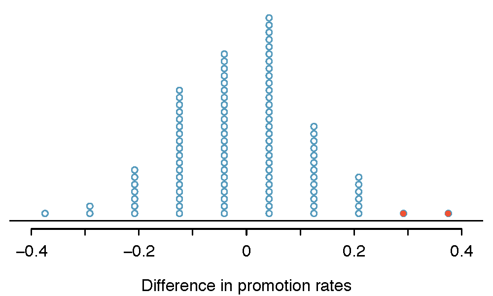

# Foundations of inference {#inference-foundations}

```{block2, type="uptohere", echo=TRUE}
The content in this chapter is currently just placeholder. We will remove this banner once the chapter content has been updated and ready for review.
```

```{block2, chp2-intro, type="chapterintro", echo=TRUE}
Statistical inference is primarily concerned with understanding and quantifying the uncertainty of parameter estimates.  
While the equations and details change depending on the setting, the foundations for inference are the same throughout all of statistics. 

We start with two case studies designed to motivate the process of making decisions about research claims.  We formalize the process through the introducuction of the **hypothesis testing framework**, which allows us to formally evaluate claims about the population.

Finally we expand on the familiar idea of using a sample proportion to estimate a population proportion.
That is, we create what is called a **confidence interval**, which is a range of plausible values where we may find the true population value.
```


```{r include=FALSE}
terms_chp_5 <- c("hypothesis test", "confidence interval")
```

Throughout the book so far, you have worked with data in a variety of contexts.
You have learned how to summarize and visualize the data as well as how to model multiple variables at the same time.
Sometimes the dataset at hand represents the entire research question.
But more often than not, the data have been collected to answer a research question about a larger group of which the data are a (hopefully) representative subset.

You may agree that there is almost always variability in data (one dataset will not be identical to a second dataset even if they are both collected from the same population using the same methods).
However, quantifying the variability in the data is neither obvious nor easy to do (**how** different is one dataset from another?).  


```{block2, type="example", echo=TRUE}
Suppose your professor splits the students in class into two groups: students on the left and students on the right. If $\hat{p}_{_L}$ and $\hat{p}_{_R}$ represent the proportion of students who own an Apple product on the left and right, respectively, would you be surprised if $\hat{p}_{_L}$ did not *exactly* equal $\hat{p}_{_R}$?}

---

While the proportions would probably be close to each other, it would be unusual for them to be exactly the same. We would probably observe a small difference due to *chance*.
```


```{block2, type="guidedpractice", echo=TRUE}
If we don't think the side of the room a person sits on in class is related to whether the person owns an Apple product, what assumption are we making about the relationship between these two variables?
(Reminder: for these Guided Practice questions, you can check your answer in the footnote.)^[We would be assuming that these two variables are **independent**.]
```

```{r include=FALSE}
terms_chp_5 <- c(terms_chp_5, "independent")
```

Studying randomness of this form is a key focus of statistics.  
Throughout this chapter, and those that follow, we provide three different approaches for quantifying the variability inherent in data: randomization, bootstrapping, and mthematical models.
Using the methods provided in this chapter, we will be able to draw conclusions beyond the dataset at hand to research questions about larger populations.

## Inference through randomization

The first type of 

```{r include=FALSE}
terms_chp_5 <- c(terms_chp_5, "randomization")
```


### Randomization case study: gender discrimination {#caseStudyGenderDiscrimination}


\index{data!discrimination|(}

We consider a study investigating gender discrimination in the 1970s, which is set in the context of personnel decisions within a bank.^[Rosen B and Jerdee T. 1974. "Influence of sex role stereotypes on personnel decisions." Journal of Applied Psychology 59(1):9-14.] The research question we hope to answer~is, "Are females discriminated against in promotion decisions made by male managers?"

#### Variability within data {#variabilityWithinData}

The participants in this study were 48 male bank supervisors attending a management institute at the University of North Carolina in 1972. They were asked to assume the role of the personnel director of a bank and were given a personnel file to judge whether the person should be promoted to a branch manager position. The files given to the participants were identical, except that half of them indicated the candidate was male and the other half indicated the candidate was female. These files were randomly assigned to the subjects.

```{block2, type="guidedpractice", echo=TRUE}
Is this an observational study or an experiment? How does the type of study impact what can be inferred from the results?^[The study is an experiment, as subjects were randomly assigned a male file or a female file. Since this is an experiment, the results can be used to evaluate a causal relationship between gender of a candidate and the promotion decision.]
```

For each supervisor we recorded the gender associated with the assigned file and the promotion decision. Using the results of the study summarized in Table~\@ref(tab:discriminationResults), we would like to evaluate if females are unfairly discriminated against in promotion decisions. 
In this study, a smaller proportion of females are promoted than males (0.583 versus 0.875), but it is unclear whether the difference provides *convincing evidence* that females are unfairly discriminated against.

\begin{table}[ht]
\centering
\begin{tabular}{l l cc rr}
& & \multicolumn{2}{c}{\var{decision}} \\
  \cline{3-4}
		&			& 	{promoted} 	& {not promoted} & Total & \hspace{3mm}  \\ 
  \cline{2-5}
		&	{male} 			& 21    		& 3   & 24  	 \\ 
  \raisebox{1.5ex}[0pt]{\var{gender}}		&	{female} 	& 14    		& 10     & 24	 \\ 
  \cline{2-5}
  		&	Total		& 35	& 13	&  48 \\
  \cline{2-5}
\end{tabular}
\caption{Summary results for the gender discrimination study.}
\label{discriminationResults}
\end{table}


```{block2, type="example", echo=TRUE}
Statisticians are sometimes called upon to evaluate the strength of evidence. 
When looking at the rates of promotion for males and females in this study, why might we be tempted to immediately conclude that females are being discriminated against?
  
---
  
The large difference in promotion rates (58.3% for females versus 87.5% for males) suggest there might be discrimination against women in promotion decisions. 
However, we cannot yet be sure if the observed difference represents discrimination or is just from random chance. 
Generally there is a little bit of fluctuation in sample data, and we wouldn't expect the sample proportions to be *exactly* equal, even if the truth was that the promotion decisions were independent of gender.
```

The previous example is a reminder that the observed outcomes in the sample may not perfectly reflect the true relationships between variables in the underlying population.
Table~\@ref(tab:discriminationResults) shows there were 7 fewer promotions in the female group than in the male group, a difference in promotion rates of 29.2% $\left( \frac{21}{24} - \frac{14}{24} = 0.292 \right)$. 
This observed difference is what we call a **point estimate** of the true effect. 
The point estimate of the difference is large, but the sample size for the study is small, making it unclear if this observed difference represents discrimination or whether it is simply due to chance. 
We label these two competing claims, $H_0$ and $H_A$:

```{r include=FALSE}
terms_chp_5 <- c(terms_chp_5, "point estimate")
```

> $H_0$: **Null hypothesis**. The variables `gender` and `decision` are independent. They have no relationship, and the observed difference between the proportion of males and females who were promoted, 29.2%, was due to chance.
> $H_A$: **Alternative hypothesis**. The variables `gender` and `decision` are *not* independent. The difference in promotion rates of 29.2% was not due to chance, and equally qualified females are less likely to be promoted than males.

```{r include=FALSE}
terms_chp_5 <- c(terms_chp_5, "null hypothesis", "alternative hypothesis")
```

```{block2, type="onebox", echo=TRUE}
**Hypothesis testing**
These hypotheses are part of what is called a **hypothesis test**. 
A hypothesis test is a statistical technique used to evaluate competing claims using data. Often times, the null hypothesis takes a stance of *no difference* or *no effect*. 
If the null hypothesis and the data notably disagree, then we will reject the null hypothesis in favor of the alternative hypothesis. 

Don't worry if you aren't a master of hypothesis testing at the end of this section. 
We'll discuss these ideas and details many times in this chapter.
```

```{r include=FALSE}
terms_chp_5 <- c(terms_chp_5, "hypothesis test")
```

What would it mean if the null hypothesis, which says the variables `gender` and `decision` are unrelated, is true? 
It would mean each banker would decide whether to promote the candidate without regard to the gender indicated on the file. 
That~is, the difference in the promotion percentages would be due to the way the files were randomly divided to the bankers, and the randomization just happened to give rise to a relatively large difference of 29.2%.

Consider the alternative hypothesis: bankers were influenced by which gender was listed on the personnel file. 
If this was true, and especially if this influence was substantial, we would expect to see some difference in the promotion rates of male and female candidates. 
If this gender bias was against females, we would expect a smaller fraction of promotion recommendations for female personnel files relative to the male files.

We will choose between these two competing claims by assessing if the data conflict so much with $H_0$ that the null hypothesis cannot be deemed reasonable. 
If this is the case, and the data support $H_A$, then we will reject the notion of independence and conclude that these data provide strong evidence of discrimination.

#### Simulating the study {#simulatingTheStudy}

Table~\@ref(tab:discriminationResults) shows that 35 bank supervisors recommended promotion and 13 did not. 
Now, suppose the bankers' decisions were independent of gender. 
Then, if we conducted the experiment again with a different random assignment of files, differences in promotion rates would be based only on random fluctuation. 
We can actually perform this **randomization**, which simulates what would have happened if the bankers' decisions had been independent of gender but we had distributed the files differently.^[The test procedure we employ in this section is often referred to as a **permutation test**.]

```{r include=FALSE}
terms_chp_5 <- c(terms_chp_5, "permutation test")
```

In this **simulation**, we thoroughly shuffle 48 personnel files, 24 labeled `male` and 24 labeled `female`, and deal these files into two stacks. 
We will deal 35 files into the first stack, which will represent the 35 supervisors who recommended promotion. 
The second stack will have 13 files, and it will represent the 13 supervisors who recommended against promotion. Then, as we did with the original data, we tabulate the results and determine the fraction of `male` and `female` who were promoted.

```{r include=FALSE}
terms_chp_5 <- c(terms_chp_5, "simulation")
```

Since the randomization of files in this simulation is independent of the promotion decisions, any difference in the two fractions is entirely due to chance. Table~\@ref(tab:discriminationRand1) show the results of such a simulation.

\begin{table}[ht]
\centering
\begin{tabular}{l l cc rr}
& & \multicolumn{2}{c}{\var{decision}} \\
  \cline{3-4}
		&			& 	{promoted} 	& {not promoted} & Total & \hspace{3mm}  \\ 
  \cline{2-5}
		&	male 					& 18    		& 6    & 24 	 \\ 
  \raisebox{1.5ex}[0pt]{\var{gender\_\hspace{0.3mm}simulated}}		&	female 	& 17    		& 7 & 24    	 \\ 
  \cline{2-5}
  & Total	& 35 & 13 & 48
\end{tabular}
\caption{Simulation results, where any difference in promotion rates between \resp{male} and \resp{female} is purely due to chance.}
\label{discriminationRand1}
\end{table}

```{block2, type="guidedpractice", echo=TRUE}
What is the difference in promotion rates between the two simulated groups in Table~\@ref(tab:discriminationRand1) ? 
How does this compare to the observed difference 29.2% from the actual~study?^[$18/24 - 17/24=0.042$ or about 4.2% in favor of the men. This difference due to chance is much smaller than the difference observed in the actual groups.]
```

#### Checking for independence 

We computed one possible difference under the null hypothesis in Guided Practice, which represents one difference due to chance. 
While in this first simulation, we physically dealt out files, it is much more efficient to perform this simulation using a computer. 
Repeating the simulation on a computer, we get another difference due to chance: -0.042. 
And another: 0.208. 
And so on until we repeat the simulation enough times that we have a good idea of what represents the *distribution of differences from chance alone*. 
Figure~\@ref(fig:discRandDotPlot) shows a plot of the differences found from 100 simulations, where each dot represents a simulated difference between the proportions of male and female files recommended for promotion.


```{r discRandDotPlot, fig.cap="A stacked dot plot of differences from 100 simulations produced under the null hypothesis, $H_0$, where `gender_simulated` and `decision` are independent. Two of the 100 simulations had a difference of at least 29.2%, the difference observed in the study, and are shown as solid dots.", warning=FALSE, fig.width=10}


#source("05/figures/discRandDotPlot/discRandDotPlot.R")   # source helper
#par_og <- par(no.readonly = TRUE)     # save original par
#par(mar = rep(0.5,4), mfrow = c(2,1)) # no margin, 2 figures 
#build_srs(n = 18, N = 108)            # build figure
#build_stratified(N = 108)             # build figure
#par(par_og)                           # restore original par
```

Note that the distribution of these simulated differences is centered around 0. Because we simulated differences in a way that made no distinction between men and women, this makes sense: we should expect differences from chance alone to fall around zero with some random fluctuation for each simulation.

```{block2, type="example", echo=TRUE}
How often would you observe a difference of at least 29.2% (0.292) according to Figure~\@ref(fig:discRandDotPlot)? 
Often, sometimes, rarely, or never?
  
---
  
It appears that a difference of at least 29.2% due to chance alone would only happen about 2% of the time according to Figure~\@ref(fig:discRandDotPlot). 
Such a low probability indicates that observing such a large difference from chance is rare.
```

The difference of 29.2% is a rare event if there really is no impact from listing gender in the candidates' files, which provides us with two possible interpretations of the study results:


> $H_0$: **Null hypothesis**. Gender has no effect on promotion decision, and we observed a difference that is so large that it would only happen rarely.
> $H_A$: **Alternative hypothesis**. Gender has an effect on promotion decision, and what we observed was actually due to equally qualified women being discriminated against in promotion decisions, which explains the large difference of 29.2%.

When we conduct formal studies, we reject a skeptical position if the data strongly conflict with that position.^[This reasoning does not generally extend to anecdotal observations. Each of us observes incredibly rare events every day, events we could not possibly hope to predict. 
However, in the non-rigorous setting of anecdotal evidence, almost anything may appear to be a rare event, so the idea of looking for rare events in day-to-day activities is treacherous. 
For example, we might look at the lottery: there was only a 1 in 176 million chance that the Mega Millions numbers for the largest jackpot in history (March 30, 2012) would be (2, 4, 23, 38, 46) with a Mega ball of (23), but nonetheless those numbers came up! 
However, no matter what numbers had turned up, they would have had the same incredibly rare odds. 
That is, *any set of numbers we could have observed would ultimately be incredibly rare*. 
This type of situation is typical of our daily lives: each possible event in itself seems incredibly rare, but if we consider every alternative, those outcomes are also incredibly rare. 
We should be cautious not to misinterpret such anecdotal evidence.]
In our analysis, we determined that there was only a $\approx$2% probability of obtaining a sample where $\geq$29.2% more males than females get promoted by chance alone, so we conclude the data provide strong evidence of gender discrimination against women by the supervisors. 
In this case, we reject the null hypothesis in favor of the alternative.

\index{data!discrimination|)}

Statistical inference is the practice of making decisions and conclusions from data in the context of uncertainty. 
Errors do occur, just like rare events, and the data set at hand might lead us to the wrong conclusion. While a given data set may not always lead us to a correct conclusion, statistical inference gives us tools to control and evaluate how often these errors occur. 
Before getting into the nuances of hypothesis testing, let's work through another case study.


### Randomization case study: opportunity cost

### Hypothesis testing

###  Randomization test box/flow chart

**randomization test**

```{block2, type="todo", echo=TRUE}
Randomization flow chart
```

```{r include=FALSE}
terms_chp_5 <- c(terms_chp_5, "randomization test")
```

## Inference through bootstrapping

###  Bootstrapping case study: 

### Confidence intervals

### Bootstrap confidence interval box/flow chart

```{block2, type="todo", echo=TRUE}
Bootstrap flow chart
```


## Inference through mathematical models

### CLT

### Normal Distribution

### Mathematical model case study: (HT)

### Mathematical model case study: (CI)


### Mathematical model box / flow chart


```{block2, type="todo", echo=TRUE}
Math flow chart
```
