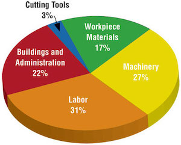

# Effective communication of exploratory results {#explore-effective}

::: {.todo}
Add chapter summary
:::

## Keep it simple

We discussed earlier that pie charts do not tend to be useful when the categorical variable being displayed has many levels.
In addition, there is little value added to coloring each pie.
And definitely no value added to making the pie chart three dimensional.
A simple bar plot can communicate the same information in a simpler, easier to digest way.

```{r}
expenses <- tribble(
  ~category,                     ~value,
  "Cutting tools"                , 0.03,
  "Buildings and administration" , 0.22,
  "Labor"                        , 0.31,
  "Machinery"                    , 0.27,
  "Workplace materials"          , 0.17
) %>%
  mutate(value =  value * 100) %>%
  uncount(weights = value)
```

```{r out.width="30%"}
# remake in R using ggthreed

```

vs.

```{r pie-to-bar}
ggplot(expenses, aes(x = fct_infreq(category))) +
  geom_bar() +
  theme_minimal() +
  coord_flip() +
  labs(x = "", y = "")
```

### Use color to draw attention

Avoid adding color just to add color, instead use it to draw attention.
This doesn't mean you shouldn't think about how visually pleasing your visualization is, and if you're adding color for making it visually pleasing without drawing attention to a particular feature, that might still be fine.
But you should be critical of default coloring and explicitly decide whether to include color and how.
Also note that not everyone sees color the same way, often it's useful to add color and one more feature (e.g., pattern) so that you can refer to the features you're drawing attention to in multiple ways.

```{r fig.width = 5, fig.asp=0.8}
p_bad <- ggplot(expenses, aes(x = fct_infreq(category), fill = category)) +
  geom_bar() +
  theme_minimal() +
  coord_flip() +
  labs(x = "", y = "") +
  theme(legend.position = "none")

p_good <- ggplot(expenses, aes(x = fct_infreq(category), fill = category)) +
  geom_bar() +
  theme_minimal() +
  coord_flip() +
  labs(x = "", y = "") +
  scale_fill_manual(values = c("red", rep("gray", 4))) +
  theme(legend.position = "none")

p_bad / p_good
```

### Tell a story

```{r fig.cap = "Credit: Angela Zoss and Eric Monson, Duke Data Visualization Services", out.width="100%"}
knitr::include_graphics("images/time-series.story.png")
```

### Order matters

In September 2019, YouGov survey asked 1,639 GB adults the following question[^explore-effective-1]:

[^explore-effective-1]: Source: [YouGov Survey Results](https://d25d2506sfb94s.cloudfront.net/cumulus_uploads/document/x0msmggx08/YouGov%20-%20Brexit%20and%202019%20election.pdf), retrieved Oct 7, 2019.

> In hindsight, do you think Britain was right/wrong to vote to leave EU?
>
> -   Right to leave\
> -   Wrong to leave\
> -   Don't know

```{r}
brexit <- tibble(
  opinion = c(
    rep("Right", 664), rep("Wrong", 787), rep("Don't know", 188)
    ),
  region = c(
    rep("london", 63), rep("rest_of_south", 241), rep("midlands_wales", 145), rep("north", 176), rep("scot", 39),
    rep("london", 110), rep("rest_of_south", 257), rep("midlands_wales", 152), rep("north", 176), rep("scot", 92),
    rep("london", 24), rep("rest_of_south", 49), rep("midlands_wales", 57), rep("north", 48), rep("scot", 10)
    )
)
```

Alphabetical order is rarely ideal, so sometimes it's better to order bars by frequency.

```{r}
p_bad <- ggplot(data = brexit, aes(x = opinion)) +
  geom_bar()

p_good <- ggplot(data = brexit, aes(x = fct_infreq(opinion))) +
  geom_bar()

p_bad + p_good
```

We can improve this further by cleaning up axis labels.

```{r}
ggplot(data = brexit, aes(x = opinion)) +
  geom_bar() +
  labs(x = "Opinion", y = "Count")
```

There may also be inherent ordering to levels of your categorical variables.
If so, the visualization should respect that.

```{r}
brexit <- brexit %>%
  mutate(
    region = fct_relevel(
      region,
      "london", "rest_of_south", "midlands_wales", "north", "scot"
    ),
    region = fct_recode(
      region,
      London = "london", 
      `Rest of South` = "rest_of_south", 
      `Midlands / Wales` = "midlands_wales", 
      North = "north", 
      Scotland = "scot"
    )
  )

ggplot(data = brexit, aes(x = region)) +
  geom_bar()
```

### Put long categories on the y-axis

And clean up axis labels.

```{r out.width="100%", fig.asp=0.5, fig.width=8}
p_bad <- ggplot(data = brexit, aes(x = region)) +
  geom_bar()

p_good <- ggplot(data = brexit, aes(y = region)) +
  geom_bar() +
    labs(x = "Region", y = "")

p_bad + p_good
```

### Pick a purpose

Segmented bar plots can be hard to read.
Use faceting, avoid redundancy, and use informative labels (note the shortlink to the survey).

```{r out.width="100%", fig.asp=0.8, fig.width=8}
p_bad <- ggplot(data = brexit, aes(x = region, fill = opinion)) +
  geom_bar()

p_good <- ggplot(data = brexit, aes(x = opinion)) +
  geom_bar() +
  coord_flip() +
  facet_grid(. ~ region, labeller = label_wrap_gen(width = 12)) +
  labs(
    title = "Was Britain right/wrong to vote to leave EU?",
    subtitle = "YouGov Survey Results, 2-3 September 2019",
    caption = "Source: bit.ly/2lCJZVg", 
    x = "", 
    y = ""
  )

p_bad / p_good
```

### Select meaningful colors

<!-- An example with an ordinal variable with more levels would be better. -->

Rainbow colors are not always the right choice.
Viridis scale works well with ordinal data

```{r out.width="100%", fig.asp=0.8, fig.width=8}
p_bad <- ggplot(data = brexit, aes(x = region, fill = opinion)) +
  geom_bar(position = "fill") +
  coord_flip()

p_good <- ggplot(data = brexit, aes(x = region, fill = opinion)) +
  geom_bar(position = "fill") +
  coord_flip() +
  scale_fill_viridis_d() +
  labs(
    title = "Was Britain right/wrong to vote to leave EU?",
    subtitle = "YouGov Survey Results, 2-3 September 2019",
    caption = "Source: bit.ly/2lCJZVg",
    x = "", 
    y = "",
    fill = ""
)

p_bad / p_good
```

## Chapter review {#chp6-review}

### Summary

::: {.todo}
Add summary
:::

### Terms

We introduced the following terms in the chapter.
If you're not sure what some of these terms mean, we recommend you go back in the text and review their definitions.

```{r eval = FALSE}
make_terms_table(terms_chp_6)
```

## Exercises {#chp6-exercises}

::: {.exercises}
```{r exercises-06, child = "exercises/06-ex-explore-effective.Rmd", eval=FALSE}
```
:::
