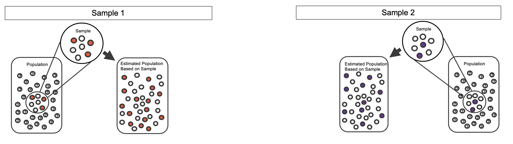
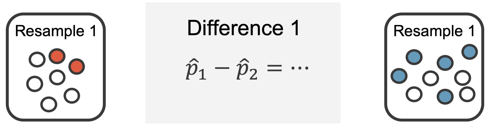
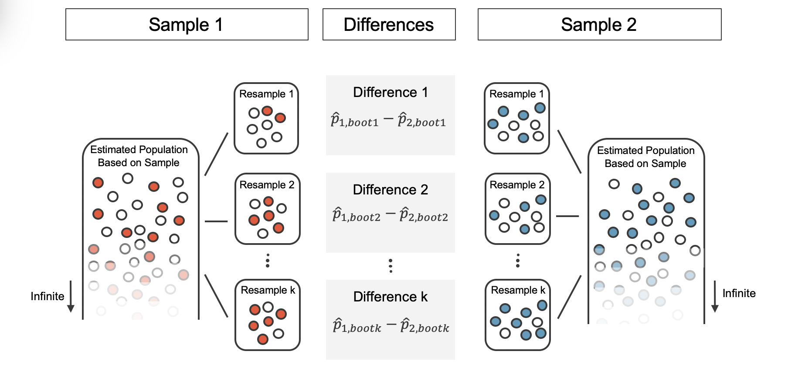
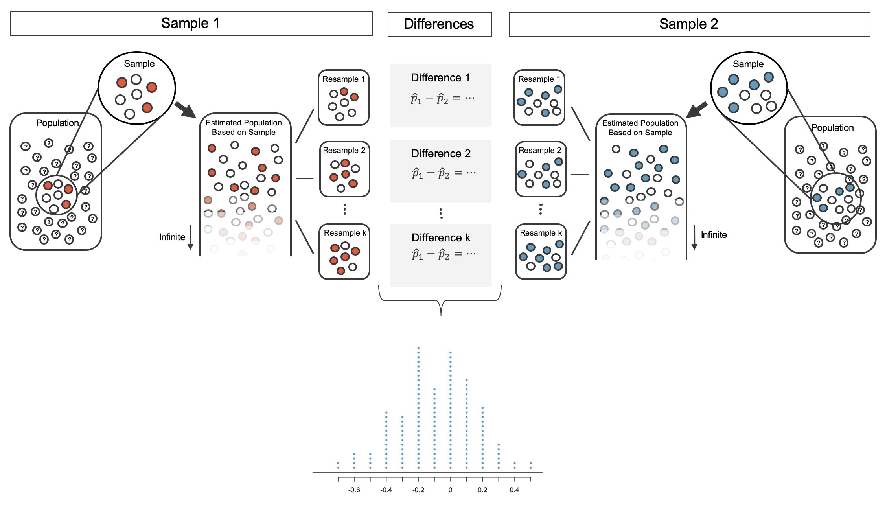

# Inference for categorical responses {#inference-cat}

::: {.chapterintro}
Focusing now on Statistical Inference for **categorical data**, we will revisit many of the foundational aspects of hypothesis testing from Chapter \@ref(intro-stat-inference).

The three data structures we detail are one binary variable, summarized using a single proportion; two binary variables, summarized using a difference of two proportions; and two categorical variables, summarized using a two-way table.
When appropriate, each of the data structures will be analyzed using the three methods from Chapter \@ref(intro-stat-inference): randomization test, bootstrapping, and mathematical models.

As we build on the inferential ideas, we will visit new foundational concepts in statistical inference.
For example, we will cover the conditions for when a normal model is appropriate; the two different error rates in hypothesis testing; and choosing the confidence level for a confidence interval.
:::

```{r summary3methodsChp6}
method_summary_table <- tribble(
  ~variable, ~col1, ~col2, ~col3,
  "What does it do?", "Shuffles the explanatory variable to mimic the natural variability  found in a randomized experiment.", "Resamples (with replacement) from the observed data to mimic the sampling variability found by collecting data from a population.", "Uses theory (primarily the Central Limit Theorem) to describe the hypothetical variability resulting from either repeated randomized experiments or random samples.",

  "What is the random process described?", "Randomized experiment.", "Random sampling from a population.", "Randomized experiment or random sampling.",

  "What other random processes can be approximated?", "Can also be used to describe random sampling in an observational model", "Can also be used to describe random allocation in an experiment", "Randomized experiment or random sampling.",

  "What is it best for?", "Hypothesis Testing (can be used for Confidence Intervals, but not covered in this text).", "Primarily Confidence Intervals (also Bootstrap HT for one proportion).", "Quick analyses through, for example, calculating a Z score.",

  "What physical object represents the simulation process?", "Shuffling cards", "Pulling marbles from a bag", "Not applicable",

  "What are the technical conditions?", "Independence", "Independence, large n", "Independence, large n"
)
```

```{r include=FALSE}
terms_chp_6 <- c("categorical data")
```

## One proportion {#single-prop}

We encountered inference methods for a single proportion in Chapter \@ref(intro-stat-inference), exploring point estimates, confidence intervals, and hypothesis tests.
In this section, we'll do a review of these topics and also how to choose an appropriate sample size when collecting data for single proportion contexts.

Note that there is only one variable being measured in a study which focuses on one proportion.
For each observational unit, the single variable is measured as either a success or failure (e.g., "surgical complication" vs. "no surgical complication").
Because the nature of the research question at hand focuses on only a single variable, there is not a way to randomize the variable across a different (explanatory) variable.
For this reason, we will not use randomization as an analysis tool when focusing on a single proportion.
Instead, we will apply bootstrapping techniques to test a given hypothesis, and we will also revisit the associated mathematical models.

### Bootstrap test for $H_0: p = p_0$ {#one-prop-null-boot}

The bootstrap simulation concept when $H_0$ is true is similar to the ideas used in the case studies presented in Section \@ref(boot-ci) where we bootstrapped without an assumption about $H_0.$ Because we will be testing a hypothesized value of $p$ (referred to as $p_0),$ the bootstrap simulation for hypothesis testing has a fantastic advantage that it can be used for any sample size (a huge benefit for small samples, a nice alternative for large samples).

We expand on the medical consultant example, see Section \@ref(sec-med-consult), where instead of finding an interval estimate for the true complication rate, we work to test a specific research claim.

##### Observed data {.unnumbered}

Recall the set-up for the example:

People providing an organ for donation sometimes seek the help of a special "medical consultant".
These consultants assist the patient in all aspects of the surgery, with the goal of reducing the possibility of complications during the medical procedure and recovery.
Patients might choose a consultant based in part on the historical complication rate of the consultant's clients.
One consultant tried to attract patients by noting the average complication rate for liver donor surgeries in the US is about 10%, but her clients have only had 3 complications in the 62 liver donor surgeries she has facilitated.
She claims this is strong evidence that her work meaningfully contributes to reducing complications (and therefore she should be hired!).

::: {.workedexample}
Using the data, is it possible to assess the consultant's claim that her complication rate is less than 10%?

------------------------------------------------------------------------

No.
The claim is that there is a causal connection, but the data are observational.
Patients who hire this medical consultant may have lower complication rates for other reasons.

While it is not possible to assess this causal claim, it is still possible to test for an association using these data.
For this question we ask, could the low complication rate of $\hat{p} = 0.048$ be due to chance?
:::

::: {.guidedpractice}
Write out hypotheses in both plain and statistical language to test for the association between the consultant's work and the true complication rate, $p,$ for the consultant's clients.[^inference-cat-1]
:::

[^inference-cat-1]: $H_0:$ There is no association between the consultant's contributions and the clients' complication rate.
    In statistical language, $p=0.10.$ $H_A:$ Patients who work with the consultant tend to have a complication rate lower than 10%, i.e., $p<0.10.$

Because, as it turns out, the conditions of working with the normal distribution are not met (see Section \@ref(one-prop-norm)), the uncertainty associated with the sample proportion should not be modeled using the normal distribution.
However, we would still like to assess the hypotheses from the previous Guided Practice in absence of the normal framework.
To do so, we need to evaluate the possibility of a sample value $(\hat{p})$ as far below the null value, $p_0=0.10$ as what was observed.
The deviation of the sample value from the hypothesized parameter is usually quantified with a p-value.

The p-value is computed based on the null distribution, which is the distribution of the test statistic if the null hypothesis is true.
Supposing the null hypothesis is true, we can compute the p-value by identifying the chance of observing a test statistic that favors the alternative hypothesis at least as strongly as the observed test statistic.
Here we will use a bootstrap simulation to measure the p-value.

##### Variability of the statistic {.unnumbered}

We want to identify the sampling distribution of the test statistic $(\hat{p})$ if the null hypothesis was true.
In other words, we want to see how the sample proportion changes due to chance alone.
Then we plan to use this information to decide whether there is enough evidence to reject the null hypothesis.

Under the null hypothesis, 10% of liver donors have complications during or after surgery.
Suppose this rate was really no different for the consultant's clients (for *all* the consultant's clients, not just the 62 previously measured).
If this was the case, we could *simulate* 62 clients to get a sample proportion for the complication rate from the null distribution.
Simulating observations using a hypothesized null parameter value is often called a **parametric bootstrap simulation**\index{parametric bootstrap}.

```{r include=FALSE}
terms_chp_6 <- c(terms_chp_6, "parametric bootstrap")
```

Similar to the process described in Section \@ref(boot-ci), each client can be simulated using a bag of marbles with 10% red marbles and 90% white marbles.
Sampling a marble from the bag (with 10% red marbles) is one way of simulating whether a patient has a complication *if the true complication rate is 10%* for the data.
If we select 62 marbles and then compute the proportion of patients with complications in the simulation, $\hat{p}_{sim1},$ then the resulting sample proportion is exactly a sample from the null distribution.

An undergraduate student was paid \$2 to complete this simulation.
There were 5 simulated cases with a complication and 57 simulated cases without a complication, i.e., $\hat{p}_{sim1} = 5/62 = 0.081.$

::: {.workedexample}
Is this one simulation enough to determine whether or not we should reject the null hypothesis?

------------------------------------------------------------------------

No.
To assess the hypotheses, we need to see a distribution of many values of $\hat{p}_{sim},$ not just a *single* draw from this sampling distribution.
:::

#### Observed statistic vs. null statistics {.unnumbered}

One simulation isn't enough to get a sense of the null distribution; many simulation studies are needed.
Roughly 10,000 seems sufficient.
However, paying someone to simulate 10,000 studies by hand is a waste of time and money.
Instead, simulations are typically programmed into a computer, which is much more efficient.

Figure \@ref(fig:nullDistForPHatIfLiverTransplantConsultantIsNotHelpful) shows the results of 10,000 simulated studies.
The proportions that are equal to or less than $\hat{p}=0.048$ are shaded.
The shaded areas represent sample proportions under the null distribution that provide at least as much evidence as $\hat{p}$ favoring the alternative hypothesis.
There were 1222 simulated sample proportions with $\hat{p}_{sim} \leq 0.048.$ We use these to construct the null distribution's left-tail area and find the p-value: \begin{align}
\text{left tail area }\label{estOfPValueBasedOnSimulatedNullForSingleProportion}
    &= \frac{\text{Number of observed simulations with }\hat{p}_{sim}\leq\text{ 0.048}}{10000}
\end{align} Of the 10,000 simulated $\hat{p}_{sim},$ 1222 were equal to or smaller than $\hat{p}.$ Since the hypothesis test is one-sided, the estimated p-value is equal to this tail area: 0.1222.

```{r nullDistForPHatIfLiverTransplantConsultantIsNotHelpful, fig.cap="The null distribution for $\\hat{p},$ created from 10,000 simulated studies. The left tail, representing the p-value for the hypothesis test, contains 12.22% of the simulations.", warning=FALSE, fig.width=10}

pHat <- rbinom(10^4, 62, 0.1) / 62
M    <- max(pHat) * 62
histPlot(pHat,
         breaks = (-1:(2 * M) + 0.75) / 2 / 62,
         xlab = expression(hat(p)[sim]*"    "),
         col = COL[7, 3],
         ylab = "")
histPlot(pHat[pHat < 0.05],
         breaks = (-1:(2 * M) + 0.75) / 2 / 62,
         col = COL[1],
         add = TRUE)
par(las = 0)
mtext("Number of simulations", 2, 3.3)
```

::: {.guidedpractice}
Because the estimated p-value is 0.1222, which is larger than the significance level 0.05, we do not reject the null hypothesis.
Explain what this means in plain language in the context of the problem.[^inference-cat-2]
:::

[^inference-cat-2]: There isn't sufficiently strong evidence to support an association between the consultant's work and fewer surgery complications.

\index{data!medical consultant|)}

::: {.guidedpractice}
Does the conclusion in the previous Guided Practice imply there is no real association between the surgical consultant's work and the risk of complications?
Explain.[^inference-cat-3]
:::

[^inference-cat-3]: No.
    It might be that the consultant's work is associated with a reduction but that there isn't enough data to convincingly show this connection.

::: {.important}
**Null distribution of** $\hat{p}$ with bootstrap simulation

Regardless of the statistical method chosen, the p-value is always derived by analyzing the null distribution of the test statistic.
The normal model poorly approximates the null distribution for $\hat{p}$ when the success-failure condition is not satisfied.
As a substitute, we can generate the null distribution using simulated sample proportions and use this distribution to compute the tail area, i.e., the p-value.
:::

In the previous Guided Practice, the p-value is *estimated*.
It is not exact because the simulated null distribution itself is not exact, only a close approximation.
An exact p-value can be generated using the binomial distribution, but that method will not be covered in this text.

### Mathematical model {#one-prop-norm}

#### Conditions {.unnumbered}

In Section \@ref(normalDist), we introduced the normal distribution and showed how it can be used as a mathematical model to describe the variability of a statistic.
There are conditions under which a sample proportion $\hat{p}$ is well modeled using a normal distribution.
When the sample observations are independent and the sample size is sufficiently large, the normal model will describe the variability quite well; when the observations violate the conditions, the normal model can be inaccurate

::: {.important}
**Sampling distribution of** $\hat{p}$

The sampling distribution for $\hat{p}$ based on a sample of size $n$ from a population with a true proportion $p$ is nearly normal when:

1.  The sample's observations are independent, e.g., are from a simple random sample.
2.  We expected to see at least 10 successes and 10 failures in the sample, i.e., $np\geq10$ and $n(1-p)\geq10.$ This is called the **success-failure condition**.

When these conditions are met, then the sampling distribution of $\hat{p}$ is nearly normal with mean $p$ and standard error of $\hat{p}$ as $SE = \sqrt{\frac{\ \hat{p}(1-\hat{p})\ }{n}}.$
:::

\index{success-failure condition} \index{standard error (SE)!single proportion}

```{r include=FALSE}
terms_chp_6 <- c(terms_chp_6, "success-failure condition", "standard error of single proportion")
```

Typically we don't know the true proportion $p,$ so we substitute some value to check conditions and estimate the standard error.
For confidence intervals, the sample proportion $\hat{p}$ is used to check the success-failure condition and compute the standard error.
For hypothesis tests, typically the null value -- that is, the proportion claimed in the null hypothesis -- is used in place of $p.$

The independence condition is a more nuanced requirement.
When it isn't met, it is important to understand how and why it isn't met.
For example, there exist no statistical methods available to truly correct the inherent biases of data from a convenience sample.
On the other hand, if we took a cluster sample (see Section \@ref(samp-methods)), the observations wouldn't be independent, but suitable statistical methods are available for analyzing the data (but they are beyond the scope of even most second or third courses in statistic).

::: {.workedexample}
In the examples based on large sample theory, we modeled $\hat{p}$ using the normal distribution.
Why is this not appropriate for the case study on the medical consultant?

------------------------------------------------------------------------

The independence assumption may be reasonable if each of the surgeries is from a different surgical team.
However, the success-failure condition is not satisfied.
Under the null hypothesis, we would anticipate seeing $62\times 0.10=6.2$ complications, not the 10 required for the normal approximation.
:::

While this book is scoped to well-constrained statistical problems, do remember that this is just the first book in what is a large library of statistical methods that are suitable for a very wide range of data and contexts.

#### Confidence interval for $p$ {.unnumbered}

\index{point estimate!single proportion}

A confidence interval provides a range of plausible values for the parameter $p,$ and when $\hat{p}$ can be modeled using a normal distribution, the confidence interval for $p$ takes the form $$ \hat{p} \pm z^{\star} \times SE.$$ We have seen $\hat{p}$ to be the sample proportion.
The value $z^{\star}$ determines the confidence level (previously set to be 1.96) and will be discussed in detail in the examples following.
The value of the standard error, $SE,$ depends heavily on the sample size.

::: {.important}
**Standard Error of one proportion,** $\hat{p}$

When the conditions are met so that the distribution of $\hat{p}$ is nearly normal, the **variability** of a single proportion, $\hat{p}$ is well described by:

$$SE(\hat{p}) = \sqrt{\frac{p(1-p)}{n}}$$

Note that we almost never know the true value of $p.$ A more helpful formula to use is:

$$SE(\hat{p}) \approx \sqrt{\frac{(\mbox{best guess of }p)(1 - \mbox{best guess of }p)}{n}}$$

For hypothesis testing, we often use $p_0$ as the best guess of $p.$ For confidence intervals, we typically use $\hat{p}$ as the best guess of $p.$
:::

\index{data!Payday regulation poll|(}

::: {.guidedpractice}
Consider taking many polls of registered voters (i.e., random samples) of size 300 asking them if they support legalized marijuana.
It is suspected that about 2/3 of all voters support legalized marijuana.
To understand how the sample proportion $(\hat{p})$ would vary across the samples, calculate the standard error of $\hat{p}.$[^inference-cat-4]
:::

[^inference-cat-4]: Because the $p$ is unknown but expected to be around 2/3, we will use 2/3 in place of $p$ in the formula for the standard error.\
    $SE = \sqrt{\frac{p(1-p)}{n}} \approx \sqrt{\frac{2/3 (1 - 2/3)} {300}} = 0.027.$

##### Variability of the statistic {.unnumbered}

::: {.workedexample}
A simple random sample of 826 payday loan borrowers was surveyed to better understand their interests around regulation and costs.
70% of the responses supported new regulations on payday lenders.

1.  Is it reasonable to model the variability of $\hat{p}$ from sample to sample using a normal distribution?

2.  Estimate the standard error of $\hat{p}.$

3.  Construct a 95% confidence interval for $p,$ the proportion of payday borrowers who support increased regulation for payday lenders.

------------------------------------------------------------------------

1.  The data are a random sample, so the observations are independent and representative of the population of interest.

We also must check the success-failure condition, which we do using $\hat{p}$ in place of $p$ when computing a confidence interval: \begin{align*}
  \text{Support: }
      n p &
          \approx 826 \times 0.70
      = 578\\
  \text{Not: }
      n (1 - p) &
        \approx 826 \times (1 - 0.70)
      = 248
  \end{align*} Since both values are at least 10, we can use the normal distribution to model $\hat{p}.$

2.  Because $p$ is unknown and the standard error is for a confidence interval, use $\hat{p}$ in place of $p$ in the formula.

$SE = \sqrt{\frac{p(1-p)}{n}} \approx \sqrt{\frac{0.70 (1 - 0.70)} {826}} = 0.016.$

3.  Using the point estimate 0.70, $z^{\star} = 1.96$ for a 95% confidence interval, and the standard error $SE = 0.016$ from the previous Guided Practice, the confidence interval is $$ \text{point estimate} \ \pm\ z^{\star} \times SE \to 0.70 \ \pm\ 1.96 \times 0.016 \to (0.669, 0.731)$$ We are 95% confident that the true proportion of payday borrowers who supported regulation at the time of the poll was between 0.669 and 0.731.
:::

::: {.important}
**Constructing a confidence interval for a single proportion**

There are three steps to constructing a confidence interval for $p.$

1.  Check independence and the success-failure condition using $\hat{p}.$ If the conditions are met, the sampling distribution of $\hat{p}$ may be well-approximated by the normal model.
2.  Construct the standard error using $\hat{p}$ in place of $p$ in the standard error formula.
3.  Apply the general confidence interval formula.
:::

For additional one-proportion confidence interval examples, see Section \@ref(ConfidenceIntervals).

#### Changing the confidence level {.unnumbered}

\index{confidence interval!confidence level|(}

Suppose we want to consider confidence intervals where the confidence level is somewhat higher than 95%: perhaps we would like a confidence level of 99%.
Think back to the analogy about trying to catch a fish: if we want to be more sure that we will catch the fish, we should use a wider net.
To create a 99% confidence level, we must also widen our 95% interval.
On the other hand, if we want an interval with lower confidence, such as 90%, we could make our original 95% interval slightly slimmer.

The 95% confidence interval structure provides guidance in how to make intervals with new confidence levels.
Below is a general 95% confidence interval for a point estimate that comes from a nearly normal distribution: \begin{eqnarray}
\text{point estimate}\ \pm\ 1.96\times SE
\end{eqnarray} There are three components to this interval: the point estimate, "1.96", and the standard error.
The choice of $1.96\times SE$ was based on capturing 95% of the data since the estimate is within 1.96 standard errors of the true value about 95% of the time.
The choice of 1.96 corresponds to a 95% confidence level.

::: {.guidedpractice}
If $X$ is a normally distributed random variable, how often will $X$ be within 2.58 standard deviations of the mean?[^inference-cat-5]
:::

[^inference-cat-5]: This is equivalent to asking how often the $Z$ score will be larger than -2.58 but less than 2.58.
    (For a picture, see Figure \@ref(fig:choosingZForCI).) To determine this probability, look up -2.58 and 2.58 in the normal probability table (0.0049 and 0.9951).
    Thus, there is a $0.9951-0.0049 \approx 0.99$ probability that the unobserved random variable $X$ will be within 2.58 standard deviations of the mean.

```{r choosingZForCI, fig.cap="The area between -$z^{\\star}$ and $z^{\\star}$ increases as $|z^{\\star}|$ becomes larger. If the confidence level is 99%, we choose $z^{\\star}$ such that 99% of the normal curve is between -$z^{\\star}$ and $z^{\\star},$ which corresponds to 0.5% in the lower tail and 0.5% in the upper tail: $z^{\\star}=2.58.$", warning=FALSE, fig.width=10}

par(mar=c(3.3,1,.5,1), mgp=c(2.1,0.6,0))
X <- rev(seq(-4, 4, 0.025))
Y <- dt(X, 10) # makes better visual
plot(X, Y, type='l', xlab='standard deviations from the mean', ylab='', axes=FALSE, xlim=3.3*c(-1,1), ylim=c(0, 0.59), col=COL[6])
axis(1, at=-3:3) #at=c(-4, -2, 0, 2, 4))
abline(h=0) #, col='#00000088')
yMax <- 0.41
X <- seq(-4, 4, 0.025)
Y <- dt(X, 10) # makes better visual
lines(X, Y, col=COL[6])

these <- (X < 2.58 & X > -2.58)
x <- c(-2.58, X[these], 2.58)
y <- c(0, dt(X[these], 10), 0)
polygon(x, y, col=COL[1,3], border='#00000000')
these <- (X < 1.96 & X > -1.96)
x <- c(-1.96, X[these], 1.96)
y <- c(0, dt(X[these], 10), 0)
polygon(x, y, col=COL[1], border='#00000000')

#x <- 1.96*c(-1,1,1,-1)
#y <- c(1,1,1.38,1.38)*yMax/3 
#polygon(x, y, border='#FFFFFF55', col='#FFFFFF77', lwd=7)
lines(1.96*c(-1,1), rep(yMax,2), lwd=2)
lines(rep(-1.96,2), c(0,yMax), lty=2, col=COL[6])
lines(rep( 1.96,2), c(0,yMax), lty=2, col=COL[6])
text(0, yMax, '95%, extends -1.96 to 1.96', pos=3)

yMax <- 0.53
#x <- 2.58*c(-1,1,1,-1)
#y <- c(1,1,1.19,1.19)*2*yMax/3 
#polygon(x, y, border='#FFFFFF55', col='#FFFFFF77', lwd=7)
lines(2.58*c(-1,1), rep(yMax,2), lwd=2)
lines(rep(-2.58,2), c(0,yMax), lty=2, col='#00000055')
lines(rep( 2.58,2), c(0,yMax), lty=2, col='#00000055')
text(0, yMax, '99%, extends -2.58 to 2.58', pos=3)

```

\index{confidence interval!confidence level|)}

To create a 99% confidence interval, change 1.96 in the 95% confidence interval formula to be $2.58.$ The previous Guided Practice highlights that 99% of the time a normal random variable will be within 2.58 standard deviations of its mean.
This approach -- using the Z scores in the normal model to compute confidence levels -- is appropriate when the point estimate is associated with a normal distribution and we can properly compute the standard error.
Thus, the formula for a 99% confidence interval is:

```{=tex}
\begin{eqnarray*}
\text{point estimate}\ \pm\ 2.58\times SE
\end{eqnarray*}
```
The normal approximation is crucial to the precision of the $z^\star$ confidence intervals (in contrast to the bootstrap confidence intervals).
When the normal model is not a good fit, we will use alternative distributions that better characterize the sampling distribution or we will use bootstrapping procedures.

::: {.guidedpractice}
Create a 99% confidence interval for the impact of the stent on the risk of stroke using the data from Section \@ref(case-study-stents-strokes).
The point estimate is 0.090, and the standard error is $SE = 0.028.$ It has been verified for you that the point estimate can reasonably be modeled by a normal distribution.[^inference-cat-6]
:::

[^inference-cat-6]: Since the necessary conditions for applying the normal model have already been checked for us, we can go straight to the construction of the confidence interval: $\text{point estimate}\ \pm\ 2.58 \times SE \rightarrow (0.018, 0.162).$ We are 99% confident that implanting a stent in the brain of a patient who is at risk of stroke increases the risk of stroke within 30 days by a rate of 0.018 to 0.162 (assuming the patients are representative of the population).

::: {.important}
**Mathematical model confidence interval for any confidence level.**

If the point estimate follows the normal model with standard error $SE,$ then a confidence interval for the population parameter is \begin{eqnarray*}
\text{point estimate}\ \pm\ z^{\star} \times SE
\end{eqnarray*} where $z^{\star}$ corresponds to the confidence level selected.
:::

Figure \@ref(fig:choosingZForCI) provides a picture of how to identify $z^{\star}$ based on a confidence level.
We select $z^{\star}$ so that the area between -$z^{\star}$ and $z^{\star}$ in the normal model corresponds to the confidence level.

::: {.guidedpractice}
Previously, we found that implanting a stent in the brain of a patient at risk for a stroke *increased* the risk of a stroke.
The study estimated a 9% increase in the number of patients who had a stroke, and the standard error of this estimate was about $SE = 2.8%.$ Compute a 90% confidence interval for the effect.[^inference-cat-7]
:::

[^inference-cat-7]: We must find $z^{\star}$ such that 90% of the distribution falls between -$z^{\star}$ and $z^{\star}$ in the standard normal model, $N(\mu=0, \sigma=1).$ We can look up -$z^{\star}$ in the normal probability table by looking for a lower tail of 5% (the other 5% is in the upper tail), thus $z^{\star}=1.65.$ The 90% confidence interval can then be computed as $\text{point estimate}\ \pm\ 1.65\times SE \to (4.4\%, 13.6\%).$ (Note: the conditions for normality had earlier been confirmed for us.) That is, we are 90% confident that implanting a stent in a stroke patient's brain increased the risk of stroke within 30 days by 4.4% to 13.6%.\
    Note, the problem was set up as 90% to indicate that there was not a need for a high level of confidence (such a 95% or 99%).
    A lower degree of confidence increases potential for error, but it also produces a more narrow interval.

#### Hypothesis test for $H_0: p = p_0$ {.unnumbered}

::: {.important}
**The test statistic for assessing a single proportion is a Z.**

The Z score is a ratio of how the sample proportion differs from the hypothesized proportion as compared to the expected variability of the $\hat{p}$ values.

```{=tex}
\begin{align*}
Z = \frac{\hat{p} - p_0}{\sqrt{p_0(1-p_0)/n}}
\end{align*}
```
When the null hypothesis is true and the conditions are met, Z has a standard normal distribution.

Conditions:

-   independently observed data\
-   large samples $(n p_0 \geq 10$ and $n (1-p_0) \geq 10)$\
:::

One possible regulation for payday lenders is that they would be required to do a credit check and evaluate debt payments against the borrower's finances.
We would like to know: would borrowers support this form of regulation?

::: {.guidedpractice}
Set up hypotheses to evaluate whether borrowers have a majority support for this type of regulation.[^inference-cat-8]
:::

[^inference-cat-8]: $H_0:$ there is not support for the regulation; $H_0:$ $p \leq 0.50.$ $H_A:$ the majority of borrowers support the regulation; $H_A:$ $p > 0.50.$

To apply the normal distribution framework in the context of a hypothesis test for a proportion, the independence and success-failure conditions must be satisfied.
In a hypothesis test, the success-failure condition is checked using the null proportion: we verify $np_0$ and $n(1-p_0)$ are at least 10, where $p_0$ is the null value.

::: {.guidedpractice}
Do payday loan borrowers support a regulation that would require lenders to pull their credit report and evaluate their debt payments?
From a random sample of 826 borrowers, 51% said they would support such a regulation.
Is it reasonable use a normal distribution to model $\hat{p}$ for a hypothesis test here?[^inference-cat-9]
:::

[^inference-cat-9]: Independence holds since the poll is based on a random sample.
    The success-failure condition also holds, which is checked using the null value $(p_0 = 0.5)$ from $H_0:$ $np_0 = 826 \times 0.5 = 413,$ $n(1 - p_0) = 826 \times 0.5 = 413.$ Recall that here, the best guess for $p$ is $p_0$ which comes from the null hypothesis (because we assume the null hypothesis is true when performing the testing procedure steps).
    $H_0:$ there is not support for the regulation; $H_0:$ $p \leq 0.50.$ $H_A:$ the majority of borrowers support the regulation; $H_A:$ $p > 0.50.$

::: {.workedexample}
Using the hypotheses and data from the previous Guided Practices, evaluate whether the poll on lending regulations provides convincing evidence that a majority of payday loan borrowers support a new regulation that would require lenders to pull credit reports and evaluate debt payments.

------------------------------------------------------------------------

With hypotheses already set up and conditions checked, we can move onto calculations.
The standard error in the context of a one-proportion hypothesis test is computed using the null value, $p_0:$ \begin{align*}
  SE = \sqrt{\frac{p_0 (1 - p_0)}{n}}
      = \sqrt{\frac{0.5 (1 - 0.5)}{826}}
      = 0.017
  \end{align*} A picture of the normal model is shown with the p-value represented by the shaded region.

```{r}
normTail(0.5, 0.017, L = 0.49, U = 0.51, col = COL[1])  
```

Based on the normal model, the test statistic can be computed as the Z-score of the point estimate: \begin{align*}
  Z = \frac{\text{point estimate} - \text{null value}}{SE}
      = \frac{0.51 - 0.50}{0.017}
      = 0.59
  \end{align*} The single tail area which represents the p-value is 0.2776.
Because the p-value is larger than 0.05, we do not reject $H_0.$ The poll does not provide convincing evidence that a majority of payday loan borrowers support regulations around credit checks and evaluation of debt payments.

In Section \@ref(two-prop-errors) we discuss two-sided hypothesis tests of which the payday example may have been better structured.\
That is, we might have wanted to ask whether the borrows **support or oppose** the regulations (to study opinion in either direction away from the 50% benchmark).
In that case, the p-value would have been doubled to 0.5552 (again, we would not reject $H_0).$ In the two-sided hypothesis setting, the appropriate conclusion would be to claim that the poll does not provide convincing evidence that a majority of payday loan borrowers support or oppose regulations around credit checks and evaluation of debt payments.

In both the one-sided or two-sided setting, the conclusion is somewhat unsatisfactory because there is no conclusion.
That is, there is no resolution one way or the other about public opinion.
We cannot claim that exactly 50% of people support the regulation, but we cannot claim a majority in either direction.
:::

::: {.important}
**Mathematical model hypothesis test for a proportion.**

Set up hypotheses and verify the conditions using the null value, $p_0,$ to ensure $\hat{p}$ is nearly normal under $H_0.$ If the conditions hold, construct the standard error, again using $p_0,$ and show the p-value in a drawing.
Lastly, compute the p-value and evaluate the hypotheses.
:::

For additional one-proportion hypothesis test examples, see Section \@ref(HypothesisTesting).

\index{data!Payday regulation poll|)}

#### Violating conditions {.unnumbered}

We've spent a lot of time discussing conditions for when $\hat{p}$ can be reasonably modeled by a normal distribution.
What happens when the success-failure condition fails?
What about when the independence condition fails?
In either case, the general ideas of confidence intervals and hypothesis tests remain the same, but the strategy or technique used to generate the interval or p-value change.

When the success-failure condition isn't met for a hypothesis test, we can simulate the null distribution of $\hat{p}$ using the null value, $p_0,$ as seen in Section \@ref(one-prop-null-boot).
Unfortunately, methods for dealing with observations which are not independent are outside the scope of this book.

### Exercises {#one-proportion-exercises}

::: {.underconstruction}
Exercises for this section will be available in the 1st edition of this book, which will be available in Summer 2021.
In the meantime, [OpenIntro::Introduction to Statistics with Randomization and Simulation](https://www.openintro.org/book/isrs/) and [OpenIntro::Statistics](https://www.openintro.org/book/os/), both of which are available for free, have many exercises you can use alongside this book.
:::

## Difference of two proportions {#diff-two-prop}

We now extend the methods from Section \@ref(single-prop) to apply confidence intervals and hypothesis tests to differences in population proportions that come from two groups, Group 1 and Group 2: $p_1 - p_2.$

In our investigations, we'll identify a reasonable point estimate of $p_1 - p_2$ based on the sample, and you may have already guessed its form: $\hat{p}_1 - \hat{p}_2.$ \index{point estimate!difference of proportions} Then we'll look at the inferential analysis in three different ways: using a randomization test, applying bootstrapping for interval estimates, and, if we verify that the point estimate can be modeled using a normal distribution, we compute the estimate's standard error, and we apply the mathematical framework.

```{r include=FALSE}
terms_chp_6 <- c(terms_chp_6, "point estimate")
```

### Randomization test for $H_0: p_1 - p_2 = 0$ {#two-prop-errors}

#### Observed data {.unnumbered}

We consider a study on a new malaria vaccine called PfSPZ.
In this study, volunteer patients were randomized into one of two experiment groups: 14 patients received an experimental vaccine or 6 patients received a placebo vaccine.
Nineteen weeks later, all 20 patients were exposed to a drug-sensitive malaria virus strain; the motivation of using a drug-sensitive strain of virus here is for ethical considerations, allowing any infections to be treated effectively.
The results are summarized in Table \@ref(tab:malaria-vaccine-20-exp-summary), where 9 of the 14 treatment patients remained free of signs of infection while all of the 6 patients in the control group patients showed some baseline signs of infection.

```{r malaria-vaccine-20-exp-summary}
temptbl <- tribble(
 ~variable,    ~col1, ~col2, ~col3, ~col4, 
 "", "vaccine", "5", "9", "14",
 "`treatment`", "placebo", "6", "0","6",
 "", "Total", "11", "9", "20"
)

temptbl %>%
 kable(caption = "Summary results for the malaria vaccine experiment.",
    col.names = c("", "", "infection", "no infection", "Total")) %>%
 kable_styling() %>%
 add_header_above(c(" ", " ", "`outcome`" = 2, " "))
```

::: {.guidedpractice}
Is this an observational study or an experiment?
What implications does the study type have on what can be inferred from the results?[^inference-cat-10]
:::

[^inference-cat-10]: The study is an experiment, as patients were randomly assigned an experiment group.
    Since this is an experiment, the results can be used to evaluate a causal relationship between the malaria vaccine and whether patients showed signs of an infection.

In this study, a smaller proportion of patients who received the vaccine showed signs of an infection (35.7% versus 100%).
However, the sample is very small, and it is unclear whether the difference provides *convincing evidence* that the vaccine is effective.

As we saw in Section \@ref(inf-rand), we can randomize the responses (`infection` or `no infection`) to the treatment conditions under the null hypothesis of independence and compute possible differences in proportions.
The process by which we randomize observations to two groups is summarized and visualized in Figure \@ref(fig:fullrand).

#### Variability of the statistic {.unnumbered}

Figure \@ref(fig:malaria-rand-dot-plot) shows a stacked plot of the differences found from 100 randomization simulations (i.e., repeated iterations as described in Figure \@ref(fig:fullrand)), where each dot represents a simulated difference between the infection rates (control rate minus treatment rate).

```{r malaria-rand-dot-plot, fig.cap="A stacked dot plot of differences from 100 simulations produced under the independence model $H_0,$ where in these simulations infections are unaffected by the vaccine. Two of the 100 simulations had a difference of at least 64.3%, the difference observed in the study.", warning=FALSE, fig.width=10}

set.seed(47)

exp_gp  <- rep(c("vaccine", "placebo"), c(14, 6))
outcome <- c(rep(c('infection', 'no infection'), c(5, 9)),
             rep(c('infection', 'no infection'), c(6, 0)))

nsim    <- 100
n       <- length(exp_gp)
success <- "infection"

SimulateTable <- function(exp_gp, outcome, ...) {
  table(sample(exp_gp), outcome)
}
# SimulateTable(exp_gp, outcome)

sim_tables <-
    lapply(1:nsim, SimulateTable,
        exp_gp = exp_gp,
        outcome = outcome)
result <- sim_tables %>%
    lapply(function(x) {
    	  x[1, 1] / sum(x[1, ]) - x[2, 1] / sum(x[2, ])
    	}) %>%
    	unlist()


pval <- sum(result >= 0.64) / nsim
values <- table(result)
diffs <- unique(result)

X <- c()
Y <- c()
for (i in 1:length(diffs)) {
  x   <- diffs[i]
  rec <- sum(result == x)
  X   <- append(X, rep(x, rec))
  Y   <- append(Y, 1:rec)
}

plot(X, Y,
     xlim = range(diffs) + c(-1, 1) * sd(diffs) / 4,
     xlab = "Difference in Infection Rates",
     axes = FALSE,
     ylim = c(0, max(Y)),
     col = COL[1],
     pch = 20)
# at <- seq(-0.4, 0.4, 0.1)
# labels <- c(-0.4, "", -0.2, "", 0, "", 0.2, "", 0.4)
axis(1) #, at, labels)
abline(h = 0)
points(X[X > 0.64], Y[X > 0.64], lwd=3, col = COL[4], cex=0.4)
```

#### Observed statistic vs null statistics {.unnumbered}

Note that the distribution of these simulated differences is centered around 0.
We simulated the differences assuming that the independence model was true, and under this condition, we expect the difference to be near zero with some random fluctuation, where *near* is pretty generous in this case since the sample sizes are so small in this study.

::: {.workedexample}
How often would you observe a difference of at least 64.3% (0.643) according to Figure \@ref(fig:malaria-rand-dot-plot)?
Often, sometimes, rarely, or never?

------------------------------------------------------------------------

It appears that a difference of at least 64.3% due to chance alone would only happen about 2% of the time according to Figure \@ref(fig:malaria-rand-dot-plot).
Such a low probability indicates a rare event.
:::

The difference of 64.3% being a rare event suggests two possible interpretations of the results of the study:

-   $H_0$ Independence model. The vaccine has no effect on infection rate, and we just happened to observe a difference that would only occur on a rare occasion.
-   $H_A$ Alternative model. The vaccine has an effect on infection rate, and the difference we observed was actually due to the vaccine being effective at combating malaria, which explains the large difference of 64.3%.

Based on the simulations, we have two options:

1.  We conclude that the study results do not provide strong evidence against the independence model.
    That is, we do not have sufficiently strong evidence to conclude the vaccine had an effect in this clinical setting.

2.  We conclude the evidence is sufficiently strong to reject $H_0$ and assert that the vaccine was useful.
    When we conduct formal studies, usually we reject the notion that we just happened to observe a rare event.[^inference-cat-11]
    In this case, we reject the independence model in favor of the alternative.
    That is, we are concluding the data provide strong evidence that the vaccine provides some protection against malaria in this clinical setting.

[^inference-cat-11]: This reasoning does not generally extend to anecdotal observations.
    Each of us observes incredibly rare events every day, events we could not possibly hope to predict.
    However, in the non-rigorous setting of anecdotal evidence, almost anything may appear to be a rare event, so the idea of looking for rare events in day-to-day activities is treacherous.
    For example, we might look at the lottery: there was only a 1 in 292 million chance that the Powerball numbers for the largest jackpot in history (January 13th, 2016) would be (04, 08, 19, 27, 34) with a Powerball of (10), but nonetheless those numbers came up!
    However, no matter what numbers had turned up, they would have had the same incredibly rare odds.
    That is, *any set of numbers we could have observed would ultimately be incredibly rare*.
    This type of situation is typical of our daily lives: each possible event in itself seems incredibly rare, but if we consider every alternative, those outcomes are also incredibly rare.
    We should be cautious not to misinterpret such anecdotal evidence.

\index{data!malaria vaccine|)}

Statistical inference, is built on evaluating whether such differences are due to chance.
In statistical inference, data scientists evaluate which model is most reasonable given the data.
Errors do occur, just like rare events, and we might choose the wrong model.
While we do not always choose correctly, statistical inference gives us tools to control and evaluate how often these errors occur.

### Decision errors {#decerr}

\index{hypothesis testing!decision errors|(}

Hypothesis tests are not flawless.
Just think of the court system: innocent people are sometimes wrongly convicted and the guilty sometimes walk free.
Similarly, data can point to the wrong conclusion.
However, what distinguishes statistical hypothesis tests from a court system is that our framework allows us to quantify and control how often the data lead us to the incorrect conclusion.

In a hypothesis test, there are two competing hypotheses: the null and the alternative.
We make a statement about which one might be true, but we might choose incorrectly.
There are four possible scenarios in a hypothesis test, which are summarized in Table \@ref(tab:fourHTScenarios).

```{r fourHTScenarios}
temptbl <- tribble(
  ~variable,    ~col1, ~col2, ~col3,
 "", "$H_0$ true", "Type 1 Error","good decision", 
 "**Truth**", "$H_A$ true",  "good decision", "Type 2 Error"
)

temptbl %>%
 kable(caption = "Four different scenarios for hypothesis tests.", 
    col.names = c("", "", "Reject $H_0$", "Fail to reject $H_0$")) %>%
 add_header_above( c("", "", "**Test conclusion**" = 2)) %>%
 kable_styling()
```

A **Type 1 Error**\index{Type 1 Error} is rejecting the null hypothesis when $H_0$ is actually true.
Since we rejected the null hypothesis in the gender discrimination and opportunity cost studies, it is possible that we made a Type 1 Error in one or both of those studies.
A **Type 2 Error**\index{Type 2 Error} is failing to reject the null hypothesis when the alternative is actually true.

```{r include=FALSE}
terms_chp_6 <- c(terms_chp_6, "Type 1 Error", "Type 2 Error")
```

::: {.workedexample}
In a US court, the defendant is either innocent $(H_0)$ or guilty $(H_A).$ What does a Type 1 Error represent in this context?
What does a Type 2 Error represent?
Table \@ref(tab:fourHTScenarios) may be useful.

------------------------------------------------------------------------

If the court makes a Type 1 Error, this means the defendant is innocent $(H_0$ true) but wrongly convicted.
A Type 2 Error means the court failed to reject $H_0$ (i.e., failed to convict the person) when they were in fact guilty $(H_A$ true).
:::

::: {.guidedpractice}
Consider the opportunity cost study where we concluded students were less likely to make a DVD purchase if they were reminded that money not spent now could be spent later.
What would a Type 1 Error represent in this context?[^inference-cat-12]
:::

[^inference-cat-12]: Making a Type 1 Error in this context would mean that reminding students that money not spent now can be spent later does not affect their buying habits, despite the strong evidence (the data suggesting otherwise) found in the experiment.
    Notice that this does *not* necessarily mean something was wrong with the data or that we made a computational mistake.
    Sometimes data simply point us to the wrong conclusion, which is why scientific studies are often repeated to check initial findings.

::: {.workedexample}
How could we reduce the Type 1 Error rate in US courts?
What influence would this have on the Type 2 Error rate?

------------------------------------------------------------------------

To lower the Type 1 Error rate, we might raise our standard for conviction from "beyond a reasonable doubt" to "beyond a conceivable doubt" so fewer people would be wrongly convicted.
However, this would also make it more difficult to convict the people who are actually guilty, so we would make more Type 2 Errors.
:::

::: {.guidedpractice}
How could we reduce the Type 2 Error rate in US courts?
What influence would this have on the Type 1 Error rate?[^inference-cat-13]
:::

[^inference-cat-13]: To lower the Type 2 Error rate, we want to convict more guilty people.
    We could lower the standards for conviction from "beyond a reasonable doubt" to "beyond a little doubt".
    Lowering the bar for guilt will also result in more wrongful convictions, raising the Type 1 Error rate.

\index{hypothesis testing!decision errors|)}

The example and guided practice above provide an important lesson: if we reduce how often we make one type of error, we generally make more of the other type.

#### Significance level

\index{hypothesis testing!significance level|(} \index{significance level}

The **significance level** provides the cutoff for the p-value which will lead to a decision of "reject the null hypothesis".
Choosing a significance level for a test is important in many contexts, and the traditional level is 0.05.
However, it is sometimes helpful to adjust the significance level based on the application.
We may select a level that is smaller or larger than 0.05 depending on the consequences of any conclusions reached from the test.

If making a Type 1 Error is dangerous or especially costly, we should choose a small significance level (e.g., 0.01 or 0.001).
If we want to be very cautious about rejecting the null hypothesis, we demand very strong evidence favoring the alternative $H_A$ before we would reject $H_0.$

If a Type 2 Error is relatively more dangerous or much more costly than a Type 1 Error, then we should choose a higher significance level (e.g., 0.10).
Here we want to be cautious about failing to reject $H_0$ when the null is actually false.

::: {.tip}
**Significance levels should reflect consequences of errors.**

The significance level selected for a test should reflect the real-world consequences associated with making a Type 1 or Type 2 Error.
:::

#### One- vs Two-sided hypotheses

#### Two-sided hypotheses {.unnumbered}

\index{hypothesis testing!two tails|(}

In Section \@ref(inf-rand) we explored whether women were discriminated against and whether a simple trick could make students a little thriftier.
In these two case studies, we've actually ignored some possibilities:

-   What if *men* are actually discriminated against?
-   What if the money trick actually makes students *spend more*?

These possibilities weren't considered in our original hypotheses or analyses.
The disregard of the extra alternatives may have seemed natural since the data pointed in the directions in which we framed the problems.
However, there are two dangers if we ignore possibilities that disagree with our data or that conflict with our world view:

1.  Framing an alternative hypothesis simply to match the direction that the data point will generally inflate the Type 1 Error rate.
    After all the work we've done (and will continue to do) to rigorously control the error rates in hypothesis tests, careless construction of the alternative hypotheses can disrupt that hard work.

2.  If we only use alternative hypotheses that agree with our worldview, then we're going to be subjecting ourselves to **confirmation bias**\index{confirmation bias}, which means we are looking for data that supports our ideas.
    That's not very scientific, and we can do better!

The original hypotheses we've seen are called **one-sided hypothesis tests**\index{one-sided hypothesis test} because they only explored one direction of possibilities.
Such hypotheses are appropriate when we are exclusively interested in the single direction, but usually we want to consider all possibilities.
To do so, let's learn about **two-sided hypothesis tests**\index{two-sided hypothesis test} in the context of a new study that examines the impact of using blood thinners on patients who have undergone CPR.

```{r include=FALSE}
terms_chp_6 <- c(terms_chp_6, "confirmation bias", "one-sided hypothesis test", 
                 "two-sided hypothesis test", "significance level")
```

\index{data!CPR and blood thinner|(}

Cardiopulmonary resuscitation (CPR) is a procedure used on individuals suffering a heart attack when other emergency resources are unavailable.
This procedure is helpful in providing some blood circulation to keep a person alive, but CPR chest compressions can also cause internal injuries.
Internal bleeding and other injuries that can result from CPR complicate additional treatment efforts.
For instance, blood thinners may be used to help release a clot that is causing the heart attack once a patient arrives in the hospital.
However, blood thinners negatively affect internal injuries.

Here we consider an experiment with patients who underwent CPR for a heart attack and were subsequently admitted to a hospital.[^inference-cat-14]
Each patient was randomly assigned to either receive a blood thinner (treatment group) or not receive a blood thinner (control group).
The outcome variable of interest was whether the patient survived for at least 24 hours.

[^inference-cat-14]: B$\ddot{\text{o}}$ttiger et al. "Efficacy and safety of thrombolytic therapy after initially unsuccessful cardiopulmonary resuscitation: a prospective clinical trial." The Lancet, 2001.

::: {.workedexample}
Form hypotheses for this study in plain and statistical language.
Let $p_C$ represent the true survival rate of people who do not receive a blood thinner (corresponding to the control group) and $p_T$ represent the survival rate for people receiving a blood thinner (corresponding to the treatment group).

------------------------------------------------------------------------

We want to understand whether blood thinners are helpful or harmful.
We'll consider both of these possibilities using a two-sided hypothesis test.

-   $H_0:$ Blood thinners do not have an overall survival effect, i.e., the survival proportions are the same in each group.
    $p_T - p_C = 0.$

-   $H_A:$ Blood thinners have an impact on survival, either positive or negative, but not zero.
    $p_T - p_C \neq 0.$

Note that if we had done a one-sided hypothesis test, the resulting hypotheses would have been:

-   $H_0:$ Blood thinners do not have a positive overall survival effect, i.e., the survival proportions for the blood thinner group is the same or lower than the control group.
    $p_T - p_C \leq 0.$

-   $H_A:$ Blood thinners have a positive impact on survival.
    $p_T - p_C > 0.$
:::

There were 50 patients in the experiment who did not receive a blood thinner and 40 patients who did.
The study results are shown in Table \@ref(tab:resultsForCPRStudyInSmallSampleSection).

```{r resultsForCPRStudyInSmallSampleSection}
temptbl <- tribble(
 ~variable,    ~col1, ~col2, ~col3, 
 "Control", "11", "39", "50",
 "Treatment", "14", "26","40",
 "Total", "25", "65", "90"
)

temptbl %>%
 kable(caption = "Results for the CPR study. Patients in the treatment group were given a blood thinner, and patients in the control group were not",
    col.names = c("", "Survived", "Died", "Total")) %>%
 kable_styling() 
```

::: {.guidedpractice}
What is the observed survival rate in the control group?
And in the treatment group?
Also, provide a point estimate $(\hat{p}_T - \hat{p}_C)$ for the true difference in population survival proportions across the two groups: $p_T - p_C.$[^inference-cat-15]
:::

[^inference-cat-15]: Observed control survival rate: $\hat{p}_C = \frac{11}{50} = 0.22.$ Treatment survival rate: $\hat{p}_T = \frac{14}{40} = 0.35.$ Observed difference: $\hat{p}_T - \hat{p}_C = 0.35 - 0.22 = 0.13.$

According to the point estimate, for patients who have undergone CPR outside of the hospital, an additional 13% of these patients survive when they are treated with blood thinners.
However, we wonder if this difference could be easily explainable by chance.

As we did in our past two studies this chapter, we will simulate what type of differences we might see from chance alone under the null hypothesis.
By randomly assigning each of the patient's files to a "simulated treatment" or "simulated control" allocation, we get a new grouping.
If we repeat this simulation 10,000 times, we can build a **null distribution**\index{null distribution} of the differences shown in Figure \@ref(fig:CPR-study-right-tail).

```{r include=FALSE}
terms_chp_6 <- c(terms_chp_6, "null distribution")
```

```{r CPR-study-right-tail, fig.cap="Null distribution of the point estimate for the difference in proportions, $\\hat{p}_T - \\hat{p}_C.$ The shaded right tail shows observations that are at least as large as the observed difference, 0.13.", warning=FALSE, fig.width=10}

tr <- rep(1:2, c(50, 40))
su <- c(rep(c("s", "d"), c(11, 39)), rep(c("s", "d"), c(14, 26)))

N <- 10^5
d <- rep(NA, N)
for(i in 1:N){
	trf  <- sample(tr)
	p1   <- sum(su[trf == 1] == "s") / 50
	p2   <- sum(su[trf == 2] == "s") / 40
	d[i] <- p2 - p1
}
#sum((d) > 0.1299) / N

udiffs    <- sort(unique(d))
bin.width <- diff(udiffs)[1]
breaks    <- c(udiffs - bin.width / 4, udiffs + bin.width / 4)

hist(d, breaks = breaks, col=COL[7,3], main="", xlab="Differences under the null hypothesis", ylab="", axes=FALSE)
axis(1)
axis(2, at=(0:3)*N/20, labels=c(0, NA, NA, 3)/20)
hist(d[d > 0.1299], breaks = breaks, col=COL[1], add=TRUE)
abline(h=0)
lines(rep(0.13, 2), c(0, 3)*N/25, lty=3, lwd=1.7)
text(0.13, 3*N/25, "0.13", pos=3, cex=0.7)

```

The right tail area is 0.131.
(Note: it is only a coincidence that we also have $\hat{p}_T - \hat{p}_C=0.13.)$ However, contrary to how we calculated the p-value in previous studies, the p-value of this test is not 0.131!

The p-value is defined as the chance we observe a result at least as favorable to the alternative hypothesis as the result (i.e., the difference) we observe.
In this case, any differences less than or equal to -0.13 would also provide equally strong evidence favoring the alternative hypothesis as a difference of +0.13 did.
A difference of -0.13 would correspond to 13% higher survival rate in the control group than the treatment group.
In Figure \@ref(fig:CPR-study-p-value) we've also shaded these differences in the left tail of the distribution.
These two shaded tails provide a visual representation of the p-value for a two-sided test.

```{r CPR-study-p-value, fig.cap="Null distribution of the point estimate for the difference in proportions, $\\hat{p}_T - \\hat{p}_C.$ All values that are at least as extreme as +0.13 but in either direction away from 0 are shaded.", warning=FALSE, fig.width=10}

hist(d, breaks = breaks, col=COL[7,3], main="", xlab="Differences under the null hypothesis", ylab="", axes=FALSE)
axis(1)
axis(2, at=(0:3)*N/20, labels=c(0, NA, NA, 3)/20)
hist(d[d > 0.1299], breaks = breaks, col=COL[1], add=TRUE)
abline(h=0)
hist(d[d < -0.1299], breaks = breaks, col=COL[1], add=TRUE)
abline(h=0)
lines(rep(0.13, 2), c(0, 3)*N/25, lty=3, lwd=1.7)
text(0.13, 3*N/25, "0.13", pos=3, cex=0.7)
```

For a two-sided test, take the single tail (in this case, 0.131) and double it to get the p-value: 0.262.
Since this p-value is larger than 0.05, we do not reject the null hypothesis.
That is, we do not find statistically significant evidence that the blood thinner has any influence on survival of patients who undergo CPR prior to arriving at the hospital.

\index{data!CPR and blood thinner|)}

::: {.important}
**Default to a two-sided test.**

We want to be rigorous and keep an open mind when we analyze data and evidence.
Use a one-sided hypothesis test only if you truly have interest in only one direction.
:::

::: {.important}
**Computing a p-value for a two-sided test.**

First compute the p-value for one tail of the distribution, then double that value to get the two-sided p-value.
That's it!
:::

::: {.workedexample}
Consider the situation of the medical consultant.
Now that you know about one-sided and two-sided tests, which type of test do you think is more appropriate?

------------------------------------------------------------------------

The setting has been framed in the context of the consultant being helpful (which is what led us to a one-sided test originally), but what if the consultant actually performed *worse* than the average?
Would we care?
More than ever!
Since it turns out that we care about a finding in either direction, we should run a two-sided test.
The p-value for the two-sided test is double that of the one-sided test, here the simulated p-value would be 0.2444.
:::

Generally, to find a two-sided p-value we double the single tail area, which remains a reasonable approach even when the sampling distribution is asymmetric.
However, the approach can result in p-values larger than 1 when the point estimate is very near the mean in the null distribution; in such cases, we write that the p-value is 1.
Also, very large p-values computed in this way (e.g., 0.85), may also be slightly inflated.
Typically, we do not worry too much about the precision of very large p-values because they lead to the same analysis conclusion, even if the value is slightly off.

#### Controlling the Type 1 Error rate {.unnumbered}

Now that we understand the difference between one-sided and two-sided tests, we must recognize when to use each type of test.
Because of the result of increased error rates, it is never okay to change two-sided tests to one-sided tests after observing the data.
We explore the consequences of ignoring this advice in the next example.

::: {.workedexample}
Using $\alpha=0.05,$ we show that freely switching from two-sided tests to one-sided tests will lead us to make twice as many Type 1 Errors as intended.

------------------------------------------------------------------------

Suppose we are interested in finding any difference from 0.
We've created a smooth-looking **null distribution** representing differences due to chance in Figure \@ref(fig:type1ErrorDoublingExampleFigure).

Suppose the sample difference was larger than 0.
Then if we can flip to a one-sided test, we would use $H_A:$ difference $> 0.$ Now if we obtain any observation in the upper 5% of the distribution, we would reject $H_0$ since the p-value would just be a the single tail.
Thus, if the null hypothesis is true, we incorrectly reject the null hypothesis about 5% of the time when the sample mean is above the null value, as shown in Figure \@ref(fig:type1ErrorDoublingExampleFigure).

Suppose the sample difference was smaller than 0.
Then if we change to a one-sided test, we would use $H_A:$ difference $< 0.$ If the observed difference falls in the lower 5% of the figure, we would reject $H_0.$ That is, if the null hypothesis is true, then we would observe this situation about 5% of the time.

By examining these two scenarios, we can determine that we will make a Type 1 Error $5\%+5\%=10\%$ of the time if we are allowed to swap to the "best" one-sided test for the data.
This is twice the error rate we prescribed with our significance level: $\alpha=0.05$ (!).
:::

```{r type1ErrorDoublingExampleFigure, fig.cap="The shaded regions represent areas where we would reject $H_0$ under the bad practices considered in when $\\alpha = 0.05.$", warning=FALSE, fig.width=10}
par(las=1, mar=c(2,0,0.5,0), mgp=c(3,0.9,0))
X <- seq(-4,4,0.01)
Y <- dnorm(X)
plot(X, Y, type='l', axes=F, xlim=c(-3.4,3.4))
axis(1, at=c(-5, 0, 5), label=expression(0, 0, 0), cex.axis=1.2)
these <- which(X >= 1.65)
polygon(c(X[these[1]], X[these],X[rev(these)[1]]), c(0,Y[these],0), col=COL[1])
these <- which(X <= -1.65)
polygon(c(X[these[1]], X[these],X[rev(these)[1]]), c(0,Y[these],0), col=COL[1])

arrows(-2,0.17, -1.9, 0.08, length=0.07, col=COL[1], lwd=1.5)
text(-1.92, 0.21, '5%', cex=1.2, col=COL[1])
arrows(2,0.17, 1.9, 0.08, length=0.07, col=COL[1], lwd=1.5)
text(2.08, 0.21, '5%', cex=1.2, col=COL[1])

lines(X, Y, lwd=1.5)
abline(h=0)
```

::: {.caution}
**Hypothesis tests should be set up *before* seeing the data.**

After observing data, it is tempting to turn a two-sided test into a one-sided test.
Avoid this temptation.
Hypotheses should be set up *before* observing the data.
:::

\index{hypothesis testing!two tails|)}

#### Power {#pow}

Although we won't go into extensive detail here, power is an important topic for follow-up consideration after understanding the basics of hypothesis testing.
A good power analysis is a vital preliminary step to any study as it will inform whether the data you collect are sufficient for being able to conclude your research broadly.

Often times in experiment planning, there are two competing considerations:

-   We want to collect enough data that we can detect important effects.
-   Collecting data can be expensive, and in experiments involving people, there may be some risk to patients.

When planning a study, we want to know how likely we are to detect an effect we care about.
In other words, if there is a real effect, and that effect is large enough that it has practical value, then what is the probability that we detect that effect?
This probability is called the **power**\index{power}, and we can compute it for different sample sizes or different effect sizes.

::: {.important}
**Power** is the probability of rejecting the null claim when the alternative claim is true.

How easy it is to detect the effect depends on both how big the effect is (e.g., how good the medical treatment is) as well as the sample size.
:::

We think of power as the probability that you will become rich and famous from your science.
In order for your science to make a splash, you need to have good ideas!
That is, you won't become famous if you happen to find a single Type 1 error which rejects the null hypothesis.
Instead, you'll become famous if your science i very good and important (that is, if the alternative hypothesis is true).
The better your science is (i.e., the better the medical treatment), the larger the *effect size* and the easier it will be for you to convince people of your work.

Not only does your science need to be solid, but you also need to have evidence (i.e., data) that shows the effect.
The data comes from an experiment or an observational study.
A few observations (e.g., $n=2)$ is unlikely to be convincing because of well known ideas of natural variability.
Indeed, the larger the dataset which provides evidence for your scientific claim, the more likely you are to convince the community that your idea is correct.

```{r include=FALSE}
terms_chp_6 <- c(terms_chp_6, "power")
```

### Bootstrap confidence interval for $p_1 - p_2$ {#two-prop-boot-ci}

In Section \@ref(two-prop-errors), we worked with the randomization distribution to understand the distribution of $\hat{p}_1 - \hat{p}_2$ when the null hypothesis $H_0: p_1 - p_2 = 0$ is true.
Now, through bootstrapping, we study the variability of $\hat{p}_1 - \hat{p}_2$ without the null assumption.

#### Observed data {.unnumbered}

Reconsider the CPR data from Section \@ref(two-prop-errors) which is provided in Table \@ref(tab:resultsForCPRStudyInSmallSampleSection).
The experiment consisted of two treatments on patients who underwent CPR for a heart attack and were subsequently admitted to a hospital.
Each patient was randomly assigned to either receive a blood thinner (treatment group) or not receive a blood thinner (control group).
The outcome variable of interest was whether the patient survived for at least 24 hours.

Again, we use the difference in sample proportions as the observed statistic of interest.
Here, the value of the statistic is: $\hat{p}_T - \hat{p}_C = 0.35 - 0.22 = 0.13.$

#### Variability of the statistic {.unnumbered}

The bootstrap method applied to two samples is an extension of the method described in Section \@ref(boot-ci).
Now, we have two samples, so each sample estimates the population from which they came.
In the CPR setting, the `treatment` sample estimates the population of all individuals who have gotten (or will get) the treatment; the `control` sample estimate the population of all individuals who do not get the treatment and are controls.
Figure \@ref(fig:boot2proppops) extends Figure \@ref(fig:boot1) to show the bootstrapping process from two samples simultaneously.

```{r boot2proppops, fig.cap = "Creating two populations from which to take each of the bootstrap samples.", warning = FALSE, out.width = "95%"}

```

As before, once the population is estimated, we can randomly resample observations to create bootstrap samples, as seen in Figure \@ref(fig:boot2propresamps).

```{r boot2propresamps, fig.cap = "Taking each bootstrap samples from the estimated population.", warning = FALSE, out.width = "95%"}
include_graphics("06/figures/boot2propresamps.png")
```

The variability of the statistic (the difference in sample proportions) can be calculated by taking one bootstrap resample from Sample 1 and one bootstrap resample from Sample 2 and calculating the difference of the bootstrap proportions.
One resample from each of the estimated populations has been taken with the bootstrap proportions calculated for each of the bootstrap resamples.

```{r boot2samp2, fig.cap = "For example, the first bootstrap resamples from Sample 1 and Sample 2 provide resmample proportions of 2/7 and 5/9, respectively.", warning = FALSE, out.width="75%"}

```

As always, the variability of the difference in proportions can only be estimated by repeated simulations, in this case, repeated bootstrap resamples.
Figure \@ref(fig:boot2samp2) shows multiple bootstrap differences calculated for each of the repeated bootstrap samples.

```{r boot2samp3, fig.cap = "For each pair of bootstrap samples, we calculate the difference in sample proportions", warning = FALSE,  out.width="75%"}

```

Repeated bootstrap simulations lead to a bootstrap sampling distribution of the statistic of interest, here the difference in sample proportions.
Figure \@ref(fig:boot2samp1) visualizes the process in the toy example, and Figure \@ref(fig:bootCPR1000) shows 1000 bootstrap differences in proportions for the CPR data.
Note that the CPR data includes 40 and 50 people in the respective groups, and the toy example includes 7 and 9 people in the two groups.
Accordingly, the variability in the distribution of sample proportions is higher for the toy example.
When using the mathematical model (see Section \@ref(math-2prop)), the standard error for the difference in proportions is inversely related to the sample size.

```{r boot2samp1, fig.cap = "The differences in each bootstrapped pair of proortions are combined to create the sampling distribution of the differences in proportions.", warning = FALSE,  out.width="95%"}

```

```{r bootCPR1000, fig.cap="A histogram of differences in proportions from 1000 bootstrap simulations of the CPR data.  Note that because the CPR data has a larger sample size than the toy example, the variability of the difference in proportions is much smaller with the CPR histogram.", warning=FALSE, fig.width=10}

set.seed(47)
exp_gp  <- rep(c("blood_thinner", "control"), c(40, 50))
outcome <- c(rep(c('survived', 'died'), c(11, 39)),
             rep(c('survived', 'died'), c(14, 26)))

nsim    <- 1000
n       <- length(exp_gp)
success <- "survived"

SimulateTable <- function(exp_gp, outcome, ...) {
  bsobs <- sample(1:n, replace = TRUE)
  table(exp_gp[bsobs], outcome[bsobs])
}


sim_tables <-
    lapply(1:nsim, SimulateTable,
        exp_gp = exp_gp,
        outcome = outcome)
result <- sim_tables %>%
    lapply(function(x) {
    	  x[1, 1] / sum(x[1, ]) - x[2, 1] / sum(x[2, ])
    	}) %>%
    	unlist()

values <- table(result)
diffs <- unique(result)

X <- c()
Y <- c()
for (i in 1:length(diffs)) {
  x   <- diffs[i]
  rec <- sum(result == x)
  X   <- append(X, rep(x, rec))
  Y   <- append(Y, 1:rec)
}

breaks <- seq(min(result)-.05, max(result)+ .05, by = (max(result) - min(result) )/ 20)

histPlot(X, Y, breaks = breaks,
     xlim = c(-.3,.3),
     xlab = "Difference in Survival Rates",
     ylab = "",
     axes = FALSE,
     #ylim = c(0, max(Y)),
     col = COL[1],
     pch = 20)
 at <- seq(-0.3, 0.3, 0.1)
 labels <- c(-0.3, "", -0.1, 0, 0.1, "", 0.3)
axis(1, at, labels)
abline(h = 0)
#points(X[X > 0.64], Y[X > 0.64], lwd=3, col = COL[4], cex=0.4)
```

#### Bootstrap percentile vs. SE confidence intervals {.unnumbered}

Figure \@ref(fig:bootCPR1000) provides an estimate for the variability of the difference in survival proportions from sample to sample, The values in the histogram can be used in two different ways to create a confidence interval for the parameter of interest: $p_1 - p_2.$

##### Bootstrap percentile confidence interval {.unnumbered}

As in Section \@ref(boot-ci), the bootstrap confidence interval can be calculated directly from the bootstrapped differences in Figure \@ref(fig:bootCPR1000).
The interval created from the percentiles of the distribution is called the **percentile interval**.
Note that here we calculate the 90% confidence interval by finding the $5^{th}$ and $95^{th}$ percentile values from the bootstrapped differences.
The bootstrap 5 percentile proportion is -0.155 and the 95 percentile is 0.167.
The result is: we are 90% confident that, in the population, the true difference in probability of survival is between -0.155 and 0.167.
The interval shows that we do not have much definitive evidence of the affect of blood thinners, one way or another.

```{r include=FALSE}
terms_chp_6 <- c(terms_chp_6, "percentile interval")
```

```{r bootCPR1000CI, fig.cap="The CPR data is bootstrapped 1000 times. Each simulation creates a sample from the original data where the probability of survival in the treatment group is $\\hat{p}_{T}  = 14/40$ and the probability of survival in the control group is $\\hat{p}_{C} = 11/50.$ ", warning=FALSE, fig.width=10}

#result from previous R chunk
bsq <- quantile(result, probs = c(0.01, 0.025, 0.05, 0.1, 0.9, 0.95, 0.975, 0.99))

bsprops_up <- result[result >= bsq[6]]
bsprops_low <- result[result <= bsq[3]]

#uprops <- sort(unique(result))
#bin.width <- diff(uprops)[1]*100
#breaks <- c(uprops - bin.width / 4, uprops + bin.width / 4)

breaks <- seq(min(result)-.05, max(result)+ .05, by = (max(result) - min(result) )/ 20)

histPlot(result, breaks = breaks, 
         axes = FALSE, col = rgb(1,1,1),
     xlab = "", ylab="")
histPlot(bsprops_up, breaks = breaks,
         col = COL[1], add = TRUE)
histPlot(bsprops_low, breaks = breaks, 
         col = COL[1], add = TRUE)
axis(1)
#axis(2, at = seq(0, 100, 50), labels = format(seq(0, 50, 25) / nsim))
lines(c(bsq[6], bsq[6]), c(0, 80), lty = 3, lwd = 3)
lines(c(bsq[3], bsq[3]), c(0, 80), lty = 3, lwd = 3)
text(bsq[6], 80, "95 percentile", pos = 3)
text(bsq[3], 80, "5 percentile", pos = 3)
par(las = 0)
mtext("Bootstrapped values of the proportion of surgical complications", 1, 2.5)

```

##### Bootstrap SE confidence interval {.unnumbered}

Alternatively, we can use the variability in the bootstrapped differences to calculate a standard error of the difference.
The resulting interval is called the **SE interval**.
Section \@ref(math-2prop) details the mathematical model for the standard error of the difference in sample proportions, but the bootstrap distribution typically does an excellent job of estimating the variability.

```{r include=FALSE}
terms_chp_6 <- c(terms_chp_6, "SE interval")
```

$$SE(\hat{p}_T - \hat{p}_C) \approx SE(\hat{p}_{T, boot} - \hat{p}_{C, boot}) = 0.0975$$

The variability of the difference in proportions was calculated in R using the `sd()` function, but any statistical software will calculate the standard deviation of the differences, here, the exact quantity we hope to approximate.

Note that we do not know know the true distribution of $\hat{p}_T - \hat{p}_C,$ so we will use a rough approximation to find a confidence interval for $p_T - p_C.$ As seen in the bootstrap histograms, the shape of the distribution is roughly symmetric and bell-shaped.
So for a rough approximation, we will apply the 67-95-99.7 rule which tells us that 95% of observed differences should be roughly no farther than 2 SE from the true parameter difference.
A 95% confidence interval for $p_T - p_C$ is given by:

```{=tex}
\begin{align*}
\hat{p}_T - \hat{p}_C \pm 2 \cdot SE \ \ \ \rightarrow \ \ \ 14/40 - 11/50 \pm 2 \cdot 0.0975 \ \ \  \rightarrow \ \ \  (-0.065, 0.325)
\end{align*}
```
We are 95% confident that the true value of $p_T - p_C$ is between -0.065 and 0.325.
Again, the wide confidence interval that overlaps zero indicates that the study provides very little evidence about the effectiveness of blood thinners.
For other percentages, e.g., a 90% bootstrap SE confidence interval, we will use quantiles given by the standard normal distribution, as seen in Section \@ref(normalDist) and Figure \@ref(fig:er6895997).

#### What does 95% mean? {.unnumbered}

Recall that the goal of a confidence interval is to find a plausible range of values for a *parameter* of interest.
The estimated statistic is not the value of interest, but it is typically the best guess for the unknown parameter.
The confidence level (often 95%) is a number that takes a while to get used to.
Surprisingly, the percentage doesn't describe the dataset at hand, it describes many possible datasets.
One way to understand a confidence interval is to think about all the confidence intervals that you have ever made or that you will ever make a scientist, the confidence level describes **those** intervals.

Figure \@ref(fig:ci25ints) demonstrates a hypothetical situation in which 25 different studies are performed on the exact same population (with the same goal of estimating the true parameter value of $p_1 - p_2 = 0.47).$ The study at hand represents one point estimate (a dot) and a corresponding interval.
It is not possible to know whether the interval at hand is to the right of the unknown true parameter value (the black line) or to the left of that line.
It is also impossible to know whether the interval captures the true parameter (is blue) or doesn't (is red).
If we are making 95% intervals, then 5% of the intervals we create over our lifetime will *not* capture the parameter of interest (e.g., will be red as in Figure \@ref(fig:ci25ints) ).
What we know is that over our lifetimes as scientists, 95% of the intervals created and reported on will capture the parameter value of interest: thus the language "95% confident."

```{r ci25ints, fig.cap = "One hypothetical population, parameter value of: $p_1 - p_2 = 0.47.$  Twenty-five different studies all which led to a different point estimate, SE, and confidence interval.  The study at hand is one of the horizontal lines (hopefully a blue line!).", warning = FALSE, fig.width = 10}
data(run09)
set.seed(52)
m <- 103.4594
s <- 19.31445
n <- 100
k <- 25
SE <- s/sqrt(n)

set.seed(47)
means <- c()
SE    <- c()
for(i in 1:k){
  temp <- sample(nrow(run09), n)
  d    <- run09$time[temp]
  means[i] <- mean(d, na.rm = TRUE)
  SE[i]    <- sd(d)/sqrt(n)
}
xR <- m + 4 * c(-1, 1) * s / sqrt(n)
yR <- c(0.7, 25.3)
plot(xR, yR,
     type = 'n',
     xlab = '',
     ylab = '',
     axes = FALSE)
abline(v = m, lty = 2, col = COL[5,2])
axis(1, at = m, expression('p'[1]*' - p'[2]*' = 0.47'))
for(i in 1:k){
  ci <- means[i] + 2 * c(-1, 1) * SE[i]
  if(abs(means[i] - m) > 1.96 * SE[i]){
    col <- COL[4]
    points(means[i], i, cex = 1.4, col = col)
    lines(ci, rep(i, 2), col = col, lwd = 4)
  } else {
    col <- COL[1]
  }
  points(means[i], i, pch = 20, cex = 1.2, col = col)
  lines(ci, rep(i, 2), col = col)
}


```

The choice of 95% or 90% or even 99% as a confidence level is admittedly somewhat arbitrary; however, it is related to the logic we used when deciding that a p-value should be declared as significant if it is lower than 0.05 (or 0.10 or 0.01, respectively).
Indeed, one can show mathematically, that a 95% confidence interval and a two-sided hypothesis test at a cutoff of 0.05 will provide the same conclusion when the same data and mathematical tools are applied for the analysis.
A full derivation of the explicit connection between confidence intervals and hypothesis tests is beyond the scope of this text.

### Mathematical model {#math-2prop}

#### Variability of $\hat{p}_1 - \hat{p}_2$ {.unnumbered}

Like with $\hat{p},$ the difference of two sample proportions $\hat{p}_1 - \hat{p}_2$ can be modeled using a normal distribution when certain conditions are met.
First, we require a broader independence condition, and secondly, the success-failure condition must be met by both groups.

::: {.important}
**Conditions for the sampling distribution of** $\hat{p}_1 -\hat{p}_2$ to be normal.

The difference $\hat{p}_1 - \hat{p}_2$ can be modeled using a normal distribution when

1.  *Independence* (extended). The data are independent within and between the two groups. Generally this is satisfied if the data come from two independent random samples or if the data come from a randomized experiment.
2.  *Success-failure condition.* The success-failure condition holds for both groups, where we check successes and failures in each group separately. That is, we should have at least 10 successes and 10 failures in each of the two groups.

When these conditions are satisfied, the standard error of $\hat{p}_1 - \hat{p}_2$ is:

\begin{eqnarray*}
  SE(\hat{p}_1 - \hat{p}_2) = \sqrt{\frac{p_1(1-p_1)}{n_1} + \frac{p_2(1-p_2)}{n_2}}
  \end{eqnarray*} where $p_1$ and $p_2$ represent the population proportions, and $n_1$ and $n_2$ represent the sample sizes.

Note that in most cases, the standard error is approximated using the observed data:

\begin{eqnarray*}
  SE(\hat{p}_1 - \hat{p}_2) = \sqrt{\frac{\hat{p}_1(1-\hat{p}_1)}{n_1} + \frac{\hat{p}_2(1-\hat{p}_2)}{n_2}}
  \end{eqnarray*} where $\hat{p}_1$ and $\hat{p}_2$ represent the observed sample proportions, and $n_1$ and $n_2$ represent the sample sizes.
:::

\index{standard error (SE)!difference in proportions}

```{r include=FALSE}
terms_chp_6 <- c(terms_chp_6, "standard error for difference in proportions")
```

#### Confidence interval for $p_1 - p_2$ {.unnumbered}

\index{data!CPR and blood thinner|(}

We can apply the generic confidence interval formula for a difference of two proportions, where we use $\hat{p}_1 - \hat{p}_2$ as the point estimate and substitute the $SE$ formula:

$$\text{point estimate} \ \pm\  z^{\star} \times SE \to \hat{p}_1 - \hat{p}_2 \ \pm\ 
    z^{\star} \times
   \sqrt{\frac{\hat{p}_1(1-\hat{p}_1)}{n_1} + \frac{\hat{p}_2(1-\hat{p}_2)}{n_2}} $$

::: {.important}
**Standard Error of the difference in two proportions,** $\hat{p}_1 -\hat{p}_2.$

When the conditions are met so that the distribution of $\hat{p}_1$ and $\hat{p}_2$ are both nearly normal, the **variability** of the difference in proportions, $\hat{p}_1 -\hat{p}_2,$ is well described by:

$$ SE(\hat{p}_1 -\hat{p}_2) = \sqrt{\frac{\hat{p}_1(1-\hat{p}_1)}{n_1} + \frac{\hat{p}_2(1-\hat{p}_2)}{n_2}} $$
:::

::: {.workedexample}
We reconsider the experiment for patients who underwent cardiopulmonary resuscitation (CPR) for a heart attack and were subsequently admitted to a hospital.
These patients were randomly divided into a treatment group where they received a blood thinner or the control group where they did not receive a blood thinner.
The outcome variable of interest was whether the patients survived for at least 24 hours.
The results are shown in Table \@ref(tab:resultsForCPRStudyInSmallSampleSection).
Check whether we can model the difference in sample proportions using the normal distribution.

------------------------------------------------------------------------

We first check for independence: since this is a randomized experiment, this condition is satisfied.

Next, we check the success-failure condition for each group.
We have at least 10 successes and 10 failures in each experiment arm (11, 14, 39, 26), so this condition is also satisfied.

With both conditions satisfied, the difference in sample proportions can be reasonably modeled using a normal distribution for these data.
:::

::: {.workedexample}
Create and interpret a 90% confidence interval of the difference for the survival rates in the CPR study.

------------------------------------------------------------------------

We'll use $p_T$ for the survival rate in the treatment group and $p_C$ for the control group:

$$ \hat{p}_{T} - \hat{p}_{C} = \frac{14}{40} - \frac{11}{50}  = 0.35 - 0.22 = 0.13$$ We use the standard error formula previously provided.
As with the one-sample proportion case, we use the sample estimates of each proportion in the formula in the confidence interval context:

$$  SE \approx \sqrt{\frac{0.35 (1 - 0.35)}{40} + \frac{0.22 (1 - 0.22)}{50}}  = 0.095 $$

For a 90% confidence interval, we use $z^{\star} = 1.65:$

$$ \text{point estimate} \ \pm\ z^{\star} \times SE  \to $$ $$0.13 \ \pm\ 1.65 \times  0.095 \to (-0.027, 0.287) $$

We are 90% confident that blood thinners have a difference of -2.7% to +28.7% percentage point impact on survival rate for patients who are like those in the study.
Because 0% is contained in the interval, we do not have enough information to say whether blood thinners help or harm heart attack patients who have been admitted after they have undergone CPR.

Note, the problem was set up as 90% to indicate that there was not a need for a high level of confidence (such a 95% or 99%).
A lower degree of confidence increases potential for error, but it also produces a more narrow interval.
:::

\index{data!CPR and blood thinner|)}

::: {.guidedpractice}
A 5-year experiment was conducted to evaluate the effectiveness of fish oils on reducing cardiovascular events, where each subject was randomized into one of two treatment groups.
We'll consider heart attack outcomes in the patients listed in Table \@ref(tab:fish-oil-data).

Create a 95% confidence interval for the effect of fish oils on heart attacks for patients who are well-represented by those in the study.
Also interpret the interval in the context of the study.[^inference-cat-16]
:::

[^inference-cat-16]: Because the patients were randomized, the subjects are independent, both within and between the two groups.
    The success-failure condition is also met for both groups as all counts are at least 10.
    This satisfies the conditions necessary to model the difference in proportions using a normal distribution.\
    Compute the sample proportions $(\hat{p}_{\text{fish oil}} = 0.0112,$ $\hat{p}_{\text{placebo}} = 0.0155),$ point estimate of the difference $(0.0112 - 0.0155 = -0.0043),$ and standard error $SE = \sqrt{\frac{0.0112 \times 0.9888}{12933} + \frac{0.0155 \times 0.9845}{12938}},$ $SE = 0.00145.$\
    Next, plug the values into the general formula for a confidence interval, where we'll use a 95% confidence level with $z^{\star} = 1.96:$ $$-0.0043 \pm 1.96 \times 0.00145$$ $$(-0.0071, -0.0015)$$ We are 95% confident that fish oils decreases heart attacks by 0.15 to 0.71 percentage points (off of a baseline of about 1.55%) over a 5-year period for subjects who are similar to those in the study
    . Because the interval is entirely below 0, and the treatment was randomly assigned the data provide strong evidence that fish oil supplements reduce heart attacks in patients like those in the study
    .

```{r fish-oil-data}
fish_oil_18[[3]] %>% 
  as_tibble() %>%
  mutate(group = c("fish oil", "placebo")) %>%
  mutate(total = myocardioal_infarction + no_event) %>%
  column_to_rownames(var = "group") %>%
  kable(caption = "Results for the study on n-3 fatty acid supplement and related health benefits.", 
        col.names = c( "heart attack", "no event", "Total"),
        row.names = TRUE) %>%
  kable_styling()
```

#### Hypothesis test for $H_0: p_1 - p_2 = 0$ {.unnumbered}

The details for calculating a SE and for checking technical conditions are very similar to that of confidence intervals.
However, when the null hypothesis is that $p_1 - p_2 = 0,$ we use a special proportion called the **pooled proportion**\index{pooled proportion} to estimate the SE and to check the success-failure condition.

::: {.important}
**Use the pooled proportion when** $H_0$ is $p_1 - p_2 = 0.$

When the null hypothesis is that the proportions are equal, use the pooled proportion $(\hat{p}_{\textit{pool}})$ of successes to verify the success-failure condition and estimate the standard error:

$$ \hat{p}_{\textit{pool}}
    = \frac{\mbox{number of } ``\mbox{successes}"}
      {\mbox{number of cases}}
    = \frac{\hat{p}_1 n_1 + \hat{p}_2 n_2}{n_1 + n_2}$$

Here $\hat{p}_1 n_1$ represents the number of successes in sample 1 because $$ \hat{p}_1
 = \frac{\text{number of successes in sample 1}}{n_1} $$

Similarly, $\hat{p}_2 n_2$ represents the number of successes in sample 2.
:::

::: {.important}
**The test statistic for assessing two proportions is a Z.**

The Z score is a ratio of how the two sample proportions differs as compared to the expected variability of the two $\hat{p}$ values.

$$ Z = \frac{\hat{p}_1 - \hat{p}_2}{\sqrt{\hat{p}_{pool}(1-\hat{p}_{pool}) \bigg(\frac{1}{n_1} + \frac{1}{n_2} \bigg)}} $$

When the null hypothesis is true and the conditions are met, Z has a standard normal distribution.
See the box below for calculation of the pooled proportion of successes.

Conditions:

-   independently observed data\
-   large samples: $(n_1 p_1 \geq 10$ and $n_1 (1-p_1) \geq 10$ and $n_2 p_2 \geq 10$ and $n_2 (1-p_2) \geq 10)$\
-   check conditions using: $(n_1 \hat{p}_{\textit{pool}} \geq 10$ and $n_1 (1-\hat{p}_{\textit{pool}}) \geq 10$ and $n_2 \hat{p}_{\textit{pool}}\geq 10$ and $n_2 (1-\hat{p}_{\textit{pool}}) \geq 10)$
:::

\index{data!mammography|(} \index{data!breast cancer|(}

A mammogram is an X-ray procedure used to check for breast cancer.
Whether mammograms should be used is part of a controversial discussion, and it's the topic of our next example where we learn about 2-proportion hypothesis tests when $H_0$ is $p_1 - p_2 = 0$ (or equivalently, $p_1 = p_2).$

A 30-year study was conducted with nearly 90,000 female participants.
During a 5-year screening period, each woman was randomized to one of two groups: in the first group, women received regular mammograms to screen for breast cancer, and in the second group, women received regular non-mammogram breast cancer exams.
No intervention was made during the following 25 years of the study, and we'll consider death resulting from breast cancer over the full 30-year period.
Results from the study are summarized in Figure \@ref(tab:mammogramStudySummaryTable).

If mammograms are much more effective than non-mammogram breast cancer exams, then we would expect to see additional deaths from breast cancer in the control group.
On the other hand, if mammograms are not as effective as regular breast cancer exams, we would expect to see an increase in breast cancer deaths in the mammogram group.

```{r mammogramStudySummaryTable}
temptbl <- tribble(
 ~variable,    ~col1, ~col2,
 "Mammogram", "500", "44,425",
 "Control", "505", "44,405"
)

temptbl %>%
 kable(caption = "Summary results for breast cancer study.", 
    col.names = c( "", "Yes", "No")) %>%
 add_header_above( c("", "Death from breast cancer?" = 2)) %>%
 kable_styling()
```

::: {.guidedpractice}
Is this study an experiment or an observational study?[^inference-cat-17]
:::

[^inference-cat-17]: This is an experiment.
    Patients were randomized to receive mammograms or a standard breast cancer exam.
    We will be able to make causal conclusions based on this study.

::: {.guidedpractice}
Set up hypotheses to test whether there was a difference in breast cancer deaths in the mammogram and control groups.[^inference-cat-18]
:::

[^inference-cat-18]: $H_0:$ the breast cancer death rate for patients screened using mammograms is the same as the breast cancer death rate for patients in the control, $p_{MGM} - p_{C} = 0.$ $H_A:$ the breast cancer death rate for patients screened using mammograms is different than the breast cancer death rate for patients in the control, $p_{MGM} - p_{C} \neq 0.$

The research question describing mammograms is set up to address specific hypotheses (in contrast to a confidence interval for a parameter).
In order to fully take advantage of the hypothesis testing structure, we asses the randomness under the condition that the null hypothesis is true (as we always do for hypothesis testing).
Using the data from Table \@ref(tab:mammogramStudySummaryTable), we will check the conditions for using a normal distribution to analyze the results of the study using a hypothesis test.

\begin{align*}
\hat{p}_{\textit{pool}}
    &= \frac
        {\text{# of patients who died from breast cancer in the entire study}}
        {\text{# of patients in the entire study}} \\
    &= \frac{500 + 505}{500 + \text{44,425} + 505 + \text{44,405}} \\
    &= 0.0112
\end{align*} This proportion is an estimate of the breast cancer death rate across the entire study, and it's our best estimate of the proportions $p_{MGM}$ and $p_{C}$ *if the null hypothesis is true that* $p_{MGM} = p_{C}.$ We will also use this pooled proportion when computing the standard error.

```{r include=FALSE}
terms_chp_6 <- c(terms_chp_6, "pooled proportion")
```

::: {.workedexample}
Is it reasonable to model the difference in proportions using a normal distribution in this study?

------------------------------------------------------------------------

Because the patients are randomized, they can be treated as independent, both within and between groups.
We also must check the success-failure condition for each group.
Under the null hypothesis, the proportions $p_{MGM}$ and $p_{C}$ are equal, so we check the success-failure condition with our best estimate of these values under $H_0,$ the pooled proportion from the two samples, $\hat{p}_{\textit{pool}} = 0.0112:$

```{=tex}
\begin{align*}
  \hat{p}_{\textit{pool}} \times n_{MGM}
      &= 0.0112 \times \text{44,925} = 503\\
 (1 - \hat{p}_{\textit{pool}}) \times n_{MGM}
      &= 0.9888 \times \text{44,925} = \text{44,422} \\
  \hat{p}_{\textit{pool}} \times n_{C}
      &= 0.0112 \times \text{44,910} = 503\\
  (1 - \hat{p}_{\textit{pool}}) \times n_{C}
      &= 0.9888 \times \text{44,910} = \text{44,407}
  \end{align*}
```
The success-failure condition is satisfied since all values are at least 10.
With both conditions satisfied, we can safely model the difference in proportions using a normal distribution.
:::

In the previous example, the pooled proportion was used to check the success-failure condition[^inference-cat-19].
In the next example, we see an additional place where the pooled proportion comes into play: the standard error calculation.

[^inference-cat-19]: For an example of a two-proportion hypothesis test that does not require the success-failure condition to be met, see Section \@ref(two-prop-errors).

::: {.workedexample}
Compute the point estimate of the difference in breast cancer death rates in the two groups, and use the pooled proportion $\hat{p}_{\textit{pool}} = 0.0112$ to calculate the standard error.

------------------------------------------------------------------------

The point estimate of the difference in breast cancer death rates is \begin{align*}
  \hat{p}_{MGM} - \hat{p}_{C}
    &= \frac{500}{500 + 44,425} - \frac{505}{505 + 44,405} \\
    &= 0.01113 - 0.01125 \\
    &= -0.00012
  \end{align*} The breast cancer death rate in the mammogram group was 0.012% less than in the control group.
Next, the standard error is calculated *using the pooled proportion,* $\hat{p}_{\textit{pool}}:$

$$ SE = \sqrt{
      \frac{\hat{p}_{\textit{pool}}(1-\hat{p}_{\textit{pool}})}
          {n_{MGM}}
      + \frac{\hat{p}_{\textit{pool}}(1-\hat{p}_{\textit{pool}})}
          {n_{C}}
    }
    = 0.00070$$
:::

::: {.workedexample}
Using the point estimate $\hat{p}_{MGM} - \hat{p}_{C} = -0.00012$ and standard error $SE = 0.00070,$ calculate a p-value for the hypothesis test and write a conclusion.

------------------------------------------------------------------------

Just like in past tests, we first compute a test statistic and draw a picture: $$ Z = \frac{\text{point estimate} - \text{null value}}{SE}
    = \frac{-0.00012 - 0}{0.00070}
    = -0.17 $$

The lower tail area is 0.4325, which we double to get the p-value: 0.8650.
Because this p-value is larger than 0.05, we do not reject the null hypothesis.
That is, the difference in breast cancer death rates is reasonably explained by chance, and we do not observe benefits or harm from mammograms relative to a regular breast exam.
:::

```{r echo=FALSE}
normTail(L = -0.17, U = 0.17,
        col = COL[1],
        axes = FALSE,
        xlim = c(-3.2, 3.2))
at <- c(-10, -2, 0, 2, 10)
labels <- c(0, -0.0014, 0, 0.0014, 0)
axis(1, at, labels, cex.axis = 0.9)
```

Can we conclude that mammograms have no benefits or harm?
Here are a few considerations to keep in mind when reviewing the mammogram study as well as any other medical study:

-   We do not accept the null hypothesis, which means we don't have sufficient evidence to conclude that mammograms reduce or increase breast cancer deaths.
-   If mammograms are helpful or harmful, the data suggest the effect isn't very large.
-   Are mammograms more or less expensive than a non-mammogram breast exam? If one option is much more expensive than the other and doesn't offer clear benefits, then we should lean towards the less expensive option.
-   The study's authors also found that mammograms led to over-diagnosis of breast cancer, which means some breast cancers were found (or thought to be found) but that these cancers would not cause symptoms during patients' lifetimes. That is, something else would kill the patient before breast cancer symptoms appeared. This means some patients may have been treated for breast cancer unnecessarily, and this treatment is another cost to consider. It is also important to recognize that over-diagnosis can cause unnecessary physical or emotional harm to patients.

These considerations highlight the complexity around medical care and treatment recommendations.
Experts and medical boards who study medical treatments use considerations like those above to provide their best recommendation based on the current evidence.

\index{data!breast cancer|)} \index{data!mammography|)}

### Exercises {#difference-two-proportions-exercises}

::: {.underconstruction}
Exercises for this section will be available in the 1st edition of this book, which will be available in Summer 2021.
In the meantime, [OpenIntro::Introduction to Statistics with Randomization and Simulation](https://www.openintro.org/book/isrs/) and [OpenIntro::Statistics](https://www.openintro.org/book/os/), both of which are available for free, have many exercises you can use alongside this book.
:::

## Independence in two-way tables

In Section \@ref(diff-two-prop) our focus was on the difference in proportions, a statistic calculated from finding the success proportions (from the binary response variable) measured across two groups (the binary explanatory variable).
As we will see in the examples below, sometimes the explanatory or response variables have more than two possible options.
In that setting, a difference across two groups is not sufficient, and the proportion of "success" is not well defined if there are 3 or 4 or more possible response levels.
The primary way to summarize categorical data where the explanatory and response variables both have 2 or more levels is through a two-way table as in Table \@ref(tab:ipod-ask-data-summary).

Note that with two-way tables, there is not an obvious single parameter of interest.
Instead, research questions usually focus on how the proportions of the response variable changes (or not) across the different levels of the explanatory variable.
Because there is not a population parameter to estimate, bootstrapping to find the standard error of the estimate is not meaningful.
As such, for two-way tables, we will focus on the randomization test and corresponding mathematical approximation (and not bootstrapping).

### Randomization test of $H_0:$ independence

\index{data!iPod|(}

We all buy used products -- cars, computers, textbooks, and so on -- and we sometimes assume the sellers of those products will be forthright about any underlying problems with what they're selling.
This is not something we should take for granted.
Researchers recruited 219 participants in a study where they would sell a used iPod[^inference-cat-20] that was known to have frozen twice in the past.
The participants were incentivized to get as much money as they could for the iPod since they would receive a 5% cut of the sale on top of \$10 for participating.
The researchers wanted to understand what types of questions would elicit the seller to disclose the freezing issue.

[^inference-cat-20]: For readers not as old as the authors, an iPod is basically an iPhone without any cellular service, assuming it was one of the later generations.
    Earlier generations were more basic.

Unbeknownst to the participants who were the sellers in the study, the buyers were collaborating with the researchers to evaluate the influence of different questions on the likelihood of getting the sellers to disclose the past issues with the iPod.
The scripted buyers started with "Okay, I guess I'm supposed to go first. So you've had the iPod for 2 years ..." and ended with one of three questions:

-   General: What can you tell me about it?\
-   Positive Assumption: It doesn't have any problems, does it?\
-   Negative Assumption: What problems does it have?

The question is the treatment given to the sellers, and the response is whether the question prompted them to disclose the freezing issue with the iPod.
The results are shown in Table \@ref(tab:ipod-ask-data-summary), and the data suggest that asking the, *What problems does it have?*, was the most effective at getting the seller to disclose the past freezing issues.
However, you should also be asking yourself: could we see these results due to chance alone, or is this in fact evidence that some questions are more effective for getting at the truth?

```{r ipod-ask-data-summary}
temptbl <- tribble(
 ~variable,    ~col1, ~col2, ~col3, ~col4,
 "Disclose Problem", "2", "23", "36", "61",
 "Hide Problem", "71", "50", "37", "158",
 "Total", "73", "73", "73", "219"
)

temptbl %>%
 kable(caption = "Summary of the iPod study, where a question was
  posed to the study participant who acted.", 
    col.names = c( "", "General", "Positive Assumptions", "Negative Assumptions", "Total")) %>%
 kable_styling()
```

The hypothesis test for the iPod experiment is really about assessing whether there is statistically significant evidence that there was a difference in the success rates that each question had on getting the participant to disclose the problem with the iPod.
In other words, the goal is to check whether the buyer's question was independent of whether the seller disclosed a problem.

#### Expected counts in two-way tables {.unnumbered}

While we would not expect the number of disclosures to be exactly the same across the three groups, the rate of disclosure seems substantially different across the three groups.
In order to investigate whether the differences in rates is due to natural variability or due to a treatment effect (i.e., the question causing the differences), we need to compute estimated counts for each cell in a two-way table.

::: {.workedexample}
From the experiment, we can compute the proportion of all sellers who disclosed the freezing problem as $61/219 = 0.2785.$ If there really is no difference among the questions and 27.85% of sellers were going to disclose the freezing problem no matter the question that was put to them, how many of the 73 people in the `General` group would we have expected to disclose the freezing problem?

------------------------------------------------------------------------

We would predict that $0.2785 \times 73 = 20.33$ sellers would disclose the problem.
Obviously we observed fewer than this, though it is not yet clear if that is due to chance variation or whether that is because the questions vary in how effective they are at getting to the truth.
:::

::: {.guidedpractice}
If the questions were actually equally effective, meaning about 27.85% of respondents would disclose the freezing issue regardless of what question they were asked, about how many sellers would we expect to *hide* the freezing problem from the Positive Assumption group?[^inference-cat-21]
:::

[^inference-cat-21]: We would expect $(1 - 0.2785) \times 73 = 52.67.$ It is okay that this result, like the result from Example \ref{iPodExComputeExpAA}, is a fraction.

We can compute the expected number of sellers who we would expect to disclose or hide the freezing issue for all groups, if the questions had no impact on what they disclosed, using the same strategies employed in the previous Example and Guided Practice to computed expected counts.
These expected counts were used to construct Table \@ref(tab:ipod-ask-data-summary-expected), which is the same as Table \@ref(tab:ipod-ask-data-summary), except now the expected counts have been added in parentheses.

```{r ipod-ask-data-summary-expected}
temptbl <- tribble(
 ~variable,    ~col1, ~col1b, ~col2, ~col2b, ~col3, ~col3b, ~col4,
 "Disclose Problem", "2", "(20.33)", "23", "(20.33)", "36", "(20.33)", "61",
 "Hide Problem", "71", "(52.67)", "50", "(52.67)", "37", "(52.67)", "158",
 "Total", "73", "", "73", "", "73", "", "219"
)

temptbl %>%
 kable(caption = "The observed counts and the (expected counts).", 
    col.names = c( "", "", "", "", "", "", "", "")) %>%
  column_spec(3, color = COL[1,1], italic = TRUE) %>%
  column_spec(5, color = COL[1,1], italic = TRUE) %>%
  column_spec(7, color = COL[1,1], italic = TRUE) %>%
   add_header_above(c(" ", "General" =2, "Positive Assumptions" = 2, "Negative Assumptions" = 2, "Total")) %>%
 kable_styling()
```

The examples and exercises above provided some help in computing expected counts.
In general, expected counts for a two-way table may be computed using the row totals, column totals, and the table total.
For instance, if there was no difference between the groups, then about 27.85% of each column should be in the first row:

\begin{align*}
0.2785\times (\text{column 1 total}) &= 20.33 \\
0.2785\times (\text{column 2 total}) &= 20.33 \\
0.2785\times (\text{column 3 total}) &= 20.33
\end{align*} Looking back to how 0.2785 was computed -- as the fraction of sellers who disclosed the freezing issue $(158/219)$ -- these three expected counts could have been computed as \begin{align*}
\left(\frac{\text{row 1 total}}{\text{table total}}\right)
    \text{(column 1 total)} &= 20.33 \\
\left(\frac{\text{row 1 total}}{\text{table total}}\right)
    \text{(column 2 total)} &= 20.33 \\
\left(\frac{\text{row 1 total}}{\text{table total}}\right)
    \text{(column 3 total)} &= 20.33
\end{align*} This leads us to a general formula for computing expected counts in a two-way table when we would like to test whether there is strong evidence of an association between the column variable and row variable.

::: {.important}
**Computing expected counts in a two-way table.**

To identify the expected count for the $i^{th}$ row and $j^{th}$ column, compute \begin{align*}
  \text{Expected Count}_{\text{row }i,\text{ col }j}
    = \frac{(\text{row $i$ total}) \times
        (\text{column $j$ total})}{\text{table total}}
  \end{align*}
:::

#### The chi-square statistic {.unnumbered}

##### Observed data {.unnumbered}

The chi-square test statistic for a two-way table is found by comparing the observed and expected counts for each cell in the table.
For each table count, compute:

\begin{align*}
&\text{General formula} &&
    \frac{(\text{observed count } - \text{expected count})^2}
        {\text{expected count}} \\
&\text{Row 1, Col 1} &&
    \frac{(2 - 20.33)^2}{20.33} = 16.53 \\
&\text{Row 1, Col 2} &&
    \frac{(23 - 20.33)^2}{20.33} = 0.35 \\
& \hspace{9mm}\vdots &&
    \hspace{13mm}\vdots \\
&\text{Row 2, Col 3} &&
    \frac{(37 - 52.67)^2}{52.67} = 4.66
\end{align*} Adding the computed value for each cell gives the chi-square test statistic $X^2:$ \begin{align*}
X^2 = 16.53 + 0.35 + \dots + 4.66 = 40.13
\end{align*}

#### Randomization distribution of the chi-square statistic {.unnumbered}

##### Variability of the statistic {.unnumbered}

Is 40.13 a big number?
That is, does it indicate that the observed and expected values are really different?
Or is 40.13 a value of the statistic that we'd expect to see just due to natural variability?
Previously, we applied the randomization test to the setting where the research question investigated a difference in proportions.
The same idea of shuffling the data under the null hypothesis can be used in the setting of the two-way table.

Assuming that the individuals would disclose or hide the problems **regardless** of the question they are given (i.e., that the null hypothesis is true), we can randomize the data by reassigning the 61 disclosed problems and 158 hidden problems to the three groups at random.
Table \@ref(tab:ipod-ask-data-summary-rand) shows a possible randomization of the observed data under the condition that the null hypothesis is true (in contrast to the original observed data in Table \@ref(tab:ipod-ask-data-summary)).

```{r ipod-ask-data-summary-rand}
temptbl <- tribble(
 ~variable,    ~col1, ~col2, ~col3, ~col4,
 "Disclose Problem", "15", "26", "20", "61",
 "Hide Problem", "58", "47", "53", "158",
 "Total", "73", "73", "73", "219"
)

temptbl %>%
 kable(caption = "Randomized allocation of the data to the question posed in the iPod study.", 
    col.names = c( "", "General", "Positive Assumptions", "Negative Assumptions", "Total")) %>%
 kable_styling()
```

As before, the randomized data is used to find a single value for the test statistic (here a chi-squared statistic).
The chi-square statistic for the randomized two-way table is found by comparing the observed and expected counts for each cell in the *randomized* table.
For each cell, compute:

\begin{align*}
&\text{General formula} &&
    \frac{(\text{observed count } - \text{expected count})^2}
        {\text{expected count}} \\
&\text{Row 1, Col 1} &&
    \frac{(15 - 20.33)^2}{20.33} = 1.399 \\
&\text{Row 1, Col 2} &&
    \frac{(26 - 20.33)^2}{20.33} = 1.579 \\
& \hspace{9mm}\vdots &&
    \hspace{13mm}\vdots \\
&\text{Row 2, Col 3} &&
    \frac{(53 - 52.67)^2}{52.67} = 0.002
\end{align*} Adding the computed value for each cell gives the chi-square test statistic $X^2:$ \begin{align*}
X^2 = 1.399 + 1.579 + \dots + 0.002 = 4.136
\end{align*}

```{r eval = FALSE, echo = FALSE}

prob <- c(rep("disclose", 2), rep("hide", 71), rep("disclose", 23), rep("hide", 50),rep("disclose", 36), rep("hide", 37))
ques <- c(rep("general", 73), rep("positive", 73), rep("negative", 73))

table(prob, ques)

set.seed(4747)
rand.ipod <- table(prob, sample(ques))

chisq.test(rand.ipod, correct = FALSE)$expected
(chisq.test(rand.ipod, correct = FALSE)$resid)^2

chisq.test(rand.ipod, correct = FALSE)$stat
```

##### Observed statistic vs null statistics {.unnumbered}

As before, one randomization will not be sufficient for understanding if the observed data are particularly different from the expected chi-square statistics when $H_0$ is true.
To investigate whether 40.13 is large enough to indicate the the observed and expected counts are significantly different, we need to understand what values of the chi-squared statistic would happen just due to change.
Figure \@ref(fig:ipodRandDotPlot) plots 1000 chi-squared statistics generated under the null hypothesis.
We can see that the observed value is so far from the null statistics that the simulated p-value is zero.
That is, the probability of seeing the observed statistic when the null hypothesis is true is virtually zero.
In this case we can conclude that the decision of whether or not to disclose the iPod's problem is changed by the question asked.
(We use the causal language of "changed" because the study was an experiment.) Note that with a chi-squared test, we only know that the two variables (here: `question` and `disclosure`) are related (i.e., not independent).
We are not able to claim which type of question causes which type of disclosure.

```{r ipodRandDotPlot, fig.cap="A stacked dot plot of chi-square statisics from 1000 simulations produced under the null hypothesis, $H_0,$ where the question is independent of the disclosure. None of the 1000 simulations had a chi-square value of at least 40.13, the chi-square value observed in the study.  Indeed, none of the simulated chi-squared statistics came anywhere close to the observed statistic!", warning=FALSE, fig.width=10}

disclosure <- c(rep("disclose", 2), rep("hide", 71), rep("disclose", 23), rep("hide", 50),rep("disclose", 36), rep("hide", 37))
ques <- c(rep("general", 73), rep("positive", 73), rep("negative", 73))


set.seed(40)
nsim = 1000
n   = length(disclosure)
group = disclosure
var1 = ques
sim  = matrix(NA, nrow = n, ncol = nsim)

statistic <- function(var1, disclosure){	
  chisq.test(table(disclosure, var1))$stat
}

for(i in 1:nsim){
	sim[,i] = sample(ques, n, replace = FALSE)
}

sim_dist = apply(sim, 2, statistic, var1 = ques)
chis  = sim_dist
pval   = sum(chis >= 40.1) / nsim
values <- table(sim_dist)


X <- c()
Y <- c()
for(i in 1:length(chis)){
	x  <- chis[i]
	rec <- sum(sim_dist == x)
	X  <- append(X, rep(x, rec))
	Y  <- append(Y, 1:rec)
}


plot(X, Y, xlim=c(0,40), xlab = "Chi-squared statistics assuming a true null hypothesis.", axes = FALSE, ylim=c(0,max(Y)), col=COL[1], cex=0.8, pch=1, lwd=1.5)
axis(1, at = seq(0, 40, 2.5), labels = c(0,"",5,"",10,"",15,"",20,"",25,"",30,"", 35, "", 40))
theta <- seq(0, 2*pi, length.out = 500)
points(X[X >= 40.1], Y[X >= 40.1], lwd=3, col = COL[4], cex=0.4)
```

### Mathematical model {#mathchisq}

#### The chi-square test of $H_0:$ independence {.unnumbered}

Previously, in Section \@ref(math-2prop), we applied the Central Limit Theorem to the sampling variability of $\hat{p}_1 - \hat{p}_2.$ The result was that we could use the normal distribution (e.g., $z^*$ values (see Figure \@ref(fig:choosingZForCI) ) and p-values from $Z$ scores) to complete the mathematical inferential procedure.
The chi-square test statistic has a different mathematical distribution called the chi-squared distribution.
The important specification to make in describing the chi-square distribution is something called degrees of freedom.
The degrees of freedom change the shape of the chi-square distribution to fit the problem at hand.
Figure \@ref(fig:chisqDistDF) visualizes different chi-square distributions corresponding to different degrees of freedom.

```{r chisqDistDF, fig.cap="The chi-square distribution for differing degrees of freedom.  The larger the degrees of freedom, the longer the right tail extends.", warning=FALSE, fig.width=10}

x <- c(0, seq(0.0000001, 40, 0.05))
DF <- c(2.0000001, 4, 9)
y <- list()
for (i in 1:length(DF)) {
  y[[i]] <- dchisq(x, DF[i])
}
plot(0, 0,
     type = 'n',
     xlim = c(0, 25),
     ylim = range(c(y, recursive = TRUE)),
     axes = FALSE)
for (i in 1:length(DF)) {
  lines(x, y[[i]],
        lty = i,
        col = COL[ifelse(i == 3, 4, i)],
        lwd = 1.5 + i / 2)
}
abline(h = 0)
axis(1)
legend('topright',
       lwd = 0.3 + 1:4 / 1.25,
       col = COL[c(1, 2, 4)],
       lty = 1:4,
       legend = paste(round(DF)),
       title = 'Degrees of Freedom',
       cex = 1)
```

##### Variability of the statistic {.unnumbered}

As it turns out, the chi-squared test statistic follows a chi-square distribution when the null hypothesis is true.
For two way tables, the degrees of freedom is equal to: \begin{align*}
df = \text{(number of rows minus 1)}\times \text{(number of columns minus 1)}
\end{align*} In our example, the degrees of freedom parameter is \begin{align*}
df = (2-1)\times (3-1) = 2
\end{align*}

##### Observed statistic vs. null statistics {.unnumbered}

::: {.important}
**The test statistic for assessing two categorical variables is a** $X^2.$

The $X^2$ statistic is a ratio of how the expected counts vary from the observed counts as compared to the expected counts (which are a measure of how large the sample size is).

```{=tex}
\begin{align*}
X^2 = \sum_{i,j} \frac{(\text{observed count } - \text{expected count})^2}
        {\text{expected count}} 
\end{align*}
```
When the null hypothesis is true and the conditions are met, $X^2$ has a chi-square distribution with $df = (r-1) \times (c-1).$

Conditions:

-   independently observed data\
-   large samples (5 observed values in each cell)\
:::

To bring it back to the example, if the null hypothesis is true (i.e., the questions had no impact on the sellers in the experiment), then the test statistic $X^2 = 40.13$ closely follows a chi-square distribution with 2 degrees of freedom.
Using this information, we can compute the p-value for the test, which is depicted in Figure \@ref(fig:iPodChiSqTail).

::: {.important}
**Computing degrees of freedom for a two-way table.** When applying the chi-square test to a two-way table, we use \begin{align*}
  df = (R-1)\times (C-1)
  \end{align*} where $R$ is the number of rows in the table and $C$ is the number of columns.
:::

```{r iPodChiSqTail, fig.cap="Visualization of the p-value for $X^2 = 40.13$ when $df = 2.$", warning=FALSE, fig.width=10}

x = 40.13

ChiSquareTail(x, 2,
              c(0, 50),
              col = COL[1])
text(x, 0, "Tail area (1 / 500 million)\nis too small to see", pos = 3)
lines(c(x, 1000 * x), rep(0, 2), col = COL[1], lwd = 3)
```

The software R can be used to find the p-value with the function `pchisq()`.
Just like `pnorm()`, `pchisq()` always gives the area to the left of the cutoff value.
Because, in this example, the p-value is represented by the area to the right of 40.13, we subtract the output of `pchisq()` from 1.

```{r echo = TRUE}
1 - pchisq(40.13, df = 2)
```

::: {.workedexample}
Find the p-value and draw a conclusion about whether the question affects the sellers likelihood of reporting the freezing problem.

------------------------------------------------------------------------

Using a computer, we can compute a very precise value for the tail area above $X^2 = 40.13$ for a chi-square distribution with 2 degrees of freedom: 0.000000002.

Using a significance level of $\alpha=0.05,$ the null hypothesis is rejected since the p-value is smaller.
That is, the data provide convincing evidence that the question asked did affect a seller's likelihood to tell the truth about problems with the iPod.
:::

\index{data!iPod|)}

\index{data!diabetes|(}

::: {.workedexample}
Table \@ref(tab:diabetes2ExpMetRosiLifestyleSummary) summarizes the results of an experiment evaluating three treatments for Type 2 Diabetes in patients aged 10-17 who were being treated with metformin.
The three treatments considered were continued treatment with metformin (`met`), treatment with metformin combined with rosiglitazone (`rosi`), or a lifestyle intervention program.
Each patient had a primary outcome, which was either lacked glycemic control (failure) or did not lack that control (success).
What are appropriate hypotheses for this test?

------------------------------------------------------------------------

-   $H_0:$ There is no difference in the effectiveness of the three treatments.
-   $H_A:$ There is some difference in effectiveness between the three treatments, e.g., perhaps the `rosi` treatment performed better than `lifestyle`.
:::

```{r diabetes2ExpMetRosiLifestyleSummary}
temptbl <- tribble(
 ~variable,    ~col1, ~col2, ~col3, 
 "`lifestyle`", "109",  "125",  "234",
 "`met`", "120",  "112", "232",  
 "`rosi`", "90",  "143",  "233",
 "Total", "319", "380", "699"
)

temptbl %>%
 kable(caption = "Results for the Type 2 Diabetes study.", 
    col.names = c( "", "Failure", "Success", "Total")) %>%
 kable_styling()
```

Typically we will use a computer to do the computational work of finding the chi-square statistic.
However, it is always good to have a sense for what the computer is doing, and in particular, calculating the values which would be expected if the null hypothesis is true can help to understand the null hypothesis claim.
Additionally, comparing the expected and observed values by eye often gives the researcher some insight into why or why not the result of the test ends up being significant.

::: {.guidedpractice}
A chi-square test for a two-way table may be used to test the hypotheses in the diabetes Example above.
To get a sense for the statistic used in the chi-square test, first compute the expected values for each of the six table cells.[^inference-cat-22]
:::

[^inference-cat-22]: The expected count for row one / column one is found by multiplying the row one total (234) and column one total (319), then dividing by the table total (699): $\frac{234\times 319}{699} = 106.8.$ Similarly for the second column and the first row: $\frac{234\times 380}{699} = 127.2.$ Row 2: 105.9 and 126.1.
    Row 3: 106.3 and 126.7.

Note, when analyzing 2-by-2 contingency tables (that is, when both variables only have two possible options), one guideline is to use the two-proportion methods introduced in Section \@ref(diff-two-prop).

### Exercises {#independence-two-way-tables-exercises}

::: {.underconstruction}
Exercises for this section will be available in the 1st edition of this book, which will be available in Summer 2021.
In the meantime, [OpenIntro::Introduction to Statistics with Randomization and Simulation](https://www.openintro.org/book/isrs/) and [OpenIntro::Statistics](https://www.openintro.org/book/os/), both of which are available for free, have many exercises you can use alongside this book.
:::

## Chapter review {#chp6-review}

In this chapter we extended the randomization / bootstrap / mathematical model paradigm to research questions involving categorical variables.
We continued working with one population proportion as well as the difference in populations proportions, but the test of independence allowed for hypothesis testing on categorical variables with more than two levels.
We note that the normal model was an excellent mathematical approximation to the sampling distribution of sample proportions (or differences in sample proportions), but that the questions with categorical variables with more than 2 levels required a new mathematical model, the chi-square distribution.
As seen in Chapter \@ref(intro-stat-inference), but fully realized here in Chapter \@ref(inference-cat), almost all the research questions can be approached using computational methods (e.g., randomization tests or bootstrapping) or using mathematical models.
We continue to emphasize the importance of experimental design in making conclusions about research claims.
In particular, recall that variability can come from different sources (e.g., random sampling vs. random allocation, see Figure \@ref(fig:randsampValloc2)).

```{r chp6summary}
  method_summary_table %>%
 kable(caption = "Summary and comparison of Randomization Tests, Bootstrapping, and Mathematical Models as inferential statistical methods.", 
    col.names = c("", " Randomization Test ", "Bootstrapping", "Mathematical Model")) %>%
 kable_styling()
```

### Terms

We introduced the following terms in the chapter.
If you're not sure what some of these terms mean, we recommend you go back in the text and review their definitions.
We are purposefully presenting them in alphabetical order, instead of in order of appearance, so they will be a little more challenging to locate.
However you should be able to easily spot them as **bolded text**.

```{r}
make_terms_table(terms_chp_6)
```

### Chapter exercises {#chp6-review-exercises}

::: {.underconstruction}
Exercises for this section will be available in the 1st edition of this book, which will be available in Summer 2021.
In the meantime, [OpenIntro::Introduction to Statistics with Randomization and Simulation](https://www.openintro.org/book/isrs/) and [OpenIntro::Statistics](https://www.openintro.org/book/os/), both of which are available for free, have many exercises you can use alongside this book.
:::

::: {.sectionexercise}
```{r intro, child="06-exercises/06-04-chapter-review.Rmd", eval=FALSE}
```
:::

### Interactive R tutorials

Navigate the concepts you've learned in this chapter in R using the following self-paced tutorials.
All you need is your browser to get started!

::: {.alltutorials}
[Tutorial 6: Inference for categorical responses](https://openintrostat.github.io/ims-tutorials/06-inference-for-categorical-responses/)
:::

::: {.singletutorial}
[Tutorial 6 - Lesson 1: Inference for a single proportion](https://openintro.shinyapps.io/ims-06-inference-for-categorical-responses-01/)
:::

::: {.singletutorial}
[Tutorial 6 - Lesson 2: Hypothesis tests to compare proportions](https://openintro.shinyapps.io/ims-06-inference-for-categorical-responses-02/)
:::

::: {.singletutorial}
[Tutorial 6 - Lesson 3: Chi-squared test of independence](https://openintro.shinyapps.io/ims-06-inference-for-categorical-responses-03/)
:::

::: {.singletutorial}
[Tutorial 6 - Lesson 4: Chi-squared goodness of fit Test](https://openintro.shinyapps.io/ims-06-inference-for-categorical-responses-04/)
:::

You can also access the full list of tutorials supporting this book [here](https://openintrostat.github.io/ims-tutorials/).

### R labs

Further apply the concepts you've learned in this chapter in R with computational labs that walk you through a data analysis case study.

::: {.singlelab}
[Inference for categorical responses - Texting while driving](https://openintro.shinyapps.io/inf_for_categorical_data/)
:::

::: {.alllabs}
[Full list of labs supporting OpenIntro::Introduction to Modern Statistics](http://openintrostat.github.io/oilabs-tidy/)
:::
