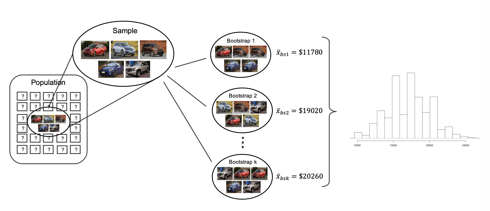
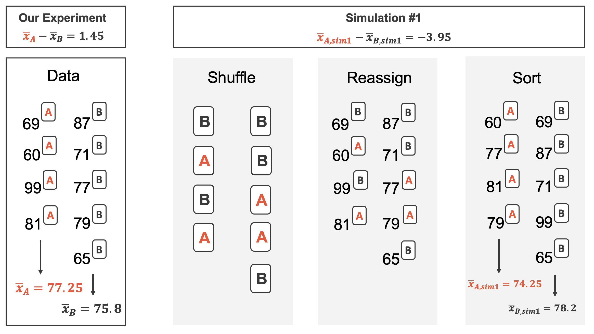
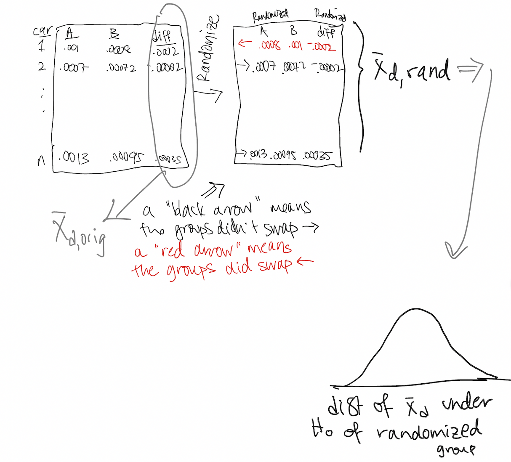

# Inference for numerical responses {#inference-num}

::: {.chapterintro}
Focusing now on Statistical Inference for **numerical data**, again, we will revisit and expand upon the foundational aspects of hypothesis testing from Chapter \@ref(intro-stat-inference).

The important data structure for this chapter is a numeric response variable (that is, the outcome is quantitative).
The four data structures we detail are one numeric response variable, one numeric response variable which is a difference across a pair of observations, a numeric response variable broken down by a binary explanatory variable, and a numeric response variable broken down by an explanatory variable that has two or more levels.
When appropriate, each of the data structures will be analyzed using the three methods from Chapter \@ref(intro-stat-inference): randomization test, bootstrapping, and mathematical models.

As we build on the inferential ideas, we will visit new foundational concepts in statistical inference.
One key new idea rests in estimating how the sample mean (as opposed to the sample proportion) varies from sample to sample; the resulting value is referred to as the standard error of the mean.
We will also introduce a new important mathematical model, the $t$-distribution (as the foundation for the $t$-test).
:::

```{r summary3methodsChp7}
method_summary_table <- tribble(
  ~variable, ~col1, ~col2, ~col3,
  "What does it do?", "Shuffles the explanatory variable to mimic the natural variability  found in a randomized experiment.", "Resamples (with replacement) from the observed data to mimic the sampling variability found by collecting data from a population.", "Uses theory (primarily the Central Limit Theorem) to describe the hypothetical variability resulting from either repeated randomized experiments or random samples.",

  "What is the random process described?", "Randomized experiment.", "Random sampling from a population.", "Randomized experiment or random sampling.",

  "What other random processes can be approximated?", "Can also be used to describe random sampling in an observational model", "Can also be used to describe random allocation in an experiment", "Randomized experiment or random sampling.",

  "What is it best for?", "Hypothesis Testing (can be used for Confidence Intervals, but not covered in this text).", "Primarily Confidence Intervals (also Bootstrap HT for one proportion).", "Quick analyses through, for example, calculating a Z score.",

  "What physical object represents the simulation process?", "Shuffling cards", "Pulling marbles from a bag", "Not applicable",

  "What are the technical conditions?", "Independence", "Independence, large n", "Independence, large n"
)
```

```{r include=FALSE}
terms_chp_7 <- c("numerical data")
```

In this chapter, we focus on the sample mean (instead of, for example, the sample median or the range of the observations) because of the well-studied mathematical model which describes the behavior of the sample mean.
We will not cover mathematical models which describe other statistics, but the bootstrap and randomization techniques described below are immediately extendable to any function of the observed data.
The sample mean will be calculated in one group, two paired groups, two independent groups, and many groups settings.
The techniques described for each setting will vary slightly, but you will be well served to find the structural similarities across the different settings.

## One mean {#one-mean}

Similar to how we can model the behavior of the sample proportion $\hat{p}$ using a normal distribution, the sample mean $\bar{x}$ can also be modeled using a normal distribution when certain conditions are met.
\index{point estimate!single mean} However, we'll soon learn that a new distribution, called the $t$-distribution, tends to be more useful when working with the sample mean.
We'll first learn about this new distribution, then we'll use it to construct confidence intervals and conduct hypothesis tests for the mean.

### Bootstrap confidence interval for $\mu$ {#boot1mean}

Consider a situation where you want to know whether you should buy a franchise of the used car store Awesome Autos.
As part of your planning, you'd like to know for how much an average car from Awesome Autos sells.
In order to go through the example more clearly, let's say that you are only able to randomly sample five cars from Awesome Auto.
(If this were a real example, you would surely be able to take a much larger sample size, possibly even being able to measure the entire population!)

#### Observed data {.unnumbered}

Figure \@ref(fig:5cars) shows a (small) random sample of observations from Awesome Auto.
The actual cars as well as their selling price is shown.

```{r 5cars, fig.cap = "A sample of five cars from Awesome Auto.", warning = FALSE,  out.width="75%"}
include_graphics("07/figures/5cars.png")
```

```{r}
aa_cars <- data.frame(price = c(18300, 20100, 9600, 10700, 27000))

#aa_cars %>% summarize(mean(price), sd(price), n())
```

The sample average car price of \$`r formatC(mean(aa_cars$price), format = "f", digits = 2)` is a first guess at the price of the average car price at Awesome Auto.
However, as a student of statistics, you understand that one sample mean based on a sample of five observations will not necessarily equal the true population average car price for all the cars at Awesome Auto.
Indeed, you can see that the observed car prices vary with a standard deviation of \$`r sd(aa_cars$price)`, and surely the average car price would be different if a different sample of size five had been taken from the population.
Fortunately, as it did in previous chapters for the sample proportion, bootstrapping will approximate the variability of the sample mean from sample to sample.

#### Variability of the statistic {.unnumbered}

As with the inferential ideas covered in Chapter \@ref(intro-stat-inference), the inferential analysis methods in this chapter are grounded in quantifying how one dataset differs from another when they are both taken from the same population.
To repeat, the idea is that we want to know how datasets differ from one another, but we aren't ever going to take more than one sample of observations.
It doesn't make sense to take repeated samples from the same population because if you have the ability to take more samples, a larger sample size will benefit you more than the exact same sample twice.
Instead of taking repeated samples from the actual population, we use bootstrapping to measure how the samples behave under an estimate of the population.

As mentioned previously, to get a sense of the cars at Awesome Auto, you take a sample of 5 cars from the Awesome Auto branch near you as a way to gauge the price of the cars being sold.
Figure \@ref(fig:bootpop1mean) shows how the unknown original population can be estimated by using the sample to approximate the distribution of car prices from the population of cars at Awesome Auto.

```{r bootpop1mean, fig.cap = "As seen previously, the idea behind bootstrapping is to consider the sample at hand as an estimate of the population.  Sampling from the sample (of 5 cars) is identical to sampling from an infinite population which is made up of only the cars in the original sample.", warning = FALSE,  out.width="75%"}
include_graphics("07/figures/bootpop1mean.png")
```

By taking repeated samples from the estimated population, the variability from sample to sample can be observed.
In Figure \@ref(fig:boot2) the repeated bootstrap samples are seen to be different both from each other and from the original population.
Recall that the bootstrap samples were taken from the same (estimated) population, and so the differences in bootstrap samples are due entirely to natural variability in the sampling procedure.
For the situation at hand where the sample mean is the statistic of interest, the variability from sample to sample can be seen in Figure \@ref(fig:bootsamps1mean).

```{r bootsamps1mean, fig.cap = "To estimate the natural variability in the sample mean, different bootstrap samples are taken from the original sample.  Notice that each bootstrap resample is different from each other as well as from the original sample", warning = FALSE,  out.width="75%"}
include_graphics("07/figures/bootsamps1mean.png")
```

By summarizing each of the bootstrap samples (here, using the sample mean), we see, directly, the variability of the sample mean, $\bar{x},$ from sample to sample.
The distribution of $\hat{x}_{bs}$ for the Awesome Auto cars is shown in Figure \@ref(fig:bootmeans1mean).

```{r bootmeans1mean, fig.cap = "Because each of the bootstrap resamples respresents a different set of cars, the mean of the each bootstrap resample will be a different value.  Each of the bootstrapped means is calculated, and a histogram of the values describes the inherent natural variability of the sample mean which is due to the sampling process.", warning = FALSE,  out.width="75%"}

```

Figure \@ref(fig:carsbsmean) summarizes one thousand bootstrap samples in a histogram of the bootstrap sample means.
The bootstrapped average car prices vary from about \$10,000 to \$25,000.
The bootstrap percentile confidence interval is found by locating the middle 90% (for a 90% confidence interval) or a 95% (for a 95% confidence interval) of the bootstrapped statistics.

::: {.workedexample}
Using Figure \@ref(fig:carsbsmean), find the 90% and 95% bootstrap percentile confidence intervals for the true average price of a car from Awesome Auto.

------------------------------------------------------------------------

A 90% confidence interval is given by \$12,140 and \$22,007.
The conclusion is that we are 90% confident that the true average car price at Awesome Auto lies somewhere between \$12,140 and \$22,007.

A 95% confidence interval is given by \$11,778 to \$22,500.
The conclusion is that we are 90% confident that the true average car price at Awesome Auto lies somewhere between \$11,778 to \$22,500.
:::

```{r carsbsmean, fig.cap="The original Awesome Auto data is bootstrapped 1,000 times. The histogram provides a sense for the variability of the average car price from sample to sample.", warning=FALSE, fig.width=15}

set.seed(47)
bscars <- aa_cars %>%
  rep_sample_n(size = 5, reps = 1000, replace = TRUE) 

bscars_mean <- bscars %>%
  group_by(replicate) %>% 
  summarize(car_bsmean = mean(price)) %>%
  pull()

#sd(bscars_mean)

bsq1 <- quantile(bscars_mean, probs = c(0.005, 0.025, 0.05, 0.1, 0.9, 0.95, 0.975, 0.995))

bsmeans_up <- bscars_mean[bscars_mean >= bsq1[7]]
bsmeans_low <- bscars_mean[bscars_mean <= bsq1[2]]

umeans <- sort(unique(bscars_mean))
bin.width <- (umeans[length(umeans)] - umeans[1])/15
#breaks <- c(uprops - bin.width / 4, uprops + bin.width / 4)
breaks <- seq(umeans[1] - 1, umeans[length(umeans)] + bin.width, by = bin.width)
  

histPlot(bscars_mean, breaks = breaks, axes = FALSE, col = rgb(1,1,1),
     xlab = "", ylab="")
#histPlot(bsmeans_up, breaks = breaks, col = COL[1], add = TRUE)
#histPlot(bsmeans_low, breaks = breaks, col = COL[1], add = TRUE)
axis(1)
#axis(2, at = seq(0, 100, 50), labels = format(seq(0, 50, 25) / nsim))
lines(c(bsq1[6], bsq1[6]), c(0, 85), lty = 3, lwd = 3)
lines(c(bsq1[3], bsq1[3]), c(0, 85), lty = 3, lwd = 3)
lines(c(bsq1[7], bsq1[7]), c(0, 65), lty = 3, lwd = 3)
lines(c(bsq1[2], bsq1[2]), c(0, 65), lty = 3, lwd = 3)
lines(c(bsq1[8], bsq1[8]), c(0, 45), lty = 3, lwd = 3)
lines(c(bsq1[1], bsq1[1]), c(0, 45), lty = 3, lwd = 3)
text(bsq1[6], 100, "95 percentile", pos = 3)
text(bsq1[3], 100, "5 percentile", pos = 3)
text(bsq1[7], 80, "97.5 percentile", pos = 3)
text(bsq1[2], 80, "2.5 percentile", pos = 3)
text(bsq1[8], 60, "99.5 percentile", pos = 3)
text(bsq1[1], 60, "0.5 percentile", pos = 3)
text(bsq1[6], 90, round(bsq1[6],1), pos = 3)
text(bsq1[3], 90, round(bsq1[3],1), pos = 3)
text(bsq1[7], 70, round(bsq1[7],1), pos = 3)
text(bsq1[2], 70, round(bsq1[2],1), pos = 3)
text(bsq1[8], 50, round(bsq1[8],1), pos = 3)
text(bsq1[1], 50, round(bsq1[1],1), pos = 3)
par(las = 0)
mtext("Bootstrapped values of the mean of the car price from Awesome Auto.", 1, 2.5)

```

#### Bootstrap SE confidence interval {.unnumbered}

As seen in Section \@ref(two-prop-boot-ci), another method for creating bootstrap confidence intervals directly uses a calculation of the variability of the bootstrap statistics (here, the bootstrap means).
If the bootstrap distribution is relatively symmetric and bell-shaped, then the 95% bootstrap SE confidence interval can be constructed with the formula familiar from the mathematical models in previous chapters:

$$\mbox{point estimate} \pm 2 \cdot SE_{BS}$$ The number 2 is an approximation connected to the "95%" part of the confidence interval (remember the 68-95-99.7 rule).
As will be seen in Section \@ref(one-mean-math), a new distribution (the $t$-distribution) will be applied to most mathematical inference on numerical variables.
However, because bootstrapping is not grounded in the same theory as the mathematical approach given in this text, we stick with the standard normal quantiles (in R use the function `qt()` to find percentiles other than 95%) for different confidence percentages.[^inference-num-1]

[^inference-num-1]: There is a large literature on understanding and improving bootstrap intervals, see Hesterberg 2015 ["What Teachers Should Know About the Bootstrap"](https://www.tandfonline.com/doi/full/10.1080/00031305.2015.1089789) and Hayden 2019 ["Questionable Claims for Simple Versions of the Bootstrap"](https://www.tandfonline.com/doi/full/10.1080/10691898.2019.1669507) for more information.

::: {.workedexample}
Explain how the standard error (SE) of the bootstrapped means is calculated and what it is measuring.

------------------------------------------------------------------------

The SE of the bootstrapped means measures how variable the means are from resample to resample.
The bootstrap SE is a good approximation to the SE of means as if we had taken repeated samples from the original population (which we agreed isn't something we would do because of wasted resources).

Logistically, we can find the standard deviation of the bootstrapped means using the same calculations from Chapter \@ref(summarizing-visualizing-data).
That is, the bootstrapped means are the individual observations about which we measure the variability.
:::

Although we won't spend a lot of energy on this concept, you may be wondering some of the differences between a standard error and a standard deviation.
The **standard error**\index{standard error} describes how a statistic (e.g., sample mean or sample proportion) varies from sample to sample.
The **standard deviation**\index{standard deviation} can be thought of as a function applied to any list of numbers which measures how far those numbers vary from their own average.
So, you can have a standard deviation calculated on a column of dog heights or a standard deviation calculated on a column of bootstrapped means from the resampled data.
Note that the standard deviation calculated on the bootstrapped means is referred to as the bootstrap standard error of the mean.

```{r include=FALSE}
terms_chp_7 <- c(terms_chp_7, "standard error", "standard deviation")
```

::: {.guidedpractice}
It turns out that the standard deviation of the bootstrapped means from Figure \@ref(fig:carsbsmean) is \$2,891.87 (a value which is an excellent approximation for the standard error of sample means if we were to take repeated samples from the population).
[Note: in R the calculation was done using the function `sd()`.] The average of the observed prices is \$17,140, ad we will consider the sample average to be the best guess point estimate for $\mu.$ .

Find and interpret the confidence interval for $\mu$ (the true average cost of a car at Awesome Auto) using the bootstrap SE confidence interval formula.[^inference-num-2]
:::

[^inference-num-2]: Using the formula for the bootstrap SE interval, we find the 95% confidence interval for $\mu$ is: $17,140 \pm 2 \cdot 2,891.87 \rightarrow$ (\$11,356.26, \$22,923.74).
    We are 95% confident that the true average car price at Awesome Auto is somewhere between \$11,356.26 and \$22,923.74.

::: {.workedexample}
Compare and contrast the two different 95% confidence intervals for $\mu$ created by finding the percentiles of the bootstrapped means and created by finding the SE of the bootstrapped means.
Do you think the intervals *should* be identical?

------------------------------------------------------------------------

-   Percentile interval: (\$11,778, \$22,500)
-   SE interval: (\$11,356.26, \$22,923.74)

The intervals were created using different methods, so it is not surprising that they are not identical.
However, we are pleased to see that the two methods provide very similar interval approximations.

The technical details surrounding which data structures are best for percentile intervals and which are best for SE intervals is beyond the scope of this text.
However, the larger the samples are, the better (and closer) the interval estimates will be.
:::

#### Bootstrap percentile confidence interval for $\sigma$ {.unnumbered}

Suppose that the research question at hand seeks to understand how variable the prices of the cars are at Awesome Auto.
That is, your interest is no longer in the average car price but in the *standard deviation* of the prices of all cars at Awesome Auto, $\sigma.$ You may have already realized that the sample standard deviation, $s,$ will work as a good **point estimate** for the parameter of interest: the population standard deviation, $\sigma.$ The point estimate of the five observations is calculated to be $s = \$7,170.286.$ While $s = \$7,170.286$ might be a good guess for $\sigma,$ we prefer to have an interval estimate for the parameter of interest.
Although there is a mathematical model which describes how $s$ varies from sample to sample, the mathematical model will not be presented in this text.
Even without the mathematical model, bootstrapping can be used to find a confidence interval for the parameter $\sigma.$ Using the same technique as presented for a confidence interval for $\mu,$ here we find the bootstrap percentile confidence interval for $\sigma.$

```{r include=FALSE}
terms_chp_7 <- c(terms_chp_7, "point estimate")
```

::: {.workedexample}
Describe the bootstrap distribution for the standard deviation shown in Figure \@ref(fig:carsbssd).

------------------------------------------------------------------------

The distribution is skewed left and centered near \$7,170.286, which is the point estimate from the original data.
Most observations in this distribution lie between \$0 and \$10,000.
:::

::: {.guidedpractice}
Using Figure \@ref(fig:carsbssd), find *and interpret* a 90% confidence interval for the population standard deviation for car prices at Awesome Auto.[^inference-num-3]
:::

[^inference-num-3]: By looking at the percentile values in Figure \@ref(fig:carsbssd), the middle 90% of the bootstrap standard deviations are given by the 5 percentile (\$3,602.5) and 95 percentile (\$8,737.2).
    That is, we are 90% confident that the true standard deviation of car prices is between \$3,602.5 and \$8,737.2.\
    Note, the problem was set up as 90% to indicate that there was not a need for a high level of confidence (such a 95% or 99%).
    A lower degree of confidence increases potential for error, but it also produces a more narrow interval.

```{r carsbssd, fig.cap="The original Awesome Auto data is bootstrapped 1,000 times. The histogram provides a sense for the variability of the standard deviation of the car prices from sample to sample.", warning=FALSE, fig.width=15}

bscars_sd <- bscars %>%
  group_by(replicate) %>% 
  summarize( car_bssd = sd(price)) %>%
  pull()

bsq1 <- quantile(bscars_sd, probs = c(0.005, 0.025, 0.05, 0.1, 0.9, 0.95, 0.975, 0.995))

bsmeans_up <- bscars_sd[bscars_sd >= bsq1[7]]
bsmeans_low <- bscars_sd[bscars_sd <= bsq1[2]]

umeans <- sort(unique(bscars_sd))
bin.width <- (umeans[length(umeans)] - umeans[1])/15
#breaks <- c(uprops - bin.width / 4, uprops + bin.width / 4)
breaks <- seq(umeans[1] - 1, umeans[length(umeans)] + bin.width, by = bin.width)
  

histPlot(bscars_sd, breaks = breaks, axes = FALSE, col = rgb(1,1,1),
     xlab = "", ylab="")
#histPlot(bsmeans_up, breaks = breaks, col = COL[1], add = TRUE)
#histPlot(bsmeans_low, breaks = breaks, col = COL[1], add = TRUE)
axis(1)
#axis(2, at = seq(0, 100, 50), labels = format(seq(0, 50, 25) / nsim))
lines(c(bsq1[6], bsq1[6]), c(0, 125), lty = 3, lwd = 3)
lines(c(bsq1[3], bsq1[3]), c(0, 125), lty = 3, lwd = 3)
lines(c(bsq1[7], bsq1[7]), c(0, 55), lty = 3, lwd = 3)
lines(c(bsq1[2], bsq1[2]), c(0, 65), lty = 3, lwd = 3)
lines(c(bsq1[8], bsq1[8]), c(0, 55), lty = 3, lwd = 3)
lines(c(bsq1[1], bsq1[1]), c(0, 55), lty = 3, lwd = 3)
text(bsq1[6], 140, "95 percentile", pos = 3)
text(bsq1[3], 140, "5 percentile", pos = 3)
text(bsq1[7], 90, "97.5 percentile", pos = 3)
text(bsq1[2], 90, "2.5 percentile", pos = 3)
text(bsq1[8], 70, "99.5 percentile", pos = 3)
text(bsq1[1], 70, "0.5 percentile", pos = 3)
text(bsq1[6], 130, round(bsq1[6],1), pos = 3)
text(bsq1[3], 130, round(bsq1[3],1), pos = 3)
text(bsq1[7], 80, round(bsq1[7],1), pos = 3)
text(bsq1[2], 80, round(bsq1[2],1), pos = 3)
text(bsq1[8], 60, round(bsq1[8],1), pos = 3)
text(bsq1[1], 60, round(bsq1[1],1), pos = 3)
par(las = 0)
mtext("Bootstrapped values of the standard deviation of the car prices.", 1, 2.5)

```

#### Bootstrapping is not a solution to small sample sizes! {.unnumbered}

The example presented above is done for a sample with only five observations.
As with analysis techniques that build on mathematical models, bootstrapping works best when a large random sample has been taken from the population.
Bootstrapping is a method for capturing the variability of a statistic when the mathematical model is unknown (it is not a method for navigating small samples).
As you might guess, the larger the random sample, the more accurately that sample will represent the population of interest.

### Mathematical model {#one-mean-math}

As with the sample proportion, the variability of the sample mean is well described by the mathematical theory given by the Central Limit Theorem.
However, because of missing information about the inherent variability in the population, a $t$-distribution is used in place of the standard normal when performing hypothesis test or confidence interval analyses.

#### A mathematical distribution of $\bar{x}$ {.unnumbered}

The sample mean tends to follow a normal distribution centered at the population mean, $\mu,$ when certain conditions are met.
Additionally, we can compute a standard error for the sample mean using the population standard deviation $\sigma$ and the sample size $n.$

::: {.important}
**Central Limit Theorem for the sample mean**

When we collect a sufficiently large sample of $n$ independent observations from a population with mean $\mu$ and standard deviation $\sigma,$ the sampling distribution of $\bar{x}$ will be nearly normal with

$$\text{Mean} = \mu \ \ \ \ \ \ \text{Standard Error }(SE) = \frac{\sigma}{\sqrt{n}}$$
:::

Before diving into confidence intervals and hypothesis tests using $\bar{x},$ we first need to cover two topics:

-   When we modeled $\hat{p}$ using the normal distribution, certain conditions had to be satisfied. The conditions for working with $\bar{x}$ are a little more complex, and below, we will discuss how to check conditions for inference using a mathematical model.
-   The standard error is dependent on the population standard deviation, $\sigma.$ However, we rarely know $\sigma,$ and instead we must estimate it. Because this estimation is itself imperfect, we use a new distribution called the $t$-distribution to fix this problem, which we discuss below.

\index{t-distribution@$t$-distribution}

```{r include=FALSE}
terms_chp_7 <- c(terms_chp_7, "t-distribution")
```

#### Evaluating the two conditions required for modeling $\bar{x}$ {.unnumbered}

Two conditions are required to apply the Central Limit Theorem\index{Central Limit Theorem} for a sample mean $\bar{x}:$

-   **Independence.** The sample observations must be independent, The most common way to satisfy this condition is when the sample is a simple random sample from the population.
    If the data come from a random process, analogous to rolling a die, this would also satisfy the independence condition.

-   **Normality.** When a sample is small, we also require that the sample observations come from a normally distributed population.
    We can relax this condition more and more for larger and larger sample sizes.
    This condition is obviously vague, making it difficult to evaluate, so next we introduce a couple rules of thumb to make checking this condition easier.

```{r include=FALSE}
terms_chp_7 <- c(terms_chp_7, "Central Limit Theorem")
```

::: {.important}
**General rule: how to perform the normality check**

There is no perfect way to check the normality condition, so instead we use two general rules based on the number and magnitude of extreme observations.
Note, it often takes practice to get a sense for whether or not a normal approximation is appropriate.

-   $\mathbf{n < 30}:$ If the sample size $n$ is less than 30 and there are **no clear outliers** in the data, then we typically assume the data come from a nearly normal distribution to satisfy the condition.\
-   $\mathbf{n \geq 30}:$ If the sample size $n$ is at least 30 and there are no **particularly extreme** outliers, then we typically assume the sampling distribution of $\bar{x}$ is nearly normal, even if the underlying distribution of individual observations is not.
:::

In this first course in statistics, you aren't expected to develop perfect judgment on the normality condition.
However, you are expected to be able to handle clear cut cases based on the rules of thumb.[^inference-num-4]

[^inference-num-4]: More nuanced guidelines would consider further relaxing the *particularly extreme outlier* check when the sample size is very large.
    However, we'll leave further discussion here to a future course.

::: {.workedexample}
Consider the following two plots that come from simple random samples from different populations.
Their sample sizes are $n_1 = 15$ and $n_2 = 50.$

Are the independence and normality conditions met in each case?

------------------------------------------------------------------------

Each samples is from a simple random sample of its respective population, so the independence condition is satisfied.
Let's next check the normality condition for each using the rule of thumb.

The first sample has fewer than 30 observations, so we are watching for any clear outliers.
None are present; while there is a small gap in the histogram on the right, this gap is small and 20% of the observations in this small sample are represented in that far right bar of the histogram, so we can hardly call these clear outliers.
With no clear outliers, the normality condition is reasonably met.

The second sample has a sample size greater than 30 and includes an outlier that appears to be roughly 5 times further from the center of the distribution than the next furthest observation.
This is an example of a particularly extreme outlier, so the normality condition would not be satisfied.
:::

```{r outliersandsscondition, fig.cap="", warning=FALSE, fig.width=10}

d1 <- rnorm(15, 3, 2)
d2 <- c(exp(rnorm(49, 0, 0.7)), 22)

histPlot(d1, axes = FALSE, # breaks = 20,
         xlab = "Sample 1 Observations (n = 15)",
         ylab = "",
         col = COL[1])
axis(1, at = seq(-10, 10, 2))
axis(2)
par(las = 0)
mtext("Frequency", 2, 1.8)

par(las = 1, mar = c(3, 4, 0.5, 0.5))
histPlot(d2, axes = FALSE, breaks = 20,
         xlab = "Sample 2 Observations (n = 50)",
         ylab = "",
         col = COL[1])
axis(1, at = seq(-10, 30, 10))
axis(2)
par(las = 0)
mtext("Frequency", 2, 2)
```

In practice, it's typical to also do a mental check to evaluate whether we have reason to believe the underlying population would have moderate skew (if $n < 30)$ or have particularly extreme outliers $(n \geq 30)$ beyond what we observe in the data.
For example, consider the number of followers for each individual account on Twitter, and then imagine this distribution.
The large majority of accounts have built up a couple thousand followers or fewer, while a relatively tiny fraction have amassed tens of millions of followers, meaning the distribution is extremely skewed.
When we know the data come from such an extremely skewed distribution, it takes some effort to understand what sample size is large enough for the normality condition to be satisfied.

\index{Central Limit Theorem!normal data|)}

#### Introducing the $t$-distribution {.unnumbered}

\index{t-distribution@$t$-distribution|(} \index{distribution!t@$t$|(}

In practice, we cannot directly calculate the standard error for $\bar{x}$ since we do not know the population standard deviation, $\sigma.$ We encountered a similar issue when computing the standard error for a sample proportion, which relied on the population proportion, $p.$ Our solution in the proportion context was to use sample value in place of the population value when computing the standard error.
We'll employ a similar strategy for computing the standard error of $\bar{x},$ using the sample standard deviation $s$ in place of $\sigma:$

$$
SE = \frac{\sigma}{\sqrt{n}} \approx \frac{s}{\sqrt{n}}
$$

This strategy tends to work well when we have a lot of data and can estimate $\sigma$ using $s$ accurately.
However, the estimate is less precise with smaller samples, and this leads to problems when using the normal distribution to model $\bar{x}.$

We'll find it useful to use a new distribution for inference calculations called the $t$-distribution.
A $t$-distribution, shown as a solid line in Figure \@ref(fig:tDistCompareToNormalDist), has a bell shape.
However, its tails are thicker than the normal distribution's, meaning observations are more likely to fall beyond two standard deviations from the mean than under the normal distribution.

The extra thick tails of the $t$-distribution are exactly the correction needed to resolve the problem (due to extra variability of the T score) of using $s$ in place of $\sigma$ in the $SE$ calculation.

```{r tDistCompareToNormalDist, fig.cap="Comparison of a $t$-distribution and a normal distribution.", warning=FALSE, fig.width=10}

plot(c(-5, 5),
     c(0, dnorm(0)),
     type = 'n',
     axes = FALSE)
axis(1, seq(-6, 6, 2))
abline(h = 0)

xleg <- 2
yleg <- 0.35
yleg.line.offset <- -0.07
line.leg.width <- 0.55
lines(
    c(xleg, xleg + line.leg.width),
    rep(yleg, 2),
    col = COL[1], lty = 3, lwd = 1.8)
lines(
    c(xleg, xleg + line.leg.width),
    rep(yleg + yleg.line.offset, 2),
    col = COL[4], lty = 1, lwd = 2.5)
text(xleg + line.leg.width, yleg,
    "Normal",
    col = COL[1], pos = 4)
text(xleg + line.leg.width, yleg + yleg.line.offset,
    "t-distribution",
    col = COL[4], pos = 4)

X <- seq(-6, 6, 0.01)
Y <- dnorm(X)
lines(X, Y, lty=3, lwd = 1.8, col = COL[1])

Y <- dt(X, 2)
lines(X, Y, lty = 1, lwd = 2.5, col = COL[4])

```

The $t$-distribution is always centered at zero and has a single parameter: degrees of freedom.
The **degrees of freedom** describes the precise form of the bell-shaped $t$-distribution.
Several $t$-distributions are shown in Figure \@ref(fig:tDistConvergeToNormalDist) in comparison to the normal distribution.

\termsub{degrees of freedom $(\pmb{df})$}{degrees of freedom $(df)$!$t$-distribution}

In general, we'll use a $t$-distribution with $df = n - 1$ to model the sample mean when the sample size is $n.$ That is, when we have more observations, the degrees of freedom will be larger and the $t$-distribution will look more like the standard normal distribution; when the degrees of freedom is about 30 or more, the $t$-distribution is nearly indistinguishable from the normal distribution.

```{r include=FALSE}
terms_chp_7 <- c(terms_chp_7, "degrees of freedom")
```

```{r tDistConvergeToNormalDist, fig.cap="The larger the degrees of freedom, the more closely the $t$-distribution resembles the standard normal distribution.", warning=FALSE, fig.width=10}

plot(c(-5, 5),
     c(0, dnorm(0)),
     type = 'n', ylab = "", xlab = "",
     axes = FALSE)
at <- seq(-10, 10, 2)
axis(1, at)
axis(1, at - 1, rep("", length(at)), tcl = -0.1)
abline(h = 0)

COL. <- fadeColor(COL[1], c("FF", "89", "68", "4C", "33"))
COLt <- fadeColor(COL[1], c("FF", "AA", "85", "60", "45"))
DF   <- c('normal', 8, 4, 2, 1)

X <- seq(-10, 10, 0.02)
Y <- dnorm(X)
lines(X, Y, col = COL.[1])

for (i in 2:5) {
  Y <- dt(X, as.numeric(DF[i]))
  lines(X, Y, col = COL.[i], lwd = 1.5)
}

legend(2.5, 0.4,
       legend = c(DF[1],
       paste('t, df = ', DF[2:5], sep = '')),
       col = COL.,
       text.col = COLt,
       lty = rep(1, 5),
       lwd = 1.5)
```

::: {.important}
**Degrees of freedom: df**

The degrees of freedom describes the shape of the $t$-distribution.
The larger the degrees of freedom, the more closely the distribution approximates the normal model.

When modeling $\bar{x}$ using the $t$-distribution, use $df = n - 1.$
:::

The $t$-distribution allows us greater flexibility than the normal distribution when analyzing numerical data.
In practice, it's common to use statistical software, such as R, Python, or SAS for these analyses.
In R, the function used for calculating probabilities under a $t$-distribution is `pt()` (which should seem similar to previous R functions, `pnorm()` and `pchisq()`).
Don't forget that with the $t$-distribution, the degrees of freedom must always be specified!

For the examples and guided practices below, you may have to use a table or statistical software to find the answers.
We recommend trying the problems so as to get a sense for how the $t$-distribution can vary in width depending on the degrees of freedom.
No matter the approach you choose, apply your method using the examples below to confirm your working understanding of the $t$-distribution.

::: {.workedexample}
What proportion of the $t$-distribution with 18 degrees of freedom falls below -2.10?

------------------------------------------------------------------------

Just like a normal probability problem, we first draw the picture in Figure \@ref(fig:tDistDF18LeftTail2Point10) and shade the area below -2.10.

Using statistical software, we can obtain a precise value: 0.0250.
:::

```{r echo = TRUE}
# using pt() to find probability under the $t$-distribution
pt(-2.10, df = 18)
```

```{r tDistDF18LeftTail2Point10, fig.cap="The $t$-distribution with 18 degrees of freedom. The area below -2.10 has been shaded.", warning=FALSE, fig.width=10}

normTail(L = -2.10,
         df = 10,
         xlim = c(-4, 4),
         col = COL[1],
         axes = FALSE)
axis(1)
```

::: {.workedexample}
A $t$-distribution with 20 degrees of freedom is shown in the top panel of Figure \@ref(fig:tDistDF20RightTail1Point65).
Estimate the proportion of the distribution falling above 1.65.

------------------------------------------------------------------------

Note that with 20 degrees of freedom, the $t$-distribution is relatively close to the normal distribution.
With a normal distribution, this would correspond to about 0.05, so we should expect the $t$-distribution to give us a value in this neighborhood.
Using statistical software: 0.0573.
:::

```{r tDistDF20RightTail1Point65, fig.cap="Top: The $t$-distribution with 20 degrees of freedom, with the area above 1.65 shaded. Bottom: The $t$-distribution with 2 degrees of freedom, with the area further than 3 units from 0 shaded.", warning=FALSE, fig.width=10}

normTail(U = 1.65,
         df = 12,
         xlim = c(-4, 4),
         col = COL[1],
         axes = FALSE)
axis(1)
normTail(L = -3,
         U = 3,
         df = 2.3,
         xlim = c(-4.5, 4.5),
         col = COL[1],
         axes = FALSE)
axis(1)
```

::: {.workedexample}
A $t$-distribution with 2 degrees of freedom is shown in the bottom panel of Figure \@ref(fig:tDistDF20RightTail1Point65).
Estimate the proportion of the distribution falling more than 3 units from the mean (above or below).

------------------------------------------------------------------------

With so few degrees of freedom, the $t$-distribution will give a more notably different value than the normal distribution.
Under a normal distribution, the area would be about 0.003 using the 68-95-99.7 rule.
For a $t$-distribution with $df = 2,$ the area in both tails beyond 3 units totals 0.0955.
This area is dramatically different than what we obtain from the normal distribution.
:::

::: {.guidedpractice}
What proportion of the $t$-distribution with 19 degrees of freedom falls above -1.79 units?
Use your preferred method for finding tail areas.[^inference-num-5]
:::

[^inference-num-5]: We want to find the shaded area *above* -1.79 (we leave the picture to you).
    The lower tail area has an area of 0.0447, so the upper area would have an area of $1 - 0.0447 = 0.9553.$

\index{distribution!t@$t$|)} \index{t-distribution@$t$-distribution|)}

#### One sample $t$-confidence intervals {.unnumbered}

\index{data!dolphins and mercury|(}

Let's get our first taste of applying the $t$-distribution in the context of an example about the mercury content of dolphin muscle.
Elevated mercury concentrations are an important problem for both dolphins and other animals, like humans, who occasionally eat them.

```{r rissosDolphin, fig.cap = "A Risso's dolphin. Photo by Mike Baird, www.bairdphotos.com", warning = FALSE,  out.width="75%"}
include_graphics("07/figures/rissosDolphin.jpg")
```

#### Observed data {.unnumbered}

We will identify a confidence interval for the average mercury content in dolphin muscle using a sample of 19 Risso's dolphins from the Taiji area in Japan.
The data are summarized in Table \@ref(tab:summaryStatsOfHgInMuscleOfRissosDolphins).
The minimum and maximum observed values can be used to evaluate whether or not there are clear outliers.

```{r summaryStatsOfHgInMuscleOfRissosDolphins}
temptbl <- tribble(
 ~col0,    ~col1, ~col2, ~col3, ~col4,
 19, 4.4, 2.3, 1.7, 9.2
)

temptbl %>%
 kable(caption = "Summary of mercury content in the muscle of 19 Risso's dolphins from the Taiji area. Measurements are in micrograms of mercury per wet gram
    of muscle $(\\mu$g/wet g).",
    col.names = c( "$n$", "$\\bar{x}$", "s", "minimum", "maximum")) %>%
 kable_styling() 
```

::: {.workedexample}
Are the independence and normality conditions satisfied for this data set?

------------------------------------------------------------------------

The observations are a simple random sample, therefore independence is reasonable.
The summary statistics in Table \@ref(tab:summaryStatsOfHgInMuscleOfRissosDolphins) do not suggest any clear outliers, with all observations are within 2.5 standard deviations of the mean.
Based on this evidence, the normality condition seems reasonable.
:::

In the normal model, we used $z^{\star}$ and the standard error to determine the width of a confidence interval.
We revise the confidence interval formula slightly when using the $t$-distribution:

$$
\begin{align*}
\text{point estimate} \ &\pm\  t^{\star}_{df} \times SE \\
\bar{x} \ &\pm\  t^{\star}_{df} \times \frac{s}{\sqrt{n}}
\end{align*}
$$

::: {.workedexample}
Using the summary statistics in Table \@ref(tab:summaryStatsOfHgInMuscleOfRissosDolphins), compute the standard error for the average mercury content in the $n = 19$ dolphins.

------------------------------------------------------------------------

We plug in $s$ and $n$ into the formula: $SE = s / \sqrt{n} = 2.3 / \sqrt{19} = 0.528.$
:::

The value $t^{\star}_{df}$ is a cutoff we obtain based on the confidence level and the $t$-distribution with $df$ degrees of freedom.
That cutoff is found in the same way as with a normal distribution: we find $t^{\star}_{df}$ such that the fraction of the $t$-distribution with $df$ degrees of freedom within a distance $t^{\star}_{df}$ of 0 matches the confidence level of interest.

::: {.workedexample}
When $n = 19,$ what is the appropriate degrees of freedom?
Find $t^{\star}_{df}$ for this degrees of freedom and the confidence level of 95%

------------------------------------------------------------------------

The degrees of freedom is easy to calculate: $df = n - 1 = 18.$

Using statistical software, we find the cutoff where the upper tail is equal to 2.5%: $t^{\star}_{18} = 2.10.$ The area below -2.10 will also be equal to 2.5%.
That is, 95% of the $t$-distribution with $df = 18$ lies within 2.10 units of 0.
:::

```{r echo = TRUE}
# use qt() to find the t-cutoff (with 95% in the middle)
qt(0.025, df = 18)
qt(0.975, df = 18)
```

::: {.important}
**Degrees of freedom for a single sample.**

If the sample has $n$ observations and we are examining a single mean, then we use the $t$-distribution with $df=n-1$ degrees of freedom.
:::

::: {.workedexample}
Compute and interpret the 95% confidence interval for the average mercury content in Risso's dolphins.

------------------------------------------------------------------------

We can construct the confidence interval as

$$
\begin{align*}
\bar{x} \ &\pm\  t^{\star}_{18} \times SE \\
4.4 \ &\pm\  2.10 \times 0.528 \\
(3.29 \  &, \ 5.51)
\end{align*} 
$$

We are 95% confident the average mercury content of muscles in Risso's dolphins is between 3.29 and 5.51 $\mu$g/wet gram, which is considered extremely high.
:::

\index{data!dolphins and mercury|)}

::: {.important}
**Finding a** $t$-confidence interval for the mean, $\mu.$

Based on a sample of $n$ independent and nearly normal observations, a confidence interval for the population mean is

$$
\begin{align*}
\text{point estimate} \ &\pm\  t^{\star}_{df} \times SE \\
\bar{x} \ &\pm\  t^{\star}_{df} \times \frac{s}{\sqrt{n}}
\end{align*}
$$

where $\bar{x}$ is the sample mean, $t^{\star}_{df}$ corresponds to the confidence level and degrees of freedom $df,$ and $SE$ is the standard error as estimated by the sample.
:::

::: {.guidedpractice}
The FDA's webpage provides some data on mercury content of fish.
Based on a sample of 15 croaker white fish (Pacific), a sample mean and standard deviation were computed as 0.287 and 0.069 ppm (parts per million), respectively.
The 15 observations ranged from 0.18 to 0.41 ppm.
We will assume these observations are independent.
Based on the summary statistics of the data, do you have any objections to the normality condition of the individual observations?[^inference-num-6]
:::

[^inference-num-6]: The sample size is under 30, so we check for obvious outliers: since all observations are within 2 standard deviations of the mean, there are no such clear outliers.

\index{data!white fish and mercury|(}

::: {.workedexample}
Estimate the standard error of $\bar{x} = 0.287$ ppm using the data summaries in the previous Guided Practice.
If we are to use the $t$-distribution to create a 90% confidence interval for the actual mean of the mercury content, identify the degrees of freedom and $t^{\star}_{df}.$

------------------------------------------------------------------------

The standard error: $SE = \frac{0.069}{\sqrt{15}} = 0.0178.$

Degrees of freedom: $df = n - 1 = 14.$

Since the goal is a 90% confidence interval, we choose $t_{14}^{\star}$ so that the two-tail area is 0.1: $t^{\star}_{14} = 1.76.$
:::

```{r echo = TRUE}
# use qt() to find the t-cutoff (with 90% in the middle)
qt(0.05, df = 14)
qt(0.95, df = 14)
```

::: {.guidedpractice}
Using the information and results of the previous Guided Practice and Example, compute a 90% confidence interval for the average mercury content of croaker white fish (Pacific).[^inference-num-7]
:::

[^inference-num-7]: $\bar{x} \ \pm\ t^{\star}_{14} \times SE \ \to\  0.287 \ \pm\  1.76 \times 0.0178 \ \to\ (0.256, 0.318).$ We are 90% confident that the average mercury content of croaker white fish (Pacific) is between 0.256 and 0.318 ppm.

::: {.guidedpractice}
The 90% confidence interval from the previous Guided Practice is 0.256 ppm to 0.318 ppm.
Can we say that 90% of croaker white fish (Pacific) have mercury levels between 0.256 and 0.318 ppm?[^inference-num-8]
:::

[^inference-num-8]: No, a confidence interval only provides a range of plausible values for a population parameter, in this case the population mean.
    It does not describe what we might observe for individual observations.

\index{data!white fish and mercury|)}

#### One sample $t$-tests {.unnumbered}

Now that we've used the $t$-distribution for making a confidence intervals for a mean, let's speed on through to hypothesis tests for the mean.

::: {.important}
**The test statistic for assessing a single mean is a T.**

The T score is a ratio of how the sample mean differs from the hypothesized mean as compared to how the observations vary.

$$ T = \frac{\bar{x} - \mbox{null value}}{s/\sqrt{n}} $$

When the null hypothesis is true and the conditions are met, T has a t-distribution with $df = n - 1.$

Conditions:

-   independently observed data\
-   large samples and no extreme outliers\
:::

Is the typical US runner getting faster or slower over time?
We consider this question in the context of the Cherry Blossom Race, which is a 10-mile race in Washington, DC each spring.

The average time for all runners who finished the Cherry Blossom Race in 2006 was 93.29 minutes (93 minutes and about 17 seconds).
We want to determine using data from 100 participants in the 2017 Cherry Blossom Race whether runners in this race are getting faster or slower, versus the other possibility that there has been no change.

::: {.guidedpractice}
What are appropriate hypotheses for this context?[^inference-num-9]
:::

[^inference-num-9]: $H_0:$ The average 10-mile run time was the same for 2006 and 2017.
    $\mu = 93.29$ minutes.
    $H_A:$ The average 10-mile run time for 2017 was *different* than that of 2006.
    $\mu \neq 93.29$ minutes.

::: {.guidedpractice}
The data come from a simple random sample of all participants, so the observations are independent.

```{r}
set.seed(1)
run17 <- subset(run17, event == "10 Mile")
d <- run17[sample(nrow(run17), 100), ] %>%
  mutate(time = net_sec / 60)

histPlot(d$time,
         main = "",
         xlab = "Time (Minutes)",
         ylab = "Frequency",
         col = COL[1])
```

A histogram of the race times is given to evaluate if we can move forward with a t-test.
Should we be worried about the normality condition?[^inference-num-10]
:::

[^inference-num-10]: With a sample of 100, we should only be concerned if there is are particularly extreme outliers.
    The histogram of the data doesn't show any outliers of concern (and arguably, no outliers at all).

When completing a hypothesis test for the one-sample mean, the process is nearly identical to completing a hypothesis test for a single proportion.
First, we find the Z score using the observed value, null value, and standard error; however, we call it a **T score** since we use a $t$-distribution for calculating the tail area.
Then we finding the p-value using the same ideas we used previously: find the one-tail area under the sampling distribution, and double it.

```{r include=FALSE}
terms_chp_7 <- c(terms_chp_7, "T score")
```

::: {.workedexample}
With both the independence and normality conditions satisfied, we can proceed with a hypothesis test using the $t$-distribution.
The sample mean and sample standard deviation of the sample of 100 runners from the 2017 Cherry Blossom Race are 97.32 and 16.98 minutes, respectively.
Recall that the sample size is 100 and the average run time in 2006 was 93.29 minutes.
Find the test statistic and p-value.
What is your conclusion?

------------------------------------------------------------------------

To find the test statistic (T score), we first must determine the standard error:

$$  SE = 16.98 / \sqrt{100} = 1.70 $$

Now we can compute the **T score** using the sample mean (97.32), null value (98.29), and $SE:$

$$ T = \frac{97.32 - 93.29}{1.70} = 2.37 $$

For $df = 100 - 1 = 99,$ we can determine using statistical software (or a $t$-table, see below) that the one-tail area is 0.01, which we double to get the p-value: 0.02.

Because the p-value is smaller than 0.05, we reject the null hypothesis.
That is, the data provide strong evidence that the average run time for the Cherry Blossom Run in 2017 is different than the 2006 average.
Since the observed value is above the null value and we have rejected the null hypothesis, we would conclude that runners in the race were slower on average in 2017 than in 2006.
:::

```{r echo = TRUE}
# using pt() to find the p-value
1 - pt(2.37, df = 99)
```

::: {.important}
**When using a** $t$-distribution, we use a T score (similar to a Z score).

To help us remember to use the $t$-distribution, we use a $T$ to represent the test statistic, and we often call this a **T score**.
The Z score and T score are computed in the exact same way and are conceptually identical: each represents how many standard errors the observed value is from the null value.
:::

### Exercises {#one-mean-exercises}

::: {.underconstruction}
Exercises for this section will be available in the 1st edition of this book, which will be available in Summer 2021.
In the meantime, [OpenIntro::Introduction to Statistics with Randomization and Simulation](https://www.openintro.org/book/isrs/) and [OpenIntro::Statistics](https://www.openintro.org/book/os/), both of which are available for free, have many exercises you can use alongside this book.
:::

## Difference of two means {#differenceOfTwoMeans}

In this section we consider a difference in two population means, $\mu_1 - \mu_2,$ under the condition that the data are not paired.
Just as with a single sample, we identify conditions to ensure we can use the $t$-distribution with a point estimate of the difference, $\bar{x}_1 - \bar{x}_2,$ and a new standard error formula.

The details for working through inferential problems in the two independent means setting are strikingly similar to those applied to the two independent proportions stetting.
We first cover a randomization test where the observations are shuffled under the assumption that the null hypothesis is true.
Then we bootstrap the data (with no imposed null hypothesis) to create a confidence interval for the true difference in population means, $\mu_1 - \mu_2.$ The mathematical model, here the $t$-distribution, is able to describe both the randomization test and the boostrapping as long as the conditions are met.

The inferential tools are applied to three different data contexts: determining whether stem cells can improve heart function, exploring the relationship between pregnant women's smoking habits and birth weights of newborns, and exploring whether there is statistically significant evidence that one variation of an exam is harder than another variation.
This section is motivated by questions like "Is there convincing evidence that newborns from mothers who smoke have a different average birth weight than newborns from mothers who don't smoke?"

### Randomization test for $H_0: \mu_1 - \mu_2 = 0$ {#rand2mean}

\index{data!two exam comparison|(}

An instructor decided to run two slight variations of the same exam.
Prior to passing out the exams, she shuffled the exams together to ensure each student received a random version.
Summary statistics for how students performed on these two exams are shown in Table \@ref(tab:summaryStatsForTwoVersionsOfExams) and plotted in Figure \@ref(fig:boxplotTwoVersionsOfExams).
Anticipating complaints from students who took Version B, she would like to evaluate whether the difference observed in the groups is so large that it provides convincing evidence that Version B was more difficult (on average) than Version A.

##### Observed data {.unnumbered}

```{r echo = FALSE, include = FALSE}
data(classdata)

classdata %>% 
  filter(lecture %in% c("a", "b")) %>%
  group_by(lecture) %>%
  skimr::skim(m1)

classdata %>% 
  filter(lecture %in% c("a", "b")) %>%
  group_by(lecture) %>%
  summarise(n())
```

```{r summaryStatsForTwoVersionsOfExams}
temptbl <- tribble(
 ~variable, ~col0,    ~col1, ~col2, ~col3, ~col4,
 "A", 58, 75.1, 13.9, 44, 100,
 "B", 55, 72.0, 13.8, 38, 100
)

temptbl %>%
 kable(caption = "Summary statistics of scores for each exam version.",
    col.names = c("", "$n$", "$\\bar{x}$", "s", "minimum", "maximum")) %>%
 kable_styling() 
```

```{r boxplotTwoVersionsOfExams, fig.cap="Exam scores for students given one of three different exams.", warning=FALSE, fig.width=10}

classdata %>%
  filter(lecture %in% c("a", "b")) %>%
  mutate(exam = lecture) %>%
  ggplot(aes(x = exam, y = m1, color = exam)) +
  geom_boxplot() +
  geom_point() +
  ggtitle("Boxplot of exam score broken down by version of exam.")
```

::: {.guidedpractice}
Construct hypotheses to evaluate whether the observed difference in sample means, $\bar{x}_A - \bar{x}_B=3.1,$ is due to chance.
We will later evaluate these hypotheses using $\alpha = 0.01.$[^inference-num-11]
:::

[^inference-num-11]: $H_0:$ the exams are equally difficult, on average.
    $\mu_A - \mu_B = 0.$ $H_A:$ one exam was more difficult than the other, on average.
    $\mu_A - \mu_B \neq 0.$

::: {.guidedpractice}
Before moving on to evaluate the hypotheses in the previous Guided Practice, let's think carefully about the dataset.
Are the observations across the two groups independent?
Are there any concerns about outliers?[^inference-num-12]
:::

[^inference-num-12]: (a) Since the exams were shuffled, the "treatment" in this case was randomly assigned, so independence within and between groups is satisfied.
    (b) The summary statistics suggest the data are roughly symmetric about the mean, and the min/max values don't suggest any outliers of concern.

##### Variability of the statistic {.unnumbered}

In Section \@ref(inf-rand), the variability of the statistic (previously: $\hat{p}_1 - \hat{p}_2)$ was visualized after shuffling the observations across the two treatment groups many times.
The shuffling process implements the null hypothesis model (that there is no effect of the treatment).
In the exam example, the null hypothesis is that exam A and exam B are equally difficult, so the average scores across the two tests should be the same.
If the exams were equally difficult, *due to natural variability*, we would sometimes expect students to do slightly better on exam A $(\bar{x}_A > \bar{x}_B)$ and sometimes expect students to do slightly better on exam B $(\bar{x}_B > \bar{x}_A).$ The question at hand is: does $\bar{x}_A - \bar{x}_B=3.1$ indicate that exam A is easier than exam B.

Figure \@ref(fig:rand2means) shows the process of randomizing the exam to the observed exam scores.
If the null hypothesis is true, then the score on each exam should represent the true student ability on that material.
It shouldn't matter whether they were given exam A or exam B.
By reallocating which student got which exam, we are able to understand how the difference in average exam scores changes due only to natural variability.
There is only one iteration of the randomization process in Figure \@ref(fig:rand2means), leading to one simulated difference in average scores.

```{r rand2means, fig.cap = "The version of the test (A or B) is randomly allocated to the test scores, under the null assumption that the tests are equally difficult.", warning = FALSE,  out.width="75%"}

```

Building on Figure \@ref(fig:rand2means), Figure \@ref(fig:randexams) shows the values of the simulated statistics $\bar{x}_{1, sim} - \bar{x}_{2, sim}$ over 1000 random simulations.
We see that, just by chance, the difference in scores can range anywhere from -10 points to +10 points.

```{r randexams, fig.cap = "Histogram of differences in means, calculated from 1000 different randomizations of the exam types.", warning = FALSE, fig.width = 10}
set.seed(47)
classdata %>% filter(lecture %in% c("a", "b")) %>%
  specify(m1 ~ lecture) %>%
  hypothesize(null = "independence") %>%
  generate(reps = 1000, type = "permute") %>%
  calculate(stat = "diff in means", order = c("a", "b")) %>% 
  visualize() +
  ggtitle("")
```

##### Observed statistic vs. null statistics {.unnumbered}

The goal of the randomization test is to assess the observed data, here the statistic of interest is $\bar{x}_A - \bar{x}_B=3.1.$ The randomization distribution allows us to identify whether a difference of 3.1 points is more than one would expect by natural variability.
By plotting the value of 3.1 on Figure \@ref(fig:randexamspval), we can measure how different or similar 3.1 is to the randomized differences which were generated under the null hypothesis.

```{r randexamspval, fig.cap = "Histogram of differences in means, calculated from 1000 different randomizations of the exam types.  The observed difference of 3.1 points is plotted as a vertical line, and the area more extreme than 3.1 is shaded to represent the p-value.", warning = FALSE, fig.width = 10}
stat_2means <- classdata %>% filter(lecture %in% c("a", "b")) %>%
  specify(m1 ~ lecture) %>%
  calculate(stat = "diff in means", order = c("a", "b")) 
 

set.seed(47)
classdata %>% filter(lecture %in% c("a", "b")) %>%
  specify(m1 ~ lecture) %>%
  hypothesize(null = "independence") %>%
  generate(reps = 1000, type = "permute") %>%
  calculate(stat = "diff in means", order = c("a", "b")) %>%
  visualize() + 
  shade_p_value(obs_stat = stat_2means, direction = "two-sided",
                color = "#569BBD", fill = "#569BBD02")
```

::: {.workedexample}
Approximate the p-value depicted in Figure \@ref(fig:randexamspval), and provide a conclusion in the context of the case study.

------------------------------------------------------------------------

Using software, we can find the number of shuffled differences in means that are less than the observed difference (of 3.14) is 19 (our of 1000 randomizations).
So 10% of the simulations are larger than the observed difference.
To get the p-value, we double the proportion of randomized differences which are larger than the observed difference, p-value = 0.2.

Previously, we specified that we would use $\alpha = 0.01.$ Since the p-value is larger than $\alpha,$ we do not reject the null hypothesis.
That is, the data do not convincingly show that one exam version is more difficult than the other, and the teacher should not be convinced that she should add points to the Version B exam scores.
:::

```{r echo = FALSE, eval=FALSE}
set.seed(47)
classdata %>% filter(lecture %in% c("a", "b")) %>%
  specify(m1 ~ lecture) %>%
  hypothesize(null = "independence") %>%
  generate(reps = 1000, type = "permute") %>%
  calculate(stat = "diff in means", order = c("a", "b")) %>%
  get_p_value(obs_stat = stat_2means, direction = "two-sided")
```

The large p-value and consistency of $\bar{x}_A - \bar{x}_B=3.1$ with the randomized differences leads us to *not reject the null hypothesis*.
Said differently, there is no evidence to think that one of the tests is easier than the other.
One might be inclined to conclude that the tests have the same level of difficulty, but that conclusion would be wrong.
The hypothesis testing framework is set up only to reject a null claim, it is not set up to validate a null claim.
As we concluded, the data are consistent with exams A and B being equally difficult, but the data are also consistent with exam A being 3.1 points "easier" than exam B.
The data are not able to adjudicate on whether the exams are equally hard or whether one of them is slightly easier.
Indeed, conclusions where the null hypothesis is not rejected often seem unsatisfactory.
However, in this case, the teacher and class are probably all relieved that there is no evidence to demonstrate that one of the exams is more difficult than the other.

\index{data!two exam comparison|)}

### Bootstrap confidence interval for $\mu_1 - \mu_2$

\index{data!stem cells, heart function|(} \index{point estimate!difference of means|(}

Before providing a full example working through a bootstrap analysis on actual data, we return to the fictional Awesome Auto example as a way to visualize the two sample bootstrap setting.
Consider an expanded scenario where the research question centers on comparing the average price of a car at one Awesome Auto franchise (Group 1) to the average price of a car at a different Awesome Auto franchise (Group 2).
The process of bootstrapping can be applied to *each* Group separately, and the differences of means recalculated each time.
Figure \@ref(fig:bootmeans2means) visually describes the bootstrap process when interest is in a statistic computed on two separate samples.
The analysis proceeds as in the one sample case, but now the (single) statistic of interest is the *difference in sample means*.
That is, a bootstrap resample is done on each of the groups separately, but the results are combined to have a single bootstrapped difference in means.
Repetition will produce $k$ bootstrapped differences in means, and the histogram will describe the natural sampling variability associated with the difference in means.

```{r echo = FALSE, eval = FALSE}

aa_cars <- data.frame(price = c(18300, 20100, 9600, 10700, 27000))
aa_cars2 <- data.frame(price = c(18200, 9100, 12900, 54000, 13500))

set.seed(47)
bscars <- aa_cars %>%
  rep_sample_n(size = 5, reps = 1000, replace = TRUE) 
bscars2 <- aa_cars2 %>%
  rep_sample_n(size = 5, reps = 1000, replace = TRUE) 


bscars_mean <- bscars %>%
  group_by(replicate) %>% 
  summarize(car_bsmean = mean(price)) %>%
  pull()

bscars_mean2 <- bscars2 %>%
  group_by(replicate) %>% 
  summarize(car_bsmean = mean(price)) %>%
  pull()

bscars_diff <- bscars_mean - bscars_mean2

#sd(bscars_mean)

bsq1 <- quantile(bscars_diff, probs = c(0.005, 0.025, 0.05, 0.1, 0.9, 0.95, 0.975, 0.995))

umeans <- sort(unique(bscars_diff))
bin.width <- (umeans[length(umeans)] - umeans[1])/15
#breaks <- c(uprops - bin.width / 4, uprops + bin.width / 4)
breaks <- seq(umeans[1] - 1, umeans[length(umeans)] + bin.width, by = bin.width)


histPlot(bscars_diff, breaks = breaks, axes = FALSE, col = rgb(1,1,1),
     xlab = "", ylab="")
axis(1)
```

```{r bootmeans2means, fig.cap = "For the two group comparison, the bootstrap resampling is done separately on each group, but the statistic is calculated as a difference.  The set of k differences is then analyzed as the statistic of interest with conclusions drawn on the parameter of interest.", warning = FALSE,  out.width="75%"}
include_graphics("07/figures/bootmeans2means.png")
```

##### Observed data {.unnumbered}

Does treatment using embryonic stem cells (ESCs) help improve heart function following a heart attack?
Table \@ref(tab:statsSheepEscStudy) contains summary statistics for an experiment to test ESCs in sheep that had a heart attack.
Each of these sheep was randomly assigned to the ESC or control group, and the change in their hearts' pumping capacity was measured in the study.
Figure \@ref(fig:stemCellTherapyForHearts) provides histograms of the two data sets.
A positive value corresponds to increased pumping capacity, which generally suggests a stronger recovery.
Our goal will be to identify a 95% confidence interval for the effect of ESCs on the change in heart pumping capacity relative to the control group.

```{r statsSheepEscStudy}
temptbl <- tribble(
 ~variable, ~col0,    ~col1, ~col2, 
 "ESCs", 9, 3.50, 5.17,
 "control", 9, -4.33, 2.76
)

temptbl %>%
 kable(caption = "Summary statistics of the embryonic stem cell study.",
    col.names = c("", "$n$", "$\\bar{x}$", "s")) %>%
 kable_styling() 
```

The point estimate of the difference in the heart pumping variable is straightforward to find: it is the difference in the sample means.

$$ \bar{x}_{esc} - \bar{x}_{control}\   =\ 3.50 - (-4.33)\   =\ 7.83 $$

##### Variability of the statistic {.unnumbered}

As we saw in Section \@ref(two-prop-boot-ci), we will use bootstrapping to estimate the variability associated with the difference in sample means when taking repeated samples.
In a method akin to two proportions, a *separate* sample is taken with replacement from each group (here ESCs and control), the sample means are calculated, and their difference is taken.
The entire process is repeated multiple times to produce a bootstrap distribution of the difference in sample means (*without* the null hypothesis assumption).

Figure \@ref(fig:bootexamsci) displays the variability of the differences in means with the 90% percentile and SE CIs super imposed.

```{r bootexamsci, fig.cap = "Histogram of differences in means after 1000 bootstrap samples from each of the two groups.  The observed difference is plotted as a black vertical line at 7.83.  The blue and green lines provide the percentile bootstrap and SE boostrap confidence intervals, respectively, for the difference in true population means.", warning = FALSE, fig.width=10}
data(stem_cell)
set.seed(470)

stem_cell <- stem_cell %>%
  mutate(change = after - before)

boot_2mean <- stem_cell %>%
  specify(change ~ trmt) %>%
  generate(reps = 1000, type = "bootstrap") %>%
  calculate(stat = "diff in means", order = c("esc", "ctrl"))

stat_2means <- stem_cell %>%
  specify(change ~ trmt) %>%
  calculate(stat = "diff in means", order = c("esc", "ctrl"))


ci_perc_2mean <- boot_2mean %>%
  get_confidence_interval(level = 0.9, type = "percentile")

ci_se_2mean <- boot_2mean %>%
  get_confidence_interval(level = 0.9, type = "se",
                          point_estimate = stat_2means)

boot_2mean %>%
  infer::visualize() +
  infer::shade_confidence_interval(ci_perc_2mean, 
                                   color = "#569BBD", 
                                   fill = NULL, size = .5) +
  infer::shade_confidence_interval(ci_se_2mean, 
                                   color = "#4C721D",
                                   fill = NULL, size = .5) +
  ggtitle("Simulation-Based Bootstrap Distribution for Diff in Means") +
  geom_vline(xintercept = stat_2means$stat) +  
  xlim(c(0,15)) +
  geom_line(aes(y = replicate, x = stat, color = "a"), alpha = 0) +  # bogus code
  geom_line(aes(y = replicate, x = stat, color = "b"), alpha = 0) +  # bogus code
  geom_line(aes(y = replicate, x = stat, color = "c"), alpha = 0) +  # bogus code
  ylim(c(0,200)) + 
  guides(color = guide_legend(override.aes = list(alpha = 1))) +
  scale_color_manual(name = "CI type",
                       values = c("a" = "#569BBD", "b" = "#4C721D", "c" = "#000000"),
                       labels = c("Percentile", "SE", "Observed stat"),
                     guide = "legend")
```

::: {.workedexample}
Choose one of the bootstrap confidence intervals for the true difference in average pumping capacity, $\mu_{esc} - \mu_{control}.$ Does the interval show that there is a difference across the two treatments?

------------------------------------------------------------------------

Because neither of the 90% intervals (either percentile or SE) above overlap zero (note that zero is never one of the bootstrapped differences so 95% and 99% intervals would have given the same conclusion!), we conclude that the ESC treatment is significantly better with respect to heart pumping capacity than the treatment.

Because the study is a randomized controlled experiment, we can conclude that it is the treatment (ESC) which is causing the change in pumping capacity.
:::

### Mathematical model {#math2samp}

#### t-test for $\mu_1 - \mu_2$ {.unnumbered}

##### Observed data {.unnumbered}

\index{data!baby\_smoke|(}

A dataset called `ncbirths` represents a random sample of 150 cases of mothers and their newborns in North Carolina over a year.
Four cases from this data set are represented in Table \@ref(tab:babySmokeDF).
We are particularly interested in two variables: `weight` and `smoke`.
The `weight` variable represents the weights of the newborns and the `smoke` variable describes which mothers smoked during pregnancy.
We would like to know, is there convincing evidence that newborns from mothers who smoke have a different average birth weight than newborns from mothers who don't smoke?
We will use the North Carolina sample to try to answer this question.
The smoking group includes 50 cases and the nonsmoking group contains 100 cases.

```{r babySmokeDF}
ncbirths %>% 
  select(-premie, -mature, -lowbirthweight) %>%
  head(4) %>%
 kable(caption = "Four cases from the `ncbirths` data set. The value `NA`, shown for the first two entries of the first variable, indicates that piece of data is missing.") %>%
 kable_styling() 
```

::: {.workedexample}
Set up appropriate hypotheses to evaluate whether there is a relationship between a mother smoking and average birth weight.

------------------------------------------------------------------------

The null hypothesis represents the case of no difference between the groups.

-   $H_0:$ There is no difference in average birth weight for newborns from mothers who did and did not smoke. In statistical notation: $\mu_{n} - \mu_{s} = 0,$ where $\mu_{n}$ represents non-smoking mothers and $\mu_s$ represents mothers who smoked.\
-   $H_A:$ There is some difference in average newborn weights from mothers who did and did not smoke $(\mu_{n} - \mu_{s} \neq 0).$
:::

##### Variability of the statistic {.unnumbered}

We check the two conditions necessary to model the difference in sample means using the $t$-distribution.

-   Because the data come from a simple random sample, the observations are independent, both within and between samples.\
-   With both data sets over 30 observations, we inspect the data in Figure \@ref(fig:babySmokePlotOfTwoGroupsToExamineSkew) for any particularly extreme outliers and find none.

Since both conditions are satisfied, the difference in sample means may be modeled using a $t$-distribution.

```{r babySmokePlotOfTwoGroupsToExamineSkew, fig.cap="The top panel represents birth weights for infants whose mothers smoked. The bottom panel represents the birth weights for infants whose mothers who did not smoke.", warning=FALSE, fig.width=10}


data(births)
d <- births

xlab.start <- 'Newborn Weights (lbs)'
histPlot(d$weight[d$smoke == 'smoker'],
         xlim = c(0, 11),
         axes = FALSE,
         xlab = xlab.start,
         main = 'Mothers Who Smoked',
         col = COL[1])
axis(1)

# par(mar = c(2.8, 1, 0.5, 1))
histPlot(d$weight[d$smoke == 'nonsmoker'],
         xlim = c(0, 11),
         axes = FALSE,
         xlab = xlab.start,
         main = 'Mothers Who Did Not Smoke',
         col = COL[1])
axis(1)
```

::: {.guidedpractice}
The summary statistics in Table \@ref(tab:SumStatsBirthWeightNewbornsSmoke) may be useful for this Guided Practice.[^inference-num-13]

(a) What is the point estimate of the population difference, $\mu_{n} - \mu_{s}$?
(b) Compute the standard error of the point estimate from part a.
:::

[^inference-num-13]: (a) The difference in sample means is an appropriate point estimate: $\bar{x}_{n} - \bar{x}_{s} = 0.40.$
    (b) The standard error of the estimate can be calculated using the standard error formula: $$
        SE
        = \sqrt{\frac{\sigma_n^2}{n_n} + \frac{\sigma_s^2}{n_s}}
          \approx \sqrt{\frac{s_n^2}{n_n} + \frac{s_s^2}{n_s}}
        = \sqrt{\frac{1.60^2}{100} + \frac{1.43^2}{50}}
        = 0.26 $$

```{r SumStatsBirthWeightNewbornsSmoke}
temptbl <- tribble(
 ~variable, ~col0,    ~col1,  
 "mean", 6.78, 7.18,
 "st. dev.", 1.43, 1.60, 
 "samp. size", 50, 100
)

temptbl %>%
 kable(caption = "Summary statistics for the `ncbirths` data set.",
    col.names = c("", "smoker", "nonsmoker")) %>%
 kable_styling() 
```

##### Observed statistic vs. null statistics {.unnumbered}

::: {.important}
**The test statistic for comparing two means is a T.**

The T score is a ratio of how the groups differ as compared to how the observations within a group vary.

$$ T = \frac{\bar{x}_1 - \bar{x}_2}{\sqrt{s_1^2/n_1 + s_2^2/n_2}} $$ When the null hypothesis is true and the conditions are met, T has a t-distribution with $df = min(n_1 - 1, n_2 -1).$

Conditions:

-   independent observations within and across groups\
-   large samples and no extreme outliers\
:::

::: {.workedexample}
Complete the hypothesis test started in the previous Example and Guided Practice on `ncbirths` dataset and research question.
Use a significance level of $\alpha=0.05.$ For reference, $\bar{x}_{n} - \bar{x}_{s} = 0.40,$ $SE = 0.26,$ and the sample sizes were $n_n = 100$ and $n_s = 50.$

------------------------------------------------------------------------

We can find the test statistic for this test using the previous information:

$$
T = \frac{\ 0.40 - 0\ }{0.26} = 1.54
$$

The p-value is represented by the two shaded tails in Figure \@ref(fig:distOfDiffOfSampleMeansForBWOfBabySmokeData)

We find the single tail area using software.
We'll use the smaller of $n_n - 1 = 99$ and $n_s - 1 = 49$ as the degrees of freedom: $df = 49.$ The one tail area is 0.065; doubling this value gives the two-tail area and p-value, 0.135.

The p-value is larger than the significance value, 0.05, so we do not reject the null hypothesis.
There is insufficient evidence to say there is a difference in average birth weight of newborns from North Carolina mothers who did smoke during pregnancy and newborns from North Carolina mothers who did not smoke during pregnancy.
:::

```{r distOfDiffOfSampleMeansForBWOfBabySmokeData, fig.cap="The mathematical model for the T statistic when the null hypothesis is true.  As expected, the curve is centered at zero (the null value).  The observered statistic is also plotted with the area more extreme than the observed statistic plotted to indicate the p-value.", warning=FALSE, fig.width=10}

data(births)
d <- births

normTail(0, 1,
         L = -1.54,
         U = 1.54,
         df = 20, # Aesthetics
         col = COL[1],
         axes = FALSE)
at <- c(-5, 0, 1.54, 5)
labels <- expression(0, mu[n]-mu[s]*' = 0', 'obs. diff', 0)
axis(1, at, labels, cex.axis=0.9)

```

::: {.guidedpractice}
We've seen much research suggesting smoking is harmful during pregnancy, so how could we fail to reject the null hypothesis in the previous Example?[^inference-num-14]
:::

[^inference-num-14]: It is possible that there is a difference but we did not detect it.
    If there is a difference, we made a Type 2 Error.

::: {.guidedpractice}
If we made a Type 2 Error and there is a difference, what could we have done differently in data collection to be more likely to detect the difference?[^inference-num-15]
:::

[^inference-num-15]: We could have collected more data.
    If the sample sizes are larger, we tend to have a better shot at finding a difference if one exists.
    In fact, this is exactly what we would find if we examined a larger data set!

Public service announcement: while we have used this relatively small data set as an example, larger data sets show that women who smoke tend to have smaller newborns.
In fact, some in the tobacco industry actually had the audacity to tout that as a *benefit* of smoking:

> *It's true. The babies born from women who smoke are smaller, but they're just as healthy as the babies born from women who do not smoke. And some women would prefer having smaller babies.* - Joseph Cullman, Philip Morris' Chairman of the Board on CBS' *Face the Nation*, Jan 3, 1971

Fact check: the babies from women who smoke are not actually as healthy as the babies from women who do not smoke.[^inference-num-16]

[^inference-num-16]: You can watch an episode of John Oliver on [*Last Week Tonight*](youtu.be/6UsHHOCH4q8) to explore the present day offenses of the tobacco industry.
    Please be aware that there is some adult language.

\index{data!baby\_smoke|)}

#### t confidence interval for $\mu_1 - \mu_2$ {.unnumbered}

##### Observed data {.unnumbered}

As with hypothesis testing, for the question of whether we can model the difference using a $t$-distribution, we'll need to check new conditions.
Like the 2-proportion cases, we will require a more robust version of independence so we are confident the two groups are also independent.
Secondly, we also check for normality in each group separately, which in practice is a check for outliers.

\index{point estimate!difference of means|)}

::: {.important}
**Using the** $t$-distribution for a difference in means.

The $t$-distribution can be used for inference when working with the standardized difference of two means if

-   *Independence* (extended). The data are independent within and between the two groups, e.g., the data come from independent random samples or from a randomized experiment.\
-   *Normality*. We check the outliers for each group separately.

The standard error may be computed as

$$ SE = \sqrt{\frac{\sigma_1^2}{n_1} + \frac{\sigma_2^2}{n_2}} $$

The official formula for the degrees of freedom is quite complex and is generally computed using software, so instead you may use the smaller of $n_1 - 1$ and $n_2 - 1$ for the degrees of freedom if software isn't readily available.
:::

\index{standard error (SE)!difference in means}

##### Variability of the statistic {.unnumbered}

::: {.workedexample}
Can the $t$-distribution be used to make inference using the point estimate, $\bar{x}_{esc} - \bar{x}_{control} = 7.83$?

------------------------------------------------------------------------

First, we check for independence.
Because the sheep were randomized into the groups, independence within and between groups is satisfied.

Figure \@ref(fig:stemCellTherapyForHearts) does not reveal any clear outliers in either group.
(The ESC group does look a bit more variability, but this is not the same as having clear outliers.)

With both conditions met, we can use the $t$-distribution to model the difference of sample means.
:::

```{r stemCellTherapyForHearts, fig.cap="Histograms for both the embryonic stem cell and control group.", warning=FALSE, fig.width=10}

data(stem_cell)
d <- stem_cell

change <- d$after - d$before
#t.test(change ~ trmt, data = d)
histPlot(change[d[,1] == 'esc'],
         xlim=c(-10, 15),
         axes=FALSE,
         xlab='',
         main='',
         breaks=seq(-10, 15, 2.5),
         col=COL[1])
x.axis.at <- seq(-10, 15, 5)
x.axis.labels <- paste0(seq(-10, 15, 5), "%")
cex.axis <- 0.85
axis(1, x.axis.at, x.axis.labels, cex.axis=cex.axis)
mtext('Embryonic stem cell transplant', line=0.5, cex=1.1)
mtext('Change in heart pumping function', 1, line=1.3, cex = 0.9)
par(mgp=c(2, 0.6, 0))
axis(2, at=0:3, cex.axis=0.925)

par(mar=c(2.4, 1.8, 2, 0.7),
    mgp=c(2, 0.3, 0))
histPlot(change[d[,1] == 'ctrl'],
         xlim=c(-10, 15),
         axes=FALSE,
         xlab='',
         main='',
         breaks=seq(-10, 15, 2.5),
         col=COL[1])
axis(1, x.axis.at, x.axis.labels, cex.axis=cex.axis)
par(mgp=c(2, 0.6, 0))
axis(2, at=0:3, cex.axis=0.925)
mtext('Control (no treatment)', line=0.5, cex=1.1)
mtext('Change in heart pumping function', 1, line=1.3, cex = 0.9)

```

Generally, we use statistical software to find the appropriate degrees of freedom, or if software isn't available, we can use the smaller of $n_1 - 1$ and $n_2 - 1$ for the degrees of freedom, e.g., if using a $t$-table to find tail areas.
For transparency in the Examples and Guided Practice, we'll use the latter approach for finding $df$; in the case of the ESC example, this means we'll use $df = 8.$

::: {.workedexample}
Calculate a 95% confidence interval for the effect of ESCs on the change in heart pumping capacity of sheep after they've suffered a heart attack.

------------------------------------------------------------------------

We will use the sample difference and the standard error that we computed earlier calculations:

$$
\begin{align*}
\bar{x}_{esc} - \bar{x}_{control} &= 7.83 \\
SE &= \sqrt{\frac{5.17^2}{9} + \frac{2.76^2}{9}} = 1.95
\end{align*}
$$

Using $df = 8,$ we can identify the critical value of $t^{\star}_{8} = 2.31$ for a 95% confidence interval.
Finally, we can enter the values into the confidence interval formula:

$$
\begin{align*}
\text{point estimate} \ &\pm\ t^{\star} \times SE \\
7.83 \ &\pm\ 2.31\times 1.95 \\
(3.32 \ &, \ 12.34)
\end{align*} 
$$

We are 95% confident that embryonic stem cells improve the heart's pumping function in sheep that have suffered a heart attack by 3.32% to 12.34% .
:::

\index{data!stem cells, heart function|)}

### Exercises {#difference-two-means-exercises}

::: {.underconstruction}
Exercises for this section will be available in the 1st edition of this book, which will be available in Summer 2021.
In the meantime, [OpenIntro::Introduction to Statistics with Randomization and Simulation](https://www.openintro.org/book/isrs/) and [OpenIntro::Statistics](https://www.openintro.org/book/os/), both of which are available for free, have many exercises you can use alongside this book.
:::

## Paired difference {#paired-data}

In Section \@ref(differenceOfTwoMeans) analysis was done to compare the average population value across two different groups.
Recall that one of the important conditions in doing a two-sample analysis is that the two groups are independent.
Here, independence across groups means that knowledge of the observations in one group doesn't change what we'd expect to happen in the other group.
But what happens if the groups are **dependent**?
Sometimes dependency is not something that can be addressed through a statistical method.
However, a particular dependency, **pairing** can be modeled quite effectively using many of the same tools we have already covered in this chapter.

Paired data represent a particular type of experimental structure where the analysis is somewhat akin to a one-sample analysis (see Section \@ref(one-mean)) but has other features that resemble a two-sample analysis (see Section \@ref(differenceOfTwoMeans)).
As with a two-sample analysis, quantitative measurements are made on each of two different levels of the explanatory variable.
However, because the observational unit is **paired** across the two groups, the two measurements are subtracted such that only the difference is retained.
Table \@ref(tab:pairedexamples) presents some examples of studies where paired designs were implemented.

```{r pairedexamples}
temptbl <- tribble(
 ~variable,    ~col1, ~col2, ~col3, 
 "Car", "Smooth Turn vs Quick Spin", "amount of tire tread after 1,000 miles", "difference in tread",
 "Textbook", "UCLA vs Amazon", "price of new text", "difference in price",
 "Individual person", "Pre-course vs Post-course", "exam score", "difference in score"
)

temptbl %>%
 kable(caption = "Examples of studies where a paired design is used to measure the difference in the measurement over two conditions.",
    col.names = c("Observational unit", "Comparison groups", "Measurement", "Value of interest")) %>%
 kable_styling() 
```

::: {.important}
**Paired data.**

Two sets of observations are *paired* if each observation in one set has a special correspondence or connection with exactly one observation in the other data set.
:::

```{r include=FALSE}
terms_chp_7 <- c(terms_chp_7, "paired data")
```

### Randomization test for $H_0: \mu_d = 0$

Consider an experiment done to measure whether tire brand Smooth Turn or tire brand Quick Spin has longer tread wear (in cm).
That is, after 1,000 miles on a car, which brand of tires has more tread, on average?

##### Observed data {.unnumbered}

The observed data represent 25 tread measurements (in cm) taken on 25 tires of Smooth Turn and 25 tires of Quick Spin.
The study used a total of 25 cars, so on each car, one tire was of Smooth Turn and one was of Quick Spin.
Figure \@ref(fig:tiredata) presents the observed data, calculations on tread remaining (in cm).

The Smooth Turn manufacturer looks at the box plot and says:

> clearly the tread on Smooth Turn tires is higher, on average, than the tread on Quick Spin tires after 1,000 miles of driving.

The Quick Spin manufacturer is skeptical and retorts:

> but with only 25 cars, it seems that the variability in road conditions (sometimes one tire hits a pothole, etc.) could be what leads to the small difference in average tread amount.

```{r tiredata, fig.cap = "Boxplots of the tire tread data (in cm) and the brand of tire from which the original measurements came.", warning = FALSE, out.width = "90%"}

set.seed(47)
brandA <- rnorm(25, .310, .003)
brandB <- rnorm(25, .308, .003)
car <- c(paste("car ", 1:25))
miny <- min(brandA, brandB) - .003
maxy <- max(brandA, brandB) + .003

tires <- data.frame(tread = c(brandA, brandB), 
                    car = rep(car, 2), 
                    brand = c(rep("Smooth Turn", 25), rep("Quick Spin", 25)))

orig_means <- tires %>%
  mutate(`Tire Brand` = brand) %>%
  group_by(`Tire Brand`) %>%
  summarize(mean_tread = round(mean(tread),4))  %>%
  mutate(mean_label = c("bar(x)[QS]", "bar(x)[ST]")) %>%
  mutate(mean_label = paste(mean_label, " == ", mean_tread))

tires %>%
  mutate(`Tire Brand` = brand) %>%
ggplot(aes( x = `Tire Brand`, y = tread, color = `Tire Brand`)) +
  geom_boxplot(show.legend = FALSE, color = "black") +
  geom_text(aes(label = car), color = "grey", hjust = rep(c(-0.15, 1.3), each = 25),
            show.legend = FALSE, size = 2.5) +
  geom_line(aes(group = car), color = "grey") +
  ylab("") + 
  xlab("Brand of tire") +
  geom_point(show.legend = TRUE) +
  geom_text(data = orig_means, aes(label = mean_label, 
                y = 0.318), parse = TRUE, show.legend = FALSE) + 
  ggtitle("Original data")

```

We'd like to be able to systematically distinguish between what the Smooth Turn manufacturer sees in the plot and what the Quick Spin manufacturer sees in the plot.
Fortunately for us, we have an excellent way to simulate the natural variability (from road conditions, etc.) that can lead to tires being worn at different rates.

##### Variability of the statistic {.unnumbered}

A randomization test will identify whether the differences seen in the box plot of the original data in Figure \@ref(fig:tiredata) could have happened just by chance variability.
As before, we will simulate the variability in the study under the assumption that the null hypothesis is true.
In this study, the null hypothesis is that average tire tread wear is the same across Smooth Turn and Quick Spin tires.

-   $H_0: \mu_{ST} = \mu_{QS},$ the average tread wear is the same for the two tire brands.\
-   $H_A: \mu_{ST} \ne \mu_{QS},$ the average tread wear is different across the two tire brands.

When observations are paired, the randomization process randomly assigns the tire brand to each of the observed tread values.
Note that in the randomization test for the two-sample mean setting (see Section \@ref(rand2mean)) the explanatory variable was **also** randomly assigned to the responses.
The change in the paired setting, however, is that the assignment happens *within* an observational unit (here, a car).
Remember, if the null hypothesis is true, it will not matter which brand is put on which tire because the overall tread wear will be the same across pairs.

Figures \@ref(fig:tiredata4) and \@ref(fig:tiredata5) show that the random assignment of group (tire brand) happens within a single car.
That is, every single car will still have one tire of each type.
It just so happens that the 4th car's tire brands were swapped and the 5th car's tire brands were not swapped.

```{r tiredata4, fig.cap = "The 4th car. The tire brand was randomly permuted, and in the randomization calculation, the measurements (in cm) ended up in different groups.", warning = FALSE, fig.asp = 0.50, out.width = "100%"}
# inches  about 1/32" per 3500 mi

theme_set(
  theme_bw() +
    theme(legend.position = "top", text = element_text(size = 6))
  )

origplot4 <- tires %>%
  mutate(`Tire Brand` = brand) %>%
  filter(car == "car  4") %>%
ggplot(aes( x = `Tire Brand`, y = tread, color = `Tire Brand`)) +
 # geom_boxplot() +
  geom_point() +
  geom_line(aes(group = car), color = "grey") +
  ylab("") + 
  xlab("Brand of tire") +
  ylim(c(miny, maxy)) + 
  geom_text(aes(label = car), color = "grey", hjust = rep(c(-0.15, 1.3), each = 1),
            show.legend = FALSE, size = 3) +
  ggtitle("Original data")

set.seed(47)
permdata <- tires %>%
  mutate(`Tire Brand` = brand) %>%
  group_by(car) %>%
  mutate(`Randomized Brand` = sample(brand))

shuffbrand4 <- permdata %>%
    filter(car == "car  4") %>%
ggplot(aes( x = `Tire Brand`, y = tread, color = `Randomized Brand`)) +
 # geom_boxplot() +
  geom_text(aes(label = car),color = "grey", hjust = rep(c(-0.15,1.3), each = 1),
            show.legend = FALSE, size = 3) +
  geom_line(aes(group = car), color = "grey") +
  ylab("") + 
  geom_point(show.legend = FALSE) +
  theme_void() + 
  ylim(c(miny, maxy)) + 
  theme(legend.position = "none", text = element_text(size = 6)) +
  ggtitle("Shuffled assignment of tire brand")

shuffbrandfull4 <- permdata %>%
    filter(car == "car  4") %>%
ggplot(aes( x = `Randomized Brand`, y = tread, color = `Randomized Brand`)) +
 # geom_boxplot() +
  geom_point() +
  geom_line(aes(group = car), color = "grey") +
  ylab("") + 
  xlab("Randomized brand of tire") +
  ylim(c(miny, maxy)) + 
  geom_text(aes(label = car), color = "grey",hjust = rep(c(-0.15,1.3), each = 1),
            show.legend = FALSE, size = 3) +
  ggtitle("Sorted data")

arrow <- ggplot(permdata, aes(x = 1, y = 1, xend = 2, yend = 1)) +
  geom_segment(lineend = "butt", linejoin = "mitre", size = 3,
               arrow = arrow(length = unit(0.1, "inches"))) +
  xlim(1,2) +
  theme_void()

origplot4 + shuffbrand4
```

```{r tiredata5, fig.cap = "The 5th car. The tire brand was randomly permuted to stay the same! In the randomization calculation, the measurements (in cm) ended up in the original groups.", warning = FALSE, fig.asp = 0.50, fig.height = 20, out.width = "100%"}

theme_set(
  theme_bw() +
    theme(legend.position = "top", text = element_text(size = 6))
  )

origplot5 <- tires %>%
  mutate(`Tire Brand` = brand) %>%
  filter(car == "car  5") %>%
ggplot(aes( x = `Tire Brand`, y = tread, color = `Tire Brand`)) +
 # geom_boxplot() +
  geom_point() +
  geom_line(aes(group = car), color = "grey") +
  ylab("") + 
  xlab("Brand of tire") +
  ylim(c(miny, maxy)) + 
  geom_text(aes(label = car), color = "grey",hjust = rep(c(-0.15, 1.3), each = 1),
            show.legend = FALSE, size = 3) +
  ggtitle("Original data")

shuffbrand5 <- permdata %>%
    filter(car == "car  5") %>%
ggplot(aes( x = `Tire Brand`, y = tread, color = `Randomized Brand`)) +
 # geom_boxplot() +
  geom_point(show.legend = FALSE) +
  geom_line(aes(group = car), color = "grey") +
  ylab("") + 
  theme_void() + 
  ylim(c(miny, maxy)) + 
  geom_text(aes(label = car), color = "grey",hjust = rep(c(-0.15,1.3), each = 1),
            show.legend = FALSE, size = 3) +
  theme(legend.position = "none", text = element_text(size = 6)) +
  ggtitle("Shuffled assignment of tire brand")

shuffbrandfull5 <- permdata %>%
    filter(car == "car  5") %>%
ggplot(aes( x = `Randomized Brand`, y = tread, color = `Randomized Brand`)) +
 # geom_boxplot() +
  geom_point() +
  geom_line(aes(group = car), color = "grey") +
  ylab("") + 
  xlab("Randomized brand of tire") +
  ylim(c(miny, maxy)) + 
  geom_text(aes(label = car), color = "grey",hjust = rep(c(-0.15,1.3), each = 1),
            show.legend = FALSE, size = 3) +
  ggtitle("Sorted data")

origplot5 + shuffbrand5 
```

We can put the shuffled assignments for all the cars into one plot as seen in Figure \@ref(fig:tiredataPerm).

```{r tiredataPerm, fig.cap = "Boxplots of the tire tread data (in cm) with: the brand of tire from which the original measurements came (left) and shuffled brand assignment (right).  As evidenced by the colors, some of the cars kept their original tire assignments and some cars swapped the tire assignments.", warning = FALSE, fig.asp = 0.50, fig.height = 10, out.width = "100%"}

theme_set(
  theme_bw() +
    theme(legend.position = "top", text = element_text(size = 6))
  )


origplot <- tires %>%
  mutate(`Tire Brand` = brand) %>%
ggplot(aes( x = `Tire Brand`, y = tread, color = `Tire Brand`)) +
 # geom_boxplot() +
  geom_text(aes(label = car), color = "grey",hjust = rep(c(-0.15, 1.3), each = 25),
            show.legend = FALSE, size = 2) +
  geom_line(aes(group = car), color = "grey") +
  ylab("") + 
  ylim(c(miny, maxy)) + 
  xlab("Brand of tire") +
  geom_point() +
  ggtitle("Original data")

shuffbrand <-permdata %>%
ggplot(aes( x = `Tire Brand`, y = tread, color = `Randomized Brand`)) +
 # geom_boxplot() +
  geom_point(show.legend = FALSE) +
  geom_line(aes(group = car), color = "grey") +
  ylab("") + 
  theme_void() +
  ylim(c(miny, maxy)) + 
  geom_text(aes(label = car), color = "grey",hjust = rep(c(-0.15, 1.3), each = 25),
            show.legend = FALSE, size = 2) +
  theme(legend.position = "none", text = element_text(size = 6)) +
  ggtitle("Shuffled assignment of tire brand")

permed_means <- permdata %>%
  group_by(`Randomized Brand`) %>%
  summarize(mean_tread = round(mean(tread),4))  %>%
  mutate(mean_label = c("bar(x)[QSsim1]", "bar(x)[STsim1]")) %>%
  mutate(mean_label = paste(mean_label, " == ", mean_tread))

shuffbrandfull <- permdata %>%
ggplot(aes( x = `Randomized Brand`, y = tread, color = `Randomized Brand`)) +
 # geom_boxplot() +
  geom_text(aes(label = car), color = "grey",hjust = rep(c(-0.15, 1.3), each = 25),
            show.legend = FALSE, size = 2) +
  geom_line(aes(group = car), color = "grey") +
  ylab("") + 
  xlab("Randomized brand of tire") +
  ylim(c(miny, maxy)) + 
  geom_point() +
  geom_text(data = permed_means, 
            aes(label = mean_label, 
                y = 0.318), parse = TRUE, show.legend = FALSE) + 
  ggtitle("Sorted data")

origplot + shuffbrand

```

The next step in the randomization test is to sort the brands so that the assigned brand value on the x-axis aligns with the assigned group from the randomization.
See Figure \@ref(fig:tiredataPermSort) which has the same randomized groups (right image in Figure \@ref(fig:tiredataPerm) and left image in Figure \@ref(fig:tiredataPermSort)) as seen previously.
However, the right image in Figure \@ref(fig:tiredataPermSort) sorts the randomized groups so that we can measure the variability across groups as compared to the variability within groups.

```{r tiredataPermSort, fig.cap = "Boxplots of the tire tread data (in cm) and (left) the brand of tire from which the original measurements came, (center) shuffled brand assignment, (right) sorted by randomized brand.", warning = FALSE, fig.asp = 0.50, out.width = "100%"}
shuffbrand + shuffbrandfull
```

Figure \@ref(fig:tiredatarand1) presents another randomization of the data.
Notice how the two observations from the same car are linked by a grey line; some of the tread values have been randomly assigned to the opposite tire brand than they were originally (while some are still connected to their original tire brands).

```{r tiredatarand1, fig.cap = "One randomization where the brand is randomly swapped (or not) across the two tread wear measurements (in cm) from the same car.", warning = FALSE, fig.asp = 0.50, out.width = "100%"}
# inches  about 1/32" per 3500 mi
set.seed(47)
tires1 <- tires %>%
  group_by(car) %>%
  mutate(`Randomized Tire Brand` = sample(brand))

permed_means <- tires1 %>%
  group_by(`Randomized Tire Brand`) %>%
  summarize(mean_tread = round(mean(tread),4))  %>%
  mutate(mean_label = c("bar(x)[QSsim2]", "bar(x)[STsim2]")) %>%
  mutate(mean_label = paste(mean_label, " == ", mean_tread))

ggplot(tires1, aes( x = `Randomized Tire Brand`, y = tread, color = `Randomized Tire Brand`)) +
  geom_boxplot(show.legend = FALSE,color = "black") +
  geom_point() +
  geom_line(aes(group = car), color = "grey") +
  ylab("") + 
  xlab("Brand of tires, randomly assigned (2).") +
    geom_text(data = permed_means, 
            aes(label = mean_label, 
                y = 0.318), parse = TRUE, show.legend = FALSE) 
```

Figure \@ref(fig:tiredatarand2) presents yet another randomization of the data.
Again, the same observations are linked by a grey line, and some of the tread values have been randomly assigned to the opposite tire brand than they were originally (while some are still connected to their original tire brands).

```{r tiredatarand2, fig.cap = "An additional randomization where the brand is randomly swapped (or not) across the two tread wear measurements (in cm) from the same car.", warning = FALSE, fig.asp = 0.50, out.width = "100%"}
# inches  about 1/32" per 3500 mi
set.seed(4747)
tires2 <- tires %>%
  group_by(car) %>%
  mutate(`Randomized Tire Brand` = sample(brand))

permed_means <- tires2 %>%
  group_by(`Randomized Tire Brand`) %>%
  summarize(mean_tread = round(mean(tread),4))  %>%
  mutate(mean_label = c("bar(x)[QSsim3]", "bar(x)[STsim3]")) %>%
  mutate(mean_label = paste(mean_label, " == ", mean_tread))

ggplot(tires2, aes( x = `Randomized Tire Brand`, y = tread, color = `Randomized Tire Brand`)) +
  geom_boxplot(show.legend = FALSE, color = "black") +
  geom_point() +
  geom_line(aes(group = car), color = "grey") +
  ylab("") + 
  xlab("Brand of tires, randomly assigned (3).") +
  geom_text(data = permed_means, 
            aes(label = mean_label, 
                y = 0.318), parse = TRUE, show.legend = FALSE)
```

##### Observed statistic vs. null statistics {.unnumbered}

By repeating the randomization process, we can create a distribution of the average of the differences in tire treads, as seen in Figure \@ref(fig:pairRandomiz).
As expected (because the differences were generated under the null hypothesis), the center of the histogram is zero.
A line has been drawn at the observed difference which is nowhere near the differences simulated from natural variability by mixing up which the tire received Smooth Turn and which received Quick Spin.
Because the observed statistic is so far away from the natural variability of the randomized differences, we believe that there is a significant difference between Smooth Turn and Quick Spin.
Our conclusion is that the extra amount of average tire tread in Smooth Turn is due to more than just natural variability: we reject $H_0$ and conclude that $\mu_{ST} > \mu_{QS}.$

```{r pairrandfull, fig.cap = "process of randomizing across pairs.", warning = FALSE,  out.width="75%", eval = FALSE, echo = FALSE}

```

```{r pairRandomiz, fig.cap = "Histogram of 1000 differences with tire brand randomly assigned across the two observations (in cm) per pair.", warning = FALSE, fig.width=10}
# inches  about 1/32" per 3500 mi

obs_diff <- mean(brandA) - mean(brandB)

set.seed(4747)
diffRand <- c()
for (i in 1:1000){

tirediff <- data.frame(brandA, brandB) %>%
  mutate(diffs = brandA - brandB) %>%
  mutate(grpPerm = sample(c(-1,1), 25, replace = TRUE)) %>%
  mutate(diffsPerm = diffs * grpPerm) %>%
  summarize(mean(diffsPerm)) %>% pull()

diffRand <- c(diffRand, tirediff)
}
  
diff.df = data.frame(diffRand)
  
ggplot(diff.df, aes( x = diffRand)) +
  geom_histogram() +
  ylab("") + 
  xlab("Difference in tire wear, across randomly assigned groups.") +
  ggtitle("Difference in wear of tire tread (in inches) after 1,000 miles,\n brand randomly assigned.") + 
  geom_vline(xintercept = obs_diff, color = "#F05133") 
```

### Bootstrap confidence interval for $\mu_d$

For both the bootstrap and the mathematical models applied to paired data, the analysis is virtually identical to the one-sample approach given in Section \@ref(one-mean).
The key to working with paired data (for bootstrapping and mathematical approaches) is to consider the measurement of interest to be the difference in measured values across the pair of observations.

##### Observed data {.unnumbered}

In an earlier edition of this textbook, we found that Amazon prices were, on average, lower than those of the UCLA Bookstore for UCLA courses in 2010.
It's been several years, and many stores have adapted to the online market, so we wondered, how is the UCLA Bookstore doing today?

We sampled 201 UCLA courses.
Of those, 68 required books could be found on Amazon.
A portion of the data set from these courses is shown in Figure \@ref(tab:textbooksDF), where prices are in US dollars.

```{r textbooksDF}
data("ucla_textbooks_f18")

ucla_textbooks_f18 %>% 
  select(subject, course_num, bookstore_new, amazon_new) %>%
  mutate(price_diff = bookstore_new - amazon_new) %>%
  filter(!is.na(bookstore_new) & !is.na(amazon_new)) %>%
  head(4) %>%
   kable(caption = "Four cases of the `ucla_textbooks_f18` dataset.") %>%
 kable_styling() 

```

\index{paired|(} \index{data!textbooks|(}

Each textbook has two corresponding prices in the data set: one for the UCLA Bookstore and one for Amazon.
When two sets of observations have this special correspondence, they are said to be **paired**.

##### Variability of the statistic {.unnumbered}

Following the example of bootstrapping the one-sample statistic, the observed *differences* can be bootstrapped in order to understand the variability of the average difference from sample to sample.
Remember, the differences act as a single value to bootstrap.
That is, the original dataset would include the list of 68 price differences, and each resample will also include 68 price differences (some repeated through the bootstrap resampling process).
The bootstrap procedure for paired differences is quite similar to the procedure applied to the one-sample statistic case in Section \@ref(boot1mean).

In Figure \@ref(fig:pairboot), two 99% confidence intervals for the difference in the cost of a new book at the UCLA bookstore compared with Amazon have been calculated.
The bootstrap percentile confidence interval is computing using the 0.5 percentile and 99.5 percentile bootstrapped differences and is found to be (\$0.25, \$7.87).
The bootstrap SE interval is found by computing the SE of the bootstrapped differences $(SE_{\overline{x}_{diff}} = \$1.64)$ and the normal multiplier of $z^* = 2.58.$ The averaged difference is $\bar{x} = \$3.58.$ The 99% confidence interval is: $\$3.58 \pm 2.58 \cdot \$ 1.64 \rightarrow (\$-0.65, \$7.81).$ The confidence intervals seem to indicate that the UCLA bookstore price is, on average, higher than the Amazon price.
However, if the analysis required a strong degree of certainty (e.g., 99% confidence), and the bootstrap SE interval was most appropriate (given a second course in statistics the nuances of the methods were investigated), the results of which book seller is higher is not well determined.
That is, the 99% bootstrap SE interval gives potential for UCLA to be lower, on average, than Amazon (because of the possible negative values for the true mean difference in price).

```{r pairboot, fig.cap = "Bootstrap distribution for the average difference in new book price at the UCLA bookstore versus Amazon.  99% confidence intervals are superimposed using blue (bootstrap percentile interval) and green (bootstrap SE interval) lines.", warning = FALSE, fig.width=10}
# inches  about 1/32" per 3500 mi

diff_price <- ucla_textbooks_f18 %>% 
  select(subject, course_num, bookstore_new, amazon_new) %>%
  mutate(price_diff = bookstore_new - amazon_new) %>%
  filter(!is.na(bookstore_new) & !is.na(amazon_new)) %>%
  specify(response = price_diff) %>%
  calculate(stat = "mean")

boot_diff <- ucla_textbooks_f18 %>% 
  select(subject, course_num, bookstore_new, amazon_new) %>%
  mutate(price_diff = bookstore_new - amazon_new) %>%
  filter(!is.na(bookstore_new) & !is.na(amazon_new)) %>%
  specify(response = price_diff) %>%
  generate(reps = 1000, type = "bootstrap") %>%
  calculate(stat = "mean") 

ci_perc_diff <- boot_diff %>%
  get_confidence_interval(level = 0.99, type = "percentile")

ci_se_diff <- boot_diff %>%
  get_confidence_interval(level = 0.99, type = "se",
                          point_estimate = diff_price)
boot_diff %>%
  infer::visualize(bins = 20) +
  infer::shade_confidence_interval(ci_perc_diff, 
                                   color = "#569BBD", 
                                   fill = NULL, size = .5) +
  infer::shade_confidence_interval(ci_se_diff, 
                                   color = "#4C721D",
                                   fill = NULL, size = .5) +
  ggtitle("Simulation-Based Bootstrap Distribution for Mean Difference") +
  geom_vline(xintercept = diff_price$stat) +  
  geom_line(aes(y = replicate, x = stat, color = "a"), alpha = 0) +  # bogus code
  geom_line(aes(y = replicate, x = stat, color = "b"), alpha = 0) +  # bogus code
  geom_line(aes(y = replicate, x = stat, color = "c"), alpha = 0) +  # bogus code
  ylim(c(0,200)) + 
  guides(color = guide_legend(override.aes = list(alpha = 1))) +
  scale_color_manual(name = "CI type",
                       values = c("a" = "#569BBD", "b" = "#4C721D", "c" = "#000000"),
                       labels = c("Percentile", "SE", "Observed stat"),
                     guide = "legend")

#ci_perc_diff
#ci_se_diff

```

### Mathematical model {#mathparied}

Thinking about the differences as a single observation on an observational unit changes the paired setting into the one-sample setting.
The mathematical model for the one-sample case is covered in Section \@ref(one-mean-math).

##### Observed data {.unnumbered}

To analyze paired data, it is often useful to look at the difference in outcomes of each pair of observations.
In the textbook data, we look at the differences in prices, which is represented as the `price_difference` variable in the data set.
Here the differences are taken as

$$ \text{UCLA Bookstore price} - \text{Amazon price} $$

It is important that we always subtract using a consistent order; here Amazon prices are always subtracted from UCLA prices.
The first difference shown in Table \@ref(tab:textbooksDF) is computed as $47.97 - 47.45 = 0.52.$ Similarly, the second difference is computed as $14.26 - 13.55 = 0.71,$ and the third is $13.50 - 12.53 = 0.97.$ A histogram of the differences is shown in Figure \@ref(fig:diffInTextbookPricesF18).
Using differences between paired observations is a common and useful way to analyze paired data.

```{r diffInTextbookPricesF18, fig.cap = "Histogram of the difference in price for each book sampled.", warning = FALSE, fig.width = 10}

data("ucla_textbooks_f18")

d <- ucla_textbooks_f18 %>% 
  select(subject, course_num, bookstore_new, amazon_new) %>%
  mutate(price_diff = bookstore_new - amazon_new) %>%
  filter(!is.na(bookstore_new) & !is.na(amazon_new))

histPlot(d$price_diff, axes = FALSE, # breaks = 20,
         xlab = "UCLA Bookstore Price - Amazon Price (USD)",
         ylab = "",
         col = COL[1])
AxisInDollars(1, at = pretty(d$price_diff), tck = -0.03)
axis(2, at = seq(0, 30, 10), tck = -0.02)
# axis(2, at = seq(0, 15, 5), tck = -0.02)
par(las = 0)
mtext("Frequency", 2, 2.4)
```

##### Variability of the statistic {.unnumbered}

To analyze a paired data set, we simply analyze the differences.
Table \@ref(tab:textbooksSummaryStats) provides the data summaries from the textbook data.
Note that instead of reporting the prices separately for UCLA and Amazon, the summary statistics are given by the mean of the differences, the standard deviation of the differences, and the total number of pairs (i.e., differences).
The parameter of interest is also a single value, $\mu_{diff},$ so we can use the same $t$-distribution techniques we applied in Section \@ref(one-mean-math) directly onto the observed differences.

```{r textbooksSummaryStats}
temptbl <- tribble(
  ~col0,    ~col1, ~col2,
  68, 3.58, 13.42
)

temptbl %>%
 kable(caption = "Summary statistics for the 68 price differences.",
    col.names = c("$n_{diff}$", "$\\bar{x}_{diff}$", "$s_{diff}$")) %>%
 kable_styling() 
```

::: {.workedexample}
Set up a hypothesis test to determine whether, on average, there is a difference between Amazon's price for a book and the UCLA bookstore's price.
Also, check the conditions for whether we can move forward with the test using the $t$-distribution.

------------------------------------------------------------------------

We are considering two scenarios: there is no difference or there is some difference in average prices.

-   $H_0:$ $\mu_{diff} = 0.$ There is no difference in the average textbook price.

-   $H_A:$ $\mu_{diff} \neq 0.$ There is a difference in average prices.

    Next, we check the independence and normality conditions.
    The observations are based on a simple random sample, so independence is reasonable.
    While there are some outliers, $n = 68$ and none of the outliers are particularly extreme, so the normality of $\bar{x}$ is satisfied.
    With these conditions satisfied, we can move forward with the $t$-distribution.
:::

##### Observed statistic vs. null statistics {.unnumbered}

As mentioned previously, the methods applied to a difference will be identical to the one-sample techniques.
Therefore, the full hypothesis test framework is presented as guided practices.

::: {.important}
**The test statistic for assessing a paired mean is a T.**

The T score is a ratio of how the sample mean difference varies from zero as compared to how the observations vary.

$$ T = \frac{\bar{x}_{diff}}{s_{diff}/\sqrt{n_{diff}}} $$

When the null hypothesis is true and the conditions are met, T has a t-distribution with $df = n_{diff} - 1.$

Conditions:

-   independently observed pairs\
-   large samples and no extreme outliers\
:::

::: {.guidedpractice}
Complete the hypothesis test started in the previous Example.[^inference-num-17]
:::

[^inference-num-17]: To compute the test compute the standard error associated with $\bar{x}_{diff}$ using the standard deviation of the differences $(s_{diff} = 13.42)$ and the number of differences $(n_{diff} = 68):$

$$
SE_{\bar{x}_{diff}} &= \frac{s_{diff}}{\sqrt{n_{diff}}} = \frac{13.42}{\sqrt{68}} = 1.63
$$

The test statistic is the T-score of $\bar{x}_{diff}$ under the null condition that the actual mean difference is 0:

$$
T = \frac{\bar{x}_{diff} - 0}{SE_{x_{diff}}} = \frac{3.58 - 0}{1.63} = 2.20
$$

To visualize the p-value, the sampling distribution of $\bar{x}_{diff}$ is drawn as though $H_0$ is true, and the p-value is represented by the two shaded tails in Figure \@ref(fig:textbooksF18HTTails).\
The degrees of freedom is $df = 68 - 1 = 67.$ Using statistical software, we find the one-tail area of 0.0156.
Doubling this area gives the p-value: 0.0312.\
Because the p-value is less than 0.05, we reject the null hypothesis
. Amazon prices are, on average, lower than the UCLA Bookstore prices for UCLA courses
.

```{r textbooksF18HTTails, fig.cap = "Distribution of $\\bar{x}_{diff}$ under the null hypothesis of no difference.  The observed average difference of 2.98 is marked with the shaded areas more extreme than the observed difference given as the p-value.", warning = FALSE, echo = FALSE}

m <- mean(d$price_diff)
s <- sd(d$price_diff)
se <- s / sqrt(length(d$price_diff))
z <- m / se

normTail(L = -abs(m),
         U = abs(m),
         s = se,
         df = 20,
         # xlim = 5 * c(-1, 1),
         col = COL[1],
         # border = COL[4],
         axes = FALSE)
at <- c(-100, 0, m, 100)
labels <- expression(0, mu[0]*' = 0', bar(x)[diff]*" = 2.98", 0)
axis(1, at, labels, cex.axis = 0.9)

```

::: {.guidedpractice}
Create a 95% confidence interval for the average price difference between books at the UCLA bookstore and books on Amazon.[^inference-num-18]
:::

[^inference-num-18]: Conditions have already verified and the standard error computed in a previous Example.\
    To find the confidence interval, identify $t^{\star}_{67}$ using statistical software or the $t$-table $(t^{\star}_{67} = 2.00),$ and plug it, the point estimate, and the standard error into the confidence interval formula:

$$
\text{point estimate} \ &\pm \ z^{\star} \times SE \\
3.58 \ &\pm \ 2.00 \times 1.63 \\
(0.32 \ &, \ 6.84)
$$

We are 95% confident that Amazon is, on average, between \$0.32 and \$6.84 less expensive than the UCLA Bookstore for UCLA course books.

::: {.guidedpractice}
We have strong evidence that Amazon is, on average, less expensive.
How should this conclusion affect UCLA student buying habits?
Should UCLA students always buy their books on Amazon?[^inference-num-19]
:::

[^inference-num-19]: The average price difference is only mildly useful for this question.
    Examine the distribution shown in Figure \@ref(fig:diffInTextbookPricesF18).
    There are certainly a handful of cases where Amazon prices are far below the UCLA Bookstore's, which suggests it is worth checking Amazon (and probably other online sites) before purchasing.
    However, in many cases the Amazon price is above what the UCLA Bookstore charges, and most of the time the price isn't that different.
    Ultimately, if getting a book immediately from the bookstore is notably more convenient, e.g. to get started on reading or homework, it's likely a good idea to go with the UCLA Bookstore unless the price difference on a specific book happens to be quite large.\
    For reference, this is a very different result from what we (the authors) had seen in a similar data set from 2010.\
    At that time, Amazon prices were almost uniformly lower than those of the UCLA Bookstore's and by a large margin, making the case to use Amazon over the UCLA Bookstore quite compelling at that time
    . Now we frequently check multiple websites to find the best price
    .

\index{data!textbooks|)} \index{paired|)}

### Exercises {#paired-means-exercises}

::: {.underconstruction}
Exercises for this section will be available in the 1st edition of this book, which will be available in Summer 2021.
In the meantime, [OpenIntro::Introduction to Statistics with Randomization and Simulation](https://www.openintro.org/book/isrs/) and [OpenIntro::Statistics](https://www.openintro.org/book/os/), both of which are available for free, have many exercises you can use alongside this book.
:::

## t-procedures

So far in this chapter, we have seen the $t$-distribution applied as the appropriate mathematical model in three distinct settings.
Although the three data structures are different, their similarities and differences are worth pointing out.
We provide Table \@ref(tab:tcompare) partly as a mechanism for understanding $t$-procedures and partly to highlight the extremely common usage of the $t$-distribution in practice.

```{r tcompare}
tsim_table <- tribble(
  ~variable,    ~col1, ~col2, ~col3,
"response variable",  "numeric", "numeric",  "numeric",

"parameter of interest", "mean: $\\mu$", "paired mean: $\\mu_{diff}$",  "diff in means: $\\mu_1 - \\mu_2$",


"statistic of interest", "mean: $\\bar{x}$", "paired mean: $\\bar{x}_{diff}$",  "diff in means: $\\bar{x}_1 - \\bar{x}_2$",

"standard error", "$\\frac{s}{\\sqrt{n}}$", "$\\frac{s_{diff}}{\\sqrt{n_{diff}}}$", "$\\sqrt{\\frac{s_1^2}{n_1} + \\frac{s_2^2}{n_2}}$",

"degrees of freedom", "$n-1$", "$n_{diff} -1$", "$\\min(n_1 -1, n_2 - 1)$",

"conditions", "1. independence, 2. normality or large samples", "1. independence, 2. normality or large samples", "1. independence, 2. normality or large samples"
)

tsim_table %>%
 kable(caption = "Similarities of $t$-methods across one sample, paired sample, and two independent samples analysis of a numeric response variable.", 
    col.names = c("", " one sample ", "paired sample", "two indep. samples")) %>%
 kable_styling()
```

**Hypothesis tests.** When applying the $t$-distribution for a hypothesis test, we proceed as follows:

-   Write appropriate hypotheses.\

-   Verify conditions for using the $t$-distribution.

    -   One-sample or differences from paired data: the observations (or differences) must be independent and nearly normal. For larger sample sizes, we can relax the nearly normal requirement, e.g., slight skew is okay for sample sizes of 15, moderate skew for sample sizes of 30, and strong skew for sample sizes of 60.\
    -   For a difference of means when the data are not paired: each sample mean must separately satisfy the one-sample conditions for the $t$-distribution, and the data in the groups must also be independent.

-   Compute the point estimate of interest, the standard error, and the degrees of freedom For $df,$ use $n-1$ for one sample, and for two samples use either statistical software or the smaller of $n_1 - 1$ and $n_2 - 1.$\

-   Compute the T-score and p-value.

-   Make a conclusion based on the p-value, and write a conclusion in context and in plain language so anyone can understand the result.

**Confidence intervals.** Similarly, the following is how we generally computed a confidence interval using a $t$-distribution:

-   Verify conditions for using the $t$-distribution. (See above.)\
-   Compute the point estimate of interest, the standard error, the degrees of freedom, and $t^{\star}_{df}.$\
-   Calculate the confidence interval using the general formula, point estimate $\pm\ t_{df}^{\star} SE.$\
-   Put the conclusions in context and in plain language so even non-data scientists can understand the results.

### Exercises {#t-procedures-exercises}

::: {.underconstruction}
Exercises for this section will be available in the 1st edition of this book, which will be available in Summer 2021.
In the meantime, [OpenIntro::Introduction to Statistics with Randomization and Simulation](https://www.openintro.org/book/isrs/) and [OpenIntro::Statistics](https://www.openintro.org/book/os/), both of which are available for free, have many exercises you can use alongside this book.
:::

## Comparing many means with ANOVA {#anovaAndRegrWithCategoricalVariables}

\index{analysis of variance (ANOVA)|(}

Sometimes we want to compare means across many groups.
We might initially think to do pairwise comparisons.
For example, if there were three groups, we might be tempted to compare the first mean with the second, then with the third, and then finally compare the second and third means for a total of three comparisons.
However, this strategy can be treacherous.
If we have many groups and do many comparisons, it is likely that we will eventually find a difference just by chance, even if there is no difference in the populations.
Instead, we should apply a holistic test to check whether there is evidence that at least one pair groups are in fact different, and this is where **ANOVA** saves the day.

```{r include=FALSE}
terms_chp_7 <- c(terms_chp_7, "ANOVA", "analysis of variance")
```

In this section, we will learn a new method called **analysis of variance (ANOVA)** and a new test statistic called $F$ (which we will introduce in our discussion of mathematical models).
ANOVA uses a single hypothesis test to check whether the means across many groups are equal:

-   $H_0:$ The mean outcome is the same across all groups. In statistical notation, $\mu_1 = \mu_2 = \cdots = \mu_k$ where $\mu_i$ represents the mean of the outcome for observations in category $i.$\
-   $H_A:$ At least one mean is different.

Generally we must check three conditions on the data before performing ANOVA:

-   the observations are independent within and across groups,\
-   the data within each group are nearly normal, and\
-   the variability across the groups is about equal.

When these three conditions are met, we may perform an ANOVA to determine whether the data provide strong evidence against the null hypothesis that all the $\mu_i$ are equal.

::: {.workedexample}
College departments commonly run multiple lectures of the same introductory course each semester because of high demand.
Consider a statistics department that runs three lectures of an introductory statistics course.
We might like to determine whether there are statistically significant differences in first exam scores in these three classes $(A,$ $B,$ and $C).$ Describe appropriate hypotheses to determine whether there are any differences between the three classes.

------------------------------------------------------------------------

The hypotheses may be written in the following form:\
- $H_0:$ The average score is identical in all lectures.
Any observed difference is due to chance.\
Notationally, we write $\mu_A=\mu_B=\mu_C.$\
- $H_A:$ The average score varies by clas
s. We would reject the null hypothesis in favor of the alternative hypothesis if there were larger differences among the class averages than what we might expect from chance alon
e.
:::

Strong evidence favoring the alternative hypothesis in ANOVA is described by unusually large differences among the group means.
We will soon learn that assessing the variability of the group means relative to the variability among individual observations within each group is key to ANOVA's success.

::: {.workedexample}
Examine Figure \@ref(fig:toyANOVA).
Compare groups I, II, and III.
Can you visually determine if the differences in the group centers is due to chance or not?
Now compare groups IV, V, and VI.
Do these differences appear to be due to chance?

------------------------------------------------------------------------

Any real difference in the means of groups I, II, and III is difficult to discern, because the data within each group are very volatile relative to any differences in the average outcome.
On the other hand, it appears there are differences in the centers of groups IV, V, and VI.
For instance, group V appears to have a higher mean than that of the other two groups.
Investigating groups IV, V, and VI, we see the differences in the groups' centers are noticeable because those differences are large *relative to the variability in the individual observations within each group*.
:::

```{r toyANOVA, fig.cap="Side-by-side dot plot for the outcomes for six groups.", warning=FALSE, fig.width=10}
 plot(toy_anova$outcome,
     xlim = c(0.5, 6.5),
     type = "n",
     axes = FALSE,
     xlab = "",
     ylab = "Outcome")
rect(-100, -100,
     100, 100,
     col = COL[7,3])
abline(h = seq(-10, 10, 2), col = "#FFFFFF", lwd = 3)
abline(h = seq(-10, 10, 1), col = "#FFFFFF", lwd = 0.8)
these <- toy_anova$group %in% c("I", "II", "III")
openintro::dotPlot(toy_anova$outcome[these], toy_anova$group[these],
        vertical = TRUE,
        at = 1:3,
        add = TRUE,
        col = COL[1, 3],
        cex = 0.9, pch = 19)
openintro::dotPlot(toy_anova$outcome[!these], toy_anova$group[!these],
        vertical = TRUE,
        at = 1:3 + 3,
        add = TRUE,
        col = COL[4, 3],
        cex = 0.9,
        pch = 19)
abline(v = 3.5, col = COL[7], lwd = 5.5)
abline(v = 3.5, col = "#AAAAAA", lwd = 3)
abline(v = 3.5, col = "#333333", lwd = 0.8)
axis(2)
par(mgp = c(2, 0.45, 0.1))
axis(1, at = 1:3, c("I", "II", "III"))
axis(1, at = 4:6, c("IV", "V", "VI"))
box()

```

### Batting case study {.unnumbered}

\index{data!MLB batting|(}

We would like to discern whether there are real differences between the batting performance of baseball players according to their position: outfielder (OF), infielder (IF), and catcher (C).
We will use a data set called `mlb_players_18`, which includes batting records of 429 Major League Baseball (MLB) players from the 2018 season who had at least 100 at bats.
Six of the 429 cases represented in `mlb_players_18` are shown in Figure \@ref(tab:mlbBat18DataMatrix), and descriptions for each variable are provided in Figure \@ref(tab:mlbBat18Variables).
The measure we will use for the player batting performance (the outcome variable) is on-base percentage (`OBP`).
The on-base percentage roughly represents the fraction of the time a player successfully gets on base or hits a home run.

```{r mlbBat18DataMatrix}
mlb_players_18 %>%
  arrange(name) %>% 
  select(name, team, position, AB, H, HR, RBI, AVG, OBP) %>%
  head(6) %>%
  kable(caption = "Six cases and some of the variables from the `mlb_players_18` data matrix.") %>%
  kable_styling()
```

```{r mlbBat18Variables}
temptbl <- tribble(
  ~variable,   ~col1,
  "name" ,     "Player name",
  "team" ,     "The abbreviated name of the player's team",
  "position" , "The player's primary field position (OF, IF, C)" ,
  "AB" ,       "Number of opportunities at bat",
  "H" ,        "Number of hits",
  "HR" ,       "Number of home runs",
  "RBI" ,      "Number of runs batted in",
  "AVG" ,      "Batting average, which is equal to H/AB",
  "OBP" ,      "On-base percentage, which is roughly equal to the fraction of times a player gets on base or hits a home run"
)

temptbl %>%
  kable(caption = "Variables and their descriptions for the mlb_players_18 data set.", col.names = c( "variable", "description")) %>%
  kable_styling() 
```

::: {.guidedpractice}
The null hypothesis under consideration is the following: $\mu_{OF} = \mu_{IF} = \mu_{C} % = \mu_{DH}.$ Write the null and corresponding alternative hypotheses in plain language.[^inference-num-20]
:::

[^inference-num-20]: $H_0:$ The average on-base percentage is equal across the four positions.
    $H_A:$ The average on-base percentage varies across some (or all) groups.

::: {.workedexample}
The player positions have been divided into three groups: outfield (OF), infield (IF), and catcher (C).
What would be an appropriate point estimate of the on-base percentage by outfielders, $\mu_{OF}$?

------------------------------------------------------------------------

A good estimate of the on-base percentage by outfielders would be the sample average of `OBP` for just those players whose position is outfield: $\bar{x}_{OF} = 0.320.$
:::

### Randomization test for $H_0: \mu_1 = \mu_2 = \ldots = \mu_k$ {#randANOVA}

Table \@ref(tab:mlbHRPerABSummaryTable) provides summary statistics for each group.
A side-by-side box plot for the on-base percentage is shown in Figure \@ref(fig:mlbANOVABoxPlot).
Notice that the variability appears to be approximately constant across groups; nearly constant variance across groups is an important assumption that must be satisfied before we consider the ANOVA approach.

```{r mlbHRPerABSummaryTable}
temptbl <- tribble(
 ~variable,    ~col1, ~col2, ~col3,
"Sample size $(n_i)$", 160 , 205 , 64,
"Sample mean $(\\bar{x}_i)$" , 0.320 , 0.318 , 0.302,
"Sample SD $(s_i)$" , 0.043 , 0.038 , 0.038
)

temptbl %>%
 kable(caption = "Summary statistics of on-base percentage, split by player position.",
    col.names = c( "", "OF", "IF", "C")) %>%
 kable_styling() 
```

```{r mlbANOVABoxPlot, fig.cap="Side-by-side box plot of the on-base percentage for 429 players across three groups. There is one prominent outlier visible in the infield group, but with 154 observations in the infield group, this outlier is not extreme enough to have an impact on the calculations, so it is not a concern for moving forward with the analysis.", warning=FALSE, fig.width=10}

d   <- subset(mlb_players_18, AB >= 100)
d   <- subset(d, !position %in% c("P", "DH"))
pos <- list(c("LF", "CF", "RF"), c("1B", "2B", "3B", "SS"), "DH", "C")
POS <- c("OF", "IF", "DH", "C")

for (i in 1:length(pos)) {
  these <- which(d$position %in% pos[[i]])
  #cat(length(these), "\n")
  d$position[these] <- POS[i]
}
d <- select(d, name, team, position, AB, H, HR, RBI, AVG, OBP)
d <- d[order(d$name, d$team), ]
rownames(d) <- NULL


mod <- lm(OBP ~ position, data = d)

key <- POS[c(1, 2, 4)]
boxPlot(d$OBP, d$position,
        xlab = "",
        ylab = "On-Base Percentage",
        axes = FALSE,
        pchCex = 1,
        key = key,
        col = COL[1, 3],
        lcol = COL[1])
mtext("Position", 1, 1.5)
axis(1, 1:3, key)
axis(2)
```

::: {.workedexample}
The largest difference between the sample means is between the catcher and the outfielder positions.
Consider again the original hypotheses:

-   $H_0:$ $\mu_{OF} = \mu_{IF} = \mu_{C}$
-   $H_A:$ The average on-base percentage $(\mu_i)$ varies across some (or all) groups.

Why might it be inappropriate to run the test by simply estimating whether the difference of $\mu_{C}$ and $\mu_{OF}$ is statistically significant at a 0.05 significance level?

------------------------------------------------------------------------

The primary issue here is that we are inspecting the data before picking the groups that will be compared.
It is inappropriate to examine all data by eye (informal testing) and only afterwards decide which parts to formally test.
This is called **data snooping** or **data fishing**.
Naturally, we would pick the groups with the large differences for the formal test, and this would leading to an inflation in the Type 1 Error rate.
To understand this better, let's consider a slightly different problem.

Suppose we are to measure the aptitude for students in 20 classes in a large elementary school at the beginning of the year.
In this school, all students are randomly assigned to classrooms, so any differences we observe between the classes at the start of the year are completely due to chance.
However, with so many groups, we will probably observe a few groups that look rather different from each other.
If we select only these classes that look so different and then perform a formal test, we will probably make the wrong conclusion that the assignment wasn't random.
While we might only formally test differences for a few pairs of classes, we informally evaluated the other classes by eye before choosing the most extreme cases for a comparison.
:::

For additional information on the ideas expressed above, we recommend reading about the **prosecutor's fallacy**.[^inference-num-21]

[^inference-num-21]: See, for example, [textbook-prosecutors_fallacy](https://statmodeling.stat.columbia.edu/2007/05/18/the_prosecutors/).

```{r include=FALSE}
terms_chp_7 <- c(terms_chp_7, "data snooping", "data fishing", "prosecutor's fallacy")
```

#### Observed data {.unnumbered}

In the next section we will learn how to use the $F$ statistic to test whether observed differences in sample means could have happened just by chance even if there was no difference in the respective population means.

The method of analysis of variance in this context focuses on answering one question: is the variability in the sample means so large that it seems unlikely to be from chance alone?
This question is different from earlier testing procedures since we will *simultaneously* consider many groups, and evaluate whether their sample means differ more than we would expect from natural variation.
We call this variability the **mean square between groups (**$MSG)$, and it has an associated degrees of freedom, $df_{G} = k - 1$ when there are $k$ groups.
The $MSG$ can be thought of as a scaled variance formula for means.
If the null hypothesis is true, any variation in the sample means is due to chance and shouldn't be too large.
Details of $MSG$ calculations are provided in the footnote.[^inference-num-22]
However, we typically use software for these computations.
\index{degrees of freedom (df)!ANOVA}

[^inference-num-22]: Let $\bar{x}$ represent the mean of outcomes across all groups.
    Then the mean square between groups is computed as $$MSG = \frac{1}{df_{G}}SSG = \frac{1}{k-1}\sum_{i=1}^{k} n_{i} \left(\bar{x}_{i} - \bar{x}\right)^2$$ where $SSG$ is called the **sum of squares between groups** and $n_{i}$ is the sample size of group $i.$

```{r include=FALSE}
terms_chp_7 <- c(terms_chp_7, "mean square between groups (MSG)", "degrees of freedom", "sum of squares between groups (SSG)", "mean square error (MSE)", "sum of squares total (SST)", "sum of squared error (SSE)")
```

The mean square between the groups is, on its own, quite useless in a hypothesis test.
We need a benchmark value for how much variability should be expected among the sample means if the null hypothesis is true.
To this end, we compute a pooled variance estimate, often abbreviated as the **mean square error (**$MSE)$, which has an associated degrees of freedom value $df_E = n - k.$ It is helpful to think of $MSE$ as a measure of the variability within the groups.
Details of the computations of the $MSE$ and a link to an extra online section for ANOVA calculations are provided in the footnote.[^inference-num-23]

[^inference-num-23]: See [additional details on ANOVA calculations](https://www.openintro.org/download.php?file=stat_extra_anova_calculations) for interested readers.
    Let $\bar{x}$ represent the mean of outcomes across all groups.
    Then the **sum of squares total (**$SST)$ is computed as $$SST = \sum_{i=1}^{n} \left(x_{i} - \bar{x}\right)^2$$ where the sum is over all observations in the data set.
    Then we compute the **sum of squared errors** $(SSE)$ in one of two equivalent ways: $$SSE &= SST - SSG = (n_1-1)s_1^2 + (n_2-1)s_2^2 + \cdots + (n_k-1)s_k^2$$ where $s_i^2$ is the sample variance (square of the standard deviation) of the residuals in group $i.$ Then the $MSE$ is the standardized form of $SSE:$ $MSE = \frac{1}{df_{E}}SSE.$

When the null hypothesis is true, any differences among the sample means are only due to chance, and the $MSG$ and $MSE$ should be about equal.
As a test statistic for ANOVA, we examine the fraction of $MSG$ and $MSE:$

$$F = \frac{MSG}{MSE}$$

The $MSG$ represents a measure of the between-group variability,and $MSE$ measures the variability within each of the groups.

::: {.important}
**The test statistic for three or more means is an F.**

The F statistic is a ratio of how the groups differ (MSG) as compared to how the observations within a group vary (MSE).

$$F = \frac{MSG}{MSE}$$

When the null hypothesis is true and the conditions are met, F has an F-distribution with $df_1 = k-1$ and $df_2 = n-k.$

Conditions:

-   independently observed data, within and across groups\
-   large samples and no extreme outliers\
:::

#### Variability of the statistic {.unnumbered}

We recall the exams from Section \@ref(rand2mean) which demonstrated a two-sample randomization test for a comparison of means.
Suppose now that the teacher had had such an extremely large class that three different exams were given: A, B, and C.
Table \@ref(tab:summaryStatsForThreeVersionsOfExams) and Figure \@ref(fig:boxplotThreeVersionsOfExams) provide a summary of the data including exam C.
Again, we'd like to investigate whether or not the difficult of the exams is the same across the three exams, so the test is

-   $H_0: \mu_A = \mu_B = \mu_C.$ The inherent average difficulty is the same across the three exams.
-   $H_A:$ not $H_0.$ At least one of the exams is inherently more (or less) difficult than the others.

```{r summaryStatsForThreeVersionsOfExams}
# classdata %>%
# group_by(lecture) %>%
# skim(m1)

temptbl <- tribble(
 ~variable, ~col0,    ~col1, ~col2, ~col3, ~col4,
 "A", 58, 75.1, 13.9, 44, 100,
 "B", 55, 72.0, 13.8, 38, 100,
 "C", 51, 78.9, 13.1, 45, 100
)

temptbl %>%
 kable(caption = "Summary statistics of scores for each exam version.",
    col.names = c("", "$n$", "$\\bar{x}$", "s", "minimum", "maximum")) %>%
 kable_styling() 
```

```{r boxplotThreeVersionsOfExams, fig.cap="Exam scores for students given one of three different exams.", warning=FALSE, fig.width=10}

classdata %>%
  mutate(exam = lecture) %>%
  ggplot(aes(x = exam, y = m1, color = exam)) +
  geom_boxplot() +
  geom_point() +
  ggtitle("Boxplot of exam score broken down by version of exam.")
```

Figure \@ref(fig:randANOVA) shows the process of randomizing the three different exams to the observed exam scores.
If the null hypothesis is true, then the score on each exam should represent the true student ability on that material.
It shouldn't matter whether they were given exam A or exam B or exam C.
By reallocating which student got which exam, we are able to understand how the difference in average exam scores changes due only to natural variability.
There is only one iteration of the randomization process in Figure \@ref(fig:randANOVA), leading to three different randomized sample means (computed assuming the null hypothesis is true).

```{r randANOVA, fig.cap = "The version of the test (A or B or C) is randomly allocated to the test scores, under the null assumption that the tests are equally difficult.", warning = FALSE,  out.width="75%"}
include_graphics("07/figures/randANOVA.png")
```

In the two-sample case, the null hypothesis was investigated using the difference in the sample means.
However, as noted above, with three groups (three different exams), the comparison of the three sample means gets slightly more complicated.
We have already derived the F-statistic which is exactly the way to compare the averages across three or more groups!
Recall, the F statistic is a ratio of how the groups differ (MSG) as compared to how the observations within a group vary (MSE).

Building on Figure \@ref(fig:randANOVA), Figure \@ref(fig:rand3exams) shows the values of the simulated $F$ statistics over 1000 random simulations.
We see that, just by chance, the F statistic can be as large as 7.

```{r rand3exams, fig.cap = "Histogram of F statistics calculated from 1000 different randomizations of the exam type.", warning = FALSE, fig.width = 10}
set.seed(47)
classdata %>% 
  specify(m1 ~ lecture) %>%
  hypothesize(null = "independence") %>%
  generate(reps = 1000, type = "permute") %>%
  calculate(stat = "F") %>%
  visualize() +
  ggtitle("") +
  xlab("F statistic across 1000 randomizations of the exams.")
```

#### Observed statistic vs. null statistic {.unnumbered}

```{r rand3examspval, fig.cap = "Histogram of F statistics calculated from 1000 different randomizations of the exam type. The observed F statistic is given as a red vertical line 3.48.  The area to the right is more extreme than the observed value and represents the p-value.", warning = FALSE, fig.width = 10}
class_Fstat <- classdata %>% 
  specify(m1 ~ lecture) %>%
  calculate(stat = "F") %>%
  pull()

set.seed(47)
classdata %>% 
  specify(m1 ~ lecture) %>%
  hypothesize(null = "independence") %>%
  generate(reps = 1000, type = "permute") %>%
  calculate(stat = "F") %>% # get_p_value(obs_stat = class_Fstat, direction = "greater")
  visualize() +
  shade_p_value(obs_stat = class_Fstat, direction = "greater", 
                fill = "#F0513318", color = "#F05133") +
  ggtitle("") +
  ylab("") +
  xlab("F statistics across 1000 randomizations of the exams.")
```

Using statistical software, we can calculate that 3.6% of the randomized F test statistics were at or above the observed test statistic of $F= 3.48.$ That is, the p-value of the test is 0.036.
Assuming that we had set the level of significance to be $\alpha = 0.05,$ the p-value is smaller than the level of significance which would lead us to reject the null hypothesis.
We claim that the difficulty level (i.e., the true average score, $\mu)$ is different for at least one of the exams.

While it is temping to say that exam C is harder than the other two (given the inability to differentiate between exam A and exam B in Section \@ref(rand2mean)), we must be very careful about conclusions made using different techniques on the same data.

When the null hypothesis is true, random variability that exists in nature produces data with p-values less than 0.05.\
How often does that happen?
5% of the time.
That is to say, if you use 20 different models applied to the same data where there is no signal (i.e., the null hypothesis is true), you are reasonably likely to to get a p-value less than 0.05 in one of the tests you run.
The details surrounding the ideas of this problem, called a **multiple comparisons test** or **multiple comparisons problem**, are outside the scope of this textbook, but should be something that you keep in the back of your head.
To best mitigate any extra type I errors, we suggest that you set up your hypotheses and testing protocol before running any analyses.
Once the conclusions have been reached, you should report your findings instead of running a different type of test on the same data.

### Mathematical model {#mathANOVA}

#### The ANOVA F-test {.unnumbered}

As seen with many of the tests and statistics from previous sections, the randomization test on the F statistic has mathematical theory to describe the distribution without using a computational approach.

We return to the baseball example from Table \@ref(tab:mlbHRPerABSummaryTable) to demonstrate the mathematical model applied to the ANOVA setting.

##### Variability of the statistic {.unnumbered}

The larger the observed variability in the sample means $(MSG)$ relative to the within-group observations $(MSE)$, the larger $F$ will be and the stronger the evidence against the null hypothesis.
Because larger values of $F$ represent stronger evidence against the null hypothesis, we use the upper tail of the distribution to compute a p-value.

::: {.important}
**The F statistic and the F-test.** Analysis of variance (ANOVA) is used to test whether the mean outcome differs across 2 or more groups.
ANOVA uses a test statistic $F,$ which represents a standardized ratio of variability in the sample means relative to the variability within the groups.
If $H_0$ is true and the model conditions are satisfied, the statistic $F$ follows an $F$ distribution with parameters $df_{1} = k - 1$ and $df_{2} = n - k.$ The upper tail of the $F$ distribution is used to represent the p-value.
:::

::: {.guidedpractice}
For the baseball data, $MSG = 0.00803$ and $MSE=0.00158.$ Identify the degrees of freedom associated with MSG and MSE and verify the $F$ statistic is approximately 5.077.[^inference-num-24]
:::

[^inference-num-24]: There are $k = 3$ groups, so $df_{G} = k - 1 = 2.$ There are $n = n_1 + n_2 + n_3 = 429$ total observations, so $df_{E} = n - k = 426.$ Then the $F$ statistic is computed as the ratio of $MSG$ and $MSE:$ $F = \frac{MSG}{MSE} = \frac{0.00803}{0.00158} = 5.082 \approx 5.077.$ $(F = 5.077$ was computed by using values for $MSG$ and $MSE$ that were not rounded.)

##### Observed statistic vs. null statistics {.unnumbered}

We can use the $F$ statistic to evaluate the hypotheses in what is called an F-test.
A p-value can be computed from the $F$ statistic using an $F$ distribution, which has two associated parameters: $df_{1}$ and $df_{2}.$ For the $F$ statistic in ANOVA, $df_{1} = df_{G}$ and $df_{2} = df_{E}.$ An $F$ distribution with 2 and 426 degrees of freedom, corresponding to the $F$ statistic for the baseball hypothesis test, is shown in Figure \@ref(fig:fDist2And423Shaded).

```{r include=FALSE}
terms_chp_7 <- c(terms_chp_7, "F-test")
```

```{r fDist2And423Shaded, fig.cap="An $F$ distribution with $df_1=2$ and $df_2=426.$", warning=FALSE, fig.width=10}
X <- seq(0, 8, len = 300)
Y <- df(X, 2.00001, 426)

#plot(X, Y,
#     type = "l",
#     xlab = "F",
#     ylab = "",
#     axes = FALSE,
#     lwd = 1.5)
#lines(c(0, 8), rep(0, 2))
#axis(1)

plot(X, Y,
     type = "l",
     xlab = "F",
     ylab = "",
     axes = FALSE)
lines(c(0, 8), rep(0, 2))
axis(1)
temp <- which(X > 5.077)
x    <- X[c(temp, rev(temp), temp[1])]
y    <- c(Y[temp], rep(0, length(temp)), Y[temp[1]])
polygon(x, y, col = COL[4], border = COL[4], lwd = 2)
arrows(6.3, 0.3, 6.5, 0.05, length = 0.05)
text(6.3, 0.3, "Small tail area", pos = 3)
```

::: {.workedexample}
The p-value corresponding to the shaded area in Figure \@ref(fig:fDist2And423Shaded) is equal to about 0.0066.
Does this provide strong evidence against the null hypothesis?

------------------------------------------------------------------------

The p-value is smaller than 0.05, indicating the evidence is strong enough to reject the null hypothesis at a significance level of 0.05.
That is, the data provide strong evidence that the average on-base percentage varies by player's primary field position.
:::

Note that the small p-value indicates that there is a significant difference between the average batting averages of the different positions.
However, the ANOVA test does not provide a mechanism for knowing *which* group is driving the significant differences.
If we move forward with all possible two mean comparisons, we run the risk of a high type I error rate.
As we saw at the end of Section \@ref(randANOVA), the follow-up questions surrounding individual group comparisons is called a problem of **multiple comparisons**\index{multiple comparisons} and is outside the scope of this text.
We encourage you to learn more about multiple comparisons, however, so that additional comparisons after a significant ANOVA test does not lead to undue false positive conclusions.

```{r include=FALSE}
terms_chp_7 <- c(terms_chp_7, "multiple comparisons")
```

#### Reading an ANOVA table from software {.unnumbered}

The calculations required to perform an ANOVA by hand are tedious and prone to human error.
For these reasons, it is common to use statistical software to calculate the $F$ statistic and p-value.

An ANOVA can be summarized in a table very similar to that of a regression summary, which we saw in Chapters \@ref(intro-linear-models) and \@ref(multi-logistic-models).
Table \@ref(tab:anovaSummaryTableForOBPAgainstPosition) shows an ANOVA summary to test whether the mean of on-base percentage varies by player positions in the MLB.
Many of these values should look familiar; in particular, the $F$-test statistic and p-value can be retrieved from the last two columns.

```{r anovaSummaryTableForOBPAgainstPosition}
d   <- subset(mlb_players_18, AB >= 100)
d   <- subset(d, !position %in% c("P", "DH"))
pos <- list(c("LF", "CF", "RF"), c("1B", "2B", "3B", "SS"), "DH", "C")
POS <- c("OF", "IF", "DH", "C")

for (i in 1:length(pos)) {
  these <- which(d$position %in% pos[[i]])
  #cat(length(these), "\n")
  d$position[these] <- POS[i]
}
d <- select(d, name, team, position, AB, H, HR, RBI, AVG, OBP)
d <- d[order(d$name, d$team), ]
rownames(d) <- NULL
mod <- lm(OBP ~ position, data = d)

options(knitr.kable.NA = '')
anova(mod) %>%
 kable(digits = 4, 
       caption = "ANOVA summary for testing whether the average on-base percentage differs across player positions.") %>% 
 # add_footnote("$s_{pooled} = 0.040$ on $df = 423$") %>%
 kable_styling()
```

#### Conditions for an ANOVA analysis {.unnumbered}

There are three conditions we must check for an ANOVA analysis: all observations must be independent, the data in each group must be nearly normal, and the variance within each group must be approximately equal.

-   **Independence.** If the data are a simple random sample, this condition is satisfied.
    For processes and experiments, carefully consider whether the data may be independent (e.g., no pairing).
    For example, in the MLB data, the data were not sampled.
    However, there are not obvious reasons why independence would not hold for most or all observations.

-   **Approximately normal.** As with one- and two-sample testing for means, the normality assumption is especially important when the sample size is quite small when it is ironically difficult to check for non-normality.
    A histogram of the observations from each group is shown in Figure \@ref(fig:mlbANOVADiagNormalityGroups).
    Since each of the groups we're considering have relatively large sample sizes, what we're looking for are major outliers.
    None are apparent, so this conditions is reasonably met.

```{r mlbANOVADiagNormalityGroups, fig.cap = "Histograms of OBP for each field position.", warning=FALSE, fig.width=10}
d   <- subset(mlb_players_18, AB >= 100)
d   <- subset(d, !position %in% c("P", "DH"))
pos <- list(c("LF", "CF", "RF"), c("1B", "2B", "3B", "SS"), "DH", "C")
POS <- c("OF", "IF", "DH", "C")

for (i in 1:length(pos)) {
  these <- which(d$position %in% pos[[i]])
  d$position[these] <- POS[i]
}
d <- select(d, name, team, position, AB, H, HR, RBI, AVG, OBP)
d <- d[order(d$name, d$team), ]

xlim <- range(d$OBP)
at <- pretty(xlim, 3)
breaks <- pretty(xlim, 15)
HistOfOBP <- function(x, main) {
  histPlot(x,
      main = main,
      xlim = xlim,
      breaks = breaks,
      xlab = "On-Base Percentage",
      ylab = "Frequency",
      col = COL[1],
      axes = FALSE)
  axis(1, at)
  axis(2)
}
HistOfOBP(d$OBP[d$position == "OF"], "Outfielders")
HistOfOBP(d$OBP[d$position == "IF"], "In-fielders")
HistOfOBP(d$OBP[d$position == "C"], "Catchers")
```

-   **Constant variance.** The last assumption is that the variance in the groups is about equal from one group to the next. This assumption can be checked by examining a side-by-side box plot of the outcomes across the groups, as in Figure \@ref(fig:mlbANOVABoxPlot). In this case, the variability is similar in the four groups but not identical. We see in Table \@ref(tab:mlbHRPerABSummaryTable) that the standard deviation doesn't vary much from one group to the next.

\index{data!MLB batting|)}

::: {.important}
**Diagnostics for an ANOVA analysis.**

Independence is always important to an ANOVA analysis.
The normality condition is very important when the sample sizes for each group are relatively small.
The constant variance condition is especially important when the sample sizes differ between groups.
:::

\index{analysis of variance (ANOVA)|)}

### Exercises {#comparing-many-means-exercises}

::: {.underconstruction}
Exercises for this section will be available in the 1st edition of this book, which will be available in Summer 2021.
In the meantime, [OpenIntro::Introduction to Statistics with Randomization and Simulation](https://www.openintro.org/book/isrs/) and [OpenIntro::Statistics](https://www.openintro.org/book/os/), both of which are available for free, have many exercises you can use alongside this book.
:::

## Chapter review {#chp7-review}

### Summary

In this chapter we extended the randomization / bootstrap / mathematical model paradigm to questions involving quantitative variables of interest.
When there is only one variable of interest, we are often hypothesizing or finding confidence intervals about the population mean.
Note, however, the bootstrap method can be used for other statistics like the population median or the population IQR.
When comparing a quantitative variable across two groups, the question often focuses on the difference in population means (or sometimes a paired difference in means).
The questions revolving around one, two, and paired samples of means are addressed using the t-distribution; they are therefore called "t-tests" and "t-intervals." When considering a quantitative variable across 3 or more groups, a method called ANOVA is applied.
Again, almost all the research questions can be approached using computational methods (e.g., randomization tests or bootstrapping) or using mathematical models.
We continue to emphasize the importance of experimental design in making conclusions about research claims.
In particular, recall that variability can come from different sources (e.g., random sampling vs. random allocation, see Figure \@ref(fig:randsampValloc2)).

```{r chp7summary}
method_summary_table %>%
  kable(caption = "Summary and comparison of Randomization Tests, Bootstrapping, and Mathematical Models as inferential statistical methods.", 
    col.names = c("", " Randomization Test ", "Bootstrapping", "Mathematical Model")) %>%
  kable_styling()
```

### Terms

We introduced the following terms in the chapter.
If you're not sure what some of these terms mean, we recommend you go back in the text and review their definitions.
We are purposefully presenting them in alphabetical order, instead of in order of appearance, so they will be a little more challenging to locate.
However you should be able to easily spot them as **bolded text**.

```{r}
make_terms_table(terms_chp_7)
```

### Chapter exercises {#chp7-review-exercises}

::: {.underconstruction}
Exercises for this section will be available in the 1st edition of this book, which will be available in Summer 2021.
In the meantime, [OpenIntro::Introduction to Statistics with Randomization and Simulation](https://www.openintro.org/book/isrs/) and [OpenIntro::Statistics](https://www.openintro.org/book/os/), both of which are available for free, have many exercises you can use alongside this book.
:::

::: {.sectionexercise}
```{r intro, child="07-exercises/07-04-chapter-review.Rmd", eval=FALSE}
```
:::

### Interactive R tutorials

Navigate the concepts you've learned in this chapter in R using the following self-paced tutorials.
All you need is your browser to get started!

::: {.alltutorials}
[Tutorial 7: Inference for categorical responses](https://openintrostat.github.io/ims-tutorials/07-inference-for-numerical-responses/)
:::

::: {.singletutorial}
[Tutorial 7 - Lesson 1: Bootstrapping for estimating a parameter](https://openintro.shinyapps.io/ims-07-inference-for-numerical-responses-01/)
:::

::: {.singletutorial}
[Tutorial 7 - Lesson 2: Introducing the t-distribution](https://openintro.shinyapps.io/ims-07-inference-for-numerical-responses-02/)
:::

::: {.singletutorial}
[Tutorial 7 - Lesson 3: Inference for difference in two means](https://openintro.shinyapps.io/ims-07-inference-for-numerical-responses-03/)
:::

::: {.singletutorial}
[Tutorial 7 - Lesson 4: Comparing many means](https://openintro.shinyapps.io/ims-07-inference-for-numerical-responses-04/)
:::

You can also access the full list of tutorials supporting this book [here](https://openintrostat.github.io/ims-tutorials/).

### R labs

Further apply the concepts you've learned in this chapter in R with computational labs that walk you through a data analysis case study.

::: {.singlelab}
[Inference for numerical responses - Youth Risk Behavior Surveillance System](http://openintrostat.github.io/oilabs-tidy/07_inf_for_numerical_data/inf_for_numerical_data.html)
:::

::: {.alllabs}
[Full list of labs supporting OpenIntro::Introduction to Modern Statistics](http://openintrostat.github.io/oilabs-tidy/)
:::
