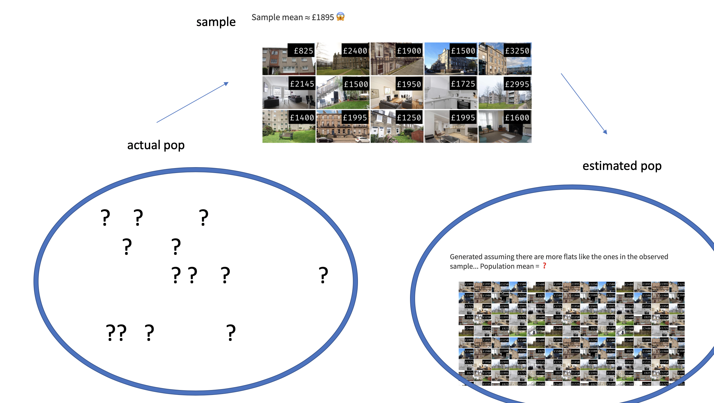
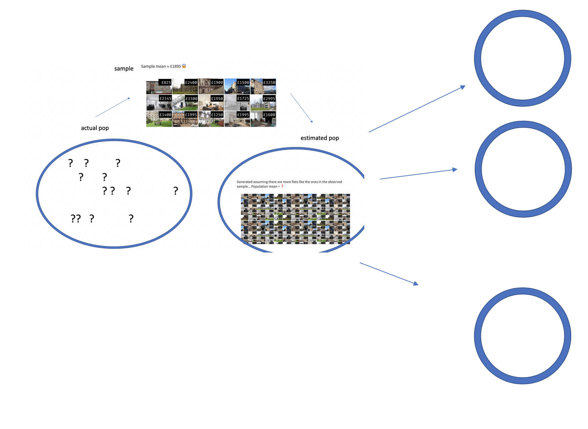

# Inference for numerical data {#inference-num}

```{block2, type="uptohere", echo=TRUE}
The content in this chapter is currently just placeholder. We will remove this banner once the chapter content has been updated and ready for review.
```

```{block2, chp2-intro, type="chapterintro", echo=TRUE}
Focusing now on Statistical Inference for **numerical data**, again, we will revisit and expand upon the foundational aspects of hypothesis testing from Chapter \@ref(inference-foundations).

The important data structure for this chapter is a numeric response variable (that is, the outcome is quantitative).
The four data structures we detail are one numeric response variable, one numeric response variable which is a difference across a pair of observations, a numeric response variable broken down by a binary explanatory variable, and a numeric response variable broken down by an explanatory variable that has two or more levels.
When appropriate, each of the data structures will be analyzed using the three methods from Chapter \@ref(inference-foundations): randomization test, bootstrapping, and mathematical models.

As we build on the inferential ideas, we will visit new foundational concepts in statistical inference.  One key new idea rests in estimating how the sample mean (as opposed to the sample proportion) varies from sample to sample; the resulting value is referred to as the standard error of the mean.  We will also introduce a new important mathematical model, the $t$-distribution (as the foundation for the $t$-test).  
```

```{r summary3methodsChp7}
method_summary_table <- tribble(
  ~variable,    ~col1, ~col2, ~col3,
"What does it do?",  "Shuffles the explanatory variable to mimic the natural variability  found in a randomized experiment.", "Resamples (with replacement) from the observed data to mimic the sampling variability found by collecting data.",  "Uses theory (primarily the Central Limit Theorem) to describe the hypothetical variability resulting from either repeated randomized experiments or random samples.",

"What is the random process described?", "randomized experiment", "random sampling",  "either / both",

"Is there flexibility?", "Yes, can be used to describe random sampling in an observational model", "Yes, can be used to describe random allocation in an experiment", "Yes",

"What is it best for?", "Hypothesis Testing (can be used for Confidence Intervals, but not covered in this text).", "Confidence Intervals (HT for one proportion covered in Chapter 6).", "Quick analyses through, for example, calculating a Z score.",

"What physical object represents the simulation process?", "shuffling cards", "pulling balls from a bag", "NA",

"What are the technical conditions?", "independence", "independence, big n", "independence, big n"
)
```


```{r include=FALSE}
terms_chp_7 <- c("numerical data")
```


In this chapter, we focus on the sample mean (instead of, for example, the sample median or the range of the observations) because of the well-studied mathematical model which describes the behavior of the sample mean.
We will not cover mathematical models which describe other statistics, but the bootstrap and randomization techniques described below are immediately extendable to any function of the observed data.
The sample mean will be calculated in one group, two paired groups, two independent groups, and many groups settings.
The techniques described for each setting will vary slightly, but you will be well served to find the structural similarities across the different settings.


## One mean {#one-mean}

Similar to how we can model the behavior of the
sample proportion $\hat{p}$ using a normal distribution,
the sample mean $\bar{x}$ can also be modeled using
a normal distribution when certain conditions are met.
\index{point estimate!single mean}
However, we'll soon learn that a new distribution,
called the $t$-distribution,
tends to be more useful when working with the sample mean.
We'll first learn about this new distribution,
then we'll use it to construct confidence intervals
and conduct hypothesis tests for the mean.


### Bootstrap confidence interval for $\mu$

As an employer who subsidizes housing for your employees, you need to know the average month rental price for a three bedroom flat in Edinburgh.
In order to walk through the example more clearly, let's say that you are only able to randomly sample five Edinburgh flats (if this were a real example, you would surely be able to take a much larger sample size, possibly even being able to measure the entire population!).


#### Observed data {-}

Figure \@ref(fig:5flats) presents the details of the random sample of observations where the monthly rent of five flats has been recorded.

```{r 5flats, fig.cap = "5 flats", warning = FALSE,  out.width="75%"}
include_graphics("07/figures/5flats.png")
```

```{r}
edin_3br <- data.frame(price = c(1400, 1995, 1250, 1995, 1600))

#edin_3br %>% summarize(mean(price), sd(price), n())
```

The sample average monthly rent of £ `r mean(edin_3br$price)` is a first guess at the price of three bedroom flats.  However, as a student of statistics, you understand that one sample mean based on a sample of five observations will not necessarily equal the true population average rent for all three bedroom flats in Edinburgh.
Indeed, you can see that the observed rent prices vary with a standard deviation of `r sd(edin_3br$price)`, and surely the average monthly rent would be different if a different sample of size five had been taken from the population.
Fortunately, as it did in previous chapters for the sample proportion, bootstrapping will approximate the variability of the sample mean from sample to sample.


#### Variability of the statistic {-}

As with the inferential ideas covered in Chapter \@ref(inference-foundations), the inferential analysis methods in this chapter are grounded in quantifying how one dataset differs from another when they are both taken from the same population.
Again, it still doesn't make sense to to take repeated samples from the same population (same reasoning:  if you have the means to take more samples, a larger sample size will benefit you more than then exact same sample twice).
Just like with proportions, we are going to use the observed data to 

Most of the inferential procedures covered in this text are grounded in quantifying how one data set would differ from another when they are both taken from the same population.
It doesn't make sense to take repeated samples from the same population because if you have the means to take more samples, a larger sample size will benefit you more than the exact same sample twice.
Instead, we measure how the samples behave under an estimate of the population.  Figure \@ref(fig:bootquant1) shows how the unknown original population can be estimated by using the sample to approximate the distribution of 

```{block2, type = "todo", echo = TRUE}
need to fill in the example here
```

```{r bootquant1, fig.cap = "first figure with the ? pop, then sample, then estimate of the pop.", warning = FALSE,  out.width="75%"}

```


By taking repeated samples from the estimated population, the variability from sample to sample can be observed.  In Figure \@ref(fig:boot2) the repeated bootstrap samples are obviously different both from each other and from the original population.
Recall that the bootstrap samples were taken from the same (estimated) population, and so the differences are due entirely to natural variability in the sampling procedure.

```{r bootquant2, fig.cap = "next fig, has the bootstrap samples", warning = FALSE,  out.width="75%"}

```

By summarizing each of the bootstrap samples (here, using the sample mean), we see, directly, the variability of the sample mean, $\bar{x}$, from sample to sample.
The distribution of $\hat{x}_{bs}$ for the Edinburgh flats is shown in Figure \@ref(fig:bootquant3).

```{block2, type = "todo", echo = TRUE}
after the plot is made, describe the actual BS samples
```


```{r bootquant3, fig.cap = "WITH ADDED HISTOGRAM... boot samples, arrow, histogram of all of them", warning = FALSE,  out.width="75%"}
include_graphics("07/figures/bootquant3.png")
```


```{block2, type = "todo", echo = TRUE}
add the sampling with replacement part (????)
```


Figure \@ref(fig:flatsbsmean) summarizes one thousand bootstrap samples in a histogram of the bootstrap sample means.
The bootstrapped average rent prices vary from £ 1250 to £ 1995 (with a small observed sample of size 5, a bootstrap resample can sometimes, although rarely, include only repeated measurements of the same observation).
The bootstrap confidence interval is found by locating the middle 90% (for a 90% confidence interval) or a 95% (for a 95% confidence interval) of the bootstrapped statistics.

```{block2, type = "example", echo = TRUE}
Using Figure \@ref(fig:flatsbsmean), find the 90% and 95% confidence intervals for the true mean monthly rental price of a three bedroom flat in Edinburgh.

---
A 90% confidence interval is given by £ 1429 to £ 1876.  The conclusion is that we are 90% confident that the true average rental price for three bedroom flats in Edinburgh lies somewhere between £ 1429 and £ 1876.


A 95% confidence interval is given by £ 1389.75 to £ 1916.  The conclusion is that we are 90% confident that the true average rental price for three bedroom flats in Edinburgh lies somewhere between £ 1389.75 and £ 1916.
```


```{r flatsbsmean, fig.cap="The original Edinburgh data is bootstrapped 1,000 times. The histogram provides a sense for the variability of the average rent values from sample to sample.", warning=FALSE, fig.width=10}

set.seed(47)
bsflats <- edin_3br %>%
  rep_sample_n(size = 5, reps = 1000, replace = TRUE) 

bsflats_mean <- bsflats %>%
  group_by(replicate) %>% 
  summarize( flat_bsmean = mean(price)) %>%
  pull()

bsq1 <- quantile(bsflats_mean, probs = c(0.005, 0.025, 0.05, 0.1, 0.9, 0.95, 0.975, 0.995))

bsmeans_up <- bsflats_mean[bsflats_mean >= bsq1[7]]
bsmeans_low <- bsflats_mean[bsflats_mean <= bsq1[2]]

umeans <- sort(unique(bsflats_mean))
bin.width <- (umeans[length(umeans)] - umeans[1])/15
#breaks <- c(uprops - bin.width / 4, uprops + bin.width / 4)
breaks <- seq(umeans[1] - 1, umeans[length(umeans)] + bin.width, by = bin.width)
  

histPlot(bsflats_mean, breaks = breaks, axes = FALSE, col = rgb(1,1,1),
     xlab = "", ylab="")
#histPlot(bsmeans_up, breaks = breaks, col = COL[1], add = TRUE)
#histPlot(bsmeans_low, breaks = breaks, col = COL[1], add = TRUE)
axis(1)
#axis(2, at = seq(0, 100, 50), labels = format(seq(0, 50, 25) / nsim))
lines(c(bsq1[6], bsq1[6]), c(0, 75), lty = 3, lwd = 3)
lines(c(bsq1[3], bsq1[3]), c(0, 75), lty = 3, lwd = 3)
lines(c(bsq1[7], bsq1[7]), c(0, 50), lty = 3, lwd = 3)
lines(c(bsq1[2], bsq1[2]), c(0, 50), lty = 3, lwd = 3)
lines(c(bsq1[8], bsq1[8]), c(0, 25), lty = 3, lwd = 3)
lines(c(bsq1[1], bsq1[1]), c(0, 25), lty = 3, lwd = 3)
text(bsq1[6], 75, "95 percentile", pos = 3)
text(bsq1[3], 75, "5 percentile", pos = 3)
text(bsq1[7], 50, "97.5 percentile", pos = 3)
text(bsq1[2], 50, "2.5 percentile", pos = 3)
text(bsq1[8], 25, "99.5 percentile", pos = 3)
text(bsq1[1], 25, "0.5 percentile", pos = 3)
text(bsq1[6], -5, round(bsq1[6],1), pos = 3)
text(bsq1[3], -5, round(bsq1[3],1), pos = 3)
text(bsq1[7], -5, round(bsq1[7],1), pos = 3)
text(bsq1[2], -5, round(bsq1[2],1), pos = 3)
text(bsq1[8], -5, round(bsq1[8],1), pos = 3)
text(bsq1[1], -5, round(bsq1[1],1), pos = 3)
par(las = 0)
mtext("Bootstrapped values of the mean of the monthly flat price", 1, 2.5)

```

#### Bootstrap SE confidence interval {-}

Another method for creating bootstrap intervals is built on first calculating the variability of the bootstrap statistics (here, the bootstrap means).  If the bootstrap distribution is relatively symmetric and bell-shaped, then the bootstrap 95% confidence interval can be constructed with the formula familiar from the mathematical models in previous chapters:

$$\mbox{point estimate} \pm 2 \cdot SE_{BS}$$
The number 2 is an approximation connected to the "95%" part of the confidence interval (remember the 68-95-99.7 rule) which will be made more detailed in Section \@ref(one-mean-math).

```{block2, type = "example", echo = TRUE}
Explain how the SE of the bootstrapped means is calculated and what it is measuring.

---

The SE of the bootstrapped means measures how variable the means are from resample to resample.  The bootstrap SE is a good approximation to the SE of means as if we had taken repeated samples from the original population (which we agreed isn't something we would do because of wasted resources).

Logistically, we can find the standard deviation of the bootstrapped means using the same calculations from Chapter \@ref(eda).  That is, the bootstrapped means are the individual observations about which we measure the variability.
```

```{block2, type = "guidedpractice", echo = TRUE}
It turns out that the standard deviation of the bootstrapped means from Figure \@ref(fig:flatsbsmean) is £ 136.9.  [Note: in R the calculation was done using the function `sd()`.]  The average of the observed prices, the best guess point estimate for $\mu$, is  £ 1648.

Find and interpret the confidence interval for $\mu$ (the true average rental price of flats in Edinbugh) using the Bootstrap SE inverval formula.^[Using the formula for the boostrap SE interval, we find the 95% confidence interval for $\mu$ is: 
                                                                                                                                                      $1648 \pm 2 \cdot 136.9 \rightarrow$ (£ 1374.2, £ 1921.8)
                                                                                                                                                      
We are 95% confident that the true average rent price for a three bedroom flat in Edinburgh is somewhere between £ 1374.2 and £ 1921.8.]
```


```{block2, type = "example", echo = TRUE}
Compare and contrast the two different 95% confidence intervals for $\mu$ created by finding the percentiles of the bootstrapped means and created by finding the SE of the bootstrapped means.  Do you think the intervals *should* be identical?
  
---
  
* Percentile interval: (£ 1389.75, £ 1916)
* SE interval: (£ 1374.2, £ 1921.8)

The intervals were created using different methods, so it is not surprising that they are not identical.  However, we are pleased to see that the two methods provide very similar interval approximations. 

The technical details surrounding which data structures are best for percentile intervals and which are best for SE intervals is beyond the scope of this text.  However, the larger the samples are, the better the interval estimates will be.
```

#### Bootstrap confidence interval for $\sigma$ {-}

Suppose that the research question at hand seeks to understand how variable the rental price of the flats are in Edinburgh.
That is, your interest is no longer in the average rental price of the flats but in the *standard deviation* of the rental prices of all three bedroom flats in Edinburgh, $\sigma$.
You may have already realized that the sample standard deviation, $s$, will work as a good **point estimate** for the parameter of interest: the population standard deviation, $\sigma$.
The point estimate of the five observations is calculated to be $s =$ £  340.23.
While $s =$ £  340.23 might be a good guess for $\sigma$, we prefer to have an interval 
Although there is a mathematical model which describes how $s$ varies from sample to sample, the mathematical model will not be presented in this text.
But even without the mathematical model, bootstrapping can be used to find a confidence interval for the parameter $\sigma$.

```{r include=FALSE}
terms_chp_7 <- c(terms_chp_7, "point estimate")
```

```{block2, type = "example", echo = TRUE}
Describe the bootstrap distribution for the standard deviation shown in Figure \@ref(fig:flatsbssd).

---
  
The distribution is skewed left and centered near £ 340.23, which is the point estimate from the original data. Most observations in this distribution lie between £ 0 and £ 408.1.
```

```{block2, type = "guidedpractice", echo = TRUE}
Using Figure \@ref(fig:flatsbssd), find *and interpret* a 90% confidence interval for the population standard deviation for three bedroom flat prices in Edinburgh.^[By looking at the percentile values in Figure \@ref(fig:flatsbssd), the middle 90% of the bootstrap standard deviations are given by the 5 percentile (£ 153.9) and 95 percentile (£ 385.6).  That is, we are 90% confident that the true standard deviation of rent prices is between £ 153.9 and £ 385.6.]
```

```{r flatsbssd, fig.cap="The original Edinburgh data is bootstrapped 1,000 times. The histogram provides a sense for the variability of the standard deviation of the rent values from sample to sample.", warning=FALSE, fig.width=10}

bsflats_sd <- bsflats %>%
  group_by(replicate) %>% 
  summarize( flat_bssd = sd(price)) %>%
  pull()

bsq1 <- quantile(bsflats_sd, probs = c(0.005, 0.025, 0.05, 0.1, 0.9, 0.95, 0.975, 0.995))

bsmeans_up <- bsflats_sd[bsflats_sd >= bsq1[7]]
bsmeans_low <- bsflats_sd[bsflats_sd <= bsq1[2]]

umeans <- sort(unique(bsflats_sd))
bin.width <- (umeans[length(umeans)] - umeans[1])/15
#breaks <- c(uprops - bin.width / 4, uprops + bin.width / 4)
breaks <- seq(umeans[1] - 1, umeans[length(umeans)] + bin.width, by = bin.width)
  

histPlot(bsflats_sd, breaks = breaks, axes = FALSE, col = rgb(1,1,1),
     xlab = "", ylab="")
#histPlot(bsmeans_up, breaks = breaks, col = COL[1], add = TRUE)
#histPlot(bsmeans_low, breaks = breaks, col = COL[1], add = TRUE)
axis(1)
#axis(2, at = seq(0, 100, 50), labels = format(seq(0, 50, 25) / nsim))
lines(c(bsq1[6], bsq1[6]), c(0, 75), lty = 3, lwd = 3)
lines(c(bsq1[3], bsq1[3]), c(0, 75), lty = 3, lwd = 3)
lines(c(bsq1[7], bsq1[7]), c(0, 50), lty = 3, lwd = 3)
lines(c(bsq1[2], bsq1[2]), c(0, 50), lty = 3, lwd = 3)
lines(c(bsq1[8], bsq1[8]), c(0, 25), lty = 3, lwd = 3)
lines(c(bsq1[1], bsq1[1]), c(0, 25), lty = 3, lwd = 3)
text(bsq1[6], 75, "95 percentile", pos = 3)
text(bsq1[3], 75, "5 percentile", pos = 3)
text(bsq1[7], 50, "97.5 percentile", pos = 3)
text(bsq1[2], 50, "2.5 percentile", pos = 3)
text(bsq1[8], 25, "99.5 percentile", pos = 3)
text(bsq1[1], 25, "0.5 percentile", pos = 3)
text(bsq1[6], -5, round(bsq1[6],1), pos = 3)
text(bsq1[3], -5, round(bsq1[3],1), pos = 3)
text(bsq1[7], -5, round(bsq1[7],1), pos = 3)
text(bsq1[2], -5, round(bsq1[2],1), pos = 3)
text(bsq1[8], -5, round(bsq1[8],1), pos = 3)
text(bsq1[1], -5, round(bsq1[1],1), pos = 3)
par(las = 0)
mtext("Bootstrapped values of the standard deviation of the monthly flat price", 1, 2.5)

```


#### Bootstrapping is not a solution to small sample sizes! {-}

The example presented above is done for a sample with only five observations. 
As with analysis techniques that build on mathematical models, bootstrapping works best when a large random sample has been taken from the population.
Bootstrapping is a method for capturing the variability of a statistic when the mathematical model is unknown (it is not a method for navigating small samples).
As you might guess, the larger the random sample, the more accurately that sample will represent the population of interest.

### Mathematical model {#one-mean-math}


As with the sample proportion, the variability of the sample mean is well described by the mathematical theory given by the Central Limit Theorem.  However, because of missing information about the inherent variability in the population, a $t$-distribution is used in place of the standard normal when performing hypothesis test or confidence interval analyses.

#### A mathematical distribution of $\bar{x}$

The sample mean tends to follow
a normal distribution centered at the population mean, $\mu$,
when certain conditions are met.
Additionally, we can compute a standard error for the sample
mean using the population standard deviation $\sigma$
and the sample size $n$.

```{block2, type = "onebox", echo = TRUE}
**Central Limit Theorem for the sample mean**  
  When we collect a sufficiently large sample of
  $n$ independent observations from a population with
  mean $\mu$ and standard deviation $\sigma$,
  the sampling distribution of $\bar{x}$ will be nearly
  normal with
  \begin{align*}
  &\text{Mean}=\mu
  &&\text{Standard Error }(SE) = \frac{\sigma}{\sqrt{n}}
  \end{align*}
```


Before diving into confidence intervals and hypothesis
tests using $\bar{x}$, we first need to cover two topics:

* When we modeled $\hat{p}$ using the normal distribution,
    certain conditions had to be satisfied.
    The conditions for working with $\bar{x}$
    are a little more complex, and below, we will discuss
    how to check conditions for inference using a mathematical model.
* The standard error is dependent on the population
    standard deviation, $\sigma$.
    However, we rarely know $\sigma$, and instead
    we must estimate it.
    Because this estimation is itself imperfect,
    we use a new distribution called the
    **$t$-distribution**\index{t-distribution@$t$-distribution}
    to fix this problem, which we discuss in


```{r include=FALSE}
terms_chp_7 <- c(terms_chp_7, "t-distribution")
```

#### Evaluating the two conditions required for modeling $\bar{x}$ {-}


Two conditions are required to apply the
Central Limit Theorem\index{Central Limit Theorem}
for a sample mean $\bar{x}$:  
* **Independence.** The sample observations must be independent,
    The most common way to satisfy this condition is
    when the sample is a simple random sample from the
    population.
    If the data come from a random process,
    analogous to rolling a die,
    this would also satisfy the independence condition.  
* **Normality.** When a sample is small,
    we also require that the sample observations
    come from a normally distributed population.
    We can relax this condition more and more
    for larger and larger sample sizes.
    This condition is obviously vague,
    making it difficult to evaluate,
    so next we introduce a couple rules of thumb
    to make checking this condition easier.


```{r include=FALSE}
terms_chp_7 <- c(terms_chp_7, "Central Limit Theorem")
```

```{block2, type = "onebox", echo = TRUE}
**General rule: how to perform the normality check**
  
  There is no perfect way to check the normality condition,
  so instead we use two general rules: 

* $\mathbf{n < 30}$: If the sample size $n$ is less than 30
      and there are no clear outliers in the data,
      then we typically assume the data come from
      a nearly normal distribution to satisfy the
      condition.  
* $\mathbf{n \geq 30}$: If the sample size $n$ is at least 30
      and there are no *particularly extreme* outliers,
      then we typically assume the sampling distribution
      of $\bar{x}$ is nearly normal, even if the underlying
      distribution of individual observations is not.
```

In this first course in statistics, you aren't expected
to develop perfect judgement on the normality condition.
However, you are expected to be able to handle
clear cut cases based on the rules of thumb.^[More
  nuanced guidelines would consider further relaxing
  the *particularly extreme outlier* check when the
  sample size is very large.
  However, we'll leave further discussion here to a future course.]

```{block2, type = "example", echo = TRUE}
Consider the following two plots
    that come from simple random samples from
    different populations.
    Their sample sizes are $n_1 = 15$ and $n_2 = 50$.

Are the independence and normality conditions met
    in each case?

---
      
Each samples is from a simple random sample of its
  respective population, so the independence condition
  is satisfied.
  Let's next check the normality condition for
  each using the rule of thumb.
  
  The first sample has fewer than 30 observations,
  so we are watching for any clear outliers.
  None are present; while there is a small gap in the
  histogram on the right, this gap is small and
  20% of the observations in this small sample
  are represented in that far right bar of the histogram,
  so we can hardly call these clear outliers.
  With no clear outliers, the normality condition
  is reasonably met.

  The second sample has a sample size greater than 30 and
  includes an outlier that appears to be roughly 5 times
  further from the center of the distribution than the
  next furthest observation.
  This is an example of a particularly extreme outlier,
  so the normality condition would not be satisfied.
```

```{r outliersandsscondition, fig.cap="", warning=FALSE, fig.width=10}

d1 <- rnorm(15, 3, 2)
d2 <- c(exp(rnorm(49, 0, 0.7)), 22)

histPlot(d1, axes = FALSE, # breaks = 20,
         xlab = "Sample 1 Observations (n = 15)",
         ylab = "",
         col = COL[1])
axis(1, at = seq(-10, 10, 2))
axis(2)
par(las = 0)
mtext("Frequency", 2, 1.8)

par(las = 1, mar = c(3, 4, 0.5, 0.5))
histPlot(d2, axes = FALSE, breaks = 20,
         xlab = "Sample 2 Observations (n = 50)",
         ylab = "",
         col = COL[1])
axis(1, at = seq(-10, 30, 10))
axis(2)
par(las = 0)
mtext("Frequency", 2, 2)
```


In practice, it's typical to also do a mental check to evaluate
whether we have reason to believe the underlying population
would have moderate skew (if $n < 30$)
or have particularly extreme outliers ($n \geq 30$)
beyond what we observe in the data.
For example, consider the number of followers
for each individual account on Twitter,
and then imagine this distribution.
The large majority of accounts have built up
a couple thousand followers or fewer,
while a relatively tiny fraction have amassed
tens of millions of followers,
meaning the distribution is extremely skewed.
When we know the data come from such an extremely
skewed distribution,
it takes some effort to understand what sample
size is large enough for the normality condition
to be satisfied.


\index{Central Limit Theorem!normal data|)}


#### Introducing the $t$-distribution {-}

\index{t-distribution@$t$-distribution|(}
\index{distribution!t@$t$|(}

In practice, we cannot directly calculate the standard error
for $\bar{x}$ since we do not know the population standard
deviation, $\sigma$.
We encountered a similar issue when computing the standard
error for a sample proportion, which relied on the population
proportion, $p$.
Our solution in the proportion context was to use sample
value in place
of the population value when computing the standard error.
We'll employ a similar strategy for computing the standard
error of $\bar{x}$, using the sample
standard deviation $s$ in place of $\sigma$:
\begin{align*}
SE = \frac{\sigma}{\sqrt{n}} \approx \frac{s}{\sqrt{n}}
\end{align*}
This strategy tends to work well when we have
a lot of data and can estimate $\sigma$ using $s$ accurately.
However, the estimate is less precise with smaller samples,
and this leads to problems when using the normal
distribution to model $\bar{x}$.


We'll find it useful to use a new distribution for
inference calculations called the **$t$-distribution**.
A $t$-distribution, shown as a solid line in
Figure \@ref(fig:tDistCompareToNormalDist), has a bell shape.
However, its tails are thicker than the normal distribution's,
meaning observations are more likely to fall beyond two
standard deviations from the mean than under the normal
distribution. 

The extra thick tails of the $t$-distribution are exactly
the correction needed to resolve the problem of using $s$
in place of $\sigma$ in the $SE$ calculation.


```{r tDistCompareToNormalDist, fig.cap="Comparison of a $t$-distribution and a normal distribution.", warning=FALSE, fig.width=10}

plot(c(-5, 5),
     c(0, dnorm(0)),
     type = 'n',
     axes = FALSE)
axis(1, seq(-6, 6, 2))
abline(h = 0)

xleg <- 2
yleg <- 0.35
yleg.line.offset <- -0.07
line.leg.width <- 0.55
lines(
    c(xleg, xleg + line.leg.width),
    rep(yleg, 2),
    col = COL[4], lty = 3, lwd = 2.5)
lines(
    c(xleg, xleg + line.leg.width),
    rep(yleg + yleg.line.offset, 2),
    col = COL[1], lty = 1, lwd = 1.8)
text(xleg + line.leg.width, yleg,
    "Normal",
    col = COL[4], pos = 4)
text(xleg + line.leg.width, yleg + yleg.line.offset,
    "t-distribution",
    col = COL[1], pos = 4)

X <- seq(-6, 6, 0.01)
Y <- dnorm(X)
lines(X, Y, lty = 3, lwd = 2.5, col = COL[4])

Y <- dt(X, 2)
lines(X, Y, lwd = 1.8, col = COL[1])

```


The $t$-distribution is always centered at zero and
has a single parameter: degrees of freedom.
The **degrees of freedom** \termsub{degrees of freedom ($\pmb{df}$)}
    {degrees of freedom ($df$)!$t$-distribution}
describes the precise form of the bell-shaped $t$-distribution.
Several $t$-distributions are shown in
Figure \@ref(fig:tDistConvergeToNormalDist)
in comparison to the normal distribution.

In general, we'll use a $t$-distribution
with $df = n - 1$ to model the sample mean
when the sample size is $n$.
That is, when we have more observations,
the degrees of freedom will be larger and
the $t$-distribution will look more like the
standard normal distribution;
when the degrees of freedom is about 30 or more,
the $t$-distribution is nearly indistinguishable
from the normal distribution.

```{r include=FALSE}
terms_chp_7 <- c(terms_chp_7, "degrees of freedom")
```


```{r tDistConvergeToNormalDist, fig.cap="The larger the degrees of freedom, the more closely the $t$-distribution resembles the standard normal distribution.", warning=FALSE, fig.width=10}

plot(c(-5, 5),
     c(0, dnorm(0)),
     type = 'n',
     axes = FALSE)
at <- seq(-10, 10, 2)
axis(1, at)
axis(1, at - 1, rep("", length(at)), tcl = -0.1)
abline(h = 0)

COL. <- fadeColor(COL[1], c("FF", "89", "68", "4C", "33"))
COLt <- fadeColor(COL[1], c("FF", "AA", "85", "60", "45"))
DF   <- c('normal', 8, 4, 2, 1)

X <- seq(-10, 10, 0.02)
Y <- dnorm(X)
lines(X, Y, col = COL.[1])

for (i in 2:5) {
  Y <- dt(X, as.numeric(DF[i]))
  lines(X, Y, col = COL.[i], lwd = 1.5)
}

legend(2.5, 0.4,
       legend = c(DF[1],
       paste('t, df = ', DF[2:5], sep = '')),
       col = COL.,
       text.col = COLt,
       lty = rep(1, 5),
       lwd = 1.5)
```


```{block2, type = "onebox", echo = TRUE}
**Degrees of freedom: df**
  
  The degrees of freedom describes the shape of the
  $t$-distribution.
  The larger the degrees of freedom, the more closely
  the distribution approximates the normal model. 
  
  When modeling $\bar{x}$ using the $t$-distribution,
  use $df = n - 1$.
```


The $t$-distribution allows us greater flexibility than
the normal distribution when analyzing numerical data.
In practice, it's common to use statistical software,
such as R, Python, or SAS for these analyses.
In R, the function used for calculating probabilities under a $t$-distribution is `pt()` (which should seem similar to previous R functions, `pnorm()` and `pchisq()`).
Don't forget that with the $t$-distribution, the degrees of freedom must always be specified!

<!--
Alternatively, a graphing calculator or a
\termsub{$\pmb{t}$-table}{t-table@$t$-table} may be used;
the $t$-table is similar to the normal distribution table,
and it may be found in Appendix \ref{tDistributionTable},
which includes usage instructions and examples
for those who wish to use this option.
-->
No matter the approach you choose, apply your method
using the examples below to confirm your working
understanding of the $t$-distribution.

```{block2, type = "example", echo = TRUE}
What proportion of the $t$-distribution
    with 18 degrees of freedom falls below -2.10?
      
---
      
Just like a normal probability problem, we first draw
  the picture in Figure \@ref(fig:tDistDF18LeftTail2Point10)
  and shade the area below -2.10.


  Using statistical software, we can obtain a precise
  value: 0.0250.
```


```{r echo = TRUE}
# using pt() to find probability under the $t$-distribution
pt(-2.10, df = 18)
```

```{r tDistDF18LeftTail2Point10, fig.cap="The $t$-distribution with 18 degrees of freedom. The area below -2.10 has been shaded.", warning=FALSE, fig.width=10}

normTail(L = -2.10,
         df = 10,
         xlim = c(-4, 4),
         col = COL[1],
         axes = FALSE)
axis(1)
```


```{block2, type = "example", echo = TRUE}
A $t$-distribution with 20 degrees of freedom
    is shown in the top panel of
    Figure \@ref(fig:tDistDF20RightTail1Point65).
    Estimate the proportion of the distribution falling
    above 1.65.
    
---

With a normal distribution, this would correspond to
  about 0.05, so we should expect the $t$-distribution
  to give us a value in this neighborhood.
  Using statistical software: 0.0573.
```


```{r tDistDF20RightTail1Point65, fig.cap="Top: The $t$-distribution with 20 degrees of freedom, with the area above 1.65 shaded. Bottom: The $t$-distribution with 2 degrees of freedom, with the area further than 3 units from 0 shaded.", warning=FALSE, fig.width=10}

normTail(U = 1.65,
         df = 12,
         xlim = c(-4, 4),
         col = COL[1],
         axes = FALSE)
axis(1)
normTail(L = -3,
         U = 3,
         df = 2.3,
         xlim = c(-4.5, 4.5),
         col = COL[1],
         axes = FALSE)
axis(1)
```

```{block2, type = "example", echo = TRUE}
A $t$-distribution with 2 degrees of freedom
    is shown in the bottom panel of
    Figure \@ref(fig:tDistDF20RightTail1Point65).
    Estimate the proportion of the distribution falling more
    than 3 units from the mean (above or below).
    
---

With so few degrees of freedom, the $t$-distribution will
  give a more notably different value than the normal
  distribution.
  Under a normal distribution, the area would be about
  0.003 using the 68-95-99.7 rule.
  For a $t$-distribution with $df = 2$, the area in both
  tails beyond 3 units totals 0.0955.
  This area is dramatically different than what
  we obtain from the normal distribution.
```

```{block2, type = "guidedpractice", echo = TRUE}
What proportion of the $t$-distribution with 19 degrees
of freedom falls above -1.79 units?
Use your preferred method for finding tail areas.^[We want to find the shaded area *above* -1.79 (we leave the picture to you).
  The lower tail area has an area of 0.0447,
  so the upper area would have an area of $1 - 0.0447 = 0.9553$.]
```

\index{distribution!t@$t$|)}
\index{t-distribution@$t$-distribution|)}


#### One sample $t$-confidence intervals {-}

\index{data!dolphins and mercury|(}

Let's get our first taste of applying the $t$-distribution
in the context of an example about the mercury content
of dolphin muscle.
Elevated mercury concentrations are an important problem
for both dolphins
and other animals, like humans, who occasionally eat them.


```{r rissosDolphin, fig.cap = "A Risso's dolphin. Photo by Mike Baird, www.bairdphotos.com", warning = FALSE,  out.width="75%"}

```

#### Observed data {-}

We will identify a confidence interval for the average mercury content in dolphin muscle using a sample of 19 Risso's dolphins from the Taiji area in Japan. The data are summarized in Table \@ref(tab:summaryStatsOfHgInMuscleOfRissosDolphins). The minimum and maximum observed values can be used to evaluate whether or not there are clear outliers.


```{r summaryStatsOfHgInMuscleOfRissosDolphins}
temptbl <- tribble(
 ~col0,    ~col1, ~col2, ~col3, ~col4,
 19, 4.4, 2.3, 1.7, 9.2
)

temptbl %>%
 kable(caption = "Summary of mercury content in the muscle of 19 Risso's dolphins from the Taiji area. Measurements are in micrograms of mercury per wet gram
    of muscle ($\\mu$g/wet g).",
    col.names = c( "$n$", "$\\bar{x}$", "s", "minimum", "maximum")) %>%
 kable_styling() 
```

```{block2, type = "example", echo = TRUE}
Are the independence and
    normality conditions satisfied for this data set?
      
---
      
The observations are a simple random sample,
  therefore independence is reasonable.
  The summary statistics in
  Table \@ref(tab:summaryStatsOfHgInMuscleOfRissosDolphins)
  do not suggest any clear outliers, with
  all observations are within 2.5 standard deviations
  of the mean.
  Based on this evidence, the normality condition
  seems reasonable.
```

In the normal model, we used $z^{\star}$ and the standard error to determine the width of a confidence interval. We revise the confidence interval formula slightly when using the $t$-distribution:
\begin{align*}
&\text{point estimate} \ \pm\  t^{\star}_{df} \times SE
&&\to
&&\bar{x} \ \pm\  t^{\star}_{df} \times \frac{s}{\sqrt{n}}
\end{align*}

```{block2, type = "example", echo = TRUE}
Using the summary statistics in
    Table \@ref(tab:summaryStatsOfHgInMuscleOfRissosDolphins),
    compute the standard error for the average
    mercury content in the $n = 19$ dolphins.
    
---
      
We plug in $s$ and $n$ into the formula:
  $SE
    = s / \sqrt{n}
    = 2.3 / \sqrt{19}
    = 0.528$.
```

The value $t^{\star}_{df}$ is a cutoff we obtain based on the
confidence level and the $t$-distribution with $df$ degrees
of freedom.
That cutoff is found in the same way as with a normal
distribution: we find $t^{\star}_{df}$ such that
the fraction of the $t$-distribution with $df$ degrees
of freedom within a distance $t^{\star}_{df}$
of 0 matches the confidence level of interest.

```{block2, type = "example", echo = TRUE}

When $n = 19$, what is the appropriate
    degrees of freedom?
    Find $t^{\star}_{df}$ for this degrees of freedom
    and the confidence level of 95%
    
---
  
The degrees of freedom is easy to calculate:
  $df = n - 1 = 18$.
  
  Using statistical software, we find the cutoff where
  the upper tail is equal to 2.5%:
  $t^{\star}_{18} = 2.10$.
  The area below -2.10 will also be equal to 2.5%.
  That is, 95% of the $t$-distribution with $df = 18$
  lies within 2.10 units of 0.
```

```{block2, type = "onebox", echo = TRUE}
**Degrees of freedom for a single sample.**
  
If the sample has $n$ observations and we are examining a single mean, then we use the $t$-distribution with $df=n-1$ degrees of freedom.
```

%In our current example, we should use the $t$-distribution
%with $df=19-1=18$ degrees of freedom.
%We can generally identify $t_{18}^{\star}$
%using statistical software.
%Alternatively, we could use the $t$-table in
%Appendix \ref{tDistributionTable}.
%Generally the value of $t^{\star}_{df}$ is slightly larger
%than what we would get under the normal model with $z^{\star}$.

```{block2, type = "example", echo = TRUE}
Compute and interpret the 95% confidence interval
    for the average mercury content in Risso's dolphins.
    
---

We can construct the confidence interval as
  \begin{align*}
  \bar{x} \ \pm\  t^{\star}_{18} \times SE
    \quad \to \quad 4.4 \ \pm\  2.10 \times 0.528
    \quad \to \quad (3.29, 5.51)
  \end{align*}
  We are 95% confident the average mercury content of muscles
  in Risso's dolphins is between 3.29 and 5.51 $\mu$g/wet gram,
  which is considered extremely high.
```

\index{data!dolphins and mercury|)}

```{block2, type = "onebox", echo = TRUE}
**Finding a $t$-confidence interval for the mean, $\mu$.**
  
  Based on a sample of $n$ independent and nearly normal
  observations, a confidence interval for the population
  mean is
  \begin{align*}
  &\text{point estimate} \ \pm\  t^{\star}_{df} \times SE
  &&\to
  &&\bar{x} \ \pm\  t^{\star}_{df} \times \frac{s}{\sqrt{n}}
  \end{align*}
  where $\bar{x}$ is the sample mean, $t^{\star}_{df}$
  corresponds to the confidence level and degrees of freedom
  $df$, and $SE$ is the standard error as estimated by
  the sample.
```

```{block2, type = "guidedpractice", echo = TRUE}
The FDA's webpage provides some data on mercury content of fish.
Based on a sample of 15 croaker white fish (Pacific),
a sample mean and standard deviation were computed as 0.287
and 0.069 ppm (parts per million), respectively.
The 15 observations ranged from 0.18 to 0.41 ppm.
We will assume these observations are independent.
Based on the summary statistics of the data,
do you have any objections to the normality condition
of the individual observations?^[The sample size is under 30,
  so we check for obvious outliers:
  since all observations are within 2 standard deviations
  of the mean, there are no such clear outliers.]
```


\index{data!white fish and mercury|(}


```{block2, type = "example", echo = TRUE}
Estimate the standard error of
    $\bar{x} = 0.287$ ppm using the data summaries in the previous Guided Practice.    If we are to use the $t$-distribution to create a
    90% confidence interval for the actual mean of the
    mercury content, identify the degrees of freedom
    and $t^{\star}_{df}$.
  
---
      
The standard error: $SE = \frac{0.069}{\sqrt{15}} = 0.0178$.

  Degrees of freedom: $df = n - 1 = 14$.

  Since the goal is a 90% confidence interval,
  we choose $t_{14}^{\star}$ so that the two-tail area
  is 0.1:
  $t^{\star}_{14} = 1.76$.
```

<!--
\begin{onebox}{Confidence interval for a single mean}
  Once you've determined a one-mean confidence interval
  would be helpful for an application,
  there are four steps to constructing the interval:
  \begin{description}
  \item[Prepare.]
      Identify $\bar{x}$, $s$, $n$, and determine what
      confidence level you wish to use.
  \item[Check.]
      Verify the conditions to ensure $\bar{x}$
      is nearly normal.
  \item[Calculate.]
      If the conditions hold, compute $SE$,
      find $t_{df}^{\star}$, and construct the interval.
  \item[Conclude.]
      Interpret the confidence interval in the context
      of the problem.
  \end{description}
\end{onebox}
-->


```{block2, type = "guidedpractice", echo = TRUE}
Using the information and results of the previous Guided Practice and Example, compute a 90% confidence interval for the average mercury content of croaker white fish (Pacific).^[$\bar{x} \ \pm\ t^{\star}_{14} \times SE
      \ \to\  0.287 \ \pm\  1.76 \times 0.0178
      \ \to\ (0.256, 0.318)$.
  We are 90% confident that the average mercury content
  of croaker white fish (Pacific) is between 0.256 and 0.318 ppm.]
```


```{block2, type = "guidedpractice", echo = TRUE}
The 90% confidence interval from the previous
Guided Practice is 0.256 ppm to 0.318 ppm.
Can we say that 90% of croaker white fish (Pacific)
have mercury levels between 0.256 and 0.318 ppm?^[No, a confidence interval only provides a range
  of plausible values for a population parameter,
  in this case the population mean.
  It does not describe what we might observe
  for individual observations.]
```

\index{data!white fish and mercury|)}

#### One sample $t$-tests {-}

Now that we've used the $t$-distribution for making a confidence
intervals for a mean, let's speed on through to
hypothesis tests for the mean.

<!--
\newcommand{\cherryblossomn}{100}
\newcommand{\cherryblossommean}{97.32}
\newcommand{\cherryblossomnull}{93.29}
\newcommand{\cherryblossomsd}{16.98}
\newcommand{\cherryblossomse}{1.70}
\newcommand{\cherryblossomz}{2.37}
-->

Is the typical US runner getting faster or slower over time? We consider this question in the context of the Cherry Blossom Race, which is a 10-mile race in Washington, DC each spring.

The average time for all runners who finished the Cherry Blossom Race in 2006 was 93.29 minutes (93 minutes and about 17 seconds). We want to determine using data from 100 participants in the 2017 Cherry Blossom Race whether runners in this race are getting faster or slower, versus the other possibility that there has been no change.

```{block2, type = "guidedpractice", echo = TRUE}
What are appropriate hypotheses for this context?^[$H_0$: The average 10-mile run time was the same for 2006 and 2017. $\mu = 93.29$ minutes. $H_A$: The average 10-mile run time for 2017 was \emph{different} than that of 2006. $\mu \neq 93.29$ minutes.]
```

```{block2, type = "guidedpractice", echo = TRUE}
The data come from a simple random sample of all participants,
so the observations are independent.
However, should we be worried about the normality condition?
See Figure \@ref(fig:run10SampTimeHistogram) for a histogram
of the differences and evaluate if we can move
forward.^[With a sample of 100,
  we should only be concerned if there is are particularly
  extreme outliers.
  The histogram of the data doesn't show any outliers of concern
  (and arguably, no outliers at all).]
```


```{r run10SampTimeHistogram, fig.cap="A histogram of `time` for the sample Cherry Blossom Race data.", warning=FALSE, fig.width=10}

set.seed(1)
run17 <- subset(run17, event == "10 Mile")
d <- run17[sample(nrow(run17), 100), ] %>%
  mutate(time = net_sec / 60)

histPlot(d$time,
         main = "",
         xlab = "Time (Minutes)",
         ylab = "Frequency",
         col = COL[1])
```

When completing a hypothesis test for the one-sample mean,
the process is nearly identical to completing a hypothesis
test for a single proportion.
First, we find the Z score using the observed value,
null value, and standard error;
however, we call it a **T score** since we use
a $t$-distribution for calculating the tail area.
Then we finding the p-value using the same ideas we used
previously: find the one-tail area under the sampling
distribution, and double it.

```{r include=FALSE}
terms_chp_7 <- c(terms_chp_7, "T score")
```

```{block2, type = "example", echo = TRUE}
With both the independence
    and normality conditions satisfied,
    we can proceed with a hypothesis test using
    the $t$-distribution.
    The sample mean and sample standard deviation
    of the sample
    of 100 runners from the
    2017 Cherry Blossom Race
    are 97.32 and 16.98 minutes,
    respectively.
    Recall that the sample size is 100
    and the average run time in 2006 was 93.29 minutes.
    Find the test statistic and p-value.
    What is your conclusion?

---
  
To find the test statistic (T score),
  we first must determine the standard error:
  \begin{align*}
  SE
    = 16.98 / \sqrt{100}
    = 1.70
  \end{align*}
  Now we can compute the \emph{T score}
  using the sample mean (97.32),
  null value (98.29), and $SE$:
  \begin{align*}
  T
    = \frac{97.32 - 93.29}{1.70}
    = 2.37
  \end{align*}
  For $df = 100 - 1 = 99$,
  we can determine using statistical software
  (or a $t$-table, see below) that the one-tail area is 0.01,
  which we double to get the p-value: 0.02.

  Because the p-value is smaller than 0.05,
  we reject the null hypothesis.
  That is, the data provide strong evidence that the average
  run time for the Cherry Blossom Run in 2017 is different
  than the 2006 average.
  Since the observed value is above the null value
  and we have rejected the null hypothesis, we would conclude
  that runners in the race were slower on average in 2017
  than in 2006.
```

```{r echo = TRUE}
# using pt() to find the p-value
1 - pt(2.37, df = 99)
```


```{block2, type = "onebox", echo = TRUE}
**When using a $t$-distribution, we use a T score (same as Z score).**

To help us remember to use the $t$-distribution,
we use a $T$ to represent the test statistic,
and we often call this a **T score**.
The Z score and T score are computed in the exact same way
and are conceptually identical:
each represents how many standard errors the observed value
is from the null value.
```

<!--
\begin{onebox}{Hypothesis testing for a single mean}
  Once you've determined a one-mean hypothesis test is the
  correct procedure, there are four steps to completing the
  test:
  \begin{description}
  \item[Prepare.]
      Identify the parameter of interest,
      list out hypotheses,
      identify the significance level,
      and identify $\bar{x}$, $s$, and $n$.
  \item[Check.]
      Verify conditions to ensure $\bar{x}$ is nearly normal.
  \item[Calculate.]
      If the conditions hold, compute $SE$,
      compute the T score, and identify the p-value.
  \item[Conclude.]
      Evaluate the hypothesis test by comparing the p-value
      to $\alpha$, and provide a conclusion in the context
      of the problem.
  \end{description}
\end{onebox}
-->

<!--
\CalculatorVideos{confidence intervals and hypothesis tests for a single mean}


{\input{ch_inference_for_means/TeX/one-sample_means_with_the_t-distribution.tex}}
-->


## Paired difference {#paired-data}


### case study

### Randomization test for $H_0: \mu_d = 0$

for randomization, idea of coin flipping

##### Observed data {-}

##### Variability of the statistic {-}

##### Observed statistic vs. null statistics {-}

### Bootstrap confidence interval for $\mu_d$

for bootstrap and mathematical model there is not much to do here except go through a full example.  tie the ideas back to the one-sample problem.


##### Observed data {-}

##### Variability of the statistic {-}

### Mathematical model

for bootstrap and mathematical model there is not much to do here except go through a full example.  tie the ideas back to the one-sample problem.


##### Observed data {-}

##### Variability of the statistic {-}

##### Observed statistic vs. null statistics {-}


## Difference of two means


### case study

### Randomization test for $H_0: \mu_1 - \mu_2 = 0$

need to talk about the way to randomize is almost identical to chapter 5 & 6.  a new plot will probably help (but again, very similar to 5.7) 

##### Observed data {-}

##### Variability of the statistic {-}

##### Observed statistic vs. null statistics {-}

### Bootstrap confidence interval for $\mu_1 - \mu_2$

tie back to idea in chapter 6 for two proportion CI.  

##### Observed data {-}

##### Variability of the statistic {-}

### Mathematical model

t-test.  mention that there are lots of nuances outside the scope of this book.

##### Observed data {-}

##### Variability of the statistic {-}

##### Observed statistic vs. null statistics {-}


## Comparing many means with ANOVA  {#anovaAndRegrWithCategoricalVariables}


\index{analysis of variance (ANOVA)|(}


Sometimes we want to compare means across many groups.
We might initially think to do pairwise comparisons.
For example, if there were three groups, we might be tempted
to compare the first mean with the second,
then with the third,
and then finally compare the second and third means for
a total of three comparisons.
However, this strategy can be treacherous.
If we have many groups and do many comparisons,
it is likely that we will eventually find a difference
just by chance, even if there is no difference in the
populations.
Instead, we should apply a holistic test to check whether
there is evidence that at least one pair groups are
in fact different, and this is where **ANOVA** saves
the day.

```{r include=FALSE}
terms_chp_7 <- c(terms_chp_7, "ANOVA", "analysis of variance")
```


In this section, we will learn a new method called
**analysis of variance (ANOVA)** and a new test
statistic called $F$ (which we will introduce in our discussion of mathematical models).
ANOVA uses a single hypothesis test to check whether
the means across many groups are equal:

* $H_0$: The mean outcome is the same across all groups. In statistical notation, $\mu_1 = \mu_2 = \cdots = \mu_k$ where $\mu_i$ represents the mean of the outcome for observations in category $i$.  
* $H_A$: At least one mean is different.

Generally we must check three conditions on the data before performing ANOVA:  
* the observations are independent within and across groups,  
* the data within each group are nearly normal, and  
* the variability across the groups is about equal.  

When these three conditions are met, we may perform an ANOVA to determine whether the data provide strong evidence against the null hypothesis that all the $\mu_i$ are equal.

```{block2, type = "example", echo = TRUE}
College departments commonly run multiple
    lectures of the same introductory course each semester
    because of high demand.
    Consider a statistics department that runs three lectures
    of an introductory statistics course.
    We might like to determine whether there are statistically
    significant differences in first exam scores in these three
    classes ($A$, $B$, and $C$).
    Describe appropriate hypotheses to determine whether
    there are any differences between the three classes.
    
---
      
The hypotheses may be written in the following form:  
* $H_0$: The average score is identical in all lectures.
      Any observed difference is due to chance.  
      Notationally, we write $\mu_A=\mu_B=\mu_C$.
* $H_A$: The average score varies by class.
      We would reject the null hypothesis in favor of the
      alternative hypothesis if there were larger differences
      among the class averages than what we might expect
      from chance alone.
```

Strong evidence favoring the alternative hypothesis in ANOVA
is described by unusually large differences among the group means.
We will soon learn that assessing the variability of the group
means relative to the variability among individual observations
within each group is key to ANOVA's success.

```{block2, type = "example", echo = TRUE}
Examine Figure \@ref(fig:toyANOVA). Compare groups I, II, and III. 
Can you visually determine if the differences in the group centers is due to chance or not? 
  Now compare groups IV, V, and VI.
Do these differences appear to be due to chance?

---
      
  Any real difference in the means of groups I, II, and III
  is difficult to discern, because the data within each group
  are very volatile relative to any differences in the
  average outcome.
  On the other hand, it appears there are differences
  in the centers of groups IV, V, and VI.
  For instance, group V appears to have a higher mean than
  that of the other two groups.
  Investigating groups IV, V, and VI, we see the differences
  in the groups' centers are noticeable because those
  differences are large *relative to the variability
  in the individual observations within each group*.
```


```{r toyANOVA, fig.cap="Side-by-side dot plot for the outcomes for six groups.", warning=FALSE, fig.width=10}
 plot(toy_anova$outcome,
     xlim = c(0.5, 6.5),
     type = "n",
     axes = FALSE,
     xlab = "",
     ylab = "Outcome")
rect(-100, -100,
     100, 100,
     col = COL[7,3])
abline(h = seq(-10, 10, 2), col = "#FFFFFF", lwd = 3)
abline(h = seq(-10, 10, 1), col = "#FFFFFF", lwd = 0.8)
these <- toy_anova$group %in% c("I", "II", "III")
dotPlot(toy_anova$outcome[these], toy_anova$group[these],
        vertical = TRUE,
        at = 1:3,
        add = TRUE,
        col = COL[1, 3],
        cex = 0.9, pch = 19)
dotPlot(toy_anova$outcome[!these], toy_anova$group[!these],
        vertical = TRUE,
        at = 1:3 + 3,
        add = TRUE,
        col = COL[4, 3],
        cex = 0.9,
        pch = 19)
abline(v = 3.5, col = COL[7], lwd = 5.5)
abline(v = 3.5, col = "#AAAAAA", lwd = 3)
abline(v = 3.5, col = "#333333", lwd = 0.8)
axis(2)
par(mgp = c(2, 0.45, 0.1))
axis(1, at = 1:3, c("I", "II", "III"))
axis(1, at = 4:6, c("IV", "V", "VI"))
box()

```

#### Batting case study {-}

\index{data!MLB batting|(}

<!--
\newcommand{\mlbdata}{\data{bat18}}
\newcommand{\mlbN}{429}
\newcommand{\mlbK}{3}
\newcommand{\mlbMinAB}{100}
\newcommand{\mlbDFA}{2}
\newcommand{\mlbDFB}{426}
\newcommand{\mlbF}{5.077}
\newcommand{\mlbPvalue}{0.0066}
-->

We would like to discern whether there are real differences
between the batting performance of baseball players according
to their position:
outfielder (OF), infielder (IF),
%designated hitter (DH),
and catcher (C).
We will use a data set called `mlb_players_18`,
which includes batting records of 429 Major League
Baseball (MLB) players from the 2018 season who had
at least 100 at bats.
Six of the 429 cases represented in `mlb_players_18`
are shown in Figure \@ref(tab:mlbBat18DataMatrix),
and descriptions for each variable are provided
in Figure \@ref(tab:mlbBat18Variables).
The measure we will use for the player batting
performance (the outcome variable) is on-base
percentage (`OBP`).
The on-base percentage roughly represents the fraction
of the time a player successfully gets on base or hits
a home run.


```{r mlbBat18DataMatrix}
mlb_players_18 %>%
  arrange(name) %>% 
  head(6) %>%
   kable(caption = "Six cases from the `mlb_players_18` data matrix.") %>%
 kable_styling()
```
  


```{r mlbBat18Variables}
temptbl <- tribble(
 ~variable,    ~col1,
"name" , "Player name",
"team" , "The abbreviated name of the player's team",
"position" , "The player's primary field position (OF, IF, C)" ,
"AB" , "Number of opportunities at bat",
"H" , "Number of hits",
"HR" , "Number of home runs",
"RBI" , "Number of runs batted in",
"AVG" , "Batting average, which is equal to H/AB",
"OBP" ,    "On-base percentage, which is roughly equal to the fraction of times a player gets on base or hits a home run"
)

temptbl %>%
 kable(caption = "Variables and their descriptions for the mlb_players_18 data set.",
    col.names = c( "variable", "description")) %>%
 kable_styling() 
```

```{block2, type = "guidedpractice", echo = TRUE}
The null hypothesis under consideration is the following:
$\mu_{OF} = \mu_{IF} = %\mu_{DH} = 
    \mu_{C}$.
Write the null and corresponding alternative hypotheses
in plain language.^[$H_0$: The average on-base percentage is equal
  across the four positions.
  $H_A$: The average on-base percentage varies across some
  (or all) groups.]
```

```{block2, type = "example", echo = TRUE}
The player positions have been divided
    into three groups: outfield (OF), infield (IF),
    and catcher (C).
    What would be an appropriate point estimate of the on-base
    percentage by outfielders, $\mu_{OF}$?
  
---
      
  A good estimate of the on-base percentage by outfielders would
  be the sample average of `OBP` for just those players
  whose position is outfield: $\bar{x}_{OF} = 0.320$.
```


### Randomization test for $H_0: \mu_1 = \mu_2 = \ldots = \mu_k$

Table \@ref(tab:mlbHRPerABSummaryTable) provides summary statistics for each group. A side-by-side box plot for the on-base percentage is shown in Figure \@ref(fig:mlbANOVABoxPlot). Notice that the variability appears to be approximately constant across groups; nearly constant variance across groups is an important assumption that must be satisfied before we consider the ANOVA approach.


```{r mlbHRPerABSummaryTable}
temptbl <- tribble(
 ~variable,    ~col1, ~col2, ~col3,
"Sample size ($n_i$)", 160 , 205 , 64,
"Sample mean ($\\bar{x}_i$)" , 0.320 , 0.318 , 0.302,
"Sample SD ($s_i$)" , 0.043 , 0.038 , 0.038
)

temptbl %>%
 kable(caption = "Summary statistics of on-base percentage, split by player position.",
    col.names = c( "", "OF", "IF", "C")) %>%
 kable_styling() 
```


```{r mlbANOVABoxPlot, fig.cap="Side-by-side box plot of the on-base percentage for 429 players across four groups. There is one prominent outlier visible in the infield group, but with 154 observations in the infield group, this outlier is not a concern.", warning=FALSE, fig.width=10}

d   <- subset(mlb_players_18, AB >= 100)
d   <- subset(d, !position %in% c("P", "DH"))
pos <- list(c("LF", "CF", "RF"), c("1B", "2B", "3B", "SS"), "DH", "C")
POS <- c("OF", "IF", "DH", "C")

for (i in 1:length(pos)) {
  these <- which(d$position %in% pos[[i]])
  #cat(length(these), "\n")
  d$position[these] <- POS[i]
}
d <- select(d, name, team, position, AB, H, HR, RBI, AVG, OBP)
d <- d[order(d$name, d$team), ]
rownames(d) <- NULL


mod <- lm(OBP ~ position, data = d)

key <- POS[c(1, 2, 4)]
boxPlot(d$OBP, d$position,
        xlab = "",
        ylab = "On-Base Percentage",
        axes = FALSE,
        pchCex = 1,
        key = key,
        col = COL[1, 3],
        lcol = COL[1])
mtext("Position", 1, 1.5)
axis(1, 1:3, key)
axis(2)
```


```{block2, type = "example", echo = TRUE}
The largest difference between the sample means
    is between the catcher and the outfielder positions.
    Consider again the original hypotheses:

* $H_0$: $\mu_{OF} = \mu_{IF} = \mu_{C}$

* $H_A$: The average on-base percentage ($\mu_i$) varies
        across some (or all) groups.

    Why might it be inappropriate to run the test by simply
    estimating whether the difference of $\mu_{C}$ and
    $\mu_{OF}$ is statistically significant at a 0.05
    significance level?  
---
      
The primary issue here is that we are inspecting the data
  before picking the groups that will be compared.
  It is inappropriate to examine all data by eye
  (informal testing) and only afterwards decide which parts
  to formally test.
  This is called **data snooping** or **data fishing**.
  Naturally, we would pick the groups with the large
  differences for the formal test, and this would leading
  to an inflation in the Type 1 Error rate.
  To understand this better, let's consider a slightly
  different problem.

  Suppose we are to measure the aptitude for students in
  20 classes in a large elementary school at the beginning
  of the year.
  In this school, all students are randomly assigned to
  classrooms, so any differences we observe between the
  classes at the start of the year are completely due
  to chance.
  However, with so many groups, we will probably observe
  a few groups that look rather different from each other.
  If we select only these classes that look so different
  and then perform a formal test,
  we will probably make the wrong conclusion that the
  assignment wasn't random.
  While we might only formally test differences
  for a few pairs of classes, we informally evaluated
  the other classes by eye before choosing the most extreme
  cases for a comparison.
```

For additional information on the ideas expressed above, we recommend
reading about the
**prosecutor's fallacy**.^[See, for example,
  [textbook-prosecutors_fallacy](andrewgelman.com/2007/05/18/the\_prosecutors.]

```{r include=FALSE}
terms_chp_7 <- c(terms_chp_7, "data snooping", "data fishing", "prosecutor's fallacy")
```

#### Observed data {-}

In the next section we will learn how to use the $F$ statistic
to test whether observed differences in sample means
could have happened just by chance even if there was no
difference in the respective population means.


The method of analysis of variance in this context focuses
on answering one question:
is the variability in the sample means so large that it seems
unlikely to be from chance alone?
This question is different from earlier testing procedures
since we will *simultaneously* consider many groups,
and evaluate whether their sample means differ more than
we would expect from natural variation.
We call this variability the
**mean square between groups ($MSG$)**,
and it has an associated degrees of freedom,
$df_{G} = k - 1$ when there are
$k$ groups.
The $MSG$ can be thought of as a scaled variance formula
for means.
If the null hypothesis is true, any variation in the sample
means is due to chance and shouldn't be too large.
Details of $MSG$ calculations are provided in the
footnote.^[Let $\bar{x}$ represent the mean of
  outcomes across all groups.
  Then the mean square between groups is computed as
  \begin{align*}
  MSG
    = \frac{1}{df_{G}}SSG
    = \frac{1}{k-1}\sum_{i=1}^{k} n_{i}
        \left(\bar{x}_{i} - \bar{x}\right)^2
  \end{align*}
  where $SSG$ is called the **sum of squares between groups**
  and $n_{i}$ is the sample size of group $i$.]


However, we typically use software for these computations.

\index{degrees of freedom (df)!ANOVA}

```{r include=FALSE}
terms_chp_7 <- c(terms_chp_7, "mean square between groups (MSG)", "degrees of freedom", "sum of squares between groups (SSG)", "mean square error (MSE)", "sum of squares total (SST)", "sum of squared error (SSE)")
```


The mean square between the groups is, on its own, quite useless
in a hypothesis test.
We need a benchmark value for how much variability should
be expected among the sample means if the null hypothesis is true.
To this end, we compute a pooled variance estimate,
often abbreviated as the **mean square error ($MSE$)**,
which has an associated degrees of freedom value $df_E = n - k$.
It is helpful to think of $MSE$ as a measure of the variability
within the groups.
Details of the computations of the $MSE$ and a link to an
extra online section for ANOVA calculations are provided
in the footnote^[Let $\bar{x}$ represent the mean
  of outcomes across all groups.
  Then the **sum of squares total ($SST$)** is computed as
  \begin{align*}
  SST = \sum_{i=1}^{n} \left(x_{i} - \bar{x}\right)^2
  \end{align*}
  where the sum is over all observations in the data set.
  Then we compute the **sum of squared errors ($SSE$)**
  in one of two equivalent ways:
  \begin{align*}
  SSE &= SST - SSG \\
  	&= (n_1-1)s_1^2 + (n_2-1)s_2^2 + \cdots + (n_k-1)s_k^2
  \end{align*}
  where $s_i^2$ is the sample variance (square of the standard
  deviation) of the residuals in group $i$.
  Then the $MSE$ is the standardized form of $SSE$:
  $MSE = \frac{1}{df_{E}}SSE$.
  
See [additional details on ANOVA calculations](www.openintro.org/d?file=stat\_extra\_anova\_calculations)
for interested readers.

#### Variability of the statistic {-}

When the null hypothesis is true, any differences among the
sample means are only due to chance, and the $MSG$ and $MSE$
should be about equal.
As a test statistic for ANOVA, we examine the fraction of $MSG$
and $MSE$:
\begin{align*}
F = \frac{MSG}{MSE}
\end{align*}
The $MSG$ represents a measure of the between-group variability,
and $MSE$ measures the variability within each of the groups.

```{block2, type = "guidedpractice", echo = TRUE}
For the baseball data, $MSG = 0.00803$ and $MSE=0.00158$.
Identify the degrees of freedom associated with MSG and
MSE and verify the $F$ statistic is approximately
5.077.^[There are $k = 3$ groups,
  so $df_{G} = k - 1 = 2$.
  There are $n = n_1 + n_2 + n_3 = 429$ total observations,
  so $df_{E} = n - k = 426$.
  Then the $F$ statistic is computed as the ratio of $MSG$
  and $MSE$:
  $F
    = \frac{MSG}{MSE}
    = \frac{0.00803}{0.00158}
    = 5.082
    \approx 5.077$.
  ($F = 5.077$ was computed by using values for $MSG$
  and $MSE$ that were not rounded.)]
```

#### Observed statistic vs. null statistic {-}

We can use the $F$ statistic to evaluate the hypotheses in
what is called an F-test.
A p-value can be computed from the $F$ statistic using
an $F$ distribution, which has two associated parameters:
$df_{1}$ and $df_{2}$.
For the $F$ statistic in ANOVA,
$df_{1} = df_{G}$ and $df_{2} = df_{E}$.
An $F$ distribution with 2 and 426 degrees
of freedom, corresponding to the $F$ statistic for the
baseball hypothesis test, is shown in
Figure \@ref(fig:fDist2And423Shaded).

```{r include=FALSE}
terms_chp_7 <- c(terms_chp_7, "F-test")
```


```{r fDist2And423Shaded, fig.cap="An $F$ distribution with $df_1=3$ and $df_2=323$.", warning=FALSE, fig.width=10}
X <- seq(0, 8, len = 300)
Y <- df(X, 2.00001, 423)

plot(X, Y,
     type = "l",
     xlab = "F",
     ylab = "",
     axes = FALSE,
     lwd = 1.5)
lines(c(0, 8), rep(0, 2))
axis(1)

plot(X, Y,
     type = "l",
     xlab = "F",
     ylab = "",
     axes = FALSE)
lines(c(0, 8), rep(0, 2))
axis(1)
temp <- which(X > 5.077)
x    <- X[c(temp, rev(temp), temp[1])]
y    <- c(Y[temp], rep(0, length(temp)), Y[temp[1]])
polygon(x, y, col = COL[4], border = COL[4], lwd = 2)
arrows(6.3, 0.3, 6.5, 0.05, length = 0.05)
text(6.3, 0.3, "Small tail area", pos = 3)
```


```{block2, type = "todo", echo = TRUE}
need a simulation method here where the data gets randomized, the F statistic is calculted, and the p-value is obtained from the histogram.
```

### Mathematical model

####  The ANOVA F-test {-}

##### Variability of the statistic {-}

The larger the observed variability in the sample
means ($MSG$) relative to the within-group observations ($MSE$),
the larger $F$ will be and the stronger the evidence against
the null hypothesis.
Because larger values of $F$ represent stronger evidence against
the null hypothesis, we use the upper tail of the distribution
to compute a p-value.

```{block2, type = "onebox", echo = TRUE}
**The F statistic and the F-test.**
  Analysis of variance (ANOVA) is used to test whether
  the mean outcome differs across 2 or more groups.
  ANOVA uses a test statistic $F$, which represents
  a standardized ratio of variability in the sample means
  relative to the variability within the groups.
  If $H_0$ is true and the model conditions are satisfied,
  the statistic $F$ follows an $F$ distribution with
  parameters $df_{1} = k - 1$ and $df_{2} = n - k$.
  The upper tail of the $F$ distribution is used to
  represent the p-value.
```

##### Observed statistic vs. null statistics {-}

```{block2, type = "example", echo = TRUE}
The p-value corresponding to
    the shaded area in
    Figure \@ref(fig:fDist2And423Shaded)
    is equal to about 0.0066.
    Does this provide strong evidence against the
    null hypothesis?
      
---
      
  The p-value is smaller than 0.05, indicating the evidence
  is strong enough to reject the null hypothesis
  at a significance level of 0.05.
  That is, the data provide strong evidence that the average
  on-base percentage varies by player's primary field position.
```


Note that the small p-value indicates that there is a significant difference between the average batting averages of the different positions.  However, the ANOVA test does not provide a mechanism for knowing *which* group is driving the significant differences.  The follow-up questions surrounding individual group comparisons is called a problem of **multiple comparisons** and is outside the scope of this text.  We encourage you to learn more about multiple comparisons, however, so that additional comparisons after a significant ANOVA test does not lead to undue false positive conclusions.

#### Reading an ANOVA table from software {-}

The calculations required to perform an ANOVA by hand are
tedious and prone to human error.
For these reasons, it is common to use statistical software
to calculate the $F$ statistic and p-value.

An ANOVA can be summarized in a table very similar to that
of a regression summary, which we saw in
Chapters \@ref(cor-reg)
and \@ref(mult-reg).
Table \@ref(tab:anovaSummaryTableForOBPAgainstPosition)
shows an ANOVA summary to test whether the mean of on-base
percentage varies by player positions in the MLB.
Many of these values should look familiar;
in particular, the $F$-test statistic and p-value
can be retrieved from the last two columns.


```{r anovaSummaryTableForOBPAgainstPosition}
d   <- subset(mlb_players_18, AB >= 100)
d   <- subset(d, !position %in% c("P", "DH"))
pos <- list(c("LF", "CF", "RF"), c("1B", "2B", "3B", "SS"), "DH", "C")
POS <- c("OF", "IF", "DH", "C")

for (i in 1:length(pos)) {
  these <- which(d$position %in% pos[[i]])
  #cat(length(these), "\n")
  d$position[these] <- POS[i]
}
d <- select(d, name, team, position, AB, H, HR, RBI, AVG, OBP)
d <- d[order(d$name, d$team), ]
rownames(d) <- NULL
mod <- lm(OBP ~ position, data = d)

options(knitr.kable.NA = '')
anova(mod) %>%
 kable(digits = 4, 
       caption = "ANOVA summary for testing whether the average on-base percentage differs across player positions.") %>% 
  add_footnote("$s_{pooled} = 0.040$ on $df = 423$") %>%
 kable_styling()
```


#### Conditions for an ANOVA analysis {-}

There are three conditions we must check for an ANOVA analysis:
all observations must be independent,
the data in each group must be nearly normal,
and the variance within each group must be approximately equal.

* **Independence.** If the data are a simple random sample,
    this condition is satisfied.
    For processes and experiments, carefully consider whether
    the data may be independent (e.g. no pairing).
    For example, in the MLB data, the data were not sampled.
    However, there are not obvious reasons why independence
    would not hold for most or all observations.

* **Approximately normal.** As with one- and two-sample testing for means,
    the normality assumption is especially important
    when the sample size is quite small when it is
    ironically difficult to check for non-normality.
    A histogram of the observations from each group
    is shown in Figure \@ref(fig:mlbANOVADiagNormalityGroups).
    Since each of the groups we're considering have
    relatively large sample sizes,
    what we're looking for are major outliers.
    None are apparent, so this conditions is reasonably met.
    
```{r mlbANOVADiagNormalityGroups, fig.cap = "Histograms of OBP for each field position.", warning=FALSE, fig.width=10}
d   <- subset(mlb_players_18, AB >= 100)
d   <- subset(d, !position %in% c("P", "DH"))
pos <- list(c("LF", "CF", "RF"), c("1B", "2B", "3B", "SS"), "DH", "C")
POS <- c("OF", "IF", "DH", "C")

for (i in 1:length(pos)) {
  these <- which(d$position %in% pos[[i]])
  d$position[these] <- POS[i]
}
d <- select(d, name, team, position, AB, H, HR, RBI, AVG, OBP)
d <- d[order(d$name, d$team), ]

xlim <- range(d$OBP)
at <- pretty(xlim, 3)
breaks <- pretty(xlim, 15)
HistOfOBP <- function(x, main) {
  histPlot(x,
      main = main,
      xlim = xlim,
      breaks = breaks,
      xlab = "On-Base Percentage",
      ylab = "Frequency",
      col = COL[1],
      axes = FALSE)
  axis(1, at)
  axis(2)
}
HistOfOBP(d$OBP[d$position == "OF"], "Outfielders")
HistOfOBP(d$OBP[d$position == "IF"], "In-fielders")
HistOfOBP(d$OBP[d$position == "C"], "Catchers")
```

* **Constant variance.** The last assumption is that the variance in the
    groups is about equal from one group to the next.
    This assumption can be checked by examining a
    side-by-side box plot of the outcomes across the
    groups, as in Figure \@ref(fig:mlbANOVABoxPlot).
    In this case, the variability is similar in the
    four groups but not identical.
    We see in Table \@ref(tab:mlbHRPerABSummaryTable)
    that the standard deviation doesn't vary much
    from one group to the next.

\index{data!MLB batting|)}

```{block2, type = "onebox", echo = TRUE}
**Diagnostics for an ANOVA analysis.**
  
  Independence is always important to an ANOVA analysis.
  The normality condition is very important when the sample
  sizes for each group are relatively small.
  The constant variance condition is especially important
  when the sample sizes differ between groups.
```


\index{analysis of variance (ANOVA)|)}


## Chapter 7 review {#chp7-review}


```{block2, type = "todo", echo = TRUE}
need to expand on the technical condition as the last row.  also, is it helpful for the rest of the table to be repeated?
```

```{r chp7summary}
  method_summary_table %>%
 kable(caption = "Summary and comparison of Randomization Tests, Bootstrapping, and Mathematical Models as inferential statistical methods.", 
    col.names = c("", " Randomization Test ", "Bootstrapping", "Mathematical Model")) %>%
 kable_styling()
```


### Terms

We introduced the following terms in the chapter. 
If you're not sure what some of these terms mean, we recommend you go back in the text and review their definitions.
We are purposefully presenting them in alphabetical order, instead of in order of appearance, so they will be a little more challenging to locate. 
However you should be able to easily spot them as **bolded text**.

```{r eval = FALSE}
make_terms_table(terms_chp_7)
```


