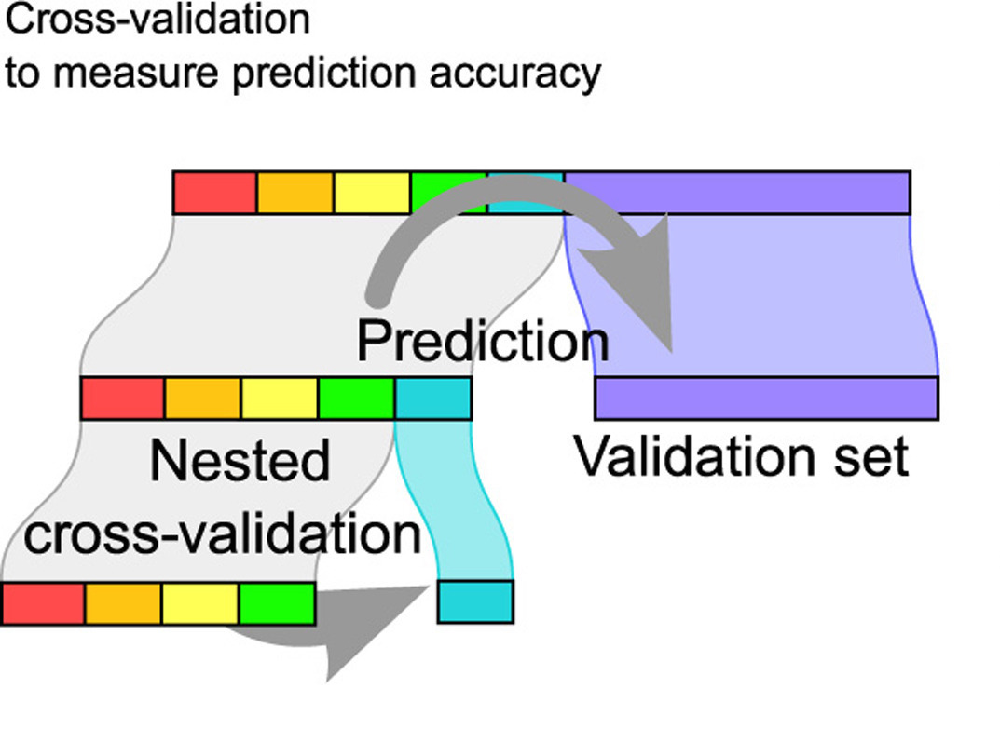

# Inference for regression {#inference-reg}

::: {.underconstruction}
This chapter is currently under construction, however the content to be presented in this chapter is covered in the R tutorials. We encourage you to review the content there in the meantime. Click [here](https://openintrostat.github.io/ims-tutorials/08-inference-for-regression/) to take a look! 
:::

::: {.chapterintro}
We now bring together ideas of inferential analyses from Chapter \@ref(intro-stat-inference) with the descriptive models seen in Chapters \@ref(intro-linear-models) and \@ref(multi-logistic-models).  The setting is now focused on predicting a numeric response variable (for linear models) or a binary response variable (for logistic models), we continue to ask questions about the variability of the model from sample to sample.  The sampling variability will inform the conclusions about the population that can be drawn.

Many of the inferential ideas are remarkably similar to those covered in previous chapters.  The technical conditions for linear models are typically assessed graphically, although independence of observations continues to be of utmost importance.  

We encourage the reader to think broadly about the models at hand without putting too much dependence on the exact p-values that are reported from the statistical software.  Inference on models with multiple explanatory variables can suffer from data snooping which result in false positive claims.  We provide some guidance and hope the reader will further their statistical learning after working through the material in this text.
:::


## Inference for linear regression {#inferenceForLinearRegression}


In this chapter, we bring together the inferential ideas (see Chapter \@ref(intro-stat-inference)) used to make claims about a population from information in a sample and the modeling ideas seen in Chapters \@ref(intro-linear-models) and \@ref(multi-logistic-models). 
In particular, we will use the least squares regression line to test whether or not there is a relationship between two continuous variables. 
Additionally, we will build confidence intervals which quantify the slope of the linear regression line.


#### Observed data {-}

We start the chapter with a hypothetical example describing the linear relationship between dollars spent advertising for a chain sandwich restaurant and monthly revenue.  The hypothetical example serves the purpose of illustrating how a linear model varies from sample to sample.  Because we have made up the example and the data (and the entire population), we can take many many samples from the population to visualize the variability.  Note that in real life, we always have exactly one sample (that is, one dataset), and through the inference process, we imagine what might have happened had we taken a different sample.  The change from sample to sample leads to an understanding of how the single observed dataset is different from the population of values, which is typically the fundamental goal of inference. 

Consider the following hypothetical population of all of the sandwich stores of a particular chain seen in Figure \@ref(fig:sandpop).
In this made-up world, the CEO actually has all the relevant data, which is why they can plot it here.
The CEO is omniscient and can write down the population model which describes the true population relationship between the advertising dollars and revenue.
There appears to be linear relationship between advertising dollars and revenue (both in $000).

```{r sandpop, fig.cap = "Revenue as a linear model of advertising dollars for a population of sandwich stores, in $000.", echo = FALSE, message = FALSE, warning = FALSE}
set.seed(4747)
popsize <- 1000
ad <- rnorm(popsize, 4, 1)
rev <- 12 + 4.7 * ad + rnorm(popsize, 0, 8)
sandwich <- data.frame(ad, rev)


#lm(rev ~ ad, data = sandwich) %>% tidy()

ggplot(sandwich, aes(x = ad, y = rev)) +
  geom_point() +
  geom_smooth(method = "lm", se = FALSE, col = COL[1,1], fullrange = TRUE) + 
  xlab("amount spent on advertising in thousands of dollars") +
  ylab("revenue in thousands of dollars")+
  ggtitle("Hypothetical population, chain sandwich store") +
  ylim(c(0,65))
```

You may remember from Chapter \@ref(intro-linear-models) that the population model is: $$y = \beta_0 + \beta_1 x + \varepsilon.$$

Again, the omniscient CEO (with the full population information) can write down the true population model as: $$\mbox{expected revenue} = 11.23 + 4.8 \cdot \mbox{advertising}.$$


#### Variability of the statistic {-}

Unfortunately, in our scenario, the CEO is not willing to part with the full set of data, but they will allow potential franchise buyers to see a small sample of the data in order to help the potential buyer decide whether or not set up a new franchise.
The CEO is willing to give each potential franchise buyer a random sample of data from 20 stores.

As with any numerical characteristic which describes a subset of the population, the estimated slope of a sample will vary from sample to sample.
Consider the linear model which describes revenue (in \$000) based on advertising dollars (in \$0000).  

The least squares regression model uses the data to find a sample linear fit:  $$\hat{y} = b_0 + b_1 x.$$

A random sample of 20 stores shows a different least square regression line depending on which observations are selected.
A subset of size 20 stores shows a similar positive trend between advertising and revenue (to what we saw in Figure \@ref(fig:sandpop) which described the population) despite having fewer observations on the plot.

```{r echo = FALSE}
set.seed(470)
sandwich2 <- sandwich %>% 
  sample_n(size=20) 
sandwich3 <- sandwich %>%
  sample_n(size=20)
sandwich_many <- sandwich %>%
  rep_sample_n(size = 20, replace = FALSE, reps = 50)
```


```{r echo = FALSE, fig.cap = "A random sample of 20 stores from the entire population. A linear trend between advertising and revenue continues to be observed."}
ggplot(sandwich2) +
  geom_point(aes(x = ad, y = rev)) +
  geom_smooth(aes(x = ad, y = rev), method = "lm", se = FALSE, 
              color = COL[1,1], fullrange = TRUE) +
  xlab("amount spent on advertising in thousands of dollars") +
  ylab("revenue in thousands of dollars") +
  ylim(c(0,65))
```


A second sample of size 20 also shows a positive trend!

```{r echo = FALSE, fig.cap = "A different random sample of 20 stores from the entire population. Again, a linear trend between advertising and revenue is observed."}

ggplot(sandwich3) +
  geom_point(aes(x = ad, y = rev)) +
  geom_smooth(aes(x = ad, y = rev), method = "lm", se = FALSE, 
              color = COL[4,1], fullrange = TRUE) +
  xlab("amount spent on advertising in thousands of dollars") +
  ylab("revenue in thousands of dollars") +
  ylim(c(0,65))
```


But the line is slightly different!

```{r echo = FALSE, fig.cap = "The linear models from the two different random samples are quite similar, but they are not the same line."}
ggplot(sandwich2, aes(x = ad, y = rev)) + geom_point(color=COL[1,1]) + 
  geom_smooth(method="lm", se=FALSE, color=COL[1,1], fullrange = TRUE) + 
  geom_point(data=sandwich3, color=COL[4,1]) +
  geom_smooth(data=sandwich3, method="lm", se=FALSE, color=COL[4,1], fullrange = TRUE) +
  xlab("amount spent on advertising in thousands of dollars") +
  ylab("revenue in thousands of dollars") +
  ylim(c(0,65))
```


That is, there is **variability** in the regression line from sample to sample.  The concept of the sampling variability is something you've seen before, but in this lesson, you will focus on the variability of the line often measured through the variability of a single statistic:  **the slope of the line**.

```{r slopes, echo = FALSE, fig.cap = "If repeated samples of size 20 are taken from the entire population, each linear model will be slightly different. The red line provides the linear fit to the entire population."}
ggplot() + 
 # geom_point() + 
  geom_smooth(data = sandwich_many, aes(x=ad, y=rev, group = replicate), 
              method="lm", se=FALSE, color=COL[1,1], fullrange = TRUE) +
  geom_smooth(data = sandwich, aes(x=ad, y=rev), method = "lm", se = FALSE, 
              fullrange = TRUE, col = COL[4,1]) + 
  xlab("amount spent on advertising in thousands of dollars") +
  ylab("revenue in thousands of dollars") +
  ylim(c(0,65))
```  


You might notice in Figure \@ref(fig:slopes) that the $\hat{y}$ values given by the lines are much more consistent in the middle of the dataset than at the ends.  The reason is that the data itself anchors the lines in such a way that the line must pass through the center of the data cloud.  The effect of the fan-shaped lines is that predicted revenue for advertising close to \$4,000 will be much more precise than the revenue predictions made for \$1,000 or \$7,000 of advertising.

The distribution of slopes (for samples of size $n=20$) can be seen in a histogram, as in Figure \@ref(fig:sand20lm).

```{r sand20lm, echo = FALSE, fig.cap="Variability of slope estimates taken from many different samples of stores, each of size 20."}
sandwich_many_lm <- sandwich_many %>% 
  group_by(replicate) %>% 
  do(tidy(lm(rev ~ ad, data=.))) %>%
  filter(term=="ad")

ggplot(sandwich_many_lm, aes(x=estimate)) + 
  geom_histogram() +
  xlab("slope estimate")
```

Recall, the example described in this introduction is hypothetical.
That is, we created an entire population in order demonstrate how the slope of a line would vary from sample to sample.
The tools in this textbook are designed to evaluate only one single sample of data.  
With actual studies, we do not have repeated samples, so we are not able to use repeated samples to visualize the variability in slopes.
We have seen variability in samples throughout this text, so it should not come as a surprise that different samples will produce different linear models.
However, it is nice to visually consider the linear models produced by different slopes.
Additionally, as with measuring the variability of previous statistics (e.g., $\overline{X}_1 - \overline{X}_2$ or $\hat{p}_1 - \hat{p}_2$), the histogram of the sample statistics can provide information related to inferential considerations.

In the following sections, the distribution (i.e., histogram) of $b_1$ (the estimated slope coefficient) will be constructed in the same three ways that, by now, may be familiar to you.
First (in Section \@ref(randslope)), the distribution of $b_1$ when $\beta_1 = 0$ is constructed by randomizing (permuting) the response variable.
Next (in Section \@ref(bootbeta1)), we can bootstrap the data by taking random samples of size n from the original dataset.
And last (in Section \@ref(mathslope)), we use mathematical tools to describe the variability using the $t$-distribution that was first encountered in Section \@ref(one-mean-math).  

### Randomization test for $H_0: \beta_1= 0$ {#randslope}

Consider the data on Global Crop Yields compiled by [Our World in Data](https://ourworldindata.org/crop-yields) and presented as part of the [TidyTuesday](https://github.com/rfordatascience/tidytuesday/trunk/data/2020/2020-09-01) series seen in Figure \@ref(fig:allcrops).  The scientific research interest at hand will be in determining the linear relationship between wheat yield (for a country-year) and other crop yields.  The dataset is quite rich and deserves exploring, but for this example, we will focus only on the annual crop yield in the United States.  

```{r allcrops, echo = FALSE, fig.cap = "Yield (in tonnes per hectare) for six different crops in the US.  The color of the dot indicates the year."}
key_crop_yields <- readr::read_csv('https://raw.githubusercontent.com/rfordatascience/tidytuesday/master/data/2020/2020-09-01/key_crop_yields.csv') %>%
  rename(wheat = `Wheat (tonnes per hectare)`,
         rice = `Rice (tonnes per hectare)`,
         maize = `Maize (tonnes per hectare)`,
         soybeans = `Soybeans (tonnes per hectare)`,
         potatoes = `Potatoes (tonnes per hectare)`,
         beans = `Beans (tonnes per hectare)`,
         peas = `Peas (tonnes per hectare)`,
         cassava = `Cassava (tonnes per hectare)`,
         barley = `Barley (tonnes per hectare)`,
         cocoa = `Cocoa beans (tonnes per hectare)`,
         bananas = `Bananas (tonnes per hectare)`)
  
crops_USA <- key_crop_yields %>%
  filter(Code == "USA") %>%
  select(-cassava, -cocoa, -potatoes, -bananas)

crops_USA_long <- crops_USA %>%
  pivot_longer(rice:barley,
    names_to = "crop", values_to = "yield")

ggplot(crops_USA_long)   +
    geom_point(aes(x = yield, y = wheat, color = Year)) +
  facet_wrap(~crop) + 
  ylim(c(1.4, 3.6))
```


As you have seen previously, statistical inference typically relies on setting a null hypothesis which is hoped to be subsequently rejected.  In the linear model setting, we might hope to have a linear relationship between `maize` and `wheat` in settings where `maize` production is known and `wheat` production needs to be predicted.  

The relevant hypotheses for the linear model setting can be written in terms of the population slope parameter.  Here the population refers to a larger set of years where `maize` and `wheat` are both grown in the US.

* $H_0: \beta_1= 0$, there is no linear relationship between `wheat` and `maize`.  
* $H_A: \beta_1 \ne 0$, there is some linear relationship between `wheat` and `maize`.

Recall that for the randomization test, we permute one variables to eliminate any existing relationship between the variables.  That is, we set the null hypothesis to be true, and we measure the natural variability in the data due to sampling but **not** due to variables being correlated.  Figure \@ref(fig:permwheatScatter) shows the observed data and a scatterplot of one permutation of the `wheat` variable.  The careful observer can see that each of the observed the values for `wheat` (and for `maize`) exist in both the original data plot as well as the permuted `wheat` plot, but the given `wheat` and `maize` yields are no longer matched for a given year.  That is, each `wheat` yield is randomly assigned to a new `maize` yield.

```{r permwheatScatter, fig.cap = "Original (left) and permuted (right) data.  The permutation removes the linear relationship between `wheat` and `maize`.  Repeated permutations allow for quantifying the variability in the slope under the condition that there is no linear relationship (i.e., that the null hypothesis is true).", fig.show = 'hold', out.width='47%', fig.ncol = 2}
set.seed(4747)
ggplot(crops_USA) +
  geom_point(aes(x = maize, y = wheat)) +
  ggtitle("Original Data") + 
  ylim(c(1.4, 3.6))

ggplot(crops_USA) +
  geom_point(aes(x = maize, y = sample(wheat))) +
  ylab("permuted wheat") +
  ggtitle("Permuted Data") + 
  ylim(c(1.4, 3.6))
```


By repeatedly permuting the response variable any pattern in the linear model that is observed is due only to random chance (and not an underlying relationship).  The randomization test compares the slopes calculated from the permuted response variable with the observed slope.  If the observed slope is inconsistent with the slopes from permuting, we can conclude that there is some underlying relationship (and that the slope is not merely due to random chance).

#### Observed data {-}

We will continue to use the crop data to investigate the linear relationship between `wheat` and `maize`.  Note that the least squares model (see Chapter \@ref(intro-linear-models) ) describing the relationship is given in Table \@ref(tab:lsCrops).  The columns in Table \@ref(tab:lsCrops) are further described in Section \@ref(mathslope).

```{r lsCrops}
lm(wheat ~ maize, data = crops_USA) %>% 
  tidy() %>%
 kable(caption = "The least squares estimates of the intercept and slope are given in the `estimate` column.  The observed slope is 0.195.") %>%
 kable_styling() 
```

#### Variability of the statistic {-}

After permuting the data, the least squares estimate of the line can be computed.  Repeated permutations and slope calculations describe the variability in the line (i.e., in the slope) due only to the natural variability and not due to a relationship between `wheat` and `maize`.  Figure \@ref(fig:permwheatlm) shows two different permutations of `wheat` and the resulting linear models.

```{r permwheatlm, fig.cap = "Two different permutations of the wheat variable with slightly different least squares regression lines.", fig.show = 'hold', fig.ncol = 2, out.width='47%'}
set.seed(47)
ggplot(crops_USA, aes(x = maize, y = sample(wheat))) +
  geom_point() +
  geom_smooth(method = "lm", se = FALSE, col = COL[1,1], fullrange = TRUE) +
  ylab("permuted wheat") +
  ggtitle("First Permutation of Wheat") + 
  ylim(c(1.4, 3.6))

ggplot(crops_USA, aes(x = maize, y = sample(wheat))) +
  geom_point() +
  geom_smooth(method = "lm", se = FALSE, col = COL[4,1], fullrange = TRUE) +
  ylab("permuted wheat") +
  ggtitle("Second Permutation of Wheat") + 
  ylim(c(1.4, 3.6))
```


As you can see, sometimes the slope of the permuted data is positive, sometimes it is negative.  Because the randomization happens under the condition of no underlying relationship (because the response variable is completely mixed with the explanatory variable), we expect to see the center of the randomized slope distribution to be zero.

#### Observed statistic vs. null statistics {-}

```{r nulldistCrop, echo=FALSE, fig.cap = "Histogram of slopes given different permutations of the wheat variable.  The vertical red line is at the observed value of the slope, 0.195."}
perm_slope <- crops_USA %>%
   specify(wheat ~ maize) %>%
   hypothesize(null = "independence") %>%
   generate(reps = 1000, type = "permute") %>%
   calculate(stat = "slope") 
 
obs_slope <- crops_USA %>%
   specify(wheat ~ maize) %>%
   calculate(stat = "slope") %>% pull()
  
ggplot(data=perm_slope, aes(x=stat)) + 
   geom_histogram() +
  geom_vline(xintercept = obs_slope, col = COL[4,1])
```

As we can see from Figure \@ref(fig:nulldistCrop), a slope estimate as extreme as the observed slope estimate (the red line) never happened in many repeated permutations of the `wheat` variable.
That is, if indeed there were no linear relationship between `wheat` and `maize`, the natural variability of the slopes would produce estimates between approximately -0.1 and +0.1.
We reject the null hypothesis.
Therefore, we believe that the slope observed on the original data is not just due to natural variability and indeed, there is a linear relationship between `wheat` and `maize` crop yield in the US.


### Bootstrap confidence interval for $\beta_1$ {#bootbeta1}


As we have seen in previous chapters, we can use bootstrapping to estimate the sampling distribution of the statistic of interest (here, the slope) without the null assumption of no relationship (which was the condition in the randomization test).  Because interest is now in creating a CI, there is no null hypothesis, so there won't be any reason to permute either of the variables.


#### Observed data {-}

Returning to the crop data, we may want to consider the relationship between `peas` and `wheat`.  Are `peas` a good predictor of `wheat`?  And if so, what is their relationship?  That is, what is the slope that models `average wheat yield` as a function of `peas`?

```{r echo = FALSE}
set.seed(4747)
crops4 <- crops_USA %>% 
  sample_n(size=58, replace = TRUE) 
crops5 <- crops_USA %>%
  sample_n(size=58, replace = TRUE)
crops_many_BS <- crops_USA %>%
  rep_sample_n(size = 58, replace = TRUE, reps = 50)
```


```{r peasPlot, echo = FALSE, fig.cap = "Original data: wheat yield as a linear model of peas yield, in tonnes per hectare.  Notice that the relationship between `peas` and `wheat` is not as strong as the relationship we saw previously between `maize` and `wheat`."}
ggplot(crops_USA) +
  geom_point(aes(x = peas, y = wheat)) +
  geom_smooth(aes(x = peas, y = wheat), method = "lm", se = FALSE,
              color=COL[1,1], fullrange = TRUE) + 
  ylim(c(1.4, 3.6))
```


#### Variability of the statistic {-}

Because we are not focused on a null distribution, we sample with replacement $n=58$ observations from the original dataset.  Recall that with bootstrapping we always resample the same number of observations as we start with in order to mimic the process of taking a sample from the population.  When sampling in the linear model case, consider each observation to be a single dot.  If the dot is resampled, both the `wheat` and the `peas` measurement are observed.  The measurements are linked to the dot (i.e., to the year in which the measurements were taken).

```{r crop2BS, echo = FALSE, fig.cap = "Original and one bootstrap sample of the crop data.  Note that it is difficult to differentiate the two plots, as (within a single bootstrap sample) the observations which have been resampled twice are plotted as points on top of one another.  The orange circle represent points in the original data which were not included in the bootstrap sample.  The blue circle represents a point that was repeatedly resampled (and is therefore darker) in the bootstrap sample.  The green circle represents a particular structure to the data which is observed in both the original and bootstrap samples.",  fig.show = 'hold', out.width = '47%', fig.ncol = 2}

ggplot(crops_USA) +
  geom_point(aes(x = maize, y = wheat), alpha = 0.4) +
  geom_smooth(aes(x = maize, y = wheat), method = "lm", se = FALSE,
              col=COL[1,1], fullrange = TRUE) +
  ggtitle("Original crop data.") +
  geom_point(x = 8.38, y = 2.89, col = COL[2,1], pch = 1, size=8) +
  geom_point(x = 4.15, y = 1.7, col = COL[4,1], pch = 1, size=8) +
  geom_point(x = 5.53, y = 2.28, col = COL[1,1], pch = 1, size=8) + 
  ylim(c(1.4, 3.6))


ggplot(crops5) +
  geom_point(aes(x = maize, y = wheat), alpha = 0.4) +
  geom_smooth(aes(x = maize, y = wheat), method = "lm", se = FALSE,
              col=COL[1,1], fullrange = TRUE) +
  ggtitle("Bootstrap sample from the crop data.") +
  geom_point(x = 8.38, y = 2.89, col = COL[2,1], pch = 1, size=8) +
  geom_point(x = 4.15, y = 1.7, col = COL[4,1], pch = 1, size=8) +
  geom_point(x = 5.53, y = 2.28, col = COL[1,1], pch = 1, size=8) + 
  ylim(c(1.4, 3.6))
```

Figure \@ref(fig:crop2BS) shows the original data as compared with a single bootstrap sample, resulting in (slightly) different linear models.
The orange circle represent points in the original data which were not included in the bootstrap sample.
The blue circle represents a point that was repeatedly resampled (and is therefore darker) in the bootstrap sample.
The green circle represents a particular structure to the data which is observed in both the original and bootstrap samples.
By repeatedly resampling, we can see dozens of bootstrapped slopes on the same plot in Figure \@ref(fig:cropBS).


```{r cropBS, echo = FALSE, fig.cap = "Repeated bootstrap resamples of size 58 are taken from the original data.  Each of the bootstrapped linear model is slightly different."}
ggplot(crops_many_BS, aes(x=peas, y=wheat, group=replicate)) + 
  #geom_point() + 
  geom_smooth(method="lm", se=FALSE, color=COL[1,1], fullrange = TRUE) + 
  ylim(c(1.4, 3.6))
```  


Recall that in order to create a confidence interval for the slope, we need to find the range of values that the statistic (here the slope) takes on from different bootstrap samples.
Figure \@ref(fig:peasBSslopes) is a histogram of the relevant bootstrapped slopes.
We can see that a 95% bootstrap percentile interval for the true population slope is given by (0.061, 0.52).
We are 95% confident that for the model describing the population of crops of `peas` and `wheat`, a one unit increase in `peas` yield (in tonnes per hectare) will be associated with an increase in predicted average `wheat` yield of between 0.061 and 0.52 tonnes per hectare.


```{r peasBSslopes, fig.cap="The original crop data on wheat and peas is bootstrapped 1,000 times. The histogram provides a sense for the variability of the standard deviation of the linear model slope from sample to sample.", warning=FALSE, fig.width=15}

set.seed(4747)
crops_many_lm_BS <- crops_many_BS %>% 
  group_by(replicate) %>% 
  do(tidy(lm(wheat ~ peas, data=.))) %>%
  filter(term=="peas") %>%
  select(estimate) %>%
  pull()

bsq1 <- quantile(crops_many_lm_BS, probs = c(0.005, 0.025, 0.05, 0.1, 0.9, 0.95, 0.975, 0.995))

bsmeans_up <- crops_many_lm_BS[crops_many_lm_BS >= bsq1[7]]
bsmeans_low <- crops_many_lm_BS[crops_many_lm_BS <= bsq1[2]]

umeans <- sort(unique(crops_many_lm_BS))
bin.width <- (umeans[length(umeans)] - umeans[1])/15
#breaks <- c(uprops - bin.width / 4, uprops + bin.width / 4)
breaks <- seq(umeans[1]-.01, umeans[length(umeans)] + bin.width, by = bin.width)
  

histPlot(crops_many_lm_BS, breaks = breaks, axes = FALSE, col = rgb(1,1,1),
     xlab = "", ylab="")
#histPlot(bsmeans_up, breaks = breaks, col = COL[1], add = TRUE)
#histPlot(bsmeans_low, breaks = breaks, col = COL[1], add = TRUE)
axis(1)
#axis(2, at = seq(0, 100, 50), labels = format(seq(0, 50, 25) / nsim))
#lines(c(bsq1[6], bsq1[6]), c(0, 125), lty = 3, lwd = 3)
#lines(c(bsq1[3], bsq1[3]), c(0, 125), lty = 3, lwd = 3)
lines(c(bsq1[7], bsq1[7]), c(0, 2), lty = 3, lwd = 3)
lines(c(bsq1[2], bsq1[2]), c(0, 2), lty = 3, lwd = 3)
#lines(c(bsq1[8], bsq1[8]), c(0, 55), lty = 3, lwd = 3)
#lines(c(bsq1[1], bsq1[1]), c(0, 55), lty = 3, lwd = 3)
#text(bsq1[6], 140, "95 percentile", pos = 3)
#text(bsq1[3], 140, "5 percentile", pos = 3)
text(bsq1[7], 4, "97.5 percentile", pos = 3, cex = 2)
text(bsq1[2], 4, "2.5 percentile", pos = 3, cex = 2)
#text(bsq1[8], 70, "99.5 percentile", pos = 3)
#text(bsq1[1], 70, "0.5 percentile", pos = 3)
#text(bsq1[6], 130, round(bsq1[6],1), pos = 3)
#text(bsq1[3], 130, round(bsq1[3],1), pos = 3)
text(bsq1[7], 3.5, round(bsq1[7],3), pos = 3, cex = 2)
text(bsq1[2], 3.5, round(bsq1[2],3), pos = 3, cex = 2)
#text(bsq1[8], 60, round(bsq1[8],1), pos = 3)
#text(bsq1[1], 60, round(bsq1[1],1), pos = 3)
par(las = 0)
mtext("Bootstrapped values of the slope statistic describing wheat and peas.", 1, 2.5)
```


### Mathematical model {#mathslope}

When certain technical conditions apply, it is convenient to use mathematical approximations to test and estimate the slope parameter. 
The approximations will build on the t-distribution which were described in Chapter \@ref(inference-num). 
The mathematical model is often correct and is usually easy to implement computationally.
The validity of the technical conditions will be considered in detail in Section \@ref(tech-cond-linmod). 


In this section, we discuss uncertainty in the estimates of the slope
and y-intercept for a regression line. Just as we identified standard
errors for point estimates in previous chapters, we first discuss
standard errors for these new estimates.

#### Midterm elections and unemployment {-}

##### Observed data {-}

\index{data!midterm elections|(}

Elections for members of the United States House of Representatives
occur every two years, coinciding every four years with the U.S.
Presidential election. The set of House elections occurring during the
middle of a Presidential term are called midterm elections. In America's two-party
system (the vast majority of House members through history have been either Republicans or Democrats), one political theory suggests the higher the unemployment rate,
the worse the President's party will do in the midterm elections.  In 2020 there were 232 Democrats, 198 Republicans, and 1 Libertarian in the House.

\indexthis{midterm elections}{midterm election}

To assess the validity of this claim, we can compile historical data and
look for a connection. We consider every midterm election from 1898 to
2018, with the exception of those elections during the Great Depression.
The House of Representatives is made up of 435 voting members

Figure \@ref(fig:unemploymentAndChangeInHouse) shows these data and the
least-squares regression line: 
$$\begin{aligned}
&\text{% change in House seats for President's party}  \\
&\qquad\qquad= -7.36 - 0.89 \times \text{(unemployment rate)}\end{aligned}$$
We consider the percent change in the number of seats of the President's
party (e.g. percent change in the number of seats for Republicans in
2018) against the unemployment rate.

Examining the data, there are no clear deviations from linearity or substantial outliers (see Section \@ref(resids) for a discussion on using residuals to visualize how well a linear model fits the data).
While the data are collected sequentially, a separate analysis was used to check for any apparent correlation between successive observations; no such correlation was found.

```{r unemploymentAndChangeInHouse, fig.cap="The percent change in House seats for the President's party in each election from 1898 to 2010 plotted against the unemployment rate. The two points for the Great Depression have been removed, and a least squares regression line has been fit to the data.", warning=FALSE, fig.width=15}

d <- midterms_house
th <- !d$year %in% c(1935, 1939)
plot(d$unemp[th], d$house_change[th],
     # col = COL[ifelse(d$party[th] == "Republican", 4, 1)],
     pch = 19,
     xlim = c(3, 12),
     ylim = c(-30, 13),
     axes = FALSE,
     type = 'n',
     xlab = '',
     ylab = paste0("Percent Change in Seats of\n",
                  "President's Party in House of Rep."))
mtext('Percent Unemployment', 1, 2)
abline(h = seq(-100, 100, 10), col = COL[7, 3], lwd = 2)
abline(h = seq(-105, 100, 10), col = COL[7, 3], lwd = 0.7)
abline(v = seq(-100, 100, 4), col = COL[7, 3], lwd = 2)
abline(v = seq(-102, 100, 4), col = COL[7, 3], lwd = 0.7)
repub <- (d$party[th] == "Republican")
points(d$unemp[th], d$house_change[th],
       col = COL[ifelse(repub, 4, 1)],
       pch = ifelse(repub, 17, 19))
AxisInPercent(1, at = seq(0, 20, 4))
AxisInPercent(2, at = seq(-100, 100, 10))
box()
cases <- c(1, 22, 25, 27, 29, 31)
for (i in 1:length(cases)) {
  potus  <- as.character(d$potus[cases[i]])
  potus  <- tail(strsplit(potus, " ")[[1]], 1)
  year   <- d$year[cases[i]]-1
  potus  <- paste0(potus, "\n", year)
  unem   <- d$unemp[cases[i]]
  change <- d$house_change[cases[i]]
  text(unem, change, potus, pos = 3, cex = 0.6)
}

#summary(lm(house_change ~ unemp, d))

g <- lm(house_change ~ unemp, d[th,])
#summary(g)
abline(g, col = COL[5])
legend('topright',
       bg = "#FFFFFF",
       pch = c(19, 17),
       col = COL[c(1, 4)],
       legend = c("Democrat", "Republican"))


```


::: {.guidedpractice}
The data for the Great Depression (1934 and 1938) were removed because
the unemployment rate was 21% and 18%, respectively. Do you agree that
they should be removed for this investigation? Why or why not?^[The answer to this question relies on the idea that statistical data analysis is somewhat of an art. That is, in many situations, there is no "right" answer. As you do more and more analyses on your own, you will come to recognize the nuanced understanding which is needed for a particular dataset.  In terms of the Great Depression, we will provide two contrasting considerations.
  Each of these points would have very high leverage on any
  least-squares regression line, and years with such high
  unemployment may not help us understand what would happen
  in other years where the unemployment is only modestly high.
  On the other hand, these are exceptional cases, and we would
  be discarding important information if we exclude them from
  a final analysis.]
:::
  
There is a negative slope in the line shown in Figure \@ref(fig:unemploymentAndChangeInHouse). However, this slope (and the
y-intercept) are only estimates of the parameter values. We might
wonder, is this convincing evidence that the "true" linear model has a
negative slope? That is, do the data provide strong evidence that the
political theory is accurate, where the unemployment rate is a useful
predictor of the midterm election? We can frame this investigation into
a statistical hypothesis test:

* $H_0$: $\beta_1 = 0$. The true linear model has slope zero.  
* $H_A$: $\beta_1 \neq 0$. The true linear model has a slope different than
    zero. The unemployment is predictive of whether the President's
    party wins or loses seats in the House of Representatives.

We would reject $H_0$ in favor of $H_A$ if the data provide strong
evidence that the true slope parameter is different than zero. To assess
the hypotheses, we identify a standard error for the estimate, compute
an appropriate test statistic, and identify the p-value.

#### Regression output from software {-}


##### Variability of the statistic {-}

Just like other point estimates we have seen before, we can compute a
standard error and test statistic for $b_1$. We will generally label the
test statistic using a $T$, since it follows the $t$-distribution.

We will rely on statistical software to compute the standard error and
leave the explanation of how this standard error is determined to a
second or third statistics course.
Table \@ref(tab:midtermUnempRegTable) shows software output for the least
squares regression line in Figure \@ref(fig:unemploymentAndChangeInHouse). The row labeled `unemp` includes all relevant information about the slope estimate (i.e., the coefficient of the unemployment variable).


```{r midtermUnempRegTable}
d <- midterms_house
th <- !d$year %in% c(1935, 1939)
lm(house_change ~ unemp, d[th,]) %>% 
  tidy() %>%
 kable(caption = "Output from statistical software for the regression
    line modeling the midterm election losses for the
    President's party as a response to unemployment.") %>%
 kable_styling() 
```

::: {.example}
What do the first and second columns of Table \@ref(tab:midtermUnempRegTable)  represent?

---

The entries in the first column represent the least squares estimates, $b_0$ and $b_1$, and the values in the second column correspond to the standard errors of each
estimate. Using the estimates, we could write the equation for the least
square regression line as $$\begin{aligned}
  \hat{y} = -7.36 - 0.89 x
  \end{aligned}$$ where $\hat{y}$ in this case represents the predicted
change in the number of seats for the president's party, and $x$
represents the unemployment rate.
:::

We previously used a $t$-test statistic for hypothesis testing in the
context of numerical data. Regression is very similar. In the hypotheses
we consider, the null value for the slope is 0, so we can compute the
test statistic using the T-score formula: 
$$\begin{aligned}
T
  = \frac{\text{estimate} - \text{null value}}{\text{SE}}
  = \frac{-0.89 - 0}{0.835}
  = -1.07\end{aligned}$$ This corresponds to the third column of
Table \@ref(tab:midtermUnempRegTable) .


::: {.example}
Use Table \@ref(tab:midtermUnempRegTable) to determine the p-value for the
hypothesis test. 

---

The last column of the table gives the p-value for the
two-sided hypothesis test for the coefficient of the unemployment rate:
0.2961. That is, the data do not provide convincing evidence that a
higher unemployment rate has any correspondence with smaller or larger
losses for the President's party in the House of Representatives in
midterm elections.
:::


##### Observed statistic vs. null statistics {-}

As the final step in a mathematical hypothesis test for the slope, we use the information provided to make a conclusion about whether or not the data could have come from a population where the true slope was zero (i.e., $\beta_1 = 0$).    Before evaluating the formal hypothesis claim, sometimes it is important to check your intuition.  Based on everything we've seen in the examples above describing the variability of a line from sample to sample, as yourself if the linear relationship given by the data could have come from a population in which the slope was truly zero.


::: {.example}
Examine Figure \@ref(fig:elmhurstScatterWLSROnly-CLTsection), which relates the Elmhurst College
aid and student family income. How sure are you that the slope is
statistically significantly different from zero? That is, do you think a
formal hypothesis test would reject the claim that the true slope of the
line should be zero?

---

While the relationship between the variables is not perfect, there is an evident decreasing trend in the data.
This suggests the hypothesis test will reject the null claim that the slope is zero.
:::


The point of the tools in this section are to go beyond a visual interpretation of the linear relationship toward a formal mathematical claim about the statistical significance of the slope estimate.

```{r rOutputForIncomeAidLSRLineInInferenceSection}
d <- elmhurst
d$gift_aid <- d$gift_aid * 1000
d$family_income <- d$family_income * 1000
lm(gift_aid ~ family_income, d) %>% 
  tidy() %>%
 kable(caption = "Summary of least squares fit for the Elmhurst College data, where we are predicting the gift aid by the university based on the family income of students.") %>%
 kable_styling() 
```


::: {.guidedpractice}
Table \@ref(tab:rOutputForIncomeAidLSRLineInInferenceSection) shows
statistical software output from fitting the least squares regression
line shown in Figure \@ref(fig:elmhurstScatterWLSROnly-CLTsection). Use the output to formally
evaluate the following hypotheses.

* $H_0$: The true coefficient for family income is zero.  
* $H_A$: The true coefficient for family income is not zero.^[We look in the second row corresponding
  to the family income variable.
  We see the point estimate of the slope of the line is -0.0431,
  the standard error of this estimate is 0.0108, and the $t$-test
  statistic is $T = -3.98$.
  The p-value corresponds exactly to the two-sided test we are
  interested in: 0.0002.
  The p-value is so small that we reject the null hypothesis
  and conclude that family income and financial aid at Elmhurst
  College for freshman entering in the year 2011 are negatively
  correlated and the true slope parameter is indeed less than 0,
  just as we believed in our analysis of Figure \@ref(fig:elmhurstScatterWLSROnly-CLTsection).]
:::  


::: {.important}
**Inference for regression**
We usually rely on statistical software to
identify point estimates, standard errors, test statistics, and p-values
in practice. However, be aware that software will not generally check
whether the method is appropriate, meaning we must still verify
conditions are met.  See Section \@ref(tech-cond-linmod).
:::


#### Confidence interval for a coefficient {-}

##### Observed data {-}

Similar to how we can conduct a hypothesis test for a model coefficient
using regression output, we can also construct a confidence interval for
that coefficient.

::: {.example}
Compute the 95% confidence interval for the coefficient using the
regression output from Table \@ref(tab:rOutputForIncomeAidLSRLineInInferenceSection). 

---

The point estimate is -0.0431 and the standard error is $SE = 0.0108$. When
constructing a confidence interval for a model coefficient, we generally
use a $t$-distribution. The degrees of freedom for the distribution are
noted in the regression output, $df = 48$, allowing us to identify
$t_{48}^{\star} = 2.01$ for use in the confidence interval.

We can now construct the confidence interval in the usual way:
$$\begin{aligned}
  \text{point estimate} \pm t_{48}^{\star} \times SE
    \qquad\to\qquad -0.0431 \pm 2.01 \times 0.0108
    \qquad\to\qquad (-0.0648, -0.0214)
  \end{aligned}$$ We are 95% confident that with each dollar increase in
, the university's gift aid is predicted to decrease on average by
\$0.0214 to \$0.0648.
:::

##### Variability of the statistic {-}

::: {.important}
**Confidence intervals for coefficients** 

Confidence intervals for model
coefficients (e.g., the intercept or the slope) can be computed using the $t$-distribution:
$$\begin{aligned}
  b_i \ \pm\ t_{df}^{\star} \times SE_{b_{i}}
  \end{aligned}$$ where $t_{df}^{\star}$ is the appropriate $t$-value
corresponding to the confidence level with the model's degrees of
freedom.
:::

On the topic of intervals in this book, we've focused exclusively on
confidence intervals for model parameters. However, there are other
types of intervals that may be of interest, including prediction
intervals for a response value and also confidence intervals for a mean
response value in the context of regression. 

<!--These two interval types
are introduced in an online extra that you may download at

\oiRedirect{stat_extra_linear_regression_supp}
    {www.openintro.org/d?file=stat\_extra\_linear\_regression\_supp}

-----------
-->


### Exercises {#inference-single-regression-exercises}

::: {.underconstruction}
Exercises for this section are under construction.
:::

## Checking model conditions {#tech-cond-linmod}

In the previous sections, we used randomization and bootstrapping to perform inference when the mathematical model was not valid due to violations of the technical conditions.  In this section, we'll provide details for when the mathematical model is appropriate and a discussion of technical conditions needed for the randomization and bootstrapping procedures.  .

#### What are the technical conditions for the mathematical model? {-}


When fitting a least squares line, we generally require

* **Linearity.**  The data should show a linear trend. If there is a nonlinear trend
    (e.g. first panel of Figure \@ref(fig:whatCanGoWrongWithLinearModel)) an advanced regression
    method from another book or later course should be applied.

* **Independent observations.**  Be cautious about applying regression to data, which are sequential
    observations in time such as a stock price each day. Such data may
    have an underlying structure that should be considered in a model
    and analysis. An example of a data set where successive observations
    are not independent is shown in the fourth panel of
    Figure \@ref(fig:whatCanGoWrongWithLinearModel). There are also other
    instances where correlations within the data are important, which is
    further discussed in
    Chapter \@ref(multi-logistic-models).
    
* **Nearly normal residuals.**  Generally, the residuals must be nearly normal. When this condition
    is found to be unreasonable, it is usually because of outliers or
    concerns about influential points, which we'll talk about more in
    Section \@ref(outliers-in-regression). An example of a
    residual that would be a potentially concern is shown in
    Figure \@ref(fig:whatCanGoWrongWithLinearModel), where one observation is
    clearly much further from the regression line than the others.

* **Constant or equal variability.**  The variability of points around the least squares line remains
    roughly constant. An example of non-constant variability is shown in
    the third panel of
    Figure \@ref(fig:whatCanGoWrongWithLinearModel), which represents the
    most common pattern observed when this condition fails: the
    variability of $y$ is larger when $x$ is larger.


```{r whatCanGoWrongWithLinearModel, fig.cap="Four examples showing when the methods in this chapter are insufficient to apply to the data. The top set of graphs represents the $x$ and $y$ relationship.  The bottom set of graphs is a residual plot.  First panel: linearity fails. Second panel: there are outliers, most especially one point that is very far away from the line. Third panel: the variability of the errors is related to the value of $x$. Fourth panel: a time series data set is shown, where successive observations are highly correlated.", warning=FALSE, fig.asp = 1.2}

source("08/figures/makeTubeAdv.R")
pch <- 20
cex <- 1.75
col <- COL[1, 3]

layout(matrix(1:8, 2),
       rep(1, 4),
       c(2, 1))

these <- simulated_scatter$group == 20
x <- simulated_scatter$x[these]
y <- simulated_scatter$y[these]
plot(x, y,
     axes = FALSE,
     pch = pch,
     cex = cex,
     col = "#00000000")
box()
makeTube(x, y,
         type = 'quad',
         addLine = FALSE,
         col = COL[7, 3])
points(x, y,
       pch = pch,
       cex = cex,
       col = COL[1, 2])
g <- lm(y ~ x)
abline(g)
yR <- range(g$residuals)
yR <- yR + c(-1, 1) * diff(yR) / 10
plot(x, g$residuals,
     xlab = "", ylab = "",
     axes = FALSE,
     pch = pch,
     cex = cex,
     col = COL[1, 2],
     ylim = yR)
abline(h = 0, lty = 2)
box()

these <- simulated_scatter$group == 21
x <- simulated_scatter$x[these]
y <- simulated_scatter$y[these]
plot(x, y,
     axes = FALSE,
     pch = pch,
     cex = cex,
     col = "#00000000")
box()
makeTube(x, y,
         addLine = FALSE,
         col = COL[7, 3])
points(x, y,
       pch = pch,
       cex = cex,
       col = COL[1,2])
g <- lm(y ~ x)
abline(g)
yR <- range(g$residuals)
yR <- yR + c(-1, 1) * diff(yR) / 10
plot(x, g$residuals,
     xlab = "", ylab = "",
     axes = FALSE,
     pch = pch,
     cex = cex,
     col = COL[1, 2],
     ylim = yR)
abline(h = 0, lty = 2)
box()

these <- simulated_scatter$group == 22
x <- simulated_scatter$x[these]
y <- simulated_scatter$y[these]
plot(x, y,
     axes = FALSE,
     pch = pch,
     cex = cex,
     col = "#00000000")
box()
makeTubeAdv(x, y,
            type = 'l',
            variance = 'l',
            bw = 0.03,
            Z = 1.7,
            col = COL[7, 3])
points(x, y,
       pch = pch,
       cex = cex,
       col = COL[1, 2])
g <- lm(y ~ x)
abline(g)
yR <- range(g$residuals)
yR <- yR + c(-1, 1) * diff(yR) / 10
plot(x, g$residuals,
     axes = FALSE,
     xlab = "", ylab = "",
     pch = pch,
     cex = cex,
     col = COL[1, 2],
     ylim = yR)
abline(h = 0, lty = 2)
box()

these <- simulated_scatter$group == 23
x <- simulated_scatter$x[these]
y <- simulated_scatter$y[these]
plot(x, y,
     axes = FALSE,
     pch = pch,
     cex = cex,
     col = "#00000000")
box()
makeTube(x, y,
         addLine = FALSE,
         col = COL[7, 3])
points(x, y,
       pch = pch,
       cex = cex,
       col = COL[1, 2])
g <- lm(y ~ x)
abline(g)
yR <- range(g$residuals)
yR <- yR + c(-1, 1) * diff(yR) / 10
plot(x, g$residuals,
     axes = FALSE,
     xlab = "", ylab = "",
     pch = pch,
     cex = cex,
     col = COL[1, 2],
     ylim = yR)
abline(h = 0, lty = 2)
box()

makeTubeAdv(x,y, col = COL[7,3])

```

::: {.guidedpractice}
Should we have concerns about applying least squares regression to the
Elmhurst data in Figure \@ref(fig:elmhurstScatterW2Lines)?^[The trend appears to be linear, the data fall around the line with no obvious outliers, the variance is roughly constant. These are also not time series observations. Least squares regression can be applied to these data.]
:::


The technical conditions are often remembered using the **LINE** mnemonic.
The linearity, normality, and equality of variance conditions usually can be assessed through residual plots, as seen in  Figure \@ref(fig:whatCanGoWrongWithLinearModel).
A careful consideration of the experimental design should be undertaken to confirm that the observed values are indeed independent.

* L: __linear__ model 
* I: __independent__ observations 
* N: points are __normally__ distributed around the line 
* E: __equal__ variability around the line for all values of the explanatory variable 


#### Why do we need technical conditions? {-}

As with other inferential techniques we have covered in this text, if the technical conditions above don't hold, then it is not possible to make concluding claims about the population.
That is, without the technical conditions, the T-score (or Z-score) will not have the assumed t-distribution (or standard normal Z distribution).
That said, it is almost always impossible to check the conditions precisely, so we look for large deviations from the conditions.
If there are large deviations, we will be unable to trust the calculated p-value or the endpoints of the resulting confidence interval.

##### What about **L**inearity? {-}

The linearity condition is among the most important if your goal is to understand a linear model between $x$ and $y$.
For example, the value of the slope will not be at all meaningful if the true relationship between $x$ and $y$ is quadratic, as in Figure \@ref(fig:notGoodAtAllForALinearModel).
Not only should we be cautious about the inference, but the model *itself* is also not an accurate portrayal of the relationship between the variables.

In Section \@ref(inf-mult-reg) we discuss model modifications that can often lead to an excellent fit of strong relationships other than linear ones.
However, an extended discussion on the different methods for modeling functional forms other than linear is outside the scope of this text.

##### What about **I**ndependence? {-}

The technical condition describing the independence of the observations is often the most crucial but also the most difficult to diagnose.  It is also extremely difficult to gather a dataset which is a true random sample from the population of interest.  (Note: a true randomized experiment from a fixed set of individuals is much easier to implement, and indeed, randomized experiments are done in most medical studies these days.)  

Dependent observations can bias results in ways that produce fundamentally flawed analyses.  That is, if you hang out at the gym measuring height and weight, your linear model is surely not a representation of all students at your university.  At best it is a model describing students who use the gym (but also who are willing to talk to you, that use the gym at the times you were there measuring, etc.).  

In lieu of trying to answer whether or not your observations are a true random sample, you might instead focus on whether or not you believe your observations are representative of the populations.
Humans are notoriously bad at implementing random procedures, so you should be wary of any process that used human intuition to balance the data with respect to, for example, the demographics of the individuals in the sample.

##### What about **N**ormality?  {-}

The normality condition requires that points vary symmetrically around the line, spreading out in a bell-shaped fashion.  You should consider the "bell" of the normal distribution as sitting on top of the line (coming off the paper in a 3-D sense) so as to indicate that the points are dense close to the line and disperse gradually as they get farther from the line.

The normality condition is less important than linearity or independence for a few reasons.
First, the linear model fit with least squares will still be an unbiased estimate of the true population model.
However, the standard errors associated with variability of the line will not be well estimated.
Fortunately the Central Limit Theorem tells us that most of the analyses (e.g., SEs, p-values, confidence intervals) done using the mathematical model will still hold (even if the data are not normally distributed around the line) as long as the sample size is large enough.
One analysis method that *does* require normality, regardless of sample size, is creating intervals which predict the response of individual outcomes at a given $x$ value, using the linear model.
One additional reason to worry slightly less about normality is that neither the randomization test nor the bootstrapping procedures require the data to be normal around the line.

##### What about **E**qual variability? {-}

As with normality, the equal variability condition (that points are spread out in similar ways around the line for all values of $x$) will not cause problems for the estimate of the linear model, for a randomization test, or for a bootstrap confidence interval.
However, data that exhibit non-equal variance across the range of x-values will have the potential to seriously mis-estimate the variability of the slope which will have consequences for the inference results (i.e., hypothesis tests and confidence intervals).

When the equal variability condition is violated and a mathematical analysis (e.g., p-value from T-score) is needed, there are existing methods which can easily handle the unequal variance (e.g., weighted least squares analysis).

Although randomization tests and bootstrapping allow us to analyze data using fewer conditions, some technical conditions are required for all methods described in this text.
We will discuss some of the extended modeling and associated inference in Section \@ref(inf-mult-reg) and Section \@ref(inf-log-reg).
However, many of the techniques used to deal with technical condition violations are outside the scope of this text, but they are taught in universities in the very next class after this one.
If you are working with linear models or curious to learn more, we recommend that you continue learning about statistical methods applicable to a larger class of datasets.  

### Exercises {#checking-model-assumptions-exercises}

## Inference for multiple regression {#inf-mult-reg}

In Chapter \@ref(multi-logistic-models), the least squares regression method was used to estimate linear models which predicted a particular response variable given more than one explanatory variable.
Here, we discuss whether each of the variables individually is a significant predictor or whether the model might be just as strong without that variable.
That is, as before, we apply inferentially methods to ask whether a variable could have come from a population where the particular coefficient at hand was zero.
If one of the linear model coefficients is truly zero (in the population), then the estimate of the coefficient (using least squares) will vary around zero.
The inference task at hand is to decide whether the coefficient's difference from zero is large enough to decide that the data cannot possibly have come from a model where the true population coefficient is zero.
Both the derivations from the mathematical model and the randomization model are beyond the scope of this book, but we are able to calculate p-values using statistical software.
We will discuss interpreting p-values in the multiple regression setting and note some scenarios where careful understanding of the context and the relationship between variables is important.


### Multiple regression output from software 

Recall the `loans` data from Chapter \@ref(multi-logistic-models).  

::: {.data}
The data can be found in the [openintro](http://openintrostat.github.io/openintro) package: [`loans_full_schema`](http://openintrostat.github.io/openintro/reference/loans_full_schema.html).
Based on the data in this dataset we have created to new variables: `credit_util` which is calculated as the total credit utilized divided by the total credit limit and `bankruptcy` which turns the number of bankruptcies to an indicator variable (0 for no bankruptcies and 1 for at least 1 bankruptcies).
We will refer to this modified dataset as `loans`.
:::

Now, our goal is to create a model where `interest_rate` can be predicted using the variables `debt_to_income`, `term`, and `credit_checks`.  
As learned in Chapter \@ref(multi-logistic-models), least squares can be used to find the coefficient estimates for the linear model.
The unknown population model can be written as:
$$E[\texttt{interest_rate}] = \beta_0 + \beta_1\times \text{debt_to_income} + \beta_2 \times \text{term} + \beta_3 \times \text{credit_checks}$$

The estimated equation for the regression model may be written as a model with three predictor variables:

$$\widehat{\texttt{interest_rate}} = 4.31 + 0.041 \times \text{debt_to_income} + 0.16 \times \text{term} + 0.25 \times \text{credit_checks}$$

```{r loansmodel}
loans <- loans_full_schema %>%
  mutate(
    credit_util = total_credit_utilized / total_credit_limit,
    bankruptcy  = as.factor(if_else(public_record_bankrupt == 0, 0, 1)),
    verified_income = droplevels(verified_income)
    ) %>%
  rename(credit_checks = inquiries_last_12m) %>%
  select(interest_rate, verified_income, debt_to_income, credit_util, bankruptcy, term, credit_checks, issue_month) 


lm(interest_rate ~ debt_to_income + term + credit_checks, data = loans) %>%
  tidy() %>%
  mutate(p.value = "<0.0001") %>%
  kable(caption = "Summary of a linear model for predicting interest rate based on the variables debt_to_income, term, and credit_checks. Each of the variables has its own coefficient estimate as well as p-value significance.") %>%
  kable_styling(full_width = FALSE)
```

Not only does Table \@ref(tab:loansmodel) provide the estimates for the coefficients, it also provides information on the inference analysis (i.e., hypothesis testing) which are the focus of this chapter.


In Section \@ref(inferenceForLinearRegression), we learned that the hypothesis test for a linear model with **one predictor** can be written as:

$$\mbox{if only one predictor }  H_0: \beta_1 = 0.$$

That is, if the true population slope is zero, the p-value measures how likely it would be to select data which produced the observed slope ($b_1$) value.

With **multiple predictors**, the hypothesis is similar, however, it is now conditioned on each of the other variables remaining in the model.

$$\mbox{if multiple predictors } H_0: \beta_i = 0 \mbox{ given other variables in the model}$$

Using the example above and focusing on each of the variable p-values (here we won't discuss the p-value associated with the intercept), we can write out the three different hypotheses:

\begin{eqnarray*}
H_0: \beta_1 = 0 && \mbox{ given term and credit_checks are included in the model}\\
H_0: \beta_2 = 0 &&\mbox{ given debt_to_income and credit_checks are included in the model}\\
H_0: \beta_3 = 0 &&\mbox{ given debt_to_income and term and are included in the model}
\end{eqnarray*}

The very low p-values from the software output tell us that each of the variables acts as an important predictor in the model, despite the inclusion of the other two.
Consider the p-value on $H_0: \beta_1$.
The low p-value says that it would be extremely unlikely to see data that produce a coefficient on `debt_to_income` as large as 0.041 (yes, that number is large in the units of the problem, it's all about context!!) if the true relationship between `debt_to_income` was non-existent (i.e., if $\beta_1 = 0$) and the model also included `term` and `credit_checks`.
The p-values on `term` and on `credit_checks` can be interpreted similarly.

Sometimes a set of predictor variables can impact the model in unusual ways, often due to the predictor variables themselves being correlated.

### Multicollinearity 

In practice, there will almost always be some degree of correlation between the explanatory variables in a multiple regression model.
For regression models, it is important to understand the entire context of the model, particularly for correlated variables.
Our discussion will focus on interpreting coefficients (and their signs) in relationship to other variables as well as the significance (i.e., the p-value) of each coefficient.  

Consider an example where we'd like to predict how much money is in a coin dish based only on the number of coins in the dish.
We ask 26 students to tell us about their individual coin dishes, collecting data on the total dollar amount, the total number of coins, and the total number of low coins.^[In all honesty, this particular dataset is fabricated, and the original idea for the problem comes from Jeff Witmer at Oberlin College.]
The number of low coins is the number of coins minus the number of quarters (a quarter is the largest commonly used US coin, at US\$ 0.25).
The collected data is given in Figure \@ref(fig:coinfig) and shows that the total amount of money is more highly correlated with the total number of coins than it is with the number of low coins.
We also note that the number of high coins and the number of low coins are positively correlated.  

```{r coinfig, fig.cap = "Plot describing the amount of money (US$) as a fucntion of the number of coins and the number of low coins.  As you might expect, the amount of money is more highly postively correlated with the total number of coins than with the number of low coins.", fig.show = 'hold', out.width='47%', fig.ncol = 2}
# note, i just made up this data
amount <- c(1.37, 1.01, 1.5, 0.56, 0.61, 3.06, 5.42, 1.75, 5.4, 0.56, 0.34, 2.33, 
            3.34, 1.3, 1.2, 1.7, 0.86, 0.61, 2.96, 5.52, 8.95, 5.2, 1.56, 0.74, 1.83, 3.74)
num.coins <- c(9,10,3,5,10,37,28,9,11,4,6,17,15,7,9,1,5,9,36,30,47,13,5,7,18,16)
num.lowcoins <- c(4,8,0,4,9,34,9,3,2,2,5,12,11,4,8,0,4,9,34,9,3,2,2,5,12,11)

money <- data.frame('number of coins' = num.coins, 
                    'number of low coins' = num.lowcoins,
                    'total amount' = amount)

ggplot(money, aes(y=total.amount, x = number.of.coins)) + 
  geom_point() +
  xlab("Number of coins") +
  ylab("Total amount ($)")
ggplot(money, aes(y=total.amount, x = number.of.low.coins)) + 
  geom_point() +
  xlab("Number of low coins") +
  ylab("Total amount ($)")

```


Using the total number of coins as the predictor variable, Table \@ref(tab:coinhigh) provides the least squares estimate of the coefficient is 0.13.
For every additional coin in the dish, we would predict that the student had US\$0.13 more.
The $b_1 = 0.13$ coefficient is highly significant, suggesting we would not have seen data like this if number of coins and amount of money were not linearly related.

$$\widehat{\texttt{amount}} = 0.55 + 0.13 \times \text{number of coins} $$


```{r coinhigh}
lm(amount ~ number.of.coins, data = money) %>%
  tidy() %>%
  mutate(p.value = ifelse(p.value < .0001, "<0.0001", round(p.value, 4))) %>%
  kable(caption = ".", digits = 4) %>%
  kable_styling(full_width = FALSE)
```


Using the number of low coins as the predictor variable, Table \@ref(tab:coinlow) provides the least squares estimate of the coefficient is 0.02.
For every additional coin in the dish, we would predict that the student had US\$0.02 more.
The $b_1 = 0.02$ coefficient is not at all significant, suggesting we could easily have seen data like ours even if the number of low coins and amount of money are not at all linearly related.

$$\widehat{\texttt{amount}} = 2.28 + 0.02 \times \text{number of low coins} $$

```{r coinlow}
lm(amount ~ number.of.low.coins, data = money) %>%
  tidy() %>%
  mutate(p.value = ifelse(p.value < .0001, "<0.0001", round(p.value, 4))) %>%
  kable(caption = ".", digits = 4) %>%
  kable_styling(full_width = FALSE)
```


Using both the total number of coins and the number of low coins as predictor variables, Table \@ref(tab:coinhighlow) provides the least squares estimates of both coefficients as 0.21 and -0.16.
Now, with two variables in the model, the interpretation is more nuanced.  
* The coefficient indicates a change in one variable while keeping the other variable constant.
For every additional coin in the dish **while** the number of low coins stays constant, we would predict that the student had US\$0.21 more.
Re-considering the phrase "every additional coin in the dish **while** the number of low coins stays constant" makes us realize that each increase is a single additional quarter (larger samples sizes would have led to a $b_1$ coefficient closer to 0.25 because of the deterministic relationship described here).  
* For every additional low coin in the dish **while** the number of total coins stays constant, we would predict that the student had US\$ 0.16 less.
Re-considering the phrase "every additional low coin in the dish **while** the number of total coins stays constant" makes us realize that a quarter is being swapped out for a penny, nickel, or dime.

Considering the coefficients across Tables \@ref(tab:coinhigh), \@ref(tab:coinlow), and \@ref(tab:coinhighlow) within the context and knowledge we have of US coins allows us to understand the correlation between variables and why the signs of the coefficients would change depending on the model.
Note also, however, that the significance on the low coin coefficient changed from Table \@ref(tab:coinlow) to Table \@ref(tab:coinhighlow).
It makes sense that the variable describing the number of low coins provides more information about the amount of money when it is part of a model which also includes the total number of coins than it does when it is used as a single variable in a simple linear regression model.

$$\widehat{\texttt{amount}} = 0.80 + 0.21 \times \text{number of coins} - 0.16 \times \text{number of low coins}$$

```{r coinhighlow}
lm(amount ~ number.of.coins + number.of.low.coins, data = money) %>%
  tidy() %>%
  mutate(p.value = ifelse(p.value < .0001, "<0.0001", round(p.value, 4))) %>%
  kable(caption = ".", digits = 4) %>%
  kable_styling(full_width = FALSE)
```


When working with multiple regression models, understanding the significance and sign of the coefficient is not always as straightforward as it was with the coin example.  However, we encourage you to always think carefully about the variables in the model, consider how they might be correlated among themselves, and work through different models to see how using different sets of variables might produce different relationships for predicting the response variable of interest.

Although diving into the details are beyond the scope of this text, we will provide one more reflection about multicollinearity.  If the predictor variables have some degree of correlation, it can be quite difficult to interpret the value of the coefficient or its significance.  However, even a model that suffers from high multicollinearity will likely lead to unbiased predictions of the response variable.  So if the task at hand is only to do prediction, mutlicollinearity is likely to not cause you substantial problems.


<!--
Things I didn't talk about but could:

* add R^2 and R^2_adj to the coin model
* For assessing model fit, as is necessary, we will create residual plots of residual vs. fitted (instead of residual vs. X as we saw previously).  
* Give another example here with a quadratic relationship and the wonky things that can happen with the p-values.
-->


#### Cross validation 

Cross validation is a computational technique which removes some observations before a model is run, then assesses the model accuracy on the held-out sample.
By removing some observations, we provide ourselves with an independent evaluation of the model.
Cross validation can be used in many different ways (as an independent assessment), and here we will just scratch the surface with respect to one way the technique can be used for model building.
See Figure \@ref(fig:cv) for an image describing how cross validation works.

```{r cv, fig.cap = "This isn't the right picture, but I'd love to keep CV in the book and be able to explain it in a straightforward way."}

```

Recall the `babies` data (described in the Exercises of Chapter \@ref(multi-logistic-models) ).
The goal is to be able to predict the birth weight (`bwt` in oz) of the baby as a function of the `weight` gained (in lbs) by the mother and the `age` of the mother (in years).
The multiple linear model shows that `weight` is statistically significant and `age` is not.
As an alternative approach, however, let's see if the predictions with the model on `weight` only are better or worse than the predictions using the model with `weight` and `age`.  

```{r babieslm}
lm(bwt ~weight+ age, data = babies) %>% tidy()
```

\begin{eqnarray*}
\mbox{Model } A && E[\texttt{age}] = \beta_0 + \beta_1 \times \text{weight}\\
\mbox{Model } B && E[\texttt{age}] = \beta_0 + \beta_1 \times \text{weight} + \beta_2 \times \text{age}
\end{eqnarray*}

The predictions that will allow us to distinguish between models A and B must be independent of the data which were used to build the model.
So, using cross validation, we remove part of the data before running the least squares calculations.
For ease of explanation, here we use a 4-fold cross validation (meaning that one quarter of the data is removed each time) to produce four different versions of each model.

* Model $A_1$ built on 3/4 of the data, after the first random quarter of observations has been removed.
* Model $A_2$ built on 3/4 of the data, after the secopnd random quarter of observations has been removed.
* Model $A_3$ built on 3/4 of the data, after the third random quarter of observations has been removed.
* Model $A_4$ built on 3/4 of the data, after the fourth random quarter of observations has been removed.

\begin{eqnarray*}
\mbox{Model } A_1 && \widehat{\texttt{bst}} = 99.42 + 0.16 \times \text{weight}\\
\mbox{Model } A_2 && \widehat{\texttt{bst}} = 101.36 + 0.14 \times \text{weight}\\
\mbox{Model } A_3 && \widehat{\texttt{bst}} = 104.52 + 0.12 \times \text{weight}\\
\mbox{Model } A_4 && \widehat{\texttt{bst}} = 103.54 + 0.12 \times \text{weight}\\
\end{eqnarray*}


```{r}
set.seed(47)
babies <- babies %>%
  na.omit()

babyfolds <- caret::createFolds(babies$bwt, k = 4)

data.frame(predicted = lm(bwt ~gestation, data = babies[-babyfolds$Fold1,]) %>% 
             predict(newdata = babies[babyfolds$Fold1,"gestation"]) ,
           babies[babyfolds$Fold1,"bwt"],
           fold = rep("Fold 1", length(babyfolds$Fold1))) %>%
  rbind(data.frame(predicted = lm(bwt ~gestation, data = babies[-babyfolds$Fold2,]) %>% 
             predict(newdata = babies[babyfolds$Fold2,"gestation"]) ,
           babies[babyfolds$Fold2,"bwt"],
           fold = rep("Fold 2", length(babyfolds$Fold2))) ) %>%
  rbind(data.frame(predicted = lm(bwt ~gestation, data = babies[-babyfolds$Fold3,]) %>% 
             predict(newdata = babies[babyfolds$Fold3,"gestation"]) ,
           babies[babyfolds$Fold3,"bwt"],
           fold = rep("Fold 3", length(babyfolds$Fold3))) ) %>%
  rbind(data.frame(predicted = lm(bwt ~gestation, data = babies[-babyfolds$Fold4,]) %>% 
             predict(newdata = babies[babyfolds$Fold4,"gestation"]) ,
           babies[babyfolds$Fold4,"bwt"],
           fold = rep("Fold 4", length(babyfolds$Fold4))) ) %>%
  ggplot(aes(x = bwt, y = predicted )) +
  geom_point() +
  geom_abline(intercept = 0, slope = 1) +
  facet_wrap(~fold) +
  xlab("Observed birthweight (oz)") +
  ylab("Predicted birthweight (oz)") 
```

* Model $B_1$ built on 3/4 of the data, after the first random quarter of observations has been removed.
* Model $B_2$ built on 3/4 of the data, after the secopnd random quarter of observations has been removed.
* Model $B_3$ built on 3/4 of the data, after the third random quarter of observations has been removed.
* Model $B_4$ built on 3/4 of the data, after the fourth random quarter of observations has been removed.


\begin{eqnarray*}
\mbox{Model } B_1 && \widehat{\texttt{bwt}} = 99.69 + 0.15 \times \text{weight} + 0.03 \times \text{age}\\
\mbox{Model } B_2 && \widehat{\texttt{bwt}} = 100.79 + 0.14 \times \text{weight} + 0.03 \times \text{age}\\
\mbox{Model } B_3 && \widehat{\texttt{bwt}} = 102.57 + 0.11 \times \text{weight} + 0.08 \times \text{age}\\
\mbox{Model } B_4 && \widehat{\texttt{bwt}} = 103.41 + 0.12 \times \text{weight} + 0.06\times \text{age}\\
\end{eqnarray*}


```{r}
set.seed(47)
babyfolds <- caret::createFolds(babies$bwt, k = 4)

data.frame(predicted = lm(bwt ~gestation + age, data = babies[-babyfolds$Fold1,]) %>% 
             predict(newdata = babies[babyfolds$Fold1,c("gestation", "age")]) ,
           babies[babyfolds$Fold1,"bwt"],
           fold = rep("Fold 1", length(babyfolds$Fold1))) %>%
  rbind(data.frame(predicted = lm(bwt ~gestation + age, data = babies[-babyfolds$Fold2,]) %>% 
             predict(newdata = babies[babyfolds$Fold2,c("gestation", "age")]) ,
           babies[babyfolds$Fold2,"bwt"],
           fold = rep("Fold 2", length(babyfolds$Fold2))) ) %>%
  rbind(data.frame(predicted = lm(bwt ~gestation + age, data = babies[-babyfolds$Fold3,]) %>% 
             predict(newdata = babies[babyfolds$Fold3,c("gestation", "age")]) ,
           babies[babyfolds$Fold3,"bwt"],
           fold = rep("Fold 3", length(babyfolds$Fold3))) ) %>%
  rbind(data.frame(predicted = lm(bwt ~gestation + age, data = babies[-babyfolds$Fold4,]) %>% 
             predict(newdata = babies[babyfolds$Fold4,c("gestation", "age")]) ,
           babies[babyfolds$Fold4,"bwt"],
           fold = rep("Fold 4", length(babyfolds$Fold4))) ) %>%
  ggplot(aes(x = bwt, y = predicted )) +
  geom_point() +
  geom_abline(intercept = 0, slope = 1) +
  facet_wrap(~fold) +
  ylab("Predicted birthweight (oz)") +
  xlab("Observed birthweight (oz)") 
```


<!--
I should create a visualization of cross validation.  Maybe Will can? 
-->

### Exercises {#inference-multiple-regression-exercises}

::: {.underconstruction}
Exercises for this section are under construction.
:::

## Inference for logistic regression {#inf-log-reg}

As with multiple linear regression, the inference aspect for logistic regression will focus on interpretation of coefficients and relationships between explanatory variables.  Both p-values and cross validation will be used for model fitting.  

### Exercises {#inference-logistic-regression-exercises}

::: {.underconstruction}
Exercises for this section are under construction.
:::

## Chapter review {#chp8-review}

### Terms

We introduced the following terms in the chapter. 
If you're not sure what some of these terms mean, we recommend you go back in the text and review their definitions.
We are purposefully presenting them in alphabetical order, instead of in order of appearance, so they will be a little more challenging to locate. 
However you should be able to easily spot them as **bolded text**.

```{r eval=FALSE}
make_terms_table(terms_chp_8)
```

### Chapter exercises {#chp8-review-exercises}

::: {.underconstruction}
Exercises for this section are under construction.
:::

::: {.sectionexercise}

```{r intro, child="08-exercises/08-05-chapter-review.Rmd", eval=FALSE}
```

:::

### Interactive R tutorials

Navigate the concepts you've learned in this chapter in R using the following self-paced tutorials. 
All you need is your browser to get started!

::: {.alltutorials}
[Tutorial 8: Inference for regression](https://openintrostat.github.io/ims-tutorials/08-inference-for-regression/)
:::

::: {.singletutorial}
[Tutorial 8 - Lesson 1: Inference in regression](https://openintro.shinyapps.io/ims-08-inference-for-regression-01/)
:::

::: {.singletutorial}
[Tutorial 8 - Lesson 2: Randomization test for slope](https://openintro.shinyapps.io/ims-08-inference-for-regression-02/)
:::

::: {.singletutorial}
[Tutorial 8 - Lesson 3: t-test for slope](https://openintro.shinyapps.io/ims-08-inference-for-regression-03/)
:::

::: {.singletutorial}
[Tutorial 8 - Lesson 4: Checking technical conditions for slope inference](https://openintro.shinyapps.io/ims-08-inference-for-regression-04/)
:::

::: {.singletutorial}
[Tutorial 8 - Lesson 5: Inference beyond the simple linear regression model](https://openintro.shinyapps.io/ims-08-inference-for-regression-05/)
:::

You can also access the full list of tutorials supporting this book [here](https://openintrostat.github.io/ims-tutorials/).

### R labs

Further apply the concepts you've learned in this chapter in R with computational labs that walk you through a data analysis case study.

::: {.singlelab}
[Multiple linear regression - Grading the professor](http://openintrostat.github.io/oilabs-tidy/09_multiple_regression/multiple_regression.html)
:::

::: {.alllabs}
[Full list of labs supporting OpenIntro::Introduction to Modern Statistics](http://openintrostat.github.io/oilabs-tidy/)
:::
