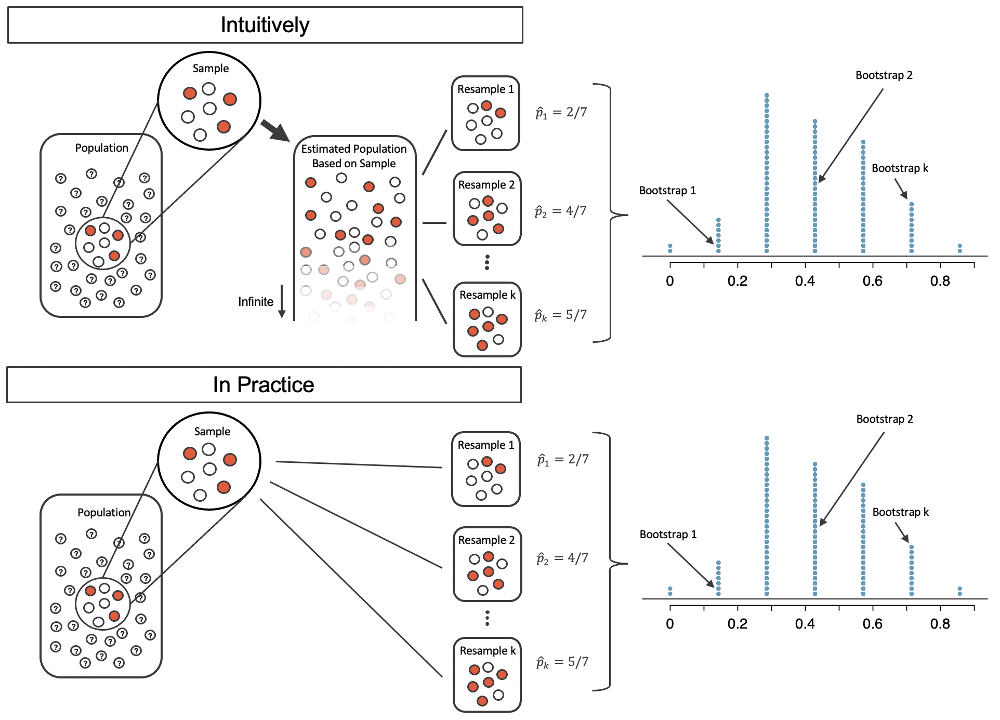

# Confidence intervals with bootstrapping {#foundations-bootstrapping}

```{r, include = FALSE}
source("_common.R")
```

::: {.chapterintro data-latex=""}
In this chapter, we expand on the familiar idea of using a sample proportion to estimate a population proportion.
That is, we create what is called a **confidence interval**\index{confidence interval}, which is a range of plausible values where we may find the true population value.
The process for creating a confidence interval is based on understanding how a statistic (here the sample proportion) *varies* around the parameter (here the population proportion) when many different statistics are calculated from many different samples.

If we could, we would measure the variability of the statistics by repeatedly taking sample data from the population and compute the sample proportion.
Then we could do it again.
And again.
And so on until we have a good sense of the variability of our original estimate.

When the variability across the samples is large, we would assume that the original statistic is possibly far from the true population parameter of interest (and the interval estimate will be wide).
When the variability across the samples is small, we expect the sample statistic to be close to the true parameter of interest (and the interval estimate will be narrow).

The ideal world where sampling data is free or extremely cheap is almost never the case, and taking repeated samples from a population is usually impossible.

So, instead of using a "resample from the population" approach, bootstrapping uses a "resample from the sample" approach.
In this chapter we provide examples and details about the bootstrapping process.
:::

As seen in Chapter \@ref(foundations-randomization), randomization is a statistical technique suitable for evaluating whether a difference in sample proportions is due to chance.

Randomization tests are best suited for modeling experiments where the treatment (explanatory variable) has been randomly assigned to the observational units and there is an attempt to answer a simple yes/no research question.

For example, consider the following research questions that can be well assessed with a randomization test:

-   Does this vaccine make it less likely that a person will get malaria?
-   Does drinking caffeine affect how quickly a person can tap their finger?
-   Can we predict whether candidate A will win the upcoming election?

In this chapter, however, we are instead interested in a different approach to understanding population parameters.
Instead of testing a claim, the goal now is to estimate the unknown value of a population parameter.

For example,

-   How much less likely am I to get malaria if I get the vaccine?
-   How much faster (or slower) can a person tap their finger, on average, if they drink caffeine first?
-   What proportion of the vote will go to candidate A?

Here, we explore the situation where the focus is on a single proportion, and we introduce a new simulation method: **bootstrapping**.

```{r include = FALSE}
terms_chp_12 <- c("bootstrapping")
```

Bootstrapping is best suited for modeling studies where the data have been generated through random sampling from a population.

As with randomization tests, our goal with bootstrapping is to understand variability of a statistic.

Unlike randomization tests (which modeled how the statistic would change if the treatment had been allocated differently), the bootstrap will model how a statistic varies from one sample to another taken from the population.
This will provide information about how different the statistic is from the parameter of interest.

Quantifying the variability of a statistic from sample to sample is a hard problem.

Fortunately, sometimes the mathematical theory for how a statistic varies (across different samples) is well-known; this is the case for the sample proportion as seen in Chapter \@ref(foundations-mathematical).

However, some statistics don't have simple theory for how they vary, and bootstrapping provides a computational approach for providing interval estimates for almost any population parameter.
In this chapter we will focus on bootstrapping to estimate a single proportion, and we will revisit bootstrapping in Chapters \@ref(inference-one-mean) through \@ref(inference-paired-means), so you'll get plenty of practice as well as exposure to bootstrapping in many different datasettings.

Our goal with bootstrapping will be to produce an interval estimate (a range of plausible values) for the population parameter.

## Medical consultant case study {#case-study-med-consult}

People providing an organ for donation sometimes seek the help of a special medical consultant.
These consultants assist the patient in all aspects of the surgery, with the goal of reducing the possibility of complications during the medical procedure and recovery.
Patients might choose a consultant based in part on the historical complication rate of the consultant's clients.

### Observed data

One consultant tried to attract patients by noting the average complication rate for liver donor surgeries in the US is about 10%, but her clients have had only 3 complications in the 62 liver donor surgeries she has facilitated.
She claims this is strong evidence that her work meaningfully contributes to reducing complications (and therefore she should be hired!).

::: {.workedexample data-latex=""}
We will let $p$ represent the true complication rate for liver donors working with this consultant.
(The "true" complication rate will be referred to as the **parameter**.) We estimate $p$ using the data, and label the estimate $\hat{p}.$

------------------------------------------------------------------------

The sample proportion for the complication rate is 3 complications divided by the 62 surgeries the consultant has worked on: $\hat{p} = 3/62 = 0.048.$
:::

::: {.workedexample data-latex=""}
Is it possible to assess the consultant's claim (that the reduction in complications is due to her work) using the data?

------------------------------------------------------------------------

No.

The claim is that there is a causal connection, but the data are observational, so we must be on the lookout for confounding variables.

For example, maybe patients who can afford a medical consultant can afford better medical care, which can also lead to a lower complication rate.

While it is not possible to assess the causal claim, it is still possible to understand the consultant's true rate of complications.
:::

::: {.important data-latex=""}
**Parameter.**\index{parameter}

A **parameter** is the "true" value of interest.

We typically estimate the parameter using a point estimate\index{point estimate} from a sample of data.
The point estimate is also known as the **statistic**\index{statistic}.

For example, we estimate the probability $p$ of a complication for a client of the medical consultant by examining the past complications rates of her clients:

$$\hat{p} = 3 / 62 = 0.048~\text{is used to estimate}~p$$
:::

```{r include = FALSE}
terms_chp_12 <- c(terms_chp_12, "parameter", "point estimate", "statistic")
```

### Variability of the statistic

In the medical consultant case study, the parameter is $p,$ the true probability of a complication for a client of the medical consultant.

There is no reason to believe that $p$ is exactly $\hat{p} = 3/62,$ but there is also no reason to believe that $p$ is particularly far from $\hat{p} = 3/62.$

By sampling with replacement from the dataset (a process called bootstrapping\index{bootstrapping}), the variability of the possible $\hat{p}$ values can be approximated.

Most of the inferential procedures covered in this text are grounded in quantifying how one dataset would differ from another when they are both taken from the same population.

It doesn't make sense to take repeated samples from the same population because if you have the means to take more samples, a larger sample size will benefit you more than separately evaluating two sample of the exact same size.

Instead, we measure how the samples behave under an estimate of the population.

Figure \@ref(fig:boot1) shows how the unknown original population can be estimated by using the sample to approximate the proportion of successes and failures (in our case, the proportion of complications and no complications for the medical consultant).

```{r boot1, fig.cap = "The unknown population is estimated using the observed sample data.  Note that we can use the sample to create an estimated or bootstrapped population from which to sample.  The observed data include three red and four white marbles, so the estimated population contains 3/7 red marbles and 4/7 white marbles.", warning = FALSE,  out.width="75%"}

```

By taking repeated samples from the estimated population, the variability from sample to sample can be observed.

In Figure \@ref(fig:boot2) the repeated bootstrap samples are obviously different both from each other and from the original population.

Recall that the bootstrap samples were taken from the same (estimated) population, and so the differences are due entirely to natural variability in the sampling procedure.

```{r boot2, fig.cap = "Bootstrap sampling provides a measure of the sample to sample variability.  Note that we are taking samples from the estimated population that was created from the observed data.", out.width="75%"}
knitr::include_graphics("images/boot1prop2.png")
```

By summarizing each of the bootstrap samples (here, using the sample proportion), we see, directly, the variability of the sample proportion, $\hat{p},$ from sample to sample.

The distribution of $\hat{p}_{boot}$ for the example scenario is shown in Figure \@ref(fig:boot3), and the full bootstrap distribution for the medical consultant data is shown in Figure \@ref(fig:MedConsBSSim).

```{r boot3, fig.cap = "The bootstrapped proportion is estimated for each bootstrap sample.  The resulting bootstrap distribution (dotplot) provides a measure for how the proportions vary from sample to sample", warning = FALSE,  out.width="95%"}

```

It turns out that in practice, it is very difficult for computers to work with an infinite population (with the same proportional breakdown as in the sample).

However, there is a physical and computational model which produces an equivalent bootstrap distribution of the sample proportion in a computationally efficient manner.

Consider the observed data to be a bag of marbles 3 of which are success (red) and 4 of which are failures (white).

By drawing the marbles out of the bag with replacement, we depict the exact same sampling **process** as was done with the infinitely large estimated population.

```{r boot4, fig.cap = "Taking repeated resamples from the sample data is the same process as creating an infinitely large estimate of the population.  It is computationally more feasible to take resamples directly from the sample.  Note that the resampling is now done with replacement (that is, the original sample does not ever change) so that the original sample and estimated hypothetical population are equivalent.", warning = FALSE,  out.width="75%"}
knitr::include_graphics("images/boot1prop4.png")
```

```{r boot1prop, fig.cap = "A comparison of the process of sampling from the estimate infinite population and resampling with replacement from the original sample.  Note that the dotplot of bootstrapped proportions is the same because the process by which the statistics were estimated is equivalent.", warning = FALSE,  out.width="95%"}

```

If we apply the bootstrap sampling process to the medical consultant example, we consider each client to be one of the marbles in the bag.

There will be 59 white marbles (no complication) and 3 red marbles (complication).

If we choose 62 marbles out of the bag (one at a time with replacement) and compute the proportion of simulated patients with complications, $\hat{p}_{boot},$ then this "bootstrap" proportion represents a single simulated proportion from the "resample from the sample" approach.

::: {.guidedpractice data-latex=""}
In a simulation of 62 patients, about how many would we expect to have had a complication?[^foundations-bootstrapping-1]
:::

[^foundations-bootstrapping-1]: About 4.8% of the patients (3 on average) in the simulation will have a complication, as this is what was seen in the sample.
    We will, however, see a little variation from one simulation to the next.

One simulation isn't enough to get a sense of the variability from one bootstrap proportion to another bootstrap proportion, so we repeat the simulation 10,000 times using a computer.

Figure \@ref(fig:MedConsBSSim) shows the distribution from the 10,000 bootstrap simulations.

The bootstrapped proportions vary from about zero to 11.3%.

The variability in the bootstrapped proportions leads us to believe that the true probability of complication (the parameter, $p$) is likely to fall somewhere between 0 and 11.3%, as these numbers capture 95% of the bootstrap resampled values.

The range of values for the true proportion is called a **bootstrap percentile confidence interval**, and we will see it again throughout the next few sections and chapters.

```{r MedConsBSSim, fig.cap = "(ref:MedConsBSSim-cap)", fig.width = 10}
bsprop_med <- tibble(
  bsprop = rbinom(10000, size=62, prob=(3/62))/62
)

bsprop_med_summary <- bsprop_med %>%
  summarise(
    bsprop_025 = quantile(bsprop, 0.025),
    bsprop_975 = quantile(bsprop, 0.975),
  )

ggplot(bsprop_med, aes(x = bsprop)) +
  geom_histogram(binwidth = 0.0075) +
  gghighlight(bsprop <= bsprop_med_summary$bsprop_025 | bsprop >= bsprop_med_summary$bsprop_975) +
  annotate("segment", 
           x = bsprop_med_summary$bsprop_025, y = 0, 
           xend = bsprop_med_summary$bsprop_025, yend = 1000,
           linetype = "dashed") +
  annotate("segment", 
           x = bsprop_med_summary$bsprop_975, y = 0, 
           xend = bsprop_med_summary$bsprop_975, yend = 1000,
           linetype = "dashed") +
  annotate("text", x = bsprop_med_summary$bsprop_025, y = 1200, label = "2.5th\npercentile") +
  annotate("text", x = bsprop_med_summary$bsprop_975, y = 1200, label = "97.5th\npercentile") +
  labs(
    x = "Bootstrapped values of the proportion of surgical complications",
    y = "Count"
  )
```

(ref:MedConsBSSim-cap) The original medical consultant data is bootstrapped 10,000 times. Each simulation creates a sample from the original data where the probability of a complication is $\hat{p} = 3/62.$ The bootstrap 2.5 percentile proportion is 0 and the 97.5 percentile is 0.113. The result is: we are confident that, in the population, the true probability of a complication is between 0% and 11.3%.

::: {.workedexample data-latex=""}
The original claim was that the consultant's true rate of complication was under the national rate of 10%.
Does the interval estimate of 0 to 11.3% for the true probability of complication indicate that the surgical consultant has a lower rate of complications than the national average?
Explain.

------------------------------------------------------------------------

No.
Because the interval overlaps 10%, it might be that the consultant's work is associated with a lower risk of complications, or it might be that the consultant's work is associated with a higher risk (i.e., greater than 10%) of complications!
Additionally, as previously mentioned, because this is an observational study, even if an association can be measured, there is no evidence that the consultant's work is the cause of the complication rate (being higher or lower).
:::

## Tappers and listeners case study {#tapperscasestudy}

Here's a game you can try with your friends or family: pick a simple, well-known song, tap that tune on your desk, and see if the other person can guess the song.
In this simple game, you are the tapper, and the other person is the listener.

### Observed data

A Stanford University graduate student named Elizabeth Newton conducted an experiment using the tapper-listener game.[^foundations-bootstrapping-2]
In her study, she recruited 120 tappers and 120 listeners into the study.
About 50% of the tappers expected that the listener would be able to guess the song.
Newton wondered, is 50% a reasonable expectation?

[^foundations-bootstrapping-2]: This case study is described in [Made to Stick](https://en.wikipedia.org/wiki/Made_to_Stick) by Chip and Dan Heath.
    Little known fact: the teaching principles behind many OpenIntro resources are based on *Made to Stick*.

In Newton's study, only 3 out of 120 listeners ($\hat{p} = 0.025$) were able to guess the tune!
That seems like quite a low number which leads the researcher to ask: what is the true proportion of people who can guess the tune?

### Variability of the statistic

To answer the question, we will again use a simulation.

To simulate 120 games, this time we use a bag of 120 marbles 3 are red (for those who guessed correctly) and 117 are white (for those who could not guess the song).

Sampling from the bag 120 times (remembering to replace the marble back into the bag each time to keep constant the population proportion of red) produces one bootstrap sample.

For example, we can start by simulating 5 tapper-listener pairs by sampling 5 marbles from the bag of 3 red and 117 white marbles.

|   W   |   W   |   W   |    R    |   W   |
|:-----:|:-----:|:-----:|:-------:|:-----:|
| Wrong | Wrong | Wrong | Correct | Wrong |

After selecting 120 marbles, we counted 2 red for $\hat{p}_{boot1} = 0.0167.$ As we did with the randomization technique, seeing what would happen with one simulation isn't enough.
In order to understand how far the observed proportion of 0.025 might be from the true parameter, we should generate more simulations.
Here we've repeated the entire simulation ten times:

$$0.0417 \quad 0.025 \quad 0.025 \quad 0.0083 \quad 0.05 \quad 0.0333 \quad 0.025 \quad 0 \quad 0.0083 \quad 0$$ <!-- % round(rbinom(10, 120, 0.5) / 120, 3) -->

As before, we'll run a total of 10,000 simulations using a computer.
As seen in Figure \@ref(fig:tappers-bs-sim), the range of 95% of the resampled values of $\hat{p}_{boot}$ is 0.000 to 0.0583.
That is, we expect that between 0% and 5.83% of people are truly able to guess the tapper's tune.

```{r tappers-bs-sim, fig.cap = "(ref:tappers-bs-sim-cap)", fig.width = 10}
bsprop_tap <- tibble(
  bsprop = rbinom(10000, size=120, prob=(3/120))/120
)

bsprop_tap_summary <- bsprop_tap %>%
  summarise(
    bsprop_025 = quantile(bsprop, 0.025),
    bsprop_975 = quantile(bsprop, 0.975),
  )

ggplot(bsprop_tap, aes(x = bsprop)) +
  geom_histogram(binwidth = 0.0045) +
  gghighlight(bsprop <= bsprop_tap_summary$bsprop_025 | bsprop >= bsprop_tap_summary$bsprop_975) +
  annotate("segment", 
           x = bsprop_tap_summary$bsprop_025, y = 0, 
           xend = bsprop_tap_summary$bsprop_025, yend = 1000,
           linetype = "dashed") +
  annotate("segment", 
           x = bsprop_tap_summary$bsprop_975, y = 0, 
           xend = bsprop_tap_summary$bsprop_975, yend = 1000,
           linetype = "dashed") +
  annotate("text", x = bsprop_tap_summary$bsprop_025, y = 1200, label = "2.5th\npercentile") +
  annotate("text", x = bsprop_tap_summary$bsprop_975, y = 1200, label = "97.5th\npercentile") +
  labs(
    x = "Bootstrapped values of the proportion of listeners who guessed correctly",
    y = "Count"
  )
```

(ref:tappers-bs-sim-cap) The original listener-tapper data is bootstrapped 10,000 times. Each simulation creates a sample where the probability of being correct is $\hat{p} = 3/120.$ The 2.5 percentile proportion is 0 and the 97.5 percentile is 0.0583. The result is that we are confident that, in the population, the true percent of people who can guess correctly is between 0% and 5.83%.

::: {.guidedpractice data-latex=""}
Do the data provide convincing evidence against the claim that 50% of listeners can guess the tapper's tune?[^foundations-bootstrapping-3]
:::

[^foundations-bootstrapping-3]: Because 50% is not in the interval estimate for the true parameter, we can say that there is convincing evidence against the hypothesis that 50% of listeners can guess the tune.
    Moreover, 50% is a substantial distance from the largest resample statistic, suggesting that there is **very** convincing evidence against this hypothesis.

## Confidence intervals {#ConfidenceIntervals}

\index{confidence interval}

A point estimate provides a single plausible value for a parameter.
However, a point estimate is rarely perfect; usually there is some error in the estimate.
In addition to supplying a point estimate of a parameter, a next logical step would be to provide a plausible *range of values* for the parameter.

### Plausible range of values for the population parameter

A plausible range of values for the population parameter is called a **confidence interval**.
Using only a single point estimate is like fishing in a murky lake with a spear, and using a confidence interval is like fishing with a net.
We can throw a spear where we saw a fish, but we will probably miss.
On the other hand, if we toss a net in that area, we have a good chance of catching the fish.

If we report a point estimate, we probably will not hit the exact population parameter.
On the other hand, if we report a range of plausible values -- a confidence interval -- we have a good shot at capturing the parameter.

::: {.guidedpractice data-latex=""}
If we want to be very certain we capture the population parameter, should we use a wider interval (e.g., 99%) or a smaller interval (e.g., 80%)?[^foundations-bootstrapping-4]
:::

[^foundations-bootstrapping-4]: If we want to be more certain we will capture the fish, we might use a wider net.
    Likewise, we use a wider confidence interval if we want to be more certain that we capture the parameter.

### Bootstrap confidence interval

As we saw above, a **bootstrap sample**\index{bootstrap sample} is a sample of the original sample.
In the case of the medical complications data, we proceed as follows:

-   Randomly sample one observation from the 62 patients (replace the marble back into the bag so as to keep the population constant).
-   Randomly sample a second observation from the 62 patients. Because we sample with replacement (i.e., we don't actually remove the marbles from the bag), there is a 1-in-62 chance that the second observation will be the same one sampled in the first step!
-   Keep going one sampled observation at a time ...
-   Randomly sample the 62nd observation from the 62 patients.

```{r include = FALSE}
terms_chp_12 <- c(terms_chp_12, "bootstrap sample", "bootstrap percentile confidence interval", "sampling with replacement") 
```

Bootstrap sampling is often called **sampling with replacement**.

A bootstrap sample behaves similarly to how an actual sample from a population would behave, and we compute the point estimate of interest (here, compute $\hat{p}_{boot}$).

Due to theory that is beyond this text, we know that the bootstrap proportions $\hat{p}_{boot}$ vary around $\hat{p}$ in a similar way to how different sample proportions (i.e., values of $\hat{p}$) vary around the true parameter $p.$

Therefore, an interval estimate for $p$ can be produced using the $\hat{p}_{boot}$ values themselves.

::: {.important data-latex=""}
**95% Bootstrap percentile confidence interval for a parameter** $p.$

The 95% bootstrap confidence interval for the parameter $p$ can be obtained directly using the ordered $\hat{p}_{boot}$ values.

Consider the sorted $\hat{p}_{boot}$ values.
Call the 2.5% bootstrapped proportion value "lower", and call the 97.5% bootstrapped proportion value "upper".

The 95% confidence interval is given by: (lower, upper)
:::

In Section \@ref(one-prop-null-boot) we will discuss different percentages for the confidence interval (e.g., 90% confidence interval or 99% confidence interval).

Section \@ref(one-prop-null-boot) also provides a longer discussion on what "95% confidence" actually means.

\clearpage

## Chapter review {#chp12-review}

### Summary

Figure \@ref(fig:bootboth) provides a visual summary of creating bootstrap confidence intervals.

```{r bootboth, fig.cap = "We will use sampling with replacement to measure the variability of the statistic of interest (here the proportion). Sampling with replacement is a computational tool which is equivalent to using the sample as a way of estimating an infinitely large population from which to sample.", warning = FALSE, out.width = "95%"}
 
```

We can summarize the bootstrap process as follows:

-   **Frame the research question in terms of a parameter to estimate.** Confidence Intervals are appropriate for research questions that aim to estimate a number from the population (called a parameter).
-   **Collect data with an observational study or experiment.** If a research question can be formed as a query about the parameter, we can collect data to calculate a statistic which is the best guess we have for the value of the parameter. However, we know that the statistic won't be exactly equal to the parameter due to natural variability.
-   **Model the randomness by using the data values as a proxy for the population.** In order to assess how far the statistic might be from the parameter, we take repeated resamples from the dataset to measure the variability in bootstrapped statistics. The variability of the bootstrapped statistics around the observed statistic (a quantity which can be measured through computational technique) should be approximately the same as the variability of many observed sample statistics around the parameter (a quantity which is very difficult to measure because in real life we only get exactly one sample).
-   **Create the interval.** After choosing a particular confidence level, use the variability of the bootstrapped statistics to create an interval estimate which will hope to capture the true parameter. While the interval estimate associated with the particular sample at hand may or may not capture the parameter, the researcher knows that over their lifetime, the confidence level will determine the percentage of their research confidence intervals that do capture the true parameter.
-   **Form a conclusion.** Using the confidence interval from the analysis, report on the interval estimate for the parameter of interest. Also, be sure to write the conclusion in plain language so casual readers can understand the results.

Table \@ref(tab:chp12-summary) is another look at the Bootstrap process summary.

```{r chp12-summary}
inference_method_summary_table %>%
  filter(question != "What are the technical conditions?") %>%
  select(question, bootstrapping) %>%
  kbl(linesep = "", booktabs = TRUE, caption = "Summary of bootstrapping as an inferential statistical method.",
      col.names = c("Question", "Answer")) %>%
  kable_styling(bootstrap_options = c("striped", "condensed"), 
                latex_options = c("striped", "hold_position"), full_width = TRUE) %>%
  column_spec(1, width = "15em")
```

### Terms

We introduced the following terms in the chapter.
If you're not sure what some of these terms mean, we recommend you go back in the text and review their definitions.
We are purposefully presenting them in alphabetical order, instead of in order of appearance, so they will be a little more challenging to locate.
However you should be able to easily spot them as **bolded text**.

```{r}
make_terms_table(terms_chp_12)
```

\clearpage

## Exercises {#chp12-exercises}

Answers to odd numbered exercises can be found in Appendix \@ref(exercise-solutions-12).

::: {.exercises}
```{r exercises-12, child = "exercises/12-ex-foundations-bootstrapping.Rmd"}
```
:::
