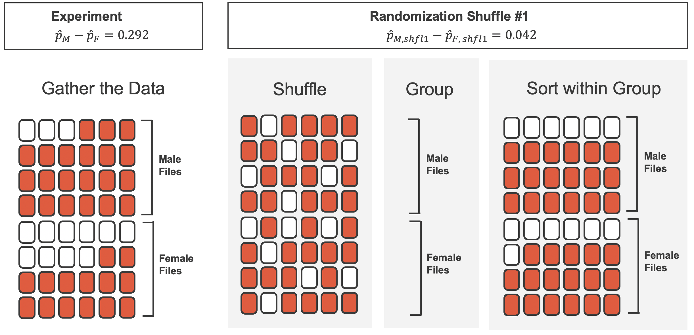
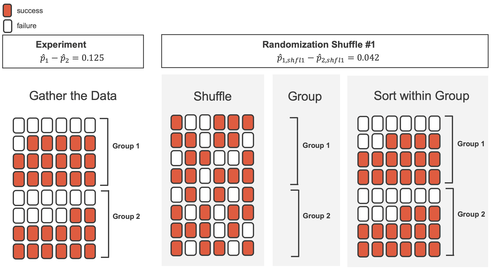

# (PART) Foundations of inference {.unnumbered}

```{r, include = FALSE}
source("_common.R")
```

# Hypothesis testing with randomization {#foundations-randomization}

::: {.chapterintro data-latex=""}
Statistical inference is primarily concerned with understanding and quantifying the uncertainty of parameter estimates.
While the equations and details change depending on the setting, the foundations for inference are the same throughout all of statistics.

We start with two case studies designed to motivate the process of making decisions about research claims.
We formalize the process through the introduction of the **hypothesis testing framework**\index{hypothesis test}, which allows us to formally evaluate claims about the population.
:::

```{r include = FALSE}
terms_chp_12 <- c("hypothesis test", "confidence interval")
```

Throughout the book so far, you have worked with data in a variety of contexts.
You have learned how to summarize and visualize the data as well as how to model multiple variables at the same time.
Sometimes the dataset at hand represents the entire research question.
But more often than not, the data have been collected to answer a research question about a larger group of which the data are a (hopefully) representative subset.

You may agree that there is almost always variability in data -- one dataset will not be identical to a second dataset even if they are both collected from the same population using the same methods.
However, quantifying the variability in the data is neither obvious nor easy to do, i.e. answering the question "*how* different is one dataset from another?" is not trivial.

First, a note on notation.
We generally use $p$ to denote a population proportion and $\hat{p}$ to a sample proportion.
Similarly, we generally use $\mu$ to denote a population mean and $\bar{x}$ to denote a sample mean.

::: {.workedexample data-latex=""}
Suppose your professor splits the students in your class into two groups: students who sit on the left side of the classroom and students who sit on the right side of the classroom.
If $\hat{p}_{L}$ represents the proportion of students who prefer to read books on screen who sit on the left side of the classroom and $\hat{p}_{R}$ represents the proportion of students who prefer to read books on screen who sit on the right side of the classroom, would you be surprised if $\hat{p}_{L}$ did not *exactly* equal $\hat{p}_{R}$?

------------------------------------------------------------------------

While the proportions $\hat{p}_{L}$ and $\hat{p}_{R}$ would probably be close to each other, it would be unusual for them to be exactly the same.
We would probably observe a small difference due to *chance*.
:::

::: {.guidedpractice data-latex=""}
If we don't think the side of the room a person sits on in class is related to whether they prefer to read books on screen, what assumption are we making about the relationship between these two variables?[^foundations-randomization-1]
:::

[^foundations-randomization-1]: We would be assuming that these two variables are **independent**\index{independent}.

```{r include = FALSE}
terms_chp_12 <- c(terms_chp_12, "independent")
```

Studying randomness of this form is a key focus of statistics.
Throughout this chapter, and those that follow, we provide three different approaches for quantifying the variability inherent in data: randomization, bootstrapping, and mathematical models.
Using the methods provided in this chapter, we will be able to draw conclusions beyond the dataset at hand to research questions about larger populations that the samples come from.

The first type of variability we will explore comes from experiments where the explanatory variable (or treatment) is randomly assigned to the observational units.
As you learned in Chapter \@ref(data-hello), a randomized experiment can be used to assess whether or not one variable (the explanatory variable) causes changes in a second variable (the response variable).
Every dataset has some variability in it, so to decide whether the variability in the data is due to (1) the causal mechanism (the randomized explanatory variable in the experiment) or instead (2) natural variability inherent to the data, we set up a sham randomized experiment as a comparison.
That is, we assume that each observational unit would have gotten the exact same response value regardless of the treatment level.
By reassigning the treatments many many times, we can compare the actual experiment to the sham experiment.
If the actual experiment has more extreme results than any of the sham experiments, we are led to believe that it is the explanatory variable which is causing the result and not just variability inherent to the data.
Using a few different case studies, let's look more carefully at this idea of a **randomization test**\index{randomization test}.

```{r include = FALSE}
terms_chp_12 <- c(terms_chp_12, "randomization test")
```

## Sex discrimination case study {#caseStudySexDiscrimination}

We consider a study investigating sex discrimination in the 1970s, which is set in the context of personnel decisions within a bank.[\^foundations-randomization-2] The research question we hope to answer is, "Are individuals who identify as female discriminated against in promotion decisions made by their managers who identify as male?" [@Rosen:1974]

::: {.data data-latex=""}
The data from this study can be found in the [**openintro**](http://openintrostat.github.io/openintro) R package: [`sex_discrimination`](http://openintrostat.github.io/openintro/reference/sex_discrimination.html).
:::

This study considered sex roles, and only allowed for options of "male" and "female".
We should note that the identities being considered are not gender identities and also that the study allowed only for a binary classification of sex.

### Observed data

The participants in this study were 48 bank supervisors who identified as male, attending a management institute at the University of North Carolina in 1972.
They were asked to assume the role of the personnel director of a bank and were given a personnel file to judge whether the person should be promoted to a branch manager position.
The files given to the participants were identical, except that half of them indicated the candidate identified as male and the other half indicated the candidate identified as female.
These files were randomly assigned to the subjects.

::: {.guidedpractice data-latex=""}
Is this an observational study or an experiment?
How does the type of study impact what can be inferred from the results?[^foundations-randomization-2]
:::

[^foundations-randomization-2]: The study is an experiment, as subjects were randomly assigned a "male" file or a "female" file (remember, all the files were actually identical in content).
    Since this is an experiment, the results can be used to evaluate a causal relationship between the sex of a candidate and the promotion decision.

```{r sex-discrimination-obs-p}
sex_discrimination_props <- sex_discrimination %>% 
  rename(sex = sex) %>% 
  count(sex, decision) %>%
  group_by(sex) %>%
  mutate(p = n / sum(n))

p_male <- sex_discrimination_props %>%
  filter(sex == "male", decision == "promoted") %>%
  pull(p)

p_female <- sex_discrimination_props %>%
  filter(sex == "female", decision == "promoted") %>%
  pull(p)

p_diff <- p_male - p_female

perc_male   <- label_percent(accuracy = 0.1)(p_male)
perc_female <- label_percent(accuracy = 0.1)(p_female)
perc_diff   <- label_percent(accuracy = 0.1)(p_diff)
```

For each supervisor both the sex associated with the assigned file and the promotion decision were recorded.
Using the results of the study summarized in Table \@ref(tab:sex-discrimination-obs), we would like to evaluate if individuals who identify as female are unfairly discriminated against in promotion decisions.
In this study, a smaller proportion of female identifying applications were promoted than males (`r p_female` versus `r p_male`), but it is unclear whether the difference provides *convincing evidence* that individuals who identify as female are unfairly discriminated against.

```{r sex-discrimination-obs}
sex_discrimination %>% 
  count(decision, sex) %>% 
  pivot_wider(names_from = decision, values_from = n) %>%
  adorn_totals(where = c("col", "row")) %>% 
  kbl(linesep = "", booktabs = TRUE, caption = "Summary results for the sex discrimination study.") %>%
  kable_styling(bootstrap_options = c("striped", "condensed"), 
                latex_options = c("striped", "hold_position"), full_width = FALSE) %>%
  add_header_above(c(" " = 1, "decision" = 2, " " = 1)) %>%
  column_spec(1:4, width = "7em")
```

The data are visualized in Figure \@ref(fig:sex-rand-obs) as a set of cards.
Note that each card denotes a personnel file (an observation from our dataset) and the colors indicate the decision: red for promoted and white for not promoted.
Additionally, the observations are broken up into groups of male and female identifying groups.

```{r sex-rand-obs, out.width = "40%", fig.cap = "The sex descriminiation study can be thought of as 48 red and white cards."}
knitr::include_graphics("images/sex-rand-01-obs.png")
```

::: {.workedexample data-latex=""}
Statisticians are sometimes called upon to evaluate the strength of evidence.
When looking at the rates of promotion in this study, why might we be tempted to immediately conclude that individuals identifying as female are being discriminated against?

------------------------------------------------------------------------

The large difference in promotion rates (`r perc_female` for female personnel versus `r perc_male` for male personnel) suggest there might be discrimination against women in promotion decisions.
However, we cannot yet be sure if the observed difference represents discrimination or is just due to random chance when there is no discrimination occurring.
Since we wouldn't expect the sample proportions to be *exactly* equal, even if the truth was that the promotion decisions were independent of sex, we can't rule out random chance as a possible explanation when simply comparing the sample proportions.
:::

The previous example is a reminder that the observed outcomes in the sample may not perfectly reflect the true relationships between variables in the underlying population.
Table \@ref(tab:sex-discrimination-obs) shows there were 7 fewer promotions for female identifying personnel than for the male personnel, a difference in promotion rates of `r perc_diff` $\left( \frac{21}{24} - \frac{14}{24} = 0.292 \right).$ This observed difference is what we call a **point estimate**\index{point estimate} of the true difference.
The point estimate of the difference in promotion rate is large, but the sample size for the study is small, making it unclear if this observed difference represents discrimination or whether it is simply due to chance when there is no discrimination occurring.
Chance can be thought of as the claim due to natural variability; discrimination can be thought of as the claim the researchers set out to demonstrate.
We label these two competing claims, $H_0$ and $H_A:$

```{r include = FALSE}
terms_chp_12 <- c(terms_chp_12, "point estimate")
```

-   $H_0:$ **Null hypothesis**\index{null hypothesis}.
    The variables `sex` and `decision` are independent.
    They have no relationship, and the observed difference between the proportion of males and females who were promoted, `r perc_diff`, was due to the natural variability inherent in the population.

-   $H_A:$ **Alternative hypothesis**\index{alternative hypothesis}.
    The variables `sex` and `decision` are *not* independent.
    The difference in promotion rates of `r perc_diff` was not due to natural variability, and equally qualified female personnel are less likely to be promoted than male personnel.

```{r include = FALSE}
terms_chp_12 <- c(terms_chp_12, "null hypothesis", "alternative hypothesis")
```

::: {.important data-latex=""}
**Hypothesis testing.**

These hypotheses are part of what is called a **hypothesis test**\index{hypothesis test}.
A hypothesis test is a statistical technique used to evaluate competing claims using data.
Often times, the null hypothesis takes a stance of *no difference* or *no effect*.
This hypothesis assumes that any differences seen are due to the variability inherent in the population and could have occurred by random chance.

If the null hypothesis and the data notably disagree, then we will reject the null hypothesis in favor of the alternative hypothesis.

There are many nuances to hypothesis testing, so don't worry if you aren't a master of hypothesis testing at the end of this section.
We'll discuss these ideas and details many times in this chapter as well as in the chapters that follow.
:::

```{r include = FALSE}
terms_chp_12 <- c(terms_chp_12, "hypothesis test")
```

What would it mean if the null hypothesis, which says the variables `sex` and `decision` are unrelated, was true?
It would mean each banker would decide whether to promote the candidate without regard to the sex indicated on the personnel file.
That is, the difference in the promotion percentages would be due to the natural variability in how the files were randomly allocated to different bankers, and this randomization just happened to give rise to a relatively large difference of `r perc_diff`.

Consider the alternative hypothesis: bankers were influenced by which sex was listed on the personnel file.
If this was true, and especially if this influence was substantial, we would expect to see some difference in the promotion rates of male and female candidates.
If this sex bias was against female candidates, we would expect a smaller fraction of promotion recommendations for female personnel relative to the male personnel.

We will choose between the two competing claims by assessing if the data conflict so much with $H_0$ that the null hypothesis cannot be deemed reasonable.
If data and the null claim seem to be at odds with one another, and the data seem to support $H_A,$ then we will reject the notion of independence and conclude that the data provide evidence of discrimination.

### Variability of the statistic

Table \@ref(tab:sex-discrimination-obs) shows that 35 bank supervisors recommended promotion and 13 did not.
Now, suppose the bankers' decisions were independent of the sex of the candidate.
Then, if we conducted the experiment again with a different random assignment of sex to the files, differences in promotion rates would be based only on random fluctuation in promotion decisions.
We can actually perform this **randomization**, which simulates what would have happened if the bankers' decisions had been independent of `sex` but we had distributed the file sexes differently.[^foundations-randomization-3]

[^foundations-randomization-3]: The test procedure we employ in this section is sometimes referred to as a **permutation test**.
    The difference between the two is how the explanatory variable was assigned.
    Permutation tests are used for observational studies, where the explanatory variable was not randomly assigned.\index{permutation test}.

```{r include = FALSE}
terms_chp_12 <- c(terms_chp_12, "permutation test")
```

In the **simulation**\index{simulation}, we thoroughly shuffle the 48 personnel files, 35 labelled `promoted` and 13 labelled `not promoted`, together and we deal files into two new stacks.
Note that by keeping 35 promoted and 13 not promoted, we are assuming that 35 of the bank managers would have promoted the individual whose content is contained in the file **independent** of the sex indicated on their file.
We will deal 24 files into the first stack, which will represent the 24 "female" files.
The second stack will also have 24 files, and it will represent the 24 "male" files.
Figure \@ref(fig:sex-rand-shuffle-1) highlights both the shuffle and the reallocation to the sham sex groups.

```{r sex-rand-shuffle-1, out.width = "80%", fig.cap = "The sex descriminiation data is shuffled and reallocated to new groups of male and female files."}
knitr::include_graphics("images/sex-rand-02-shuffle-1.png")
```

Then, as we did with the original data, we tabulate the results and determine the fraction of personnel files designated as "male" and "female" who were promoted.

```{r include = FALSE}
terms_chp_12 <- c(terms_chp_12, "simulation")
```

Since the randomization of files in this simulation is independent of the promotion decisions, any difference in the two promotion rates is entirely due to chance.
Table \@ref(tab:sex-discrimination-rand-1) show the results of one such simulation.

```{r sex-discrimination-rand-1}
sex_discrimination_rand_1 <- tibble(
  sex   = c(rep("male", 24), rep("female", 24)),
  decision = c(rep("promoted", 18), rep("not promoted", 6),
               rep("promoted", 17), rep("not promoted", 7))
) %>%
  mutate(
    sex   = fct_relevel(sex, "male", "female"),
    decision = fct_relevel(decision, "promoted", "not promoted")
  )
  
sex_discrimination_rand_1 %>% 
  count(decision, sex) %>% 
  pivot_wider(names_from = decision, values_from = n) %>%
  adorn_totals(where = c("col", "row")) %>% 
  kbl(linesep = "", booktabs = TRUE, caption = "Simulation results, where the difference in promotion rates between male and female is purely due to random chance.") %>%
  kable_styling(bootstrap_options = c("striped", "condensed"), 
                latex_options = c("striped", "hold_position"), full_width = FALSE) %>%
  add_header_above(c(" " = 1, "decision" = 2, " " = 1)) %>%
  column_spec(1:4, width = "7em")
```

::: {.guidedpractice data-latex=""}
What is the difference in promotion rates between the two simulated groups in Table \@ref(tab:sex-discrimination-rand-1) ?
How does this compare to the observed difference 29.2% from the actual study?[^foundations-randomization-4]
:::

[^foundations-randomization-4]: $18/24 - 17/24=0.042$ or about 4.2% in favor of the male personnel.
    This difference due to chance is much smaller than the difference observed in the actual groups.

Figure \@ref(fig:sex-rand-shuffle-1-sort) shows that the difference in promotion rates is much larger in the original data than it is in the simulated groups (0.292 \>\>\> 0.042).
The quantity of interest throughout this case study has been the difference in promotion rates.
We call the summary value the **statistic** of interest (or often the **test statistic**).
When we encounter different data structures, the statistic is likely to change (e.g., we might calculate an average instead of a proportion), but we will always want to understand how the statistic varies from sample to sample.

```{r include = FALSE}
terms_chp_12 <- c(terms_chp_12, "statistic", "test statistic")
```

```{r sex-rand-shuffle-1-sort, out.width = "100%", fig.cap = "We summarize the randomized data to produce one estimate of the difference in proportions given no sex discrimination. Note that the sort step is only used to make it easier to visually calculate the simulated sample proportions."}

```

### Observed statistic vs. null statistics

We computed one possible difference under the null hypothesis in Guided Practice, which represents one difference due to chance when the null hypothesis is assumed to be true.
While in this first simulation, we physically dealt out files, it is much more efficient to perform this simulation using a computer.
Repeating the simulation on a computer, we get another difference due to chance under the same assumption: -0.042.
And another: 0.208.
And so on until we repeat the simulation enough times that we have a good idea of the shape of the *distribution of differences* under the null hypothesis.
Figure \@ref(fig:sex-rand-dot-plot) shows a plot of the differences found from 100 simulations, where each dot represents a simulated difference between the proportions of male and female files recommended for promotion.

```{r sex-rand-dot-plot, fig.cap="(ref:sex-rand-dot-plot-cap)", out.width = "100%"}
set.seed(35)
sex_discrimination %>%
  specify(decision ~ sex, success = "promoted") %>%
  hypothesize(null = "independence") %>%
  generate(reps = 100, type = "permute") %>%
  calculate(stat = "diff in props", order = c("male", "female")) %>%
  ggplot(aes(x = stat)) +
  geom_dotplot(binwidth = 0.01) +
  gghighlight(stat >= 0.292) +
  theme(
    axis.ticks.y = element_blank(),
    axis.text.y = element_blank()
  ) +
  labs(
    x = "Differences in promotion rates (male - female) across many shuffles",
    y = NULL
  )
```

(ref:sex-rand-dot-plot-cap) A stacked dot plot of differences from 100 simulations produced under the null hypothesis, $H_0,$ where the simulated sex and decision are independent. Two of the 100 simulations had a difference of at least 29.2%, the difference observed in the study, and are shown as solid blue dots.

Note that the distribution of these simulated differences in proportions is centered around 0.
Under the null hypothesis our simulations made no distinction between male and female personnel files.
Thus, a center of 0 makes sense: we should expect differences from chance alone to fall around zero with some random fluctuation for each simulation.

::: {.workedexample data-latex=""}
How often would you observe a difference of at least `r perc_diff` (`r p_diff`) according to Figure \@ref(fig:sex-rand-dot-plot)?
Often, sometimes, rarely, or never?

------------------------------------------------------------------------

It appears that a difference of at least `r perc_diff` under the null hypothesis would only happen about 2% of the time according to Figure \@ref(fig:sex-rand-dot-plot).
Such a low probability indicates that observing such a large difference from chance alone is rare.
:::

The difference of 29.2% is a rare event if there really is no impact from listing sex in the candidates' files, which provides us with two possible interpretations of the study results:

-   If $H_0,$ the **Null hypothesis** is true: Sex has no effect on promotion decision, and we observed a difference that is so large that it would only happen rarely.

-   If $H_A,$ the **Alternative hypothesis** is true: Sex has an effect on promotion decision, and what we observed was actually due to equally qualified female candidates being discriminated against in promotion decisions, which explains the large difference of 29.2%.

When we conduct formal studies, we reject a null position (the idea that the data are a result of chance only) if the data strongly conflict with that null position.[^foundations-randomization-5]
In our analysis, we determined that there was only a $\approx$ 2% probability of obtaining a sample where $\geq$ 29.2% more male candidates than female candidates get promoted under the null hypothesis, so we conclude that the data provide strong evidence of sex discrimination against female candidates by the male supervisors.
In this case, we reject the null hypothesis in favor of the alternative.

[^foundations-randomization-5]: This reasoning does not generally extend to anecdotal observations.
    Each of us observes incredibly rare events every day, events we could not possibly hope to predict.
    However, in the non-rigorous setting of anecdotal evidence, almost anything may appear to be a rare event, so the idea of looking for rare events in day-to-day activities is treacherous.
    For example, we might look at the lottery: there was only a 1 in 176 million chance that the Mega Millions numbers for the largest jackpot in history (October 23, 2018) would be (5, 28, 62, 65, 70) with a Mega ball of (5), but nonetheless those numbers came up!
    However, no matter what numbers had turned up, they would have had the same incredibly rare odds.
    That is, *any set of numbers we could have observed would ultimately be incredibly rare*.
    This type of situation is typical of our daily lives: each possible event in itself seems incredibly rare, but if we consider every alternative, those outcomes are also incredibly rare.
    We should be cautious not to misinterpret such anecdotal evidence.

**Statistical inference** is the practice of making decisions and conclusions from data in the context of uncertainty.
Errors do occur, just like rare events, and the dataset at hand might lead us to the wrong conclusion.
While a given dataset may not always lead us to a correct conclusion, statistical inference gives us tools to control and evaluate how often these errors occur.
Before getting into the nuances of hypothesis testing, let's work through another case study.

```{r include = FALSE}
terms_chp_12 <- c(terms_chp_12, "statistical inference")
```

## Opportunity cost case study {#caseStudyOpportunityCost}

How rational and consistent is the behavior of the typical American college student?
In this section, we'll explore whether college student consumers always consider the following: money not spent now can be spent later.

In particular, we are interested in whether reminding students about this well-known fact about money causes them to be a little thriftier.
A skeptic might think that such a reminder would have no impact.
We can summarize the two different perspectives using the null and alternative hypothesis framework.

-   $H_0:$ **Null hypothesis**. Reminding students that they can save money for later purchases will not have any impact on students' spending decisions.
-   $H_A:$ **Alternative hypothesis**. Reminding students that they can save money for later purchases will reduce the chance they will continue with a purchase.

In this section, we'll explore an experiment conducted by researchers that investigates this very question for students at a university in the southwestern United States.
[@Frederick:2009]

### Observed data

One-hundred and fifty students were recruited for the study, and each was given the following statement:

> *Imagine that you have been saving some extra money on the side to make some purchases, and on your most recent visit to the video store you come across a special sale on a new video. This video is one with your favorite actor or actress, and your favorite type of movie (such as a comedy, drama, thriller, etc.). This particular video that you are considering is one you have been thinking about buying for a long time. It is available for a special sale price of \$14.99. What would you do in this situation? Please circle one of the options below.*

Half of the 150 students were randomized into a control group and were given the following two options:

> (A) Buy this entertaining video.

> (B) Not buy this entertaining video.

The remaining 75 students were placed in the treatment group, and they saw a slightly modified option (B):

> (A) Buy this entertaining video.

> (B) Not buy this entertaining video. Keep the \$14.99 for other purchases.

Would the extra statement reminding students of an obvious fact impact the purchasing decision?
Table \@ref(tab:opportunity-cost-obs) summarizes the study results.

::: {.data data-latex=""}
The data from this study can be found in the [**openintro**](http://openintrostat.github.io/openintro) R package: [`opportunity_cost`](http://openintrostat.github.io/openintro/reference/opportunity_cost.html).
:::

```{r opportunity-cost-obs}
opportunity_cost %>% 
  count(group, decision) %>% 
  pivot_wider(names_from = decision, values_from = n) %>%
  adorn_totals(where = c("col", "row")) %>% 
  kbl(linesep = "", booktabs = TRUE, caption = "Summary results of the opportunity cost study.") %>%
  kable_styling(bootstrap_options = c("striped", "condensed"), 
                latex_options = c("striped", "hold_position"), full_width = FALSE) %>%
  add_header_above(c(" " = 1, "decision" = 2, " " = 1)) %>%
  column_spec(1:4, width = "7em")
```

It might be a little easier to review the results using a visualization.
Figure \@ref(fig:opportunity-cost-obs-bar) shows that a higher proportion of students in the treatment group chose not to buy the video compared to those in the control group.

```{r opportunity-cost-obs-bar, fig.cap = "Stacked bar plot of results of the opportunity cost study.", out.width = "100%", fig.asp = 0.3}
ggplot(opportunity_cost, aes(y = fct_rev(group), fill = fct_rev(decision))) +
  geom_bar(position = "fill") +
  scale_fill_openintro("two") +
  scale_x_continuous(labels = label_percent()) +
  labs(
    x = "Proportion",
    y = "Group",
    fill = "Decision"
    )
```

Another useful way to review the results from Table \@ref(tab:opportunity-cost-obs) is using row proportions, specifically considering the proportion of participants in each group who said they would buy or not buy the video.
These summaries are given in Table \@ref(tab:opportunity-cost-obs-row-prop).

```{r opportunity-cost-obs-row-prop}
opportunity_cost %>% 
  count(group, decision) %>% 
  pivot_wider(names_from = decision, values_from = n) %>%
  adorn_percentages(denominator = "row") %>%
  adorn_totals(where = "col") %>%
  kbl(linesep = "", booktabs = TRUE, caption = "The opportunity cost data are summarized using row proportions. Row proportions are particularly useful here since we can view the proportion of *buy* and *not buy* decisions in each group.") %>%
  kable_styling(bootstrap_options = c("striped", "condensed"), 
                latex_options = c("striped", "hold_position"), full_width = FALSE) %>%
  add_header_above(c(" " = 1, "decision" = 2, " " = 1))  %>%
  column_spec(1:4, width = "7em")
```

We will define a **success**\index{success} in this study as a student who chooses not to buy the video.[^foundations-randomization-6]
Then, the value of interest is the change in video purchase rates that results by reminding students that not spending money now means they can spend the money later.

[^foundations-randomization-6]: Success is often defined in a study as the outcome of interest, and a "success" may or may not actually be a positive outcome.
    For example, researchers working on a study on COVID prevalence might define a "success" in the statistical sense as a patient who has COVID-19.
    A more complete discussion of the term **success** will be given in Chapter \@ref(inference-one-prop).

```{r include = FALSE}
terms_chp_12 <- c(terms_chp_12, "success")
```

We can construct a point estimate for this difference as ($T$ for treatment and $C$ for control):

$$\hat{p}_{T} - \hat{p}_{C} = \frac{34}{75} - \frac{19}{75} = 0.453 - 0.253 = 0.200$$

The proportion of students who chose not to buy the video was 20 percentage points higher in the treatment group than the control group.
Is this 20% difference between the two groups so prominent that it is unlikely to have occurred from chance alone, if there is no difference between the spending habits of the two groups?

### Variability of the statistic

The primary goal in this data analysis is to understand what sort of differences we might see if the null hypothesis were true, i.e., the treatment had no effect on students.
Because this is an experiment, we'll use the same procedure we applied in Section \@ref(caseStudySexDiscrimination): randomization.

Let's think about the data in the context of the hypotheses.
If the null hypothesis $(H_0)$ was true and the treatment had no impact on student decisions, then the observed difference between the two groups of 20% could be attributed entirely to random chance.
If, on the other hand, the alternative hypothesis $(H_A)$ is true, then the difference indicates that reminding students about saving for later purchases actually impacts their buying decisions.

### Observed statistic vs. null statistics

Just like with the sex discrimination study, we can perform a statistical analysis.
Using the same randomization technique from the last section, let's see what happens when we simulate the experiment under the scenario where there is no effect from the treatment.

While we would in reality do this simulation on a computer, it might be useful to think about how we would go about carrying out the simulation without a computer.
We start with 150 index cards and label each card to indicate the distribution of our response variable: `decision`.
That is, 53 cards will be labeled "not buy video" to represent the 53 students who opted not to buy, and 97 will be labeled "buy video" for the other 97 students.
Then we shuffle these cards thoroughly and divide them into two stacks of size 75, representing the simulated treatment and control groups.
Because we have shuffled the cards from both groups together, assuming no difference in their purchasing behavior, any observed difference between the proportions of "not buy video" cards (what we earlier defined as *success*) can be attributed entirely to chance.

::: {.workedexample data-latex=""}
If we are randomly assigning the cards into the simulated treatment and control groups, how many "not buy video" cards would we expect to end up in each simulated group?
What would be the expected difference between the proportions of "not buy video" cards in each group?

------------------------------------------------------------------------

Since the simulated groups are of equal size, we would expect $53 / 2 = 26.5,$ i.e., 26 or 27, "not buy video" cards in each simulated group, yielding a simulated point estimate of the difference in proportions of 0% .
However, due to random chance, we might also expect to sometimes observe a number a little above or below 26 and 27.
:::

The results of a single randomization is shown in Table \@ref(tab:opportunity-cost-obs-simulated).

```{r opportunity-cost-obs-simulated}
opportunity_cost_rand_1 <- tibble(
  group = c(rep("control", 75), rep("treatment", 75)),
  decision = c(
    rep("buy video", 46), rep("not buy video", 29),
    rep("buy video", 51), rep("not buy video", 24)
  )
) %>%
  mutate(
    group = as.factor(group),
    decision = as.factor(decision)
  )

opportunity_cost_rand_1 %>% 
  count(group, decision) %>% 
  pivot_wider(names_from = decision, values_from = n) %>%
  adorn_totals(where = c("col", "row")) %>% 
  kbl(linesep = "", booktabs = TRUE, caption = "Summary of student choices against their simulated groups. The group assignment had no connection to the student decisions, so any difference between the two groups is due to chance.") %>%
  kable_styling(bootstrap_options = c("striped", "condensed"), 
                latex_options = c("striped", "hold_position"), full_width = FALSE) %>%
  add_header_above(c(" " = 1, "decision" = 2, " " = 1)) %>%
  column_spec(1:4, width = "7em")
```

From this table, we can compute a difference that occurred from the first shuffle of the data (i.e., from chance alone):

$$\hat{p}_{T, shfl1} - \hat{p}_{C, shfl1} = \frac{24}{75} - \frac{29}{75} = 0.32 - 0.387 = - 0.067$$

Just one simulation will not be enough to get a sense of what sorts of differences would happen from chance alone.

```{r opportunity-cost-rand-dist}
set.seed(25)
opportunity_cost_rand_dist <- opportunity_cost %>%
  specify(decision ~ group, success = "not buy video") %>%
  hypothesize(null = "independence") %>%
  generate(reps = 1000, type = "permute") %>%
  calculate(stat = "diff in props", order = c("treatment", "control")) %>%
  mutate(stat = round(stat, 3))
```

We'll simulate another set of simulated groups and compute the new difference: `r opportunity_cost_rand_dist$stat[1]`.

And again: `r opportunity_cost_rand_dist$stat[2]`.

And again: `r opportunity_cost_rand_dist$stat[3]`.

We'll do this 1,000 times.

The results are summarized in a dot plot in Figure \@ref(fig:opportunity-cost-rand-dot-plot), where each point represents the difference from one simulation.

```{r opportunity-cost-rand-dot-plot, fig.cap="(ref:opportunity-cost-rand-dot-plot-cap)"}
ggplot(opportunity_cost_rand_dist, aes(x = stat)) +
  geom_dotplot(binwidth = 0.01, dotsize = 0.165) +
  gghighlight(stat >= 0.20) +
  theme(
    axis.ticks.y = element_blank(),
    axis.text.y = element_blank()
  ) +
  labs(
    x = "Simulated null differences in proportions of students who\ndo not buy the video (treatment - control)",
    y = NULL
  )
```

(ref:opportunity-cost-rand-dot-plot-cap) A stacked dot plot of 1,000 simulated (null) differences produced under the null hypothesis, $H_0.$ Six of the 1,000 simulations had a difference of at least 20% , which was the difference observed in the study.

Since there are so many points and it is difficult to discern one point from the other, it is more convenient to summarize the results in a histogram such as the one in Figure \@ref(fig:opportunity-cost-rand-hist), where the height of each histogram bar represents the number of simulations resulting in an outcome of that magnitude.

```{r opportunity-cost-rand-hist, fig.cap = "A histogram of 1,000 chance differences produced under the null hypothesis. Histograms like this one are a convenient representation of data or results when there are a large number of simulations."}
ggplot(opportunity_cost_rand_dist, aes(x = stat)) +
  geom_histogram(binwidth = 0.04) +
  gghighlight(stat >= 0.20) +
  labs(
    x = "Simulated null differences in proportions of students who\ndo not buy the video (treatment - control)",
    y = "Number of simulated scenarios"
  )
```

Under the null hypothesis (no treatment effect), we'd observe a difference of at least +20% about 0.6% of the time.
That is really rare!
Instead, we will conclude the data provide strong evidence there is a treatment effect: reminding students before a purchase that they could instead spend the money later on something else lowers the chance that they will continue with the purchase.
Notice that we are able to make a causal statement for this study since the study is an experiment, although we don't know why the reminder induces a lower purchase rate.

## Hypothesis testing {#HypothesisTesting}

In the last two sections, we utilized a **hypothesis test**\index{hypothesis test}, which is a formal technique for evaluating two competing possibilities.
In each scenario, we described a **null hypothesis**\index{null hypothesis}, which represented either a skeptical perspective or a perspective of no difference.
We also laid out an **alternative hypothesis**\index{alternative hypothesis}, which represented a new perspective such as the possibility of a relationship between two variables or a treatment effect in an experiment.
The alternative hypothesis is usually the reason the scientists set out to do the research in the first place.

```{r include = FALSE}
terms_chp_12 <- c(terms_chp_12, "hypothesis test", "null hypothesis", "alternative hypothesis")
```

::: {.important data-latex=""}
**Null and alternative hypotheses.**

The **null hypothesis** $(H_0)$ often represents either a skeptical perspective or a claim of "no difference" to be tested.

The **alternative hypothesis** $(H_A)$ represents an alternative claim under consideration and is often represented by a range of possible values for the value of interest.
:::

If a person makes a somewhat unbelievable claim, we are initially skeptical.
However, if there is sufficient evidence that supports the claim, we set aside our skepticism.
The hallmarks of hypothesis testing are also found in the US court system.

### The US court system

In the US course system, jurors evaluate the evidence to see whether it convincingly shows a defendant is guilty.
Defendants are considered to be innocent until proven otherwise.

::: {.workedexample data-latex=""}
The US court considers two possible claims about a defendant: they are either innocent or guilty.

If we set these claims up in a hypothesis framework, which would be the null hypothesis and which the alternative?

------------------------------------------------------------------------

The jury considers whether the evidence is so convincing (strong) that there is no reasonable doubt regarding the person's guilt.
That is, the skeptical perspective (null hypothesis) is that the person is innocent until evidence is presented that convinces the jury that the person is guilty (alternative hypothesis).
:::

Jurors examine the evidence to see whether it convincingly shows a defendant is guilty.
Notice that if a jury finds a defendant *not guilty*, this does not necessarily mean the jury is confident in the person's innocence.
They are simply not convinced of the alternative, that the person is guilty.
This is also the case with hypothesis testing: *even if we fail to reject the null hypothesis, we do not accept the null hypothesis as truth*.

Failing to find evidence in favor of the alternative hypothesis is not equivalent to finding evidence that the null hypothesis is true.
We will see this idea in greater detail in Section \@ref(decerr).

### p-value and statistical significance

In Section \@ref(caseStudySexDiscrimination) we encountered a study from the 1970's that explored whether there was strong evidence that female candidates were less likely to be promoted than male candidates.
The research question -- are female candidates discriminated against in promotion decisions?
-- was framed in the context of hypotheses:

-   $H_0:$ Sex has no effect on promotion decisions.

-   $H_A:$ Female candidates are discriminated against in promotion decisions.

The null hypothesis $(H_0)$ was a perspective of no difference in promotion.
The data on sex discrimination provided a point estimate of a `r perc_diff` difference in recommended promotion rates between male and female candidates.
We determined that such a difference from chance alone, assuming the null hypothesis was true, would be rare: it would only happen about 2 in 100 times.
When results like these are inconsistent with $H_0,$ we reject $H_0$ in favor of $H_A.$ Here, we concluded there was discrimination against female candidates.

The 2-in-100 chance is what we call a **p-value**, which is a probability quantifying the strength of the evidence against the null hypothesis, given the observed data.

::: {.important data-latex=""}
**p-value.**

The **p-value**\index{hypothesis testing!p-value} is the probability of observing data at least as favorable to the alternative hypothesis as our current dataset, if the null hypothesis were true.
We typically use a summary statistic of the data, such as a difference in proportions, to help compute the p-value and evaluate the hypotheses.
This summary value that is used to compute the p-value is often called the **test statistic**\index{test statistic}.
:::

```{r include = FALSE}
terms_chp_12 <- c(terms_chp_12, "p-value", "test statistic")
```

::: {.workedexample data-latex=""}
In the sex discrimination study, the difference in discrimination rates was our test statistic.
What was the test statistic in the opportunity cost study covered in Section \@ref(caseStudyOpportunityCost)?

------------------------------------------------------------------------

The test statistic in the opportunity cost study was the difference in the proportion of students who decided against the video purchase in the treatment and control groups.
In each of these examples, the **point estimate** of the difference in proportions was used as the test statistic.
:::

When the p-value is small, i.e., less than a previously set threshold, we say the results are **statistically significant**\index{statistically significant}.
This means the data provide such strong evidence against $H_0$ that we reject the null hypothesis in favor of the alternative hypothesis.
The threshold, called the **significance level**\index{hypothesis testing!significance level}\index{significance level} and often represented by $\alpha$ (the Greek letter *alpha*).
The value of $\alpha$ represents how rare an event needs to be in order for the null hypothesis to be rejected.
Historically, many fields have set $\alpha = 0.05,$ meaning that the results need to occur less than 5% of the time, if the null hypothesis is to be rejected.
The value of $\alpha$ can vary depending on the the field or the application.

```{r include = FALSE}
terms_chp_12 <- c(terms_chp_12, "significance level", "statistically significant")
```

Although in everyday language "significant" would indicate that a difference is large or meaningful, that is not necessarily the case here.
The term "statistically significant" only indicates that the p-value from a study fell below the chosen significance level.
For example, in the sex discrimination study, the p-value was found to be approximately 0.002.
Using a significance level of $\alpha = 0.05,$ we woudl say that the data provided statistically significant evidence against the null hypothesis.
However, this conclusion gives us no information regarding the size of the difference in promotion rates!

::: {.important data-latex=""}
**Statistical significance.**

We say that the data provide **statistically significant**\index{hypothesis testing!statistically significant} evidence against the null hypothesis if the p-value is less than some predetermined threshold (e.g., 0.01, 0.05, 0.1).
:::

::: {.workedexample data-latex=""}
In the opportunity cost study in Section \@ref(caseStudyOpportunityCost), we analyzed an experiment where study participants had a 20% drop in likelihood of continuing with a video purchase if they were reminded that the money, if not spent on the video, could be used for other purchases in the future.
We determined that such a large difference would only occur 6-in-1,000 times if the reminder actually had no influence on student decision-making.
What is the p-value in this study?
Would you classify the result as "statistically significant"?

------------------------------------------------------------------------

The p-value was 0.006.
Since the p-value is less than 0.05, the data provide statistically significant evidence that US college students were actually influenced by the reminder.
:::

::: {.important data-latex=""}
**What's so special about 0.05?**

We often use a threshold of 0.05 to determine whether a result is statistically significant.
But why 0.05?
Maybe we should use a bigger number, or maybe a smaller number.
If you're a little puzzled, that probably means you're reading with a critical eye -- good job!
We've made a video to help clarify *why 0.05*:

<https://www.openintro.org/book/stat/why05/>

Sometimes it's also a good idea to deviate from the standard.
We'll discuss when to choose a threshold different than 0.05 in Section \@ref(decerr).
:::

\clearpage

## Chapter review {#chp12-review}

### Summary

Figure \@ref(fig:fullrand) provides a visual summary of the randomization testing procedure.

\index{randomization test}

```{r include = FALSE}
terms_chp_12 <- c(terms_chp_12, "randomization test")
```

```{r fullrand, out.width="100%", fig.cap = "An example of one simulation of the full randomization procedure from a hypothetical dataset as visualized in the first panel.  We repeat the steps hundreds or thousands of times."}

```

We can summarize the randomization test procedure as follows:

-   **Frame the research question in terms of hypotheses.** Hypothesis tests are appropriate for research questions that can be summarized in two competing hypotheses. The null hypothesis $(H_0)$ usually represents a skeptical perspective or a perspective of no relationship between the variables. The alternative hypothesis $(H_A)$ usually represents a new view or the existance of a relationship between the variables.
-   **Collect data with an observational study or experiment.** If a research question can be formed into two hypotheses, we can collect data to run a hypothesis test. If the research question focuses on associations between variables but does not concern causation, we would use an observational study. If the research question seeks a causal connection between two or more variables, then an experiment should be used.
-   **Model the randomness that would occur if the null hypothesis was true.** In the examples above, the variability has been modeled as if the treatment (e.g., sexual identity, opportunity) allocation was independent of the outcome of the study. The computer generated the null distribution is the result of many different randomizations and quantifies the variability that would be expected if the null hypothesis was true.
-   **Analyze the data.** Choose an analysis technique appropriate for the data and identify the p-value. So far, we've only seen one analysis technique: randomization. Throughout the rest of this textbook, we'll encounter several new methods suitable for many other contexts.
-   **Form a conclusion.** Using the p-value from the analysis, determine whether the data provide evidence against the null hypothesis. Also, be sure to write the conclusion in plain language so casual readers can understand the results.

Table \@ref(tab:chp12-summary) is another look at the randomization test summary.

```{r chp12-summary}
inference_method_summary_table %>%
  filter(question != "What are the technical conditions?") %>%
  select(question, randomization) %>%
  kbl(linesep = "", booktabs = TRUE, caption = "Summary of randomization as an inferential statistical method.", 
      col.names = c("Question", "Answer")) %>%
  kable_styling(bootstrap_options = c("striped", "condensed"), 
                latex_options = c("striped", "hold_position"), full_width = TRUE) %>%
  column_spec(1, width = "15em")
```

### Terms

We introduced the following terms in the chapter.
If you're not sure what some of these terms mean, we recommend you go back in the text and review their definitions.
We are purposefully presenting them in alphabetical order, instead of in order of appearance, so they will be a little more challenging to locate.
However you should be able to easily spot them as **bolded text**.

```{r}
make_terms_table(terms_chp_12)
```

\clearpage

## Exercises {#chp12-exercises}

::: {.todo}
Add exercises
:::
