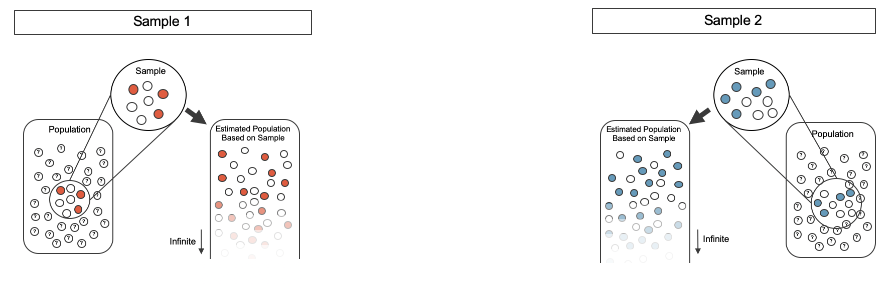
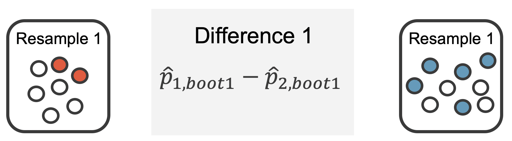
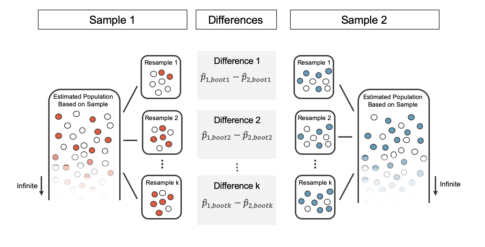
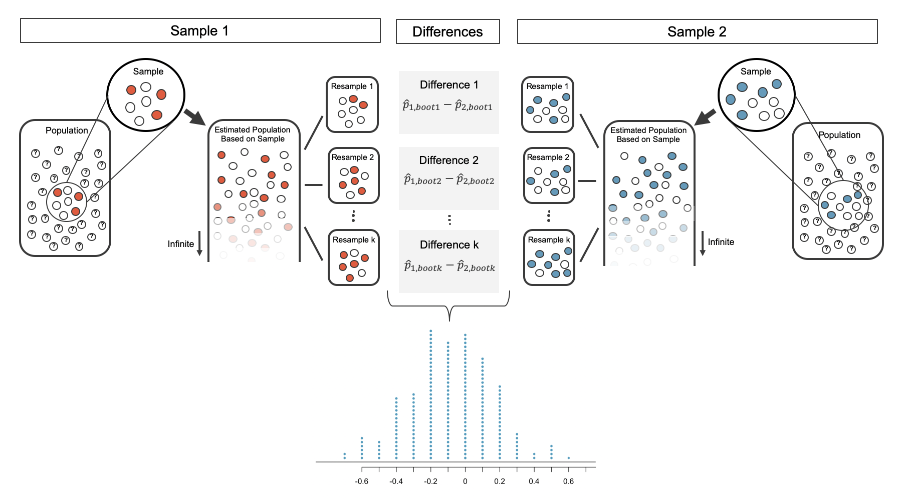

# Inference for comparing two proportions {#inference-two-props}

```{r, include = FALSE}
source("_common.R")
```

::: {.chapterintro data-latex=""}
We now extend the methods from Chapter \@ref(inference-one-prop) to apply confidence intervals and hypothesis tests to differences in population proportions that come from two groups, Group 1 and Group 2: $p_1 - p_2.$

In our investigations, we'll identify a reasonable point estimate of $p_1 - p_2$ based on the sample, and you may have already guessed its form: $\hat{p}_1 - \hat{p}_2.$ \index{point estimate!difference of proportions} Then we'll look at the inferential analysis in three different ways: using a randomization test, applying bootstrapping for interval estimates, and, if we verify that the point estimate can be modeled using a normal distribution, we compute the estimate's standard error, and we apply the mathematical framework.
:::

```{r include=FALSE}
terms_chp_17 <- c("point estimate")
```

## Randomization test for the difference in proportions {#two-prop-errors}

### Observed data

Let's take another look at the cardiopulmonary resuscitation (CPR) study we introduced in Chapter \@ref(two-sided-hypotheses).
The experiment consisted of two treatments on patients who underwent CPR for a heart attack and were subsequently admitted to a hospital.
Each patient was randomly assigned to either receive a blood thinner (treatment group) or not receive a blood thinner (control group).
The outcome variable of interest was whether the patient survived for at least 24 hours.
[@Bottiger:2001]

::: {.data data-latex=""}
The [`cpr`](http://openintrostat.github.io/openintro/reference/cpr.html) data can be found in the [**openintro**](http://openintrostat.github.io/openintro) R package.
:::

The results are summarized in Table \@ref(tab:cpr-summary-again) (which is a replica of Table \@ref(tab:cpr-summary)).
11 out of the 50 patients in the control group and 14 out of the 40 patients in the treatment group survived.

```{r cpr-summary-again}
cpr %>%
  mutate(
    outcome = str_to_title(outcome),
    group   = str_to_title(group)
    ) %>%
  count(group, outcome) %>%
  pivot_wider(names_from = outcome, values_from = n) %>%
  janitor::adorn_totals(where = c("row", "col")) %>%
  kbl(linesep = "", booktabs = TRUE, 
    caption = "Results for the CPR study. Patients in the treatment group were given a blood thinner, and patients in the control group were not.",
    col.names = c("Group", "Died", "Survived", "Total"),
    align = "lccc"
    ) %>%
  kable_styling(bootstrap_options = c("striped", "condensed"),
                latex_options = c("striped", "hold_position"), 
                full_width = FALSE) %>%
  column_spec(1:4, width = "7em")
```

::: {.guidedpractice data-latex=""}
Is this an observational study or an experiment?
What implications does the study type have on what can be inferred from the results?[^inference-two-props-1]
:::

[^inference-two-props-1]: The study is an experiment, as patients were randomly assigned an experiment group.
    Since this is an experiment, the results can be used to evaluate a causal relationship between blood thinner use after CPR and whether patients survived.

In this study, a larger proportion of patients who received blood thinner after CPR,$\hat{p}_T = \frac{14}{40} = 0.35,$ survived compared to those who did not receive blood thinner, $\hat{p}_C = \frac{11}{50} = 0.22.$ However, based on these observed proportions alone, we cannot determine whether the difference ($\hat{p}_T - \hat{p}_C = 0.35 - 0.22 = 0.13$) provides *convincing evidence* that blood thinner usage after CPR is effective.

As we saw in Chapter \@ref(foundations-randomization), we can re-randomize the responses (`survived` or `died`) to the treatment conditions assuming the null hypothesis is true and compute possible differences in proportions.
The process by which we randomize observations to two groups is summarized and visualized in Figure \@ref(fig:fullrand).

### Variability of the statistic

Figure \@ref(fig:cpr-rand-dot-plot) shows a stacked plot of the differences found from 100 randomization simulations (i.e., repeated iterations as described in Figure \@ref(fig:fullrand)), where each dot represents a simulated difference between the infection rates (control rate minus treatment rate).

```{r cpr-rand-dot-plot, fig.cap="(ref:cpr-rand-dot-plot-cap)"}
set.seed(47)
cpr %>%
  specify(response = outcome, explanatory = group, success = "survived") %>%
  hypothesize(null = "independence") %>%
  generate(reps = 100, type = "permute") %>%
  calculate(stat = "diff in props", order = c("treatment", "control")) %>%
  # simplify by rounding
  mutate(stat = round(stat, 3)) %>%
  ggplot(aes(x = stat)) +
  geom_dotplot(binwidth = 0.02, dotsize = 0.5) +
  labs(y = NULL, x = "Difference in survival rates (treatment - control)") +
  theme(axis.title.y = element_blank(),
        axis.text.y  = element_blank(),
        axis.ticks.y = element_blank()) +
  gghighlight(stat >= 0.13)
```

(ref:cpr-rand-dot-plot-cap) A stacked dot plot of differences from 100 simulations produced under the independence model $H_0,$ where in these simulations survival is unaffected by the treatment. Twelve of the 100 simulations had a difference of at least 13%, the difference observed in the study.

### Observed statistic vs null statistics

Note that the distribution of these simulated differences is centered around 0.
We simulated the differences assuming that the independence model was true, that blood thinners after CPR have no effect on survival.
Under the null hypothesis, we expect the difference to be near zero with some random fluctuation, where *near* is pretty generous in this case since the sample sizes are so small in this study.

::: {.workedexample data-latex=""}
How often would you observe a difference of at least 13% (0.13) according to Figure \@ref(fig:cpr-rand-dot-plot)?
Is this a rare event?

------------------------------------------------------------------------

It appears that a difference of at least 13% due to chance alone, if the null hypothesis was true would happen about 12% of the time according to Figure \@ref(fig:cpr-rand-dot-plot).
This is not a very rare event.
:::

The difference of 13% not being a rare event suggests two possible interpretations of the results of the study:

-   $H_0$ Independence model. Blood thinners after CPR have no effect on survival, and we just happened to observe a difference that would only occur on a rare occasion.
-   $H_A$ Alternative model. Blood thinners after CPR increase chance of survival, and the difference we observed was actually due to the blood thinners after CPR being effective at increasing the chance of survival, which explains the difference of 13%.

Since we determined that the outcome is not that rare (12% chance of observing a difference of 13% or more under the assumption that blood thinners after CPR have no effect on survival), we fail to reject $H_0$, and conclude that the study results do not provide strong evidence against the independence model.
This doesn't mean that we have proved that blood thinners are not effective, it just means that this study does not provide convincing evidence that they are effective in this setting.

Statistical inference, is built on evaluating how likely such differences are to occur due to chance if in fact the null hypothesis is true.
In statistical inference, data scientists evaluate which model is most reasonable given the data.
Errors do occur, just like rare events, and we might choose the wrong model.
While we do not always choose correctly, statistical inference gives us tools to control and evaluate how often these errors occur.

## Bootstrap confidence interval for the difference in proportions {#two-prop-boot-ci}

In Section \@ref(two-prop-errors), we worked with the randomization distribution to understand the distribution of $\hat{p}_1 - \hat{p}_2$ when the null hypothesis $H_0: p_1 - p_2 = 0$ is true.
Now, through bootstrapping, we study the variability of $\hat{p}_1 - \hat{p}_2$ without assuming the null hypothesis is true.

### Observed data

Reconsider the CPR data from Section \@ref(two-prop-errors) which is provided in Table \@ref(tab:cpr-summary).
Again, we use the difference in sample proportions as the observed statistic of interest.
Here, the value of the statistic is: $\hat{p}_T - \hat{p}_C = 0.35 - 0.22 = 0.13.$

### Variability of the difference in sample proportions

The bootstrap method applied to two samples is an extension of the method described in Chapter \@ref(foundations-bootstrapping).
Now, we have two samples, so each sample estimates the population from which they came.
In the CPR setting, the `treatment` sample estimates the population of all individuals who have gotten (or will get) the treatment; the `control` sample estimate the population of all individuals who do not get the treatment and are controls.
Figure \@ref(fig:boot2proppops) extends Figure \@ref(fig:boot1) to show the bootstrapping process from two samples simultaneously.

```{r boot2proppops, fig.cap = "Creating two populations from which to take each of the bootstrap samples.", warning = FALSE, out.width = "100%"}

```

As before, once the population is estimated, we can randomly resample observations to create bootstrap samples, as seen in Figure \@ref(fig:boot2propresamps).

```{r boot2propresamps, fig.cap = "Taking each bootstrap sample from the estimated population.", out.width = "100%"}
include_graphics("images/boot2propresamps.png")
```

The variability of the statistic (the difference in sample proportions) can be calculated by taking one bootstrap resample from Sample 1 and one bootstrap resample from Sample 2 and calculating the difference in the bootstrap proportions.

```{r boot2samp2, fig.cap = "For example, the first bootstrap resamples from Sample 1 and Sample 2 provide resample proportions of 2/7 and 5/9, respectively.", out.width="75%"}

```

As always, the variability of the difference in proportions can only be estimated by repeated simulations, in this case, repeated bootstrap resamples.
Figure \@ref(fig:boot2samp2) shows multiple bootstrap differences calculated for each of the repeated bootstrap samples.

```{r boot2samp3, fig.cap = "For each pair of bootstrap samples, we calculate the difference in sample proportions", out.width="100%"}

```

Repeated bootstrap simulations lead to a bootstrap sampling distribution of the statistic of interest, here the difference in sample proportions.
Figure \@ref(fig:boot2samp1) visualizes the process and Figure \@ref(fig:bootCPR1000) shows 1,000 bootstrap differences in proportions for the CPR data.
Note that the CPR data includes 40 and 50 people in the respective groups, and the illustrated example includes 7 and 9 people in the two groups.
Accordingly, the variability in the distribution of sample proportions is higher for the illustrated example.
As you will see in the mathematical models discussed in Section \@ref(math-2prop), large sample sizes lead to smaller standard errors for a difference in proportions.

```{r boot2samp1, fig.cap = "The differences in each bootstrapped pair of proportions are combined to create the sampling distribution of the differences in proportions.", out.width="100%"}

```

```{r bootCPR1000, fig.cap="A histogram of differences in proportions from 1000 bootstrap simulations of the CPR data.  Note that because the CPR data has a larger sample size than the illustrated example, the variability of the difference in proportions is much smaller with the CPR histogram."}
set.seed(47)
cpr_boot_dist <- cpr %>%
  specify(response = outcome, explanatory = group, success = "survived") %>%
  generate(reps = 1000, type = "bootstrap") %>%
  calculate(stat = "diff in props", order = c("treatment", "control"))

ggplot(cpr_boot_dist, aes(x = stat)) +
  geom_histogram(binwidth = 0.05) +
  labs(
    x = "Difference in bootstrapped survival rates\n(treatment - control)",
    y = "Count"
  )
```

### Bootstrap percentile vs. SE confidence intervals

Figure \@ref(fig:bootCPR1000) provides an estimate for the variability of the difference in survival proportions from sample to sample.
The values in the histogram can be used in two different ways to create a confidence interval for the parameter of interest: $p_1 - p_2.$

**Bootstrap percentile confidence interval**

```{r}
cpr_boot_90 <- cpr_boot_dist %>%
  summarise(
    lower = round(quantile(stat, 0.05), 3),
    upper = round(quantile(stat, 0.95), 3)
  )

cpr_boot_90_lower_perc <- cpr_boot_90 %>% pull(lower)
cpr_boot_90_upper_perc <- cpr_boot_90 %>% pull(upper)
```

As in Chapter \@ref(foundations-bootstrapping), the bootstrap confidence interval can be calculated directly from the bootstrapped differences in Figure \@ref(fig:bootCPR1000).
The interval created from the percentiles of the distribution is called the **percentile interval**.
Note that here we calculate the 90% confidence interval by finding the $5^{th}$ and $95^{th}$ percentile values from the bootstrapped differences.
The bootstrap 5 percentile proportion is `r cpr_boot_90_lower_perc` and the 95 percentile is `r cpr_boot_90_upper_perc`.
The result is: we are 90% confident that, in the population, the true difference in probability of survival for individuals receiving blood thinners after CPR is between `r cpr_boot_90_lower_perc` lower and `r cpr_boot_90_upper_perc` higher than those who did not receive blood thinners.
The interval shows that we do not have much definitive evidence of the affect of blood thinners, one way or another.

```{r include=FALSE}
terms_chp_17 <- c(terms_chp_17, "percentile interval")
```

```{r bootCPR1000CI, fig.cap = "The CPR data is bootstrapped 1000 times. Each simulation creates a sample from the original data where the probability of survival in the treatment group is $\\hat{p}_{T}  = 14/40$ and the probability of survival in the control group is $\\hat{p}_{C} = 11/50.$ ", out.width = "100%"}

ggplot(cpr_boot_dist, aes(x = stat)) +
  geom_histogram(binwidth = 0.05) +
  labs(
    x = "Difference in bootstrapped survival rates\n(treatment - control)",
    y = "Count"
  ) +
  gghighlight(stat <= cpr_boot_90_lower_perc | stat >= cpr_boot_90_upper_perc) +
  annotate(
    "segment",
    x = c(cpr_boot_90_lower_perc, cpr_boot_90_upper_perc), xend = c(cpr_boot_90_lower_perc, cpr_boot_90_upper_perc),
    y = 0, yend = 175
  ) +
  annotate("text", x = cpr_boot_90_lower_perc, y = 190, label = "5th percentile") +
  annotate("text", x = cpr_boot_90_upper_perc, y = 190, label = "95th percentile")
```

**Bootstrap SE confidence interval**

```{r}
cpr_boot_se <- cpr_boot_dist %>%
  summarise(se = round(sd(stat), 4)) %>%
  pull(se)

cpr_boot_90_lower_se <- round((14/40 - 11/50) - 2 * cpr_boot_se, 3)
cpr_boot_90_upper_se <- round((14/40 - 11/50) + 2 * cpr_boot_se, 3)
```

Alternatively, we can use the variability in the bootstrapped differences to calculate a standard error of the difference.
The resulting interval is called the **SE interval**.
Section \@ref(math-2prop) details the mathematical model for the standard error of the difference in sample proportions, but the bootstrap distribution typically does an excellent job of estimating the variability of the sampling distribution of the sample statistic.

```{r include=FALSE}
terms_chp_17 <- c(terms_chp_17, "SE interval")
```

$$SE(\hat{p}_T - \hat{p}_C) \approx SE(\hat{p}_{T, boot} - \hat{p}_{C, boot}) = `r cpr_boot_se`$$

The variability of the difference in proportions was calculated in R using the `sd()` function, but any statistical software will calculate the standard deviation of the differences, here, the exact quantity we hope to approximate.

Note that we do not know know the true distribution of $\hat{p}_T - \hat{p}_C,$ so we will use a rough approximation to find a confidence interval for $p_T - p_C.$ As seen in the bootstrap histograms, the shape of the distribution is roughly symmetric and bell-shaped.
So for a rough approximation, we will apply the 67-95-99.7 rule which tells us that 95% of observed differences should be roughly no farther than 2 SE from the true parameter (difference in proportions).
A 95% confidence interval for $p_T - p_C$ is given by:

$$\hat{p}_T - \hat{p}_C \pm 2 \cdot SE \ \ \ \rightarrow \ \ \ 14/40 - 11/50 \pm 2 \cdot `r cpr_boot_se` \ \ \  \rightarrow \ \ \  (`r cpr_boot_90_lower_se`, `r cpr_boot_90_upper_se`)$$

We are 95% confident that the true value of $p_T - p_C$ is between `r cpr_boot_90_lower_se` and `r cpr_boot_90_upper_se`.
Again, the wide confidence interval that contains zero indicates that the study provides very little evidence about the effectiveness of blood thinners.
For other percentages, e.g., a 90% bootstrap SE confidence interval, we will use quantiles given by the standard normal distribution, as seen in Section \@ref(normalDist) and Figure \@ref(fig:er6895997).

### What does 95% mean?

Recall that the goal of a confidence interval is to find a plausible range of values for a *parameter* of interest.
The estimated statistic is not the value of interest, but it is typically the best guess for the unknown parameter.
The confidence level (often 95%) is a number that takes a while to get used to.
Surprisingly, the percentage doesn't describe the dataset at hand, it describes many possible datasets.
One way to understand a confidence interval is to think about all the confidence intervals that you have ever made or that you will ever make as a scientist, the confidence level describes **those** intervals.

Figure \@ref(fig:ci25ints) demonstrates a hypothetical situation in which 25 different studies are performed on the exact same population (with the same goal of estimating the true parameter value of $p_1 - p_2 = 0.47).$ The study at hand represents one point estimate (a dot) and a corresponding interval.
It is not possible to know whether the interval at hand is to the right of the unknown true parameter value (the black line) or to the left of that line.
It is also impossible to know whether the interval captures the true parameter (is blue) or doesn't (is red).
If we are making 95% intervals, then about 5% of the intervals we create over our lifetime will *not* capture the parameter of interest (e.g., will be red as in Figure \@ref(fig:ci25ints) ).
What we know is that over our lifetimes as scientists, about 95% of the intervals created and reported on will capture the parameter value of interest: thus the language "95% confident."

```{r ci25ints, fig.cap = "One hypothetical population, parameter value of: $p_1 - p_2 = 0.47.$  Twenty-five different studies all which led to a different point estimate, SE, and confidence interval.  The study at hand is one of the horizontal lines (hopefully a blue line!)."}
set.seed(52)
m <- 103.4594
s <- 19.31445
n <- 100
k <- 25
SE <- s/sqrt(n)

set.seed(47)
means <- c()
SE    <- c()
for(i in 1:k){
  temp <- sample(nrow(run09), n)
  d    <- run09$time[temp]
  means[i] <- mean(d, na.rm = TRUE)
  SE[i]    <- sd(d)/sqrt(n)
}
xR <- m + 4 * c(-1, 1) * s / sqrt(n)
yR <- c(0.7, 25.3)
plot(xR, yR,
     type = 'n',
     xlab = '',
     ylab = '',
     axes = FALSE)
abline(v = m, lty = 2, col = IMSCOL["black", "f1"])
axis(1, at = m, expression('p'[1]*' - p'[2]*' = 0.47'))
for(i in 1:k){
  ci <- means[i] + 2 * c(-1, 1) * SE[i]
  if(abs(means[i] - m) > 1.96 * SE[i]){
    col <- IMSCOL["red", "full"]
    points(means[i], i, cex = 1.4, col = col)
    lines(ci, rep(i, 2), col = col, lwd = 4)
  } else {
    col <- IMSCOL["blue", "full"]
  }
  points(means[i], i, pch = 20, cex = 1.2, col = col)
  lines(ci, rep(i, 2), col = col)
}
```

The choice of 95% or 90% or even 99% as a confidence level is admittedly somewhat arbitrary; however, it is related to the logic we used when deciding that a p-value should be declared as "significant" if it is lower than 0.05 (or 0.10 or 0.01, respectively).
Indeed, one can show mathematically, that a 95% confidence interval and a two-sided hypothesis test at a cutoff of 0.05 will provide the same conclusion when the same data and mathematical tools are applied for the analysis.
A full derivation of the explicit connection between confidence intervals and hypothesis tests is beyond the scope of this text.

## Mathematical model for the difference in proportions {#math-2prop}

### Variability of the difference between two proportions

Like with $\hat{p},$ the difference of two sample proportions $\hat{p}_1 - \hat{p}_2$ can be modeled using a normal distribution when certain conditions are met.
First, we require a broader independence condition, and secondly, the success-failure condition must be met by both groups.

::: {.important data-latex=""}
**Conditions for the sampling distribution of** $\hat{p}_1 -\hat{p}_2$ **to be normal.**

The difference $\hat{p}_1 - \hat{p}_2$ can be modeled using a normal distribution when

1.  *Independence* (extended). The data are independent within and between the two groups. Generally this is satisfied if the data come from two independent random samples or if the data come from a randomized experiment.
2.  *Success-failure condition.* The success-failure condition holds for both groups, where we check successes and failures in each group separately. That is, we should have at least 10 successes and 10 failures in each of the two groups.

When these conditions are satisfied, the standard error of $\hat{p}_1 - \hat{p}_2$ is:

$$SE(\hat{p}_1 - \hat{p}_2) = \sqrt{\frac{p_1(1-p_1)}{n_1} + \frac{p_2(1-p_2)}{n_2}}$$

where $p_1$ and $p_2$ represent the population proportions, and $n_1$ and $n_2$ represent the sample sizes.

Note that in most cases, the standard error is approximated using the observed data:

$$SE(\hat{p}_1 - \hat{p}_2) = \sqrt{\frac{\hat{p}_1(1-\hat{p}_1)}{n_1} + \frac{\hat{p}_2(1-\hat{p}_2)}{n_2}}$$

where $\hat{p}_1$ and $\hat{p}_2$ represent the observed sample proportions, and $n_1$ and $n_2$ represent the sample sizes.
:::

Recall that the margin of error is defined by the standard error.
The margin of error for $\hat{p}_1 - \hat{p}_2$ can be directly obtained from $SE(\hat{p}_1 - \hat{p}_2).$

::: {.important data-latex=""}
**Margin of error for** $\hat{p}_1 - \hat{p}_2.$

The margin of error is $z^\star \times \sqrt{\frac{\hat{p}_1(1-\hat{p}_1)}{n_1} + \frac{\hat{p}_2(1-\hat{p}_2)}{n_2}}$ where $z^\star$ is calculated from a specified percentile on the normal distribution.
:::

\index{standard error (SE)!difference in proportions}

```{r include=FALSE}
terms_chp_17 <- c(terms_chp_17, "SE difference in proportions")
```

### Confidence interval for the difference between two proportions

We can apply the generic confidence interval formula for a difference of two proportions, where we use $\hat{p}_1 - \hat{p}_2$ as the point estimate and substitute the $SE$ formula:

$$
\begin{aligned}
\text{point estimate} \ &\pm \  z^{\star} \ \times \ SE \\
(\hat{p}_1 - \hat{p}_2) \ &\pm \ z^{\star} \times \sqrt{\frac{\hat{p}_1(1-\hat{p}_1)}{n_1} + \frac{\hat{p}_2(1-\hat{p}_2)}{n_2}}
\end{aligned}
$$

::: {.important data-latex=""}
**Standard error of the difference in two proportions,** $\hat{p}_1 -\hat{p}_2.$

When the conditions for the normal model are are met, the **variability** of the difference in proportions, $\hat{p}_1 -\hat{p}_2,$ is well described by:

$$SE(\hat{p}_1 -\hat{p}_2) = \sqrt{\frac{\hat{p}_1(1-\hat{p}_1)}{n_1} + \frac{\hat{p}_2(1-\hat{p}_2)}{n_2}}$$
:::

::: {.workedexample data-latex=""}
We reconsider the experiment for patients who underwent cardiopulmonary resuscitation (CPR) for a heart attack and were subsequently admitted to a hospital.
These patients were randomly divided into a treatment group where they received a blood thinner or the control group where they did not receive a blood thinner.
The outcome variable of interest was whether the patients survived for at least 24 hours.
The results are shown in Table \@ref(tab:cpr-summary).
Check whether we can model the difference in sample proportions using the normal distribution.

------------------------------------------------------------------------

We first check for independence: since this is a randomized experiment, it seems reasonable to assume that the observations are idependent.

Next, we check the success-failure condition for each group.
We have at least 10 successes and 10 failures in each experiment arm (11, 14, 39, 26), so this condition is also satisfied.

With both conditions satisfied, the difference in sample proportions can be reasonably modeled using a normal distribution for these data.
:::

::: {.workedexample data-latex=""}
Create and interpret a 90% confidence interval of the difference for the survival rates in the CPR study.

------------------------------------------------------------------------

We'll use $p_T$ for the survival rate in the treatment group and $p_C$ for the control group:

$$\hat{p}_{T} - \hat{p}_{C} = \frac{14}{40} - \frac{11}{50}  = 0.35 - 0.22 = 0.13$$

We use the standard error formula previously provided.
As with the one-sample proportion case, we use the sample estimates of each proportion in the formula in the confidence interval context:

$$SE \approx \sqrt{\frac{0.35 (1 - 0.35)}{40} + \frac{0.22 (1 - 0.22)}{50}}  = 0.095$$

For a 90% confidence interval, we use $z^{\star} = 1.65:$

$$
\begin{aligned}
\text{point estimate} \ &\pm \ z^{\star} \ \times \ SE \\
0.13 \ &\pm \ 1.65 \ \times \ 0.095 \\
(-0.027 \ &, \ 0.287)
\end{aligned}
$$

We are 90% confident that individuals receiving blood thinners have between a 2.7% less chance of survival to a 28.7% greater chance of survival than those in the control group.
Because 0% is contained in the interval, we do not have enough information to say whether blood thinners help or harm heart attack patients who have been admitted after they have undergone CPR.

Note, the problem was set up as 90% to indicate that there was not a need for a high level of confidence (such a 95% or 99%).
A lower degree of confidence increases potential for error, but it also produces a more narrow interval.
:::

::: {.guidedpractice data-latex=""}
A 5-year experiment was conducted to evaluate the effectiveness of fish oils on reducing cardiovascular events, where each subject was randomized into one of two treatment groups [@Manson:2019].
We'll consider heart attack outcomes in the patients listed in Table \@ref(tab:fish-oil-data).

Create a 95% confidence interval for the effect of fish oils on heart attacks for patients who are well-represented by those in the study.
Also interpret the interval in the context of the study.[^inference-two-props-2]
:::

[^inference-two-props-2]: Because the patients were randomized, the subjects are independent, both within and between the two groups.
    The success-failure condition is also met for both groups as all counts are at least 10.
    This satisfies the conditions necessary to model the difference in proportions using a normal distribution.
    Compute the sample proportions $(\hat{p}_{\text{fish oil}} = 0.0112,$ $\hat{p}_{\text{placebo}} = 0.0155),$ point estimate of the difference $(0.0112 - 0.0155 = -0.0043),$ and standard error $SE = \sqrt{\frac{0.0112 \times 0.9888}{12933} + \frac{0.0155 \times 0.9845}{12938}},$ $SE = 0.00145.$ Next, plug the values into the general formula for a confidence interval, where we'll use a 95% confidence level with $z^{\star} = 1.96:$ $-0.0043 \pm 1.96 \times 0.00145 = (-0.0071, -0.0015).$ We are 95% confident that fish oils decreases heart attacks by 0.15 to 0.71 percentage points (off of a baseline of about 1.55%) over a 5-year period for subjects who are similar to those in the study.
    Because the interval is entirely below 0, and the treatment was randomly assigned the data provide strong evidence that fish oil supplements reduce heart attacks in patients like those in the study.

```{r fish-oil-data}
fish_oil_18[[3]] %>% 
  as_tibble() %>%
  mutate(group = c("fish oil", "placebo")) %>%
  mutate(total = myocardioal_infarction + no_event) %>%
  column_to_rownames(var = "group") %>%
  kbl(linesep = "", booktabs = TRUE, caption = "Results for the study on n-3 fatty acid supplement and related health benefits.", 
      col.names = c("heart attack", "no event", "Total"),
      row.names = TRUE) %>%
  kable_styling(bootstrap_options = c("striped", "condensed"), 
                latex_options = c("striped", "hold_position"), full_width = FALSE) %>%
  column_spec(1:4, width = "7em")
```

::: {.data data-latex=""}
The [`fish_oil_18`](http://openintrostat.github.io/openintro/reference/fish_oil.html) data can be found in the [**openintro**](http://openintrostat.github.io/openintro) R package.
:::

### Hypothesis test for the difference between two proportions

The details for calculating a SE and for checking technical conditions are very similar to that of confidence intervals.
However, when the null hypothesis is that $p_1 - p_2 = 0,$ we use a special proportion called the **pooled proportion**\index{pooled proportion} to estimate the SE and to check the success-failure condition.

::: {.important data-latex=""}
**Use the pooled proportion when** $H_0$ is $p_1 - p_2 = 0.$

When the null hypothesis is that the proportions are equal, use the pooled proportion $(\hat{p}_{\textit{pool}})$ of successes to verify the success-failure condition and estimate the standard error:

$$\hat{p}_{\textit{pool}} = \frac{\text{number of successes}}{\text{number of cases}} = \frac{\hat{p}_1 n_1 + \hat{p}_2 n_2}{n_1 + n_2}$$

Here $\hat{p}_1 n_1$ represents the number of successes in sample 1 because $\hat{p}_1 = \frac{\text{number of successes in sample 1}}{n_1}.$

Similarly, $\hat{p}_2 n_2$ represents the number of successes in sample 2.
:::

::: {.important data-latex=""}
**The test statistic for assessing two proportions is a Z.**

The Z score is a ratio of how the two sample proportions differ as compared to the expected variability of difference between the proportions.

$$Z = \frac{(\hat{p}_1 - \hat{p}_2) - 0}{\sqrt{\hat{p}_{pool}(1-\hat{p}_{pool}) \bigg(\frac{1}{n_1} + \frac{1}{n_2} \bigg)}}$$

When the null hypothesis is true and the conditions are met, Z has a standard normal distribution.
See the box below for calculation of the pooled proportion of successes.

Conditions:

-   Independent observations
-   Large samples: $(n_1 p_1 \geq 10$ and $n_1 (1-p_1) \geq 10$ and $n_2 p_2 \geq 10$ and $n_2 (1-p_2) \geq 10)$
-   Check conditions using: $(n_1 \hat{p}_{\textit{pool}} \geq 10$ and $n_1 (1-\hat{p}_{\textit{pool}}) \geq 10$ and $n_2 \hat{p}_{\textit{pool}}\geq 10$ and $n_2 (1-\hat{p}_{\textit{pool}}) \geq 10)$
:::

```{r include=FALSE}
terms_chp_17 <- c(terms_chp_17, "Z score two proportions")
```

A mammogram is an X-ray procedure used to check for breast cancer.
Whether mammograms should be used is part of a controversial discussion, and it's the topic of our next example where we learn about 2-proportion hypothesis tests when $H_0$ is $p_1 - p_2 = 0$ (or equivalently, $p_1 = p_2).$

A 30-year study was conducted with nearly 90,000 participants who identified as female.
During a 5-year screening period, each participant was randomized to one of two groups: in the first group, participants received regular mammograms to screen for breast cancer, and in the second group, participants received regular non-mammogram breast cancer exams.
No intervention was made during the following 25 years of the study, and we'll consider death resulting from breast cancer over the full 30-year period.
Results from the study are summarized in Figure \@ref(tab:mammogramStudySummaryTable).

::: {.data data-latex=""}
The [`mammogram`](http://openintrostat.github.io/openintro/reference/mammogram.html) data can be found in the [**openintro**](http://openintrostat.github.io/openintro) R package.
:::

If mammograms are much more effective than non-mammogram breast cancer exams, then we would expect to see additional deaths from breast cancer in the control group.
On the other hand, if mammograms are not as effective as regular breast cancer exams, we would expect to see an increase in breast cancer deaths in the mammogram group.

```{r mammogramStudySummaryTable}
mammogram %>%
  mutate(breast_cancer_death = fct_rev(breast_cancer_death)) %>%
  count(treatment, breast_cancer_death) %>%
  pivot_wider(names_from = breast_cancer_death, values_from = n) %>%
  kbl(linesep = "", booktabs = TRUE, 
    caption = "Summary results for breast cancer study.",
    col.names = c("Treatment", "Yes", "No"),
    format.args = list(big.mark = ",")
  ) %>%
  add_header_above(c("", "Death from breast cancer?" = 2)) %>%
  kable_styling(bootstrap_options = c("striped", "condensed"), 
                latex_options = c("striped", "hold_position"), full_width = FALSE)
```

::: {.guidedpractice data-latex=""}
Is this study an experiment or an observational study?[^inference-two-props-3]
:::

[^inference-two-props-3]: This is an experiment.
    Patients were randomized to receive mammograms or a standard breast cancer exam.
    We will be able to make causal conclusions based on this study.

::: {.guidedpractice data-latex=""}
Set up hypotheses to test whether there was a difference in breast cancer deaths in the mammogram and control groups.[^inference-two-props-4]
:::

[^inference-two-props-4]: $H_0:$ the breast cancer death rate for patients screened using mammograms is the same as the breast cancer death rate for patients in the control, $p_{MGM} - p_{C} = 0.$ $H_A:$ the breast cancer death rate for patients screened using mammograms is different than the breast cancer death rate for patients in the control, $p_{MGM} - p_{C} \neq 0.$

The research question describing mammograms is set up to address specific hypotheses (in contrast to a confidence interval for a parameter).
In order to fully take advantage of the hypothesis testing structure, we asses the randomness under the condition that the null hypothesis is true (as we always do for hypothesis testing).
Using the data from Table \@ref(tab:mammogramStudySummaryTable), we will check the conditions for using a normal distribution to analyze the results of the study using a hypothesis test.

$$
\begin{aligned}
\hat{p}_{\textit{pool}}
    &= \frac
        {\text{number of patients who died from breast cancer in the entire study}}
        {\text{number of patients in the entire study}} \\
    &= \frac{500 + 505}{500 + \text{44,425} + 505 + \text{44,405}} \\
    &= 0.0112
\end{aligned} 
$$

This proportion is an estimate of the breast cancer death rate across the entire study, and it's our best estimate of the proportions $p_{MGM}$ and $p_{C}$ *if the null hypothesis is true that* $p_{MGM} = p_{C}.$ We will also use this pooled proportion when computing the standard error.

```{r include=FALSE}
terms_chp_17 <- c(terms_chp_17, "pooled proportion")
```

::: {.workedexample data-latex=""}
Is it reasonable to model the difference in proportions using a normal distribution in this study?

------------------------------------------------------------------------

Because the patients were randomized, observations can be assumed to be independent, both within each group and between treatment groups.
We also must check the success-failure condition for each group.
Under the null hypothesis, the proportions $p_{MGM}$ and $p_{C}$ are equal, so we check the success-failure condition with our best estimate of these values under $H_0,$ the pooled proportion from the two samples, $\hat{p}_{\textit{pool}} = 0.0112:$

$$
\begin{aligned}
\hat{p}_{\textit{pool}} \times n_{MGM}
      &= 0.0112 \times \text{44,925} = 503\\
 (1 - \hat{p}_{\textit{pool}}) \times n_{MGM}
      &= 0.9888 \times \text{44,925} = \text{44,422} \\
  \hat{p}_{\textit{pool}} \times n_{C}
      &= 0.0112 \times \text{44,910} = 503\\
  (1 - \hat{p}_{\textit{pool}}) \times n_{C}
      &= 0.9888 \times \text{44,910} = \text{44,407}
\end{aligned}
$$

The success-failure condition is satisfied since all values are at least 10.
With both conditions satisfied, we can safely model the difference in proportions using a normal distribution.
:::

In the previous example, the pooled proportion was used to check the success-failure condition[^inference-two-props-5].
In the next example, we see an additional place where the pooled proportion comes into play: the standard error calculation.

[^inference-two-props-5]: For an example of a two-proportion hypothesis test that does not require the success-failure condition to be met, see Section \@ref(two-prop-errors).

::: {.workedexample data-latex=""}
Compute the point estimate of the difference in breast cancer death rates in the two groups, and use the pooled proportion $\hat{p}_{\textit{pool}} = 0.0112$ to calculate the standard error.

------------------------------------------------------------------------

The point estimate of the difference in breast cancer death rates is

$$
\begin{aligned}
\hat{p}_{MGM} - \hat{p}_{C}
    &= \frac{500}{500 + 44,425} - \frac{505}{505 + 44,405} \\
    &= 0.01113 - 0.01125 \\
    &= -0.00012
\end{aligned} 
$$

The breast cancer death rate in the mammogram group was 0.012% less than in the control group.
Next, the standard error is calculated *using the pooled proportion,* $\hat{p}_{\textit{pool}}:$

$$SE = \sqrt{\frac{\hat{p}_{\textit{pool}}(1-\hat{p}_{\textit{pool}})}{n_{MGM}} + \frac{\hat{p}_{\textit{pool}}(1-\hat{p}_{\textit{pool}})}{n_{C}}}= 0.00070$$
:::

::: {.workedexample data-latex=""}
Using the point estimate $\hat{p}_{MGM} - \hat{p}_{C} = -0.00012$ and standard error $SE = 0.00070,$ calculate a p-value for the hypothesis test and write a conclusion.

------------------------------------------------------------------------

Just like in past tests, we first compute a test statistic and draw a picture:

$$Z = \frac{\text{point estimate} - \text{null value}}{SE} = \frac{-0.00012 - 0}{0.00070} = -0.17$$

The lower tail area is 0.4325, which we double to get the p-value: 0.8650.
Because this p-value is larger than 0.05, we do not reject the null hypothesis.
That is, the difference in breast cancer death rates is likely to have occurred just by chance, if the null hypothesis is true.
Thus, we do not observe benefits or harm from mammograms relative to a regular breast exam.
:::

```{r echo=FALSE, out.width = "60%", fig.asp = 0.5}
normTail(L = -0.17, U = 0.17, col = IMSCOL["blue", "full"])
```

Can we conclude that mammograms have no benefits or harm?
Here are a few considerations to keep in mind when reviewing the mammogram study as well as any other medical study:

-   We do not accept the null hypothesis, which means we don't have sufficient evidence to conclude that mammograms reduce or increase breast cancer deaths.
-   If mammograms are helpful or harmful, the data suggest the effect isn't very large.
-   Are mammograms more or less expensive than a non-mammogram breast exam? If one option is much more expensive than the other and doesn't offer clear benefits, then we should lean towards the less expensive option.
-   The study's authors also found that mammograms led to over-diagnosis of breast cancer, which means some breast cancers were found (or thought to be found) but that these cancers would not cause symptoms during patients' lifetimes. That is, something else would kill the patient before breast cancer symptoms appeared. This means some patients may have been treated for breast cancer unnecessarily, and this treatment is another cost to consider. It is also important to recognize that over-diagnosis can cause unnecessary physical or emotional harm to patients.

These considerations highlight the complexity around medical care and treatment recommendations.
Experts and medical boards who study medical treatments use considerations like those above to provide their best recommendation based on the current evidence.

\clearpage

## Chapter review {#chp17-review}

### Summary

When the parameter of interest is the difference in population proportions across two groups, randomization tests, bootstrapping, and mathematical modeling can be applied.
For confidence intervals, bootstrapping from each group separately will provide a sampling distribution for the difference in sample proportions; the mathematical model shows a similar distributional shape as long as the sample size is large enough to fulfill the success-failure conditions and so that the data are representative of the entire population.
Keep in mind that some datasets will produce a confidence interval which does not capture the true parameter, this is the nature of variability!
Over your lifetime, about 95% of the confidence intervals you create will capture the parameter of interest, and about 5% won't.
For hypothesis testing, repeated randomization of the explanatory variable creates a null distribution of differences in sample proportions that could have occurred under the null hypothesis.
Randomization and the mathematical model will have similar null distributions, as long as the sample size is large enough to fulfill the success-failure conditions.

### Terms

We introduced the following terms in the chapter.
If you're not sure what some of these terms mean, we recommend you go back in the text and review their definitions.
We are purposefully presenting them in alphabetical order, instead of in order of appearance, so they will be a little more challenging to locate.
However you should be able to easily spot them as **bolded text**.

```{r}
make_terms_table(terms_chp_17)
```

\clearpage

## Exercises {#chp17-exercises}

Answers to odd numbered exercises can be found in Appendix \@ref(exercise-solutions-17).

::: {.todo}
Add exercises
:::
