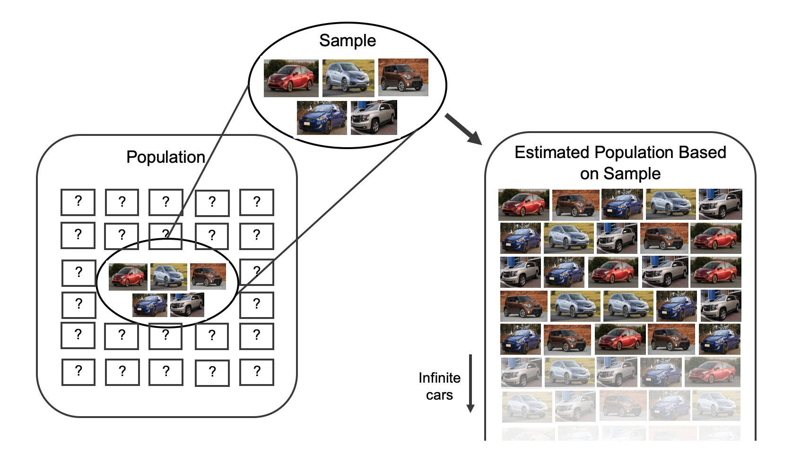
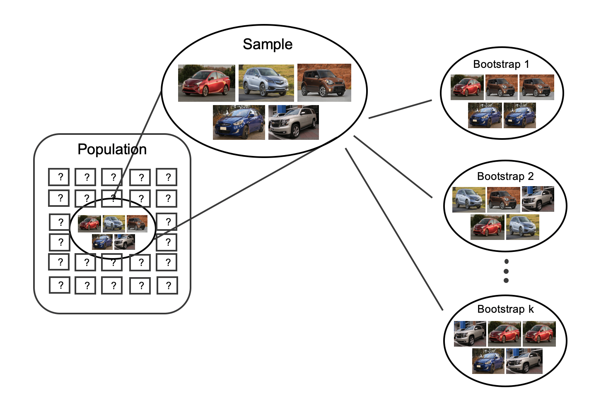

# Inference for a single mean {#inference-one-mean}

::: {.chapterintro}
Focusing now on Statistical Inference for **numerical data**, again, we will revisit and expand upon the foundational aspects of hypothesis testing from Chapter \@ref(foundations-randomization).

The important data structure for this chapter is a numeric response variable (that is, the outcome is quantitative).
The four data structures we detail are one numeric response variable, one numeric response variable which is a difference across a pair of observations, a numeric response variable broken down by a binary explanatory variable, and a numeric response variable broken down by an explanatory variable that has two or more levels.
When appropriate, each of the data structures will be analyzed using the three methods from Chapters \@ref(foundations-randomization), \@ref(foundations-bootstrapping), and \ref(foundations-mathematical): randomization test, bootstrapping, and mathematical models, respectively.

As we build on the inferential ideas, we will visit new foundational concepts in statistical inference.
One key new idea rests in estimating how the sample mean (as opposed to the sample proportion) varies from sample to sample; the resulting value is referred to as the standard error of the mean.
We will also introduce a new important mathematical model, the $t$-distribution (as the foundation for the $t$-test).
:::

```{r include=FALSE}
terms_chp_19 <- c("numerical data")
```

In this chapter, we focus on the sample mean (instead of, for example, the sample median or the range of the observations) because of the well-studied mathematical model which describes the behavior of the sample mean.
We will not cover mathematical models which describe other statistics, but the bootstrap and randomization techniques described below are immediately extendable to any function of the observed data.
The sample mean will be calculated in one group, two paired groups, two independent groups, and many groups settings.
The techniques described for each setting will vary slightly, but you will be well served to find the structural similarities across the different settings.

Similar to how we can model the behavior of the sample proportion $\hat{p}$ using a normal distribution, the sample mean $\bar{x}$ can also be modeled using a normal distribution when certain conditions are met.
\index{point estimate!single mean} However, we'll soon learn that a new distribution, called the $t$-distribution, tends to be more useful when working with the sample mean.
We'll first learn about this new distribution, then we'll use it to construct confidence intervals and conduct hypothesis tests for the mean.

## Bootstrap confidence interval for $\mu$ {#boot1mean}

Consider a situation where you want to know whether you should buy a franchise of the used car store Awesome Autos.
As part of your planning, you'd like to know for how much an average car from Awesome Autos sells.
In order to go through the example more clearly, let's say that you are only able to randomly sample five cars from Awesome Auto.
(If this were a real example, you would surely be able to take a much larger sample size, possibly even being able to measure the entire population!)

### Observed data

Figure \@ref(fig:5cars) shows a (small) random sample of observations from Awesome Auto.
The actual cars as well as their selling price is shown.

```{r 5cars, fig.cap = "A sample of five cars from Awesome Auto.", warning = FALSE,  out.width="75%"}

```

```{r}
aa_cars <- data.frame(price = c(18300, 20100, 9600, 10700, 27000))

#aa_cars %>% summarize(mean(price), sd(price), n())
```

The sample average car price of \$`r formatC(mean(aa_cars$price), format = "f", digits = 2)` is a first guess at the price of the average car price at Awesome Auto.
However, as a student of statistics, you understand that one sample mean based on a sample of five observations will not necessarily equal the true population average car price for all the cars at Awesome Auto.
Indeed, you can see that the observed car prices vary with a standard deviation of \$`r sd(aa_cars$price)`, and surely the average car price would be different if a different sample of size five had been taken from the population.
Fortunately, as it did in previous chapters for the sample proportion, bootstrapping will approximate the variability of the sample mean from sample to sample.

### Variability of the statistic

As with the inferential ideas covered in Chapters \@ref(foundations-randomization), \@ref(foundations-bootstrapping), and \@ref(foundations-mathematical), the inferential analysis methods in this chapter are grounded in quantifying how one dataset differs from another when they are both taken from the same population.
To repeat, the idea is that we want to know how datasets differ from one another, but we aren't ever going to take more than one sample of observations.
It doesn't make sense to take repeated samples from the same population because if you have the ability to take more samples, a larger sample size will benefit you more than the exact same sample twice.
Instead of taking repeated samples from the actual population, we use bootstrapping to measure how the samples behave under an estimate of the population.

As mentioned previously, to get a sense of the cars at Awesome Auto, you take a sample of 5 cars from the Awesome Auto branch near you as a way to gauge the price of the cars being sold.
Figure \@ref(fig:bootpop1mean) shows how the unknown original population can be estimated by using the sample to approximate the distribution of car prices from the population of cars at Awesome Auto.

```{r bootpop1mean, fig.cap = "As seen previously, the idea behind bootstrapping is to consider the sample at hand as an estimate of the population.  Sampling from the sample (of 5 cars) is identical to sampling from an infinite population which is made up of only the cars in the original sample.", warning = FALSE,  out.width="75%"}

```

By taking repeated samples from the estimated population, the variability from sample to sample can be observed.
In Figure \@ref(fig:boot2) the repeated bootstrap samples are seen to be different both from each other and from the original population.
Recall that the bootstrap samples were taken from the same (estimated) population, and so the differences in bootstrap samples are due entirely to natural variability in the sampling procedure.
For the situation at hand where the sample mean is the statistic of interest, the variability from sample to sample can be seen in Figure \@ref(fig:bootsamps1mean).

```{r bootsamps1mean, fig.cap = "To estimate the natural variability in the sample mean, different bootstrap samples are taken from the original sample.  Notice that each bootstrap resample is different from each other as well as from the original sample", warning = FALSE,  out.width="75%"}

```

By summarizing each of the bootstrap samples (here, using the sample mean), we see, directly, the variability of the sample mean, $\bar{x},$ from sample to sample.
The distribution of $\hat{x}_{bs}$ for the Awesome Auto cars is shown in Figure \@ref(fig:bootmeans1mean).

```{r bootmeans1mean, fig.cap = "Because each of the bootstrap resamples respresents a different set of cars, the mean of the each bootstrap resample will be a different value.  Each of the bootstrapped means is calculated, and a histogram of the values describes the inherent natural variability of the sample mean which is due to the sampling process.", warning = FALSE,  out.width="75%"}
include_graphics("images/bootmeans1mean.png")
```

Figure \@ref(fig:carsbsmean) summarizes one thousand bootstrap samples in a histogram of the bootstrap sample means.
The bootstrapped average car prices vary from about \$10,000 to \$25,000.
The bootstrap percentile confidence interval is found by locating the middle 90% (for a 90% confidence interval) or a 95% (for a 95% confidence interval) of the bootstrapped statistics.

::: {.workedexample}
Using Figure \@ref(fig:carsbsmean), find the 90% and 95% bootstrap percentile confidence intervals for the true average price of a car from Awesome Auto.

------------------------------------------------------------------------

A 90% confidence interval is given by \$12,140 and \$22,007.
The conclusion is that we are 90% confident that the true average car price at Awesome Auto lies somewhere between \$12,140 and \$22,007.

A 95% confidence interval is given by \$11,778 to \$22,500.
The conclusion is that we are 90% confident that the true average car price at Awesome Auto lies somewhere between \$11,778 to \$22,500.
:::

```{r carsbsmean, fig.cap="The original Awesome Auto data is bootstrapped 1,000 times. The histogram provides a sense for the variability of the average car price from sample to sample.", warning=FALSE, fig.width=15}

set.seed(47)
bscars <- aa_cars %>%
  rep_sample_n(size = 5, reps = 1000, replace = TRUE) 

bscars_mean <- bscars %>%
  group_by(replicate) %>% 
  summarize(car_bsmean = mean(price)) %>%
  pull()

#sd(bscars_mean)

bsq1 <- quantile(bscars_mean, probs = c(0.005, 0.025, 0.05, 0.1, 0.9, 0.95, 0.975, 0.995))

bsmeans_up <- bscars_mean[bscars_mean >= bsq1[7]]
bsmeans_low <- bscars_mean[bscars_mean <= bsq1[2]]

umeans <- sort(unique(bscars_mean))
bin.width <- (umeans[length(umeans)] - umeans[1])/15
#breaks <- c(uprops - bin.width / 4, uprops + bin.width / 4)
breaks <- seq(umeans[1] - 1, umeans[length(umeans)] + bin.width, by = bin.width)
  

histPlot(bscars_mean, breaks = breaks, axes = FALSE, col = rgb(1,1,1),
     xlab = "", ylab="")
#histPlot(bsmeans_up, breaks = breaks, col = COL[1], add = TRUE)
#histPlot(bsmeans_low, breaks = breaks, col = COL[1], add = TRUE)
axis(1)
#axis(2, at = seq(0, 100, 50), labels = format(seq(0, 50, 25) / nsim))
lines(c(bsq1[6], bsq1[6]), c(0, 85), lty = 3, lwd = 3)
lines(c(bsq1[3], bsq1[3]), c(0, 85), lty = 3, lwd = 3)
lines(c(bsq1[7], bsq1[7]), c(0, 65), lty = 3, lwd = 3)
lines(c(bsq1[2], bsq1[2]), c(0, 65), lty = 3, lwd = 3)
lines(c(bsq1[8], bsq1[8]), c(0, 45), lty = 3, lwd = 3)
lines(c(bsq1[1], bsq1[1]), c(0, 45), lty = 3, lwd = 3)
text(bsq1[6], 100, "95 percentile", pos = 3)
text(bsq1[3], 100, "5 percentile", pos = 3)
text(bsq1[7], 80, "97.5 percentile", pos = 3)
text(bsq1[2], 80, "2.5 percentile", pos = 3)
text(bsq1[8], 60, "99.5 percentile", pos = 3)
text(bsq1[1], 60, "0.5 percentile", pos = 3)
text(bsq1[6], 90, round(bsq1[6],1), pos = 3)
text(bsq1[3], 90, round(bsq1[3],1), pos = 3)
text(bsq1[7], 70, round(bsq1[7],1), pos = 3)
text(bsq1[2], 70, round(bsq1[2],1), pos = 3)
text(bsq1[8], 50, round(bsq1[8],1), pos = 3)
text(bsq1[1], 50, round(bsq1[1],1), pos = 3)
par(las = 0)
mtext("Bootstrapped values of the mean of the car price from Awesome Auto.", 1, 2.5)

```

### Bootstrap SE confidence interval

As seen in Section \@ref(two-prop-boot-ci), another method for creating bootstrap confidence intervals directly uses a calculation of the variability of the bootstrap statistics (here, the bootstrap means).
If the bootstrap distribution is relatively symmetric and bell-shaped, then the 95% bootstrap SE confidence interval can be constructed with the formula familiar from the mathematical models in previous chapters:

$$\mbox{point estimate} \pm 2 \cdot SE_{BS}$$ The number 2 is an approximation connected to the "95%" part of the confidence interval (remember the 68-95-99.7 rule).
As will be seen in Section \@ref(one-mean-math), a new distribution (the $t$-distribution) will be applied to most mathematical inference on numerical variables.
However, because bootstrapping is not grounded in the same theory as the mathematical approach given in this text, we stick with the standard normal quantiles (in R use the function `qt()` to find percentiles other than 95%) for different confidence percentages.[^inference-one-mean-1]

[^inference-one-mean-1]: There is a large literature on understanding and improving bootstrap intervals, see Hesterberg 2015 ["What Teachers Should Know About the Bootstrap"](https://www.tandfonline.com/doi/full/10.1080/00031305.2015.1089789) and Hayden 2019 ["Questionable Claims for Simple Versions of the Bootstrap"](https://www.tandfonline.com/doi/full/10.1080/10691898.2019.1669507) for more information.

::: {.workedexample}
Explain how the standard error (SE) of the bootstrapped means is calculated and what it is measuring.

------------------------------------------------------------------------

The SE of the bootstrapped means measures how variable the means are from resample to resample.
The bootstrap SE is a good approximation to the SE of means as if we had taken repeated samples from the original population (which we agreed isn't something we would do because of wasted resources).

Logistically, we can find the standard deviation of the bootstrapped means using the same calculations from Chapter \@ref(explore-numerical).
That is, the bootstrapped means are the individual observations about which we measure the variability.
:::

Although we won't spend a lot of energy on this concept, you may be wondering some of the differences between a standard error and a standard deviation.
The **standard error**\index{standard error} describes how a statistic (e.g., sample mean or sample proportion) varies from sample to sample.
The **standard deviation**\index{standard deviation} can be thought of as a function applied to any list of numbers which measures how far those numbers vary from their own average.
So, you can have a standard deviation calculated on a column of dog heights or a standard deviation calculated on a column of bootstrapped means from the resampled data.
Note that the standard deviation calculated on the bootstrapped means is referred to as the bootstrap standard error of the mean.

```{r include=FALSE}
terms_chp_19 <- c(terms_chp_19, "standard error", "standard deviation")
```

::: {.guidedpractice}
It turns out that the standard deviation of the bootstrapped means from Figure \@ref(fig:carsbsmean) is \$2,891.87 (a value which is an excellent approximation for the standard error of sample means if we were to take repeated samples from the population).
[Note: in R the calculation was done using the function `sd()`.] The average of the observed prices is \$17,140, ad we will consider the sample average to be the best guess point estimate for $\mu.$ .

Find and interpret the confidence interval for $\mu$ (the true average cost of a car at Awesome Auto) using the bootstrap SE confidence interval formula.[^inference-one-mean-2]
:::

[^inference-one-mean-2]: Using the formula for the bootstrap SE interval, we find the 95% confidence interval for $\mu$ is: $17,140 \pm 2 \cdot 2,891.87 \rightarrow$ (\$11,356.26, \$22,923.74).
    We are 95% confident that the true average car price at Awesome Auto is somewhere between \$11,356.26 and \$22,923.74.

::: {.workedexample}
Compare and contrast the two different 95% confidence intervals for $\mu$ created by finding the percentiles of the bootstrapped means and created by finding the SE of the bootstrapped means.
Do you think the intervals *should* be identical?

------------------------------------------------------------------------

-   Percentile interval: (\$11,778, \$22,500)
-   SE interval: (\$11,356.26, \$22,923.74)

The intervals were created using different methods, so it is not surprising that they are not identical.
However, we are pleased to see that the two methods provide very similar interval approximations.

The technical details surrounding which data structures are best for percentile intervals and which are best for SE intervals is beyond the scope of this text.
However, the larger the samples are, the better (and closer) the interval estimates will be.
:::

### Bootstrap percentile confidence interval for $\sigma$

Suppose that the research question at hand seeks to understand how variable the prices of the cars are at Awesome Auto.
That is, your interest is no longer in the average car price but in the *standard deviation* of the prices of all cars at Awesome Auto, $\sigma.$ You may have already realized that the sample standard deviation, $s,$ will work as a good **point estimate** for the parameter of interest: the population standard deviation, $\sigma.$ The point estimate of the five observations is calculated to be $s = \$7,170.286.$ While $s = \$7,170.286$ might be a good guess for $\sigma,$ we prefer to have an interval estimate for the parameter of interest.
Although there is a mathematical model which describes how $s$ varies from sample to sample, the mathematical model will not be presented in this text.
Even without the mathematical model, bootstrapping can be used to find a confidence interval for the parameter $\sigma.$ Using the same technique as presented for a confidence interval for $\mu,$ here we find the bootstrap percentile confidence interval for $\sigma.$

```{r include=FALSE}
terms_chp_19 <- c(terms_chp_19, "point estimate")
```

::: {.workedexample}
Describe the bootstrap distribution for the standard deviation shown in Figure \@ref(fig:carsbssd).

------------------------------------------------------------------------

The distribution is skewed left and centered near \$7,170.286, which is the point estimate from the original data.
Most observations in this distribution lie between \$0 and \$10,000.
:::

::: {.guidedpractice}
Using Figure \@ref(fig:carsbssd), find *and interpret* a 90% confidence interval for the population standard deviation for car prices at Awesome Auto.[^inference-one-mean-3]
:::

[^inference-one-mean-3]: By looking at the percentile values in Figure \@ref(fig:carsbssd), the middle 90% of the bootstrap standard deviations are given by the 5 percentile (\$3,602.5) and 95 percentile (\$8,737.2).
    That is, we are 90% confident that the true standard deviation of car prices is between \$3,602.5 and \$8,737.2.\
    Note, the problem was set up as 90% to indicate that there was not a need for a high level of confidence (such a 95% or 99%).
    A lower degree of confidence increases potential for error, but it also produces a more narrow interval.

```{r carsbssd, fig.cap="The original Awesome Auto data is bootstrapped 1,000 times. The histogram provides a sense for the variability of the standard deviation of the car prices from sample to sample.", warning=FALSE, fig.width=15}

bscars_sd <- bscars %>%
  group_by(replicate) %>% 
  summarize( car_bssd = sd(price)) %>%
  pull()

bsq1 <- quantile(bscars_sd, probs = c(0.005, 0.025, 0.05, 0.1, 0.9, 0.95, 0.975, 0.995))

bsmeans_up <- bscars_sd[bscars_sd >= bsq1[7]]
bsmeans_low <- bscars_sd[bscars_sd <= bsq1[2]]

umeans <- sort(unique(bscars_sd))
bin.width <- (umeans[length(umeans)] - umeans[1])/15
#breaks <- c(uprops - bin.width / 4, uprops + bin.width / 4)
breaks <- seq(umeans[1] - 1, umeans[length(umeans)] + bin.width, by = bin.width)
  

histPlot(bscars_sd, breaks = breaks, axes = FALSE, col = rgb(1,1,1),
     xlab = "", ylab="")
#histPlot(bsmeans_up, breaks = breaks, col = COL[1], add = TRUE)
#histPlot(bsmeans_low, breaks = breaks, col = COL[1], add = TRUE)
axis(1)
#axis(2, at = seq(0, 100, 50), labels = format(seq(0, 50, 25) / nsim))
lines(c(bsq1[6], bsq1[6]), c(0, 125), lty = 3, lwd = 3)
lines(c(bsq1[3], bsq1[3]), c(0, 125), lty = 3, lwd = 3)
lines(c(bsq1[7], bsq1[7]), c(0, 55), lty = 3, lwd = 3)
lines(c(bsq1[2], bsq1[2]), c(0, 65), lty = 3, lwd = 3)
lines(c(bsq1[8], bsq1[8]), c(0, 55), lty = 3, lwd = 3)
lines(c(bsq1[1], bsq1[1]), c(0, 55), lty = 3, lwd = 3)
text(bsq1[6], 140, "95 percentile", pos = 3)
text(bsq1[3], 140, "5 percentile", pos = 3)
text(bsq1[7], 90, "97.5 percentile", pos = 3)
text(bsq1[2], 90, "2.5 percentile", pos = 3)
text(bsq1[8], 70, "99.5 percentile", pos = 3)
text(bsq1[1], 70, "0.5 percentile", pos = 3)
text(bsq1[6], 130, round(bsq1[6],1), pos = 3)
text(bsq1[3], 130, round(bsq1[3],1), pos = 3)
text(bsq1[7], 80, round(bsq1[7],1), pos = 3)
text(bsq1[2], 80, round(bsq1[2],1), pos = 3)
text(bsq1[8], 60, round(bsq1[8],1), pos = 3)
text(bsq1[1], 60, round(bsq1[1],1), pos = 3)
par(las = 0)
mtext("Bootstrapped values of the standard deviation of the car prices.", 1, 2.5)

```

### Bootstrapping is not a solution to small sample sizes!

The example presented above is done for a sample with only five observations.
As with analysis techniques that build on mathematical models, bootstrapping works best when a large random sample has been taken from the population.
Bootstrapping is a method for capturing the variability of a statistic when the mathematical model is unknown (it is not a method for navigating small samples).
As you might guess, the larger the random sample, the more accurately that sample will represent the population of interest.

## Mathematical model {#one-mean-math}

As with the sample proportion, the variability of the sample mean is well described by the mathematical theory given by the Central Limit Theorem.
However, because of missing information about the inherent variability in the population, a $t$-distribution is used in place of the standard normal when performing hypothesis test or confidence interval analyses.

### A mathematical distribution of $\bar{x}$

The sample mean tends to follow a normal distribution centered at the population mean, $\mu,$ when certain conditions are met.
Additionally, we can compute a standard error for the sample mean using the population standard deviation $\sigma$ and the sample size $n.$

::: {.important}
**Central Limit Theorem for the sample mean**

When we collect a sufficiently large sample of $n$ independent observations from a population with mean $\mu$ and standard deviation $\sigma,$ the sampling distribution of $\bar{x}$ will be nearly normal with

$$\text{Mean} = \mu \ \ \ \ \ \ \text{Standard Error }(SE) = \frac{\sigma}{\sqrt{n}}$$
:::

Before diving into confidence intervals and hypothesis tests using $\bar{x},$ we first need to cover two topics:

-   When we modeled $\hat{p}$ using the normal distribution, certain conditions had to be satisfied. The conditions for working with $\bar{x}$ are a little more complex, and below, we will discuss how to check conditions for inference using a mathematical model.
-   The standard error is dependent on the population standard deviation, $\sigma.$ However, we rarely know $\sigma,$ and instead we must estimate it. Because this estimation is itself imperfect, we use a new distribution called the $t$-distribution to fix this problem, which we discuss below.

\index{t-distribution@$t$-distribution}

```{r include=FALSE}
terms_chp_19 <- c(terms_chp_19, "t-distribution")
```

### Evaluating the two conditions required for modeling $\bar{x}$

Two conditions are required to apply the Central Limit Theorem\index{Central Limit Theorem} for a sample mean $\bar{x}:$

-   **Independence.** The sample observations must be independent, The most common way to satisfy this condition is when the sample is a simple random sample from the population.
    If the data come from a random process, analogous to rolling a die, this would also satisfy the independence condition.

-   **Normality.** When a sample is small, we also require that the sample observations come from a normally distributed population.
    We can relax this condition more and more for larger and larger sample sizes.
    This condition is obviously vague, making it difficult to evaluate, so next we introduce a couple rules of thumb to make checking this condition easier.

```{r include=FALSE}
terms_chp_19 <- c(terms_chp_19, "Central Limit Theorem")
```

::: {.important}
**General rule: how to perform the normality check**

There is no perfect way to check the normality condition, so instead we use two general rules based on the number and magnitude of extreme observations.
Note, it often takes practice to get a sense for whether or not a normal approximation is appropriate.

-   $\mathbf{n < 30}:$ If the sample size $n$ is less than 30 and there are **no clear outliers** in the data, then we typically assume the data come from a nearly normal distribution to satisfy the condition.\
-   $\mathbf{n \geq 30}:$ If the sample size $n$ is at least 30 and there are no **particularly extreme** outliers, then we typically assume the sampling distribution of $\bar{x}$ is nearly normal, even if the underlying distribution of individual observations is not.
:::

In this first course in statistics, you aren't expected to develop perfect judgment on the normality condition.
However, you are expected to be able to handle clear cut cases based on the rules of thumb.[^inference-one-mean-4]

[^inference-one-mean-4]: More nuanced guidelines would consider further relaxing the *particularly extreme outlier* check when the sample size is very large.
    However, we'll leave further discussion here to a future course.

::: {.workedexample}
Consider the following two plots that come from simple random samples from different populations.
Their sample sizes are $n_1 = 15$ and $n_2 = 50.$

Are the independence and normality conditions met in each case?

------------------------------------------------------------------------

Each samples is from a simple random sample of its respective population, so the independence condition is satisfied.
Let's next check the normality condition for each using the rule of thumb.

The first sample has fewer than 30 observations, so we are watching for any clear outliers.
None are present; while there is a small gap in the histogram on the right, this gap is small and 20% of the observations in this small sample are represented in that far right bar of the histogram, so we can hardly call these clear outliers.
With no clear outliers, the normality condition is reasonably met.

The second sample has a sample size greater than 30 and includes an outlier that appears to be roughly 5 times further from the center of the distribution than the next furthest observation.
This is an example of a particularly extreme outlier, so the normality condition would not be satisfied.
:::

```{r outliersandsscondition, fig.cap="", warning=FALSE, fig.width=10}

d1 <- rnorm(15, 3, 2)
d2 <- c(exp(rnorm(49, 0, 0.7)), 22)

histPlot(d1, axes = FALSE, # breaks = 20,
         xlab = "Sample 1 Observations (n = 15)",
         ylab = "",
         col = COL[1])
axis(1, at = seq(-10, 10, 2))
axis(2)
par(las = 0)
mtext("Count", 2, 1.8)

par(las = 1, mar = c(3, 4, 0.5, 0.5))
histPlot(d2, axes = FALSE, breaks = 20,
         xlab = "Sample 2 Observations (n = 50)",
         ylab = "",
         col = COL[1])
axis(1, at = seq(-10, 30, 10))
axis(2)
par(las = 0)
mtext("Count", 2, 2)
```

In practice, it's typical to also do a mental check to evaluate whether we have reason to believe the underlying population would have moderate skew (if $n < 30)$ or have particularly extreme outliers $(n \geq 30)$ beyond what we observe in the data.
For example, consider the number of followers for each individual account on Twitter, and then imagine this distribution.
The large majority of accounts have built up a couple thousand followers or fewer, while a relatively tiny fraction have amassed tens of millions of followers, meaning the distribution is extremely skewed.
When we know the data come from such an extremely skewed distribution, it takes some effort to understand what sample size is large enough for the normality condition to be satisfied.

\index{Central Limit Theorem!normal data|)}

### Introducing the $t$-distribution

\index{t-distribution@$t$-distribution|(} \index{distribution!t@$t$|(}

In practice, we cannot directly calculate the standard error for $\bar{x}$ since we do not know the population standard deviation, $\sigma.$ We encountered a similar issue when computing the standard error for a sample proportion, which relied on the population proportion, $p.$ Our solution in the proportion context was to use sample value in place of the population value when computing the standard error.
We'll employ a similar strategy for computing the standard error of $\bar{x},$ using the sample standard deviation $s$ in place of $\sigma:$

$$
SE = \frac{\sigma}{\sqrt{n}} \approx \frac{s}{\sqrt{n}}
$$

This strategy tends to work well when we have a lot of data and can estimate $\sigma$ using $s$ accurately.
However, the estimate is less precise with smaller samples, and this leads to problems when using the normal distribution to model $\bar{x}.$

We'll find it useful to use a new distribution for inference calculations called the $t$-distribution.
A $t$-distribution, shown as a solid line in Figure \@ref(fig:tDistCompareToNormalDist), has a bell shape.
However, its tails are thicker than the normal distribution's, meaning observations are more likely to fall beyond two standard deviations from the mean than under the normal distribution.

The extra thick tails of the $t$-distribution are exactly the correction needed to resolve the problem (due to extra variability of the T score) of using $s$ in place of $\sigma$ in the $SE$ calculation.

```{r tDistCompareToNormalDist, fig.cap="Comparison of a $t$-distribution and a normal distribution.", warning=FALSE, fig.width=10}

plot(c(-5, 5),
     c(0, dnorm(0)),
     type = 'n',
     axes = FALSE)
axis(1, seq(-6, 6, 2))
abline(h = 0)

xleg <- 2
yleg <- 0.35
yleg.line.offset <- -0.07
line.leg.width <- 0.55
lines(
    c(xleg, xleg + line.leg.width),
    rep(yleg, 2),
    col = COL[1], lty = 3, lwd = 1.8)
lines(
    c(xleg, xleg + line.leg.width),
    rep(yleg + yleg.line.offset, 2),
    col = COL[4], lty = 1, lwd = 2.5)
text(xleg + line.leg.width, yleg,
    "Normal",
    col = COL[1], pos = 4)
text(xleg + line.leg.width, yleg + yleg.line.offset,
    "t-distribution",
    col = COL[4], pos = 4)

X <- seq(-6, 6, 0.01)
Y <- dnorm(X)
lines(X, Y, lty=3, lwd = 1.8, col = COL[1])

Y <- dt(X, 2)
lines(X, Y, lty = 1, lwd = 2.5, col = COL[4])

```

The $t$-distribution is always centered at zero and has a single parameter: degrees of freedom.
The **degrees of freedom** describes the precise form of the bell-shaped $t$-distribution.
Several $t$-distributions are shown in Figure \@ref(fig:tDistConvergeToNormalDist) in comparison to the normal distribution.

\termsub{degrees of freedom $(\pmb{df})$}{degrees of freedom $(df)$!$t$-distribution}

In general, we'll use a $t$-distribution with $df = n - 1$ to model the sample mean when the sample size is $n.$ That is, when we have more observations, the degrees of freedom will be larger and the $t$-distribution will look more like the standard normal distribution; when the degrees of freedom is about 30 or more, the $t$-distribution is nearly indistinguishable from the normal distribution.

```{r include=FALSE}
terms_chp_19 <- c(terms_chp_19, "degrees of freedom")
```

```{r tDistConvergeToNormalDist, fig.cap="The larger the degrees of freedom, the more closely the $t$-distribution resembles the standard normal distribution.", warning=FALSE, fig.width=10}

plot(c(-5, 5),
     c(0, dnorm(0)),
     type = 'n', ylab = "", xlab = "",
     axes = FALSE)
at <- seq(-10, 10, 2)
axis(1, at)
axis(1, at - 1, rep("", length(at)), tcl = -0.1)
abline(h = 0)

COL. <- fadeColor(COL[1], c("FF", "89", "68", "4C", "33"))
COLt <- fadeColor(COL[1], c("FF", "AA", "85", "60", "45"))
DF   <- c('normal', 8, 4, 2, 1)

X <- seq(-10, 10, 0.02)
Y <- dnorm(X)
lines(X, Y, col = COL.[1])

for (i in 2:5) {
  Y <- dt(X, as.numeric(DF[i]))
  lines(X, Y, col = COL.[i], lwd = 1.5)
}

legend(2.5, 0.4,
       legend = c(DF[1],
       paste('t, df = ', DF[2:5], sep = '')),
       col = COL.,
       text.col = COLt,
       lty = rep(1, 5),
       lwd = 1.5)
```

::: {.important}
**Degrees of freedom: df**

The degrees of freedom describes the shape of the $t$-distribution.
The larger the degrees of freedom, the more closely the distribution approximates the normal model.

When modeling $\bar{x}$ using the $t$-distribution, use $df = n - 1.$
:::

The $t$-distribution allows us greater flexibility than the normal distribution when analyzing numerical data.
In practice, it's common to use statistical software, such as R, Python, or SAS for these analyses.
In R, the function used for calculating probabilities under a $t$-distribution is `pt()` (which should seem similar to previous R functions, `pnorm()` and `pchisq()`).
Don't forget that with the $t$-distribution, the degrees of freedom must always be specified!

For the examples and guided practices below, you may have to use a table or statistical software to find the answers.
We recommend trying the problems so as to get a sense for how the $t$-distribution can vary in width depending on the degrees of freedom.
No matter the approach you choose, apply your method using the examples below to confirm your working understanding of the $t$-distribution.

::: {.workedexample}
What proportion of the $t$-distribution with 18 degrees of freedom falls below -2.10?

------------------------------------------------------------------------

Just like a normal probability problem, we first draw the picture in Figure \@ref(fig:tDistDF18LeftTail2Point10) and shade the area below -2.10.

Using statistical software, we can obtain a precise value: 0.0250.
:::

```{r echo = TRUE}
# using pt() to find probability under the $t$-distribution
pt(-2.10, df = 18)
```

```{r tDistDF18LeftTail2Point10, fig.cap="The $t$-distribution with 18 degrees of freedom. The area below -2.10 has been shaded.", warning=FALSE, fig.width=10}

normTail(L = -2.10,
         df = 10,
         xlim = c(-4, 4),
         col = COL[1],
         axes = FALSE)
axis(1)
```

::: {.workedexample}
A $t$-distribution with 20 degrees of freedom is shown in the top panel of Figure \@ref(fig:tDistDF20RightTail1Point65).
Estimate the proportion of the distribution falling above 1.65.

------------------------------------------------------------------------

Note that with 20 degrees of freedom, the $t$-distribution is relatively close to the normal distribution.
With a normal distribution, this would correspond to about 0.05, so we should expect the $t$-distribution to give us a value in this neighborhood.
Using statistical software: 0.0573.
:::

```{r tDistDF20RightTail1Point65, fig.cap="Top: The $t$-distribution with 20 degrees of freedom, with the area above 1.65 shaded. Bottom: The $t$-distribution with 2 degrees of freedom, with the area further than 3 units from 0 shaded.", warning=FALSE, fig.width=10}

normTail(U = 1.65,
         df = 12,
         xlim = c(-4, 4),
         col = COL[1],
         axes = FALSE)
axis(1)
normTail(L = -3,
         U = 3,
         df = 2.3,
         xlim = c(-4.5, 4.5),
         col = COL[1],
         axes = FALSE)
axis(1)
```

::: {.workedexample}
A $t$-distribution with 2 degrees of freedom is shown in the bottom panel of Figure \@ref(fig:tDistDF20RightTail1Point65).
Estimate the proportion of the distribution falling more than 3 units from the mean (above or below).

------------------------------------------------------------------------

With so few degrees of freedom, the $t$-distribution will give a more notably different value than the normal distribution.
Under a normal distribution, the area would be about 0.003 using the 68-95-99.7 rule.
For a $t$-distribution with $df = 2,$ the area in both tails beyond 3 units totals 0.0955.
This area is dramatically different than what we obtain from the normal distribution.
:::

::: {.guidedpractice}
What proportion of the $t$-distribution with 19 degrees of freedom falls above -1.79 units?
Use your preferred method for finding tail areas.[^inference-one-mean-5]
:::

[^inference-one-mean-5]: We want to find the shaded area *above* -1.79 (we leave the picture to you).
    The lower tail area has an area of 0.0447, so the upper area would have an area of $1 - 0.0447 = 0.9553.$

\index{distribution!t@$t$|)} \index{t-distribution@$t$-distribution|)}

### One sample $t$-confidence intervals

\index{data!dolphins and mercury|(}

Let's get our first taste of applying the $t$-distribution in the context of an example about the mercury content of dolphin muscle.
Elevated mercury concentrations are an important problem for both dolphins and other animals, like humans, who occasionally eat them.

```{r rissosDolphin, fig.cap = "A Risso's dolphin. Photo by Mike Baird, www.bairdphotos.com", warning = FALSE,  out.width="75%"}
include_graphics("images/rissosDolphin.jpg")
```

### Observed data

We will identify a confidence interval for the average mercury content in dolphin muscle using a sample of 19 Risso's dolphins from the Taiji area in Japan.
The data are summarized in Table \@ref(tab:summaryStatsOfHgInMuscleOfRissosDolphins).
The minimum and maximum observed values can be used to evaluate whether or not there are clear outliers.

```{r summaryStatsOfHgInMuscleOfRissosDolphins}
temptbl <- tribble(
 ~col0,    ~col1, ~col2, ~col3, ~col4,
 19, 4.4, 2.3, 1.7, 9.2
)

temptbl %>%
 kable(caption = "Summary of mercury content in the muscle of 19 Risso's dolphins from the Taiji area. Measurements are in micrograms of mercury per wet gram
    of muscle $(\\mu$g/wet g).",
    col.names = c( "$n$", "$\\bar{x}$", "s", "minimum", "maximum")) %>%
 kable_styling() 
```

::: {.workedexample}
Are the independence and normality conditions satisfied for this data set?

------------------------------------------------------------------------

The observations are a simple random sample, therefore independence is reasonable.
The summary statistics in Table \@ref(tab:summaryStatsOfHgInMuscleOfRissosDolphins) do not suggest any clear outliers, with all observations are within 2.5 standard deviations of the mean.
Based on this evidence, the normality condition seems reasonable.
:::

In the normal model, we used $z^{\star}$ and the standard error to determine the width of a confidence interval.
We revise the confidence interval formula slightly when using the $t$-distribution:

$$
\begin{align*}
\text{point estimate} \ &\pm\  t^{\star}_{df} \times SE \\
\bar{x} \ &\pm\  t^{\star}_{df} \times \frac{s}{\sqrt{n}}
\end{align*}
$$

::: {.workedexample}
Using the summary statistics in Table \@ref(tab:summaryStatsOfHgInMuscleOfRissosDolphins), compute the standard error for the average mercury content in the $n = 19$ dolphins.

------------------------------------------------------------------------

We plug in $s$ and $n$ into the formula: $SE = s / \sqrt{n} = 2.3 / \sqrt{19} = 0.528.$
:::

The value $t^{\star}_{df}$ is a cutoff we obtain based on the confidence level and the $t$-distribution with $df$ degrees of freedom.
That cutoff is found in the same way as with a normal distribution: we find $t^{\star}_{df}$ such that the fraction of the $t$-distribution with $df$ degrees of freedom within a distance $t^{\star}_{df}$ of 0 matches the confidence level of interest.

::: {.workedexample}
When $n = 19,$ what is the appropriate degrees of freedom?
Find $t^{\star}_{df}$ for this degrees of freedom and the confidence level of 95%

------------------------------------------------------------------------

The degrees of freedom is easy to calculate: $df = n - 1 = 18.$

Using statistical software, we find the cutoff where the upper tail is equal to 2.5%: $t^{\star}_{18} = 2.10.$ The area below -2.10 will also be equal to 2.5%.
That is, 95% of the $t$-distribution with $df = 18$ lies within 2.10 units of 0.
:::

```{r echo = TRUE}
# use qt() to find the t-cutoff (with 95% in the middle)
qt(0.025, df = 18)
qt(0.975, df = 18)
```

::: {.important}
**Degrees of freedom for a single sample.**

If the sample has $n$ observations and we are examining a single mean, then we use the $t$-distribution with $df=n-1$ degrees of freedom.
:::

::: {.workedexample}
Compute and interpret the 95% confidence interval for the average mercury content in Risso's dolphins.

------------------------------------------------------------------------

We can construct the confidence interval as

$$
\begin{align*}
\bar{x} \ &\pm\  t^{\star}_{18} \times SE \\
4.4 \ &\pm\  2.10 \times 0.528 \\
(3.29 \  &, \ 5.51)
\end{align*} 
$$

We are 95% confident the average mercury content of muscles in Risso's dolphins is between 3.29 and 5.51 $\mu$g/wet gram, which is considered extremely high.
:::

\index{data!dolphins and mercury|)}

::: {.important}
**Finding a** $t$-confidence interval for the mean, $\mu.$

Based on a sample of $n$ independent and nearly normal observations, a confidence interval for the population mean is

$$
\begin{align*}
\text{point estimate} \ &\pm\  t^{\star}_{df} \times SE \\
\bar{x} \ &\pm\  t^{\star}_{df} \times \frac{s}{\sqrt{n}}
\end{align*}
$$

where $\bar{x}$ is the sample mean, $t^{\star}_{df}$ corresponds to the confidence level and degrees of freedom $df,$ and $SE$ is the standard error as estimated by the sample.
:::

::: {.guidedpractice}
The FDA's webpage provides some data on mercury content of fish.
Based on a sample of 15 croaker white fish (Pacific), a sample mean and standard deviation were computed as 0.287 and 0.069 ppm (parts per million), respectively.
The 15 observations ranged from 0.18 to 0.41 ppm.
We will assume these observations are independent.
Based on the summary statistics of the data, do you have any objections to the normality condition of the individual observations?[^inference-one-mean-6]
:::

[^inference-one-mean-6]: The sample size is under 30, so we check for obvious outliers: since all observations are within 2 standard deviations of the mean, there are no such clear outliers.

\index{data!white fish and mercury|(}

::: {.workedexample}
Estimate the standard error of $\bar{x} = 0.287$ ppm using the data summaries in the previous Guided Practice.
If we are to use the $t$-distribution to create a 90% confidence interval for the actual mean of the mercury content, identify the degrees of freedom and $t^{\star}_{df}.$

------------------------------------------------------------------------

The standard error: $SE = \frac{0.069}{\sqrt{15}} = 0.0178.$

Degrees of freedom: $df = n - 1 = 14.$

Since the goal is a 90% confidence interval, we choose $t_{14}^{\star}$ so that the two-tail area is 0.1: $t^{\star}_{14} = 1.76.$
:::

```{r echo = TRUE}
# use qt() to find the t-cutoff (with 90% in the middle)
qt(0.05, df = 14)
qt(0.95, df = 14)
```

::: {.guidedpractice}
Using the information and results of the previous Guided Practice and Example, compute a 90% confidence interval for the average mercury content of croaker white fish (Pacific).[^inference-one-mean-7]
:::

[^inference-one-mean-7]: $\bar{x} \ \pm\ t^{\star}_{14} \times SE \ \to\  0.287 \ \pm\  1.76 \times 0.0178 \ \to\ (0.256, 0.318).$ We are 90% confident that the average mercury content of croaker white fish (Pacific) is between 0.256 and 0.318 ppm.

::: {.guidedpractice}
The 90% confidence interval from the previous Guided Practice is 0.256 ppm to 0.318 ppm.
Can we say that 90% of croaker white fish (Pacific) have mercury levels between 0.256 and 0.318 ppm?[^inference-one-mean-8]
:::

[^inference-one-mean-8]: No, a confidence interval only provides a range of plausible values for a population parameter, in this case the population mean.
    It does not describe what we might observe for individual observations.

\index{data!white fish and mercury|)}

### One sample $t$-tests

Now that we've used the $t$-distribution for making a confidence intervals for a mean, let's speed on through to hypothesis tests for the mean.

::: {.important}
**The test statistic for assessing a single mean is a T.**

The T score is a ratio of how the sample mean differs from the hypothesized mean as compared to how the observations vary.

$$ T = \frac{\bar{x} - \mbox{null value}}{s/\sqrt{n}} $$

When the null hypothesis is true and the conditions are met, T has a t-distribution with $df = n - 1.$

Conditions:

-   independently observed data\
-   large samples and no extreme outliers\
:::

Is the typical US runner getting faster or slower over time?
We consider this question in the context of the Cherry Blossom Race, which is a 10-mile race in Washington, DC each spring.

The average time for all runners who finished the Cherry Blossom Race in 2006 was 93.29 minutes (93 minutes and about 17 seconds).
We want to determine using data from 100 participants in the 2017 Cherry Blossom Race whether runners in this race are getting faster or slower, versus the other possibility that there has been no change.

::: {.guidedpractice}
What are appropriate hypotheses for this context?[^inference-one-mean-9]
:::

[^inference-one-mean-9]: $H_0:$ The average 10-mile run time was the same for 2006 and 2017.
    $\mu = 93.29$ minutes.
    $H_A:$ The average 10-mile run time for 2017 was *different* than that of 2006.
    $\mu \neq 93.29$ minutes.

::: {.guidedpractice}
The data come from a simple random sample of all participants, so the observations are independent.

```{r}
set.seed(1)
run17 <- subset(run17, event == "10 Mile")
d <- run17[sample(nrow(run17), 100), ] %>%
  mutate(time = net_sec / 60)

histPlot(d$time,
         main = "",
         xlab = "Time (Minutes)",
         ylab = "Count",
         col = COL[1])
```

A histogram of the race times is given to evaluate if we can move forward with a t-test.
Should we be worried about the normality condition?[^inference-one-mean-10]
:::

[^inference-one-mean-10]: With a sample of 100, we should only be concerned if there is are particularly extreme outliers.
    The histogram of the data doesn't show any outliers of concern (and arguably, no outliers at all).

When completing a hypothesis test for the one-sample mean, the process is nearly identical to completing a hypothesis test for a single proportion.
First, we find the Z score using the observed value, null value, and standard error; however, we call it a **T score** since we use a $t$-distribution for calculating the tail area.
Then we finding the p-value using the same ideas we used previously: find the one-tail area under the sampling distribution, and double it.

```{r include=FALSE}
terms_chp_19 <- c(terms_chp_19, "T score")
```

::: {.workedexample}
With both the independence and normality conditions satisfied, we can proceed with a hypothesis test using the $t$-distribution.
The sample mean and sample standard deviation of the sample of 100 runners from the 2017 Cherry Blossom Race are 97.32 and 16.98 minutes, respectively.
Recall that the sample size is 100 and the average run time in 2006 was 93.29 minutes.
Find the test statistic and p-value.
What is your conclusion?

------------------------------------------------------------------------

To find the test statistic (T score), we first must determine the standard error:

$$  SE = 16.98 / \sqrt{100} = 1.70 $$

Now we can compute the **T score** using the sample mean (97.32), null value (98.29), and $SE:$

$$ T = \frac{97.32 - 93.29}{1.70} = 2.37 $$

For $df = 100 - 1 = 99,$ we can determine using statistical software (or a $t$-table, see below) that the one-tail area is 0.01, which we double to get the p-value: 0.02.

Because the p-value is smaller than 0.05, we reject the null hypothesis.
That is, the data provide strong evidence that the average run time for the Cherry Blossom Run in 2017 is different than the 2006 average.
Since the observed value is above the null value and we have rejected the null hypothesis, we would conclude that runners in the race were slower on average in 2017 than in 2006.
:::

```{r echo = TRUE}
# using pt() to find the p-value
1 - pt(2.37, df = 99)
```

::: {.important}
**When using a** $t$-distribution, we use a T score (similar to a Z score).

To help us remember to use the $t$-distribution, we use a $T$ to represent the test statistic, and we often call this a **T score**.
The Z score and T score are computed in the exact same way and are conceptually identical: each represents how many standard errors the observed value is from the null value.
:::

## Chapter review {#chp19-review}

### Summary

In this chapter we extended the randomization / bootstrap / mathematical model paradigm to questions involving quantitative variables of interest.
When there is only one variable of interest, we are often hypothesizing or finding confidence intervals about the population mean.
Note, however, the bootstrap method can be used for other statistics like the population median or the population IQR.
When comparing a quantitative variable across two groups, the question often focuses on the difference in population means (or sometimes a paired difference in means).
The questions revolving around one, two, and paired samples of means are addressed using the t-distribution; they are therefore called "t-tests" and "t-intervals." When considering a quantitative variable across 3 or more groups, a method called ANOVA is applied.
Again, almost all the research questions can be approached using computational methods (e.g., randomization tests or bootstrapping) or using mathematical models.
We continue to emphasize the importance of experimental design in making conclusions about research claims.
In particular, recall that variability can come from different sources (e.g., random sampling vs. random allocation, see Figure \@ref(fig:randsampValloc)).

```{r summary3methodsChp7}
mean_method_summary_table <- tribble(
  ~question, ~randomization, ~bootstrapping, ~mathematical,
  "What does it do?", "Shuffles the explanatory variable to mimic the natural variability  found in a randomized experiment.", "Resamples (with replacement) from the observed data to mimic the sampling variability found by collecting data from a population.", "Uses theory (primarily the Central Limit Theorem) to describe the hypothetical variability resulting from either repeated randomized experiments or random samples.",

  "What is the random process described?", "Randomized experiment.", "Random sampling from a population.", "Randomized experiment or random sampling.",

  "What other random processes can be approximated?", "Can also be used to describe random sampling in an observational model", "Can also be used to describe random allocation in an experiment", "Randomized experiment or random sampling.",

  "What is it best for?", "Hypothesis Testing (can be used for Confidence Intervals, but not covered in this text).", "Primarily Confidence Intervals (also Bootstrap HT for one proportion).", "Quick analyses through, for example, calculating a Z score.",

  "What physical object represents the simulation process?", "Shuffling cards", "Pulling marbles from a bag", "Not applicable",

  "What are the technical conditions?", "Independence", "Independence, large n", "Independence, large n"
)
```

```{r chp7summary}
mean_method_summary_table %>%
  kable(caption = "Summary and comparison of Randomization Tests, Bootstrapping, and Mathematical Models as inferential statistical methods.", 
    col.names = c("", " Randomization Test ", "Bootstrapping", "Mathematical Model")) %>%
  kable_styling()
```

### Terms

We introduced the following terms in the chapter.
If you're not sure what some of these terms mean, we recommend you go back in the text and review their definitions.

```{r}
make_terms_table(terms_chp_19)
```

## Exercises {#chp19-exercises}

::: {.todo}
Add exercieses
:::
