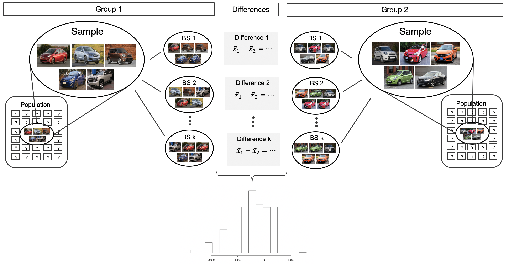

# Inference for comparing two independent means {#inference-two-means}

```{r, include = FALSE}
source("_common.R")
```

::: {.chapterintro data-latex=""}
We now extend the methods from Chapter \@ref(inference-one-mean) to apply confidence intervals and hypothesis tests to differences in population means that come from two groups, Group 1 and Group 2: $\mu_1 - \mu_2.$

In our investigations, we'll identify a reasonable point estimate of $\mu_1 - \mu_2$ based on the sample, and you may have already guessed its form: $\bar{x}_1 - \bar{x}_2.$ \index{point estimate!difference of means} Then we'll look at the inferential analysis in three different ways: using a randomization test, applying bootstrapping for interval estimates, and, if we verify that the point estimate can be modeled using a normal distribution, we compute the estimate's standard error and apply the mathematical framework.
:::

```{r include=FALSE}
terms_chp_21 <- c("point estimate")
```

In this section we consider a difference in two population means, $\mu_1 - \mu_2,$ under the condition that the data are not paired.
Just as with a single sample, we identify conditions to ensure we can use the $t$-distribution with a point estimate of the difference, $\bar{x}_1 - \bar{x}_2,$ and a new standard error formula.

The details for working through inferential problems in the two independent means setting are strikingly similar to those applied to the two independent proportions setting.
We first cover a randomization test where the observations are shuffled under the assumption that the null hypothesis is true.
Then we bootstrap the data (with no imposed null hypothesis) to create a confidence interval for the true difference in population means, $\mu_1 - \mu_2.$ The mathematical model, here the $t$-distribution, is able to describe both the randomization test and the bootstrapping as long as the conditions are met.

The inferential tools are applied to three different data contexts: determining whether stem cells can improve heart function, exploring the relationship between pregnant women's smoking habits and birth weights of newborns, and exploring whether there is statistically significant evidence that one variation of an exam is harder than another variation.
This section is motivated by questions like "Is there convincing evidence that newborns from mothers who smoke have a different average birth weight than newborns from mothers who don't smoke?"

## Randomization test for $H_0: \mu_1 - \mu_2 = 0$ {#rand2mean}

An instructor decided to run two slight variations of the same exam.
Prior to passing out the exams, she shuffled the exams together to ensure each student received a random version.
Summary statistics for how students performed on these two exams are shown in Table \@ref(tab:summaryStatsForTwoVersionsOfExams) and plotted in Figure \@ref(fig:boxplotTwoVersionsOfExams).
Anticipating complaints from students who took Version B, she would like to evaluate whether the difference observed in the groups is so large that it provides convincing evidence that Version B was more difficult (on average) than Version A.

### Observed data

```{r summaryStatsForTwoVersionsOfExams}
classdata <- classdata %>% 
  filter(lecture %in% c("a", "b")) %>%
  mutate(
    lecture = str_to_upper(lecture),
    exam = lecture
    )

classdata %>%
  group_by(exam) %>%
  summarise(
    n = n(),
    mean = mean(m1),
    sd = sd(m1),
    min = min(m1),
    max = max(m1)
  ) %>%
  kbl(booktabs = TRUE, caption = "Summary statistics of scores for each exam version.",
      col.names = c("Group", "n", "Mean", "SD", "Min", "Max"),
      align = "ccccc") %>%
  kable_styling(bootstrap_options = c("striped", "condensed"), 
                latex_options = c("striped", "hold_position"), full_width = FALSE) %>%
  column_spec(1:5, width = "5em")
```

```{r boxplotTwoVersionsOfExams, fig.cap = "Exam scores for students given one of three different exams."}
ggplot(classdata, aes(x = exam, y = m1, color = exam)) +
  geom_boxplot(show.legend = FALSE) +
  geom_point() +
  labs(title = "Boxplot of exam score broken down by version of exam.", x = "Exam", y = "Score") +
  scale_color_manual(values = c(IMSCOL["blue", "full"], IMSCOL["red", "full"]))
```

::: {.guidedpractice data-latex=""}
Construct hypotheses to evaluate whether the observed difference in sample means, $\bar{x}_A - \bar{x}_B=3.1,$ is due to chance.
We will later evaluate these hypotheses using $\alpha = 0.01.$[^inference-two-means-1]
:::

[^inference-two-means-1]: $H_0:$ the exams are equally difficult, on average.
    $\mu_A - \mu_B = 0.$ $H_A:$ one exam was more difficult than the other, on average.
    $\mu_A - \mu_B \neq 0.$

::: {.guidedpractice data-latex=""}
Before moving on to evaluate the hypotheses in the previous Guided Practice, let's think carefully about the dataset.
Are the observations across the two groups independent?
Are there any concerns about outliers?[^inference-two-means-2]
:::

[^inference-two-means-2]: Since the exams were shuffled, the "treatment" in this case was randomly assigned, so independence within and between groups is satisfied.
    The summary statistics suggest the data are roughly symmetric about the mean, and the min/max values don't suggest any outliers of concern.

### Variability of the statistic

In Section \@ref(foundations-randomization), the variability of the statistic (previously: $\hat{p}_1 - \hat{p}_2)$ was visualized after shuffling the observations across the two treatment groups many times.
The shuffling process implements the null hypothesis model (that there is no effect of the treatment).
In the exam example, the null hypothesis is that exam A and exam B are equally difficult, so the average scores across the two tests should be the same.
If the exams were equally difficult, *due to natural variability*, we would sometimes expect students to do slightly better on exam A $(\bar{x}_A > \bar{x}_B)$ and sometimes expect students to do slightly better on exam B $(\bar{x}_B > \bar{x}_A).$ The question at hand is: does $\bar{x}_A - \bar{x}_B=3.1$ indicate that exam A is easier than exam B.

Figure \@ref(fig:rand2means) shows the process of randomizing the exam to the observed exam scores.
If the null hypothesis is true, then the score on each exam should represent the true student ability on that material.
It shouldn't matter whether they were given exam A or exam B.
By reallocating which student got which exam, we are able to understand how the difference in average exam scores changes due only to natural variability.
There is only one iteration of the randomization process in Figure \@ref(fig:rand2means), leading to one simulated difference in average scores.

```{r rand2means, fig.cap = "The version of the test (A or B) is randomly allocated to the test scores, under the null assumption that the tests are equally difficult.", warning = FALSE,  out.width="75%"}
include_graphics("images/rand2means.png")
```

Building on Figure \@ref(fig:rand2means), Figure \@ref(fig:randexams) shows the values of the simulated statistics $\bar{x}_{1, sim} - \bar{x}_{2, sim}$ over 1000 random simulations.
We see that, just by chance, the difference in scores can range anywhere from -10 points to +10 points.

```{r randexams, fig.cap = "Histogram of differences in means, calculated from 1000 different randomizations of the exam types.", fig.width = 10}
set.seed(47)
classdata %>% 
  specify(m1 ~ exam) %>%
  hypothesize(null = "independence") %>%
  generate(reps = 1000, type = "permute") %>%
  calculate(stat = "diff in means", order = c("A", "B")) %>% 
  visualize() +
  labs(title = NULL, x = "Simulated differences in means (A- B)", y = "Count")
```

### Observed statistic vs. null statistics

The goal of the randomization test is to assess the observed data, here the statistic of interest is $\bar{x}_A - \bar{x}_B=3.1.$ The randomization distribution allows us to identify whether a difference of 3.1 points is more than one would expect by natural variability.
By plotting the value of 3.1 on Figure \@ref(fig:randexamspval), we can measure how different or similar 3.1 is to the randomized differences which were generated under the null hypothesis.

```{r randexamspval, fig.cap = "Histogram of differences in means, calculated from 1000 different randomizations of the exam types.  The observed difference of 3.1 points is plotted as a vertical line, and the area more extreme than 3.1 is shaded to represent the p-value."}
stat_2means <- classdata %>% 
  specify(m1 ~ exam) %>%
  calculate(stat = "diff in means", order = c("A", "B"))

set.seed(47)
classdata %>%
  specify(m1 ~ exam) %>%
  hypothesize(null = "independence") %>%
  generate(reps = 1000, type = "permute") %>%
  calculate(stat = "diff in means", order = c("A", "B")) %>%
  visualize() + 
  shade_p_value(obs_stat = stat_2means, direction = "two-sided", color = IMSCOL["red", "full"])
```

::: {.workedexample data-latex=""}
Approximate the p-value depicted in Figure \@ref(fig:randexamspval), and provide a conclusion in the context of the case study.

------------------------------------------------------------------------

Using software, we can find the number of shuffled differences in means that are less than the observed difference (of 3.14) is 19 (out of 1000 randomizations).
So 10% of the simulations are larger than the observed difference.
To get the p-value, we double the proportion of randomized differences which are larger than the observed difference, p-value = 0.2.

Previously, we specified that we would use $\alpha = 0.01.$ Since the p-value is larger than $\alpha,$ we do not reject the null hypothesis.
That is, the data do not convincingly show that one exam version is more difficult than the other, and the teacher should not be convinced that she should add points to the Version B exam scores.
:::

```{r echo = FALSE, eval=FALSE}
set.seed(47)
classdata %>%
  specify(m1 ~ exam) %>%
  hypothesize(null = "independence") %>%
  generate(reps = 1000, type = "permute") %>%
  calculate(stat = "diff in means", order = c("A", "B")) %>%
  get_p_value(obs_stat = stat_2means, direction = "two-sided")
```

The large p-value and consistency of $\bar{x}_A - \bar{x}_B=3.1$ with the randomized differences leads us to *not reject the null hypothesis*.
Said differently, there is no evidence to think that one of the tests is easier than the other.
One might be inclined to conclude that the tests have the same level of difficulty, but that conclusion would be wrong.
The hypothesis testing framework is set up only to reject a null claim, it is not set up to validate a null claim.
As we concluded, the data are consistent with exams A and B being equally difficult, but the data are also consistent with exam A being 3.1 points "easier" than exam B.
The data are not able to adjudicate on whether the exams are equally hard or whether one of them is slightly easier.
Indeed, conclusions where the null hypothesis is not rejected often seem unsatisfactory.
However, in this case, the teacher and class are probably all relieved that there is no evidence to demonstrate that one of the exams is more difficult than the other.

## Bootstrap confidence interval for $\mu_1 - \mu_2$

Before providing a full example working through a bootstrap analysis on actual data, we return to the fictional Awesome Auto example as a way to visualize the two sample bootstrap setting.
Consider an expanded scenario where the research question centers on comparing the average price of a car at one Awesome Auto franchise (Group 1) to the average price of a car at a different Awesome Auto franchise (Group 2).
The process of bootstrapping can be applied to *each* Group separately, and the differences of means recalculated each time.
Figure \@ref(fig:bootmeans2means) visually describes the bootstrap process when interest is in a statistic computed on two separate samples.
The analysis proceeds as in the one sample case, but now the (single) statistic of interest is the *difference in sample means*.
That is, a bootstrap resample is done on each of the groups separately, but the results are combined to have a single bootstrapped difference in means.
Repetition will produce $k$ bootstrapped differences in means, and the histogram will describe the natural sampling variability associated with the difference in means.

```{r include=FALSE}
terms_chp_21 <- c(terms_chp_21, "difference in means")
```

```{r bootmeans2means, fig.cap = "For the two group comparison, the bootstrap resampling is done separately on each group, but the statistic is calculated as a difference.  The set of k differences is then analyzed as the statistic of interest with conclusions drawn on the parameter of interest.", warning = FALSE,  out.width="75%"}

```

### Observed data

Does treatment using embryonic stem cells (ESCs) help improve heart function following a heart attack?
Table \@ref(tab:statsSheepEscStudy) contains summary statistics for an experiment to test ESCs in sheep that had a heart attack.
Each of these sheep was randomly assigned to the ESC or control group, and the change in their hearts' pumping capacity was measured in the study.
Figure \@ref(fig:stem-cell-histograms) provides histograms of the two datasets.
A positive value corresponds to increased pumping capacity, which generally suggests a stronger recovery.
Our goal will be to identify a 95% confidence interval for the effect of ESCs on the change in heart pumping capacity relative to the control group.

```{r statsSheepEscStudy}
stem_cell <- stem_cell %>%
  mutate(
    trmt = if_else(trmt == "ctrl", "Control", "ESC"),
    trmt = fct_relevel(trmt, "ESC", "Control"),
    change = after - before
    )

stem_cell %>%
  group_by(trmt) %>%
  summarise(
    n = n(),
    mean = mean(change),
    sd = sd(change)
  ) %>%
  kbl(booktabs = TRUE, caption = "Summary statistics of the embryonic stem cell study.",
      col.names = c("Group", "n", "Mean", "SD"),
      digits = 2, align = "lccc") %>%
  kable_styling(bootstrap_options = c("striped", "condensed"), 
                latex_options = c("striped", "hold_position"), full_width = FALSE) %>%
  column_spec(1:4, width = "6em")
```

The point estimate of the difference in the heart pumping variable is straightforward to find: it is the difference in the sample means.

$$\bar{x}_{esc} - \bar{x}_{control}\   =\ 3.50 - (-4.33)\   =\ 7.83$$

### Variability of the statistic

As we saw in Section \@ref(two-prop-boot-ci), we will use bootstrapping to estimate the variability associated with the difference in sample means when taking repeated samples.
In a method akin to two proportions, a *separate* sample is taken with replacement from each group (here ESCs and control), the sample means are calculated, and their difference is taken.
The entire process is repeated multiple times to produce a bootstrap distribution of the difference in sample means (*without* the null hypothesis assumption).

Figure \@ref(fig:bootexamsci) displays the variability of the differences in means with the 90% percentile and SE CIs super imposed.

```{r bootexamsci, fig.cap = "Histogram of differences in means after 1000 bootstrap samples from each of the two groups. The observed difference is plotted as a black vertical line at 7.83.  The blue and green lines provide the percentile bootstrap and SE boostrap confidence intervals, respectively, for the difference in true population means."}
set.seed(470)

boot_2mean <- stem_cell %>%
  specify(change ~ trmt) %>%
  generate(reps = 1000, type = "bootstrap") %>%
  calculate(stat = "diff in means", order = c("ESC", "Control"))

stat_2means <- stem_cell %>%
  specify(change ~ trmt) %>%
  calculate(stat = "diff in means", order = c("ESC", "Control"))


ci_perc_2mean <- boot_2mean %>%
  get_confidence_interval(level = 0.9, type = "percentile")

ci_se_2mean <- boot_2mean %>%
  get_confidence_interval(level = 0.9, type = "se",
                          point_estimate = stat_2means)

boot_2mean %>%
  infer::visualize() +
  infer::shade_confidence_interval(ci_perc_2mean, fill = NULL, size = 0.5, color = IMSCOL["green", "full"]) +
  infer::shade_confidence_interval(ci_se_2mean, fill = NULL, size = 0.5, color = IMSCOL["red", "full"]) +
  labs(
    title = "Bootstrap Distribution for Diff in Means",
    x = "Simulated differences in means (ESC - Control)",
    y = "Count"
    ) +
  geom_vline(xintercept = stat_2means$stat) +
  expand_limits(x = c(0, 15), y = c(0, 200)) +
  geom_line(aes(y = 200, x = stat, color = "a"), alpha = 0) + # bogus code
  geom_line(aes(y = 200, x = stat, color = "b"), alpha = 0) + # bogus code
  geom_line(aes(y = 200, x = stat, color = "c"), alpha = 0) + # bogus code
  guides(color = guide_legend(override.aes = list(alpha = 1))) +
  scale_color_manual(name = "CI type",
                     values = c("a" = IMSCOL["green", "full"], "b" = IMSCOL["red", "full"], "c" = IMSCOL["black", "full"]),
                     labels = c("Percentile", "SE", "Observed stat"),
                     guide = "legend")
```

::: {.workedexample data-latex=""}
Choose one of the bootstrap confidence intervals for the true difference in average pumping capacity, $\mu_{esc} - \mu_{control}.$ Does the interval show that there is a difference across the two treatments?

------------------------------------------------------------------------

Because neither of the 90% intervals (either percentile or SE) above overlap zero (note that zero is never one of the bootstrapped differences so 95% and 99% intervals would have given the same conclusion!), we conclude that the ESC treatment is significantly better with respect to heart pumping capacity than the treatment.

Because the study is a randomized controlled experiment, we can conclude that it is the treatment (ESC) which is causing the change in pumping capacity.
:::

## Mathematical model for testing $\mu_1 - \mu_2$ {#math2samp}

### Observed data

A dataset called `ncbirths` represents a random sample of 150 cases of mothers and their newborns in North Carolina over a year.
Four cases from this dataset are represented in Table \@ref(tab:babySmokeDF).
We are particularly interested in two variables: `weight` and `smoke`.
The `weight` variable represents the weights of the newborns and the `smoke` variable describes which mothers smoked during pregnancy.
We would like to know, is there convincing evidence that newborns from mothers who smoke have a different average birth weight than newborns from mothers who don't smoke?
We will use the North Carolina sample to try to answer this question.
The smoking group includes 50 cases and the nonsmoking group contains 100 cases.

```{r babySmokeDF}
ncbirths %>% 
  select(-premie, -mature, -lowbirthweight) %>%
  head(4) %>%
  kbl(booktabs = TRUE, caption = caption_helper("Four cases from the `ncbirths` dataset. The missing cells in the first two entries of the first variable, indicates that piece of data is missing."),
      escape = FALSE, align = "cccclcclll") %>%
  kable_styling(bootstrap_options = c("striped", "condensed"), 
                latex_options = c("striped", "hold_position")) 
```

::: {.workedexample data-latex=""}
Set up appropriate hypotheses to evaluate whether there is a relationship between a mother smoking and average birth weight.

------------------------------------------------------------------------

The null hypothesis represents the case of no difference between the groups.

-   $H_0:$ There is no difference in average birth weight for newborns from mothers who did and did not smoke. In statistical notation: $\mu_{n} - \mu_{s} = 0,$ where $\mu_{n}$ represents non-smoking mothers and $\mu_s$ represents mothers who smoked.
-   $H_A:$ There is some difference in average newborn weights from mothers who did and did not smoke $(\mu_{n} - \mu_{s} \neq 0).$
:::

### Variability of the statistic

We check the two conditions necessary to model the difference in sample means using the $t$-distribution.

-   Because the data come from a simple random sample, the observations are independent, both within and between samples.
-   With both datasets over 30 observations, we inspect the data in Figure \@ref(fig:babySmokePlotOfTwoGroupsToExamineSkew) for any particularly extreme outliers and find none.

Since both conditions are satisfied, the difference in sample means may be modeled using a $t$-distribution.

```{r babySmokePlotOfTwoGroupsToExamineSkew, fig.cap="The top panel represents birth weights for infants whose mothers smoked during pregnancy. The bottom panel represents the birth weights for infants whose mothers who did not smoke during pregnancy.", warning=FALSE, fig.width=10}
births %>%
  mutate(smoke = fct_rev(if_else(smoke == "smoker", "Mothers who smoked", "Mothers who did not smoke"))) %>%
  ggplot(aes(x = weight)) +
  geom_histogram(binwidth = 1) +
  facet_wrap(~smoke, ncol = 1, scales = "free_y") +
  scale_x_continuous(breaks = seq(0, 10, 2), limits = c(0, 10)) +
  labs(x = "Newborn weights (lbs)", y = "Count")
```

::: {.guidedpractice data-latex=""}
The summary statistics in Table \@ref(tab:SumStatsBirthWeightNewbornsSmoke) may be useful for this Guided Practice.[^inference-two-means-3]
What is the point estimate of the population difference, $\mu_{n} - \mu_{s}$?
Compute the standard error of the point estimate
:::

[^inference-two-means-3]: The difference in sample means is an appropriate point estimate: $\bar{x}_{n} - \bar{x}_{s} = 0.40.$ The standard error of the estimate can be calculated using the standard error formula: $SE = \sqrt{\frac{\sigma_n^2}{n_n} + \frac{\sigma_s^2}{n_s}} \approx \sqrt{\frac{s_n^2}{n_n} + \frac{s_s^2}{n_s}} = \sqrt{\frac{1.60^2}{100} + \frac{1.43^2}{50}} = 0.26.$

```{r SumStatsBirthWeightNewbornsSmoke}
ncbirths_sample_stats <- tribble(
  ~group,      ~n,  ~mean, ~sd,
  "smoker",    50,  6.78,  1.43,
  "nonsmoker", 100, 7.18,  1.60
)

ncbirths_sample_stats %>%
  kbl(booktabs = TRUE, caption = caption_helper("Summary statistics for the `ncbirths` dataset."),
      col.names = c("Habit", "n", "Mean", "SD"),
      align = "lccc", digits = 2) %>%
  kable_styling(bootstrap_options = c("striped", "condensed"), 
                latex_options = c("striped", "hold_position"), full_width = FALSE) %>%
  column_spec(1:4, width = "7em")
```

### Observed statistic vs. null statistics

::: {.important data-latex=""}
**The test statistic for comparing two means is a T.**

The T score is a ratio of how the groups differ as compared to how the observations within a group vary.

$$T = \frac{(\bar{x}_1 - \bar{x}_2) - 0}{\sqrt{s_1^2/n_1 + s_2^2/n_2}}$$

When the null hypothesis is true and the conditions are met, T has a t-distribution with $df = min(n_1 - 1, n_2 -1).$

Conditions:

-   independent observations within and across groups\
-   large samples and no extreme outliers\
:::

```{r include=FALSE}
terms_chp_21 <- c(terms_chp_21, "T score", "t-test")
```

::: {.workedexample data-latex=""}
Complete the hypothesis test started in the previous Example and Guided Practice on `ncbirths` dataset and research question.
Use a significance level of $\alpha=0.05.$ For reference, $\bar{x}_{n} - \bar{x}_{s} = 0.40,$ $SE = 0.26,$ and the sample sizes were $n_n = 100$ and $n_s = 50.$

------------------------------------------------------------------------

We can find the test statistic for this test using the previous information:

$$T = \frac{\ 0.40 - 0\ }{0.26} = 1.54$$

The p-value is represented by the two shaded tails in Figure \@ref(fig:distOfDiffOfSampleMeansForBWOfBabySmokeData)

We find the single tail area using software.
We'll use the smaller of $n_n - 1 = 99$ and $n_s - 1 = 49$ as the degrees of freedom: $df = 49.$ The one tail area is 0.065; doubling this value gives the two-tail area and p-value, 0.130.

The p-value is larger than the significance value, 0.05, so we do not reject the null hypothesis.
There is insufficient evidence to say there is a difference in average birth weight of newborns from North Carolina mothers who did smoke during pregnancy and newborns from North Carolina mothers who did not smoke during pregnancy.
:::

```{r distOfDiffOfSampleMeansForBWOfBabySmokeData, fig.cap="The mathematical model for the T statistic when the null hypothesis is true.  As expected, the curve is centered at zero (the null value). The observed statistic is also plotted with the area more extreme than the observed statistic plotted to indicate the p-value."}
normTail(0, 1,
  L = -1.54,
  U = 1.54,
  df = 20, # Aesthetics
  col = IMSCOL["blue", "full"],
  axes = FALSE
)
at <- c(-5, 0, 1.54, 5)
labels <- expression(0, mu[n] - mu[s] * " = 0", "obs. diff", 0)
axis(1, at, labels, cex.axis = 0.9)
```

::: {.guidedpractice data-latex=""}
We've seen much research suggesting smoking is harmful during pregnancy, so how could we fail to reject the null hypothesis in the previous Example?[^inference-two-means-4]
:::

[^inference-two-means-4]: It is possible that there is a difference but we did not detect it.
    If there is a difference, we made a Type 2 Error.

::: {.guidedpractice data-latex=""}
If we made a Type 2 Error and there is a difference, what could we have done differently in data collection to be more likely to detect the difference?[^inference-two-means-5]
:::

[^inference-two-means-5]: We could have collected more data.
    If the sample sizes are larger, we tend to have a better shot at finding a difference if one exists.
    In fact, this is exactly what we would find if we examined a larger dataset!

Public service announcement: while we have used this relatively small dataset as an example, larger datasets show that women who smoke tend to have smaller newborns.
In fact, some in the tobacco industry actually had the audacity to tout that as a *benefit* of smoking:

> *It's true. The babies born from women who smoke are smaller, but they're just as healthy as the babies born from women who do not smoke. And some women would prefer having smaller babies.* - Joseph Cullman, Philip Morris' Chairman of the Board on CBS' *Face the Nation*, Jan 3, 1971

Fact check: the babies from women who smoke are not actually as healthy as the babies from women who do not smoke.[^inference-two-means-6]

[^inference-two-means-6]: You can watch an episode of John Oliver on [*Last Week Tonight*](youtu.be/6UsHHOCH4q8) to explore the present day offenses of the tobacco industry.
    Please be aware that there is some adult language.

## Mathematical model, interval for $\mu_1 - \mu_2$

### Observed data

As with hypothesis testing, for the question of whether we can model the difference using a $t$-distribution, we'll need to check new conditions.
Like the 2-proportion cases, we will require a more robust version of independence so we are confident the two groups are also independent.
Secondly, we also check for normality in each group separately, which in practice is a check for outliers.

```{r include=FALSE}
terms_chp_21 <- c(terms_chp_21, "t-CI")
```

\index{point estimate}

::: {.important data-latex=""}
**Using the** $t$**-distribution for a difference in means.**

The $t$-distribution can be used for inference when working with the standardized difference of two means if

-   *Independence* (extended). The data are independent within and between the two groups, e.g., the data come from independent random samples or from a randomized experiment.
-   *Normality*. We check the outliers for each group separately.

The standard error may be computed as

$$SE = \sqrt{\frac{\sigma_1^2}{n_1} + \frac{\sigma_2^2}{n_2}}$$

The official formula for the degrees of freedom is quite complex and is generally computed using software, so instead you may use the smaller of $n_1 - 1$ and $n_2 - 1$ for the degrees of freedom if software isn't readily available.
:::

Recall that the margin of error is defined by the standard error.
The margin of error for $\bar{x}_1 - \bar{x}_2$ can be directly obtained from $SE(\bar{x}_1 - \bar{x}_2).$

::: {.important data-latex=""}
**Margin of error for** $\bar{x}_1 - \bar{x}_2.$

The margin of error is $t^\star_{df} \times \sqrt{\frac{s_1^2}{n_1} + \frac{s_2^2}{n_2}}$ where $t^\star_{df}$ is calculated from a specified percentile on the t-distribution with *df* degrees of freedom.
:::

```{r include=FALSE}
terms_chp_21 <- c(terms_chp_21, "SE difference in means")
```

\index{standard error (SE)!difference in means}

### Variability of the statistic

::: {.workedexample data-latex=""}
Can the $t$-distribution be used to make inference using the point estimate, $\bar{x}_{esc} - \bar{x}_{control} = 7.83$?

------------------------------------------------------------------------

First, we check for independence.
Because the sheep were randomized into the groups, independence within and between groups is satisfied.

Figure \@ref(fig:stem-cell-histograms) does not reveal any clear outliers in either group.
(The ESC group does look a bit more variabile, but this is not the same as having clear outliers.)

With both conditions met, we can use the $t$-distribution to model the difference of sample means.
:::

```{r stem-cell-data-prep}
stem_cell <- stem_cell %>%
  mutate(change = after - before)
```

```{r stem-cell-histograms, fig.cap = "Histograms for both the treatment group (which received an the embryonic stem cell treatment) and the control group (which did not receive that treatment)."}
stem_cell %>%
  mutate(
    trmt = if_else(trmt == "ctrl", "Control", "Treatment"),
    trmt = fct_rev(trmt)
    ) %>%
  ggplot(aes(x = change)) +
  geom_histogram(binwidth = 2.5) +
  facet_wrap(~trmt, ncol = 1) +
  scale_x_continuous(labels = label_percent(scale = 1, accuracy = 1), breaks = seq(-10, 15, 5)) +
  labs(
    x = "Change in heart pumping function",
    y = "Count"
  )
```

Generally, we use statistical software to find the appropriate degrees of freedom, or if software isn't available, we can use the smaller of $n_1 - 1$ and $n_2 - 1$ for the degrees of freedom, e.g., if using a $t$-table to find tail areas.
For transparency in the Examples and Guided Practice, we'll use the latter approach for finding $df$; in the case of the ESC example, this means we'll use $df = 8.$

::: {.workedexample data-latex=""}
Calculate a 95% confidence interval for the effect of ESCs on the change in heart pumping capacity of sheep after they've suffered a heart attack.

------------------------------------------------------------------------

We will use the sample difference and the standard error that we computed earlier:

$$
\begin{aligned}
\bar{x}_{esc} - \bar{x}_{control} &= 7.83 \\
SE &= \sqrt{\frac{5.17^2}{9} + \frac{2.76^2}{9}} = 1.95
\end{aligned}
$$

Using $df = 8,$ we can identify the critical value of $t^{\star}_{8} = 2.31$ for a 95% confidence interval.
Finally, we can enter the values into the confidence interval formula:

$$
\begin{aligned}
\text{point estimate} \ &\pm\ t^{\star} \times SE \\
7.83 \ &\pm\ 2.31\times 1.95 \\
(3.32 \ &, \ 12.34)
\end{aligned} 
$$

We are 95% confident that embryonic stem cells improve the heart's pumping function in sheep that have suffered a heart attack by 3.32% to 12.34% .
:::

\clearpage

## Chapter review {#chp21-review}

### Summary

In this chapter we extended the single mean inferential methods to questions of differences in means.
You may have seen parallels from the chapters that extended a single proportion (Chapter \@ref(inference-one-prop)) to differences in proportions (Chapter \@ref(inference-two-props)).
When considering differences in sample means (indeed, when considering many quantitative statistics), we use the t-distribution to describe the sampling distribution of the T score (the standardized difference in sample means).
Ideas of confidence level and type of error which might occur from a hypothesis test conclusion are similar to those seen in other chapters (see Section \@ref(decerr)).

### Terms

We introduced the following terms in the chapter.
If you're not sure what some of these terms mean, we recommend you go back in the text and review their definitions.
We are purposefully presenting them in alphabetical order, instead of in order of appearance, so they will be a little more challenging to locate.
However you should be able to easily spot them as **bolded text**.

```{r}
make_terms_table(terms_chp_21)
```

\clearpage

## Exercises {#chp21-exercises}

::: {.exercises}
```{r exercises-21, child = "exercises/21-ex-inference-two-means.Rmd"}
```
:::
