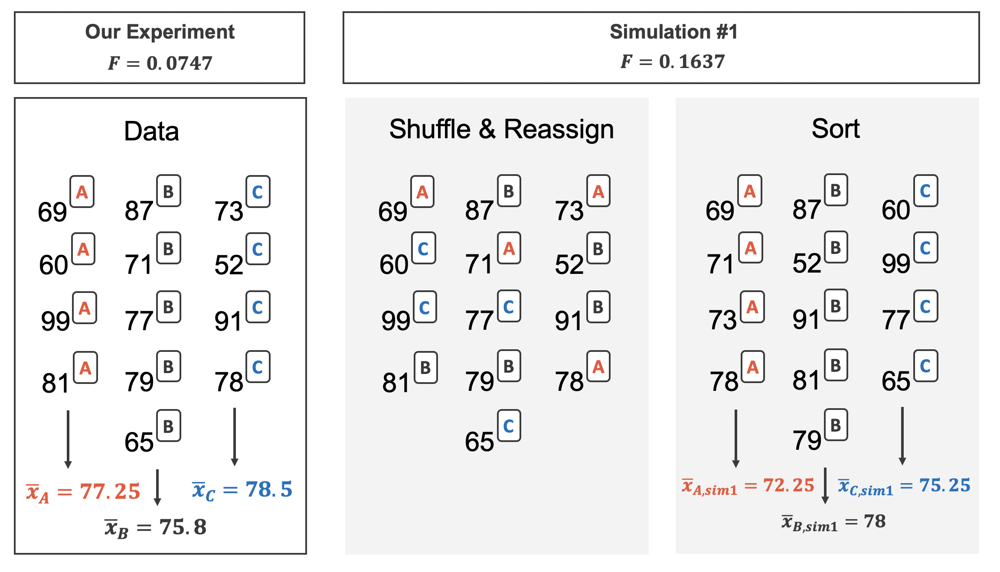

# Inference for comparing many means {#inference-many-means}

```{r, include = FALSE}
source("_common.R")
```

::: {.chapterintro data-latex=""}
In Chapter \@ref(inference-two-means) analysis was done to compare the average population value across two different groups.
An important aspect of the analysis was to look at the difference in sample means as an estimate for the difference in population means.
When comparing more than two groups, the difference (i.e., subtraction) will not fully capture the nuance in variation across the three or more groups.
As with two groups, the research question will focus on whether the group membership is independent of the numerical response variable.
Here, independence across groups means that knowledge of the observations in one group doesn't change what we'd expect to happen in the other group.
But what happens if the groups are **dependent**?
In this section we focus on a new statistic which incorporates differences in means across more than two groups.
Although the ideas in this chapter are quite similar to the t-test, they have earned themselves their own name: **AN**alysis **O**f **VA**riance, or ANOVA.
:::

\index{analysis of variance (ANOVA)}

Sometimes we want to compare means across many groups.
We might initially think to do pairwise comparisons.
For example, if there were three groups, we might be tempted to compare the first mean with the second, then with the third, and then finally compare the second and third means for a total of three comparisons.
However, this strategy can be treacherous.
If we have many groups and do many comparisons, it is likely that we will eventually find a difference just by chance, even if there is no difference in the populations.
Instead, we should apply a holistic test to check whether there is evidence that at least one pair groups are in fact different, and this is where **ANOVA** saves the day.

```{r include=FALSE}
terms_chp_22 <- c("ANOVA", "analysis of variance")
```

In this section, we will learn a new method called **analysis of variance (ANOVA)** and a new test statistic called an $F$-statistic (which we will introduce in our discussion of mathematical models).
ANOVA uses a single hypothesis test to check whether the means across many groups are equal:

-   $H_0:$ The mean outcome is the same across all groups. In statistical notation, $\mu_1 = \mu_2 = \cdots = \mu_k$ where $\mu_i$ represents the mean of the outcome for observations in category $i.$\
-   $H_A:$ At least one mean is different.

Generally we must check three conditions on the data before performing ANOVA:

-   the observations are independent within and between groups,
-   the responses within each group are nearly normal, and
-   the variability across the groups is about equal.

When these three conditions are met, we may perform an ANOVA to determine whether the data provide convincing evidence against the null hypothesis that all the $\mu_i$ are equal.

::: {.workedexample data-latex=""}
College departments commonly run multiple sections of the same introductory course each semester because of high demand.
Consider a statistics department that runs three sections of an introductory statistics course.
We might like to determine whether there are substantial differences in first exam scores in these three classes (Section A, Section B, and Section C).
Describe appropriate hypotheses to determine whether there are any differences between the three classes.

------------------------------------------------------------------------

The hypotheses may be written in the following form:

-   $H_0:$ The average score is identical in all sections, $\mu_A = \mu_B = \mu_C$. Assuming each class is equally difficult, the observed difference in the exam scores is due to chance.
-   $H_A:$ The average score varies by class. We would reject the null hypothesis in favor of the alternative hypothesis if there were larger differences among the class averages than what we might expect from chance alone.
:::

Strong evidence favoring the alternative hypothesis in ANOVA is described by unusually large differences among the group means.
We will soon learn that assessing the variability of the group means relative to the variability among individual observations within each group is key to ANOVA's success.

::: {.workedexample data-latex=""}
Examine Figure \@ref(fig:toyANOVA).
Compare groups I, II, and III.
Can you visually determine if the differences in the group centers is unlikely to have occurred if there were no differences in the groups?
Now compare groups IV, V, and VI.
Do these differences appear to be unlikely to have occurred if there were no differences in the groups?

------------------------------------------------------------------------

Any real difference in the means of groups I, II, and III is difficult to discern, because the data within each group are very volatile relative to any differences in the average outcome.
On the other hand, it appears there are differences in the centers of groups IV, V, and VI.
For instance, group V appears to have a higher mean than that of the other two groups.
Investigating groups IV, V, and VI, we see the differences in the groups' centers are noticeable because those differences are large *relative to the variability in the individual observations within each group*.
:::

```{r toyANOVA, fig.cap = "Side-by-side dot plot for the outcomes for six groups. Two sets of groups: first set is comprised of Groups I, II, and III, the second set is comprised of Groups IV, V, and VI."}
toy_anova %>%
  mutate(group2 = if_else(group %in% c("I", "II", "III"), "A", "B")) %>%
  ggplot(aes(x = group, y = outcome, color = group2, shape = group2)) +
  geom_point(alpha = 0.7, size = 2, show.legend = FALSE) +
  scale_color_openintro() +
  facet_wrap(~group2, nrow = 1, scales = "free_x") +
  labs(x = "Group", y = "Outcome") +
  theme(strip.text = element_blank())
```

## Case study: Batting

We would like to discern whether there are real differences between the batting performance of baseball players according to their position: outfielder (OF), infielder (IF), and catcher (C).
We will use a dataset called `mlb_players_18`, which includes batting records of 429 Major League Baseball (MLB) players from the 2018 season who had at least 100 at bats.
Six of the 429 cases represented in `mlb_players_18` are shown in Figure \@ref(tab:mlbBat18DataFrame), and descriptions for each variable are provided in Figure \@ref(tab:mlbBat18Variables).
The measure we will use for the player batting performance (the outcome variable) is on-base percentage (`OBP`).
The on-base percentage roughly represents the fraction of the time a player successfully gets on base or hits a home run.

::: {.data data-latex=""}
The [`mlb_players_18`](http://openintrostat.github.io/openintro/reference/mlb_players_18.html) data can be found in the [**openintro**](http://openintrostat.github.io/openintro) R package.
:::

```{r mlb_players_18-data-prep}
mlb_players_18 <- mlb_players_18 %>%
  filter(
    AB >= 100, 
    !position %in% c("P", "DH")
  ) %>%
  mutate(
    position = case_when(
      position %in% c("LF", "CF", "RF")       ~ "OF",
      position %in% c("1B", "2B", "3B", "SS") ~ "IF",
      TRUE                                    ~ position
    ),
    position = fct_relevel(position, "OF", "IF", "C")
  )
```

```{r mlbBat18DataFrame}
mlb_players_18 %>%
  arrange(name) %>% 
  select(name, team, position, AB, H, HR, RBI, AVG, OBP) %>%
  slice_head(n = 6) %>%
  kbl(linesep = "", booktabs = TRUE, caption = caption_helper("Six cases and some of the variables from the `mlb_players_18` data frame."), align = "lllrrrrrr") %>%
  kable_styling(bootstrap_options = c("striped", "condensed"), 
                latex_options = c("striped", "hold_position"), full_width = TRUE)
```

```{r mlbBat18Variables}
mlb_players_18_vars <- tribble(
  ~variable,   ~col1,
  "name" ,     "Player name",
  "team" ,     "The abbreviated name of the player's team",
  "position" , "The player's primary field position (OF, IF, C)" ,
  "AB" ,       "Number of opportunities at bat",
  "H" ,        "Number of hits",
  "HR" ,       "Number of home runs",
  "RBI" ,      "Number of runs batted in",
  "AVG" ,      "Batting average, which is equal to H/AB",
  "OBP" ,      "On-base percentage, which is roughly equal to the fraction of times a player gets on base or hits a home run"
)

mlb_players_18_vars %>%
  kbl(linesep = "", booktabs = TRUE, caption = caption_helper("Variables and their descriptions for the `mlb_players_18` dataset."), 
      col.names = c("Variable", "Description")) %>%
  kable_styling(bootstrap_options = c("striped", "condensed"), 
                latex_options = c("striped", "hold_position"), full_width = TRUE) %>%
  column_spec(1, monospace = TRUE) %>%
  column_spec(2, width = "30em")
```

::: {.guidedpractice data-latex=""}
The null hypothesis under consideration is the following: $\mu_{OF} = \mu_{IF} = \mu_{C} % = \mu_{DH}.$ Write the null and corresponding alternative hypotheses in plain language.[^inference-many-means-1]
:::

[^inference-many-means-1]: $H_0:$ The average on-base percentage is equal across the four positions.
    $H_A:$ The average on-base percentage varies across some (or all) groups.

::: {.workedexample data-latex=""}
The player positions have been divided into three groups: outfield (OF), infield (IF), and catcher (C).
What would be an appropriate point estimate of the on-base percentage by outfielders, $\mu_{OF}$?

------------------------------------------------------------------------

A good estimate of the on-base percentage by outfielders would be the sample average of `OBP` for just those players whose position is outfield: $\bar{x}_{OF} = 0.320.$
:::

## Randomization test for comparing many means {#randANOVA}

Table \@ref(tab:mlbHRPerABSummaryTable) provides summary statistics for each group.
A side-by-side box plot for the on-base percentage is shown in Figure \@ref(fig:mlbANOVABoxPlot).
Notice that the variability appears to be approximately constant across groups; nearly constant variance across groups is an important assumption that must be satisfied before we consider the ANOVA approach.

```{r mlbHRPerABSummaryTable}
mlb_players_18 %>% 
  group_by(position) %>% 
  summarise(
    n    = n(),
    mean = round(mean(OBP), 3),
    sd   = round(sd(OBP), 3)
    ) %>%
  kbl(linesep = "", booktabs = TRUE, 
    caption = "Summary statistics of on-base percentage, split by player position.",
    col.names = c("Position", "n", "Mean", "SD"),
    align = "lccc"
  ) %>%
  kable_styling(bootstrap_options = c("striped", "condensed"), 
                latex_options = c("striped", "hold_position"), full_width = FALSE) %>%
  column_spec(1:4, width = "6em")
```

```{r mlbANOVABoxPlot, fig.cap="Side-by-side box plot of the on-base percentage for 429 players across three groups. There is one prominent outlier visible in the infield group, but with 205 observations in the infield group, this outlier is not extreme enough to have an impact on the calculations, so it is not a concern for moving forward with the analysis."}
ggplot(mlb_players_18, aes(x = position, y = OBP)) +
  geom_boxplot() +
  scale_y_continuous(breaks = seq(0.15, 0.45, 0.05)) +
  labs(
    x = "Position",
    y = "On-base percentage"
  )
```

::: {.workedexample data-latex=""}
The largest difference between the sample means is between the catcher and the outfielder positions.
Consider again the original hypotheses:

-   $H_0:$ $\mu_{OF} = \mu_{IF} = \mu_{C}$
-   $H_A:$ The average on-base percentage $(\mu_i)$ varies across some (or all) groups.

Why might it be inappropriate to run the test by simply estimating whether the difference of $\mu_{C}$ and $\mu_{OF}$ is "statistically significant" at a 0.05 significance level?

------------------------------------------------------------------------

The primary issue here is that we are inspecting the data before picking the groups that will be compared.
It is inappropriate to examine all data by eye (informal testing) and only afterwards decide which parts to formally test.
This is called **data snooping** or **data fishing**.
Naturally, we would pick the groups with the large differences for the formal test, and this would leading to an inflation in the Type 1 Error rate.
To understand this better, let's consider a slightly different problem.

Suppose we are to measure the aptitude for students in 20 classes in a large elementary school at the beginning of the year.
In this school, all students are randomly assigned to classrooms, so any differences we observe between the classes at the start of the year are completely due to chance.
However, with so many groups, we will probably observe a few groups that look rather different from each other.
If we select only these classes that look so different and then perform a formal test, we will probably make the wrong conclusion that the assignment wasn't random.
While we might only formally test differences for a few pairs of classes, we informally evaluated the other classes by eye before choosing the most extreme cases for a comparison.
:::

For additional information on the ideas expressed above, we recommend reading about the **prosecutor's fallacy**.[^inference-many-means-2]

[^inference-many-means-2]: See, for example, [this blog post](https://statmodeling.stat.columbia.edu/2007/05/18/the_prosecutors/).

```{r include=FALSE}
terms_chp_22 <- c(terms_chp_22, "data snooping", "data fishing", "prosecutor's fallacy")
```

### Observed data

In the next section we will learn how to use the $F$ statistic to test whether observed differences in sample means could have happened just by chance even if there was no difference in the respective population means.

The method of analysis of variance in this context focuses on answering one question: is the variability in the sample means so large that it seems unlikely to be from chance alone?
This question is different from earlier testing procedures since we will *simultaneously* consider many groups, and evaluate whether their sample means differ more than we would expect from natural variation.
We call this variability the **mean square between groups (MSG)**, and it has an associated degrees of freedom, $df_{G} = k - 1$ when there are $k$ groups.
The $MSG$ can be thought of as a scaled variance formula for means.
If the null hypothesis is true, any variation in the sample means is due to chance and shouldn't be too large.
Details of $MSG$ calculations are provided in the footnote.[^inference-many-means-3]
However, we typically use software for these computations.
\index{degrees of freedom}

[^inference-many-means-3]: Let $\bar{x}$ represent the mean of outcomes across all groups.
    Then the mean square between groups is computed as $MSG = \frac{1}{df_{G}}SSG = \frac{1}{k-1}\sum_{i=1}^{k} n_{i} \left(\bar{x}_{i} - \bar{x}\right)^2$ where $SSG$ is called the **sum of squares between groups** and $n_{i}$ is the sample size of group $i.$

```{r include=FALSE}
terms_chp_22 <- c(terms_chp_22, "mean square between groups (MSG)", "degrees of freedom", "sum of squares between groups (SSG)", "mean square error (MSE)", "sum of squares total (SST)", "sum of squared error (SSE)")
```

The mean square between the groups is, on its own, quite useless in a hypothesis test.
We need a benchmark value for how much variability should be expected among the sample means if the null hypothesis is true.
To this end, we compute a pooled variance estimate, often abbreviated as the **mean square error (**$MSE)$, which has an associated degrees of freedom value $df_E = n - k.$ It is helpful to think of $MSE$ as a measure of the variability within the groups.
Details of the computations of the $MSE$ and a link to an extra online section for ANOVA calculations are provided in the footnote.[^inference-many-means-4]

[^inference-many-means-4]: See [additional details on ANOVA calculations](https://www.openintro.org/download.php?file=stat_extra_anova_calculations) for interested readers.
    Let $\bar{x}$ represent the mean of outcomes across all groups.
    Then the **sum of squares total (**$SST)$ is computed as $$SST = \sum_{i=1}^{n} \left(x_{i} - \bar{x}\right)^2$$ where the sum is over all observations in the dataset.
    Then we compute the **sum of squared errors** $(SSE)$ in one of two equivalent ways: $SSE = SST - SSG = (n_1-1)s_1^2 + (n_2-1)s_2^2 + \cdots + (n_k-1)s_k^2$ where $s_i^2$ is the sample variance (square of the standard deviation) of the residuals in group $i.$ Then the $MSE$ is the standardized form of $SSE: MSE = \frac{1}{df_{E}}SSE.$

When the null hypothesis is true, any differences among the sample means are only due to chance, and the $MSG$ and $MSE$ should be about equal.
As a test statistic for ANOVA, we examine the fraction of $MSG$ and $MSE:$

$$F = \frac{MSG}{MSE}$$

The $MSG$ represents a measure of the between-group variability,and $MSE$ measures the variability within each of the groups.

::: {.important data-latex=""}
**The test statistic for three or more means is an F.**

The F statistic is a ratio of how the groups differ (MSG) as compared to how the observations within a group vary (MSE).

$$F = \frac{MSG}{MSE}$$

When the null hypothesis is true and the conditions are met, F has an F-distribution with $df_1 = k-1$ and $df_2 = n-k.$

Conditions:

-   independent observations, both within and across groups\
-   large samples and no extreme outliers\
:::

### Variability of the statistic

We recall the exams from Section \@ref(rand2mean) which demonstrated a two-sample randomization test for a comparison of means.
Suppose now that the teacher had had such an extremely large class that three different exams were given: A, B, and C.
Table \@ref(tab:summaryStatsForThreeVersionsOfExams) and Figure \@ref(fig:boxplotThreeVersionsOfExams) provide a summary of the data including exam C.
Again, we'd like to investigate whether or not the difficulty of the exams is the same across the three exams, so the test is

-   $H_0: \mu_A = \mu_B = \mu_C.$ The inherent average difficulty is the same across the three exams.
-   $H_A:$ not $H_0.$ At least one of the exams is inherently more (or less) difficult than the others.

::: {.data data-latex=""}
The [`classdata`](http://openintrostat.github.io/openintro/reference/classdata.html) data can be found in the [**openintro**](http://openintrostat.github.io/openintro) R package.
:::

```{r summaryStatsForThreeVersionsOfExams}
classdata <- classdata %>%
  mutate(exam = str_to_upper(lecture))

classdata %>% 
  group_by(exam) %>% 
  summarise(
    n    = n(),
    mean = round(mean(m1), 1),
    sd   = round(sd(m1), 1),
    min  = min(m1),
    max  = max(m1)
    ) %>%
  kbl(linesep = "", booktabs = TRUE, 
    caption = "Summary statistics of scores for each exam version.",
    col.names = c("Exam", "n", "Mean", "SD", "Min", "Max"),
    align = "lccccc"
  ) %>%
  kable_styling(bootstrap_options = c("striped", "condensed"), 
                latex_options = c("striped", "hold_position"), full_width = FALSE) %>%
  column_spec(1:6, width = "5em")
```

```{r boxplotThreeVersionsOfExams, fig.cap = "Exam scores for students given one of three different exams."}
classdata %>%
  ggplot(aes(x = exam, y = m1, color = exam)) +
  geom_boxplot(show.legend = FALSE) +
  geom_point(show.legend = FALSE) +
  scale_color_manual(values = c(IMSCOL["red", "full"], IMSCOL["green", "full"], IMSCOL["blue", "full"])) +
  labs(
    x = "Exam",
    y = "Score",
    title = "Boxplot of exam score broken down by version of exam."
    )
```

Figure \@ref(fig:randANOVA) shows the process of randomizing the three different exams to the observed exam scores.
If the null hypothesis is true, then the score on each exam should represent the true student ability on that material.
It shouldn't matter whether they were given exam A or exam B or exam C.
By reallocating which student got which exam, we are able to understand how the difference in average exam scores changes due only to natural variability.
There is only one iteration of the randomization process in Figure \@ref(fig:randANOVA), leading to three different randomized sample means (computed assuming the null hypothesis is true).

```{r randANOVA, fig.cap = "The version of the test (A or B or C) is randomly allocated to the test scores, under the null assumption that the tests are equally difficult.", warning = FALSE,  out.width="75%"}

```

In the two-sample case, the null hypothesis was investigated using the difference in the sample means.
However, as noted above, with three groups (three different exams), the comparison of the three sample means gets slightly more complicated.
We have already derived the F-statistic which is exactly the way to compare the averages across three or more groups!
Recall, the F statistic is a ratio of how the groups differ (MSG) as compared to how the observations within a group vary (MSE).

Building on Figure \@ref(fig:randANOVA), Figure \@ref(fig:rand3exams) shows the values of the simulated $F$ statistics over 1,000 random simulations.
We see that, just by chance, the F statistic can be as large as 7.

```{r rand3exams, fig.cap = "Histogram of F statistics calculated from 1000 different randomizations of the exam type.", warning = FALSE, fig.width = 10}
set.seed(47)
classdata %>% 
  specify(m1 ~ exam) %>%
  hypothesize(null = "independence") %>%
  generate(reps = 1000, type = "permute") %>%
  calculate(stat = "F") %>%
  visualize() +
  labs(y = "Count", title = NULL, x = "F statistic across 1000 randomizations of the exams.")
```

### Observed statistic vs. null statistic

```{r rand3examspval, fig.cap = "Histogram of F statistics calculated from 1000 different randomizations of the exam type. The observed F statistic is given as a red vertical line 3.48.  The area to the right is more extreme than the observed value and represents the p-value.", warning = FALSE, fig.width = 10}
class_Fstat <- classdata %>% 
  specify(m1 ~ exam) %>%
  calculate(stat = "F") %>%
  pull()

set.seed(47)
classdata %>% 
  specify(m1 ~ exam) %>%
  hypothesize(null = "independence") %>%
  generate(reps = 1000, type = "permute") %>%
  calculate(stat = "F") %>% # get_p_value(obs_stat = class_Fstat, direction = "greater")
  visualize() +
  shade_p_value(obs_stat = class_Fstat, direction = "greater", 
                fill = "#F0513318", color = "#F05133") +
  labs(y = "Count", title = NULL, x = "F statistic across 1000 randomizations of the exams.")
```

Using statistical software, we can calculate that 3.6% of the randomized F test statistics were at or above the observed test statistic of $F= 3.48.$ That is, the p-value of the test is 0.036.
Assuming that we had set the level of significance to be $\alpha = 0.05,$ the p-value is smaller than the level of significance which would lead us to reject the null hypothesis.
We claim that the difficulty level (i.e., the true average score, $\mu)$ is different for at least one of the exams.

While it is temping to say that exam C is harder than the other two (given the inability to differentiate between exam A and exam B in Section \@ref(rand2mean)), we must be very careful about conclusions made using different techniques on the same data.

When the null hypothesis is true, random variability that exists in nature produces data with p-values less than 0.05.
How often does that happen?
5% of the time.
That is to say, if you use 20 different models applied to the same data where there is no signal (i.e., the null hypothesis is true), you are reasonably likely to to get a p-value less than 0.05 in one of the tests you run.
The details surrounding the ideas of this problem, called a **multiple comparisons test** or **multiple comparisons problem**, are outside the scope of this textbook, but should be something that you keep in the back of your head.
To best mitigate any extra type I errors, we suggest that you set up your hypotheses and testing protocol before running any analyses.
Once the conclusions have been reached, you should report your findings instead of running a different type of test on the same data.

## Mathematical model for test for comparing many means {#mathANOVA}

**The ANOVA F-test**

As seen with many of the tests and statistics from previous sections, the randomization test on the F statistic has mathematical theory to describe the distribution without using a computational approach.

We return to the baseball example from Table \@ref(tab:mlbHRPerABSummaryTable) to demonstrate the mathematical model applied to the ANOVA setting.

### Variability of the statistic

The larger the observed variability in the sample means $(MSG)$ relative to the within-group observations $(MSE)$, the larger $F$-statistic will be and the stronger the evidence against the null hypothesis.
Because larger $F$-statistics represent stronger evidence against the null hypothesis, we use the upper tail of the distribution to compute a p-value.

::: {.important data-latex=""}
**The F statistic and the F-test.**

Analysis of variance (ANOVA) is used to test whether the mean outcome differs across two or more groups.
ANOVA uses a test statistic, the $F$-statistic, which represents a standardized ratio of variability in the sample means relative to the variability within the groups.
If $H_0$ is true and the model conditions are satisfied, an $F$-statistic follows an $F$ distribution with parameters $df_{1} = k - 1$ and $df_{2} = n - k.$ The upper tail of the $F$ distribution is used to represent the p-value.
:::

::: {.guidedpractice data-latex=""}
For the baseball data, $MSG = 0.00803$ and $MSE=0.00158.$ Identify the degrees of freedom associated with MSG and MSE and verify the $F$-statistic is approximately 5.077.[^inference-many-means-5]
:::

[^inference-many-means-5]: There are $k = 3$ groups, so $df_{G} = k - 1 = 2.$ There are $n = n_1 + n_2 + n_3 = 429$ total observations, so $df_{E} = n - k = 426.$ Then the $F$-statistic is computed as the ratio of $MSG$ and $MSE:$ $F = \frac{MSG}{MSE} = \frac{0.00803}{0.00158} = 5.082 \approx 5.077.$ $(F = 5.077$ was computed by using values for $MSG$ and $MSE$ that were not rounded.)

### Observed statistic vs. null statistics

We can use the $F$-statistic to evaluate the hypotheses in what is called an F-test.
A p-value can be computed from the $F$ statistic using an $F$ distribution, which has two associated parameters: $df_{1}$ and $df_{2}.$ For the $F$-statistic in ANOVA, $df_{1} = df_{G}$ and $df_{2} = df_{E}.$ An $F$ distribution with 2 and 426 degrees of freedom, corresponding to the $F$ statistic for the baseball hypothesis test, is shown in Figure \@ref(fig:fDist2And423Shaded).

```{r include=FALSE}
terms_chp_22 <- c(terms_chp_22, "F-test")
```

```{r fDist2And423Shaded, fig.cap="An $F$ distribution with $df_1=2$ and $df_2=426.$", warning=FALSE, fig.width=10}
X <- seq(0, 8, len = 300)
Y <- df(X, 2.00001, 426)

plot(X, Y,
     type = "l",
     xlab = "F",
     ylab = "",
     axes = FALSE)
lines(c(0, 8), rep(0, 2))
axis(1)
temp <- which(X > 5.077)
x    <- X[c(temp, rev(temp), temp[1])]
y    <- c(Y[temp], rep(0, length(temp)), Y[temp[1]])
polygon(x, y, col = IMSCOL["red", "full"], border = IMSCOL["red", "full"], lwd = 2)
arrows(6.3, 0.3, 6.5, 0.05, length = 0.05)
text(6.3, 0.3, "Small tail area", pos = 3)
```

::: {.workedexample data-latex=""}
The p-value corresponding to the shaded area in Figure \@ref(fig:fDist2And423Shaded) is equal to about 0.0066.
Does this provide strong evidence against the null hypothesis?

------------------------------------------------------------------------

The p-value is smaller than 0.05, indicating the evidence is strong enough to reject the null hypothesis at a significance level of 0.05.
That is, the data provide strong evidence that the average on-base percentage varies by player's primary field position.
:::

Note that the small p-value indicates that there is a notable difference between the mean batting averages of the different positions.
However, the ANOVA test does not provide a mechanism for knowing *which* group is driving the differences.
If we move forward with all possible two mean comparisons, we run the risk of a high type I error rate.
As we saw at the end of Section \@ref(randANOVA), the follow-up questions surrounding individual group comparisons is called a problem of **multiple comparisons**\index{multiple comparisons} and is outside the scope of this text.
We encourage you to learn more about multiple comparisons, however, so that additional comparisons, after you have rejected the null hypothesis in an ANOVA test, do not lead to undue false positive conclusions.

```{r include=FALSE}
terms_chp_22 <- c(terms_chp_22, "multiple comparisons")
```

### Reading an ANOVA table from software

The calculations required to perform an ANOVA by hand are tedious and prone to human error.
For these reasons, it is common to use statistical software to calculate the $F$-statistic and p-value.

An ANOVA can be summarized in a table very similar to that of a regression summary, which we saw in Chapters \@ref(model-slr) and \@ref(model-mlr).
Table \@ref(tab:anovaSummaryTableForOBPAgainstPosition) shows an ANOVA summary to test whether the mean of on-base percentage varies by player positions in the MLB.
Many of these values should look familiar; in particular, the $F$-statistic and p-value can be retrieved from the last two columns.

```{r anovaSummaryTableForOBPAgainstPosition}
mod <- lm(OBP ~ position, data = mlb_players_18)

anova(mod) %>%
  tidy() %>%
  mutate(p.value = ifelse(p.value < 0.0001, "<0.0001", round(p.value, 4))) %>%
  kbl(linesep = "", booktabs = TRUE,
      caption = "ANOVA summary for testing whether the average on-base percentage differs across player positions.",
      digits = 4, align = "lrrrrr") %>% 
  kable_styling(bootstrap_options = c("striped", "condensed"), 
                latex_options = c("striped", "hold_position")) %>%
  column_spec(1, width = "15em", monospace = TRUE) %>%
  column_spec(2:6, width = "5em")
```

### Conditions for an ANOVA analysis

There are three conditions we must check for an ANOVA analysis: all observations must be independent, the data in each group must be nearly normal, and the variance within each group must be approximately equal.

-   **Independence.** If the data are a simple random sample, this condition can be assumed to be satisfied.
    For processes and experiments, carefully consider whether the data may be independent (e.g., no pairing).
    For example, in the MLB data, the data were not sampled.
    However, there are not obvious reasons why independence would not hold for most or all observations.

-   **Approximately normal.** As with one- and two-sample testing for means, the normality assumption is especially important when the sample size is quite small when it is ironically difficult to check for non-normality.
    A histogram of the observations from each group is shown in Figure \@ref(fig:mlbANOVADiagNormalityGroups).
    Since each of the groups we're considering have relatively large sample sizes, what we're looking for are major outliers.
    None are apparent, so this conditions is reasonably met.

```{r mlbANOVADiagNormalityGroups, fig.cap = "Histograms of OBP for each field position.", fig.asp = 1}
mlb_players_18 %>%
  mutate(
    position = case_when(
      position == "OF" ~ "Outfielders",
      position == "IF" ~ "Infielders",
      position == "C" ~ "Catchers"
    ),
    position = fct_relevel(position, "Outfielders", "Infielders", "Catchers")
  ) %>%
  ggplot(aes(x = OBP)) +
  geom_histogram() +
  facet_wrap(~position, ncol = 1, scales = "free_y") +
  labs(
    x = "On-base percentage",
    y = "Count"
  )
```

-   **Constant variance.** The last assumption is that the variance in the groups is about equal from one group to the next. This assumption can be checked by examining a side-by-side box plot of the outcomes across the groups, as in Figure \@ref(fig:mlbANOVABoxPlot). In this case, the variability is similar in the four groups but not identical. We see in Table \@ref(tab:mlbHRPerABSummaryTable) that the standard deviation doesn't vary much from one group to the next.

::: {.important data-latex=""}
**Diagnostics for an ANOVA analysis.**

Independence is always important to an ANOVA analysis.
The normality condition is very important when the sample sizes for each group are relatively small.
The constant variance condition is especially important when the sample sizes differ between groups.
:::

\clearpage

## Chapter review {#chp22-review}

### Summary

In this chapter we have provided both the randomization test and the mathematical model appropriate for addressing questions of equality of means across two or more groups.
Note that there were important technical conditions required for confirming that the F distribution appropriately modeled the ANOVA test statistic.
Also, you may have noticed that there was no discussion of creating confidence intervals.
That is because the ANOVA statistic does not have a direct analogue parameter to estimate.
If there is interest in comparisons of mean differences (across each set of two groups), then the methods from Chapter \@ref(inference-two-means) comparing two independent means should be applied.

### Terms

We introduced the following terms in the chapter.
If you're not sure what some of these terms mean, we recommend you go back in the text and review their definitions.
We are purposefully presenting them in alphabetical order, instead of in order of appearance, so they will be a little more challenging to locate.
However you should be able to easily spot them as **bolded text**.

```{r}
make_terms_table(terms_chp_22)
```

\clearpage

## Exercises {#chp22-exercises}

Answers to odd numbered exercises can be found in Appendix \@ref(exercise-solutions-22).

::: {.exercises}
```{r exercises-11, child = "exercises/22-ex-inference-many-means.Rmd"}
```
:::
