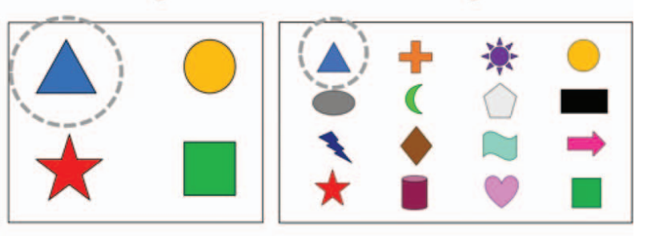

# Applications: Infer {#inference-applications}

```{r, include = FALSE}
source("_common.R")
```

## Recap: Computational models {#comp-models-summary}

The computational methods presented in this text are used in two settings.
First, in many real life applications (as in those covered here), the mathematical model and computational model give identical conclusions.
When there are no differences in conclusions, the advantage of the computational model is that it gives the analyst a good sense for the logic of the statistical inference process.
Second, when there is a difference in the conclusions (seen primarily in methods beyond the scope of this text), it is often the case that the computational method relies on fewer technical conditions and is therefore more appropriate to use.

### Randomization

The important key to remember with randomization tests is that the data is permuted in such a way that the null hypothesis is true.
The randomization distribution provides a distribution of the statistic of interest under the null distribution, which is exactly the information needed to calculate a p-value (where the p-value is the probability of obtaining the observed data or more extreme when the null hypothesis is true).
Although there are ways to adjust the randomization for settings other than the null hypothesis, they are not covered in this book nor are they used widely.
In approaching research questions with a randomization test, be sure to ask yourself what the null hypothesis represents and how it is that permuting the data is creating different possible null data representations.

### Bootstrapping

Bootstrapping, in contrast to randomization tests, represents a proxy sampling of the original population.
With bootstrapping, the analyst is not forcing the null hypothesis to be true (or false for that matter), but instead, they are replicating the variability seen in taking repeated samples from a population.
Because there is no underlying true (or false) null hypothesis, bootstrapping is typically used for creating confidence intervals for the parameter of interest.
Bootstrapping can be used to test particular values of a parameter (e.g., by evaluating whether a particular value of interest is contained in the confidence interval), but generally, bootstrapping is used for interval estimation instead of testing.

## Recap: Mathematical models {#math-models-summary}

The mathematical models which have been used to produce inferential analyses follow a consistent framework for different parameters of interest.
As a way to contrast and compare the mathematical approach, we offer the following summaries in Tables \@ref(tab:zcompare) and \@ref(tab:tcompare).

### z-procedures

Generally, when the response variable is categorical (or binary), the summary statistic is a proportion and the model used to describe the proportion is the standard normal curve (also referred to as a $z$-curve or a $z$-distribution).
We provide Table \@ref(tab:zcompare) partly as a mechanism for understanding $z$-procedures and partly to highlight the extremely common usage of the $z$-distribution in practice.

```{r zcompare}
zsim_table <- tribble(
  ~variable,    ~col1, ~col2, 
  "Response variable",     "Binary",          "Binary",
  "Parameter of interest", "Proportion: $p$", "Difference in proportions: $p_1 - p_2$",
  "Statistic of interest", "Proportion: $\\hat{p}$", "Difference in proportions: $\\hat{p}_1 - \\hat{p}_2$",
  "Standard error: HT",    "$\\sqrt{\\frac{p_0(1-p_0)}{n}}$", "$\\sqrt{\\hat{p}_{pool}\\bigg(1-\\hat{p}_{pool}\\bigg)\\bigg(\\frac{1}{n_1} + \\frac{1}{n_2}}\\bigg)$",
  "Standard error: CI",    "$\\sqrt{\\frac{\\hat{p}(1-\\hat{p})}{n}}$", "$\\sqrt{\\frac{\\hat{p}_{1}(1-\\hat{p}_{1})}{n_1} + \\frac{\\hat{p}_{2}(1-\\hat{p}_{2})}{n_2}}$",
  "Conditions",            "1. Independence, 2. Success-failure", "1. Independence, 2. Success-failure"
)

zsim_table %>%
  kbl(linesep = "", booktabs = TRUE, caption = "Similarities of $z$-methods across one and two independent samples analysis of a binary response variable.",
      col.names = c("", "One sample ", "Two independent samples"),
      escape = FALSE) %>%
  kable_styling(bootstrap_options = c("striped", "condensed"), 
                latex_options = c("striped", "hold_position"), full_width = TRUE) %>%
  column_spec(1, width = "10em")
```

**Hypothesis tests.** When applying the $z$-distribution for a hypothesis test, we proceed as follows:

-   Write appropriate hypotheses.

-   Verify conditions for using the $z$-distribution.

    -   One-sample: the observations (or differences) must be independent. The success-failure condition of at least 10 success and at least 10 failures should hold.\
    -   For a difference of proportions: each sample must separately satisfy the success-failure conditions, and the data in the groups must also be independent.

-   Compute the point estimate of interest and the standard error.\

-   Compute the Z score and p-value.

-   Make a conclusion based on the p-value, and write a conclusion in context and in plain language so anyone can understand the result.

**Confidence intervals.** Similarly, the following is how we generally computed a confidence interval using a $z$-distribution:

-   Verify conditions for using the $z$-distribution. (See above.)\
-   Compute the point estimate of interest, the standard error, and $z^{\star}.$\
-   Calculate the confidence interval using the general formula:\
    point estimate $\pm\ z^{\star} SE$\
-   Put the conclusions in context and in plain language so even non-statisticians and data scientists can understand the results.

### t-procedures

With quantitative response variables, the $t$-distribution was applied as the appropriate mathematical model in three distinct settings.
Although the three data structures are different, their similarities and differences are worth pointing out.
We provide Table \@ref(tab:tcompare) partly as a mechanism for understanding $t$-procedures and partly to highlight the extremely common usage of the $t$-distribution in practice.

```{r tcompare}
tsim_table <- tribble(
  ~variable,               ~col1,              ~col2,     ~col3,
  "Response variable",     "Numeric",          "Numeric", "Numeric",
  "Parameter of interest", "Mean: $\\mu$",     "Paired mean: $\\mu_{diff}$",     "Difference in means: $\\mu_1 - \\mu_2$",
  "Statistic of interest", "Mean: $\\bar{x}$", "Paired mean: $\\bar{x}_{diff}$", "Difference in means: $\\bar{x}_1 - \\bar{x}_2$",
  "Standard error", "$\\frac{s}{\\sqrt{n}}$", "$\\frac{s_{diff}}{\\sqrt{n_{diff}}}$", "$\\sqrt{\\frac{s_1^2}{n_1} + \\frac{s_2^2}{n_2}}$",
  "Degrees of freedom",    "$n-1$", "$n_{diff} -1$", "$\\min(n_1 -1, n_2 - 1)$",
  "Conditions",            "1. Independence, 2. Normality or large samples", "1. Independence, 2. Normality or large samples", "1. Independence, 2. Normality or large samples"
)

tsim_table %>%
  kbl(linesep = "", booktabs = TRUE, caption = "Similarities of $t$-methods across one sample, paired sample, and two independent samples analysis of a numeric response variable.", 
      col.names = c("", "One sample ", "Paired sample", "Two independent samples"),
      escape = FALSE) %>%
  kable_styling(bootstrap_options = c("striped", "condensed"), 
                latex_options = c("striped", "hold_position"), full_width = TRUE) %>%
  column_spec(1, width = "10em")
```

**Hypothesis tests.** When applying the $t$-distribution for a hypothesis test, we proceed as follows:

-   Write appropriate hypotheses.

-   Verify conditions for using the $t$-distribution.

    -   One-sample or differences from paired data: the observations (or differences) must be independent and nearly normal. For larger sample sizes, we can relax the nearly normal requirement, e.g., slight skew is okay for sample sizes of 15, moderate skew for sample sizes of 30, and strong skew for sample sizes of 60.\
    -   For a difference of means when the data are not paired: each sample mean must separately satisfy the one-sample conditions for the $t$-distribution, and the data in the groups must also be independent.

-   Compute the point estimate of interest, the standard error, and the degrees of freedom For $df,$ use $n-1$ for one sample, and for two samples use either statistical software or the smaller of $n_1 - 1$ and $n_2 - 1.$\

-   Compute the T score and p-value.

-   Make a conclusion based on the p-value, and write a conclusion in context and in plain language so anyone can understand the result.

**Confidence intervals.** Similarly, the following is how we generally computed a confidence interval using a $t$-distribution:

-   Verify conditions for using the $t$-distribution. (See above.)\
-   Compute the point estimate of interest, the standard error, the degrees of freedom, and $t^{\star}_{df}.$\
-   Calculate the confidence interval using the general formula:\
    point estimate $\pm\ t_{df}^{\star} SE$\
-   Put the conclusions in context and in plain language so even non-statisticians and data scientists can understand the results.

## Case study: Redundant adjectives {#case-study-redundant-adjectives}

Take a look at the images in Figure \@ref(fig:blue-triangle-shapes).
How would you describe the circled item in the top image (A)?
Would you call it "the triangle"?
Or "the blue triangle"?
How about in the bottom image (B)?
Does your answer change?

```{r blue-triangle-shapes, fig.cap = "Two sets of shapes. In A, the circled triangle is the only triangle. In B, the circled triangle is the only blue triangle."}
shape_names <- c(
  "circle filled",
  "square filled", 
  "diamond filled", 
  "triangle filled",
  "circle filled",
  "square filled", 
  "triangle filled", 
  "triangle filled"  
)

shapes <- data.frame(
  shape_names = shape_names,
  figure = c(rep(1, 4), rep(2, 4)),
  x = rep(1:4, 2),
  y = 1,
  color = rep(c(IMSCOL["pink", "full"], IMSCOL["yellow", "full"], 
            IMSCOL["red", "full"], IMSCOL["blue", "full"]), 2)
)

p1 <- ggplot(shapes %>% filter(figure == 1), aes(x, y)) +
  geom_point(aes(shape = shape_names, color = color, fill = color), size = 20) +
  scale_shape_identity() +
  scale_color_identity() +
  scale_fill_identity() +
  theme_void() +
  expand_limits(x = c(0.5, 4.5)) +
  annotate("point", x = 4, y = 1, shape = "circle open", color = "black", size = 40)

p2 <- ggplot(shapes %>% filter(figure == 2), aes(x, y)) +
  geom_point(aes(shape = shape_names, color = color, fill = color), size = 20) +
  scale_shape_identity() +
  scale_color_identity() +
  scale_fill_identity() +
  theme_void() +
  expand_limits(x = c(0.5, 4.5)) +
  annotate("point", x = 4, y = 1, shape = "circle open", color = "black", size = 40)

p1 / p2 +
  plot_annotation(tag_levels = "A")
```

In the top image in Figure \@ref(fig:blue-triangle-shapes) the circled item is the only triangle, while in the bottom image the circled item is one of two triangles.
While in the top image "the triangle" is a sufficient description for the circled item, many of us might choose to refer to it as the "blue triangle" anyway.
In the bottom image there are two triangles, so "the triangle" is no longer sufficient, and to describe the circled item we must qualify it with the color as well, as "the blue triangle".

Your answers to the above questions might be different if you're answering in a different language than English.
For example, in Spanish, the adjective comes after the noun (e.g., "el triángulo azul") therefore the incremental value of the additional adjective might be different for the top image.

```{r}

```

Researchers studying frequent use of redundant adjectives (e.g., referring to a single triangle as "the blue triangle") and incrementality of language processing designed an experiment where they showed the following two images to 22 native English speakers (undergraduates from University College London) and 22 native Spanish speakers (undergraduates from the Universidad de las Islas Baleares).
They found that in both languages, the participants used more redundant color adjectives in denser displays where it would be more efficient.
[@rubio-fernandez2021]

```{r fig.cap = "Images used in one of the experiments described in [@rubio-fernandez2021]."}

```

In this case study we will examine data from this study, which the authors have made available on Open Science Framework at [osf.io/9hw68](https://osf.io/9hw68/).

```{r}
redundant <- read_csv("data/ENGLISH-SPANISH PRODUCTION.csv") %>%
  clean_names() %>%
  mutate(
    items = if_else(question > 10, 16, 4),
    items = as.factor(items),
    adjective = if_else(color_response == 1, "redundant", "not redundant")
    ) %>%
  select(-color_response)
```

### Exploratory analysis

In one of the images shown to the participants, there are 4 items, and in the other, there are 16 items.
In each of the images the circled item is the only triangle, therefore referring to it as "the blue triangle" or as "el triángulo azul" is considered redundant.
If the participant's response was "the triangle" this was recorded as not having used a redundant adjective.
If the response was "the blue triangle", this was recorded as having used a redundant adjective.
Figure \@ref(fig:reduntant-bar) shows the results of the experiment.
We can see that English speakers are more likely than Spanish speakers to use redundant adjectives, and also that in both languages, participants are more likely to use a redundant adjective when there are more items in the image (i.e. in a denser display).

```{r reduntant-bar, fig.cap = "Results of redundant adjective usage experiment from [@rubio-fernandez2021]. English speakers are more likely than Spanish speakers to use redundant adjectives, regardless of number of items in image. For both images, respondents are more likely to use a redundant adjective when there are more items in the image."}
redundant_summary <- redundant %>%
  group_by(language, subject, items) %>%
  summarise(
    total = n(),
    redundant_perc = sum(adjective == "redundant") * 100 / total,
    .groups = "drop"
    ) %>%
  group_by(language, items) %>%
  summarise(mean_redundant_perc = mean(redundant_perc), .groups = "drop")

redundant_summary %>%
  ggplot(aes(x = items, y = mean_redundant_perc , fill = language))+
  geom_col(position = "dodge")+
  scale_y_continuous(labels = label_percent(scale = 1)) +
  labs(
    x = "Number of items in image",
    y = "Percentage of\nredundant adjective usage"
  ) +
  scale_fill_manual(values = c(IMSCOL["blue", "full"], IMSCOL["red", "full"]))
```

These values are also shown in

```{r redundant-table}
redundant_summary %>%
  kbl(linesep = "", booktabs = TRUE, 
      col.names = c("Language", "Number of items", "Percentage redundant"),
      caption = caption_helper("Summary of redundant adjective usage experiment from [@rubio-fernandez2021]."),
      align = "lrr") %>%
  kable_styling(bootstrap_options = c("striped", "condensed"), 
                latex_options = c("striped", "hold_position"), 
                full_width = FALSE) %>%
  column_spec(1, width = "10em")
```

### Confidence interval for a proportion

Simulation bootstrap for English four item:

```{r}
set.seed(74)
boot_eng_4 <- redundant %>%
  filter(language == "English", items == 4) %>%
  specify(response = adjective, success = "redundant") %>%
  generate(1000, type = "bootstrap") %>%
  calculate(stat = "prop")

ci_eng_4 <- boot_eng_4 %>%
  get_confidence_interval(level = 0.95)

boot_eng_4 %>%
  visualize(fill = IMSCOL["green", "full"]) +
  shade_confidence_interval(ci_eng_4,
                            color = IMSCOL["green", "f10"],
                            fill = IMSCOL["green", "f12"],
                            alpha = 0.4)
```

Simulation bootstrap for English 16 item:

```{r}
set.seed(74)
boot_eng_16 <- redundant %>%
  filter(language == "English", items == 16) %>%
  specify(response = adjective, success = "redundant") %>%
  generate(1000, type = "bootstrap") %>%
  calculate(stat = "prop")

ci_eng_16 <- boot_eng_16 %>%
  get_confidence_interval(level = 0.95)

boot_eng_16 %>%
  visualize(fill = IMSCOL["green", "full"]) +
  shade_confidence_interval(ci_eng_16,
                            color = IMSCOL["green", "f10"],
                            fill = IMSCOL["green", "f12"],
                            alpha = 0.4)
```

Spanish 4 items:

```{r}
set.seed(74)
boot_sp_4 <- redundant %>%
  filter(language == "Spanish", items == 4) %>%
  specify(response = adjective, success = "redundant") %>%
  generate(1000, type = "bootstrap") %>%
  calculate(stat = "prop")

ci_sp_4 <- boot_sp_4 %>%
  get_confidence_interval(level = 0.95)

boot_sp_4 %>%
  visualize(fill = IMSCOL["green", "full"]) +
  shade_confidence_interval(ci_sp_4,
                            color = IMSCOL["green", "f10"],
                            fill = IMSCOL["green", "f12"],
                            alpha = 0.4)
```

Spanish 16 items

```{r}
set.seed(74)
boot_sp_16 <- redundant %>%
  filter(language == "Spanish", items == 16) %>%
  specify(response = adjective, success = "redundant") %>%
  generate(1000, type = "bootstrap") %>%
  calculate(stat = "prop")

ci_sp_16 <- boot_sp_16 %>%
  get_confidence_interval(level = 0.95)

boot_sp_16 %>%
  visualize(fill = IMSCOL["green", "full"]) +
  shade_confidence_interval(ci_sp_16,
                            color = IMSCOL["green", "f10"],
                            fill = IMSCOL["green", "f12"],
                            alpha = 0.4)
```

### Two sample proportion test

Comparing across languages:

```{r}
set.seed(74)
null_4 <- redundant %>%
  filter(items == 4) %>%
  specify(response = adjective, explanatory = language,
          success = "redundant") %>%
  hypothesize(null = "independence") %>%
  generate(1000, type = "permute") %>%
  calculate(stat = "diff in props", order = c("English", "Spanish"))

obs_stat_4 <- redundant %>%
  filter(items == 4) %>%
  specify(response = adjective, explanatory = language,
          success = "redundant") %>%
  calculate(stat = "diff in props", order = c("English", "Spanish"))

null_4 %>%
  get_p_value(obs_stat = obs_stat_4, direction = "two_sided")

null_4 %>%
  visualise(fill = IMSCOL["green", "full"]) +
  shade_p_value(obs_stat_4, direction = "two_sided")
```

```{r}
set.seed(74)
null_16 <- redundant %>%
  filter(items == 16) %>%
  specify(response = adjective, explanatory = language,
          success = "redundant") %>%
  hypothesize(null = "independence") %>%
  generate(1000, type = "permute") %>%
  calculate(stat = "diff in props", order = c("English", "Spanish"))

obs_stat_16 <- redundant %>%
  filter(items == 16) %>%
  specify(response = adjective, explanatory = language,
          success = "redundant") %>%
  calculate(stat = "diff in props", order = c("English", "Spanish"))

null_16 %>%
  get_p_value(obs_stat = obs_stat_16, direction = "two_sided")

null_16 %>%
  visualise(fill = IMSCOL["green", "full"]) +
  shade_p_value(obs_stat_16, direction = "two_sided")
```

Comparing within languages

```{r}
set.seed(74)
null_eng <- redundant %>%
  filter(language == "English") %>%
  specify(response = adjective, explanatory = items,
          success = "redundant") %>%
  hypothesize(null = "independence") %>%
  generate(1000, type = "permute") %>%
  calculate(stat = "diff in props", order = c("4", "16"))

obs_stat_eng <- redundant %>%
  filter(language == "English") %>%
  specify(response = adjective, explanatory = items,
          success = "redundant") %>%
  calculate(stat = "diff in props", order = c("4", "16"))

null_eng %>%
  get_p_value(obs_stat = obs_stat_eng, direction = "two_sided")

null_eng %>%
  visualise() +
  shade_p_value(obs_stat_eng, direction = "two_sided")
```

```{r}
set.seed(74)
null_sp <- redundant %>%
  filter(language == "Spanish") %>%
  specify(response = adjective, explanatory = items,
          success = "redundant") %>%
  hypothesize(null = "independence") %>%
  generate(1000, type = "permute") %>%
  calculate(stat = "diff in props", order = c("4", "16"))

obs_stat_sp <- redundant %>%
  filter(language == "Spanish") %>%
  specify(response = adjective, explanatory = items,
          success = "redundant") %>%
  calculate(stat = "diff in props", order = c("4", "16"))

null_sp %>%
  get_p_value(obs_stat = obs_stat_sp, direction = "two_sided")

null_sp %>%
  visualise(fill = IMSCOL["green", "full"]) +
  shade_p_value(obs_stat_sp, direction = "two_sided")
```

## Interactive R tutorials {#inference-tutorials}

Navigate the concepts you've learned in this chapter in R using the following self-paced tutorials.
All you need is your browser to get started!

::: {.alltutorials data-latex=""}
[Tutorial 6: Inference for categorical responses](https://openintrostat.github.io/ims-tutorials/06-inference-for-categorical-responses/)
:::

::: {.singletutorial data-latex=""}
[Tutorial 6 - Lesson 1: Inference for a single proportion](https://openintro.shinyapps.io/ims-06-inference-for-categorical-responses-01/)
:::

::: {.singletutorial data-latex=""}
[Tutorial 6 - Lesson 2: Hypothesis tests to compare proportions](https://openintro.shinyapps.io/ims-06-inference-for-categorical-responses-02/)
:::

::: {.singletutorial data-latex=""}
[Tutorial 6 - Lesson 3: Chi-squared test of independence](https://openintro.shinyapps.io/ims-06-inference-for-categorical-responses-03/)
:::

::: {.singletutorial data-latex=""}
[Tutorial 6 - Lesson 4: Chi-squared goodness of fit Test](https://openintro.shinyapps.io/ims-06-inference-for-categorical-responses-04/)
:::

::: {.alltutorials data-latex=""}
[Tutorial 7: Inference for categorical responses](https://openintrostat.github.io/ims-tutorials/07-inference-for-numerical-responses/)
:::

::: {.singletutorial data-latex=""}
[Tutorial 7 - Lesson 1: Bootstrapping for estimating a parameter](https://openintro.shinyapps.io/ims-07-inference-for-numerical-responses-01/)
:::

::: {.singletutorial data-latex=""}
[Tutorial 7 - Lesson 2: Introducing the t-distribution](https://openintro.shinyapps.io/ims-07-inference-for-numerical-responses-02/)
:::

::: {.singletutorial data-latex=""}
[Tutorial 7 - Lesson 3: Inference for difference in two means](https://openintro.shinyapps.io/ims-07-inference-for-numerical-responses-03/)
:::

::: {.singletutorial data-latex=""}
[Tutorial 7 - Lesson 4: Comparing many means](https://openintro.shinyapps.io/ims-07-inference-for-numerical-responses-04/)
:::

You can also access the full list of tutorials supporting this book [here](https://openintrostat.github.io/ims-tutorials/).

## R labs {#inference-labs}

Further apply the concepts you've learned in this chapter in R with computational labs that walk you through a data analysis case study.

::: {.singlelab data-latex=""}
[Inference for categorical responses - Texting while driving](https://openintro.shinyapps.io/inf_for_categorical_data/)
:::

::: {.singlelab data-latex=""}
[Inference for numerical responses - Youth Risk Behavior Surveillance System](http://openintrostat.github.io/oilabs-tidy/07_inf_for_numerical_data/inf_for_numerical_data.html)
:::

::: {.alllabs data-latex=""}
[Full list of labs supporting OpenIntro::Introduction to Modern Statistics](http://openintrostat.github.io/oilabs-tidy/)
:::
