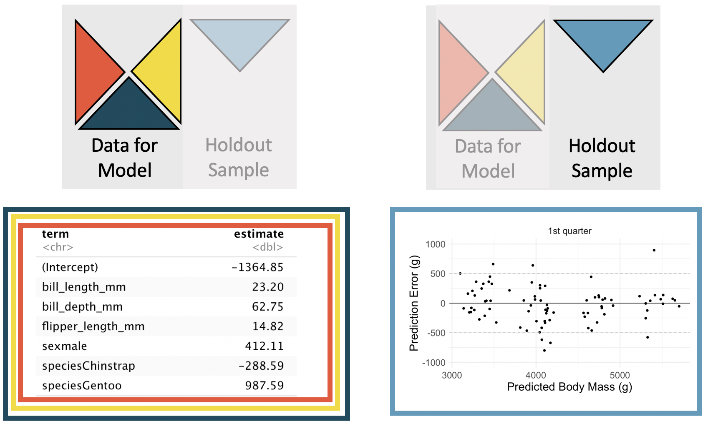

# Inference for linear regression with multiple predictors {#inf-model-mlr}

\chaptermark{Inference for regression with multiple predictors}

```{r, include = FALSE}
source("_common.R")
```

::: {.chapterintro data-latex=""}
In Chapter \@ref(model-mlr), the least squares regression method was used to estimate linear models which predicted a particular response variable given more than one explanatory variable.
Here, we discuss whether each of the variables individually is a statistically significant predictor of the outcome or whether the model might be just as strong without that variable.
That is, as before, we apply inferential methods to ask whether a variable could have come from a population where the particular coefficient at hand was zero.
If one of the linear model coefficients is truly zero (in the population), then the estimate of the coefficient (using least squares) will vary around zero.
The inference task at hand is to decide whether the coefficient's difference from zero is large enough to decide that the data cannot possibly have come from a model where the true population coefficient is zero.
Both the derivations from the mathematical model and the randomization model are beyond the scope of this book, but we are able to calculate p-values using statistical software.
We will discuss interpreting p-values in the multiple regression setting and note some scenarios where careful understanding of the context and the relationship between variables is important.
We use cross-validation as a method for independent assessment of the multiple linear regression model.
:::

```{r include=FALSE}
terms_chp_25 <- c("inference on multiple linear regression")
```

## Multiple regression output from software {#inf-mult-reg-soft}

Recall the `loans` data from Chapter \@ref(model-mlr).

::: {.data data-latex=""}
The [`loans_full_schema`](http://openintrostat.github.io/openintro/reference/loans_full_schema.html) data can be found in the [**openintro**](http://openintrostat.github.io/openintro) R package.
Based on the data in this dataset we have created two new variables: `credit_util` which is calculated as the total credit utilized divided by the total credit limit and `bankruptcy` which turns the number of bankruptcies to an indicator variable (0 for no bankruptcies and 1 for at least 1 bankruptcies).
We will refer to this modified dataset as `loans`.
:::

Now, our goal is to create a model where `interest_rate` can be predicted using the variables `debt_to_income`, `term`, and `credit_checks`.
As you learned in Chapter \@ref(model-mlr), least squares can be used to find the coefficient estimates for the linear model.
The unknown population model can be written as:

$$
\begin{aligned}
E[\texttt{interest_rate}] = \beta_0 &+ \beta_1\times \texttt{debt_to_income} \\
&+ \beta_2 \times \texttt{term}\\
&+ \beta_3 \times \texttt{credit_checks}\\
\end{aligned}
$$

```{r loansmodel}
loans <- loans_full_schema %>%
  mutate(
    credit_util = total_credit_utilized / total_credit_limit,
    bankruptcy = as.factor(if_else(public_record_bankrupt == 0, 0, 1)),
    verified_income = droplevels(verified_income)
  ) %>%
  rename(credit_checks = inquiries_last_12m) %>%
  select(interest_rate, verified_income, debt_to_income, credit_util, bankruptcy, term, credit_checks, issue_month)


lm(interest_rate ~ debt_to_income + term + credit_checks, data = loans) %>%
  tidy() %>%
  mutate(p.value = ifelse(p.value < 0.0001, "<0.0001", round(p.value, 4))) %>%
  kbl(
    linesep = "", booktabs = TRUE,
    caption = caption_helper("Summary of a linear model for predicting interest rate based on `debt_to_income`, `term`, and `credit_checks`. Each of the variables has its own coefficient estimate as well as p-value significance."),
    digits = 2, align = "lrrrr"
  ) %>%
  kable_styling(
    bootstrap_options = c("striped", "condensed"),
    latex_options = c("striped", "hold_position")
  ) %>%
  column_spec(1, width = "17em", monospace = TRUE) %>%
  column_spec(2:5, width = "5em")
```

The estimated equation for the regression model may be written as a model with three predictor variables:

$$
\begin{aligned}
\widehat{\texttt{interest_rate}} = 4.31 &+ 0.041 \times \texttt{debt_to_income} \\
&+ 0.16 \times \texttt{term} \\
&+ 0.25 \times \texttt{credit_checks}
\end{aligned}
$$

Not only does Table \@ref(tab:loansmodel) provide the estimates for the coefficients, it also provides information on the inference analysis (i.e., hypothesis testing) which are the focus of this chapter.

In Section \@ref(inf-model-slr), you learned that the hypothesis test for a linear model with **one predictor**[^inf-model-mlr-1] can be written as:

[^inf-model-mlr-1]: In previous sections, the term **explanatory variable** was used instead of **predictor**.
    The words are synonymous and are used separately in the different sections to be consistent with how most analysts use them: explanatory variable for testing, predictor for modeling.

```{r include=FALSE}
terms_chp_25 <- c(terms_chp_25, "predictor")
```

> if only one predictor, $H_0: \beta_1 = 0.$

That is, if the true population slope is zero, the p-value measures how likely it would be to select data which produced the observed slope ($b_1$) value.

With **multiple predictors**, the hypothesis is similar, however, it is now conditioned on each of the other variables remaining in the model.

```{r include=FALSE}
terms_chp_25 <- c(terms_chp_25, "multiple predictors")
```

> if multiple predictors, $H_0: \beta_i = 0$ given other variables in the model

Using the example above and focusing on each of the variable p-values (here we won't discuss the p-value associated with the intercept), we can write out the three different hypotheses:

-   $H_0: \beta_1 = 0$, given `term` and `credit_checks` are included in the model
-   $H_0: \beta_2 = 0$, given `debt_to_income` and `credit_checks` are included in the model
-   $H_0: \beta_3 = 0$, given `debt_to_income` and `term` are included in the model

The very low p-values from the software output tell us that each of the variables acts as an important predictor in the model, despite the inclusion of the other two.
Consider the p-value on $H_0: \beta_1$.
The low p-value says that it would be extremely unlikely to see data that produce a coefficient on `debt_to_income` as large as 0.041 if the true relationship between `debt_to_income`and `interest_rate` was non-existent (i.e., if $\beta_1 = 0$) and the model also included `term` and `credit_checks`.
You might have thought that the value 0.041 is a small number (i.e., close to zero), but in the units of the problem, 0.041 turns out to be far away from zero, it's all about context!
The p-values on `term` and on `credit_checks` are interpreted similarly.

Sometimes a set of predictor variables can impact the model in unusual ways, often due to the predictor variables themselves being correlated.

## Multicollinearity {#inf-mult-reg-collin}

In practice, there will almost always be some degree of correlation between the explanatory variables in a multiple regression model.
For regression models, it is important to understand the entire context of the model, particularly for correlated variables.
Our discussion will focus on interpreting coefficients (and their signs) in relationship to other variables as well as the significance (i.e., the p-value) of each coefficient.

Consider an example where we'd like to predict how much money is in a coin dish based only on the number of coins in the dish.
We ask 26 students to tell us about their individual coin dishes, collecting data on the total dollar amount, the total number of coins, and the total number of low coins.[^inf-model-mlr-2]
The number of low coins is the number of coins minus the number of quarters (a quarter is the largest commonly used US coin, at US\$0.25).
Figure \@ref(fig:money) illustrates a sample of U.S. coins, their total worth (`total_amount`), the total `number of coins`, and the `number of low coins`.

[^inf-model-mlr-2]: In all honesty, this particular dataset is fabricated, and the original idea for the problem comes from Jeff Witmer at Oberlin College.

```{r money, fig.cap = "(ref:money-cap)", fig.width = 10}

```

(ref:money-cap) A sample of coins with 16 total coins, 10 low coins, and a net worth of \$1.90.

The collected data is given in Figure \@ref(fig:coinfig) and shows that the `total_amount` of money is more highly correlated with the total `number of coins` than it is with the `number of low coins`.
We also note that the total `number of coins` and the `number of low coins` are positively correlated.

```{r coinfig, fig.cap = "Plot describing the total amount of money (USD) as a function of the number of coins and the number of low coins. As you might expect, the total amount of money is more highly postively correlated with the total number of coins than with the number of low coins."}
# Data are simulated
money <- tibble(
  number_of_coins = c(9, 10, 3, 5, 10, 37, 28, 9, 11, 4, 6, 17, 15, 7, 9, 1, 5, 9, 36, 30, 47, 13, 5, 7, 18, 16),
  number_of_low_coins = c(4, 8, 0, 4, 9, 34, 9, 3, 2, 2, 5, 12, 11, 4, 8, 0, 4, 9, 34, 9, 3, 2, 2, 5, 12, 11),
  total_amount = c(1.37, 1.01, 1.5, 0.56, 0.61, 3.06, 5.42, 1.75, 5.4, 0.56, 0.34, 2.33, 3.34, 1.3, 1.2, 1.7, 0.86, 0.61, 2.96, 5.52, 8.95, 5.2, 1.56, 0.74, 1.83, 3.74)
)

p1 <- ggplot(money, aes(y = total_amount, x = number_of_coins)) +
  geom_point() +
  labs(x = "Number of coins", y = "Total amount (USD)")

p2 <- ggplot(money, aes(y = total_amount, x = number_of_low_coins)) +
  geom_point() +
  labs(x = "Number of low coins", y = "Total amount (USD)")

p1 + p2
```

Using the total `number of coins` as the predictor variable, Table \@ref(tab:coinhigh) provides the least squares estimate of the coefficient is 0.13.
For every additional coin in the dish, we would predict that the student had US\$0.13 more.
The $b_1 = 0.13$ coefficient has a small p-value associated with it, suggesting we would not have seen data like this if `number of coins` and `total_amount` of money were not linearly related.

$$\widehat{\texttt{total_amount}} = 0.55 + 0.13 \times \texttt{number_of_coins}$$

```{r coinhigh}
lm(total_amount ~ number_of_coins, data = money) %>%
  tidy() %>%
  mutate(p.value = ifelse(p.value < .0001, "<0.0001", round(p.value, 4))) %>%
  kbl(
    linesep = "", booktabs = TRUE,
    caption = "Linear model output predicting the total amount of money based on the total number of coins.",
    digits = 2
  ) %>%
  kable_styling(
    bootstrap_options = c("striped", "condensed"),
    latex_options = c("striped", "hold_position")
  ) %>%
  column_spec(1, width = "10em", monospace = TRUE) %>%
  column_spec(2:5, width = "5em")
```

Using the `number of low coins` as the predictor variable, Table \@ref(tab:coinlow) provides the least squares estimate of the coefficient is 0.02.
For every additional low coin in the dish, we would predict that the student had US\$0.02 more.
The $b_1 = 0.02$ coefficient has a large p-value associated with it, suggesting we could easily have seen data like ours even if the `number of low coins` and `total_amount` of money are not at all linearly related.

$$\widehat{\texttt{total_amount}} = 2.28 + 0.02 \times \texttt{number_of_low_coins}$$

```{r coinlow}
lm(total_amount ~ number_of_low_coins, data = money) %>%
  tidy() %>%
  mutate(p.value = ifelse(p.value < .0001, "<0.0001", round(p.value, 4))) %>%
  kbl(
    linesep = "", booktabs = TRUE,
    caption = "Linear model output predicting the total amount of money based on the number of low coins.",
    digits = 2, align = "lrrrr"
  ) %>%
  kable_styling(
    bootstrap_options = c("striped", "condensed"),
    latex_options = c("striped", "hold_position")
  ) %>%
  column_spec(1, width = "10em", monospace = TRUE) %>%
  column_spec(2:5, width = "5em")
```

::: {.workedexample data-latex=""}
Come up with an example of two observations that have the same number of low coins but the number of total coins differs by one.
What is the difference in total amount?

------------------------------------------------------------------------

Two samples of coins with the same number of low coins (3), but a different number of total coins (4 vs 5) and a different total total amount (\$0.41 vs \$0.66).

```{r lowsame}
knitr::include_graphics("images/lowsame.png")
```
:::

::: {.workedexample data-latex=""}
Come up with an example of two observations that have the same total number of coins but a different number of low coins.
What is the difference in total amount?

------------------------------------------------------------------------

Two samples of coins with the same total number of coins (4), but a different number of low coins (3 vs 4) and a different total total amount (\$0.41 vs \$0.17).

```{r totalsame}

```
:::

Using both the total `number of coins` and the `number of low coins` as predictor variables, Table \@ref(tab:coinhighlow) provides the least squares estimates of both coefficients as 0.21 and -0.16.
Now, with two variables in the model, the interpretation is more nuanced.

-   The coefficient indicates a change in one variable while keeping the other variable constant.\
    For every additional coin in the dish **while** the `number of low coins` stays constant, we would predict that the student had US\$0.21 more. Re-considering the phrase "every additional coin in the dish **while** the number of low coins stays constant" makes us realize that each increase is a single additional quarter (larger samples sizes would have led to a $b_1$ coefficient closer to 0.25 because of the deterministic relationship described here).\
-   For every additional low coin in the dish **while** the total `number of coins` stays constant, we would predict that the student had US\$0.16 less. Re-considering the phrase "every additional low coin in the dish **while** the number of total coins stays constant" makes us realize that a quarter is being swapped out for a penny, nickel, or dime.

Considering the coefficients across Tables \@ref(tab:coinhigh), \@ref(tab:coinlow), and \@ref(tab:coinhighlow) within the context and knowledge we have of US coins allows us to understand the correlation between variables and why the signs of the coefficients would change depending on the model.
Note also, however, that the p-value for the `number of low coins` coefficient changed from Table \@ref(tab:coinlow) to Table \@ref(tab:coinhighlow).
It makes sense that the variable describing the `number of low coins` provides more information about the `total_amount` of money when it is part of a model which also includes the total `number of coins` than it does when it is used as a single variable in a simple linear regression model.

$$\widehat{\texttt{total_amount}} = 0.80 + 0.21 \times \texttt{number_of_coins} - 0.16 \times \texttt{number of low coins}$$

```{r coinhighlow}
lm(total_amount ~ number_of_coins + number_of_low_coins, data = money) %>%
  tidy() %>%
  mutate(p.value = ifelse(p.value < .0001, "<0.0001", round(p.value, 4))) %>%
  kbl(
    linesep = "", booktabs = TRUE,
    caption = "Linear model output predicting the total amount of money based on both the total number of coins and the number of low coins.",
    digits = 2, align = "lrrrr"
  ) %>%
  kable_styling(
    bootstrap_options = c("striped", "condensed"),
    latex_options = c("striped", "hold_position")
  ) %>%
  column_spec(1, width = "10em", monospace = TRUE) %>%
  column_spec(2:5, width = "5em")
```

When working with multiple regression models, interpreting the model coefficient is mot always as straightforward as it was with the coin example.
However, we encourage you to always think carefully about the variables in the model, consider how they might be correlated among themselves, and work through different models to see how using different sets of variables might produce different relationships for predicting the response variable of interest.

::: {.important data-latex=""}
**Multicollinearity.**

Multicollinearity happens when the predictor variables are correlated within themselves.
When the predictor variables themselves are correlated, the coefficients in a multiple regression model can be difficult to interpret.
:::

```{r include=FALSE}
terms_chp_25 <- c(terms_chp_25, "multicollinearity")
```

Although diving into the details are beyond the scope of this text, we will provide one more reflection about multicollinearity.
If the predictor variables have some degree of correlation, it can be quite difficult to interpret the value of the coefficient or evaluate whether the variable is a statistically significant predictor of the outcome.
However, even a model that suffers from high multicollinearity will likely lead to unbiased predictions of the response variable.
So if the task at hand is only to do prediction, multicollinearity is likely to not cause you substantial problems.

```{=html}
<!--
Things I didn't talk about but could:

* add R^2 and R^2_adj to the coin model
* For assessing model fit, as is necessary, we will create residual plots of residual vs. fitted (instead of residual vs. X as we saw previously).  
* Give another example here with a quadratic relationship and the wonky things that can happen with the p-values.
-->
```
## Cross-validation for prediction error {#inf-mult-reg-cv}

In Section \@ref(inf-mult-reg-soft), p-values were calculated on each of the model coefficients.
The p-value gives a sense of which variables are important to the model; however, a more extensive treatment of variable selection is warranted in a follow-up course or textbook.
Here, we use cross-validation prediction error to focus on which variable(s) are important for predicting the response variable of interest.
In general, linear models are also used to make predictions of individual observations.
In addition to model building, cross-validation provides a method for generating predictions that are not overfit to the particular dataset at hand.
We continue to encourage you to take up further study on the topic of cross-validation, as it is among the most important ideas in modern data analysis, and we are only able to scratch the surface here.

Cross-validation is a computational technique which removes some observations before a model is run, then assesses the model accuracy on the held-out sample.
By removing some observations, we provide ourselves with an independent evaluation of the model (that is, the removed observations do not contribute to finding the parameters which minimize the least squares equation).
Cross-validation can be used in many different ways (as an independent assessment), and here we will just scratch the surface with respect to one way the technique can be used to compare models.
See Figure \@ref(fig:cv) for a visual representation of the cross-validation process.

```{r cv, fig.cap = "The dataset is broken into k folds (here k = 4).  One at a time, a model is built using k-1 of the folds, and predictions are calculated on the single held out sample which will be completely independent of the model estimation.", fig.width = 10}

```

```{r include=FALSE}
terms_chp_25 <- c(terms_chp_25, "cross-validation", "prediction error")
```

::: {.data data-latex=""}
The [`penguins`](https://allisonhorst.github.io/palmerpenguins/articles/intro.html) data can be found in the [**palmerpenguings**](https://github.com/allisonhorst/palmerpenguins) R package.
:::

Our goal in this section is to compare two different regression models which both seek to predict the mass of an individual penguin in grams.
The observations of three different penguin species include measurements on body size and sex.
The data were collected by [Dr. Kristen Gorman](https://www.uaf.edu/cfos/people/faculty/detail/kristen-gorman.php) and the [Palmer Station, Antarctica LTER](https://pal.lternet.edu/) as part of the [Long Term Ecological Research Network](https://lternet.edu/).
[@Gorman:2014] Although not exactly aligned with this research project, you might be able to imagine a setting where the dimensions of the penguin are known (through, for example, aerial photographs) but the mass is not known.
The first model will predict `body_mass_g` by using only the `bill_length_mm`, a variable denoting the length of a penguin's bill, in mm.
The second model will predict `body_mass_g` by using `bill_length_mm`, `bill_depth_mm`, `flipper_length_mm`, `sex`, and `species`.

::: {.important data-latex=""}
**Prediction error.**

The predicted error (also previously called the **residual**) is the difference between the observed value and the predicted value (from the regression model).

$$\text{prediction error}_i = e_i = y_i - \hat{y}_i$$
:::

The presentation below (see the comparison of Figures \@ref(fig:peng-mass1) and \@ref(fig:peng-mass2)) shows that the model with more variables predicts `body_mass_g` with much smaller errors (predicted minus actual body mass) than the model which uses only `bill_length_g`.
We have deliberately used a model that intuitively makes sense (the more body measurements, the more predictable mass is).
However, in many settings, it is not obvious which variables or which models contribute most to accurate predictions.
Cross-validation is one way to get accurate independent predictions with which to compare different models.

### Comparing two models to predict body mass in penguins

The question we will seek to answer is whether the predictions of `body_mass_g` are substantially better when `bill_length_mm`, `bill_depth_mm`, `flipper_length_mm`, `sex`, and `species` are used in the model, as compared with a model on `bill_length_mm` only.

We refer to the model given with only `bill_lengh_mm` as the **smaller** model.
It is seen in Table \@ref(tab:peng-lm-bill) with coefficient estimates of the parameters as well as standard errors and p-values.
We refer to the model given with `bill_lengh_mm`, `bill_depth_mm`, `flipper_length_mm`, `sex`, and `species` as the **larger** model.
It is seen in Table \@ref(tab:peng-lm-all) with coefficient estimates of the parameters as well as standard errors and p-values.
Given what we know about high correlations between body measurements, it is somewhat unsurprising that all of the variables have low p-values, suggesting that each variable is a statistically significant predictor of `body_mass_g`, given all other variables in the model.
However, in this section, we will go beyond the use of p-values to consider independent predictions of `body_mass_g` as a way to compare the smaller and larger models.

**The smaller model:**

$$
\begin{aligned}
E[\texttt{body_mass_g}] &= \ \beta_0 + \beta_1 \times \texttt{bill_length_mm}\\
\widehat{\texttt{body_mass_g}} &= \ 362.31 + 87.42 \times \texttt{bill_length_mm}\\
\end{aligned}
$$

```{r peng-lm-bill, echo = FALSE}
lm(body_mass_g ~ bill_length_mm, data = penguins) %>%
  tidy() %>%
  mutate(p.value = ifelse(p.value < .0001, "<0.0001", round(p.value, 4))) %>%
  kbl(
    linesep = "", booktabs = TRUE,
    caption = caption_helper("The smalller model: least squares estimates of the regression model predicting `body_mass_g` from `bill_length_mm`."),
    digits = 2, align = "lrrrr"
  ) %>%
  kable_styling(
    bootstrap_options = c("striped", "condensed"),
    latex_options = c("striped", "hold_position")
  ) %>%
  column_spec(1, width = "15em", monospace = TRUE) %>%
  column_spec(2:5, width = "5em")
```

**The larger model:**

$$
\begin{aligned}
E[\texttt{body_mass_g}] = \beta_0 &+ \beta_1 \times \texttt{bill_length_mm} \\
&+ \beta_2 \times \texttt{bill_depth_mm} \\
&+ \beta_3 \times \texttt{flipper_length_mm} \\
&+ \beta_4 \times \texttt{sex}_{male} \\
&+ \beta_5 \times \texttt{species}_{Chinstrap} \\
&+ \beta_6 \times \texttt{species}_{Gentoo}\\
\widehat{\texttt{body_mass_g}} = -1460.99 &+ 18.20 \times \texttt{bill_length_mm} \\
&+ 67.22 \times \texttt{bill_depth_mm} \\
&+ 15.95 \times \texttt{flipper_length_mm} \\
&+ 389.89 \times \texttt{sex}_{male} \\
&- 251.48 \times \texttt{species}_{Chinstrap} \\
&+ 1014.63 \times \texttt{species}_{Gentoo}\\
\end{aligned}
$$

```{r peng-lm-all, echo = FALSE}
lm(body_mass_g ~ bill_length_mm + bill_depth_mm + flipper_length_mm + sex + species, data = penguins) %>%
  tidy() %>%
  mutate(p.value = ifelse(p.value < .0001, "<0.0001", round(p.value, 4))) %>%
  kbl(
    linesep = "", booktabs = TRUE,
    caption = caption_helper("The larger model: least squares estimates of the regression model predicting `body_mass_g` from `bill_length_mm`, `bill_depth_mm`, `flipper_length_mm`, `sex`, and `species`."),
    digits = 2, align = "lrrrr"
  ) %>%
  kable_styling(
    bootstrap_options = c("striped", "condensed"),
    latex_options = c("striped", "hold_position")
  ) %>%
  column_spec(1, width = "15em", monospace = TRUE) %>%
  column_spec(2:5, width = "5em")
```

In order to compare the smaller and larger models in terms of their **ability to predict penguin mass**, we need to build models that can provide independent predictions based on the penguins in the holdout samples created by cross-validation.
To reiterate, each of the predictions that (when combined together) will allow us to distinguish between the smaller and larger are independent of the data which were used to build the model.
In this example, using cross-validation, we remove one quarter of the data before running the least squares calculations.
Then the least squares model is used to predict the `body_mass_g` of the penguins in the holdout sample.
Here we use a 4-fold cross-validation (meaning that one quarter of the data is removed each time) to produce four different versions of each model (other times it might be more appropriate to use 2-fold or 10-fold or even run the model separately after removing each individual data point one at a time).

Figure \@ref(fig:massCV1) displays how a model is fit to 3/4 of the data (note the slight differences in coefficients as compared to Table \@ref(tab:peng-lm-bill)), and then predictions are made on the holdout sample.

```{r massCV1, fig.cap = "The coefficients are estimated using the least squares model on 3/4 of the dataset with only a single predictor variable. Predictions are made on the remaining 1/4 of the observations.  The y-axis in the scatterplot represents the residual: true observed value minus the predicted value. Note that the predictions are independent of the estimated model coefficients.", out.width = "100%"}
include_graphics("images/massCV1.png")
```

By repeating the process for each holdout quarter sample, the residuals from the model can be plotted against the predicted values.
We see that the predictions are scattered which shows a good model fit but that the prediction errors vary $\pm$ 1000g of the true body mass.

```{r peng-mass1, fig.cap = "One quarter at a time, the data were removed from the model building, and the body mass of the removed penguins was predicted. The least squares regression model was fit independently of the removed penguins.  The predictions of body mass are based on bill length only. The x-axis represents the predicted value, the y-axis represents the error (difference between predicted value and actual value).", out.width = "100%"}
set.seed(47)
penguins <- penguins %>% na.omit()

penguinfolds <- caret::createFolds(penguins$body_mass_g, k = 4)

data.frame(
  predicted = lm(body_mass_g ~ bill_length_mm, data = penguins[-penguinfolds$Fold1, ]) %>%
    predict(newdata = penguins[penguinfolds$Fold1, c("bill_length_mm")]),
  obs = penguins[penguinfolds$Fold1, ]$body_mass_g,
  fold = rep("1st quarter", length(penguinfolds$Fold1))
) %>%
  rbind(data.frame(
    predicted = lm(body_mass_g ~ bill_length_mm, data = penguins[-penguinfolds$Fold2, ]) %>%
      predict(newdata = penguins[penguinfolds$Fold2, c("bill_length_mm")]),
    obs = penguins[penguinfolds$Fold2, ]$body_mass_g,
    fold = rep("2nd quarter", length(penguinfolds$Fold2))
  )) %>%
  rbind(data.frame(
    predicted = lm(body_mass_g ~ bill_length_mm, data = penguins[-penguinfolds$Fold3, ]) %>%
      predict(newdata = penguins[penguinfolds$Fold3, c("bill_length_mm")]),
    obs = penguins[penguinfolds$Fold3, ]$body_mass_g,
    fold = rep("3rd quarter", length(penguinfolds$Fold3))
  )) %>%
  rbind(data.frame(
    predicted = lm(body_mass_g ~ bill_length_mm, data = penguins[-penguinfolds$Fold4, ]) %>%
      predict(newdata = penguins[penguinfolds$Fold4, c("bill_length_mm")]),
    obs = penguins[penguinfolds$Fold4, ]$body_mass_g,
    fold = rep("4th quarter", length(penguinfolds$Fold4))
  )) %>%
  mutate(error = obs - predicted) %>%
  #mutate(error2 = error^2) %>% summarize(sum(error2)) %>% pull() %>% format(scientific = FALSE)  
  ggplot(aes(x = predicted, y = error)) +
  geom_point() +
  geom_hline(yintercept = 0) +
  geom_hline(yintercept = 500, lty = 2, color = "grey") +
  geom_hline(yintercept = -500, lty = 2, color = "grey") +
  facet_wrap(~fold) +
  ylim(c(-1000, 1000)) +
  labs(
    x = "Predicted body mass (g)",
    y = "Prediction error (g)"
  )
```

```{r peng-mass1-output, eval = FALSE}
# this code is used to create the powerpoint images above
massCV1 <- data.frame(
  predicted = lm(body_mass_g ~ bill_length_mm, data = penguins[-penguinfolds$Fold1, ]) %>%
    predict(newdata = penguins[penguinfolds$Fold1, c("bill_length_mm")]),
  obs = penguins[penguinfolds$Fold1, ]$body_mass_g,
  fold = rep("1st quarter", length(penguinfolds$Fold1))
)

lm(body_mass_g ~ bill_length_mm, data = penguins[-penguinfolds$Fold1, ]) %>%
  tidy() %>%
  select(term, estimate) %>%
  mutate(estimate = round(estimate, 2))

massCV1 %>%
  mutate(error = obs - predicted) %>%
  ggplot(aes(x = predicted, y = error)) +
  geom_point() +
  geom_hline(yintercept = 0) +
  geom_hline(yintercept = 500, lty = 2, color = "grey") +
  geom_hline(yintercept = -500, lty = 2, color = "grey") +
  facet_wrap(~fold) +
  ylim(c(-1000, 1000)) +
  labs(
    x = "Predicted body mass (g)",
    y = "Prediction rrror (g)"
  )
```

The cross-validation SSE is the sum of squared error associated with the predictions.
Let $\hat{y}_{cv,i}$ be the prediction for the $i^{th}$ observation where the $i^{th}$ observation was in the hold-out fold and the other three folds were used to create the linear model.
For the model using only `bill_length_mm` to predict `body_mass_g`, the CV SSE is 141,552,822.

::: {.important data-latex=""}
**Cross-validation SSE.**

The prediction error from the cross-validated model can be used to calculate a single numerical summary of the model.
The cross-validation SSE is the sum of squared cross-validation prediction errors.

$$\mbox{CV SSE} = \sum_{i=1}^n (\hat{y}_{cv,i} - y_i)^2$$
:::

The same process is repeated for the larger number of explanatory variables.
Note that the coefficients estimated for the first cross-validation model (in Figure \@ref(fig:massCV2)) are slightly different from the estimates computed on the entire dataset (seen in Table \@ref(tab:peng-lm-all)).
Figure \@ref(fig:massCV2) displays the cross-validation process for the multivariable model with a full set of residual plots given in Figure \@ref(fig:peng-mass2).
Note that the residuals are mostly within $\pm$ 500g, providing much more precise predictions for the independent body mass values of the individual penguins.

```{r massCV2, fig.cap = "The coefficients are estimated using the least squares model on 3/4 of the dataset with the five specified predictor variables. Predictions are made on the remaining 1/4 of the observations.  The y-axis in the scatterplot represents the residual: true observed value minus the predicted value. Note that the predictions are independent of the estimated model coefficients.", out.width="100%"}

```

```{r peng-mass2, fig.cap = "One quarter at a time, the data were removed from the model building, and the body mass of the removed penguins was predicted. The least squares regression model was fit independently of the removed penguins.  The predictions of body mass are based on bill length only. The x-axis represents the predicted value, the y-axis represents the error (difference between predicted value and actual value)."}
data.frame(
  predicted = lm(body_mass_g ~ bill_length_mm + bill_depth_mm + flipper_length_mm + sex + species, data = penguins[-penguinfolds$Fold1, ]) %>%
    predict(newdata = penguins[penguinfolds$Fold1, c("bill_length_mm", "bill_depth_mm", "flipper_length_mm", "sex", "species")]),
  obs = penguins[penguinfolds$Fold1, ]$body_mass_g,
  fold = rep("1st quarter", length(penguinfolds$Fold1))
) %>%
  rbind(data.frame(
    predicted = lm(body_mass_g ~ bill_length_mm + bill_depth_mm + flipper_length_mm + sex + species, data = penguins[-penguinfolds$Fold2, ]) %>%
      predict(newdata = penguins[penguinfolds$Fold2, c("bill_length_mm", "bill_depth_mm", "flipper_length_mm", "sex", "species")]),
    obs = penguins[penguinfolds$Fold2, ]$body_mass_g,
    fold = rep("2nd quarter", length(penguinfolds$Fold2))
  )) %>%
  rbind(data.frame(
    predicted = lm(body_mass_g ~ bill_length_mm + bill_depth_mm + flipper_length_mm + sex + species, data = penguins[-penguinfolds$Fold3, ]) %>%
      predict(newdata = penguins[penguinfolds$Fold3, c("bill_length_mm", "bill_depth_mm", "flipper_length_mm", "sex", "species")]),
    obs = penguins[penguinfolds$Fold3, ]$body_mass_g,
    fold = rep("3rd quarter", length(penguinfolds$Fold3))
  )) %>%
  rbind(data.frame(
    predicted = lm(body_mass_g ~ bill_length_mm + bill_depth_mm + flipper_length_mm + sex + species, data = penguins[-penguinfolds$Fold4, ]) %>%
      predict(newdata = penguins[penguinfolds$Fold4, c("bill_length_mm", "bill_depth_mm", "flipper_length_mm", "sex", "species")]),
    obs = penguins[penguinfolds$Fold4, ]$body_mass_g,
    fold = rep("4th quarter", length(penguinfolds$Fold4))
  )) %>%
  mutate(error = obs - predicted) %>%
  #mutate(error2 = error^2) %>% summarize(sum(error2)) %>% pull() %>% format(scientific = FALSE)
  ggplot(aes(x = predicted, y = error)) +
  geom_point() +
  geom_hline(yintercept = 0) +
  geom_hline(yintercept = 500, lty = 2, color = "grey") +
  geom_hline(yintercept = -500, lty = 2, color = "grey") +
  facet_wrap(~fold) +
  ylim(c(-1000, 1000)) +
  xlab("Predicted body mass (g)") +
  ylab("Prediction error (g)")
```

```{r peng-mass2-output, eval = FALSE}
# this code is used to create the powerpoint images above

massCV1 <- data.frame(
  predicted = lm(body_mass_g ~ bill_length_mm + bill_depth_mm + flipper_length_mm + sex + species, data = penguins[-penguinfolds$Fold1, ]) %>%
    predict(newdata = penguins[
      penguinfolds$Fold1,
      c("bill_length_mm", "bill_depth_mm", "flipper_length_mm", "sex", "species")
    ]),
  obs = penguins[penguinfolds$Fold1, ]$body_mass_g,
  fold = rep("1st quarter", length(penguinfolds$Fold1))
)

lm(body_mass_g ~ bill_length_mm + bill_depth_mm + flipper_length_mm + sex + species, data = penguins[-penguinfolds$Fold1, ]) %>%
  tidy() %>%
  select(term, estimate) %>%
  mutate(estimate = round(estimate, 2))

massCV1 %>%
  mutate(error = obs - predicted) %>%
  ggplot(aes(x = predicted, y = error)) +
  geom_point() +
  geom_hline(yintercept = 0) +
  geom_hline(yintercept = 500, lty = 2, color = "grey") +
  geom_hline(yintercept = -500, lty = 2, color = "grey") +
  facet_wrap(~fold) +
  ylim(c(-1000, 1000)) +
  xlab("Predicted Body Mass (g)") +
  ylab("Prediction Error (g)") +
  theme(text = element_text(size = 20))
```

Figure \@ref(fig:peng-mass1) shows that the independent predictions are centered around the true values (i.e., errors are centered around zero), but that the predictions can be as much as 1000g off when using only `bill_length_mm` to predict `body_mass_g`.
On the other hand, when using `bill_length_mm`, `bill_depth_mm`, `flipper_length_mm`, `sex`, and `species` to predict `body_mass_g`, the prediction errors seem to be about half as big, as seen in Figure \@ref(fig:peng-mass2).
For the model using `bill_length_mm`, `bill_depth_mm`, `flipper_length_mm`, `sex`, and `species` to predict `body_mass_g`, the CV SSE is 27,728,698.
Consistent with visually comparing the two sets of residual plots, the sum of squared prediction errors is smaller for the model which uses more predictor variables.
The model with more predictor variables seems like the better model (according to the cross-validated prediction errors criteria).

We have provided a very brief overview to and example using cross-validation.
Cross-validation is a computational approach to model building and model validation as an alternative to reliance on p-values.
While p-values have a role to play in understanding model coefficients, throughout this text, we have continued to present computational methods that broaden statistical approaches to data analysis.
Cross-validation will be used again in Section \@ref(inf-model-logistic) with logistic regression.
We encourage you to consider both standard inferential methods (such as p-values) and computational approaches (such as cross-validation) as you build and use multivariable models of all varieties.

\clearpage

## Chapter review {#chp25-review}

### Summary

Building on the modeling ideas from Chapter \@ref(model-mlr), we have now introduced methods for evaluating coefficients (based on p-values) and evaluating models (cross-validation).
There are many important aspects to consider when working with multiple variables in a single model, and we have only glanced at a few topics.
Remember, multicollinearity can make coefficient interpretation difficult.
A topic not covered in this text but important for multiple regression models is interaction, and we hope that you learn more about how variables work together as you continue to build up your modeling skills.

### Terms

We introduced the following terms in the chapter.
If you're not sure what some of these terms mean, we recommend you go back in the text and review their definitions.
We are purposefully presenting them in alphabetical order, instead of in order of appearance, so they will be a little more challenging to locate.
However you should be able to easily spot them as **bolded text**.

```{r}
make_terms_table(terms_chp_25)
```

\clearpage

## Exercises {#chp25-exercises}

Answers to odd numbered exercises can be found in Appendix \@ref(exercise-solutions-25).

::: {.exercises}
```{r exercises-25, child = "exercises/25-ex-inf-model-mlr.Rmd"}
```
:::
