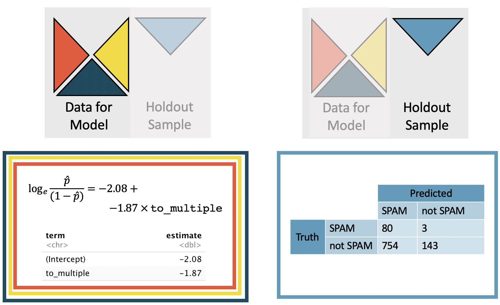
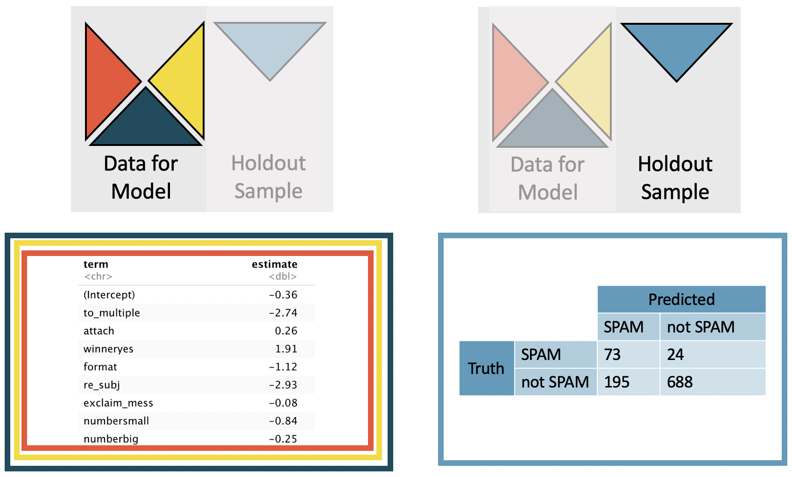

# Inference for logistic regression {#inf-model-logistic}

::: {.chapterintro}
Combining ideas from Chapter \@ref(model-logistic) on Logistic regression, Chapter \@ref(foundations-mathematical) on Inference with mathematical models, and Chapters \@ref(inf-model-slr) & \@ref(inf-model-mlr) which apply inferential techniques to the linear model, we complete the book by considering inferential methods applied to a logistic regression model.
We use cross validation as a method for independent assessment of the logistic regression model.
:::

```{r include=FALSE}
terms_chp_27 <- c("inference on logistic regression")
```

As with multiple linear regression, the inference aspect for logistic regression will focus on interpretation of coefficients and relationships between explanatory variables.
Both p-values and cross validation will be used for assessing a logistic regression model.

Consider the `email` data which describes email characteristics which can be used to predict whether a particular incoming email is SPAM (unsolicited bulk email).
Without reading every incoming message, it might be nice to have an automated way to identify SPAM emails.
Which of the variables describing each email are important for predicting the status of the email?

::: {.data}
The data from this study can be found in the [openintro](http://openintrostat.github.io/openintro) package: [`email`](http://openintrostat.github.io/openintro/reference/email.html).
:::

```{r resume-variables}
resume_variables <- tribble(
  ~variable, ~description,
  "spam", "Indicator for whether the email was spam.",
  "to_multiple", "Indicator for whether the email was addressed to more than one recipient.",
  "from", "Whether the message was listed as from anyone (this is usually set by default for regular outgoing email).",
  "cc", "Number of people cc'ed.",
  "sent_email", "Indicator for whether the sender had been sent an email in the last 30 days.",
  "attach", "The number of attached files.",
  "dollar", "The number of times a dollar sign or the word “dollar” appeared in the email.",
  "winner", "Indicates whether “winner” appeared in the email.",
  "format", "Indicates whether the email was written using HTML (e.g. may have included bolding or active links).",
  "re_subj", "Whether the subject started with “Re:”, “RE:”, “re:”, or “rE:”",
  "exclaim_subj", "Whether there was an exclamation point in the subject.",
  "urgent_subj", "Whether the word “urgent” was in the email subject.",
  "exclaim_mess", "The number of exclamation points in the email message.",
  "number", "Factor variable saying whether there was no number, a small number (under 1 million), or a big number."
)

resume_variables %>%
  mutate(variable = cell_spec(variable, monospace = TRUE)) %>%
  kable(escape = FALSE, caption = "Descriptions for the `spam` variable along with 13 other variables in the `email` data set. Many of the variables are indicator variables, meaning they take the value 1 if the specified characteristic is present and 0 otherwise.") %>%
  kable_styling(
    bootstrap_options = c("striped", "condensed"),
    latex_options = "striped"
  )
```

## Multiple logistic regression output from software {#inf-log-reg-soft}

As learned in Chapter \@ref(model-mlr), optimization can be used to find the coefficient estimates for the logistic model.
The unknown population model can be written as:

$$
\begin{align*}
\log_e\bigg(\frac{p}{1-p}\bigg) = \beta_0 &+ \beta_1 \times \texttt{to_multiple} + \beta_2 \times \texttt{cc} \\
&+ \beta_3 \times \texttt{dollar} + \beta_4 \times \texttt{urgent_subj}
\end{align*}
$$

The estimated equation for the regression model may be written as a model with four predictor variables (where $\hat{p}$ is the estimated probability of being a SPAM email message):

$$
\begin{align*}
\log_e\bigg(\frac{\hat{p}}{1-\hat{p}}\bigg) =  -2.05 &+ -1.91 \times \texttt{to_multiple} + 0.02 \times \texttt{cc} \\
&- 0.07 \times \texttt{dollar} + 2.66 \times \texttt{urgent_subj}
\end{align*}
$$

```{r emaillogmodel}
glm(spam ~ to_multiple + cc + dollar + urgent_subj, data = email, family = "binomial") %>% tidy() %>%
  mutate(p.value = ifelse(p.value < .0001, "<0.0001", round(p.value, 5))) %>%
  kable(caption = "Summary of a logistic model for predicting whether an email is SPAM based on the variables to_multiple, cc, dollar, and urgent_subj. Each of the variables has its own coefficient estimate as well as p-value significance.", digits = 2) %>%
  kable_styling(full_width = FALSE)
```

Not only does Table \@ref(tab:emaillogmodel) provide the estimates for the coefficients, it also provides information on the inference analysis (i.e., hypothesis testing) which are the focus of this chapter.

As in Section \@ref(inf-model-mlr), with **multiple predictors**, each hypothesis test (for each of the explanatory variables) is conditioned on each of the other variables remaining in the model.

```{r include=FALSE}
terms_chp_27 <- c(terms_chp_27, "multiple predictors")
```

> if multiple predictors $H_0: \beta_i = 0$ given other variables in the model

Using the example above and focusing on each of the variable p-values (here we won't discuss the p-value associated with the intercept), we can write out the four different hypotheses (associated the p-value corresponding to each of the coefficients / row in Table \@ref(tab:emaillogmodel)):

-   $H_0: \beta_1 = 0$ given `cc`, `dollar`, and `urgent_subj` are included in the model
-   $H_0: \beta_2 = 0$ given `to_multiple`, `dollar`, and `urgent_subj` are included in the model
-   $H_0: \beta_3 = 0$ given `to_multiple`, `cc`, and `urgent_subj` are included in the model
-   $H_0: \beta_4 = 0$ given `to_multiple`, `dollar`, and `dollar` are included in the model

The very low p-values from the software output tell us that three of the variables (that is, not `cc`) act as important predictors in the model, despite the inclusion of any of the other variables.
Consider the p-value on $H_0: \beta_1$.
The low p-value says that it would be extremely unlikely to see data that produce a coefficient on `to_multiple` as large as -1.91 if the true relationship between `to_multiple` and `spam` was non-existent (i.e., if $\beta_1 = 0$) **and** the model also included `cc` and `dollar` and `urgent_subj`.
Note also that the coefficient on `dollar` is quite significant, but the magnitude of the coefficient is small (0.07).
It turns out that in units of standard errors (0.02 here), 0.07 is actually quite far from zero, it's all about context!
The p-values on the remaining variables are be interpreted similarly.
From the initial output (p-values) in Table \@ref(tab:emaillogmodel) it seems as though `to_multiple`, `dollar`, and `urgent_subj` are important variables for modeling whether an email is SPAM.
We remind you that although p-values provide some information about the model, there are many aspects to consider when choosing the best model.

As with linear regression (see Section \@ref(inf-mult-reg-collin)), correlated explanatory variables can impact both the coefficient estimates and the associated p-values.
Investigating multicollinearity in a logistic regression model is saved for a text which provides more detail about logistic regression.
Next, as a model building alternative (or enhancement) to p-values, we revisit cross validation within the context of predicting SPAM status for each of the individual emails.

## Cross validation for prediction error {#inf-log-reg-cv}

The p-value is a probability measure under a setting of no relationship.
That p-value provides information about the degree of the relationship (e.g., above we measure the relationship between `spam` and `to_multiple` using a p-value), but the p-value does not measure how well the model will predict the individual emails (e.g., the accuracy of the model).
Depending on the goal of the research project, you might be inclined to focus on variable importance (through p-values) or you might be inclined to focus on prediction accuracy (through cross validation).

Here we present a method for using cross validation accuracy to determine which variables (if any) should be used in a model which predicts whether an email is SPAM.
A full treatment of cross validation and logistic regression models is beyond the scope of this text.
Using cross validation, we can build $k$ different models which are used to predict the observations in each of the $k$ holdout samples.
The smaller model uses only the `to_multiple` variable, see the complete dataset (not cross validated) model output in Table \@ref(tab:emaillogmodel1).
The logistic regression model can be written as (where $\hat{p}$ is the estimated probability of being a SPAM email message):

```{r include=FALSE}
terms_chp_27 <- c(terms_chp_27, "cross validation")
```

$$
\log_e\bigg(\frac{\hat{p}}{1-\hat{p}}\bigg) =  -2.12 + -1.81\times \texttt{to_multiple}
$$

```{r emaillogmodel1}
glm(spam ~ to_multiple, data = email, family = "binomial") %>% tidy() %>%
  mutate(p.value = ifelse(p.value < .0001, "<0.0001", round(p.value, 5))) %>%
  kable(caption = "Summary of a logistic model for predicting whether an email is SPAM based on only the predictor variable to_multiple. Each of the variables has its own coefficient estimate as well as p-value significance.", digits = 2) %>%
  kable_styling(full_width = FALSE)
```

For each cross validated model, the coefficients change slightly, and the model is used to make independent predictions on the holdout sample.
The model from the first cross validation sample is given in Table \@ref(fig:emailCV1) and can be compared to the coefficients in Table \@ref(tab:emaillogmodel1).

```{r emailCV1, fig.cap = "The coefficients are estimated using the least squares model on 3/4 of the dataset with a single predictor variable. Predictions are made on the remaining 1/4 of the observations. Note that the predictions are independent of the estimated model coefficients, and the prediction error rate is quite high.", out.width="100%"}

```

```{r echo = FALSE}
set.seed(470)
data(email)
emailfolds <- caret::createFolds(email$spam, k = 4)

logCV1 <- data.frame(predicted = glm(spam ~ to_multiple, data = email[-emailfolds$Fold1,], family = "binomial") %>% 
             predict(newdata = email[emailfolds$Fold1,c("to_multiple")], type="response") ,
           obs = email[emailfolds$Fold1,]$spam,
           fold = rep("1st quarter", length(emailfolds$Fold1))) %>%
  rbind(data.frame(predicted = glm(spam ~ to_multiple, data = email[-emailfolds$Fold2,], family = "binomial") %>% 
             predict(newdata = email[emailfolds$Fold2,c("to_multiple")], type="response") ,
           obs = email[emailfolds$Fold2,]$spam,
           fold = rep("2nd quarter", length(emailfolds$Fold2))) )%>%
  rbind(data.frame(predicted = glm(spam ~ to_multiple, data = email[-emailfolds$Fold3,], family = "binomial") %>% 
             predict(newdata = email[emailfolds$Fold3,c("to_multiple")], type="response") ,
           obs = email[emailfolds$Fold3,]$spam,
           fold = rep("3rd quarter", length(emailfolds$Fold3))) )%>%
  rbind(data.frame(predicted = glm(spam ~ to_multiple, data = email[-emailfolds$Fold4,], family = "binomial") %>% 
             predict(newdata = email[emailfolds$Fold4,c("to_multiple")], type="response") ,
           obs = email[emailfolds$Fold4,]$spam,
           fold = rep("4th quarter", length(emailfolds$Fold4))) )%>%
  mutate(predspam = ifelse(predicted <= 0.1, 0, 1)) 

#logCV1 %>%
#  select(obs, predspam, fold) %>%
#  table()

#glm(spam ~ to_multiple, 
#    data = email[-emailfolds$Fold1,], family = "binomial") %>% tidy() %>%
#  select(term, estimate) %>%
#  mutate(estimate = round(estimate,2))
```

```{r email-spam}
logCV1 %>%
  group_by(fold) %>%
  summarize(count = n(), accuracy = sum(obs==predspam) / n(), notspamTP = sum(obs == 0 & predspam == 0)/ sum(obs == 0), spamTP = sum(obs == 1 & predspam == 1) / sum(obs == 1)) %>%
  kable(caption = "One quarter at a time, the data were removed from the model building, and whether the email was spam (TRUE) or not (FALSE) was predicted.  The logistic regression model was fit independently of the removed emails. Only `to_multiple` is used to predict whether the email is spam.  Because we used a cutoff designed to identify SPAM emails, the accuracy of the non-SPAM email predictions is very low.", digits = 2) %>%
  kable_styling(full_width = FALSE)
```

Because the SPAM dataset has a ratio of 90% non-SPAM and 10% SPAM emails, a model which randomly guessed all non-SPAM would have an overall accuracy of 90%!
Clearly, we'd like to capture the information with the SPAM emails, so our interest is in the percent of SPAM emails which are identified as SPAM (see Table \@ref(tab:email-spam)).
Additionally, in the logistic regression model, we use a 10% cutoff to predict whether or not the email is SPAM.
Fortunately, we've done a great job of predicting SPAM!
However, the trade-off was that most of the non-SPAM emails are now predicted to be SPAM which is not acceptable for a SPAM prediction algorithm.
Adding more variables to the model may help with both the SPAM and not-SPAM predictions.

The larger model uses `to_multiple`, `attach`, `winner`, `format`, `re_subj`, `exclaim_mess`, and `number` as the set of seven predictor variables, see the complete dataset (not cross validated) model output in Table \@ref(tab:emaillogmodel2).
The logistic regression model can be written as (where $\hat{p}$ is the estimated probability of being a SPAM email message):

$$
\begin{align*}
\log_e\bigg(\frac{\hat{p}}{1-\hat{p}}\bigg) = -0.34 &- 2.56 \times \texttt{to_multiple} + 0.20 \times \texttt{attach} \\
&+ 1.73 \times \texttt{winner}_{yes} - 1.28 \times \texttt{format} \\
&- 2.86 \times \texttt{re_subj} + 0 \times \texttt{exclaim_mess} \\
&- 1.07 \times \texttt{number}_{small} - 0.42 \times \texttt{number}_{big}
\end{align*}
$$

```{r emaillogmodel2}
glm(spam ~ to_multiple + attach + winner + format + re_subj + exclaim_mess + number, data = email, family = "binomial") %>% tidy() %>%
  mutate(p.value = ifelse(p.value < .0001, "<0.0001", round(p.value, 5))) %>%
  kable(caption = "Summary of a logistic model for predicting whether an email is SPAM based on only the predictor variable to_multiple. Each of the variables has its own coefficient estimate as well as p-value significance.", digits = 2) %>%
  kable_styling(full_width = FALSE)
```

```{r emailCV2, fig.cap = "The coefficients are estimated using the least squares model on 3/4 of the dataset with the seven specified predictor variables. Predictions are made on the remaining 1/4 of the observations. Note that the predictions are independent of the estimated model coefficients.  The predictions are now much better for both the SPAM and the non-SPAM emails (than they were with a single predictor variable).", out.width="100%"}

```

```{r}
set.seed(470)
emailfolds <- caret::createFolds(email$spam, k = 4)

logCV2 <- data.frame(
  predicted = glm(spam ~ to_multiple + attach + winner + format + re_subj + exclaim_mess + number, data = email[-emailfolds$Fold1, ], family = "binomial") %>%
    predict(newdata = email[emailfolds$Fold1, c("to_multiple", "attach", "winner", "format", "re_subj", "exclaim_mess", "number")], type = "response"),
  obs = email[emailfolds$Fold1, ]$spam,
  fold = rep("1st quarter", length(emailfolds$Fold1))
) %>%
  rbind(data.frame(
    predicted = glm(spam ~ to_multiple + attach + winner + format + re_subj + exclaim_mess + number, data = email[-emailfolds$Fold2, ], family = "binomial") %>%
      predict(newdata = email[emailfolds$Fold2, c("to_multiple", "attach", "winner", "format", "re_subj", "exclaim_mess", "number")], type = "response"),
    obs = email[emailfolds$Fold2, ]$spam,
    fold = rep("2nd quarter", length(emailfolds$Fold2))
  )) %>%
  rbind(data.frame(
    predicted = glm(spam ~ to_multiple + attach + winner + format + re_subj + exclaim_mess + number, data = email[-emailfolds$Fold3, ], family = "binomial") %>%
      predict(newdata = email[emailfolds$Fold3, c("to_multiple", "attach", "winner", "format", "re_subj", "exclaim_mess", "number")], type = "response"),
    obs = email[emailfolds$Fold3, ]$spam,
    fold = rep("3rd quarter", length(emailfolds$Fold3))
  )) %>%
  rbind(data.frame(
    predicted = glm(spam ~ to_multiple + attach + winner + format + re_subj + exclaim_mess + number, data = email[-emailfolds$Fold4, ], family = "binomial") %>%
      predict(newdata = email[emailfolds$Fold4, c("to_multiple", "attach", "winner", "format", "re_subj", "exclaim_mess", "number")], type = "response"),
    obs = email[emailfolds$Fold4, ]$spam,
    fold = rep("4th quarter", length(emailfolds$Fold4))
  )) %>%
  mutate(predspam = ifelse(predicted <= 0.1, 0, 1))
```

```{r email-spam2}
logCV2 %>%
  group_by(fold) %>%
  summarize(count = n(), accuracy = sum(obs==predspam) / n(), notspamTP = sum(obs == 0 & predspam == 0)/ sum(obs == 0), spamTP = sum(obs == 1 & predspam == 1) / sum(obs == 1)) %>%
  kable(caption = "One quarter at a time, the data were removed from the model building, and whether the email was spam (TRUE) or not (FALSE) was predicted.  The logistic regression model was fit independently of the removed emails.  Now, the variables `to_multiple`, `attach`, `winner`, `format`, `re_subj`, `exclaim_mess`, and `number` are used to predict whether the email is spam.", digits = 2) %>%
  kable_styling(full_width = FALSE)
```

Somewhat expected, the larger model (see Table \@ref(tab:email-spam2)) was able to capture more nuance in the emails which lead to better predictions.
However, it is not true that adding variables will always lead to better predictions, as correlated or noise variables may dampen the signal from those variables which truly predict the SPAM status.
We encourage you to learn more about multiple variable models and cross validation in your future exploration of statistical topics.

## Chapter review {#chp26-review}

### Summary

Throughout the text, we have presented a modern view to introduction to statistics.
Early we presented graphical techniques which communicated relationships across multiple variables.
We also used modeling to formalize the relationships.
Many chapters were dedicated to inferential methods which allowed claims about the population to be made based on samples of data.
Not only did we present the mathematical model for each of the inferential techniques, but when appropriate, we also presented bootstrapping and permutation methods.
In Chapter \@ref{inference-reg} we brought many of the ideas together by considering inferential claims on models which include many variables.
We continue to emphasize the importance of experimental design in making conclusions about research claims.
In particular, recall that variability can come from different sources (e.g., random sampling vs. random allocation, see Figure \@ref(fig:randsampValloc)).

As you might guess, this text has only scratched the surface of the world of statistical analyses that can be applied to different datasets.
In particular, to do justice to the topic, the linear models and generalized linear models we have introduced can each be covered with their own course or book.
Hierarchical models, alternative methods for fitting parameters (e.g., Ridge Regression or LASSO), and advanced computational methods applied to models (e.g., permuting the response variable? one explanatory variable? all the explanatory variables?) are all beyond the scope of this book.
However, your successful understanding of the ideas we have covered has set you up perfectly to move on to a higher level of statistical modeling and inference.
Enjoy!

### Terms

We introduced the following terms in the chapter.
If you're not sure what some of these terms mean, we recommend you go back in the text and review their definitions.
We are purposefully presenting them in alphabetical order, instead of in order of appearance, so they will be a little more challenging to locate.
However you should be able to easily spot them as **bolded text**.

```{r}
make_terms_table(terms_chp_27)
```

## Exercises {#chp27-exercises}

::: {.todo}
Add exercises
:::
