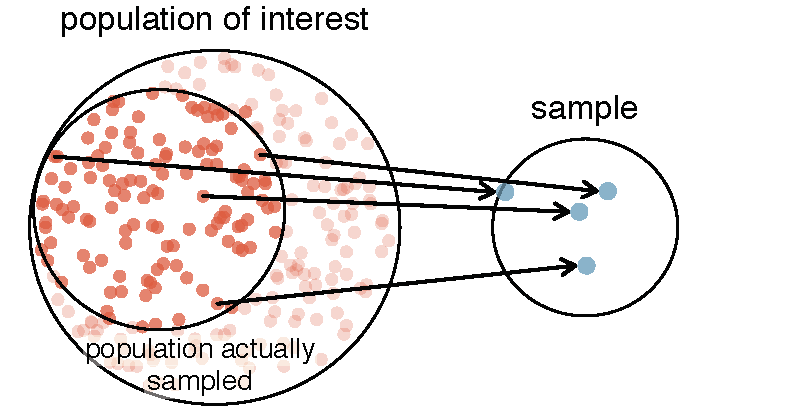

# Introduction to data {#intro-to-data}


<style>
.column-left{
  float: left;
  width: 49%;
  text-align: left;
}
.column-right{
  float: right;
  width: 49%;
  text-align: left;
}
</style>


Scientists seek to answer questions using rigorous methods and careful observations. 
These observations -- collected from the likes of field notes, surveys, and experiments -- form the backbone of a statistical investigation and are called \index{data}data. 
Statistics is the study of how best to collect, analyze, and draw conclusions from data, and in this first chapter, we focus on both the properties of data and on the collection of data.
<!--
%\begin{tipBox}{\tipBoxTitle[Chapter Goal:]{Thinking about data}
%Understand basics about data organization, data types, numerical summaries of data, graphical summaries of data, and foundational techniques for data collection. We begin and end the chapter with case studies.}
%\end{tipBox}
-->


1. Identify a question or problem.
2. Collect relevant data on the topic.
3. Analyze the data.
4. Form a conclusion.
<!--%\item Make decisions based on the conclusion.-->

Statistics as a subject focuses on making stages 2-4 objective, rigorous, and efficient. That is, statistics has three primary components: How best can we collect data? How should it be analyzed? And what can we infer from the analysis?

The topics scientists investigate are as diverse as the questions they ask. However, many of these investigations can be addressed with a small number of data collection techniques, analytic tools, and fundamental concepts in statistical inference. This chapter provides a glimpse into these and other themes we will encounter throughout the rest of the book. We introduce the basic principles of each branch and learn some tools along the way. We will encounter applications from other fields, some of which are not typically associated with science but nonetheless can benefit from statistical study.


## Case Study: using stents to prevent strokes {#basicExampleOfStentsAndStrokes}

\index{data!stroke|(}

Section \@ref(basicExampleOfStentsAndStrokes) introduces a classic challenge in statistics: evaluating the efficacy of a medical treatment. 
Terms in this section, and indeed much of this chapter, will all be revisited later in the text. 
The plan for now is simply to get a sense of the role statistics can play in practice.

In this section we will consider an experiment that studies effectiveness of stents in treating patients at risk of stroke.^[Chimowitz MI, Lynn MJ, Derdeyn CP, et al. 2011. Stenting versus Aggressive Medical Therapy for Intracranial Arterial Stenosis. New England Journal of Medicine 365:993-1003. http://www.nejm.org/doi/full/10.1056/NEJMoa1105335. NY Times article reporting on the study: http://www.nytimes.com/2011/09/08/health/research/08stent.html.]
Stents are small mesh tubes that are placed inside narrow or weak arteries to assist in patient recovery after cardiac events and reduce the risk of an additional heart attack or death. 

Many doctors have hoped that there would be similar benefits for patients at risk of stroke. We start by writing the principal question the researchers hope to answer:

> Does the use of stents reduce the risk of stroke?

The researchers who asked this question conducted an experiment with 451 at-risk patients. Each volunteer patient was randomly assigned to one of two groups:

- **Treatment group**. Patients in the treatment group received a stent and medical management. 
The medical management included medications, management of risk factors, and help in lifestyle modification.
- **Control group**. Patients in the control group received the same medical management as the treatment group, but they did not receive stents.

Researchers randomly assigned 224 patients to the treatment group and 227 to the control group. 
In this study, the control group provides a reference point against which we can measure the medical impact of stents in the treatment group.

Researchers studied the effect of stents at two time points: 30 days after enrollment and 365 days after enrollment. 
The results of 5 patients are summarized in Table \@ref(tab:stentStudyResultsDF). 
Patient outcomes are recorded as `stroke` or `no event`, representing whether or not the patient had a stroke at the end of a time period.


 patient      group      0-30 days    0-365 days 
---------  -----------  -----------  ------------
    1       treatment    no event      no event  
    2        control     no event       stroke   
    3        control     no event      no event  
    4        control     no event       stroke   
    5        control     no event      no event  

Considering data from each patient individually would be a long, cumbersome path towards answering the original research question. 
Instead, performing a statistical data analysis allows us to consider all of the data at once. 
Table \@ref(tab:stentStudyResultsDF) summarizes the raw data in a more helpful way. 
In this table, we can quickly see what happened over the entire study. 
For instance, to identify the number of patients in the treatment group who had a stroke within 30 days, we look on the left-side of the table at the intersection of the treatment and stroke: 33.


   group      0-30 days_stroke    0-30 days_no event    0-365 days_stroke    0-365 days_no event 
-----------  ------------------  --------------------  -------------------  ---------------------
 treatment           33                  191                   45                    179         
  control            13                  214                   28                    199         

[MCR-TODO: Figure out LaTeX exercise counter stuff that's differently formatted for in text exercises.]
**Exercise:** see \@ref(exr:test)

\BeginKnitrBlock{exercise}\iffalse{-91-80-114-111-112-111-114-116-105-111-110-32-111-102-32-115-116-114-111-107-101-32-118-105-99-116-105-109-115-93-}\fi{}<div class="exercise"><span class="exercise" id="exr:test"><strong>(\#exr:test)  \iffalse (Proportion of stroke victims) \fi{} </strong></span>Of the 224 patients in the treatment group, 45 had a stroke by the end of the first year. 
Using these two numbers, compute the proportion of patients in the treatment group who had a stroke by the end of their first year.</div>\EndKnitrBlock{exercise}
(Please note: answers to all Guided Practice exercises are provided using footnotes.)^[The proportion of the 224 patients who had a stroke within 365 days: $45/224 = 0.20$.]

We can compute summary statistics from the table.
A \index{summary statistic}summary statistic is a single number summarizing a large amount of data.
For instance, the primary results of the study after 1 year could be described by two summary statistics: the proportion of people who had a stroke in the treatment and control groups.

- Proportion who had a stroke in the treatment (stent) group: $45/224 = 0.20 = 20\%$.
- Proportion who had a stroke in the control group: $28/227 = 0.12 = 12\%$.

These two summary statistics are useful in looking for differences in the groups, and we are in for a surprise: an additional 8% of patients in the treatment group had a stroke! 
This is important for two reasons. 
First, it is contrary to what doctors expected, which was that stents would **reduce** the rate of strokes. 
Second, it leads to a statistical question: do the data show a "real" difference between the groups?

This second question is subtle. 
Suppose you flip a coin 100 times. While the chance a coin lands heads in any given coin flip is 50%, we probably won't observe exactly 50 heads. 
This type of fluctuation is part of almost any type of data generating process. 
It is possible that the 8% difference in the stent study is due to this natural variation. 
However, the larger the difference we observe (for a particular sample size), the less believable it is that the difference is due to chance. 
So what we are really asking is the following: is the difference so large that we should reject the notion that it was due to chance?

While we don't yet have our statistical tools to fully address this question on our own, we can comprehend the conclusions of the published analysis: there was compelling evidence of harm by stents in this study of stroke patients.

**Be careful:**
Do not generalize the results of this study to all patients and all stents.
This study looked at patients with very specific characteristics who volunteered to be a part of this study and who may not be representative of all stroke patients.
In addition, there are many types of stents and this study only considered the self-expanding Wingspan stent (Boston Scientific).
However, this study does leave us with an important lesson: we should keep our eyes open for surprises.

\index{data!stroke|)}

## Taxonomy of Data {#dataBasics}

Effective presentation and description of data is a first step in most analyses. This section introduces one structure for organizing data as well as some terminology that will be used throughout this book.

### Observations, variables, and data matrices

\index{data!email50|(}

Table \@ref(tab:email50DF) displays the first six rows of a data set concerning 50 emails received in 2012. These observations will be referred to as the \data{email50} data set, and they are a random sample from a larger data set that we will see in Section \@ref(inference-cat).

Each row in the table represents a single email or \index{case}case.^[A case is also sometimes called a \index{unit of observation}unit of observation or an \index{observational unit}observational unit.] The columns represent characteristics, called \indexsub{variables}{variable}variables, for each of the emails. For example, the first row represents email 1, which is not spam, contains 21,705 characters, 551 line breaks, is written in HTML format, and contains only small numbers.

In practice, it is especially important to ask clarifying questions to ensure important aspects of the data are understood. For instance, it is always important to be sure we know what each variable means and the units of measurement. Descriptions of all five email variables are given in Table \@ref(tab:email50Variables).


 spam    num_char    line_breaks    format    number 
------  ----------  -------------  --------  --------
  0       21.705         551          1       small  
  0       7.011          183          1        big   
  1       0.631          28           0        none  
  0       2.454          61           0       small  
  0       41.623        1088          1       small  
  0       0.057           5           0       small  

[MCR-TODO: Unbelievably annoying that I can't print the help file.  Do you know how??  Otherwise, we have to leave this as a markdown table.]

Table: (\#tab:email50Variables) Variables and their descriptions for the `email50` data set.

| **variable**                   | **description**                                                                                                                          |
|----------------------------------|--------------------------------------------------------------------------------------------------------------------------------------------|
| `spam`                       | Indicator for whether the email was spam.                                                                                                     |
| `num_char`    | The number of characters in the email, in thousands.                                                                                                      |
| `line_breaks` | The number of line breaks in the email (does not count text wrapping).                                                                       |
| `format`                     | Indicates if the email contained special formatting, such as bolding, tables, or links, which would indicate the message is in HTML format |
| `number`                     | Indicates whether the email contained no number, a small number (under 1 million), or a large number                                       |

\index{data!email50|)}

The data in Table \@ref(tab:email50DF) represent a \index{data matrix}data matrix, which is a common way to organize data. 
Each row of a data matrix corresponds to a unique case, and each column corresponds to a variable. 
A data matrix for the stroke study introduced in Section \@ref(basicExampleOfStentsAndStrokes) is shown in Table \@ref(tab:stentStudyResultsDF), where the cases were patients and there were three variables recorded for each patient.

Data matrices are a convenient way to record and store data. 
If another individual or case is added to the data set, an additional row can be easily added. 
Similarly, another column can be added for a new variable.

\index{data!county|(}

\BeginKnitrBlock{exercise}<div class="exercise"><span class="exercise" id="exr:unnamed-chunk-3"><strong>(\#exr:unnamed-chunk-3) </strong></span>We consider a publicly available data set that summarizes information about the 3,143 counties in the United States, and we call this the \data{county} data set. 
This data set includes information about each county: its name, the state where it resides, its population in 2000 and 2010, per capita federal spending, poverty rate, and five additional characteristics. 
How might these data be organized in a data matrix? 
Reminder: look in the footnotes for answers to in-text exercises.^[Each county may be viewed as a case, and there are eleven pieces of information recorded for each case. A table with 3,143 rows and 11 columns could hold these data, where each row represents a county and each column represents a particular piece of information.]</div>\EndKnitrBlock{exercise}

Seven rows of the \data{county} data set are shown in Table \@ref(tab:countyDF), and the variables are summarized in Table \@ref(tab:countyVariables). 
These data were collected from the US Census website.^[http://quickfacts.census.gov/qfd/index.html]


      name          state     pop2010    pop2017    fed_spend    poverty    homeownership    multiunit    income    med_income     smoking_ban  
----------------  ---------  ---------  ---------  -----------  ---------  ---------------  -----------  --------  ------------  ---------------
 Autauga County    Alabama     54571      55504       6.07        13.7          77.5            7.2       27842       54487           none      
 Baldwin County    Alabama    182265     212628       6.14        11.8          76.7           22.6       27780       56460           none      
 Barbour County    Alabama     27457      25270       8.75        27.2          68.0           11.1       17892       32884          partial    
  Bibb County      Alabama     22915      22668       7.12        15.2          82.9            6.6       20572       43079           none      
 Blount County     Alabama     57322      58013       5.13        15.6          82.0            3.7       21367       47213           none      
 Bullock County    Alabama     10914      10309       9.97        28.5          76.9            9.9       15444       34278           none      
 Butler County     Alabama     20947      19825       9.31        24.4          69.0           13.7       17015       35409       comprehensive 

Table: (\#tab:countyVariables) Variables and their descriptions for the `county` data set.

| **variable**    | **description**                                                                                                                       |
|-----------------|---------------------------------------------------------------------------------------------------------------------------------------|
| `name`          | County name                                    |
| `state`         | State where the county resides (also including the District of Columbia) |
| `pop2000`       | Population in 2010                             |
| `pop2010`       | Population in 2017                             |
| `fed_spend`     | Federal spending per capita in 2009            |
| `poverty`       | Percent of the population in poverty in 2017   |
| `homeownership` | Percent of the population that lives in their own home or lives with the owner in 2010 (e.g. children living with parents who own the home) |
| `multiunit`     | Percent of living units that are in multi-unit structures in 2010 (e.g. apartments) |
| `income`        | Income per capita in 2017                      |
| `med_income`    | Median household income for the county, where a household's income equals the total income of its occupants who are 15 years or older in 2016 |
| `smoking_ban`   | Type of county-wide smoking ban in place at the end of 2010, which takes one of three values: `none`, `partial`, or `comprehensive`, where a `comprehensive` ban means smoking was not permitted in restaurants, bars, or workplaces, and `partial` means smoking was banned in at least one of those three locations |

### Types of variables {#variableTypes}

Examine the `fed_spend`, `pop2010`, `state`, and `smoking_ban` variables in the \data{county} data set. 
Each of these variables is inherently different from the other three yet many of them share certain characteristics.

First consider `fed_spend`, which is said to be a \index{numerical}numerical variable since it can take a wide range of numerical values, and it is sensible to add, subtract, or take averages with those values. 
On the other hand, we would not classify a variable reporting telephone area codes as numerical since their average, sum, and difference have no clear meaning.

The `pop2010` variable is also numerical, although it seems to be a little different than `fed_spend`. 
This variable of the population count can only be a whole non-negative number (0, 1, 2 ...). 
For this reason, the population variable is said to be \index{discrete}discrete since it can only take numerical values with jumps. 
On the other hand, the federal spending variable is said to be \index{continuous}continuous.

The variable `state` can take up to 51 values after accounting for Washington, DC: `AL`, ..., and `WY`. 
Because the responses themselves are categories, `state` is called a \index{categorical}categorical variable,^[Sometimes also called a \index{nominal}nominal variable.] and the possible values are called the variable's \index{levels}levels.


<div class="figure" style="text-align: center">

<p class="caption">(\#fig:variables)Breakdown of variables into their respective types.</p>
</div>


Finally, consider the `smoking_ban` variable, which describes the type of county-wide smoking ban and takes a value `none`,`partial`, or `comprehensive` in each county. 
This variable seems to be a hybrid: it is a categorical variable but the levels have a natural ordering. 
A variable with these properties is called an \index{ordinal}ordinal variable. 
To simplify analyses, any ordinal variables in this book will be treated as categorical variables.

\BeginKnitrBlock{example}<div class="example"><span class="example" id="exm:unnamed-chunk-4"><strong>(\#exm:unnamed-chunk-4) </strong></span>Data were collected about students in a statistics course. 
Three variables were recorded for each student: number of siblings, student height, and whether the student had previously taken a statistics course. 
Classify each of the variables as continuous numerical, discrete numerical, or categorical.

---

The number of siblings and student height represent numerical variables. 
Because the number of siblings is a count, it is discrete. 
Height varies continuously, so it is a continuous numerical variable. 
The last variable classifies students into two categories -- those who have and those who have not taken a statistics course -- which makes this variable categorical.</div>\EndKnitrBlock{example}


\index{data!stroke}

\BeginKnitrBlock{exercise}<div class="exercise"><span class="exercise" id="exr:unnamed-chunk-5"><strong>(\#exr:unnamed-chunk-5) </strong></span>Consider the variables `group` and `outcome` (at 30 days) from the stent study in Section \@ref(basicExampleOfStentsAndStrokes). 
Are these numerical or categorical variables?^[There are only two possible values for each variable, and in both cases they describe categories. Thus, each is a categorical variable.]</div>\EndKnitrBlock{exercise}

### Relationships between variables {#variableRelations}

Many analyses are motivated by a researcher looking for a relationship between two or more variables. 
A social scientist may like to answer some of the following questions:

1. Is federal spending, on average, higher or lower in counties with high rates of poverty?
2. If homeownership is lower than the national average in one county, will the percent of multi-unit structures in that county likely be above or below the national average?
3. Which counties have a higher average income: those that enact one or more smoking bans or those that do not?

To answer these questions, data must be collected, such as the \data{county} data set shown in Table \@ref(tab:countyDF). 
Examining summary statistics \index{summary statistic}summary statistics could provide insights for each of the three questions about counties. 
Additionally, graphs can be used to visually summarize data and are useful for answering such questions as well.

\indexthis{Scatterplots}{scatterplot}Scatterplots are one type of graph used to study the relationship between two numerical variables. 
Figure \@ref(fig:countyfedspendVsPoverty) compares the variables `fed_spend` and `poverty`. 
Each point on the plot represents a single county. 
For instance, the highlighted dot corresponds to County 1088 in the \data{county} data set: Owsley County, Kentucky, which had a poverty rate of 41.5% and federal spending of $21.50 per capita. 
The dense cloud in the scatterplot suggests a relationship between the two variables: counties with a high poverty rate also tend to have slightly more federal spending. 
We might brainstorm as to why this relationship exists and investigate each idea to determine which is the most reasonable explanation.

<div class="figure" style="text-align: center">

<p class="caption">(\#fig:countyfedspendVsPoverty)A scatterplot showing `fed_spend` against `poverty`. Owsley County of Kentucky, with a poverty rate of 41.5% and federal spending of $21.50 per capita, is highlighted.</p>
</div>


\BeginKnitrBlock{exercise}<div class="exercise"><span class="exercise" id="exr:unnamed-chunk-6"><strong>(\#exr:unnamed-chunk-6) </strong></span>Examine the variables in the \data{email50} data set, which are described in Table \@ref(tab:email50Variables). 
Create two questions about the relationships between these variables that are of interest to you.^[Two sample questions: (1) Intuition suggests that if there are many line breaks in an email then there would also tend to be many characters: does this hold true? (2) Is there a connection between whether an email format is plain text (versus HTML) and whether it is a spam message?]</div>\EndKnitrBlock{exercise}

The `fed_spend` and `poverty` variables are said to be associated because the plot shows a discernible pattern. 
When two variables show some connection with one another, they are called \index{associated}associated variables. 
Associated variables can also be called \index{dependent}dependent variables and vice-versa.

\BeginKnitrBlock{example}<div class="example"><span class="example" id="exm:unnamed-chunk-7"><strong>(\#exm:unnamed-chunk-7) </strong></span>The relationship between the homeownership rate and the percent of units in multi-unit structures (e.g. apartments, condos) is visualized using a scatterplot in Figure \@ref(fig:multiunitsVsOwnership). 
Are these variables associated?
    
---

It appears that the larger the fraction of units in multi-unit structures, the lower the homeownership rate. 
Since there is some relationship between the variables, they are associated.</div>\EndKnitrBlock{example}


<div class="figure" style="text-align: center">

<p class="caption">(\#fig:multiunitsVsOwnership)A scatterplot of the homeownership rate versus the percent of units that are in multi-unit structures for all 3,143 counties. Interested readers may find an image of this plot with an additional third variable, county population, presented at http://www.openintro.org/stat/down/MHP.png.</p>
</div>

Because there is a downward trend in Figure \@ref(fig:multiunitsVsOwnership) -- counties with more units in multi-unit structures are associated with lower homeownership -- these variables are said to be \indexsub{negatively associated}{negative association}negatively associated. A \index{positive association}positive association is shown in the relationship between the `poverty` and `fed_spend` variables represented in Figure \@ref(fig:countyfedspendVsPoverty), where counties with higher poverty rates tend to receive more federal spending per capita.

If two variables are not associated, then they are said to be \index{independent}independent. That is, two variables are independent if there is no evident relationship between the two.

\begin{termBox}{\tBoxTitle{Associated or independent, not both}
A pair of variables are either related in some way (associated) or not (independent). No pair of variables is both associated and independent.}
\end{termBox}

\index{data!county|)}


## Overview of data collection principles {#overviewOfDataCollectionPrinciples}

\index{sample|(}
\index{population|(}

The first step in conducting research is to identify topics or questions that are to be investigated. 
A clearly laid out research question is helpful in identifying what subjects or cases should be studied and what variables are important. 
It is also important to consider *how* data are collected so that they are reliable and help achieve the research goals.

### Populations and samples {#populationsAndSamples}

Consider the following three research questions:

1. What is the average mercury content in swordfish in the Atlantic Ocean?
2. <!--\label{timeToGraduationQuestionForUCLAStudents}--> Over the last 5 years, what is the average time to complete a degree for Duke undergraduate students?
3. <!--\label{identifyPopulationOfStentStudy}--> Does a new drug reduce the number of deaths in patients with severe heart disease?

Each research question refers to a target \index{population}population. 
In the first question, the target population is all swordfish in the Atlantic ocean, and each fish represents a case. 
It is usually too expensive to collect data for every case in a population. Instead, a sample is taken. 
A \index{sample}sample represents a subset of the cases and is often a small fraction of the population. 
For instance, 60 swordfish (or some other number) in the population might be selected, and this sample data may be used to provide an estimate of the population average and answer the research question.

\BeginKnitrBlock{exercise}<div class="exercise"><span class="exercise" id="exr:identifyingThePopulationForTwoQuestionsInPopAndSampSubsection"><strong>(\#exr:identifyingThePopulationForTwoQuestionsInPopAndSampSubsection) </strong></span>For the second and third questions above, identify the target population and what represents an individual case.^[(2) Notice that the second question is only relevant to students who complete their degree; the average cannot be computed using a student who never finished her degree. Thus, only Duke undergraduate students who have graduated in the last five years represent cases in the population under consideration. Each such student would represent an individual case. (3) A person with severe heart disease represents a case. The population includes all people with severe heart disease.]
<!-- refence the footnote?  timeToGraduationQuestionForUCLAStudents and identifyPopulationOfStentStudy--></div>\EndKnitrBlock{exercise}


### Anecdotal evidence {#anecdotalEvidenceSubsection}

Consider the following possible responses to the three research questions:

1. A man on the news got mercury poisoning from eating swordfish, so the average mercury concentration in swordfish must be dangerously high.
2. <!--iKnowThreeStudentsWhoTookMoreThan7YearsToGraduateAtDuke--> I met two students who took more than 7 years to graduate from Duke, so it must take longer to graduate at Duke than at many other colleges.
3. <!--myFriendsDadDiedAfterSulphinpyrazon--> My friend's dad had a heart attack and died after they gave him a new heart disease drug, so the drug must not work.

Each conclusion is based on data. 
However, there are two problems. 
First, the data only represent one or two cases. 
Second, and more importantly, it is unclear whether these cases are actually representative of the population. 
Data collected in this haphazard fashion are called \index{anecdotal evidence}anecdotal evidence.


<div class="figure" style="text-align: center">

<p class="caption">(\#fig:mnWinter)In February 2010, some media pundits cited one large snow storm as evidence against global warming. As comedian Jon Stewart pointed out, "It is one storm, in one region, of one country."</p>
</div>

\begin{termBox}{\tBoxTitle{Anecdotal evidence}
Be careful of data collected haphazardly. Such evidence may be true and verifiable, but it may only represent extraordinary cases.}
\end{termBox}

Anecdotal evidence typically is composed of unusual cases that we recall based on their striking characteristics. 
For instance, we are more likely to remember the two people we met who took 7 years to graduate than the six others who graduated in four years. 
Instead of looking at the most unusual cases, we should examine a sample of many cases that represent the population.

### Sampling from a population

\index{sample!random sample|(}

We might try to estimate the time to graduation for Duke undergraduates in the last 5 years by collecting a sample of students. 
All graduates in the last 5 years represent the *population*\index{population}, and graduates who are selected for review are collectively called the *sample*\index{sample}. 
In general, we always seek to *randomly* select a sample from a population. 
The most basic type of random selection is equivalent to how raffles are conducted. 
For example, in selecting graduates, we could write each graduate's name on a raffle ticket and draw 100 tickets. 
The selected names would represent a random sample of 100 graduates.


<div class="figure" style="text-align: center">

<p class="caption">(\#fig:popToSampleGraduates)In this graphic, five graduates are randomly selected from the population to be included in the sample.</p>
</div>

Why pick a sample randomly? Why not just pick a sample by hand? Consider the following scenario.

\BeginKnitrBlock{example}<div class="example"><span class="example" id="exm:unnamed-chunk-8"><strong>(\#exm:unnamed-chunk-8) </strong></span>Suppose we ask a student who happens to be majoring in nutrition to select several graduates for the study. 
What kind of students do you think she might collect? Do you think her sample would be representative of all graduates?
  
---
    
Perhaps she would pick a disproportionate number of graduates from health-related fields. 
Or perhaps her selection would be well-representative of the population. 
When selecting samples by hand, we run the risk of picking a *biased* sample, even if that bias is unintentional or difficult to discern.</div>\EndKnitrBlock{example}

<div class="figure" style="text-align: center">

<p class="caption">(\#fig:popToSubSampleGraduates)Instead of sampling from all graduates equally, a nutrition major might inadvertently pick graduates with health-related majors disproportionately often.</p>
</div>

If someone was permitted to pick and choose exactly which graduates were included in the sample, it is entirely possible that the sample could be skewed to that person's interests, which may be entirely unintentional. 
This introduces \index{bias}bias into a sample. Sampling randomly helps resolve this problem. 
The most basic random sample is called a \index{simple random sample}simple random sample, which is equivalent to using a raffle to select cases. 
This means that each case in the population has an equal chance of being included and there is no implied connection between the cases in the sample.

<!--
\APVersion{Sometimes a simple random sample is difficult to implement and an alternative method is helpful. One such substitute is a \index{systematic sample}, where one case is sampled after letting a fixed number of others, say 10 other cases, pass by. Since this approach uses a mechanism that is not easily subject to personal biases, it often yields a reasonably representative sample. This book will focus on random samples since the use of systematic samples is uncommon and requires additional considerations of the context.}{}
-->

The act of taking a simple random sample helps minimize bias, however, bias can crop up in other ways.
Even when people are picked at random, e.g. for surveys, caution must be exercised if the \index{non-response}non-response \index{sample!non-response|textbf} is high. 
For instance, if only 30% of the people randomly sampled for a survey actually respond, and it is unclear whether the respondents are \index{representative}representative of the entire population, the survey might suffer from \index{non-response bias}non-response bias.\index{sample!non-response bias|textbf}


<div class="figure" style="text-align: center">

<p class="caption">(\#fig:surveySample)Due to the possibility of non-response, surveys studies may only reach a certain group within the population. It is difficult, and often impossible, to completely fix this problem.</p>
</div>

Another common downfall is a \index{convenience sample}\index{sample!convenience sample}convenience sample, where individuals who are easily accessible are more likely to be included in the sample. 
For instance, if a political survey is done by stopping people walking in the Bronx, it will not represent all of New York City. 
It is often difficult to discern what sub-population a convenience sample represents.

\BeginKnitrBlock{exercise}<div class="exercise"><span class="exercise" id="exr:unnamed-chunk-9"><strong>(\#exr:unnamed-chunk-9) </strong></span>We can easily access ratings for products, sellers, and companies through websites. 
These ratings are based only on those people who go out of their way to provide a rating. If 50% of online reviews for a product are negative, do you think this means that 50% of buyers are dissatisfied with the product?^[Answers will vary. From our own anecdotal experiences, we believe people tend to rant more about products that fell below expectations than rave about those that perform as expected. For this reason, we suspect there is a negative bias in product ratings on sites like Amazon. However, since our experiences may not be representative, we also keep an open mind.]</div>\EndKnitrBlock{exercise}

\index{sample!random sample|)}
\index{population|)}
\index{sample|)}

### Explanatory and response variables {#explanatoryAndResponse}

\index{data!county|(}

Consider the following question <!--from page \pageref{fedSpendingPovertyQuestion}--> for the \data{county} data set:

1. Is federal spending, on average, higher or lower in counties with high rates of poverty?

If we suspect poverty might affect spending in a county, then poverty is the \index{explanatory}explanatory variable and federal spending is the \index{response}response variable in the relationship.^[Sometimes the explanatory variable is called the \index{independent}independent variable and the response variable is called the \index{dependent}dependent variable. However, this becomes confusing since a *pair* of variables might be independent or dependent, so we avoid this language.] If there are many variables, it may be possible to consider a number of them as explanatory variables.

\begin{tipBox}{\tipBoxTitle{Explanatory and response variables}
To identify the explanatory variable in a pair of variables, identify which of the two is suspected of affecting the other.


\end{tipBox}

\begin{caution}{association does not imply causation}{Labeling variables as *explanatory* and *response* does not guarantee the relationship between the two is actually causal, even if there is an association identified between the two variables. We use these labels only to keep track of which variable we suspect affects the other.}
\end{caution}

In some cases, there is no explanatory or response variable. Consider the following question<!-- from page \pageref{ownershipMultiUnitQuestion}-->:

2. If homeownership is lower than the national average in one county, will the percent of multi-unit structures in that county likely be above or below the national average?

It is difficult to decide which of these variables should be considered the explanatory and response variable, i.e. the direction is ambiguous, so no explanatory or response labels are suggested here.

\index{data!county|)}

### Introducing observational studies and experiments

There are two primary types of data collection: observational studies and experiments.

Researchers perform an \index{observational study}observational study when they collect data in a way that does not directly interfere with how the data arise. For instance, researchers may collect information via surveys, review medical or company records, or follow a \index{cohort}cohort of many similar individuals to study why certain diseases might develop. In each of these situations, researchers merely observe what happens. In general, observational studies can provide evidence of a naturally occurring association between variables, but they cannot by themselves show a causal connection.

When researchers want to investigate the possibility of a causal connection, they conduct an \index{experiment}experiment. Usually there will be both an explanatory and a response variable. For instance, we may suspect administering a drug will reduce mortality in heart attack patients over the following year. To check if there really is a causal connection between the explanatory variable and the response, researchers will collect a sample of individuals and split them into groups. The individuals in each group are *assigned* a treatment. When individuals are randomly assigned to a group, the experiment is called a \index{randomized experiment}randomized experiment. For example, each heart attack patient in the drug trial could be randomly assigned,  perhaps by flipping a coin, into one of two groups: the first group receives a \index{placebo}placebo (fake treatment) and the second group receives the drug. See the case study in Section \@ref(basicExampleOfStentsAndStrokes) for another example of an experiment, though that study did not employ a placebo.

\begin{tipBox}{\tipBoxTitle{association $\neq$ causation}
In a data analysis, association does not imply causation, and causation can only be inferred from a randomized experiment.}
\end{tipBox}


## Observational studies and sampling strategies

### Observational studies

Generally, data in observational studies are collected only by monitoring what occurs, while experiments require the primary explanatory variable in a study be assigned for each subject by the researchers.

Making causal conclusions based on experiments is often reasonable. 
However, making the same causal conclusions based on observational data can be treacherous and is not recommended. 
Thus, observational studies are generally only sufficient to show associations.

\BeginKnitrBlock{exercise}<div class="exercise"><span class="exercise" id="exr:sunscreenLurkingExample"><strong>(\#exr:sunscreenLurkingExample) </strong></span>Suppose an observational study tracked sunscreen use and skin cancer, and it was found that the more sunscreen someone used, the more likely the person was to have skin cancer. 
Does this mean sunscreen *causes* skin cancer?^[No. See the paragraph following the exercise for an explanation.]</div>\EndKnitrBlock{exercise}

Some previous research tells us that using sunscreen actually reduces skin cancer risk, so maybe there is another variable that can explain this hypothetical association between sunscreen usage and skin cancer. 
One important piece of information that is absent is sun exposure. 
If someone is out in the sun all day, she is more likely to use sunscreen *and* more likely to get skin cancer. 
Exposure to the sun is unaccounted for in the simple investigation.


<!--
% Some studies:
% http://www.sciencedirect.com/science/article/pii/S0140673698121682
% http://archderm.ama-assn.org/cgi/content/abstract/122/5/537
% Study with a similar scenario to that described here:
% http://onlinelibrary.wiley.com/doi/10.1002/ijc.22745/full
-->

Sun exposure is what is called a \index{confounding variable}confounding variable,^[Also called a \index{lurking variable}lurking variable, \index{confounding factor}confounding factor, or a \index{confounder}confounder.] which is a variable that is correlated with both the explanatory and response variables. 
While one method to justify making causal conclusions from observational studies is to exhaust the search for confounding variables, there is no guarantee that all confounding variables can be examined or measured.

In the same way, the \data{county} data set is an observational study with confounding variables, and its data cannot easily be used to make causal conclusions.

\BeginKnitrBlock{exercise}<div class="exercise"><span class="exercise" id="exr:unnamed-chunk-12"><strong>(\#exr:unnamed-chunk-12) </strong></span>Figure \@ref(fig:multiunitsVsOwnership) shows a negative association between the homeownership rate and the percentage of multi-unit structures in a county.
However, it is unreasonable to conclude that there is a causal relationship between the two variables. 
Suggest one or more other variables that might explain the relationship in Figure \@ref(fig:multiunitsVsOwnership).^[Answers will vary. Population density may be important. If a county is very dense, then a larger fraction of residents may live in multi-unit structures. Additionally, the high density may contribute to increases in property value, making homeownership infeasible for many residents.]</div>\EndKnitrBlock{exercise}

Observational studies come in two forms: prospective and retrospective studies. A \index{prospective study}prospective study identifies individuals and collects information as events unfold. 
For instance, medical researchers may identify and follow a group of similar individuals over many years to assess the possible influences of behavior on cancer risk. 
One example of such a study is The Nurses' Health Study, started in 1976 and expanded in 1989.^[http://www.channing.harvard.edu/nhs/] 
This prospective study recruits registered nurses and then collects data from them using questionnaires. 
\indexsub{Retrospective studies}{retrospective studies}Retrospective studies collect data after events have taken place, e.g. researchers may review past events in medical records. 
Some data sets, such as \data{county}, may contain both prospectively- and retrospectively-collected variables. 
Local governments prospectively collect some variables as events unfolded (e.g. retails sales) while the federal government retrospectively collected others during the 2010 census (e.g. county population).

### Three sampling methods (special topic) {#threeSamplingMethods}

Almost all statistical methods are based on the notion of implied randomness. 
If observational data are not collected in a random framework from a population, results from these statistical methods are not reliable. 
Here we consider three random sampling techniques: simple, stratified, and cluster sampling. 
Figure \@ref(fig:samplingMethodsFigure) provides a graphical representation of these techniques.


<div class="figure" style="text-align: center">

<p class="caption">(\#fig:samplingMethodsFigure)Examples of simple random, stratified, and cluster sampling. In the top panel, simple random sampling was used to randomly select the 18 cases. In the middle panel, stratified sampling was used: cases were grouped into strata, and then simple random sampling was employed within each stratum. In the bottom panel, cluster sampling was used, where data were binned into nine clusters, and three of the clusters were randomly selected.</p>
</div>


\indexsub{Simple random sampling}{sample!simple random sampling}Simple random sampling is probably the most intuitive form of random sampling. 
Consider the salaries of Major League Baseball (MLB) players, where each player is a member of one of the league's 30 teams. 
To take a simple random sample of 120 baseball players and their salaries from the 2010 season, we could write the names of that season's 828 players onto slips of paper, drop the slips into a bucket, shake the bucket around until we are sure the names are all mixed up, then draw out slips until we have the sample of 120 players. 
In general, a sample is referred to as "simple random" if each case in the population has an equal chance of being included in the final sample *and* knowing that a case is included in a sample does not provide useful information about which other cases are included.

\indexsub{Stratified sampling}{sample!stratified sampling} Stratified sampling is a divide-and-conquer sampling strategy. 
The population is divided into groups called \index{strata}\index{sample!strata|textbf}strata. 
The strata are chosen so that similar cases are grouped together, then a second sampling method, usually simple random sampling, is employed within each stratum. 
In the baseball salary example, the teams could represent the strata; some teams have a lot more money (we're looking at you, Yankees). 
Then we might randomly sample 4 players from each team for a total of 120 players.

Stratified sampling is especially useful when the cases in each stratum are very similar with respect to the outcome of interest. 
The downside is that analyzing data from a stratified sample is a more complex task than analyzing data from a simple random sample. 
The analysis methods introduced in this book would need to be extended to analyze data collected using stratified sampling.

\BeginKnitrBlock{example}<div class="example"><span class="example" id="exm:unnamed-chunk-13"><strong>(\#exm:unnamed-chunk-13) </strong></span>Why would it be good for cases within each stratum to be very similar?
  
---
    
We might get a more stable estimate for the subpopulation in a stratum if the cases are very similar. 
These improved estimates for each subpopulation will help us build a reliable estimate for the full population.</div>\EndKnitrBlock{example}

In \indexsub{cluster sampling}{sample!cluster sample}cluster sampling, we group observations into clusters, then randomly sample some of the clusters. 
Sometimes cluster sampling can be a more economical technique than the alternatives. 
Also, unlike stratified sampling, cluster sampling is most helpful when there is a lot of case-to-case variability within a cluster but the clusters themselves don't look very different from one another. 
For example, if neighborhoods represented clusters, then this sampling method works best when the neighborhoods are very diverse. 
A downside of cluster sampling is that more advanced analysis techniques are typically required, though the methods in this book can be extended to handle such data.

\BeginKnitrBlock{example}<div class="example"><span class="example" id="exm:unnamed-chunk-14"><strong>(\#exm:unnamed-chunk-14) </strong></span>Suppose we are interested in estimating the malaria rate in a densely tropical portion of rural Indonesia. 
We learn that there are 30 villages in that part of the Indonesian jungle, each more or less similar to the next. What sampling method should be employed?
  
---
    
A simple random sample would likely draw individuals from all 30 villages, which could make data collection extremely expensive. Stratified sampling would be a challenge since it is unclear how we would build strata of similar individuals. 
However, cluster sampling seems like a very good idea. 
We might randomly select a small number of villages. 
This would probably reduce our data collection costs substantially in comparison to a simple random sample and would still give us helpful information.</div>\EndKnitrBlock{example}

Another technique called \index{multistage sampling}multistage sampling is similar to cluster sampling, except that we take a simple random sample within each selected cluster. 
For instance, if we sampled neighborhoods using cluster sampling, we would next sample a subset of homes within each selected neighborhood if we were using multistage sampling.


## Experimental design and causality {#experimentsSection}

Studies where the researchers assign treatments to cases are called \indexsub{experiments}{experiment}experiments. 
When this assignment includes randomization, e.g. using a coin flip to decide which treatment a patient receives, it is called a \index{randomized experiment}randomized experiment. 
Randomized experiments are fundamentally important when trying to show a causal connection between two variables.

### Principles of experimental design {#experimentalDesignPrinciples}

Randomized experiments are generally built on four principles.

* **Controlling.** Researchers assign treatments to cases, and they do their best to \index{control}control any other differences in the groups. 
For example, when patients take a drug in pill form, some patients take the pill with only a sip of water while others may have it with an entire glass of water. 
To control for the effect of water consumption, a doctor may ask all patients to drink a 12 ounce glass of water with the pill.

* **Randomization.** Researchers randomize patients into treatment groups to account for variables that cannot be controlled. 
For example, some patients may be more susceptible to a disease than others due to their dietary habits. 
Randomizing patients into the treatment or control group helps even out such differences, and it also prevents accidental bias from entering the study.

* **Replication.** The more cases researchers observe, the more accurately they can estimate the effect of the explanatory variable on the response. 
In a single study, we \index{replicate}replicate by collecting a sufficiently large sample. 
Additionally, a group of scientists may replicate an entire study to verify an earlier finding.


<div class="figure" style="text-align: center">

<p class="caption">(\#fig:figureShowingBlocking)Blocking using a variable depicting patient risk. Patients are first divided into low-risk and high-risk blocks, then each block is evenly divided into the treatment groups using randomization. This strategy ensures an equal representation of patients in each treatment group from both the low-risk and high-risk categories.</p>
</div>


* **Blocking.** Researchers sometimes know or suspect that variables, other than the treatment, influence the response. 
Under these circumstances, they may first group individuals based on this variable and then randomize cases within each block to the treatment groups. 
This strategy is often referred to as \index{blocking}blocking. 
For instance, if we are looking at the effect of a drug on heart attacks, we might first split patients into low-risk and high-risk \index{blocks}blocks, then randomly assign half the patients from each block to the control group and the other half to the treatment group, as shown in Figure \@ref(fig:figureShowingBlocking). 
This strategy ensures each treatment group has an equal number of low-risk and high-risk patients.


It is important to incorporate the first three experimental design principles into any study, and this book describes methods for analyzing data from such experiments. 
Blocking is a slightly more advanced technique, and statistical methods in this book may be extended to analyze data collected using blocking.

### Reducing bias in human experiments {#biasInHumanExperiments}

Randomized experiments are the gold standard for data collection, but they do not ensure an unbiased perspective into the cause and effect relationships in all cases. 
Human studies are perfect examples where bias can unintentionally arise. 
Here we reconsider a study where a new drug was used to treat heart attack patients.^[Anturane Reinfarction Trial Research Group. 1980. Sulfinpyrazone in the prevention of sudden death after myocardial infarction. New England Journal of Medicine 302(5):250-256.] In particular, researchers wanted to know if the drug reduced deaths in patients.

These researchers designed a randomized experiment because they wanted to draw causal conclusions about the drug's effect. 
Study volunteers^[Human subjects are often called \index{patients}patients, \index{volunteers}volunteers, or \index{study participants}study participants.] were randomly placed into two study groups. 
One group, the \index{treatment group}treatment group, received the drug. 
The other group, called the \index{control group}control group, did not receive any drug treatment.

Put yourself in the place of a person in the study. 
If you are in the treatment group, you are given a fancy new drug that you anticipate will help you. 
On the other hand, a person in the other group doesn't receive the drug and sits idly, hoping her participation doesn't increase her risk of death. 
These perspectives suggest there are actually two effects: the one of interest is the effectiveness of the drug, and the second is an emotional effect that is difficult to quantify.

Researchers aren't usually interested in the emotional effect, which might bias the study. 
To circumvent this problem, researchers do not want patients to know which group they are in. 
When researchers keep the patients uninformed about their treatment, the study is said to be \index{blind}blind. 
But there is one problem: if a patient doesn't receive a treatment, she will know she is in the control group. 
The solution to this problem is to give fake treatments to patients in the control group. 
A fake treatment is called a \index{placebo}placebo, and an effective placebo is the key to making a study truly blind. 
A classic example of a placebo is a sugar pill that is made to look like the actual treatment pill. 
Often times, a placebo results in a slight but real improvement in patients. This effect has been dubbed the \index{placebo effect}placebo effect.

The patients are not the only ones who should be blinded: doctors and researchers can accidentally bias a study. 
When a doctor knows a patient has been given the real treatment, she might inadvertently give that patient more attention or care than a patient that she knows is on the placebo. 
To guard against this bias, which again has been found to have a measurable effect in some instances, most modern studies employ a \index{double-blind}double-blind setup where doctors or researchers who interact with patients are, just like the patients, unaware of who is or is not receiving the treatment.^[There are always some researchers in the study who do know which patients are receiving which treatment. However, they do not interact with the study's patients and do not tell the blinded health care professionals who is receiving which treatment.]

\BeginKnitrBlock{exercise}<div class="exercise"><span class="exercise" id="exr:unnamed-chunk-15"><strong>(\#exr:unnamed-chunk-15) </strong></span>Look back to the study in Section \@ref(basicExampleOfStentsAndStrokes) where researchers were testing whether stents were effective at reducing strokes in at-risk patients. 
Is this an experiment? 
Was the study blinded? 
Was it double-blinded?^[The researchers assigned the patients into their treatment groups, so this study was an experiment. However, the patients could distinguish what treatment they received, so this study was not blind. The study could not be double-blind since it was not blind.]</div>\EndKnitrBlock{exercise}


## Data in R

`R` is a powerful and open source software tool for working with data.  
Throughout this text, we provide some guidance on how to use `R` within the context of the statistical content that is being covered.  
As educators, we see the value of teaching with modern software in order to empower students to take optimal advantage of the concepts they are learning.  
However, we understand the limitations of some educational structures, and we know that not every classroom will be able to implement `R` alongside the statistical concepts.  
Generally, we will present the `R` techniques at the end of each chapter.  
There are times in the text when the concepts are not distinguishable from the software, and in those cases, we have have provided the `R` code within the main body of the chapter.

We start with an introduction to `R` focused on how datasets are structured in `R` and how the user can work with a data object.

### Dataframes in R

Throughout the text, we will work with many different datasets.  
Some datasets are pre-loaded into R, some get loaded through R packages, and some datasets will be created by the student.  
Dataset can be viewed through the RStudio environment, but the data can also be investigated through the notebook features of an RMarkdown file.

Consider the \data{email50} data that was described previously in this chapter.  
We can `glimpse` the data to see the variables, or we can apply `head` to see the first few rows of the dataset.


```r
data(email50)
glimpse(email50)
#> Rows: 50
#> Columns: 21
#> $ spam         <dbl> 0, 0, 1, 0, 0, 0, 0, 0, 0, 0, 0, 0, 1, 1, 0, 0, 0, 1, 0,…
#> $ to_multiple  <dbl> 0, 0, 0, 0, 0, 0, 0, 0, 0, 0, 0, 0, 0, 1, 0, 0, 0, 0, 0,…
#> $ from         <dbl> 1, 1, 1, 1, 1, 1, 1, 1, 1, 1, 1, 1, 1, 1, 1, 1, 1, 1, 1,…
#> $ cc           <int> 0, 0, 4, 0, 0, 0, 0, 0, 1, 0, 0, 0, 0, 0, 0, 0, 0, 0, 1,…
#> $ sent_email   <dbl> 1, 0, 0, 0, 0, 0, 0, 1, 1, 0, 0, 0, 0, 0, 0, 1, 1, 0, 1,…
#> $ time         <dttm> 2012-01-04 13:19:16, 2012-02-16 20:10:06, 2012-01-04 15…
#> $ image        <dbl> 0, 0, 0, 0, 0, 0, 0, 0, 0, 0, 0, 0, 0, 0, 0, 0, 0, 0, 0,…
#> $ attach       <dbl> 0, 0, 2, 0, 0, 0, 0, 0, 0, 0, 0, 0, 0, 2, 0, 0, 0, 1, 0,…
#> $ dollar       <dbl> 0, 0, 0, 0, 9, 0, 0, 0, 0, 23, 4, 0, 3, 2, 0, 0, 0, 0, 0…
#> $ winner       <fct> no, no, no, no, no, no, no, no, no, no, no, no, yes, no,…
#> $ inherit      <dbl> 0, 0, 0, 0, 0, 0, 0, 0, 0, 0, 0, 0, 0, 0, 0, 0, 0, 0, 0,…
#> $ viagra       <dbl> 0, 0, 0, 0, 0, 0, 0, 0, 0, 0, 0, 0, 0, 0, 0, 0, 0, 0, 0,…
#> $ password     <dbl> 0, 0, 0, 0, 1, 0, 0, 0, 0, 0, 0, 2, 0, 0, 0, 0, 0, 0, 8,…
#> $ num_char     <dbl> 21.705, 7.011, 0.631, 2.454, 41.623, 0.057, 0.809, 5.229…
#> $ line_breaks  <int> 551, 183, 28, 61, 1088, 5, 17, 88, 242, 578, 1167, 198, …
#> $ format       <dbl> 1, 1, 0, 0, 1, 0, 0, 1, 1, 1, 1, 1, 1, 0, 1, 1, 1, 0, 1,…
#> $ re_subj      <dbl> 1, 0, 0, 0, 0, 0, 0, 1, 1, 0, 0, 0, 0, 0, 0, 1, 1, 0, 0,…
#> $ exclaim_subj <dbl> 0, 0, 0, 0, 0, 0, 0, 0, 1, 0, 0, 0, 0, 0, 0, 0, 0, 0, 0,…
#> $ urgent_subj  <dbl> 0, 0, 0, 0, 0, 0, 0, 0, 0, 0, 0, 0, 0, 0, 0, 0, 0, 0, 0,…
#> $ exclaim_mess <dbl> 8, 1, 2, 1, 43, 0, 0, 2, 22, 3, 13, 1, 2, 2, 21, 10, 0, …
#> $ number       <fct> small, big, none, small, small, small, small, small, sma…
head(email50) %>% 
  kable()
```


 spam    to_multiple    from    cc    sent_email           time            image    attach    dollar    winner    inherit    viagra    password    num_char    line_breaks    format    re_subj    exclaim_subj    urgent_subj    exclaim_mess    number 
------  -------------  ------  ----  ------------  ---------------------  -------  --------  --------  --------  ---------  --------  ----------  ----------  -------------  --------  ---------  --------------  -------------  --------------  --------
  0           0          1      0         1         2012-01-04 13:19:16      0        0         0         no         0         0          0         21.705         551          1          1            0               0              8          small  
  0           0          1      0         0         2012-02-16 20:10:06      0        0         0         no         0         0          0         7.011          183          1          0            0               0              1           big   
  1           0          1      4         0         2012-01-04 15:36:23      0        2         0         no         0         0          0         0.631          28           0          0            0               0              2           none  
  0           0          1      0         0         2012-01-04 17:49:52      0        0         0         no         0         0          0         2.454          61           0          0            0               0              1          small  
  0           0          1      0         0         2012-01-27 09:34:45      0        0         9         no         0         0          1         41.623        1088          1          0            0               0              43         small  
  0           0          1      0         0         2012-01-17 17:31:57      0        0         0         no         0         0          0         0.057           5           0          0            0               0              0          small  


Sometimes it is necessary to pull out one column or one entry from a data set.  
The `$` operator will pull out a column, and the square brackets will index a dataset like a matrix.  
For example `data[i,j]` will produce the $(i,j)^{th}$ entry of data, and `data[i,]` will produce the $i^{th}$ row.


```r
email50$num_char
#>  [1] 21.705  7.011  0.631  2.454 41.623  0.057  0.809  5.229  9.277 17.170
#> [11] 64.401 10.368 42.793  0.451 29.233  9.794  2.139  0.130  4.945 11.533
#> [21]  5.682  6.768  0.086  3.070 26.520 26.255  5.259  2.780  5.864  9.928
#> [31] 25.209  6.563 24.599 25.757  0.409 11.223  3.778  1.493 10.613  0.493
#> [41]  4.415 14.156  9.491 24.837  0.684 13.502  2.789  1.169  8.937 15.829
email50[47,3]
#> # A tibble: 1 x 1
#>    from
#>   <dbl>
#> 1     1
email[47,] %>% 
  kable()
```


 spam    to_multiple    from    cc    sent_email           time            image    attach    dollar    winner    inherit    viagra    password    num_char    line_breaks    format    re_subj    exclaim_subj    urgent_subj    exclaim_mess    number 
------  -------------  ------  ----  ------------  ---------------------  -------  --------  --------  --------  ---------  --------  ----------  ----------  -------------  --------  ---------  --------------  -------------  --------------  --------
  0           1          1      2         0         2012-01-02 21:24:21      0        0         0         no         0         0          0          8.72          185          0          1            0               0              3          small  

### Tidy Structure of Data {#datastruc}

For plotting, analyses, model building, etc., the data should be structured according to certain principles.   
Hadley Wickham provides a thorough discussion and advice for cleaning up the data in @Wickham2014.

* *Tidy Data*: rows (cases/observational units) and columns (variables).  
The key is that *every* row is a case and *every* column is a variable.  
No exceptions.
* Creating tidy data is often not trivial.


Within R (really within any type of computing language, Python, SQL, Java, etc.), it is important to understand how to build data using the patterns of the language.  
Some things to consider:

* `object_name <- anything` is a way of assigning `anything` to the new `object_name`.
* `object_name <- function_name(data_table, arguments)` is a way of using a function to create a new object.
* `object_name <- data_table %>% function_name(arguments)` uses chaining syntax as an extension of the ideas of functions.  
In chaining, the value on the left side of `%>%` becomes the *first argument* to the function on the right side.

``` 
object_name <- data_table %>%
                    function_name(arguments) %>% 
                    another_function_name(other_arguments)
```

is extended chaining.  `%>%` is never at the front of the line, it is always connecting one idea with the continuation of that idea on the next line.
* In R, all functions take arguments in round parentheses (as opposed to subsetting observations or variables from data objects which happen with square parentheses).  Additionally, the spot to the left of `%>%` is always a data table.
* The pipe syntax should be read as *then*, `%>%`.

### Using the pipe to chain

The pipe syntax (`%>%`) takes a data frame (or data table) and sends it to the argument of a function.  The mapping goes to the first available argument in the function.  
For example:

`x %>% f(y)` is the same as `f(x, y)`

` y %>% f(x, ., z)` is the same as `f(x,y,z)`

Pipes are used commonly with functions in the `dplyr` package (see `R` examples in Chapter \@ref{eda}) and they allow us to sequentially build data wrangling operations. 
We’ll start with short pipes and throughout the course build up to longer pipes that perform multiple operations.

Consider the \data{hsb2} data, High School and Beyond survey.  
Two hundred observations were randomly sampled from the High School and Beyond survey, a survey conducted on high school seniors by the National Center of Education Statistics.
Of interest is the proportion of students at each of the two types of school, `public` and `privaate`.

We use the `table` command to tabulate how many of each type of school are in the dataset.  Notice that the same result is produced by the `$` command with `table` and the chaining syntax done with `%>%`.

<div style="float: left; width: 49.5%;">

```r
data(hsb2)
table(hsb2$schtyp)  
#> 
#>  public private 
#>     168      32
```
</div>

<div style="float: left; width: 49.5%;">

```r
hsb2 %>% 
  select(schtyp) %>%
  table()
#> .
#>  public private 
#>     168      32
```
</div>


What if we are interested only in `public` schools?  
First, we should take note of another piece of R syntax: the double equal sign. 
This is the logical test for “is equal to”. 
In other words, we first determine if school type is equal to public for each of the observations in the dataset and filter for those where this is true.


```r
# Filter for public schools
hsb2_public <- hsb2 %>%
  filter(schtyp == "public")
```
  
We can read this as: “take the `hsb2` data frame and `pipe` it into the `filter` function. Filter the data for `cases where school type is equal to public`. Then, `assign` the resulting data frame to a new object called `hsb2 underscore public`.”  
  
Suppose we are not interested in the actual reading score of students, but instead whether their reading score is below average or at or above average. 
First, we need to calculate the average reading score with the mean function. 
This will give us the mean value, 52.23. 
However, in order to be able to refer back to this value later on, we might want to store it as an object that we can refer to by name.


```r
# Calculate average reading score and show the value
mean(hsb2$read)
#> [1] 52.2
```

So instead of just printing the result, let’s save it as a new object called `avg_read`.


```r
# Calculate average reading score and store as avg_read
avg_read <- mean(hsb2$read)
```

Before we more on, a quick tip: most often you’ll want to do both; see the value and also store it for later use. The approach we used here, running the mean function twice, is redundant.

Instead, you can simply wrap your assignment code in parentheses so that `R` will not only assign the average value of reading test scores to avg read, but it will also print out its value.


```r
# Do both
(avg_read <- mean(hsb2$read))
#> [1] 52.2
```

Next we need to determine whether each student is below or at or above average. For example, a reading score of 57 is above average, so is 68, but 44 is below. 
Obviously, going through each record like this would be tedious and error prone.

Instead we can create this new variable with the mutate function from the `dplyr` package.

We start with the data frame, `hsb2`, and pipe it into `mutate`, to create a new variable called `read_cat` (`cat` for `cat`egorical). 
Note that we are using a new variable name here in order to not overwrite the existing reading score variable.
The new variable `read_cat` will be a column in the existing data frame `hsb2`.
To indicate that the `mutate` function came from the `dplyr` package, we use the `pacakge::function` syntax.
It is not usually necessary to provide the package name (unless there is ambiguity about where the function came from).


```r
hsb2 <- hsb2 %>% dplyr::mutate(read_cat = ifelse(read < avg_read, 
                                                 "below average", "at or above average"))
```

The decision criteria for this new variable is based on a TRUE/FALSE question: if the reading score of the student is below the average reading score, label “below average”, otherwise, label “at or above average”.

This can be accomplished using the `ifelse` function in R.

The first argument of the function is the logical test.

The second argument is what to do if the result of the logical test is TRUE, in other words, if the student’s score is below the average score, and the last argument is what to do if the result is FALSE.

The `ifelse` function can be used for more complicated discretization rules as well, by nesting many `ifelse` statements within each other. 
This is not necessary for this example, but it will come up later in the course.

<!--
# droplevels()  #???

# SRS using sample_n
# stratified sampling using group_by then sample_n
# R code for blocking???

# add case_when?
-->
