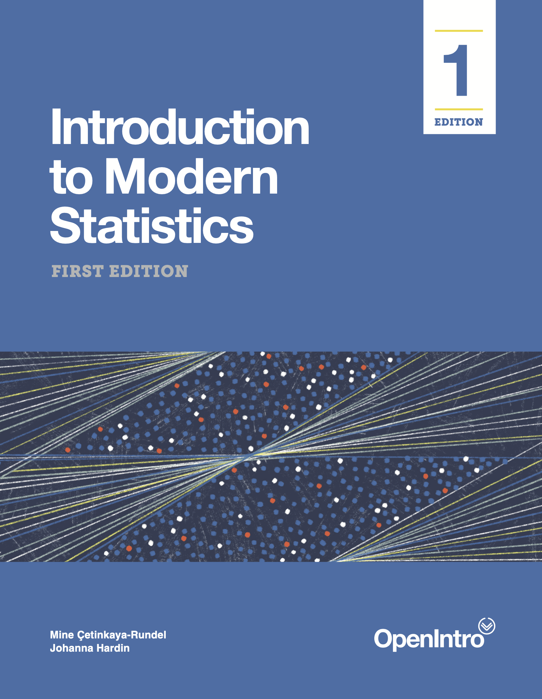

```{r, include = FALSE}
source("_common.R")
```

```{r, include=FALSE}
# automatically create a bib database for R packages
knitr::write_bib(c(.packages(), 
                   'bookdown', 'knitr', 
                   'rmarkdown'), 'packages.bib')
```

::: {.welcome}
```{asis, echo = knitr::is_html_output()}
# Welcome to IMS {.unnumbered}
```

\chapter*{}

\vfill

```{asis, echo = knitr::is_html_output()}
{.cover width="250"}
This is the website for **Introduction to Modern Statistics**, First Edition by Mine Çetinkaya-Rundel and Johanna Hardin. Introduction to Modern Statistics, which we'll refer to as IMS going forward, is a textbook from the [OpenIntro](https://www.openintro.org/) project.

The book will always be available for free here. It is also available in PDF (for free or for the amount you choose to donate to the OpenIntro project) on Leanpub and in black&white paperback for purchase for $20.
<br><br>
<a href="https://leanpub.com/imstat" target="_blank">&nbsp;<strong>Download PDF</strong></a>
<br>
<a href="https://www.openintro.org/go?id=ims1_bw_pb&referrer=/book/ims/online">&nbsp;<strong>Purchase paperback</strong></a>
<br><br>
---
<br><br>
```

```{asis, echo = knitr::is_html_output()}
Copyright &#169; 2021.
```

```{asis, echo = knitr::is_latex_output()}
Copyright $\copyright$ 2021.
```

First Edition.

Version date: `r format(Sys.Date(), "%B %d, %Y")`.

This textbook and its supplements, including slides, labs, and interactive tutorials, may be downloaded for free at\
[**openintro.org/book/ims**](http://openintro.org/book/ims).

This textbook is a derivative of *OpenIntro Statistics* 4th Edition and *Introduction to Statistics with Randomization and Simulation* 1st Edition by Diez, Barr, and Çetinkaya-Rundel, and it's available under a Creative Commons Attribution-ShareAlike 3.0 Unported United States License.
License details are available at the Creative Commons website:\
[**creativecommons.org**](https://www.openintro.org/go/?id=creativecommons_org&referrer=ims1_pdf).

Source files for this book may be found on GitHub at\
[**github.com/openintrostat/ims**](https://github.com/openintrostat/ims).
:::
